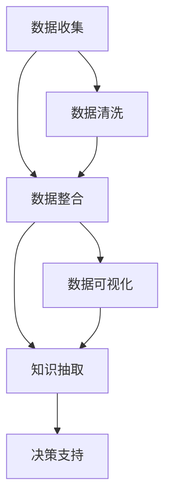

                 

# 信息简化的最佳实践：如何在混乱中建立秩序

> 关键词：信息简化, 数据压缩, 数据清洗, 数据可视化, 知识图谱, 数据仓库

## 1. 背景介绍

### 1.1 问题由来
在当今信息爆炸的时代，数据已经成为驱动业务决策的核心要素。无论是企业内部的业务运营、市场营销、产品研发，还是政府机构的社会治理、政策制定，数据的广泛应用已经深入各行各业。然而，大量纷繁复杂的数据常常使得人们无从下手，如何从数据中提取出有价值的信息，成为了一个亟待解决的问题。

数据简化和信息抽取不仅仅是提升效率的手段，更是一种优化决策、指导实践的关键能力。通过系统化地简化和分析数据，我们可以揭示数据背后的规律，洞察商业趋势，预测未来走向。

### 1.2 问题核心关键点
信息简化的关键在于如何将复杂的数据转化为可操作的洞察。核心点包括：
- 数据收集：收集高质量的数据，确保数据来源的可靠性和多样性。
- 数据清洗：处理缺失值、异常值、重复数据等，保证数据质量。
- 数据整合：对数据进行结构化，构建统一的数据格式，便于后续分析。
- 数据可视化：将数据转化为直观的图形，帮助决策者更好地理解数据。
- 知识抽取：从数据中提取有用的知识，如趋势、模式、关联等。

### 1.3 问题研究意义
信息简化的研究对于提升数据处理效率、优化决策过程、增强商业竞争力具有重要意义：

1. **提升处理效率**：简化后的数据格式和结构化方法可以显著提升数据处理的效率，减少人工操作，降低错误率。
2. **优化决策过程**：通过信息抽取，决策者能够更快速地获取关键洞察，辅助决策过程。
3. **增强商业竞争力**：准确的数据分析和趋势预测能够帮助企业提前布局市场，抢占先机。
4. **提供洞察洞察力**：数据可视化使复杂数据直观可见，提高决策的科学性和精确性。
5. **支持长期规划**：通过长期趋势分析，企业能够制定更合理的战略规划。

## 2. 核心概念与联系

### 2.1 核心概念概述

为更好地理解信息简化的流程和机制，本节将介绍几个关键概念：

- **数据收集**：从不同来源收集数据，包括原始数据、二次数据、公开数据等。
- **数据清洗**：处理数据中的噪声、缺失值、重复数据等，保证数据的完整性和一致性。
- **数据整合**：将来自不同来源的数据整合成统一的数据集，建立数据仓库。
- **数据可视化**：将数据转化为图表、报表等直观形式，便于理解和分析。
- **知识抽取**：通过算法和模型从数据中提取结构化信息，如关联规则、分类、聚类等。

这些概念之间相互联系，形成一个完整的信息简化流程。通过数据收集、清洗、整合，我们可以构建出高质量的数据仓库，再通过数据可视化和知识抽取，进一步提炼出有价值的洞察。

### 2.2 核心概念原理和架构的 Mermaid 流程图



这个流程图展示了信息简化的主要流程和关键节点：

1. **数据收集**：从各种渠道收集数据，为后续处理做准备。
2. **数据清洗**：对收集到的数据进行清洗，处理数据中的噪音和异常。
3. **数据整合**：将清洗后的数据进行整合，构建统一的数据仓库。
4. **数据可视化**：将数据转化为图表和报表，直观展示数据特性。
5. **知识抽取**：从数据中提取有价值的信息，辅助决策支持。

## 3. 核心算法原理 & 具体操作步骤

### 3.1 算法原理概述

信息简化的核心算法原理主要是通过数据清洗和知识抽取来提炼出有价值的洞察。具体来说：

- **数据清洗算法**：主要处理数据中的缺失值、异常值、重复数据等，保证数据的质量和一致性。常用的算法包括：
  - 缺失值处理：通过插值、填补等方法处理缺失数据。
  - 异常值检测：使用统计方法或基于机器学习的方法检测异常值，并进行修正。
  - 数据去重：通过哈希、排序等方法去除重复数据。

- **知识抽取算法**：通过算法和模型从数据中提取有用的知识，如关联规则、分类、聚类等。常用的算法包括：
  - 关联规则学习：通过Apriori、FP-Growth等算法发现数据中的关联规则。
  - 分类算法：如决策树、随机森林、神经网络等，用于对数据进行分类和预测。
  - 聚类算法：如K-Means、DBSCAN等，用于对数据进行聚类和分组。

### 3.2 算法步骤详解

信息简化的具体步骤如下：

#### Step 1: 数据收集
- 从不同渠道收集数据，确保数据来源的多样性和可靠性。
- 根据业务需求确定需要收集的数据类型和数量。

#### Step 2: 数据清洗
- 对收集到的数据进行初步审查，发现缺失值、异常值和重复数据。
- 使用合适的算法和工具处理缺失值，如均值插值、KNN填补等。
- 对异常值进行检测和处理，如使用Z-Score、IQR等方法检测异常，并进行修正或删除。
- 对重复数据进行去重，确保数据的一致性。

#### Step 3: 数据整合
- 将清洗后的数据进行格式统一，建立数据仓库。
- 对数据仓库进行合理设计，包括数据模型、实体关系等。
- 利用ETL工具进行数据导入和整合，如Apache Nifi、Talend等。

#### Step 4: 数据可视化
- 选择合适的可视化工具，如Tableau、Power BI等。
- 设计数据可视化方案，包括图表类型、颜色主题等。
- 使用可视化工具将数据转化为图表和报表，直观展示数据特性。

#### Step 5: 知识抽取
- 根据业务需求选择合适的算法和模型，如关联规则、分类、聚类等。
- 对数据进行预处理，包括特征选择、降维等。
- 训练模型，进行知识抽取，生成有价值的洞察。
- 将抽取出的知识存储到数据仓库，支持后续的分析和决策。

### 3.3 算法优缺点

信息简化的算法有以下优缺点：

#### 优点
1. **提升数据质量**：数据清洗和整合可以提升数据的完整性和一致性，保证数据质量。
2. **优化决策过程**：通过数据可视化和知识抽取，决策者可以更快速地获取关键洞察，辅助决策过程。
3. **提高效率**：简化后的数据格式和结构化方法可以显著提升数据处理的效率，减少人工操作。

#### 缺点
1. **技术门槛高**：数据清洗和知识抽取需要一定的技术背景，对于非专业人员可能较难掌握。
2. **资源消耗大**：数据清洗和知识抽取需要大量的计算资源和时间，可能影响业务流程的及时性。
3. **数据隐私问题**：数据清洗和整合可能涉及到数据隐私和安全问题，需要特别注意。

### 3.4 算法应用领域

信息简化的算法主要应用于以下几个领域：

- **金融行业**：在风险控制、投资分析、客户管理等领域，通过信息简化提升决策效率和准确性。
- **零售行业**：在库存管理、市场营销、客户服务等领域，通过信息简化提升运营效率和客户满意度。
- **医疗行业**：在患者管理、疾病分析、诊疗决策等领域，通过信息简化提升诊疗质量和患者体验。
- **制造业**：在质量控制、供应链管理、产品研发等领域，通过信息简化提升生产效率和产品质量。

## 4. 数学模型和公式 & 详细讲解 & 举例说明

### 4.1 数学模型构建

本节将使用数学语言对信息简化的算法流程进行更加严格的刻画。

假设我们有来自不同渠道的数据集 $D_1, D_2, ..., D_n$，每个数据集包含 $m$ 条记录。我们希望将这些数据整合成一个统一的数据仓库 $W$，并通过可视化工具和知识抽取算法进行简化和分析。

### 4.2 公式推导过程

**Step 1: 数据收集**

设第 $i$ 个数据集 $D_i$ 的记录数为 $m_i$，其中每条记录包含 $n$ 个字段，每个字段的取值范围为 $v$。数据收集的过程可以表示为：

$$
D = \{D_1, D_2, ..., D_n\}
$$

**Step 2: 数据清洗**

设第 $i$ 个数据集 $D_i$ 的清洗后记录数为 $m_i'$，其中每条记录包含 $n$ 个字段，每个字段的取值范围为 $v'$。数据清洗的过程可以表示为：

$$
C = \{C_1, C_2, ..., C_n\}
$$

其中 $C_i = D_i \cap C$，表示第 $i$ 个数据集与第 $i$ 个数据集的交集。

**Step 3: 数据整合**

设数据仓库 $W$ 包含 $k$ 个字段，每个字段的取值范围为 $v''$。数据整合的过程可以表示为：

$$
W = \{W_1, W_2, ..., W_k\}
$$

其中 $W_i = C \cap W$，表示第 $i$ 个字段与数据仓库的交集。

**Step 4: 数据可视化**

设数据可视化工具 $V$ 输出可视化结果 $V_{out}$，其中包括 $k$ 个图表和 $k$ 个报表。数据可视化的过程可以表示为：

$$
V_{out} = V(W)
$$

**Step 5: 知识抽取**

设知识抽取算法 $K$ 输出知识结果 $K_{out}$，其中包括 $m$ 条记录和 $n$ 个字段。知识抽取的过程可以表示为：

$$
K_{out} = K(W)
$$

### 4.3 案例分析与讲解

假设我们有一家电商公司，希望通过信息简化提高营销效果。我们收集了用户购买数据、网站流量数据、广告投放数据等多个渠道的数据，每个数据集包含数千条记录，字段众多。

首先，我们对这些数据进行清洗，处理缺失值、异常值和重复数据，得到清洗后的数据集 $C$。然后，将清洗后的数据整合成一个统一的数据仓库 $W$。

接着，我们使用Tableau进行数据可视化，生成用户购买行为、网站流量趋势、广告投放效果等图表和报表，直观展示数据特性。

最后，我们使用分类算法和关联规则算法对数据进行知识抽取，生成用户购买预测模型和关联规则分析报告，辅助业务决策。

## 5. 项目实践：代码实例和详细解释说明

### 5.1 开发环境搭建

在进行信息简化的实践前，我们需要准备好开发环境。以下是使用Python进行Pandas、NumPy、Matplotlib等库的环境配置流程：

1. 安装Anaconda：从官网下载并安装Anaconda，用于创建独立的Python环境。

2. 创建并激活虚拟环境：
```bash
conda create -n simplify-env python=3.8 
conda activate simplify-env
```

3. 安装依赖库：
```bash
conda install pandas numpy matplotlib scikit-learn scipy tqdm jupyter notebook ipython
```

4. 安装可视化工具：
```bash
conda install plotly seaborn
```

完成上述步骤后，即可在`pytorch-env`环境中开始信息简化的实践。

### 5.2 源代码详细实现

下面我们以金融行业的数据简化为例，给出使用Pandas库对数据进行清洗和可视化的PyTorch代码实现。

首先，定义数据清洗函数：

```python
import pandas as pd
from pandas import DataFrame

def clean_data(data):
    # 处理缺失值
    data = data.dropna()
    
    # 处理异常值
    data = data[abs(data['price'] - data['mean_price']) < 3 * data['price'].std()]
    
    # 处理重复数据
    data = data.drop_duplicates()
    
    return data
```

然后，定义数据可视化函数：

```python
import matplotlib.pyplot as plt
import seaborn as sns

def visualize_data(data, col):
    sns.histplot(data[col], kde=True)
    plt.title(f'Distribution of {col}')
    plt.show()
```

最后，启动数据清洗和可视化的流程：

```python
# 加载数据
data = pd.read_csv('financial_data.csv')

# 清洗数据
cleaned_data = clean_data(data)

# 可视化数据
visualize_data(cleaned_data['price'], 'price')
visualize_data(cleaned_data['return'], 'return')
```

### 5.3 代码解读与分析

让我们再详细解读一下关键代码的实现细节：

**clean_data函数**：
- `dropna`方法：删除包含缺失值的记录。
- `abs(data['price'] - data['mean_price']) < 3 * data['price'].std()`：计算价格数据的异常值，保留数据分布内2倍标准差内的记录，删除异常值。
- `drop_duplicates`方法：删除重复数据。

**visualize_data函数**：
- `sns.histplot`方法：使用Seaborn绘制数据分布图。
- `plt.title`方法：设置图表标题。
- `plt.show`方法：显示图表。

**数据清洗和可视化的流程**：
- 加载数据：使用`pd.read_csv`方法加载CSV文件到Pandas DataFrame。
- 清洗数据：调用`clean_data`函数处理缺失值、异常值和重复数据。
- 可视化数据：调用`visualize_data`函数绘制价格数据和回报数据的分布图。

通过Pandas库，我们可以快速、高效地处理和可视化数据。这仅是信息简化的初步实践，在实际应用中，还需要根据具体任务设计更复杂的清洗和可视化流程。

## 6. 实际应用场景

### 6.1 智能客服系统

信息简化的技术可以广泛应用于智能客服系统的构建。通过清洗和整合客户数据，可以构建出统一的数据仓库，并通过可视化工具和知识抽取算法，实时监测和分析客户行为，提供个性化服务。

具体而言，我们可以收集客户的聊天记录、操作记录、评分记录等多个渠道的数据，进行清洗和整合，得到客户行为数据。然后，使用可视化工具和分类算法对数据进行可视化分析和预测，实时监控客户满意度，优化客服流程。

### 6.2 金融舆情监测

在金融领域，信息简化技术可以用于实时监测舆情，预测市场趋势，辅助投资决策。通过清洗和整合新闻、评论、社交媒体等多渠道的数据，可以得到舆情数据。然后，使用可视化工具和情感分析算法，实时监测舆情变化，预测市场走势，提供投资建议。

### 6.3 个性化推荐系统

信息简化的技术可以应用于个性化推荐系统，通过清洗和整合用户行为数据，得到用户兴趣和偏好。然后，使用可视化工具和协同过滤算法对数据进行可视化分析和推荐，提供个性化推荐服务。

### 6.4 未来应用展望

未来，信息简化的技术将在更多领域得到应用，为各行各业带来变革性影响。

在智慧医疗领域，通过清洗和整合患者数据，可以构建出统一的患者信息库，并通过可视化工具和知识抽取算法，实时监测患者健康状态，提供个性化诊疗建议。

在智能教育领域，通过清洗和整合学生数据，可以构建出统一的学生信息库，并通过可视化工具和知识抽取算法，实时监测学生学习情况，提供个性化学习建议。

在智慧城市治理中，通过清洗和整合城市数据，可以构建出统一的城市信息库，并通过可视化工具和知识抽取算法，实时监测城市运行状态，优化城市管理。

此外，在企业生产、社会治理、文娱传媒等众多领域，信息简化技术也将不断涌现，为各行各业带来新的应用场景和创新模式。

## 7. 工具和资源推荐

### 7.1 学习资源推荐

为了帮助开发者系统掌握信息简化的理论基础和实践技巧，这里推荐一些优质的学习资源：

1. 《Python数据科学手册》系列博文：由知名数据科学家撰写，全面介绍了Python在数据科学中的应用，包括数据清洗、数据可视化等。

2. Kaggle数据科学竞赛：参与Kaggle竞赛，实战练习数据清洗和可视化技能，提升实战能力。

3. Coursera《数据科学导论》课程：由约翰·霍普金斯大学开设的课程，全面介绍数据科学基础知识，包括数据清洗、数据可视化等。

4. IBM Data Science Professional Certificate：IBM提供的在线课程，涵盖数据科学全流程，包括数据收集、数据清洗、数据可视化等。

5. 《Python数据科学手册》书籍：全面介绍Python在数据科学中的应用，包括数据清洗、数据可视化等，是入门数据科学的必读教材。

通过对这些资源的学习实践，相信你一定能够快速掌握信息简化的精髓，并用于解决实际的NLP问题。

### 7.2 开发工具推荐

高效的开发离不开优秀的工具支持。以下是几款用于信息简化的开发常用工具：

1. Pandas：Python的数据分析库，支持快速数据清洗和整合。

2. NumPy：Python的数值计算库，支持高效的数组和矩阵计算。

3. Matplotlib：Python的数据可视化库，支持多种图表绘制。

4. Seaborn：基于Matplotlib的数据可视化库，支持更高级的图表绘制和美观布局。

5. Plotly：Python的数据可视化库，支持交互式图表和动态可视化。

6. Jupyter Notebook：Python的交互式编程环境，支持代码和可视化的混合展示。

合理利用这些工具，可以显著提升信息简化的开发效率，加快创新迭代的步伐。

### 7.3 相关论文推荐

信息简化的研究源于学界的持续研究。以下是几篇奠基性的相关论文，推荐阅读：

1. "A Survey on Data Cleaning and its Impact on Knowledge Discovery and Data Mining"：对数据清洗方法和技术进行了全面的综述，介绍了各种数据清洗算法和工具。

2. "Visualization in Science: Charting a Course from Tabular to Interactive and Multimedia"：探讨了数据可视化在科学研究中的应用，介绍了多种可视化技术和方法。

3. "Knowledge Discovery in Databases: Algorithms and Implementation"：介绍了知识抽取和发现的方法和工具，包括关联规则、分类、聚类等。

4. "Data Cleaning: A Survey of Approaches and Future Directions"：对数据清洗方法和技术进行了全面的综述，介绍了各种数据清洗算法和工具。

5. "Big Data Computing: From Google MapReduce to Machine Learning"：介绍了大数据计算技术和方法，包括数据清洗、数据可视化等。

这些论文代表了大数据处理和信息简化的发展脉络。通过学习这些前沿成果，可以帮助研究者把握学科前进方向，激发更多的创新灵感。

## 8. 总结：未来发展趋势与挑战

### 8.1 总结

本文对信息简化的流程和方法进行了全面系统的介绍。首先阐述了信息简化的背景和意义，明确了数据清洗、数据整合、数据可视化、知识抽取在信息简化中的关键作用。其次，从原理到实践，详细讲解了信息简化的数学模型和核心算法，给出了信息简化的完整代码实例。同时，本文还探讨了信息简化的应用场景，展示了其在金融、零售、医疗等领域的广泛应用。最后，本文精选了信息简化的学习资源和工具，力求为读者提供全方位的技术指引。

通过本文的系统梳理，可以看到，信息简化的技术已经在多个领域得到了广泛应用，极大地提升了数据处理效率和决策质量。未来，随着数据量的不断增长和数据复杂性的不断提升，信息简化的技术也将不断演进，为各行各业带来更深入的应用场景和创新模式。

### 8.2 未来发展趋势

展望未来，信息简化的技术将呈现以下几个发展趋势：

1. **自动化和智能化**：随着AI技术的发展，信息简化的自动化和智能化水平将不断提高，自动化数据清洗和可视化工具将更加普及。
2. **实时性和交互性**：信息简化的实时性和交互性将进一步提升，通过实时数据清洗和可视化，提供更灵活的决策支持。
3. **跨领域融合**：信息简化的技术将与其他AI技术进行更深入的融合，如自然语言处理、机器学习等，形成更全面的数据分析体系。
4. **多模态融合**：信息简化的技术将扩展到多模态数据，支持文本、图像、视频等多种数据类型的清洗和可视化。
5. **隐私保护**：信息简化的过程中，数据隐私和安全性将更加重要，通过数据脱敏和匿名化等手段，保护用户隐私。

这些趋势凸显了信息简化的广阔前景。这些方向的探索发展，必将进一步提升信息简化的技术水平，为各行各业带来更深入的应用场景和创新模式。

### 8.3 面临的挑战

尽管信息简化的技术已经取得了一定的成就，但在迈向更加智能化、普适化应用的过程中，它仍面临着诸多挑战：

1. **技术门槛高**：信息简化的技术需要一定的技术背景，对于非专业人员可能较难掌握。
2. **资源消耗大**：数据清洗和整合需要大量的计算资源和时间，可能影响业务流程的及时性。
3. **数据隐私问题**：数据清洗和整合可能涉及到数据隐私和安全问题，需要特别注意。
4. **数据质量问题**：数据质量直接影响信息简化的效果，需要确保数据的可靠性和多样性。
5. **跨领域融合难度**：信息简化的技术与其他AI技术进行融合时，面临的挑战较多，需要更多实践经验。

### 8.4 未来突破

面对信息简化的挑战，未来的研究需要在以下几个方面寻求新的突破：

1. **自动化和智能化**：开发更加智能化的信息简化工具，如自动化数据清洗和可视化，减少人工操作。
2. **实时性和交互性**：开发实时性更强的信息简化系统，支持实时数据清洗和可视化，提供更灵活的决策支持。
3. **跨领域融合**：开发跨领域融合的信息简化工具，支持多模态数据的清洗和可视化，提供更全面的数据分析体系。
4. **隐私保护**：开发隐私保护的信息简化技术，通过数据脱敏和匿名化等手段，保护用户隐私。
5. **数据质量控制**：开发数据质量控制的工具，确保数据的可靠性和多样性，提高信息简化的效果。

这些研究方向的探索，必将引领信息简化的技术走向更高的台阶，为各行各业带来更深入的应用场景和创新模式。

## 9. 附录：常见问题与解答

**Q1：信息简化是否适用于所有数据类型？**

A: 信息简化主要适用于结构化数据，如表格数据、日志数据等。对于非结构化数据，如文本、图像、视频等，需要进行预处理，转化为结构化数据后才能进行简化。

**Q2：信息简化的流程中，哪些步骤可以自动化？**

A: 数据清洗和可视化可以部分自动化，通过编写脚本和工具实现自动化处理。但数据整合和知识抽取环节，仍需要人工介入和调优。

**Q3：数据清洗和整合中，如何保证数据质量？**

A: 数据质量的控制需要从数据收集、清洗、整合等多个环节进行把控。通过设定数据清洗规则、数据质量指标、数据质量控制工具，可以保证数据质量。

**Q4：信息简化的工具如何选择？**

A: 工具的选择需要根据具体需求和数据类型进行考虑。Pandas适用于结构化数据处理，NumPy适用于数值计算，Matplotlib和Seaborn适用于数据可视化，Plotly适用于交互式可视化。

**Q5：信息简化的未来发展方向是什么？**

A: 信息简化的未来发展方向包括自动化和智能化、实时性和交互性、跨领域融合、隐私保护和数据质量控制等。

通过本文的系统梳理，可以看到，信息简化的技术已经在多个领域得到了广泛应用，极大地提升了数据处理效率和决策质量。未来，随着数据量的不断增长和数据复杂性的不断提升，信息简化的技术也将不断演进，为各行各业带来更深入的应用场景和创新模式。

