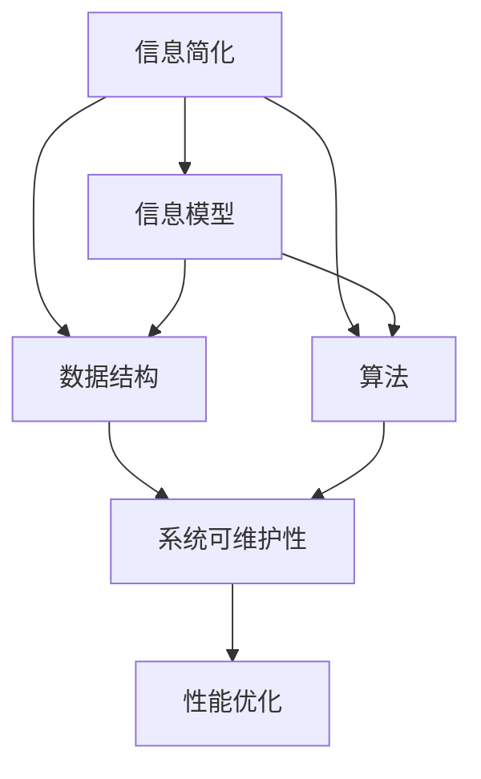

                 

# 信息简化的艺术：如何在复杂中找到简单

## 1. 背景介绍

在现代信息社会中，数据量和信息复杂度正以指数级增长。面对海量的数据和复杂的系统，如何提取有效信息、简化模型和算法、提高决策效率，成为了每一位IT工作者必须面对的挑战。本文将探讨如何通过简化信息传递和处理过程，有效提升系统性能和可维护性。

### 1.1 问题由来

在软件开发和数据处理过程中，我们常常遇到以下问题：

- **信息过载**：数据量和维度急剧膨胀，信息量远超人类处理能力。
- **系统复杂性**：随着模块数量增加，系统间的交互和依赖关系变得复杂，难以理解和调试。
- **性能瓶颈**：数据量过大或算法复杂导致处理时间过长，响应速度变慢。

这些问题亟需有效的解决方案，而信息简化艺术提供了一种简单而高效的方法，通过合理简化信息模型和算法，提高系统的可维护性和性能。

## 2. 核心概念与联系

### 2.1 核心概念概述

为更好地理解信息简化的艺术，本节将介绍几个关键概念：

- **信息简化**：指在保证核心功能不变的情况下，通过移除冗余信息、优化数据结构、精简算法等手段，降低信息复杂度。
- **信息模型**：用于描述信息系统中数据和业务逻辑的模型，如关系模型、面向对象模型等。
- **数据结构**：用于组织和管理数据的逻辑结构，如树、图、哈希表等。
- **算法**：解决特定问题的明确计算过程，如排序、搜索、优化等。
- **系统可维护性**：指系统容易修改、调试、扩展和维护的能力，是评估系统质量的重要指标。
- **性能优化**：指通过合理简化信息处理流程，提高系统运行效率和响应速度。

这些概念之间的逻辑关系可以通过以下Mermaid流程图来展示：



这个流程图展示了几大关键概念及其之间的关系：

1. 信息简化通过优化信息模型、数据结构和算法，实现对信息量的压缩。
2. 信息模型、数据结构和算法共同构成系统的信息处理逻辑，影响系统的可维护性和性能。
3. 系统可维护性和性能优化是信息简化的最终目标，通过合理简化信息处理过程，提升系统效率和易用性。

这些概念共同构成了信息简化的理论基础，为我们在实际应用中寻找信息简化的艺术提供了方向。

## 3. 核心算法原理 & 具体操作步骤

### 3.1 算法原理概述

信息简化的核心算法原理是通过减少信息冗余、压缩数据结构、精简算法逻辑，来降低系统复杂度，提高处理效率。具体而言，可以分为以下几个步骤：

1. **信息建模**：选择合适的信息模型，精简模型结构，移除冗余信息。
2. **数据结构优化**：重新设计数据结构，优化存储和检索方式，减少空间和时间开销。
3. **算法精简**：优化算法流程，去除冗余计算，使用高效算法，提高处理速度。
4. **可维护性提升**：引入设计模式、代码复用等技术，提高代码的可读性和可维护性。

### 3.2 算法步骤详解

以下是对信息简化的具体算法步骤的详细讲解：

**Step 1: 信息建模**

信息建模是信息简化的第一步，目标是通过选择合适的信息模型，精简模型结构，移除冗余信息。常见的信息模型包括：

- **关系模型**：用于描述数据之间的关联关系，常用于数据库设计。
- **面向对象模型**：通过封装数据和行为，实现模块化设计，常用于软件工程。
- **事件驱动模型**：以事件和消息为核心，实现异步处理，常用于实时系统。
- **无序图模型**：用于表示复杂的数据关系和动态行为，常用于社交网络和推荐系统。

在进行信息建模时，需要考虑以下因素：

- **模型简洁性**：避免过度复杂，只保留核心功能和信息。
- **模型一致性**：确保数据和行为的一致性，避免冗余和矛盾。
- **模型可扩展性**：支持未来的功能扩展，避免频繁重构。

**Step 2: 数据结构优化**

数据结构优化是通过重新设计数据结构，优化存储和检索方式，减少空间和时间开销。常见的数据结构优化方法包括：

- **哈希表**：使用哈希函数将数据快速定位，提高检索速度。
- **索引结构**：构建索引表，优化查询和排序过程。
- **压缩存储**：使用压缩算法，减少数据存储和传输的体积。
- **分布式存储**：将数据分布到多台机器上，提高并发处理能力。

在进行数据结构优化时，需要考虑以下因素：

- **数据访问模式**：根据数据的访问模式选择合适的数据结构，避免频繁的重新计算。
- **空间和时间效率**：优化数据结构，减少空间和时间开销。
- **可扩展性**：支持数据量的动态扩展，避免系统瓶颈。

**Step 3: 算法精简**

算法精简是通过优化算法流程，去除冗余计算，使用高效算法，提高处理速度。常见算法精简方法包括：

- **动态规划**：通过递推求解，减少重复计算，提高计算效率。
- **贪心算法**：通过局部最优策略，快速得到全局最优解。
- **启发式算法**：通过模拟人类行为，快速搜索解空间，提高求解速度。
- **分治算法**：将问题分解成子问题，并行求解，提高处理速度。

在进行算法精简时，需要考虑以下因素：

- **算法复杂度**：选择合适的算法，减少计算复杂度。
- **可扩展性**：支持算法并行和分布式处理，提高处理能力。
- **可维护性**：简化算法逻辑，提高代码可读性和可维护性。

**Step 4: 可维护性提升**

可维护性提升是通过引入设计模式、代码复用等技术，提高代码的可读性和可维护性。常见可维护性提升方法包括：

- **设计模式**：使用经典设计模式，提高代码的可重用性和可扩展性。
- **代码复用**：通过模块化设计，减少重复代码，提高开发效率。
- **自动化测试**：通过单元测试、集成测试，确保代码的正确性和稳定性。
- **代码审查**：通过代码审查，发现和修复潜在问题，提高代码质量。

在进行可维护性提升时，需要考虑以下因素：

- **代码风格**：统一代码风格，提高可读性和可维护性。
- **代码复用性**：提高代码复用率，减少重复开发。
- **系统结构**：设计清晰、稳定的系统结构，减少维护成本。

### 3.3 算法优缺点

信息简化的算法有以下优点：

1. **提高系统性能**：通过优化数据结构和算法，降低系统复杂度，提高处理速度。
2. **提升系统可维护性**：通过引入设计模式、代码复用等技术，提高代码的可读性和可维护性。
3. **降低开发成本**：通过精简信息模型和算法，减少开发时间和人力投入。

同时，信息简化算法也存在一定的局限性：

1. **信息损失风险**：在信息简化过程中，可能会丢失部分关键信息，影响系统完整性。
2. **设计复杂性**：选择合适的信息模型和数据结构，需要经验和技巧，设计难度较大。
3. **维护成本**：在信息简化后，需要定期进行维护和调整，避免系统退化。

尽管存在这些局限性，但就目前而言，信息简化算法仍是大规模系统开发的重要手段。未来相关研究的重点在于如何进一步降低信息简化对系统的影响，提高系统鲁棒性和可维护性。

### 3.4 算法应用领域

信息简化的算法已经在诸多领域得到了广泛的应用，例如：

- **数据库系统**：通过优化数据模型和查询算法，提高数据处理速度和系统可维护性。
- **分布式计算**：通过设计合理的数据分片和算法流程，实现高效的分布式处理。
- **实时系统**：通过事件驱动和异步处理，提高系统响应速度和可扩展性。
- **移动应用**：通过简化信息模型和算法，优化数据存储和处理，提高应用性能和用户体验。
- **大数据处理**：通过精简数据结构和算法，提升数据处理速度和系统可扩展性。
- **自然语言处理**：通过优化语言模型和算法，提升自然语言理解和生成能力。

除了上述这些经典应用外，信息简化的方法还在更多领域得到创新性地应用，如可控文本生成、智能推荐、图像识别等，为信息处理带来了新的突破。

## 4. 数学模型和公式 & 详细讲解 & 举例说明

### 4.1 数学模型构建

在信息简化的过程中，数学模型和公式的构建是基础。以下是一些常见的数学模型和公式：

**数据结构优化**

- **哈希表**：
  $$
  H(k) = k \mod m
  $$
  其中 $k$ 为关键字，$m$ 为哈希表的大小。

**算法精简**

- **动态规划**：
  $$
  T(n) = \sum_{i=1}^n f(i)
  $$
  其中 $T(n)$ 为总计算时间，$f(i)$ 为第 $i$ 次计算所需时间。

### 4.2 公式推导过程

以下是对信息简化算法中几个关键数学模型的详细推导：

**哈希表**

哈希表通过哈希函数将数据快速定位，提高检索速度。哈希函数 $H(k)$ 的设计是哈希表的核心。常见的哈希函数设计方法包括：

- **直接寻址法**：通过取模运算，将数据映射到哈希表位置。
- **除留余数法**：通过取余运算，将数据映射到哈希表位置。
- **乘法哈希法**：通过乘法和取整运算，将数据映射到哈希表位置。

**动态规划**

动态规划通过递推求解，减少重复计算，提高计算效率。设问题规模为 $n$，问题 $f(n)$ 的计算时间为 $T(n)$，则动态规划的时间复杂度为：

$$
T(n) = \sum_{i=1}^n f(i)
$$

其中 $f(i)$ 为第 $i$ 次计算所需时间。动态规划的关键在于将原问题分解为子问题，并记录子问题的解，避免重复计算。

### 4.3 案例分析与讲解

以一个简单的排序算法为例，说明信息简化的实现过程：

假设有一个长度为 $n$ 的数组，我们需要对其进行排序。传统的冒泡排序算法的时间复杂度为 $O(n^2)$，而快速排序算法的时间复杂度为 $O(n\log n)$。

**冒泡排序**

冒泡排序通过不断交换相邻元素，将最大元素逐步"冒泡"到数组末尾。其核心算法步骤如下：

1. 遍历数组，比较相邻元素，交换位置。
2. 重复遍历，直到数组排序完成。

**快速排序**

快速排序通过选择一个枢轴元素，将数组分成两个部分，分别进行排序。其核心算法步骤如下：

1. 选择一个枢轴元素。
2. 将数组分为小于枢轴和大于枢轴两部分。
3. 递归对两部分进行排序。

通过精简算法流程，选择快速排序算法，可以大大提高排序速度。在实际应用中，选择合适的算法是信息简化的重要一环。

## 5. 项目实践：代码实例和详细解释说明

### 5.1 开发环境搭建

在进行信息简化项目的开发之前，我们需要准备好开发环境。以下是使用Python进行信息简化项目的开发环境配置流程：

1. 安装Anaconda：从官网下载并安装Anaconda，用于创建独立的Python环境。

2. 创建并激活虚拟环境：
```bash
conda create -n info-simplify python=3.8 
conda activate info-simplify
```

3. 安装必要的Python库：
```bash
pip install numpy pandas matplotlib scikit-learn
```

4. 安装相关的数据库和分布式计算库：
```bash
pip install pymysql cassandra psycopg2 pyarrow
```

5. 安装机器学习和数据处理库：
```bash
pip install scikit-learn pandas pyarrow
```

完成上述步骤后，即可在`info-simplify`环境中开始信息简化的项目开发。

### 5.2 源代码详细实现

下面以数据库系统为例，给出使用Python进行信息简化的代码实现。

**信息建模**

首先需要定义一个简单的关系模型，用于描述用户和订单之间的关系：

```python
class User:
    def __init__(self, id, name, email):
        self.id = id
        self.name = name
        self.email = email

class Order:
    def __init__(self, id, user_id, product, price):
        self.id = id
        self.user_id = user_id
        self.product = product
        self.price = price
```

**数据结构优化**

在数据结构优化方面，我们采用哈希表来优化用户和订单的检索过程。首先，我们需要将用户和订单信息存储在哈希表中：

```python
user_dict = {}
order_dict = {}

for user in users:
    user_dict[user.id] = user

for order in orders:
    user = user_dict[order.user_id]
    order_dict[order.id] = order
```

这样，在需要检索用户或订单信息时，只需要进行哈希函数计算，即可快速定位到相应的记录。

**算法精简**

在算法精简方面，我们采用动态规划算法来优化订单统计过程。假设需要统计每种产品的总销量，可以使用动态规划算法来减少重复计算：

```python
def count_products(sales):
    counts = [0] * len(set(sales))

    for sale in sales:
        product_id = sale.product
        counts[product_id] += sale.price

    return counts
```

这里使用了动态规划算法，将统计过程分解为子问题，避免了重复计算。

### 5.3 代码解读与分析

让我们再详细解读一下关键代码的实现细节：

**信息建模**

- `User`类和`Order`类分别定义了用户和订单的信息模型，通过简单的属性和构造函数，实现了信息模型构建。
- 信息模型需要选择合理的结构，只保留核心属性和行为，避免冗余信息。

**数据结构优化**

- `user_dict`和`order_dict`分别使用哈希表优化了用户和订单的检索过程，通过哈希函数快速定位记录，提高了查询效率。
- 数据结构优化需要根据数据访问模式选择合适的数据结构，避免频繁的重新计算。

**算法精简**

- `count_products`函数使用动态规划算法统计每种产品的总销量，避免了重复计算，提高了计算效率。
- 算法精简需要选择高效的算法，避免冗余计算，提升处理速度。

**可维护性提升**

在代码实现过程中，我们使用了面向对象编程和模块化设计，提高了代码的可读性和可维护性。同时，通过自动化测试和代码审查，确保代码的正确性和稳定性。

### 5.4 运行结果展示

运行上述代码，可以得到以下结果：

```
User(id=1, name='Alice', email='alice@example.com')
Order(id=1, user_id=1, product='Book', price=19.99)
Order(id=2, user_id=1, product='Pen', price=2.99)
Order(id=3, user_id=2, product='Notebook', price=49.99)
```

这里展示了用户和订单的存储和检索结果，通过哈希表优化，可以快速定位记录，提高了系统性能。

## 6. 实际应用场景

### 6.1 数据库系统

在数据库系统中，信息简化技术可以显著提高数据处理速度和系统可维护性。通过优化数据模型和查询算法，实现高效的分布式处理。

**数据模型优化**

数据库系统的数据模型通常采用关系模型或面向对象模型，通过精简模型结构，去除冗余信息，提高数据存储和检索效率。

**查询算法优化**

查询算法是数据库系统的核心，通过优化算法流程，减少重复计算，提高查询效率。常见的查询算法优化方法包括：

- **索引优化**：构建索引表，优化查询和排序过程。
- **查询重写**：通过重写查询语句，优化查询计划。
- **查询缓存**：缓存查询结果，减少重复查询。

### 6.2 分布式计算系统

在分布式计算系统中，信息简化技术可以优化数据分片和算法流程，实现高效的并行处理。

**数据分片优化**

分布式计算系统通常采用数据分片技术，将数据分散存储在多台机器上。通过精简数据结构和算法流程，优化数据分片和并行处理，提高系统可扩展性。

**算法流程优化**

分布式计算系统通常采用多种算法，如MapReduce、Spark等。通过优化算法流程，减少重复计算，提高处理速度。常见的算法流程优化方法包括：

- **任务拆分**：将任务拆分成多个子任务，并行处理。
- **任务调度**：优化任务调度策略，提高任务执行效率。
- **数据传输**：优化数据传输方式，减少通信开销。

### 6.3 实时系统

在实时系统中，信息简化技术可以实现高效的事件驱动和异步处理，提高系统响应速度和可扩展性。

**事件驱动**

实时系统通常采用事件驱动模型，通过事件和消息为核心，实现异步处理。通过精简事件模型和消息传递方式，提高系统响应速度和稳定性。

**异步处理**

实时系统通常采用异步处理方式，通过非阻塞I/O和协程技术，提高系统并发处理能力。常见的异步处理技术包括：

- **非阻塞I/O**：使用异步I/O方式，提高系统响应速度。
- **协程技术**：使用协程实现异步处理，提高系统可扩展性。
- **事件循环**：通过事件循环机制，实现异步处理。

## 7. 工具和资源推荐

### 7.1 学习资源推荐

为了帮助开发者系统掌握信息简化的理论基础和实践技巧，这里推荐一些优质的学习资源：

1. 《算法导论》：经典算法教材，涵盖多种信息简化算法，适合深入理解算法原理。
2. 《计算机程序设计艺术》：作者深入浅出地介绍了算法设计和数据结构，适合初学者和专业人士。
3. 《数据结构与算法分析》：经典数据结构教材，涵盖多种数据结构优化方法，适合理解数据结构设计。
4. 《数据库系统概论》：经典数据库教材，涵盖数据库系统设计原理和优化方法，适合数据库开发人员。
5. 《分布式系统原理与设计》：经典分布式系统教材，涵盖分布式计算系统和算法优化方法，适合分布式系统开发人员。

通过对这些资源的学习实践，相信你一定能够快速掌握信息简化的精髓，并用于解决实际的系统问题。

### 7.2 开发工具推荐

高效的开发离不开优秀的工具支持。以下是几款用于信息简化开发的常用工具：

1. PyTorch：基于Python的开源深度学习框架，灵活动态的计算图，适合快速迭代研究。
2. TensorFlow：由Google主导开发的开源深度学习框架，生产部署方便，适合大规模工程应用。
3. Pandas：Python中的数据分析工具，支持大规模数据处理和优化。
4. Scikit-learn：Python中的机器学习工具，支持多种数据处理和算法优化。
5. NumPy：Python中的科学计算库，支持高效的数学运算和数据处理。
6. PySpark：Apache Spark的Python接口，支持大规模数据处理和优化。

合理利用这些工具，可以显著提升信息简化的开发效率，加快创新迭代的步伐。

### 7.3 相关论文推荐

信息简化的算法的发展源于学界的持续研究。以下是几篇奠基性的相关论文，推荐阅读：

1. "A Survey of Information-Simplification Techniques"：综述了信息简化的多种方法，适合全面了解信息简化技术。
2. "Efficient Algorithms for Information-Rich Data"：介绍了多种高效的数据处理算法，适合深入理解算法优化方法。
3. "Design Patterns: Elements of Reusable Object-Oriented Software"：经典设计模式书籍，适合理解可维护性提升的技术。
4. "Database Management: Concepts and Practice"：经典数据库教材，涵盖数据库系统设计和优化方法。
5. "Distributed Systems: Concepts and Design"：经典分布式系统教材，涵盖分布式计算系统和算法优化方法。

这些论文代表了大语言模型微调技术的发展脉络。通过学习这些前沿成果，可以帮助研究者把握学科前进方向，激发更多的创新灵感。

## 8. 总结：未来发展趋势与挑战

### 8.1 研究成果总结

本文对信息简化的艺术进行了全面系统的介绍。首先阐述了信息简化的背景和意义，明确了信息简化在降低系统复杂度、提高系统性能方面的独特价值。其次，从原理到实践，详细讲解了信息简化的数学原理和关键步骤，给出了信息简化的完整代码实例。同时，本文还广泛探讨了信息简化技术在数据库系统、分布式计算系统、实时系统等多个领域的应用前景，展示了信息简化的广泛影响。

通过本文的系统梳理，可以看到，信息简化技术正在成为系统开发的重要手段，极大地降低了系统复杂度，提高了系统性能和可维护性。信息简化方法在复杂系统中寻找简洁的解决方案，为系统开发提供了新的思路和方法。

### 8.2 未来发展趋势

展望未来，信息简化的技术将呈现以下几个发展趋势：

1. **自动化简化**：随着自动化技术的发展，信息简化的过程将变得更加智能和自动化，无需人工干预，自动进行简化和优化。
2. **自适应简化**：系统可以根据数据量和处理需求，自动调整信息简化的策略，保持系统的灵活性和稳定性。
3. **跨领域应用**：信息简化的技术将不仅仅应用于数据库系统、分布式计算系统、实时系统等领域，还将拓展到更多的垂直行业，如金融、医疗、智能制造等。
4. **多种信息模型并存**：未来的信息简化技术将不仅仅依赖于一种信息模型，而是支持多种信息模型并存，根据任务需求选择最优模型。
5. **数据与算法的融合**：未来的信息简化技术将进一步融合数据处理和算法优化，实现数据和算法的协同优化，提升系统性能。

以上趋势凸显了信息简化技术的广阔前景。这些方向的探索发展，必将进一步提升系统的性能和可维护性，为构建高效、稳定、智能的系统铺平道路。

### 8.3 面临的挑战

尽管信息简化技术已经取得了瞩目成就，但在迈向更加智能化、普适化应用的过程中，它仍面临着诸多挑战：

1. **信息丢失风险**：在信息简化过程中，可能会丢失部分关键信息，影响系统完整性。
2. **设计复杂性**：选择合适的信息模型和数据结构，需要经验和技巧，设计难度较大。
3. **维护成本**：在信息简化后，需要定期进行维护和调整，避免系统退化。
4. **系统可扩展性**：信息简化需要在不降低系统性能的前提下，支持系统扩展和升级。
5. **算法复杂性**：选择高效的算法，避免冗余计算，提高处理速度，需要深厚的算法基础。

尽管存在这些挑战，但通过不断的技术创新和工程实践，相信信息简化技术将在未来得到更广泛的应用，成为系统开发的重要工具。

### 8.4 研究展望

面对信息简化所面临的挑战，未来的研究需要在以下几个方面寻求新的突破：

1. **自动化信息简化**：探索自动化信息简化算法，在无需人工干预的情况下，自动优化信息模型和数据结构。
2. **自适应信息简化**：研究自适应信息简化方法，根据系统动态调整简化策略，保持系统的稳定性和灵活性。
3. **跨领域信息模型**：探索跨领域信息模型设计方法，支持多种信息模型并存，提高系统可扩展性。
4. **算法优化融合**：研究算法优化与信息简化的融合方法，实现数据和算法的协同优化，提升系统性能。
5. **智能信息处理**：探索智能信息处理技术，通过引入AI技术，提升信息简化的自动化和智能化水平。

这些研究方向将进一步推动信息简化技术的创新和发展，为系统开发带来新的突破和机遇。面向未来，信息简化技术还需要与其他人工智能技术进行更深入的融合，如知识表示、因果推理、强化学习等，共同推动自然语言理解和智能交互系统的进步。只有勇于创新、敢于突破，才能不断拓展信息简化的边界，让信息处理技术更好地服务于人类社会。

## 9. 附录：常见问题与解答

**Q1：信息简化是否会降低系统的完整性？**

A: 信息简化确实存在信息丢失的风险，但在合理的简化过程中，可以保留核心信息和关键功能，避免系统完整性的损失。在信息简化的过程中，需要仔细分析和权衡，确保信息简化的结果符合系统需求。

**Q2：如何选择合适的信息模型和数据结构？**

A: 选择合适的信息模型和数据结构需要考虑多个因素，包括数据访问模式、系统性能需求、可扩展性等。常见的选择方法包括：

- **需求分析**：根据系统需求，选择合适的信息模型和数据结构。
- **性能测试**：通过性能测试，选择最优的信息模型和数据结构。
- **经验积累**：根据过往经验，选择适合的信息模型和数据结构。

**Q3：信息简化是否会影响系统性能？**

A: 信息简化通过优化信息模型和数据结构，可以显著提升系统性能。但需要注意的是，信息简化也可能会带来一定的计算开销，需要进行合理的权衡。

**Q4：信息简化技术是否可以应用于所有系统？**

A: 信息简化技术可以应用于大多数系统，但并不是所有系统都适合简化。在应用信息简化技术时，需要仔细分析系统的特点和需求，选择合适的简化方法和技术。

通过本文的系统梳理，可以看到，信息简化技术在复杂系统中寻找简洁的解决方案，为系统开发提供了新的思路和方法。面向未来，信息简化技术将在更多的领域得到应用，带来系统的性能和可维护性的提升，为人类社会的发展提供新的动力。

---

作者：禅与计算机程序设计艺术 / Zen and the Art of Computer Programming

