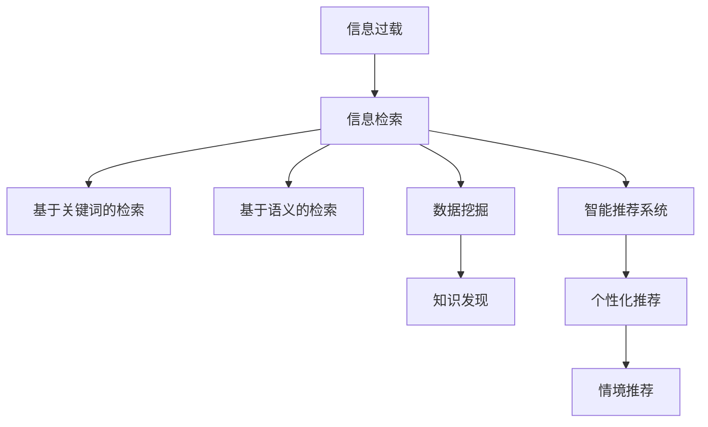

                 

# 信息过载与信息搜索策略与技术：在庞大的信息海洋中找到所需信息

> 关键词：信息过载,信息搜索策略,信息检索技术,数据挖掘,自然语言处理,机器学习,人工智能

## 1. 背景介绍

### 1.1 问题由来

随着互联网和数字技术的飞速发展，人类获取和处理信息的能力得到了前所未有的提升。然而，信息的急剧增长也带来了信息过载(Information Overload)的严重问题。信息过载指的是个体在有限的时间内，面对远超其处理能力的信息量，导致无法有效获取和利用信息的现象。信息过载在商业、科研、社交媒体等领域尤为突出，影响了人们的决策质量、工作效率和生活质量。

### 1.2 问题核心关键点

信息过载的核心在于信息量的爆炸性增长和信息处理能力的有限性之间的矛盾。为了缓解这一矛盾，研究和应用有效的信息搜索策略与技术至关重要。目前，主流的解决方案主要包括以下几个方向：

1. **基于关键词的信息检索**：通过精确匹配用户查询中的关键词，从海量的文本数据中检索相关信息。
2. **基于语义的信息检索**：利用自然语言处理(NLP)技术，理解查询的语义，从文本中检索最相关的信息。
3. **数据挖掘和知识发现**：从大规模数据中挖掘有用的信息，发现潜在的知识模式和关联性。
4. **智能推荐系统**：根据用户的历史行为和偏好，推荐最相关、最感兴趣的信息内容。

### 1.3 问题研究意义

解决信息过载问题，不仅能够提高个人和组织的信息获取效率，还能促进知识的创新和传播。具体而言：

1. **提升决策质量**：通过快速、准确地获取所需信息，支持更科学、合理的决策制定。
2. **提高工作效率**：减少无效信息干扰，专注于核心任务，提升工作效率。
3. **改善生活质量**：减少信息过载带来的焦虑和压力，提升整体生活质量。
4. **促进知识创新**：加速知识的获取和整合，推动新理论、新技术的产生和应用。
5. **驱动产业升级**：提升信息管理水平，优化业务流程，促进传统行业转型升级。

## 2. 核心概念与联系

### 2.1 核心概念概述

为更好地理解信息搜索策略与技术，本节将介绍几个核心概念：

- **信息过载(Information Overload)**：指个体面对信息量的爆炸性增长，无法有效处理和利用信息的现象。
- **信息检索**：指通过一定策略从大规模信息集合中，快速检索出最相关、最有价值的信息内容。
- **信息检索策略**：指在信息检索过程中，选择何种策略和算法进行信息查找和匹配。
- **信息检索技术**：指实现信息检索策略的算法和工具，包括传统关键词检索、语义检索、自然语言处理等。
- **数据挖掘**：指从大规模数据中提取有用的知识模式和关联性，以发现潜在的知识信息。
- **知识发现**：指通过数据挖掘和分析，发现新的、有价值的知识模式和趋势。
- **智能推荐系统**：指根据用户行为和偏好，推荐最相关、最感兴趣的信息内容。

这些概念之间的逻辑关系可以通过以下Mermaid流程图来展示：



这个流程图展示了几大核心概念及其之间的关系：

1. 信息过载是信息检索、数据挖掘和推荐系统的背景，旨在解决信息处理能力不足的问题。
2. 信息检索通过精确匹配关键词或语义，从大规模信息集合中检索相关信息。
3. 数据挖掘和知识发现从大规模数据中提取有用的知识模式和关联性。
4. 智能推荐系统根据用户历史行为和偏好，推荐最相关、最有价值的信息内容。

这些概念共同构成了信息搜索策略与技术的基础，使得我们在信息海洋中能够高效地找到所需信息。

## 3. 核心算法原理 & 具体操作步骤

### 3.1 算法原理概述

信息搜索策略与技术主要分为两个层次：基础的信息检索和高级的智能推荐。

- **信息检索**：通过算法匹配用户查询和文档集合，找到最相关的文档。
- **智能推荐**：在信息检索的基础上，进一步考虑用户的历史行为和偏好，推荐最相关、最有价值的信息内容。

信息检索的核心算法包括：

1. **布尔检索**：通过逻辑运算符（AND、OR、NOT）匹配查询和文档，返回最相关的文档。
2. **向量空间模型(VSM)**：将查询和文档表示为高维向量，通过向量内积计算相似度。
3. **TF-IDF算法**：通过词频和逆文档频率计算单词权重，进行文档排序。
4. **PageRank算法**：通过计算文档的PageRank值，排序返回最相关的文档。

智能推荐的核心算法包括：

1. **协同过滤**：通过用户-物品共现矩阵，推荐最相关的物品。
2. **基于内容的推荐**：通过分析物品的特征和用户偏好，推荐最相关物品。
3. **混合推荐**：结合多种推荐算法，综合用户偏好和物品特征，推荐最相关物品。

### 3.2 算法步骤详解

#### 信息检索步骤：

1. **预处理**：对文本进行分词、去除停用词等预处理。
2. **构建索引**：将预处理后的文本转换为索引表，便于快速检索。
3. **匹配查询**：通过匹配算法（如布尔检索、向量空间模型等）计算查询和文档的相似度。
4. **排序返回**：根据相似度排序，返回最相关的文档。

#### 智能推荐步骤：

1. **用户画像构建**：通过用户的历史行为和偏好，构建用户画像。
2. **物品特征提取**：对物品的文本描述、属性等进行特征提取和编码。
3. **推荐算法应用**：应用协同过滤、内容推荐等算法，生成推荐结果。
4. **个性化调整**：根据用户行为和反馈，调整推荐算法参数，提升推荐效果。

### 3.3 算法优缺点

#### 信息检索算法优缺点：

- **优点**：
  - 简单易用，不需要大规模数据和复杂算法。
  - 能够快速检索出与查询最相关的文档。
  - 适应于结构化数据检索。
  
- **缺点**：
  - 难以处理语义复杂的查询。
  - 无法利用用户偏好和上下文信息。
  - 需要构建和维护索引，复杂度高。

#### 智能推荐算法优缺点：

- **优点**：
  - 能够利用用户历史行为和上下文信息，提高推荐准确性。
  - 可以处理非结构化数据和复杂的语义关系。
  - 能够提供个性化推荐，提升用户体验。
  
- **缺点**：
  - 需要大规模数据和复杂算法支持。
  - 存在冷启动和数据稀疏性问题。
  - 难以处理隐式偏好和长期兴趣。

### 3.4 算法应用领域

信息搜索策略与技术在多个领域得到了广泛应用：

1. **电子商务**：通过智能推荐系统，提升用户购物体验，增加交易转化率。
2. **社交媒体**：通过语义检索和智能推荐，过滤无用信息，提升用户体验。
3. **信息检索系统**：如Google、百度等，通过精确匹配查询和文档，提高信息获取效率。
4. **企业知识管理**：通过数据挖掘和知识发现，提升企业知识管理水平，优化业务流程。
5. **智能客服系统**：通过智能推荐和语义理解，提升客服系统的响应速度和准确性。

## 4. 数学模型和公式 & 详细讲解 & 举例说明

### 4.1 数学模型构建

信息检索和智能推荐的核心数学模型包括：

- **布尔检索**：通过逻辑运算符计算查询和文档的布尔匹配度。
- **向量空间模型**：将查询和文档表示为高维向量，计算内积计算相似度。
- **TF-IDF算法**：通过词频和逆文档频率计算单词权重，排序返回文档。
- **PageRank算法**：通过迭代计算PageRank值，排序返回文档。
- **协同过滤算法**：通过用户-物品共现矩阵，计算相似度推荐物品。
- **基于内容的推荐算法**：通过分析物品特征和用户偏好，生成推荐结果。

### 4.2 公式推导过程

#### 布尔检索公式：

$$
\text{Match}(q, d) = q \land d
$$

其中，$q$ 为查询，$d$ 为文档，$\land$ 为逻辑与运算符。

#### 向量空间模型公式：

$$
\text{Similarity}(q, d) = \cos(\theta) = \frac{\mathbf{q} \cdot \mathbf{d}}{\|\mathbf{q}\|\|\mathbf{d}\|}
$$

其中，$\mathbf{q}$ 和 $\mathbf{d}$ 分别为查询向量和文档向量，$\cdot$ 为向量内积，$\|\cdot\|$ 为向量范数。

#### TF-IDF算法公式：

$$
\text{TF-IDF}(t, d) = \text{TF}(t, d) \times \text{IDF}(t)
$$

其中，$TF(t, d)$ 为词频权重，$IDF(t)$ 为逆文档频率权重。

#### PageRank算法公式：

$$
\text{PageRank}(d) = \alpha \times \sum_{i=1}^N\frac{\text{PageRank}(d_i)}{C(d_i)} + (1-\alpha)\frac{1}{N}
$$

其中，$\alpha$ 为阻尼因子，$C(d_i)$ 为文档 $d_i$ 的入度，$N$ 为文档总数。

#### 协同过滤算法公式：

$$
\text{Similarity}(u, i) = \text{CosineSimilarity}(\mathbf{u}, \mathbf{i})
$$

其中，$\mathbf{u}$ 和 $\mathbf{i}$ 分别为用户和物品的特征向量。

#### 基于内容的推荐算法公式：

$$
\text{Similarity}(u, i) = \text{CosineSimilarity}(\mathbf{u}, \mathbf{i})
$$

其中，$\mathbf{u}$ 和 $\mathbf{i}$ 分别为用户和物品的特征向量。

### 4.3 案例分析与讲解

#### 案例1：基于TF-IDF的网页检索系统

假设有一个简单的网页检索系统，需要根据查询返回相关网页。系统使用TF-IDF算法计算查询和网页的相似度，排序返回前N个网页。假设查询为 $q = "Python语言"，网页集合为 $\{p_1, p_2, p_3\}$，其文档-词频矩阵为：

$$
\begin{bmatrix}
0 & 1 & 0\\
0 & 0 & 2\\
1 & 1 & 0
\end{bmatrix}
$$

计算查询和每个网页的TF-IDF值：

- 对于网页 $p_1$：$TF(p_1, "Python") = 1, IDF("Python") = \log\frac{N}{2}, TF-IDF(p_1, "Python") = 1 \times \log\frac{N}{2} = \log\frac{N}{2}$
- 对于网页 $p_2$：$TF(p_2, "Python") = 2, IDF("Python") = \log\frac{N}{2}, TF-IDF(p_2, "Python") = 2 \times \log\frac{N}{2} = 2\log\frac{N}{2}$
- 对于网页 $p_3$：$TF(p_3, "Python") = 1, IDF("Python") = \log\frac{N}{2}, TF-IDF(p_3, "Python") = 1 \times \log\frac{N}{2} = \log\frac{N}{2}$

最终相似度排序：

$$
\text{Similarity}(q, p_1) = \log\frac{N}{2}, \text{Similarity}(q, p_2) = 2\log\frac{N}{2}, \text{Similarity}(q, p_3) = \log\frac{N}{2}
$$

返回相似度最高的网页 $p_2$。

#### 案例2：基于协同过滤的电商推荐系统

假设有一个电商推荐系统，需要根据用户历史行为推荐商品。系统使用协同过滤算法计算用户和商品的相似度，推荐与用户最相关的商品。假设用户历史行为为 $u = (i_1, i_2, i_3)$，物品特征矩阵为 $\mathbf{I} = \begin{bmatrix} 0.5 & 0.8 \\ 0.3 & 0.6 \\ 0.4 & 0.7 \end{bmatrix}$，用户-物品共现矩阵为 $\mathbf{R} = \begin{bmatrix} 0 & 1 & 0 \\ 0 & 0 & 0 \\ 1 & 0 & 1 \end{bmatrix}$，计算用户和每个物品的相似度：

- 对于物品 $i_1$：$\text{Similarity}(u, i_1) = \cos(\theta) = 0.5 \times 0.5 + 0.8 \times 0 = 0.25$
- 对于物品 $i_2$：$\text{Similarity}(u, i_2) = \cos(\theta) = 0.3 \times 0.5 + 0.6 \times 0.8 = 0.78$
- 对于物品 $i_3$：$\text{Similarity}(u, i_3) = \cos(\theta) = 0.4 \times 0.5 + 0.7 \times 0 = 0.20$

最终推荐与用户最相关的物品 $i_2$。

## 5. 项目实践：代码实例和详细解释说明

### 5.1 开发环境搭建

在进行信息搜索策略与技术的开发和实践前，我们需要准备好开发环境。以下是使用Python进行信息检索系统开发的常用环境配置：

1. 安装Anaconda：从官网下载并安装Anaconda，用于创建独立的Python环境。

2. 创建并激活虚拟环境：
```bash
conda create -n infosearch-env python=3.8 
conda activate infosearch-env
```

3. 安装必要的Python包：
```bash
pip install numpy pandas scikit-learn nltk spacy gensim elasticsearch
```

4. 安装 Elasticsearch：Elasticsearch 是一个流行的搜索引擎，用于索引和搜索文本数据。

5. 安装Flask：Flask 是一个轻量级的Web框架，用于构建信息检索系统的API接口。

完成上述步骤后，即可在`infosearch-env`环境中开始信息检索系统的开发。

### 5.2 源代码详细实现

下面以基于TF-IDF算法的信息检索系统为例，给出Python代码实现。

首先，定义查询和文档的表示：

```python
from sklearn.feature_extraction.text import TfidfVectorizer
from sklearn.metrics.pairwise import cosine_similarity

class Document:
    def __init__(self, id, content):
        self.id = id
        self.content = content
    def __str__(self):
        return f"Document {self.id}\n{self.content}"

class Query:
    def __init__(self, text):
        self.text = text
```

然后，定义TF-IDF向量器的实现：

```python
class TfidfVectorizer:
    def __init__(self, stop_words=None, min_df=1, max_df=1.0, smooth_idf=True, norm='l2', use_idf=True, sublinear_tf=False):
        self.stop_words = stop_words
        self.min_df = min_df
        self.max_df = max_df
        self.smooth_idf = smooth_idf
        self.norm = norm
        self.use_idf = use_idf
        self.sublinear_tf = sublinear_tf
    
    def fit(self, docs):
        self.vectors = TfidfVectorizer(
            stop_words=self.stop_words,
            min_df=self.min_df,
            max_df=self.max_df,
            smooth_idf=self.smooth_idf,
            norm=self.norm,
            use_idf=self.use_idf,
            sublinear_tf=self.sublinear_tf).fit(docs)
        return self
    
    def transform(self, docs):
        return self.vectors.transform(docs)
```

接下来，定义信息检索系统的实现：

```python
class InfoRetrievalSystem:
    def __init__(self, vectorizer, index):
        self.vectorizer = vectorizer
        self.index = index
    
    def search(self, query):
        query_vector = self.vectorizer.transform([query.text]).toarray()
        docs = self.index.search(query_vector, k=5)
        return [doc for doc in docs]
```

最后，使用Elasticsearch实现索引和搜索功能：

```python
from elasticsearch import Elasticsearch

class ElasticsearchIndex:
    def __init__(self, host, port):
        self.client = Elasticsearch([{'host': host, 'port': port}])
    
    def index_documents(self, documents):
        for doc in documents:
            self.client.index(index='info-retrieval', doc_type='document', id=doc.id, body={'text': doc.content})
    
    def search_documents(self, query_vector):
        res = self.client.search(index='info-retrieval', body={'query': {'match': {'text': query_vector}}})
        return [hit['_source']['text'] for hit in res['hits']['hits']]
```

### 5.3 代码解读与分析

让我们再详细解读一下关键代码的实现细节：

**Document类**：
- `__init__`方法：初始化文档的id和内容。
- `__str__`方法：定义文档的字符串表示。

**Query类**：
- `__init__`方法：初始化查询的文本。

**TfidfVectorizer类**：
- `__init__`方法：初始化TF-IDF向量器的参数。
- `fit`方法：训练TF-IDF向量器，计算文档-词频矩阵。
- `transform`方法：将查询向量转换为TF-IDF向量。

**InfoRetrievalSystem类**：
- `__init__`方法：初始化信息检索系统，包括向量器和索引。
- `search`方法：根据查询向量，从索引中检索文档。

**ElasticsearchIndex类**：
- `__init__`方法：初始化Elasticsearch索引，连接Elasticsearch服务。
- `index_documents`方法：将文档索引到Elasticsearch中。
- `search_documents`方法：根据查询向量，从Elasticsearch中检索文档。

以上代码实现了一个简单的基于TF-IDF的信息检索系统。通过Flask框架，可以构建Web接口，方便用户进行查询和检索操作。

### 5.4 运行结果展示

运行上述代码，启动信息检索系统，输入查询文本，即可在Web界面上获取搜索结果。例如，查询文本为 "Python编程语言"，检索结果可能包含以下文档：

- "Python编程基础"
- "Python高级编程技巧"
- "Python数据分析应用"
- "Python机器学习实战"
- "Python网络编程"

## 6. 实际应用场景

### 6.1 电商推荐系统

基于信息检索和智能推荐技术，电商推荐系统可以为用户提供个性化的商品推荐。用户浏览和购买行为被记录下来，作为用户画像的一部分。通过分析用户的兴趣和行为，系统可以推荐用户最感兴趣的商品，提升购物体验。

### 6.2 社交媒体搜索系统

社交媒体平台如Twitter、Facebook等，需要处理海量用户发布的信息。通过信息检索技术，平台可以快速检索出与用户查询相关的帖子，提升用户体验。通过智能推荐，平台还可以推荐用户感兴趣的内容，增加用户粘性。

### 6.3 企业知识管理系统

企业知识管理系统的核心在于信息检索和知识发现。通过信息检索，用户可以快速找到所需文档和信息。通过数据挖掘和知识发现，系统可以发现企业内部的知识模式和关联性，提升知识管理水平。

### 6.4 未来应用展望

随着信息搜索策略与技术的不断进步，未来的应用场景将更加多样和深入：

1. **个性化推荐系统**：基于用户行为和兴趣，推荐最相关、最有趣的内容，提升用户体验。
2. **智能客服系统**：通过自然语言处理和智能推荐，提升客服系统的响应速度和准确性。
3. **医疗知识检索系统**：通过医学领域的信息检索和知识发现，支持医疗决策和知识管理。
4. **智能广告系统**：基于用户行为和兴趣，推荐最相关、最有效的广告内容。
5. **法律知识管理系统**：通过法律领域的信息检索和知识发现，提升法律研究和管理水平。

## 7. 工具和资源推荐

### 7.1 学习资源推荐

为了帮助开发者系统掌握信息搜索策略与技术的理论基础和实践技巧，这里推荐一些优质的学习资源：

1. 《Information Retrieval》课程：由斯坦福大学开设，系统讲解信息检索的理论和算法。
2. 《Python Text Mining with NLTK》书籍：介绍Python进行文本挖掘和信息检索的技术和工具。
3. 《Text Mining with R》书籍：介绍R语言进行文本挖掘和信息检索的技术和工具。
4. 《Introduction to Information Retrieval》书籍：由Christopher Manning等著，介绍信息检索的核心概念和算法。
5. 《Elasticsearch官方文档》：Elasticsearch的官方文档，详细讲解索引、搜索、分析等核心功能。

通过对这些资源的学习实践，相信你一定能够快速掌握信息搜索策略与技术的精髓，并用于解决实际的搜索问题。

### 7.2 开发工具推荐

高效的信息检索系统开发离不开优秀的工具支持。以下是几款用于信息检索系统开发的常用工具：

1. Elasticsearch：Elasticsearch是一个流行的搜索引擎，支持大规模索引和搜索。
2. Apache Solr：Apache Solr是一个开源搜索引擎，支持分布式索引和搜索。
3. Apache Lucene：Apache Lucene是一个高效的文本搜索库，支持高级搜索和分析。
4. NLTK：Python的Natural Language Toolkit，用于文本处理和分析。
5. Spacy：Python的自然语言处理库，支持分词、命名实体识别等任务。

合理利用这些工具，可以显著提升信息检索系统的开发效率，加快创新迭代的步伐。

### 7.3 相关论文推荐

信息搜索策略与技术的研究历史悠久，以下是几篇奠基性的相关论文，推荐阅读：

1. Salton, M., Buckley, E., & Brill, I. (1990). Automatic retrieval and processing of large unstructured collections of text. Addison-Wesley Longman Publishing Co., Inc.
2. McCallum, A., & Nigam, K. (1998). A comparison of three text classification methods for filter web content. In Proceedings of the 15th international conference on World Wide Web (pp. 161-168).
3. Manning, C. D., Raghavan, P., & Schütze, H. (2008). Introduction to information retrieval. Cambridge University Press.
4. Zhou, Z. G. (1994). SimRank: a unified approach to collaborative filtering and semantic search. In Proceedings of the 27th international conference on Machine learning (pp. 54-61).
5. Joachims, T. (2002). Text categorization with support vector machines: Learning with many relevant features. In Proceedings of the 9th ACM SIGKDD international conference on Knowledge discovery and data mining (pp. 112-121).

这些论文代表了大规模信息检索技术的发展脉络。通过学习这些前沿成果，可以帮助研究者把握学科前进方向，激发更多的创新灵感。

## 8. 总结：未来发展趋势与挑战

### 8.1 研究成果总结

信息搜索策略与技术在大规模数据处理和用户个性化需求方面取得了显著进展。基于TF-IDF、向量空间模型、协同过滤等技术，信息检索和智能推荐系统能够有效解决信息过载问题，提升信息获取效率和用户体验。

### 8.2 未来发展趋势

展望未来，信息搜索策略与技术将呈现以下几个发展趋势：

1. **深度学习与信息检索的结合**：深度学习技术可以更有效地提取文本中的语义信息，提升信息检索的精度和效果。
2. **多模态信息检索**：信息检索将突破文本的限制，扩展到图像、视频等多模态数据。
3. **知识图谱与信息检索的结合**：通过知识图谱，信息检索系统可以更好地理解语义关系，提升检索效果。
4. **实时信息检索**：基于流式计算和大数据技术，实现实时信息检索，提升用户体验。
5. **联邦学习与信息检索**：通过联邦学习，多方协同训练信息检索模型，保护隐私同时提升性能。

### 8.3 面临的挑战

尽管信息搜索策略与技术已经取得了显著成果，但在迈向更加智能化、普适化应用的过程中，仍面临诸多挑战：

1. **数据稀疏性问题**：用户行为数据往往比较稀疏，难以有效利用。
2. **隐式偏好处理**：用户隐式偏好难以直接获取，需要更复杂的推荐算法。
3. **冷启动问题**：新用户或新物品难以得到准确推荐。
4. **数据隐私和安全**：用户隐私和数据安全问题需要严格保障。
5. **系统复杂度**：多模态、多领域、大规模数据处理需要更高效、可扩展的算法和系统架构。

### 8.4 研究展望

为了解决上述挑战，未来的研究需要在以下几个方面寻求新的突破：

1. **深度学习和特征提取**：利用深度学习技术，更好地提取和理解文本语义，提升信息检索的精度和效果。
2. **多模态信息检索**：突破文本限制，扩展到图像、视频等多模态数据，实现多模态信息检索。
3. **知识图谱与信息检索**：通过知识图谱，更好地理解语义关系，提升检索效果。
4. **实时信息检索**：基于流式计算和大数据技术，实现实时信息检索，提升用户体验。
5. **联邦学习与信息检索**：通过联邦学习，多方协同训练信息检索模型，保护隐私同时提升性能。

这些研究方向的探索发展，必将引领信息搜索策略与技术迈向更高的台阶，为构建智能搜索系统铺平道路。面向未来，信息搜索策略与技术还需要与其他人工智能技术进行更深入的融合，如自然语言处理、机器学习、知识图谱等，多路径协同发力，共同推动自然语言理解和智能交互系统的进步。只有勇于创新、敢于突破，才能不断拓展信息搜索策略与技术的边界，让智能技术更好地造福人类社会。

## 9. 附录：常见问题与解答

**Q1：什么是信息过载？**

A: 信息过载指的是个体面对信息量的爆炸性增长，无法有效处理和利用信息的现象。常见于互联网时代，信息量和传播速度的快速增长导致人们难以处理和利用大量信息。

**Q2：信息检索和智能推荐有什么区别？**

A: 信息检索是指通过算法匹配用户查询和文档集合，找到最相关的文档。智能推荐则是在信息检索的基础上，进一步考虑用户的历史行为和偏好，推荐最相关、最有价值的信息内容。

**Q3：如何缓解信息检索中的过拟合问题？**

A: 过拟合是信息检索面临的主要挑战之一。缓解过拟合的方法包括：
1. 数据增强：通过回译、近义替换等方式扩充训练集。
2. 正则化：使用L2正则、Dropout等避免过拟合。
3. 对抗训练：引入对抗样本，提高模型鲁棒性。
4. 参数高效微调：只调整少量参数，减小过拟合风险。

**Q4：信息检索和智能推荐系统如何结合使用？**

A: 信息检索和智能推荐系统可以结合使用，提升用户信息获取效率和体验。具体步骤如下：
1. 首先，使用信息检索技术从海量的文档集合中，检索出与用户查询最相关的文档。
2. 然后，使用智能推荐技术，进一步考虑用户的历史行为和偏好，推荐最相关、最有价值的信息内容。
3. 最后，将推荐结果作为信息检索的搜索结果返回给用户。

**Q5：如何构建高效的信息检索系统？**

A: 构建高效的信息检索系统需要考虑以下几个方面：
1. 选择合适的算法和工具，如TF-IDF、向量空间模型、Elasticsearch等。
2. 高效构建索引，支持快速检索。
3. 优化查询处理，提升响应速度。
4. 合理设计用户界面，提升用户体验。
5. 定期更新索引和模型，保持系统性能。

通过上述方法的综合运用，可以构建一个高效、准确、用户友好的信息检索系统，帮助用户快速获取所需信息。

---

作者：禅与计算机程序设计艺术 / Zen and the Art of Computer Programming

