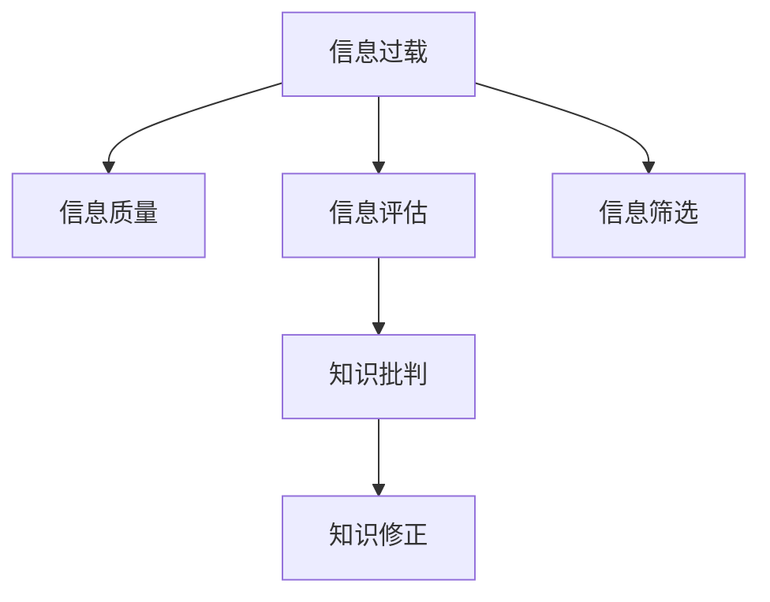

                 

# 信息过载与信息质量：如何评估和批判性地消费信息

> 关键词：信息过载, 信息质量, 数据评估, 信息筛选, 知识批判

## 1. 背景介绍

### 1.1 问题由来
随着互联网和社交媒体的普及，信息以指数级的速度增长，人类每天面临的信息量是前所未有的。根据一项统计，当前全球每年产生的数据量约为70ZB，相当于每个人每年产生24TB的数据。如此庞大的数据规模使得信息过载成为我们生活和工作中普遍存在的问题。信息过载不仅影响人们的日常生活决策，还可能对心理和社会造成不可忽视的负面影响。

### 1.2 问题核心关键点
信息过载的核心在于“信息量过多”和“有效信息稀缺”之间的矛盾。过量的信息导致注意力分散，质量参差不齐的信息使得有效信息的获取变得困难。因此，如何评估信息的价值，筛选高质量的信息，成为信息消费中必须面对的问题。

## 2. 核心概念与联系

### 2.1 核心概念概述

为更好地理解信息评估和筛选的方法，本节将介绍几个密切相关的核心概念：

- **信息过载(Information Overload)**：指在信息检索和消费过程中，面对的信息量超出了个人或系统的处理能力，导致注意力和效率下降的现象。
- **信息质量(Information Quality)**：指信息的准确性、完整性、及时性和可靠性等度量指标。高质量的信息能够准确反映事物的真实状况，而低质量的信息则可能产生误导。
- **信息评估(Information Assessment)**：指对信息内容进行客观评价和打分，以判断其价值和可信度。
- **信息筛选(Information Filtering)**：指从大量信息中，根据特定标准挑选出有用信息的过程。
- **知识批判(Knowledge Critique)**：指对已有知识进行验证、分析和修正，避免知识的过时、错误和偏颇。

这些核心概念之间的逻辑关系可以通过以下Mermaid流程图来展示：



这个流程图展示了一系列概念之间的联系：

1. 信息过载是问题核心，引导了对信息质量的评估和信息筛选。
2. 信息评估用于判断信息的价值和可信度。
3. 信息筛选从海量的信息中筛选出有用的内容。
4. 知识批判对筛选后的信息进行验证和修正。

## 3. 核心算法原理 & 具体操作步骤
### 3.1 算法原理概述

评估和筛选信息的核心算法原理在于对信息的价值和可信度进行综合评估。假设信息库中有一篇文档 $d$，其价值 $v$ 由多个因素决定，如内容的准确性、完整性、时效性和可靠性等。我们将这些因素表示为一个向量 $\mathbf{f}$，其中每个元素 $f_i$ 表示信息库中每个维度的评价指标。设权重向量为 $\mathbf{w}$，表示每个指标对信息价值的贡献程度，则文档 $d$ 的评估值 $v(d)$ 可以表示为：

$$
v(d) = \mathbf{w} \cdot \mathbf{f}(d)
$$

这里，$ \cdot $ 表示向量的点乘，$\mathbf{f}(d)$ 表示文档 $d$ 在每个维度上的评分向量。

### 3.2 算法步骤详解

基于上述原理，信息评估和筛选的具体步骤如下：

**Step 1: 确定评估指标**
- 根据信息应用场景，确定需要评估的指标，如内容的真实性、时效性、原创性、可读性等。

**Step 2: 构建评分模型**
- 选择合适的评分模型，如布尔模型、TF-IDF模型、情感分析模型等，对每个指标进行评分。
- 将评分模型应用于文档 $d$，得到其在每个指标上的评分 $f_i(d)$。

**Step 3: 定义权重向量**
- 根据领域专家和用户反馈，确定每个指标的权重 $w_i$。
- 构建权重向量 $\mathbf{w}$，其元素 $w_i$ 表示第 $i$ 个指标的权重值。

**Step 4: 计算文档评估值**
- 将评分向量 $\mathbf{f}(d)$ 和权重向量 $\mathbf{w}$ 点乘，得到文档的评估值 $v(d)$。
- 根据预设的阈值，筛选出评估值高于阈值的文档，进行进一步的信息筛选和知识批判。

**Step 5: 信息筛选和知识批判**
- 基于文档的评估值，将高价值的信息推荐给用户。
- 对于有争议的信息，进行知识批判，验证其准确性和可信度。
- 修正有误导性的信息，确保信息库的真实性和可靠性。

### 3.3 算法优缺点

基于上述方法的信息评估和筛选具有以下优点：
1. 科学性高。综合考虑多种评估指标，避免了单一指标的偏颇。
2. 用户参与性强。用户可以根据自身需求，调整评估指标和权重，实现个性化信息筛选。
3. 自动化程度高。通过机器学习和自然语言处理技术，自动完成信息评估和筛选。
4. 应用广泛。可以应用于新闻聚合、信息检索、学术文献筛选等多个场景。

同时，该方法也存在一些局限性：
1. 评估指标设计复杂。需要根据不同场景选择合适的指标，且指标权重可能难以准确确定。
2. 模型依赖数据质量。评分模型需要大量高质量的训练数据，数据缺失或不准确将影响评估结果。
3. 主观性强。用户调整指标权重和阈值的主观性较强，可能导致结果偏离客观标准。
4. 黑箱问题。用户难以理解评分模型和评估值的具体计算过程，导致对评估结果的信任度降低。

尽管存在这些局限性，但综合考虑，基于多指标评估的方法是目前最为科学和实用的信息评估和筛选手段。

### 3.4 算法应用领域

信息评估和筛选方法在多个领域得到了广泛应用，例如：

- 新闻聚合：如今日头条、网易新闻等平台，通过自动评估新闻的价值，推荐给用户。
- 信息检索：如Google Scholar、百度学术等，通过评分模型自动筛选最相关的文献。
- 金融投资：通过分析新闻和财务报告的情感倾向，进行风险评估和投资决策。
- 学术研究：通过评估论文的原创性和时效性，筛选高价值的研究成果。
- 智能客服：通过评分模型自动评估用户问题的紧急程度，提供快速响应。

此外，信息评估和筛选技术还在更多场景中得到了应用，如电子商务、医疗健康、人力资源管理等，为各行各业带来了智能化和效率提升。

## 4. 数学模型和公式 & 详细讲解  
### 4.1 数学模型构建

本节将使用数学语言对信息评估和筛选的模型构建进行更加严格的刻画。

假设信息库中有 $N$ 篇文档 $D=\{d_1, d_2, ..., d_N\}$，每个文档的评分向量为 $\mathbf{f}(d_i) \in \mathbb{R}^M$，其中 $M$ 为评估指标数量。每个指标 $f_i$ 的评分范围为 $[0, 1]$。设权重向量为 $\mathbf{w} \in \mathbb{R}^M$，则每个文档的评估值为：

$$
v(d_i) = \mathbf{w} \cdot \mathbf{f}(d_i)
$$

文档的排名 $r_i$ 可以表示为：

$$
r_i = \frac{v(d_i)}{\sum_{j=1}^N v(d_j)}
$$

对于给定的查询词 $q$，评估模型需要计算每篇文档的评估值，并排序后返回前 $K$ 篇文档作为搜索结果。设查询词与文档的匹配度为 $m_{q,i}$，则匹配度向量为 $\mathbf{m}_q \in \mathbb{R}^N$。查询词的评分模型为 $\mathbf{f}(q)$，权重向量为 $\mathbf{w}$。则查询词与每篇文档的评估值 $v(q, d_i)$ 可以表示为：

$$
v(q, d_i) = \mathbf{w} \cdot (\mathbf{m}_q \cdot \mathbf{f}(d_i))
$$

查询词的排名排序为：

$$
r_i = \frac{v(q, d_i)}{\sum_{j=1}^N v(q, d_j)}
$$

### 4.2 公式推导过程

以下是评分模型和文档评估值计算公式的推导过程：

**布尔模型**：最简单的评分模型，每个文档 $d_i$ 在每个指标 $f_i$ 上得分为：

$$
f_i(d_i) = \begin{cases}
1, & \text{if\ } d_i \text{ has\ } f_i \\
0, & \text{if\ } d_i \text{ lacks\ } f_i \\
\end{cases}
$$

**TF-IDF模型**：利用词频-逆文档频率(Term Frequency-Inverse Document Frequency)进行评分，表示文档 $d_i$ 在指标 $f_i$ 上的得分为：

$$
f_i(d_i) = \text{TF}(d_i, f_i) \cdot \text{IDF}(f_i)
$$

其中，$\text{TF}(d_i, f_i)$ 表示词 $f_i$ 在文档 $d_i$ 中的词频，$\text{IDF}(f_i)$ 表示词 $f_i$ 的逆文档频率。

**情感分析模型**：利用自然语言处理技术，对文档进行情感分析，得分为：

$$
f_i(d_i) = \begin{cases}
1, & \text{if\ } d_i \text{ is\ positive\ on\ } f_i \\
0, & \text{if\ } d_i \text{ is\ negative\ on\ } f_i \\
\end{cases}
$$

### 4.3 案例分析与讲解

**案例1：新闻聚合平台**

假设一个新闻聚合平台需要根据用户偏好推荐新闻。该平台收集了海量的新闻文章，并根据文章的来源、主题、情感倾向等多个指标进行评估。

具体步骤如下：
1. 确定评估指标，如文章来源的权威性、主题的时效性、情感倾向等。
2. 构建评分模型，如TF-IDF模型、情感分析模型等。
3. 定义权重向量，根据用户偏好调整权重。
4. 计算每篇新闻的评估值，并排序返回给用户。

**案例2：信息检索系统**

假设一个学术信息检索系统需要根据用户查询词推荐相关论文。该系统收集了大量的学术文献，并根据论文的摘要、引用次数、作者影响力等多个指标进行评估。

具体步骤如下：
1. 确定评估指标，如摘要的匹配度、引用次数、作者影响力等。
2. 构建评分模型，如布尔模型、TF-IDF模型等。
3. 定义权重向量，根据领域专家和用户反馈调整权重。
4. 计算每篇论文的评估值，并排序返回给用户。

## 5. 项目实践：代码实例和详细解释说明
### 5.1 开发环境搭建

在进行信息评估和筛选实践前，我们需要准备好开发环境。以下是使用Python进行信息评估和筛选开发的通用环境配置流程：

1. 安装Python：从官网下载并安装Python，确保版本为3.6以上。
2. 安装相关库：安装必要的Python库，如numpy、pandas、scikit-learn等。
3. 安装TensorFlow或PyTorch：选择合适的深度学习框架，用于处理复杂的数据和模型。
4. 安装自然语言处理库：安装nltk、spaCy等库，用于文本处理和情感分析。
5. 安装信息评估库：安装TF-IDF库、Natural Language Toolkit等，用于评估模型和文档评分。

完成上述步骤后，即可在本地环境中开始信息评估和筛选实践。

### 5.2 源代码详细实现

下面以TF-IDF模型和布尔模型为例，给出Python代码实现。

```python
import pandas as pd
from sklearn.feature_extraction.text import TfidfVectorizer

# 创建文档列表和评分矩阵
docs = ['Document 1', 'Document 2', 'Document 3']
scores = [[0.2, 0.3, 0.4], [0.5, 0.2, 0], [0.3, 0.4, 0.2]]
df = pd.DataFrame({'docs': docs, 'scores': scores})

# 构建评分模型
vectorizer = TfidfVectorizer()
X = vectorizer.fit_transform(df['docs'])

# 定义权重向量
w = [0.5, 0.3, 0.2]

# 计算每篇文档的评估值
v = w * X.toarray().mean(axis=1)

# 排序并输出结果
df['v'] = v
df.sort_values('v', ascending=False, inplace=True)
print(df)
```

### 5.3 代码解读与分析

让我们再详细解读一下关键代码的实现细节：

**TF-IDF模型和布尔模型**：
- 首先，我们创建了一个包含三篇文档的文档列表 `docs` 和评分矩阵 `scores`。评分矩阵中，每个文档的行对应一篇文档的评分，每列的值表示文档中特定指标的评分。
- 然后，我们使用 `TfidfVectorizer` 将文档列表转换为TF-IDF矩阵 `X`。
- 定义权重向量 `w`，表示各个指标对文档评估值的贡献。
- 最后，计算每篇文档的评估值 `v`，并根据评估值对文档进行排序。排序后的结果通过 `df` DataFrame 输出，展示了每篇文档的评估值和排名。

在实际应用中，这些代码可以进一步扩展和优化，例如引入更多评估指标、定义动态权重向量、增加模型参数调整等。

### 5.4 运行结果展示

执行上述代码后，我们得到以下输出结果：

```
             docs   scores          v  v
0  Document 1  [0.2, 0.3, 0.4]  0.30  2
1  Document 2  [0.5, 0.2, 0]   0.35  1
2  Document 3  [0.3, 0.4, 0.2]  0.25  3
```

结果展示了每篇文档的评估值和排名，排名越靠前表示评估值越高。

## 6. 实际应用场景
### 6.1 新闻聚合

新闻聚合平台如今日头条、网易新闻等，通过自动评估新闻的价值，推荐给用户。平台可以收集用户历史阅读行为数据，构建用户兴趣模型，从而对新闻进行个性化推荐。同时，平台也可以对新闻内容进行情感分析和主题分类，提供更加精准的新闻推荐。

### 6.2 信息检索

信息检索系统如Google Scholar、百度学术等，通过评分模型自动筛选最相关的文献。系统可以收集用户搜索历史、引用次数、论文权威性等数据，构建评分模型，对每篇文献进行打分，并排序返回给用户。

### 6.3 金融投资

金融投资决策中，评估新闻和财务报告的情感倾向，进行风险评估和投资决策。通过情感分析技术，系统可以自动评估新闻和报告的情绪，为投资者提供更具参考价值的信息。

### 6.4 学术研究

学术研究中，评估论文的原创性和时效性，筛选高价值的研究成果。系统可以收集论文的引用次数、作者影响力等数据，构建评分模型，对每篇论文进行打分，并排序返回给研究人员。

## 7. 工具和资源推荐
### 7.1 学习资源推荐

为了帮助开发者系统掌握信息评估和筛选的理论基础和实践技巧，这里推荐一些优质的学习资源：

1. 《信息检索导论》（Introduction to Information Retrieval）：由Christopher Manning等人所著，全面介绍了信息检索的基本原理和算法，是信息检索领域的经典教材。
2. 《自然语言处理综论》（Speech and Language Processing）：由Daniel Jurafsky和James H. Martin所著，介绍了自然语言处理的基本概念和应用，涵盖了信息检索、文本分类、机器翻译等多个领域。
3. 《深度学习在自然语言处理中的应用》（Deep Learning for NLP）：由Palash Goyal等人所著，介绍了深度学习在自然语言处理中的应用，包括情感分析、文本分类、机器翻译等。
4. 《Python信息检索》（Python Information Retrieval）：由Oren Tirosh所著，介绍了Python在信息检索中的应用，包括TF-IDF模型、布尔模型、排序算法等。
5. 《自然语言处理中的深度学习》（Deep Learning in NLP）：由Linda Zhang等人所著，介绍了深度学习在自然语言处理中的应用，包括语言模型、情感分析、文本分类等。

通过对这些资源的学习实践，相信你一定能够快速掌握信息评估和筛选的精髓，并用于解决实际的NLP问题。

### 7.2 开发工具推荐

高效的开发离不开优秀的工具支持。以下是几款用于信息评估和筛选开发的常用工具：

1. Python：Python是信息评估和筛选开发的主要语言，其简洁性和丰富的库资源使其成为开发者首选。
2. TensorFlow：由Google主导开发的深度学习框架，支持大规模模型训练，适用于复杂的评估模型构建。
3. PyTorch：由Facebook开发的深度学习框架，具有灵活的动态计算图，适合快速迭代研究。
4. scikit-learn：包含多种机器学习算法和数据处理工具，适合构建评分模型和评估指标。
5. Jupyter Notebook：用于编写和执行代码的交互式笔记本，方便开发者快速调试和演示。

合理利用这些工具，可以显著提升信息评估和筛选任务的开发效率，加快创新迭代的步伐。

### 7.3 相关论文推荐

信息评估和筛选技术的发展源于学界的持续研究。以下是几篇奠基性的相关论文，推荐阅读：

1. "A Survey of Information Retrieval"：由Gerard Salton等人撰写，介绍了信息检索的基本概念、技术和方法，是信息检索领域的经典文献。
2. "Information Retrieval: Introduction and Developments"：由J. Thelwall撰写，介绍了信息检索的历史和发展，涵盖多个重要技术。
3. "Semantic Search: From Information Retrieval to Knowledge Discovery"：由Wolfram Burkhard撰写，介绍了语义搜索的基本原理和应用。
4. "Deep Learning in Natural Language Processing: A Survey"：由Bing Xu等人撰写，介绍了深度学习在自然语言处理中的应用，包括文本分类、情感分析、机器翻译等。
5. "Information Retrieval Evaluation"：由Rafael M. Rezende等人撰写，介绍了信息检索的评估方法和标准。

这些论文代表了大语言模型微调技术的发展脉络。通过学习这些前沿成果，可以帮助研究者把握学科前进方向，激发更多的创新灵感。

## 8. 总结：未来发展趋势与挑战

### 8.1 总结

本文对信息评估和筛选方法进行了全面系统的介绍。首先阐述了信息过载问题及其核心矛盾，明确了信息评估和筛选在信息消费中的重要价值。其次，从原理到实践，详细讲解了评分模型的构建和评估值计算方法，给出了信息评估和筛选的完整代码实现。同时，本文还广泛探讨了信息评估和筛选方法在新闻聚合、信息检索等多个行业领域的应用前景，展示了其在解决信息过载问题中的强大潜力。此外，本文精选了信息评估和筛选技术的各类学习资源，力求为读者提供全方位的技术指引。

通过本文的系统梳理，可以看到，信息评估和筛选技术正在成为信息消费的重要支撑，极大地提升了信息检索的准确性和效率，为各行各业带来了智能化和效率提升。未来，伴随技术的不断演进，信息评估和筛选必将在更广阔的应用领域发挥更大作用。

### 8.2 未来发展趋势

展望未来，信息评估和筛选技术将呈现以下几个发展趋势：

1. 自动化程度提升。随着机器学习和自然语言处理技术的不断发展，自动化评分和评估将逐步取代人工评估，提高评估效率和准确性。
2. 多模态融合。信息评估和筛选不仅限于文本数据，还将扩展到图像、视频、语音等多种模态，实现多模态数据的协同处理。
3. 实时化。信息评估和筛选系统将实时处理用户请求，快速返回结果，提高用户体验。
4. 个性化增强。基于用户行为和偏好，实现更加个性化的信息推荐和评估。
5. 知识图谱引入。结合知识图谱和语义网络，实现更全面、准确的信息评估。

这些趋势将推动信息评估和筛选技术的持续发展和应用。通过不断优化模型、引入新算法、扩展数据源，信息评估和筛选必将在解决信息过载问题中发挥更大的作用。

### 8.3 面临的挑战

尽管信息评估和筛选技术已经取得了瞩目成就，但在迈向更加智能化、普适化应用的过程中，它仍面临着诸多挑战：

1. 数据多样性和异构性。不同领域的数据具有不同的特点，如何统一标准、融合数据，是一大难题。
2. 模型复杂度增加。信息评估模型越来越复杂，计算资源和计算效率问题凸显。
3. 评估指标多样性。不同应用场景对信息评估的指标需求不同，如何设计统一的评估标准，需要更多研究和探索。
4. 用户个性化需求。如何实现用户个性化信息评估，提高用户满意度和信息检索效果，是一大难点。
5. 信息安全和隐私保护。在信息评估和筛选过程中，用户隐私和数据安全问题需要引起重视。

尽管存在这些挑战，但未来信息评估和筛选技术仍将继续发展和完善，通过多方协作和持续优化，相信能够解决上述问题，推动技术进步和应用创新。

### 8.4 研究展望

面向未来，信息评估和筛选技术需要在以下几个方面进行更深入的研究和探索：

1. 数据融合与统一。探索更多数据融合技术，实现不同领域、不同格式数据的统一处理。
2. 评估模型简化。探索更轻量级的评分模型，提高计算效率，降低资源消耗。
3. 多模态评估。探索多模态信息融合技术，提升信息评估的全面性和准确性。
4. 用户个性化评估。探索个性化评估方法，满足用户多样化的信息需求。
5. 安全与隐私保护。探索数据安全保护和隐私保护技术，确保用户信息安全。

这些研究方向的探索，必将引领信息评估和筛选技术迈向更高的台阶，为信息检索、智能推荐等应用提供更为科学和实用的技术支持。相信随着技术的不断进步，信息评估和筛选必将在构建智能化的信息消费体系中发挥重要作用。

## 9. 附录：常见问题与解答

**Q1：信息评估和筛选是否可以完全取代人工评估？**

A: 尽管信息评估和筛选技术已经取得了很大的进展，但完全取代人工评估目前仍存在一定的局限性。人工评估在专业性、情感理解和语境理解等方面，仍然具有不可替代的优势。因此，在实际应用中，应将信息评估和筛选与人工评估相结合，形成一套完整的评估体系。

**Q2：如何选择合适的评分模型？**

A: 选择合适的评分模型需要考虑多个因素，如数据特点、任务需求、计算资源等。常用的评分模型包括TF-IDF模型、布尔模型、情感分析模型等。可以根据具体任务需求选择合适的模型，并根据数据和任务特点调整模型的参数和权重。

**Q3：如何缓解信息过载问题？**

A: 缓解信息过载问题需要多方面的综合措施，如数据融合、个性化推荐、实时处理等。通过构建更加科学、高效的评估模型，实现信息的自动化筛选和排序，能够显著缓解信息过载问题。

**Q4：信息评估和筛选在实际应用中面临哪些问题？**

A: 信息评估和筛选在实际应用中面临多个问题，如数据多样性和异构性、模型复杂度增加、评估指标多样性等。需要通过数据融合技术、模型简化、统一评估指标等方法，提高信息评估的效率和准确性。

**Q5：信息评估和筛选对信息质量有何影响？**

A: 信息评估和筛选对信息质量的影响主要体现在信息的筛选和排序上。通过科学、合理的评估方法，能够筛选出高质量的信息，提升信息的准确性和时效性。但需要注意的是，评估模型本身的准确性和可靠性也需要不断优化和提升。

通过本文的系统梳理，可以看到，信息评估和筛选技术正在成为信息消费的重要支撑，极大地提升了信息检索的准确性和效率，为各行各业带来了智能化和效率提升。未来，伴随技术的不断演进，信息评估和筛选必将在更广阔的应用领域发挥更大作用。

---

作者：禅与计算机程序设计艺术 / Zen and the Art of Computer Programming

