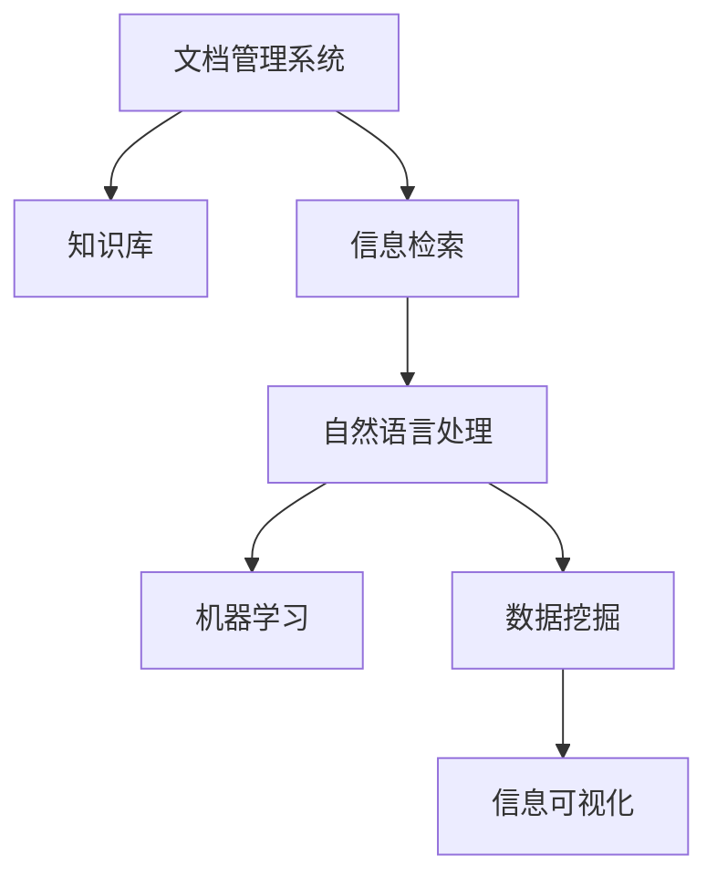

                 

# 信息过载与知识管理系统：管理和组织信息以提高生产力

> 关键词：信息过载, 知识管理, 信息检索, 自然语言处理, 机器学习, 数据挖掘, 信息可视化, 人工智能

## 1. 背景介绍

### 1.1 问题由来
在信息时代，信息的丰富性给我们带来了巨大的便利，但同时也带来了“信息过载”的问题。即，随着信息量的激增，如何高效地获取、筛选和利用这些信息成为我们面临的主要挑战。这种挑战不仅出现在个人用户身上，也在企业、组织中尤为显著。

在大数据背景下，企业需要管理的数据量成倍增加，这些数据可能包括客户交易记录、员工绩效数据、市场调研报告、产品设计文档等等。数据量的大幅增长，对信息检索、数据整合、知识管理等方面提出了更高的要求。

同时，信息的不确定性和复杂性也给信息管理带来了新的难度。信息来源于多个渠道，如社交媒体、新闻、网站等，内容质量参差不齐，如何从中提取出有价值的信息，并进行合理的组织和存储，成为企业知识管理的核心问题。

信息过载和知识管理的挑战，催生了知识管理系统的诞生。知识管理系统（Knowledge Management System, KMS）是一个能够帮助企业高效管理信息、提取知识、促进员工协作的软件系统。

### 1.2 问题核心关键点
知识管理系统的主要目标是：

- **高效信息检索**：快速定位企业内部的文档、邮件、代码库等资料。
- **知识提取**：从大量文档和数据中提取有价值的信息和知识，以便供员工参考和使用。
- **知识共享**：提供一个平台，方便员工共享和交流知识，促进内部协作。
- **知识积累**：保存和传承企业知识，构建企业知识库。

针对以上目标，知识管理系统主要包含以下几个核心组件：

- **文档管理系统**：用于存储和管理企业文档，提供快速检索和版本控制功能。
- **知识库**：用于存储和提取企业知识，支持基于语义的搜索和自然语言处理（NLP）技术。
- **协作平台**：支持员工之间的知识交流和协作，实现知识共享和积累。
- **智能推荐引擎**：通过机器学习和数据挖掘技术，提供个性化的信息推荐。

这些组件相互协作，共同构成了一个完善的知识管理系统。

## 2. 核心概念与联系

### 2.1 核心概念概述

要理解知识管理系统，首先需要了解一些核心概念及其之间的联系。

- **文档管理系统（Document Management System, DMS）**：用于管理和存储文档的系统，支持文件的上传、下载、版本控制、权限管理等基本功能。
- **知识库（Knowledge Base）**：用于存储企业知识的系统，包含结构化、半结构化和非结构化数据。
- **知识图谱（Knowledge Graph）**：一种语义化的知识表示方法，通过节点和边的关系来表示知识。
- **信息检索（Information Retrieval, IR）**：从大量文本、数据中检索出满足特定查询要求的信息。
- **自然语言处理（Natural Language Processing, NLP）**：让计算机理解和处理人类语言的技术。
- **机器学习（Machine Learning, ML）**：让计算机从数据中自动学习模型，提升信息处理的准确性。
- **数据挖掘（Data Mining）**：从数据中自动发现有用信息和知识的过程。
- **信息可视化（Information Visualization）**：将信息以图表、图形等形式展示，便于理解和分析。

这些概念之间的逻辑关系可以通过以下Mermaid流程图来展示：



这个流程图展示了一些核心概念及其之间的关系：

1. 文档管理系统提供文档管理功能，是知识库的基础。
2. 知识库存储知识，通过信息检索技术方便检索。
3. 自然语言处理用于理解和处理文本，提升信息检索效果。
4. 机器学习用于从数据中学习模型，提升信息处理和知识提取的准确性。
5. 数据挖掘从大量数据中挖掘有用信息。
6. 信息可视化将信息以图表形式展示，便于理解和分析。

这些概念共同构成了知识管理系统的基础，并通过信息检索、自然语言处理、机器学习等技术手段，提升系统的功能和效率。

## 3. 核心算法原理 & 具体操作步骤
### 3.1 算法原理概述

知识管理系统涉及多个领域的算法和技术，主要包括以下几个方面：

- **信息检索算法**：用于在大量数据中快速定位和检索信息。常见的算法包括布尔检索、向量空间模型、倒排索引等。
- **自然语言处理技术**：用于理解和处理自然语言，提取文本中的关键信息。常见的技术包括分词、命名实体识别、情感分析等。
- **机器学习算法**：用于从数据中学习模型，提升信息处理和知识提取的准确性。常见的算法包括分类、回归、聚类等。
- **数据挖掘技术**：用于从大量数据中挖掘有用信息。常见的技术包括关联规则、异常检测等。

这些算法的核心思想是将非结构化数据转化为结构化数据，通过模型学习，发现数据中的规律和知识，从而辅助企业决策。

### 3.2 算法步骤详解

一个典型的知识管理系统包含以下几个步骤：

**Step 1: 数据收集与存储**

- 收集企业内部的各种文档、邮件、代码等数据，并存储到文档管理系统。
- 对文档进行分类和标注，以便后续的信息检索和知识提取。

**Step 2: 信息检索**

- 使用信息检索算法，从文档管理系统和知识库中检索出符合用户查询要求的信息。
- 根据查询结果，提供给用户搜索结果，并进行排序和过滤。

**Step 3: 知识提取**

- 使用自然语言处理技术，从文档和知识库中提取有价值的信息和知识。
- 对提取出的信息进行标注和分类，并保存到知识库中。

**Step 4: 知识共享与协作**

- 提供一个协作平台，方便员工共享和交流知识。
- 支持讨论、评论、点赞等功能，促进员工之间的互动。

**Step 5: 智能推荐**

- 使用机器学习算法，根据用户的历史行为和偏好，推荐相关知识和信息。
- 使用数据挖掘技术，分析用户的行为模式，进一步提升推荐效果。

**Step 6: 信息可视化**

- 使用信息可视化技术，将信息以图表、图形等形式展示。
- 根据用户需求，选择不同的可视化方式，提升信息的可理解性。

### 3.3 算法优缺点

知识管理系统具有以下优点：

1. **提高工作效率**：通过自动化信息检索和知识提取，减少员工查找信息和知识的时间，提高工作效率。
2. **促进知识共享**：提供一个平台，方便员工共享和交流知识，促进内部协作。
3. **增强决策支持**：通过从大量数据中挖掘有用信息，辅助企业决策。
4. **提升数据安全**：通过权限管理和版本控制，保护企业数据的机密性和完整性。

同时，知识管理系统也存在一些缺点：

1. **实施成本高**：系统的建设、维护和升级需要较高的技术和管理成本。
2. **数据质量要求高**：知识管理系统依赖高质量的数据，数据质量差会影响系统的准确性。
3. **用户接受度低**：员工对系统的接受度和使用习惯可能影响系统的效果。
4. **隐私保护问题**：系统需要处理大量敏感信息，隐私保护问题需要引起重视。

尽管存在这些缺点，但知识管理系统仍然是大中型企业提高信息管理效率的重要工具。

### 3.4 算法应用领域

知识管理系统的应用领域非常广泛，几乎覆盖了所有企业运营和管理的方面。以下是一些典型的应用场景：

- **文档管理**：对企业内部的各种文档进行分类、存储和管理。
- **知识提取**：从大量文档和数据中提取有价值的信息和知识。
- **信息检索**：快速定位企业内部的文档、邮件、代码库等资料。
- **协作平台**：支持员工之间的知识交流和协作，实现知识共享和积累。
- **决策支持**：通过从大量数据中挖掘有用信息，辅助企业决策。
- **智能推荐**：根据用户的历史行为和偏好，推荐相关知识和信息。
- **信息可视化**：将信息以图表、图形等形式展示，便于理解和分析。

除了这些应用场景，知识管理系统还被广泛应用于教育、医疗、政府、科研等领域，成为提升信息管理和知识共享的重要工具。

## 4. 数学模型和公式 & 详细讲解 & 举例说明（备注：数学公式请使用latex格式，latex嵌入文中独立段落使用 $$，段落内使用 $)
### 4.1 数学模型构建

知识管理系统的核心在于将非结构化数据转化为结构化数据，并通过模型学习，发现数据中的规律和知识。常见的数学模型包括：

- **信息检索模型**：用于从大量文本中检索出符合查询要求的信息。常用的模型包括向量空间模型（Vector Space Model, VSM）、隐式语义分析（Latent Semantic Analysis, LSA）等。
- **自然语言处理模型**：用于理解和处理自然语言。常用的模型包括词向量模型（Word Embedding, Word2Vec）、BERT、GPT等。
- **机器学习模型**：用于从数据中学习模型，提升信息处理和知识提取的准确性。常用的模型包括分类模型、回归模型、聚类模型等。

以向量空间模型为例，其数学模型如下：

$$
q = w_1 \cdot t_1 + w_2 \cdot t_2 + \cdots + w_n \cdot t_n
$$

其中，$q$ 表示查询向量，$t_i$ 表示文本向量，$w_i$ 表示文本向量的权重。这个模型通过计算查询向量和文本向量的相似度，找到最相关的文本。

### 4.2 公式推导过程

以分类模型为例，其基本思想是通过训练数据学习一个分类器，将输入数据映射到不同的类别。常用的分类模型包括逻辑回归、决策树、支持向量机（SVM）等。

以逻辑回归为例，其数学模型如下：

$$
y = \sigma(w_1 \cdot x_1 + w_2 \cdot x_2 + \cdots + w_n \cdot x_n + b)
$$

其中，$y$ 表示输出类别，$x_i$ 表示输入特征，$w_i$ 表示特征权重，$b$ 表示偏置。

在训练过程中，通过最小化损失函数，更新模型参数：

$$
\min_{w, b} \frac{1}{N} \sum_{i=1}^N L(y_i, \sigma(w_1 \cdot x_1 + w_2 \cdot x_2 + \cdots + w_n \cdot x_n + b))
$$

其中，$L$ 表示损失函数，常用的有交叉熵损失、均方误差损失等。

### 4.3 案例分析与讲解

以下是一个简单的信息检索案例，用于说明向量空间模型的应用。

假设我们要检索一篇关于“人工智能”的文章。首先，我们需要将文章中的关键词提取出来，并转化为向量：

- 文章1：“人工智能” → 向量 $[1, 0, 0, 0]$
- 文章2：“机器学习” → 向量 $[0, 1, 0, 0]$
- 文章3：“深度学习” → 向量 $[0, 0, 1, 0]$
- 文章4：“自然语言处理” → 向量 $[0, 0, 0, 1]$

现在，我们有一条查询“人工智能”：

$$
q = [1, 0, 0, 0]
$$

根据向量空间模型，计算查询向量与各个文本向量的相似度，并按相似度排序：

- 文章1：相似度 1
- 文章4：相似度 0.5
- 文章3：相似度 0.25
- 文章2：相似度 0

因此，查询结果为：

1. 文章1：“人工智能”
2. 文章4：“自然语言处理”

这个案例展示了向量空间模型在信息检索中的应用，通过计算查询向量和文本向量的相似度，快速定位到最相关的文档。

## 5. 项目实践：代码实例和详细解释说明
### 5.1 开发环境搭建

在进行知识管理系统的开发前，我们需要准备好开发环境。以下是使用Python进行信息检索和知识管理的开发环境配置流程：

1. 安装Anaconda：从官网下载并安装Anaconda，用于创建独立的Python环境。

2. 创建并激活虚拟环境：
```bash
conda create -n kms-env python=3.8 
conda activate kms-env
```

3. 安装必要的库：
```bash
conda install pandas numpy sklearn transformers gensim elasticsearch pyecharts
```

4. 安装必要的工具：
```bash
pip install jupyter notebook pyecharts jieba pyspark
```

完成上述步骤后，即可在`kms-env`环境中开始知识管理系统的开发。

### 5.2 源代码详细实现

下面是一个简单的信息检索系统实现，使用Python中的Scikit-learn库和gensim库：

```python
import pandas as pd
from sklearn.feature_extraction.text import TfidfVectorizer
from sklearn.metrics.pairwise import cosine_similarity
from gensim.models import KeyedVectors

# 读取数据集
data = pd.read_csv('data.csv')

# 构建TF-IDF向量
tfidf = TfidfVectorizer()
tfidf_matrix = tfidf.fit_transform(data['text'])

# 加载预训练的Word2Vec模型
word2vec = KeyedVectors.load_word2vec_format('word2vec.model', binary=True)

# 构建查询向量
query = '人工智能'
query_vector = []
for word in query.split():
    if word in word2vec:
        query_vector.append(word2vec[word])
    else:
        query_vector.append([0, 0, 0, 0])

# 计算相似度
similarity = cosine_similarity(tfidf_matrix, query_vector)
similarity_df = pd.DataFrame(similarity, index=data['id'], columns=['相似度'])

# 排序并显示前5个结果
top5 = similarity_df.nlargest(5, '相似度')
print(top5)
```

### 5.3 代码解读与分析

让我们再详细解读一下关键代码的实现细节：

**数据处理**：
- 使用pandas读取数据集，并存储为DataFrame。
- 使用Scikit-learn的TfidfVectorizer将文本转化为TF-IDF向量，以便进行向量空间模型计算。

**向量空间模型**：
- 使用gensim库加载预训练的Word2Vec模型，并将查询转化为向量。
- 使用Scikit-learn的cosine_similarity计算查询向量与文本向量的相似度。

**结果展示**：
- 将相似度结果存储为DataFrame，并使用DataFrame的nlargest方法获取前5个结果。

可以看到，通过简单的代码实现，我们就能够构建一个基本的向量空间模型，用于信息检索。

## 6. 实际应用场景
### 6.1 智能客服系统

知识管理系统在智能客服系统中有着广泛的应用。传统的客服系统依赖人工接听和处理客户问题，效率低下且难以扩展。而知识管理系统则通过存储大量的常见问题和答案，智能匹配客户问题，自动提供解决方案，极大地提升了客服系统的效率和用户体验。

在实际应用中，知识管理系统可以存储企业内部的客户服务记录、FAQ文档、常见问题等。通过自然语言处理技术，将这些问题和答案转化为知识库。当客户提出问题时，系统自动匹配相关记录，并提供解决方案。同时，系统还可以不断学习和积累，提升解决问题的准确性和覆盖面。

### 6.2 医疗知识管理系统

在医疗领域，知识管理系统帮助医生快速检索相关文献、病理报告、治疗方案等信息，极大地提升了医生的工作效率。

知识管理系统可以存储大量的医疗数据，包括病人病历、病理报告、手术记录等。通过自然语言处理技术，系统可以提取关键信息，如病人的症状、诊断结果、治疗方案等。医生在查询时，只需输入简短的描述，系统即可快速匹配并展示相关文献和报告。

### 6.3 金融风险管理

在金融领域，知识管理系统用于存储和分析大量的市场数据、新闻报道、财务报告等信息，帮助分析师识别潜在的风险和机会。

知识管理系统可以存储金融市场的各种数据，包括股票价格、财务报表、市场新闻等。通过数据挖掘和机器学习技术，系统可以挖掘出市场趋势、异常交易等信息，帮助分析师识别潜在的风险和机会。同时，系统还可以提供实时的市场分析报告，提升决策支持能力。

## 7. 工具和资源推荐
### 7.1 学习资源推荐

为了帮助开发者系统掌握知识管理系统的理论基础和实践技巧，这里推荐一些优质的学习资源：

1. 《信息检索基础》：一本详细介绍信息检索理论和方法的书籍，适合初学者学习。

2. 《自然语言处理综论》：由斯坦福大学教授撰写的NLP教材，详细介绍了NLP的各种技术和应用。

3. 《Python自然语言处理》：一本基于Python的NLP教材，适合初学者入门。

4. 《Kaggle机器学习实战》：一本介绍机器学习应用实战的书籍，包含大量代码示例和案例分析。

5. 《信息可视化实战》：一本详细介绍信息可视化技术和工具的书籍，适合数据分析和可视化工程师学习。

通过对这些资源的学习实践，相信你一定能够快速掌握知识管理系统的精髓，并用于解决实际的NLP问题。
###  7.2 开发工具推荐

高效的开发离不开优秀的工具支持。以下是几款用于知识管理系统开发的常用工具：

1. Jupyter Notebook：一个交互式的编程环境，适合进行数据处理、模型训练等任务。

2. PyTorch：一个强大的深度学习框架，支持自动微分和动态计算图，适合进行复杂的模型训练。

3. TensorFlow：由Google开发的一个深度学习框架，适合大规模工程应用。

4. Scikit-learn：一个流行的机器学习库，包含大量的机器学习算法和工具。

5. Elasticsearch：一个开源的搜索引擎，支持分布式数据存储和搜索。

6. Apache Spark：一个快速的分布式计算框架，支持大规模数据处理。

合理利用这些工具，可以显著提升知识管理系统的开发效率，加快创新迭代的步伐。

### 7.3 相关论文推荐

知识管理系统的研究涉及多个领域，以下是几篇奠基性的相关论文，推荐阅读：

1. "An Introduction to Information Retrieval" by Christopher D. Manning et al.：一本详细介绍信息检索理论和方法的书籍，适合初学者学习。

2. "Efficient Estimation of Word Representations in Vector Space" by Tomas Mikolov et al.：介绍Word2Vec模型，是自然语言处理中的经典算法之一。

3. "A Survey on Knowledge Management Systems" by Kishor S. Ranade：一篇综述性论文，介绍了知识管理系统的理论和应用。

4. "Mining of Massive Datasets with Deep Learning" by Andrew Ng et al.：介绍机器学习在数据挖掘中的应用，适合机器学习工程师学习。

5. "Designing Effective Visualizations for Information Search" by Christopher L. Camps et al.：一篇关于信息可视化的综述性论文，适合数据可视化工程师学习。

这些论文代表了大规模知识管理系统的发展脉络。通过学习这些前沿成果，可以帮助研究者把握学科前进方向，激发更多的创新灵感。

## 8. 总结：未来发展趋势与挑战
### 8.1 总结

本文对知识管理系统进行了全面系统的介绍。首先阐述了信息过载和知识管理的背景和意义，明确了知识管理系统在企业运营中的重要价值。其次，从原理到实践，详细讲解了知识管理系统的数学模型和技术流程，给出了一个完整的代码实例。同时，本文还广泛探讨了知识管理系统在智能客服、医疗、金融等多个领域的应用前景，展示了知识管理系统的广阔应用空间。此外，本文精选了知识管理系统的各类学习资源，力求为读者提供全方位的技术指引。

通过本文的系统梳理，可以看到，知识管理系统通过将非结构化数据转化为结构化数据，通过模型学习，发现数据中的规律和知识，从而辅助企业决策。未来，伴随大数据和人工智能技术的不断进步，知识管理系统还将迎来更多的发展机遇和挑战。

### 8.2 未来发展趋势

展望未来，知识管理系统的发展趋势主要包括以下几个方面：

1. **智能化**：通过引入机器学习和深度学习技术，知识管理系统将能够更加智能地推荐和检索信息。
2. **跨平台**：知识管理系统将不仅仅局限于单个平台，而是跨云、跨设备、跨系统的知识管理。
3. **实时化**：知识管理系统将能够实时获取和处理信息，及时更新和优化知识库。
4. **多模态**：知识管理系统将支持文本、图像、视频等多种数据类型，实现多模态信息的管理和分析。
5. **自适应**：知识管理系统将能够根据用户行为和反馈，自动调整和优化推荐和检索算法。
6. **增强现实**：知识管理系统将结合增强现实技术，提供更加直观的信息展示和交互体验。

以上趋势凸显了知识管理系统的未来发展方向，这些方向的探索发展，必将进一步提升知识管理系统的功能和效率，为企业的信息管理和知识共享带来新的突破。

### 8.3 面临的挑战

尽管知识管理系统在企业中的应用越来越广泛，但在迈向更加智能化、普适化应用的过程中，它仍面临着诸多挑战：

1. **数据质量问题**：知识管理系统的核心在于数据，数据质量直接影响系统的准确性和可靠性。如何确保数据质量，是大规模知识管理系统的关键问题。
2. **算法复杂性**：知识管理系统涉及复杂的算法和模型，如信息检索、自然语言处理、机器学习等，这些算法的复杂性可能对系统的稳定性和效率产生影响。
3. **用户接受度**：知识管理系统需要得到员工的认可和使用，否则其效果将大打折扣。如何提高用户接受度和使用习惯，是一个重要的挑战。
4. **隐私保护**：知识管理系统处理大量敏感信息，如何保护数据隐私和安全，是一个亟待解决的问题。
5. **可扩展性**：知识管理系统需要支持大规模数据存储和处理，如何保证系统的可扩展性和高性能，是一个重要的挑战。

正视知识管理系统面临的这些挑战，积极应对并寻求突破，将是大规模知识管理系统迈向成熟的必由之路。相信随着技术和管理水平的不断提高，知识管理系统必将在企业运营中发挥更加重要的作用。

### 8.4 研究展望

面对知识管理系统面临的种种挑战，未来的研究需要在以下几个方面寻求新的突破：

1. **数据治理和质量提升**：研究如何自动化数据清洗、标注和验证，提升数据质量，保证系统的准确性。
2. **多模态信息融合**：研究如何将文本、图像、视频等多种数据类型进行融合，实现多模态信息的管理和分析。
3. **个性化推荐算法**：研究如何结合用户行为和偏好，设计更加个性化和智能化的推荐算法。
4. **跨平台和跨系统集成**：研究如何实现知识管理系统的跨平台和跨系统集成，实现无缝的知识共享和协作。
5. **隐私保护和安全**：研究如何在保护数据隐私和安全的前提下，提供高效的知识管理服务。
6. **实时化和自适应**：研究如何实现实时获取和处理信息，根据用户反馈自动调整和优化系统。

这些研究方向的研究进展，将有助于推动知识管理系统的技术进步和应用落地，为企业的信息管理和知识共享提供更加高效和智能的解决方案。

## 9. 附录：常见问题与解答

**Q1：知识管理系统如何保证数据质量？**

A: 知识管理系统需要通过以下几个步骤来保证数据质量：

1. 数据清洗：去除重复、错误、缺失的数据，保证数据的准确性和完整性。
2. 数据标注：为数据添加标签和注释，便于后续的信息检索和知识提取。
3. 数据验证：使用自动化工具和人工审核，验证数据的准确性和一致性。

这些步骤可以确保知识管理系统所使用的数据质量，从而提升系统的准确性和可靠性。

**Q2：如何设计知识管理系统的推荐算法？**

A: 知识管理系统的推荐算法通常基于机器学习和数据挖掘技术，常见的算法包括协同过滤、基于内容的推荐、矩阵分解等。

设计推荐算法时，需要考虑以下几个方面：

1. 数据特征提取：从数据中提取有用的特征，用于训练推荐模型。
2. 模型选择：选择合适的推荐模型，如基于协同过滤的算法、基于内容的推荐算法等。
3. 模型训练：使用历史数据训练推荐模型，优化模型参数。
4. 模型评估：使用评估指标（如准确率、召回率等）评估模型效果，并进行调优。

通过这些步骤，可以设计出高效的推荐算法，提升知识管理系统的智能化水平。

**Q3：知识管理系统如何实现跨平台集成？**

A: 知识管理系统实现跨平台集成，可以通过以下几个步骤：

1. 数据同步：使用API或消息队列，实现不同平台之间的数据同步。
2. 统一界面：设计统一的UI界面，方便用户在不同平台之间进行知识管理和检索。
3. 分布式存储：使用分布式存储系统，如Hadoop、Spark等，实现数据的分布式存储和处理。
4. 统一认证：使用单点登录和OAuth等技术，实现不同平台之间的用户认证和授权。

通过这些步骤，可以实现知识管理系统的跨平台集成，提升系统的灵活性和可扩展性。

**Q4：知识管理系统如何保护数据隐私？**

A: 知识管理系统保护数据隐私，需要从以下几个方面入手：

1. 数据加密：使用加密算法对敏感数据进行加密，防止数据泄露。
2. 访问控制：设置访问权限，限制用户对敏感数据的访问。
3. 匿名化处理：对数据进行匿名化处理，保护用户隐私。
4. 安全审计：记录和审计用户对数据的操作，发现和防范潜在的安全风险。

通过这些措施，可以有效地保护知识管理系统的数据隐私和安全。

**Q5：知识管理系统如何支持多模态信息融合？**

A: 知识管理系统支持多模态信息融合，可以通过以下几个步骤：

1. 数据采集：从不同渠道采集多种数据类型，如文本、图像、视频等。
2. 数据预处理：对不同类型的数据进行预处理，统一格式和规范。
3. 数据融合：使用数据融合算法，将不同类型的数据进行融合，形成统一的知识库。
4. 知识抽取：使用自然语言处理技术，从文本数据中抽取有用的知识和信息。
5. 知识关联：使用语义技术，将不同类型的数据进行关联，形成完整的信息图谱。

通过这些步骤，可以实现多模态信息的融合，提升知识管理系统的综合分析能力和应用效果。

总之，知识管理系统是一个复杂而庞大的系统，涉及多个领域的算法和技术。通过不断优化和改进，知识管理系统必将在企业运营中发挥越来越重要的作用，推动企业的数字化转型和智能化升级。

---

作者：禅与计算机程序设计艺术 / Zen and the Art of Computer Programming

