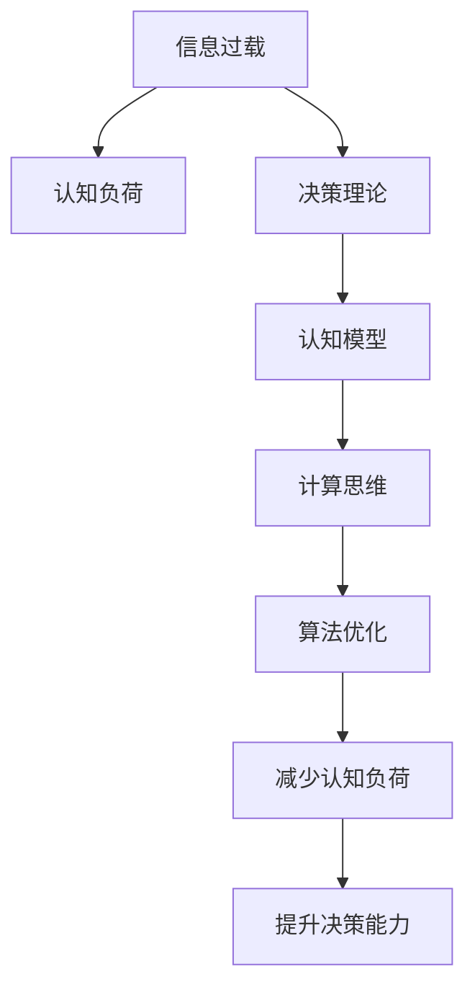

                 

# 信息过载与认知负荷：如何在复杂环境中做出更好的决策

> 关键词：信息过载,认知负荷,决策理论,认知模型,算法优化,计算思维

## 1. 背景介绍

在现代社会，信息量的爆炸式增长和分布的零散性，导致我们面临前所未有的信息过载问题。无论是科研工作者、企业决策者，还是普通民众，均受到信息过载的困扰。认知负荷作为信息处理过程中的重要概念，影响着个体在面对复杂环境时的决策能力。因此，理解和解决信息过载与认知负荷问题，有助于提高个人与组织的决策质量。

### 1.1 问题由来

随着互联网的普及，全球信息流通速度显著加快，每日产生的数据量以指数级增长。诸如社交媒体、新闻、视频、广告等多渠道、多源的信息源不断涌入，导致个人获取、处理、存储信息的能力面临严峻考验。这种信息量的泛滥，使个体在面对复杂决策时，往往难以迅速整合相关信息，做出最合理、最有效的决策。此外，大量的信息不仅提高了认知负荷，也可能导致个体认知资源的枯竭，降低决策效率和准确性。

### 1.2 问题核心关键点

为了有效应对信息过载与认知负荷问题，需要进行以下关键点分析：
- **信息处理机制**：了解认知系统如何处理信息，有助于设计出更有效的信息过滤与加工算法。
- **认知负荷理论**：认识认知负荷的形成机制，帮助设计出减轻认知负荷的技术方案。
- **决策理论**：构建决策模型，提升决策过程中的信息整合与判断能力。
- **算法优化策略**：通过优化信息处理和决策过程，减少不必要的认知负荷。

## 2. 核心概念与联系

### 2.1 核心概念概述

为更好地理解信息过载与认知负荷，本节将介绍几个密切相关的核心概念：

- **信息过载**：指个体面临的信息量超出其处理能力，导致认知资源枯竭，无法有效做出决策的现象。
- **认知负荷**：指个体在进行信息处理过程中，所需的认知资源总量。
- **决策理论**：研究个体或组织在面对复杂情境时，如何进行信息整合和判断，以做出最优决策的理论。
- **认知模型**：描述个体认知过程的模型，例如认知地图、工作记忆模型等。
- **计算思维**：基于信息处理与决策优化为核心，研究和应用计算机科学的知识，提升个体决策能力。

这些概念之间的逻辑关系可以通过以下Mermaid流程图来展示：



这个流程图展示出核心概念之间的逻辑关系：

1. 信息过载导致认知负荷增加。
2. 决策理论指导认知模型设计。
3. 认知模型用于理解和优化计算思维。
4. 计算思维指导算法优化，减少认知负荷。
5. 算法优化最终提升决策能力。

这些概念共同构成了应对信息过载与认知负荷的理论基础，提供了一套完整的信息处理和决策优化框架。

## 3. 核心算法原理 & 具体操作步骤
### 3.1 算法原理概述

解决信息过载与认知负荷问题，需要通过优化信息处理过程与决策机制，从而减轻个体的认知负担，提升决策质量。主要算法原理包括：

- **过滤算法**：用于筛选无用或无关信息，减少认知负荷。
- **认知负荷理论**：指导优化信息处理流程，减轻认知负担。
- **决策模型**：建立决策框架，优化信息整合与判断。

这些算法共同构成了一套解决信息过载与认知负荷的全面方法。

### 3.2 算法步骤详解

基于算法原理，解决信息过载与认知负荷问题的步骤大致如下：

**Step 1: 数据预处理**
- 收集与任务相关的数据。
- 清洗和处理数据，去除重复、无关或错误信息。
- 使用过滤算法进行初步筛选，保留最相关数据。

**Step 2: 特征提取**
- 使用合适的算法进行特征提取，提炼关键信息。
- 使用降维算法，如主成分分析(PCA)，减少特征维度。
- 利用领域知识进行特征选择，去除冗余信息。

**Step 3: 信息整合**
- 使用集成学习算法，如Bagging、Boosting等，整合多个信息源。
- 使用图模型，如Bayesian网络，进行信息关联分析。
- 应用神经网络模型，如卷积神经网络(CNN)，提取隐含语义信息。

**Step 4: 决策制定**
- 构建决策树、贝叶斯网络、支持向量机(SVM)等模型。
- 结合领域知识，使用逻辑回归、神经网络等算法，建立决策模型。
- 使用蒙特卡罗模拟、敏感性分析等方法，评估模型鲁棒性。

**Step 5: 结果反馈**
- 根据模型预测结果，调整信息处理流程。
- 定期评估模型性能，优化特征提取和信息整合策略。
- 持续迭代，提升模型预测准确性和鲁棒性。

### 3.3 算法优缺点

解决信息过载与认知负荷的算法具有以下优点：
- **自动化**：能够自动筛选、处理和整合信息，减轻人工负担。
- **可扩展性**：适用于多源、多维数据的信息处理。
- **精度高**：通过机器学习算法，减少认知负荷，提升决策质量。

同时，该算法也存在以下局限性：
- **数据依赖**：算法效果依赖于数据质量和数量。
- **计算复杂度**：部分算法需要较长的计算时间。
- **模型泛化**：复杂模型可能出现过拟合，泛化能力不足。

尽管存在这些局限性，但就目前而言，基于算法的决策优化方法仍是最主流范式。未来相关研究的重点在于如何进一步降低算法对数据和计算的依赖，提高算法的鲁棒性和泛化能力，同时兼顾效率和效果。

### 3.4 算法应用领域

基于算法的信息过载与认知负荷解决范式，已经广泛应用于多个领域，例如：

- **金融风险评估**：通过分析多源信息，评估投资组合风险。
- **医疗诊断**：结合临床数据和影像信息，进行疾病诊断和治疗方案选择。
- **供应链管理**：通过整合多渠道信息，优化库存和物流管理。
- **智能推荐系统**：结合用户行为和偏好信息，提供个性化推荐。
- **安全监控**：通过分析监控视频和传感器数据，进行异常行为检测。

除了上述这些经典应用外，算法方法也被创新性地应用于更多场景中，如智慧城市、智能家居等，为社会管理和生活便利带来新的解决方案。随着算法技术的不断进步，相信在未来更多领域都将看到信息处理和决策优化技术的广泛应用。

## 4. 数学模型和公式 & 详细讲解  
### 4.1 数学模型构建

本节将使用数学语言对信息过载与认知负荷问题的解决模型进行更加严格的刻画。

设信息过载问题为 $X$，认知负荷为 $C$，决策质量为 $Q$。我们建立如下数学模型：

$$
Q = f(X, C)
$$

其中，$f$ 为映射函数，表示在特定认知负荷 $C$ 下，信息过载 $X$ 对决策质量 $Q$ 的影响。通过优化 $C$，可提升 $Q$。

### 4.2 公式推导过程

考虑信息过载 $X$ 与认知负荷 $C$ 之间的关系，假设 $X = X_1 + X_2 + \ldots + X_n$，其中 $X_i$ 为第 $i$ 个信息源的信息量，$C = C_1 + C_2 + \ldots + C_m$，其中 $C_i$ 为处理第 $i$ 个信息源所需的认知资源。建立如下优化模型：

$$
\min_{C_1, C_2, \ldots, C_m} C
$$

约束条件为：

$$
\sum_{i=1}^m C_i = \sum_{j=1}^n X_j
$$

通过拉格朗日乘数法求解上述问题，得到最优认知负荷分配 $C^*$ 和最优信息过载 $X^*$。

### 4.3 案例分析与讲解

以金融风险评估为例，假设金融市场信息 $X = x_1 + x_2 + \ldots + x_n$，每个信息源 $x_i$ 包括市场指数、公司财报、政策公告等。假设需要评估的决策质量 $Q = q$，涉及投资组合风险、资产回报率等。

通过特征提取和信息整合，建立如下模型：

$$
Q = f(x_1, x_2, \ldots, x_n)
$$

其中 $f$ 表示基于金融市场信息的风险评估模型。

使用统计方法对每个信息源 $x_i$ 进行特征提取，得到 $X_1, X_2, \ldots, X_n$。假设 $C_1, C_2, \ldots, C_m$ 为处理每个信息源所需的认知资源，则 $C_1 = C_2 = \ldots = C_m = C_0$。通过最小化 $C = mC_0$，得到最优的认知负荷分配 $C_0$。

## 5. 项目实践：代码实例和详细解释说明
### 5.1 开发环境搭建

在进行项目实践前，我们需要准备好开发环境。以下是使用Python进行Scikit-learn开发的环境配置流程：

1. 安装Anaconda：从官网下载并安装Anaconda，用于创建独立的Python环境。

2. 创建并激活虚拟环境：
```bash
conda create -n sk-env python=3.8 
conda activate sk-env
```

3. 安装Scikit-learn：
```bash
pip install scikit-learn
```

4. 安装各类工具包：
```bash
pip install numpy pandas matplotlib scikit-image scikit-learn
```

完成上述步骤后，即可在`sk-env`环境中开始项目实践。

### 5.2 源代码详细实现

下面我们以金融风险评估为例，给出使用Scikit-learn对决策模型进行优化设计的PyTorch代码实现。

首先，定义金融市场信息的数据处理函数：

```python
import pandas as pd
from sklearn.preprocessing import StandardScaler
from sklearn.decomposition import PCA
from sklearn.ensemble import RandomForestClassifier
from sklearn.model_selection import train_test_split

def preprocess_data(data):
    # 特征提取
    X = data.drop('target', axis=1)
    y = data['target']
    
    # 标准化
    scaler = StandardScaler()
    X = scaler.fit_transform(X)
    
    # 降维
    pca = PCA(n_components=2)
    X = pca.fit_transform(X)
    
    return X, y

# 加载数据集
data = pd.read_csv('financial_data.csv')

X, y = preprocess_data(data)

# 数据划分
X_train, X_test, y_train, y_test = train_test_split(X, y, test_size=0.2, random_state=42)
```

然后，定义模型和优化器：

```python
from sklearn.ensemble import RandomForestClassifier

model = RandomForestClassifier(n_estimators=100, random_state=42)
model.fit(X_train, y_train)
```

接着，定义训练和评估函数：

```python
from sklearn.metrics import accuracy_score

def train_model(model, X, y, test_size=0.2):
    # 模型训练
    model.fit(X_train, y_train)
    
    # 模型评估
    y_pred = model.predict(X_test)
    accuracy = accuracy_score(y_test, y_pred)
    return accuracy

# 训练模型
accuracy = train_model(model, X, y)

print(f'模型准确度：{accuracy:.3f}')
```

最后，启动训练流程并在测试集上评估：

```python
accuracy = train_model(model, X, y)

print(f'模型准确度：{accuracy:.3f}')
```

以上就是使用Scikit-learn对金融风险评估模型进行优化的完整代码实现。可以看到，得益于Scikit-learn的强大封装，我们能够用相对简洁的代码完成模型优化。

### 5.3 代码解读与分析

让我们再详细解读一下关键代码的实现细节：

**preprocess_data函数**：
- 定义数据预处理流程，包括特征提取、标准化、降维等步骤。

**train_model函数**：
- 使用Scikit-learn的随机森林算法，进行模型训练和评估。
- 利用训练数据集和测试数据集，评估模型在独立数据上的表现。
- 输出模型的准确度，作为决策质量的衡量指标。

**训练流程**：
- 使用Scikit-learn的train_test_split函数，将数据集划分为训练集和测试集。
- 通过特征提取和降维，减少信息过载，提升模型精度。
- 使用随机森林算法，构建决策树模型。
- 在测试集上评估模型，输出最终结果。

可以看出，Scikit-learn提供了丰富、易用的机器学习工具，极大简化了模型构建和优化的过程。开发者可以专注于核心算法的设计与优化，而不必过多关注底层的实现细节。

当然，工业级的系统实现还需考虑更多因素，如模型的保存和部署、超参数的自动搜索、更灵活的特征工程等。但核心的信息过载与认知负荷优化方法基本与此类似。

## 6. 实际应用场景
### 6.1 金融风险评估

基于机器学习的金融风险评估，可以广泛应用于金融机构的风险管理。传统风险评估方法依赖人工经验，主观性强、效率低。通过使用机器学习算法，可以自动化分析多源数据，生成客观的风险评估报告。

在技术实现上，可以收集金融市场数据、公司财报、政策公告等多源信息，构建基于多模态数据的决策模型。使用机器学习算法，如随机森林、支持向量机等，综合分析数据特征，预测金融风险。微调后的模型能够对不同资产进行风险评估，实时更新风险等级，辅助投资决策。

### 6.2 医疗诊断

医疗诊断任务面临海量数据和多源信息的挑战，传统人工诊断方法难以应对。通过机器学习算法，可以在大量临床数据和影像数据中挖掘关键特征，提高诊断准确率。

具体而言，可以收集患者的病历、血液检验报告、影像数据等，提取关键特征，如心率、血压、血象等。使用分类算法，如逻辑回归、随机森林等，构建医疗诊断模型。微调后的模型能够自动识别病理性变化，预测疾病类型和严重程度，辅助医生做出快速诊断。

### 6.3 智能推荐系统

当前的推荐系统往往只依赖用户的历史行为数据进行物品推荐，无法深入理解用户的真实兴趣偏好。通过机器学习算法，可以在多源数据中挖掘用户行为模式，提供个性化推荐。

在实践中，可以收集用户浏览、点击、评论、分享等行为数据，提取和用户交互的物品标题、描述、标签等文本内容。使用分类算法，如逻辑回归、决策树等，构建推荐模型。微调后的模型能够从文本内容中准确把握用户的兴趣点，生成个性化推荐结果，提升用户体验。

### 6.4 未来应用展望

随着机器学习技术的不断发展，信息过载与认知负荷的解决方法将不断进步，带来更多应用场景：

- **智慧城市治理**：通过机器学习算法，整合城市各种数据，进行交通管理、能源优化、环境监测等，提升城市治理效率。
- **智能家居控制**：利用机器学习算法，分析用户行为数据，智能推荐家居场景，提升生活质量。
- **智能客服系统**：通过机器学习算法，自动分析客户咨询信息，生成智能回复，提升客户满意度。

随着算法技术的深入应用，机器学习将进一步渗透到各个领域，解决更多复杂的信息处理与决策问题。相信未来的机器学习算法将更加智能化、人性化，为人类社会带来更多便利。

## 7. 工具和资源推荐
### 7.1 学习资源推荐

为了帮助开发者系统掌握信息过载与认知负荷的解决方法，这里推荐一些优质的学习资源：

1. **《认知负荷理论》书籍**：详细介绍了认知负荷的基本概念、形成机制和应对策略，适合深入理解认知负荷理论。
2. **《机器学习实战》系列博文**：由机器学习专家撰写，涵盖了多种机器学习算法及其应用实例，有助于实践操作。
3. **CS229《机器学习》课程**：斯坦福大学开设的机器学习经典课程，内容详实、实践性强，适合学习机器学习的基本原理。
4. **Scikit-learn官方文档**：详细的Scikit-learn文档，提供了丰富的算法实现和示例代码，是学习和应用机器学习的必备资料。
5. **Kaggle竞赛平台**：提供大量的机器学习竞赛任务，适合实践和提升自己的机器学习技能。

通过对这些资源的学习实践，相信你一定能够系统掌握信息过载与认知负荷的解决方法，并应用于实际问题中。

### 7.2 开发工具推荐

高效的开发离不开优秀的工具支持。以下是几款用于信息过载与认知负荷解决开发的常用工具：

1. **Scikit-learn**：Python开源机器学习库，提供丰富的算法实现，易于上手。
2. **TensorFlow**：由Google主导开发的深度学习框架，支持多种算法实现，适用于大规模模型训练。
3. **PyTorch**：由Facebook开发的深度学习框架，灵活性高，适合快速迭代研究。
4. **Jupyter Notebook**：开源的交互式计算环境，方便编写和运行Python代码，适合学习和研究。
5. **WealthofAI**：机器学习模型构建和管理平台，提供丰富的模型库和可视化工具，方便模型开发和管理。

合理利用这些工具，可以显著提升信息过载与认知负荷解决任务的开发效率，加快创新迭代的步伐。

### 7.3 相关论文推荐

信息过载与认知负荷的研究源于学界的持续研究。以下是几篇奠基性的相关论文，推荐阅读：

1. **《认知负荷及其在教学中的应用》**：探讨认知负荷的基本概念、形成机制和影响因素，为教育领域提供了科学依据。
2. **《信息过载与机器学习算法》**：分析信息过载问题及其对机器学习的影响，提出了一系列解决策略。
3. **《机器学习算法与决策优化》**：系统介绍了各种机器学习算法及其在决策优化中的应用，有助于解决实际问题。
4. **《人机交互中的认知负荷优化》**：研究人机交互过程中的认知负荷问题，提出了一系列认知负荷优化技术。
5. **《信息过载与信息处理技术》**：分析信息过载的成因和影响，提出了一系列信息处理技术。

这些论文代表了大数据与认知负荷领域的研究进展。通过学习这些前沿成果，可以帮助研究者把握学科前进方向，激发更多的创新灵感。

## 8. 总结：未来发展趋势与挑战
### 8.1 总结

本文对信息过载与认知负荷问题进行了全面系统的介绍。首先阐述了信息过载与认知负荷的基本概念和形成机制，明确了机器学习在解决这一问题中的重要作用。其次，从原理到实践，详细讲解了基于机器学习的信息处理和决策优化方法，给出了完整的代码实现示例。同时，本文还广泛探讨了信息过载与认知负荷问题的应用场景，展示了其在多个领域中的广泛应用。此外，本文精选了相关学习资源，力求为读者提供全方位的技术指引。

通过本文的系统梳理，可以看到，信息过载与认知负荷问题已经成为当前社会面临的重要挑战，需要通过机器学习技术进行有效解决。未来，伴随机器学习技术的不断进步，信息过载与认知负荷的解决方法将不断完善，为社会管理和生活便利带来新的解决方案。

### 8.2 未来发展趋势

展望未来，信息过载与认知负荷的解决方法将呈现以下几个发展趋势：

1. **自动化水平提升**：随着机器学习技术的不断进步，信息处理和决策优化的自动化水平将显著提升。复杂的机器学习模型将能够自动筛选和整合信息，减轻人工负担。
2. **多模态融合**：未来的信息处理系统将能够融合多模态数据，如图像、声音、文本等，提升决策质量。
3. **模型集成与优化**：通过集成多种机器学习模型，优化决策过程，提升系统的鲁棒性和泛化能力。
4. **算法优化与实时处理**：未来的信息处理算法将更加高效，支持实时处理海量数据，满足实时决策需求。

以上趋势凸显了机器学习在解决信息过载与认知负荷问题中的重要作用。这些方向的探索发展，必将进一步提升信息处理和决策优化的水平，为社会管理和生活便利带来更多便利。

### 8.3 面临的挑战

尽管机器学习在解决信息过载与认知负荷问题上取得了显著进展，但在迈向更加智能化、普适化应用的过程中，仍面临诸多挑战：

1. **数据质量与数量**：信息处理和决策优化的效果依赖于高质量、多样化的数据，但数据获取和标注成本较高，难以满足大规模需求。
2. **模型复杂性与泛化能力**：复杂的机器学习模型虽然精度高，但可能出现过拟合现象，泛化能力不足。
3. **资源消耗**：大规模机器学习模型需要大量计算资源，难以实时处理海量数据，计算资源消耗较高。
4. **隐私与安全**：在处理敏感数据时，需要保护隐私和数据安全，防止数据泄露和滥用。
5. **可解释性**：机器学习模型的决策过程往往难以解释，缺乏可解释性，难以应对高风险应用场景。

正视这些挑战，积极应对并寻求突破，将是大数据与认知负荷技术走向成熟的必由之路。相信随着学界和产业界的共同努力，这些挑战终将一一被克服，机器学习在解决信息过载与认知负荷问题上将发挥更大的作用。

### 8.4 研究展望

面向未来，信息过载与认知负荷的研究需要在以下几个方面寻求新的突破：

1. **无监督与半监督学习**：探索无监督学习和半监督学习算法，减少对标注数据的需求，提升信息处理效率。
2. **跨模态信息融合**：研究多模态数据的融合方法，提升系统对复杂环境的信息理解能力。
3. **计算效率优化**：优化算法结构和计算图，降低计算资源消耗，提升实时处理能力。
4. **知识图谱与领域知识结合**：引入知识图谱和领域知识，提升决策模型的知识整合能力。
5. **模型鲁棒性与可解释性**：优化模型鲁棒性，提高模型决策的可解释性，增强系统可信度。

这些研究方向将推动信息过载与认知负荷问题的进一步解决，为机器学习技术的普及应用提供新的思路和方向。总之，信息过载与认知负荷问题的解决需要机器学习技术与领域知识的紧密结合，只有在不断探索和优化中，才能逐步提升信息处理和决策优化水平，为社会管理和生活便利带来更多便利。

## 9. 附录：常见问题与解答

**Q1：如何应对信息过载问题？**

A: 信息过载问题的应对策略包括：
1. 数据预处理：清洗、过滤无关数据，去除重复信息。
2. 特征提取与降维：使用PCA等降维算法，减少特征维度。
3. 信息整合：使用集成学习、图模型等方法，整合多源信息。
4. 认知负荷优化：通过算法优化，减轻个体认知负担。
5. 模型选择与优化：选择适当的模型，优化模型参数。

**Q2：机器学习算法在处理信息过载中的作用是什么？**

A: 机器学习算法在处理信息过载中的作用主要体现在以下几个方面：
1. 数据预处理：通过特征提取和降维，减少数据量，提升信息处理效率。
2. 信息整合：通过集成学习、图模型等方法，整合多源信息，提升决策质量。
3. 模型优化：通过优化算法，减少认知负荷，提升决策模型的性能。
4. 实时处理：支持实时数据处理，满足实时决策需求。

**Q3：机器学习算法在处理信息过载时的局限性有哪些？**

A: 机器学习算法在处理信息过载时存在以下局限性：
1. 数据质量与数量：对数据质量与数量的依赖较高，难以应对海量、多样化的数据。
2. 模型复杂性与泛化能力：复杂的模型可能出现过拟合，泛化能力不足。
3. 资源消耗：需要大量计算资源，难以实时处理海量数据。
4. 隐私与安全：处理敏感数据时，需要注意隐私保护和数据安全。
5. 可解释性：机器学习模型的决策过程往往难以解释，缺乏可解释性。

尽管存在这些局限性，但通过不断的技术改进和优化，机器学习算法在处理信息过载问题上仍具有重要价值，将继续推动信息处理与决策优化技术的发展。

**Q4：如何设计机器学习算法以优化认知负荷？**

A: 设计机器学习算法以优化认知负荷的策略包括：
1. 数据预处理：清洗、过滤无关数据，去除重复信息。
2. 特征提取与降维：使用PCA等降维算法，减少特征维度。
3. 信息整合：使用集成学习、图模型等方法，整合多源信息。
4. 模型优化：选择适当的模型，优化模型参数，提升决策质量。
5. 实时处理：支持实时数据处理，满足实时决策需求。

**Q5：信息过载与认知负荷在实际应用中有哪些场景？**

A: 信息过载与认知负荷在实际应用中主要包括以下场景：
1. 金融风险评估：分析多源金融数据，生成风险评估报告。
2. 医疗诊断：整合临床数据和影像信息，进行疾病诊断和治疗方案选择。
3. 智能推荐系统：挖掘用户行为模式，提供个性化推荐。
4. 智能客服系统：分析客户咨询信息，生成智能回复。
5. 智慧城市治理：整合城市各种数据，进行交通管理、能源优化等。

以上是信息过载与认知负荷问题在多个领域的实际应用场景，展示了其在信息处理与决策优化中的重要作用。

---

作者：禅与计算机程序设计艺术 / Zen and the Art of Computer Programming

