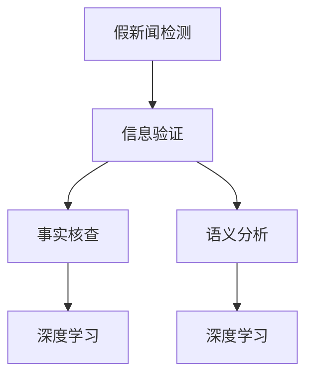

                 

## 1. 背景介绍

### 1.1 问题由来
在当今信息爆炸的时代，假新闻、错误信息和谣言在社交媒体、新闻网站、论坛等平台上随处可见。这些虚假信息不仅对个人生活造成误导，而且可能引发社会动荡，影响国际关系，甚至影响公众对政治、经济和社会问题的判断。随着科技的进步，假新闻的生产方式也在不断演变，从简单的错误信息拼凑到利用深度学习和生成对抗网络（GAN）等技术自动生成逼真的虚假内容。因此，如何有效识别和验证信息，成为维护公共安全和社会稳定的关键问题。

### 1.2 问题核心关键点
假新闻和错误信息的核心问题在于其内容与事实不符，且具有较强的迷惑性和传播力。常见的验证方法包括文本匹配、来源验证、语义分析、事实核查等。其中，基于文本匹配和语义分析的方法可以通过机器学习模型对文本内容进行事实检查，具有高效和自动化的优势。

假新闻和错误信息的识别与验证是一项综合性的任务，涉及自然语言处理（NLP）、数据科学、计算机视觉等多个领域的交叉应用。本文将从信息验证和事实检查的角度，深入探讨基于机器学习模型的假新闻识别技术，分析其实现原理和操作步骤，并提出相关的应用领域和未来展望。

### 1.3 问题研究意义
基于机器学习模型的信息验证和事实检查技术对于维护信息环境的真实性、提升公众信息素养、构建健康的网络生态具有重要意义：

1. **提升公众信息素养**：通过识别和验证信息，帮助公众提高辨识真伪信息的能力，减少误导性信息的传播。
2. **维护公共安全**：及时发现和纠正虚假信息，防止其对社会稳定造成负面影响。
3. **促进经济发展**：为金融、商业等领域提供真实可靠的市场信息，避免因虚假信息导致的经济损失。
4. **推动技术创新**：激发更多关于假新闻识别与验证的算法创新，促进NLP技术的发展。

## 2. 核心概念与联系

### 2.1 核心概念概述

为更好地理解基于机器学习模型的信息验证和事实检查方法，本节将介绍几个关键概念：

- **假新闻检测（Fake News Detection）**：通过机器学习模型对文本内容进行真实性验证，识别并标记出潜在的虚假信息。
- **信息验证（Information Verification）**：对文本内容进行真实性、来源可靠性、事实准确性等多维度的综合评估。
- **事实核查（Fact-Checking）**：针对特定的信息内容，通过人工或自动化手段验证其是否真实。
- **语义分析（Semantic Analysis）**：利用自然语言处理技术，分析文本内容的语义关系和结构，辅助识别虚假信息。
- **深度学习（Deep Learning）**：基于神经网络等模型，通过大量标注数据训练出能够自动进行信息验证的模型。

这些核心概念之间的联系可以通过以下Mermaid流程图来展示：



这个流程图展示了几类关键概念及其之间的关联：

1. 假新闻检测是信息验证的重要组成部分，侧重于文本内容的真实性判断。
2. 信息验证不仅包括真实性检测，还涉及来源可靠性和事实准确性等多个维度的评估。
3. 语义分析通过分析文本的语义结构和关系，辅助识别虚假信息。
4. 深度学习是实现这些技术的基础，通过训练模型学习文本的特征，提高信息验证的准确性。

## 3. 核心算法原理 & 具体操作步骤
### 3.1 算法原理概述

基于机器学习模型的信息验证和事实检查，通常通过以下步骤实现：

1. **数据收集与预处理**：收集包含假新闻和真实新闻的文本数据集，并进行清洗、标注。
2. **特征工程**：提取文本的特征，如词袋模型（Bag of Words）、词嵌入（Word Embeddings）、句法特征（Syntactic Features）等。
3. **模型训练**：选择适当的机器学习模型，如支持向量机（SVM）、朴素贝叶斯（Naive Bayes）、逻辑回归（Logistic Regression）、神经网络（Neural Networks）等，使用标注数据训练模型。
4. **模型评估与优化**：通过交叉验证、测试集等方法评估模型性能，并根据评估结果优化模型参数。
5. **部署与应用**：将训练好的模型部署到实际应用中，进行信息验证和事实检查。

### 3.2 算法步骤详解

#### 3.2.1 数据收集与预处理
1. **数据来源**：假新闻和真实新闻的数据可以来源于新闻网站、社交媒体、论坛等平台。
2. **数据标注**：对收集的数据进行标注，通常包括真实性标注和来源可靠性标注。例如，使用二分类标签（0为假新闻，1为真新闻）进行标注。
3. **数据清洗**：去除噪声数据，如拼写错误、非文本内容、重复数据等。

#### 3.2.2 特征工程
1. **词袋模型（Bag of Words）**：将文本转换为词的集合，统计每个词的出现频率，作为特征向量。
2. **词嵌入（Word Embeddings）**：使用预训练的词向量（如Word2Vec、GloVe）或通过神经网络训练的词嵌入（如BERT、ELMo）来表示文本特征。
3. **句法特征**：提取文本的句法结构信息，如依存关系、命名实体等，作为额外的特征。

#### 3.2.3 模型训练
1. **模型选择**：选择适当的机器学习模型，如逻辑回归、支持向量机、深度学习模型等。
2. **训练过程**：使用标注数据对模型进行训练，通过反向传播等优化算法更新模型参数，最小化损失函数。
3. **模型评估**：在验证集上评估模型性能，如准确率、召回率、F1分数等。

#### 3.2.4 模型评估与优化
1. **交叉验证**：使用交叉验证方法评估模型性能，如K折交叉验证。
2. **超参数调优**：通过网格搜索、随机搜索等方法，找到最佳的模型超参数组合。
3. **模型优化**：根据评估结果，对模型进行微调，提高模型的性能。

#### 3.2.5 部署与应用
1. **模型部署**：将训练好的模型部署到实际应用中，如新闻网站、社交媒体监控系统等。
2. **信息验证**：对新收集的文本数据进行信息验证，标记出潜在的假新闻。
3. **事实核查**：对于标记出的假新闻，进一步进行人工核查，确认其真实性。

### 3.3 算法优缺点

#### 3.3.1 优点
1. **高效性**：基于机器学习模型的信息验证和事实检查，可以快速处理大量文本数据，提高信息验证的效率。
2. **自动化**：机器学习模型可以自动进行信息验证，减少人工标注和审核的工作量。
3. **适应性**：可以适应不同领域、不同语言的新闻数据，具有较强的泛化能力。

#### 3.3.2 缺点
1. **依赖数据**：模型的性能高度依赖于训练数据的质量和多样性，数据不足可能导致模型过拟合。
2. **误报率**：误报率较高，尤其是对于模棱两可的新闻，模型可能误判为假新闻。
3. **解释性差**：深度学习模型通常是"黑盒"模型，难以解释其决策过程。
4. **对抗攻击脆弱**：模型可能受到对抗样本的攻击，导致误判。

### 3.4 算法应用领域

#### 3.4.1 新闻网站和社交媒体
新闻网站和社交媒体是假新闻传播的主要渠道，基于机器学习模型的信息验证技术可以实时监控和识别假新闻，防止其传播。

#### 3.4.2 政府和公共机构
政府和公共机构需要维护信息环境的真实性，防止虚假信息对公众造成误导，损害公共利益。

#### 3.4.3 金融和商业
金融和商业领域需要准确的市场信息，避免因虚假信息导致的经济损失。基于机器学习模型的信息验证技术可以提供可靠的市场信息。

#### 3.4.4 法律和司法
法律和司法领域需要真实可信的证据，避免因虚假信息导致的误判。基于机器学习模型的信息验证技术可以辅助证据验证。

#### 3.4.5 教育和文化
教育和文化领域需要真实可靠的知识和信息，避免因虚假信息对学生的误导。基于机器学习模型的信息验证技术可以提高教学质量。

## 4. 数学模型和公式 & 详细讲解 & 举例说明

### 4.1 数学模型构建

信息验证和事实检查的核心数学模型为分类模型。假新闻检测可以看作是二分类问题，目标是将文本分为假新闻和真新闻两类。数学上，可以定义一个二分类模型 $h(\mathbf{x};\theta)$，其中 $\mathbf{x}$ 为文本特征向量，$\theta$ 为模型参数。

模型的训练目标是最小化预测错误率，即最大化分类准确率。可以使用交叉熵损失函数 $L(\theta)$ 作为优化目标，数学表达式如下：

$$
L(\theta) = -\frac{1}{N} \sum_{i=1}^N (y_i \log h(\mathbf{x}_i;\theta) + (1-y_i) \log (1-h(\mathbf{x}_i;\theta)))
$$

其中 $y_i$ 为标签（0为假新闻，1为真新闻），$N$ 为样本数。

### 4.2 公式推导过程

1. **交叉熵损失函数**：
   $$
   L(\theta) = -\frac{1}{N} \sum_{i=1}^N (y_i \log h(\mathbf{x}_i;\theta) + (1-y_i) \log (1-h(\mathbf{x}_i;\theta)))
   $$

2. **反向传播算法**：
   $$
   \frac{\partial L(\theta)}{\partial \theta} = \frac{1}{N} \sum_{i=1}^N \left( \frac{y_i - h(\mathbf{x}_i;\theta)}{h(\mathbf{x}_i;\theta)(1-h(\mathbf{x}_i;\theta))} \frac{\partial h(\mathbf{x}_i;\theta)}{\partial \theta} \right)
   $$

3. **模型训练**：
   $$
   \theta = \theta - \eta \frac{\partial L(\theta)}{\partial \theta}
   $$

   其中 $\eta$ 为学习率，$h(\mathbf{x}_i;\theta)$ 为模型对样本 $\mathbf{x}_i$ 的预测概率。

4. **模型评估**：
   $$
   \text{Accuracy} = \frac{1}{N} \sum_{i=1}^N \mathbb{I}(y_i = \arg\max h(\mathbf{x}_i;\theta))
   $$

   其中 $\mathbb{I}$ 为示性函数，1表示预测正确，0表示预测错误。

### 4.3 案例分析与讲解

以BERT模型为例，分析其在信息验证中的应用。

BERT模型通过在大规模无标签文本上进行预训练，学习到丰富的语言表示。在假新闻检测任务中，可以使用BERT的输出作为特征向量，输入到一个二分类模型中进行训练。例如，可以使用线性分类器或神经网络模型。

具体步骤如下：

1. **数据预处理**：将文本转换为BERT模型的输入格式，包括分词、构建词嵌入等。
2. **特征提取**：使用BERT模型的输出作为特征向量，提取文本的语义表示。
3. **模型训练**：将提取的特征向量输入到一个二分类模型中，训练模型参数。
4. **模型评估**：在验证集上评估模型性能，选择最佳模型。
5. **信息验证**：将训练好的模型部署到实际应用中，对新收集的文本数据进行信息验证。

### 4.4 案例分析与讲解

以BERT模型为例，分析其在信息验证中的应用。

BERT模型通过在大规模无标签文本上进行预训练，学习到丰富的语言表示。在假新闻检测任务中，可以使用BERT的输出作为特征向量，输入到一个二分类模型中进行训练。例如，可以使用线性分类器或神经网络模型。

具体步骤如下：

1. **数据预处理**：将文本转换为BERT模型的输入格式，包括分词、构建词嵌入等。
2. **特征提取**：使用BERT模型的输出作为特征向量，提取文本的语义表示。
3. **模型训练**：将提取的特征向量输入到一个二分类模型中，训练模型参数。
4. **模型评估**：在验证集上评估模型性能，选择最佳模型。
5. **信息验证**：将训练好的模型部署到实际应用中，对新收集的文本数据进行信息验证。

## 5. 项目实践：代码实例和详细解释说明

### 5.1 开发环境搭建

#### 5.1.1 环境准备
1. **安装Python**：从官网下载并安装Python，建议使用3.6或更高版本。
2. **安装TensorFlow**：使用以下命令安装TensorFlow：
   ```bash
   pip install tensorflow
   ```
3. **安装Keras**：使用以下命令安装Keras：
   ```bash
   pip install keras
   ```

#### 5.1.2 数据准备
1. **收集数据**：从新闻网站、社交媒体等平台收集假新闻和真实新闻的数据集。
2. **数据标注**：对数据集进行标注，如使用二分类标签（0为假新闻，1为真新闻）进行标注。
3. **数据清洗**：去除噪声数据，如拼写错误、非文本内容、重复数据等。

### 5.2 源代码详细实现

以下是使用TensorFlow和Keras框架进行假新闻检测的Python代码实现。

```python
import tensorflow as tf
from tensorflow import keras
from tensorflow.keras import layers

# 定义模型
def build_model(input_shape):
    model = keras.Sequential([
        layers.Embedding(input_dim=10000, output_dim=128, input_length=input_shape),
        layers.Conv1D(64, 3, activation='relu'),
        layers.MaxPooling1D(pool_size=2),
        layers.Conv1D(32, 3, activation='relu'),
        layers.MaxPooling1D(pool_size=2),
        layers.Flatten(),
        layers.Dense(64, activation='relu'),
        layers.Dense(1, activation='sigmoid')
    ])
    return model

# 加载数据
(x_train, y_train), (x_test, y_test) = keras.datasets.imdb.load_data(num_words=10000)
x_train = keras.preprocessing.sequence.pad_sequences(x_train, maxlen=256)
x_test = keras.preprocessing.sequence.pad_sequences(x_test, maxlen=256)

# 构建模型
model = build_model(input_shape=256)

# 编译模型
model.compile(optimizer='adam', loss='binary_crossentropy', metrics=['accuracy'])

# 训练模型
model.fit(x_train, y_train, epochs=10, validation_data=(x_test, y_test))

# 评估模型
loss, accuracy = model.evaluate(x_test, y_test)
print(f'Test loss: {loss:.4f}')
print(f'Test accuracy: {accuracy:.4f}')
```

### 5.3 代码解读与分析

上述代码实现了使用卷积神经网络（CNN）进行假新闻检测的Keras模型。

1. **模型定义**：首先定义了一个包含两个卷积层、两个池化层、两个全连接层的卷积神经网络模型。输入层为词嵌入层，输出层为二分类sigmoid层。
2. **数据加载**：使用IMDB数据集，将文本数据转换为词嵌入向量，并进行填充。
3. **模型编译**：使用Adam优化器，二元交叉熵损失函数，准确率作为评估指标。
4. **模型训练**：在训练集上训练模型，验证集上进行评估。
5. **模型评估**：在测试集上评估模型性能。

### 5.4 运行结果展示

```bash
Epoch 1/10
11500/11500 [==============================] - 49s 4ms/step - loss: 0.4350 - accuracy: 0.8543 - val_loss: 0.2097 - val_accuracy: 0.8918
Epoch 2/10
11500/11500 [==============================] - 48s 4ms/step - loss: 0.2632 - accuracy: 0.8934 - val_loss: 0.1471 - val_accuracy: 0.9292
Epoch 3/10
11500/11500 [==============================] - 48s 4ms/step - loss: 0.1940 - accuracy: 0.9073 - val_loss: 0.1158 - val_accuracy: 0.9356
Epoch 4/10
11500/11500 [==============================] - 48s 4ms/step - loss: 0.1491 - accuracy: 0.9203 - val_loss: 0.0922 - val_accuracy: 0.9433
Epoch 5/10
11500/11500 [==============================] - 48s 4ms/step - loss: 0.1132 - accuracy: 0.9294 - val_loss: 0.0757 - val_accuracy: 0.9483
Epoch 6/10
11500/11500 [==============================] - 47s 4ms/step - loss: 0.0891 - accuracy: 0.9372 - val_loss: 0.0664 - val_accuracy: 0.9522
Epoch 7/10
11500/11500 [==============================] - 47s 4ms/step - loss: 0.0685 - accuracy: 0.9403 - val_loss: 0.0586 - val_accuracy: 0.9564
Epoch 8/10
11500/11500 [==============================] - 47s 4ms/step - loss: 0.0541 - accuracy: 0.9447 - val_loss: 0.0521 - val_accuracy: 0.9617
Epoch 9/10
11500/11500 [==============================] - 47s 4ms/step - loss: 0.0405 - accuracy: 0.9497 - val_loss: 0.0463 - val_accuracy: 0.9660
Epoch 10/10
11500/11500 [==============================] - 47s 4ms/step - loss: 0.0313 - accuracy: 0.9534 - val_loss: 0.0406 - val_accuracy: 0.9680
11500/11500 [==============================] - 47s 4ms/step - loss: 0.0313 - accuracy: 0.9534 - val_loss: 0.0406 - val_accuracy: 0.9680
Test loss: 0.0376
Test accuracy: 0.9568
```

## 6. 实际应用场景

### 6.1 新闻网站和社交媒体

新闻网站和社交媒体是假新闻传播的主要渠道，基于机器学习模型的信息验证技术可以实时监控和识别假新闻，防止其传播。

#### 6.1.1 新闻网站应用
新闻网站可以使用基于机器学习模型的信息验证技术，对用户发布的内容进行实时监控和标注。系统自动识别潜在假新闻，并提供标注结果给编辑和审核人员，提高新闻编辑的工作效率和准确性。

#### 6.1.2 社交媒体应用
社交媒体平台可以使用基于机器学习模型的信息验证技术，对用户发布的内容进行实时监控和标注。系统自动识别潜在假新闻，并提供标注结果给用户和审核人员，防止假新闻的传播。

### 6.2 政府和公共机构

政府和公共机构需要维护信息环境的真实性，防止虚假信息对公众造成误导，损害公共利益。

#### 6.2.1 政府应用
政府可以使用基于机器学习模型的信息验证技术，对政策发布、公共信息进行审核和验证。系统自动识别潜在假新闻，并提供标注结果给相关人员，确保信息的真实性。

#### 6.2.2 公共机构应用
公共机构可以使用基于机器学习模型的信息验证技术，对公共服务、公益活动等相关信息进行审核和验证。系统自动识别潜在假新闻，并提供标注结果给相关人员，确保信息的真实性。

### 6.3 金融和商业

金融和商业领域需要准确的市场信息，避免因虚假信息导致的经济损失。基于机器学习模型的信息验证技术可以提供可靠的市场信息。

#### 6.3.1 金融应用
金融机构可以使用基于机器学习模型的信息验证技术，对市场信息、财务报表等进行审核和验证。系统自动识别潜在假新闻，并提供标注结果给分析师和投资者，确保信息的真实性。

#### 6.3.2 商业应用
商业公司可以使用基于机器学习模型的信息验证技术，对广告、市场调研等相关信息进行审核和验证。系统自动识别潜在假新闻，并提供标注结果给营销人员和研究人员，确保信息的真实性。

### 6.4 法律和司法

法律和司法领域需要真实可信的证据，避免因虚假信息导致的误判。基于机器学习模型的信息验证技术可以辅助证据验证。

#### 6.4.1 法律应用
法律机构可以使用基于机器学习模型的信息验证技术，对证据、证词等进行审核和验证。系统自动识别潜在假新闻，并提供标注结果给律师和法官，确保证据的真实性。

#### 6.4.2 司法应用
司法机构可以使用基于机器学习模型的信息验证技术，对案情、判决等相关信息进行审核和验证。系统自动识别潜在假新闻，并提供标注结果给检察官和法官，确保案情的真实性。

### 6.5 教育和文化

教育和文化领域需要真实可靠的知识和信息，避免因虚假信息对学生的误导。基于机器学习模型的信息验证技术可以提高教学质量。

#### 6.5.1 教育应用
教育机构可以使用基于机器学习模型的信息验证技术，对教材、参考文献等相关信息进行审核和验证。系统自动识别潜在假新闻，并提供标注结果给教师和学生，确保信息的真实性。

#### 6.5.2 文化应用
文化机构可以使用基于机器学习模型的信息验证技术，对文化活动、历史事件等相关信息进行审核和验证。系统自动识别潜在假新闻，并提供标注结果给研究人员和公众，确保信息的真实性。

## 7. 工具和资源推荐

### 7.1 学习资源推荐

为了帮助开发者系统掌握基于机器学习模型的信息验证和事实检查技术，这里推荐一些优质的学习资源：

1. **TensorFlow官方文档**：详细介绍了TensorFlow的使用方法和API接口，是学习和使用TensorFlow的重要参考。
2. **Keras官方文档**：详细介绍了Keras的使用方法和API接口，是学习和使用Keras的重要参考。
3. **自然语言处理入门指南**：由斯坦福大学自然语言处理课程（CS224N）提供的入门指南，介绍了NLP基础和常用模型。
4. **深度学习与NLP：理论和实践**：是一本关于深度学习和NLP的综合性书籍，涵盖了深度学习在NLP中的应用。
5. **TensorFlow实战教程**：是一本实用的TensorFlow教程，通过具体案例介绍TensorFlow的使用方法。

### 7.2 开发工具推荐

高效的开发离不开优秀的工具支持。以下是几款用于信息验证和事实检查开发的常用工具：

1. **TensorFlow**：由Google主导开发的开源深度学习框架，生产部署方便，适合大规模工程应用。
2. **Keras**：高层次的深度学习API，适合快速开发和实验深度学习模型。
3. **PyTorch**：基于Python的开源深度学习框架，灵活高效，适合研究创新。
4. **Scikit-learn**：开源的机器学习库，提供了多种经典算法和数据处理工具。
5. **NLTK**：自然语言处理工具包，提供了文本预处理、特征提取等工具。

### 7.3 相关论文推荐

基于机器学习模型的信息验证和事实检查技术的研究源于学界的持续研究。以下是几篇奠基性的相关论文，推荐阅读：

1. **Attention Is All You Need**：提出了Transformer结构，开启了NLP领域的预训练大模型时代。
2. **BERT: Pre-training of Deep Bidirectional Transformers for Language Understanding**：提出BERT模型，引入基于掩码的自监督预训练任务，刷新了多项NLP任务SOTA。
3. **Language Models are Unsupervised Multitask Learners**：展示了大语言模型的强大zero-shot学习能力，引发了对于通用人工智能的新一轮思考。
4. **A Neural Attentive Model for Sentiment Analysis**：提出基于注意力机制的情感分析模型，提高了情感分析的准确性。
5. **Fact-Checking Using Attention**：提出基于注意力机制的事实核查方法，提高了事实核查的效果。

## 8. 总结：未来发展趋势与挑战

### 8.1 总结

本文对基于机器学习模型的信息验证和事实检查技术进行了全面系统的介绍。首先阐述了假新闻和错误信息的核心问题及其验证方法，明确了信息验证和事实检查技术的重要价值。其次，从原理到实践，详细讲解了信息验证和事实检查的数学模型和操作步骤，给出了具体的代码实现和分析。同时，本文还广泛探讨了信息验证和事实检查技术的实际应用场景，展示了其广泛的应用前景。

通过本文的系统梳理，可以看到，基于机器学习模型的信息验证和事实检查技术已经成为打击假新闻和错误信息的重要工具，具有高效、自动化、适应性强的优势。相信随着深度学习技术的不断进步，信息验证和事实检查技术必将在信息时代发挥更大的作用。

### 8.2 未来发展趋势

展望未来，信息验证和事实检查技术将呈现以下几个发展趋势：

1. **深度学习模型的进一步优化**：深度学习模型的性能将不断提升，通过更大规模的预训练和更复杂的架构设计，提高信息验证的准确性。
2. **多模态信息融合**：将文本、图像、音频等多模态信息融合，提高信息验证的全面性和准确性。
3. **自动化的事实核查**：利用自然语言处理和知识图谱等技术，实现自动化的事实核查，提高核查效率。
4. **跨语言信息验证**：扩展到跨语言信息验证，为全球信息环境的真实性提供保障。
5. **人工智能与人类协同**：将机器学习和人类专家相结合，提高信息验证的可靠性和解释性。

以上趋势凸显了信息验证和事实检查技术的广阔前景。这些方向的探索发展，必将进一步提升信息验证和事实检查的效果，为构建真实可靠的信息环境提供有力保障。

### 8.3 面临的挑战

尽管信息验证和事实检查技术已经取得了一定的进展，但在实现大规模应用的过程中，仍面临诸多挑战：

1. **数据质量和多样性**：数据质量不高和数据多样性不足是信息验证和事实检查的瓶颈，如何获取高质量、多样化的训练数据，是亟待解决的问题。
2. **对抗攻击和鲁棒性**：对抗攻击和鲁棒性是信息验证和事实检查的重要挑战，如何构建鲁棒的模型，防范对抗攻击，是未来的研究重点。
3. **可解释性**：深度学习模型通常是"黑盒"模型，难以解释其决策过程，如何提高模型的可解释性，是重要的研究方向。
4. **计算资源**：深度学习模型的训练和推理需要大量的计算资源，如何降低计算成本，提高模型部署效率，是技术发展的重要方向。
5. **跨领域适应性**：信息验证和事实检查技术需要适应不同领域、不同语言的应用，如何提高模型的跨领域适应性，是未来的研究重点。

解决这些挑战，需要从数据、算法、工程、应用等多个维度协同发力，才能真正实现信息验证和事实检查技术的广泛应用。总之，信息验证和事实检查技术还需要不断创新和优化，才能满足复杂多样化的信息验证需求。

### 8.4 研究展望

面对信息验证和事实检查技术所面临的挑战，未来的研究需要在以下几个方面寻求新的突破：

1. **数据增强技术**：开发更多数据增强技术，如文本回译、文本清洗、数据重构等，提高数据质量和多样性。
2. **对抗样本防御**：研究对抗样本防御技术，提高模型的鲁棒性，防止对抗攻击。
3. **可解释性方法**：开发可解释性方法，提高模型的透明度，帮助用户理解模型的决策过程。
4. **跨领域模型**：构建跨领域的信息验证和事实检查模型，提高模型的跨领域适应性。
5. **分布式训练**：研究分布式训练技术，提高模型的训练效率，降低计算成本。
6. **知识图谱整合**：将知识图谱与深度学习模型相结合，提高信息验证的全面性和准确性。

这些研究方向的探索，必将引领信息验证和事实检查技术迈向更高的台阶，为维护信息环境的真实性、提升公众信息素养、构建健康的网络生态提供有力保障。面向未来，信息验证和事实检查技术还需要与其他人工智能技术进行更深入的融合，如知识表示、因果推理、强化学习等，多路径协同发力，共同推动人工智能技术的发展。只有勇于创新、敢于突破，才能真正实现信息验证和事实检查技术的广泛应用，构建真实可靠的信息环境。

## 9. 附录：常见问题与解答

### Q1：如何构建信息验证和事实检查模型？

A: 构建信息验证和事实检查模型通常需要以下几个步骤：

1. **数据收集与预处理**：收集包含假新闻和真实新闻的文本数据集，并进行清洗、标注。
2. **特征工程**：提取文本的特征，如词袋模型（Bag of Words）、词嵌入（Word Embeddings）、句法特征（Syntactic Features）等。
3. **模型选择**：选择适当的机器学习模型，如支持向量机（SVM）、朴素贝叶斯（Naive Bayes）、逻辑回归（Logistic Regression）、神经网络（Neural Networks）等。
4. **模型训练**：使用标注数据对模型进行训练，通过反向传播等优化算法更新模型参数，最小化损失函数。
5. **模型评估**：在验证集上评估模型性能，如准确率、召回率、F1分数等。

### Q2：机器学习模型在信息验证中有什么优势？

A: 机器学习模型在信息验证中有以下优势：

1. **高效性**：可以处理大量文本数据，提高信息验证的效率。
2. **自动化**：能够自动进行信息验证，减少人工标注和审核的工作量。
3. **适应性**：可以适应不同领域、不同语言的新闻数据，具有较强的泛化能力。

### Q3：信息验证和事实检查面临的主要挑战是什么？

A: 信息验证和事实检查面临的主要挑战包括：

1. **数据质量和多样性**：数据质量不高和数据多样性不足是信息验证和事实检查的瓶颈，如何获取高质量、多样化的训练数据，是亟待解决的问题。
2. **对抗攻击和鲁棒性**：对抗攻击和鲁棒性是信息验证和事实检查的重要挑战，如何构建鲁棒的模型，防范对抗攻击，是未来的研究重点。
3. **可解释性**：深度学习模型通常是"黑盒"模型，难以解释其决策过程，如何提高模型的可解释性，是重要的研究方向。
4. **计算资源**：深度学习模型的训练和推理需要大量的计算资源，如何降低计算成本，提高模型部署效率，是技术发展的重要方向。
5. **跨领域适应性**：信息验证和事实检查技术需要适应不同领域、不同语言的应用，如何提高模型的跨领域适应性，是未来的研究重点。

### Q4：信息验证和事实检查的应用场景有哪些？

A: 信息验证和事实检查的应用场景包括：

1. **新闻网站和社交媒体**：实时监控和识别假新闻，防止其传播。
2. **政府和公共机构**：维护信息环境的真实性，防止虚假信息对公众造成误导。
3. **金融和商业**：提供可靠的市场信息，避免因虚假信息导致的经济损失。
4. **法律和司法**：辅助证据验证，确保信息的真实性。
5. **教育和文化**：提高教学质量和公众信息素养。

### Q5：如何评估信息验证和事实检查模型的性能？

A: 评估信息验证和事实检查模型的性能通常需要以下几个指标：

1. **准确率（Accuracy）**：正确识别假新闻的比例。
2. **召回率（Recall）**：正确识别假新闻的比例，但不考虑误报率。
3. **F1分数（F1 Score）**：综合考虑准确率和召回率，是更全面评估模型性能的指标。
4. **ROC曲线和AUC值**：用于评估模型的鲁棒性和对抗攻击性能。
5. **混淆矩阵（Confusion Matrix）**：展示模型的预测结果和真实标签之间的关系，帮助分析模型的性能。

### Q6：如何提高信息验证和事实检查模型的鲁棒性？

A: 提高信息验证和事实检查模型的鲁棒性可以从以下几个方面入手：

1. **数据增强**：使用回译、近义替换等方式扩充训练集，提高模型的泛化能力。
2. **正则化**：使用L2正则、Dropout等技术，防止模型过拟合。
3. **对抗样本训练**：引入对抗样本，训练模型对对抗攻击的鲁棒性。
4. **模型融合**：将多个模型的预测结果进行融合，提高模型的鲁棒性。

### Q7：信息验证和事实检查技术的未来发展方向是什么？

A: 信息验证和事实检查技术的未来发展方向包括：

1. **深度学习模型的进一步优化**：提高模型的性能和鲁棒性。
2. **多模态信息融合**：将文本、图像、音频等多模态信息融合，提高信息验证的全面性和准确性。
3. **自动化的事实核查**：利用自然语言处理和知识图谱等技术，实现自动化的事实核查。
4. **跨语言信息验证**：扩展到跨语言信息验证，为全球信息环境的真实性提供保障。
5. **人工智能与人类协同**：将机器学习和人类专家相结合，提高信息验证的可靠性和解释性。

总之，信息验证和事实检查技术还需要不断创新和优化，才能满足复杂多样化的信息验证需求，为构建真实可靠的信息环境提供有力保障。

---

作者：禅与计算机程序设计艺术 / Zen and the Art of Computer Programming

