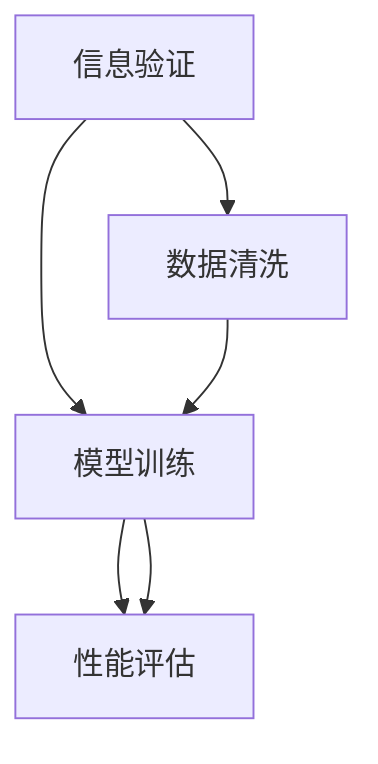

                 

# 信息验证和事实检查：在错误信息泛滥的时代导航

> 关键词：信息验证, 事实检查, 自然语言处理(NLP), 深度学习, 模型训练, 数据清洗, 性能评估

## 1. 背景介绍

### 1.1 问题由来

在互联网时代，信息的传播速度前所未有地加快，但也带来了信息泛滥、假消息泛滥、错误信息频发等问题。假新闻、误导性信息、未经核实的数据已经严重影响了社会的正常秩序和人们的决策，尤其是对政治、经济和社会生活产生了深远的影响。

为应对这一挑战，信息验证和事实检查技术应运而生。通过运用自然语言处理(NLP)、深度学习等技术，结合数据清洗、模型训练、性能评估等步骤，实现自动化的信息真实性判断。

### 1.2 问题核心关键点

信息验证和事实检查技术主要关注以下几个关键点：

- **数据清洗**：从海量网络数据中筛选出具有代表性的真实样本和虚假样本。
- **模型训练**：构建一个有效的模型来判断给定文本的真假，或者进行文本的真实性标注。
- **性能评估**：对训练好的模型进行准确性、鲁棒性、泛化能力等评估。
- **部署应用**：将模型部署到实际场景中，进行实时信息验证和事实检查。

## 2. 核心概念与联系

### 2.1 核心概念概述

为更好地理解信息验证和事实检查技术，本节将介绍几个密切相关的核心概念：

- **信息验证(Information Verification)**：对某条信息是否真实可靠进行评估和判断。
- **事实检查(Fact-Checking)**：通过获取多源信息，识别和纠正文本中的错误信息，提升信息的质量和准确性。
- **深度学习(Deep Learning)**：利用多层次的神经网络，从原始数据中自动学习特征和模式，构建具有高度复杂性的模型。
- **自然语言处理(NLP)**：使计算机能够理解、解析、生成自然语言，辅助进行文本的分析和处理。
- **模型训练(Model Training)**：通过给定的数据集，优化模型参数，使其能够适应特定任务。
- **数据清洗(Data Cleaning)**：去除噪声和无用数据，确保训练数据的有效性。
- **性能评估(Performance Evaluation)**：评估模型的表现，衡量其在实际应用中的效果。

这些概念之间的逻辑关系可以通过以下Mermaid流程图来展示：



这个流程图展示了信息验证和事实检查的关键步骤及其之间的关系：

1. 从海量网络数据中筛选真实样本和虚假样本。
2. 在筛选后的数据上构建和训练模型。
3. 评估模型的准确性和鲁棒性。
4. 将模型部署到实际场景中，实时验证信息。

## 3. 核心算法原理 & 具体操作步骤
### 3.1 算法原理概述

信息验证和事实检查的核心算法原理基于自然语言处理(NLP)和深度学习。

其基本思路为：
1. 数据清洗：从互联网和社交媒体上收集大量文本数据，筛选出真实和虚假样本。
2. 特征提取：利用NLP技术提取文本特征，如语义、情感、可信度等。
3. 模型训练：构建深度学习模型，如序列模型、图模型、对抗网络等，训练其预测文本真实性的能力。
4. 性能评估：通过交叉验证、AUC、F1等指标，评估模型的效果。
5. 部署应用：将模型部署到生产环境中，实时进行信息验证和事实检查。

### 3.2 算法步骤详解

以下是信息验证和事实检查的主要步骤：

**Step 1: 数据收集与预处理**
- 收集来自互联网、社交媒体、新闻网站等来源的文本数据。
- 对数据进行清洗，去除噪声、停用词、拼写错误等。
- 将数据划分为训练集、验证集和测试集。

**Step 2: 特征提取与表示**
- 使用NLP技术对文本进行分词、词性标注、句法分析等处理。
- 构建文本表示模型，如word2vec、GloVe等，将文本转换为向量表示。
- 引入外部知识库，如知识图谱、事实表等，丰富文本的语义信息。

**Step 3: 模型设计与训练**
- 选择合适的深度学习模型，如RNN、LSTM、BERT等。
- 设计模型架构，包括输入层、编码器、输出层等。
- 使用训练集数据对模型进行训练，调整模型参数。
- 在验证集上评估模型性能，避免过拟合。

**Step 4: 性能评估与优化**
- 在测试集上评估模型性能，计算准确率、召回率、F1等指标。
- 进行交叉验证，防止模型过拟合。
- 引入对抗样本，提高模型的鲁棒性。
- 优化模型超参数，如学习率、批大小等。

**Step 5: 部署应用**
- 将训练好的模型部署到生产环境，实时接收输入。
- 在生产环境中进行实时信息验证和事实检查。
- 收集反馈，持续优化模型性能。

### 3.3 算法优缺点

信息验证和事实检查技术的优点包括：
1. 自动化程度高，能够高效处理大量信息。
2. 模型训练后能够快速部署，实时进行信息验证。
3. 结合外部知识库，提高判断的准确性和深度。
4. 应用场景广泛，可用于新闻、社交媒体、广告等多个领域。

其缺点包括：
1. 数据收集和标注成本高，需要大量人工参与。
2. 模型复杂，训练和推理速度较慢。
3. 对抗样本和噪声干扰可能导致误判。
4. 模型的解释性不足，难以解释判断依据。
5. 需要持续更新和维护，避免模型失效。

尽管存在这些局限性，但信息验证和事实检查技术仍然是信息时代的重要工具，具有广泛的应用前景。

### 3.4 算法应用领域

信息验证和事实检查技术已经广泛应用于以下几个领域：

- **新闻行业**：对新闻文章进行真实性判断，防止假新闻传播。
- **社交媒体**：监测用户发布的言论，识别和打击虚假信息和谣言。
- **广告业**：验证广告文案的真实性，防止误导性宣传。
- **金融行业**：识别金融市场中的虚假信息，保障金融安全。
- **医疗健康**：评估医疗信息的质量，确保信息的准确性和权威性。

这些应用领域展示了信息验证和事实检查技术的强大生命力，其应用范围正在不断扩大。

## 4. 数学模型和公式 & 详细讲解 & 举例说明

### 4.1 数学模型构建

信息验证和事实检查的核心算法模型可以表示为：

$$
\text{Model}(x, y) = \text{Encoder}(x) \times \text{Decoder}(y) + \text{Bias} + \text{Loss}(\hat{y}, y)
$$

其中：
- $x$ 为输入的文本，$y$ 为标注的真实性（0/1）。
- $\text{Encoder}$ 为文本编码器，将文本转换为高维表示。
- $\text{Decoder}$ 为分类器，预测文本的真实性。
- $\text{Bias}$ 为偏置项，影响模型的预测能力。
- $\text{Loss}$ 为损失函数，如交叉熵损失。

### 4.2 公式推导过程

假设我们有一个文本序列 $x = [x_1, x_2, ..., x_n]$，使用BERT模型进行编码，得到的向量表示为 $\text{Encoder}(x) = [e_1, e_2, ..., e_n]$。分类器 $\text{Decoder}$ 可以表示为：

$$
\text{Decoder}(e) = \text{Softmax}(W_e e + b_e)
$$

其中 $W_e$ 和 $b_e$ 为可学习的参数，$\text{Softmax}$ 函数将编码后的文本向量映射到二元分布，表示文本真实性的概率。

结合损失函数 $\text{Loss}(\hat{y}, y)$，模型的训练目标为：

$$
\text{Loss}(\hat{y}, y) = -\sum_{i=1}^n y_i \log \hat{y}_i
$$

在训练过程中，通过梯度下降算法优化模型参数，使得 $\text{Loss}$ 最小化。

### 4.3 案例分析与讲解

以下是一个简单的案例：

假设我们要验证一段关于选举的新闻的真实性，使用BERT模型进行编码，得到向量表示 $\text{Encoder}(x) = [e_1, e_2, ..., e_n]$。分类器 $\text{Decoder}$ 可以表示为：

$$
\text{Decoder}(e) = \text{Softmax}(W_e e + b_e)
$$

其中 $W_e$ 和 $b_e$ 为可学习的参数，$\text{Softmax}$ 函数将编码后的文本向量映射到二元分布，表示文本真实性的概率。

在训练过程中，使用交叉熵损失函数：

$$
\text{Loss}(\hat{y}, y) = -\sum_{i=1}^n y_i \log \hat{y}_i
$$

目标是最小化损失函数，使得 $\hat{y}$ 逼近真实标签 $y$。

假设训练好的模型在测试集上的准确率为90%，说明模型能够在90%的文本上正确判断其真实性。

## 5. 项目实践：代码实例和详细解释说明

### 5.1 开发环境搭建

在进行信息验证和事实检查的开发前，我们需要准备好开发环境。以下是使用Python进行PyTorch开发的环境配置流程：

1. 安装Anaconda：从官网下载并安装Anaconda，用于创建独立的Python环境。

2. 创建并激活虚拟环境：
```bash
conda create -n pytorch-env python=3.8 
conda activate pytorch-env
```

3. 安装PyTorch：根据CUDA版本，从官网获取对应的安装命令。例如：
```bash
conda install pytorch torchvision torchaudio cudatoolkit=11.1 -c pytorch -c conda-forge
```

4. 安装相关库：
```bash
pip install transformers datasets transformers-cli
```

完成上述步骤后，即可在`pytorch-env`环境中开始信息验证和事实检查的开发。

### 5.2 源代码详细实现

下面我们以情感分析任务为例，给出使用Transformers库进行模型训练的PyTorch代码实现。

首先，定义情感分析任务的数据处理函数：

```python
from transformers import AutoTokenizer, AutoModelForSequenceClassification
from datasets import load_dataset

tokenizer = AutoTokenizer.from_pretrained('bert-base-uncased')

def preprocess_function(examples):
    return tokenizer(examples['text'], padding='max_length', truncation=True)

train_dataset = load_dataset('imdb', 'train', split='train')
dev_dataset = load_dataset('imdb', 'train', split='test')
test_dataset = load_dataset('imdb', 'train', split='test')

train_dataset = train_dataset.map(preprocess_function)
dev_dataset = dev_dataset.map(preprocess_function)
test_dataset = test_dataset.map(preprocess_function)

train_dataset.set_format('torch', columns=['input_ids', 'attention_mask', 'label'])
dev_dataset.set_format('torch', columns=['input_ids', 'attention_mask', 'label'])
test_dataset.set_format('torch', columns=['input_ids', 'attention_mask', 'label'])
```

然后，定义模型和优化器：

```python
model = AutoModelForSequenceClassification.from_pretrained('bert-base-uncased', num_labels=2)
optimizer = AdamW(model.parameters(), lr=2e-5)
```

接着，定义训练和评估函数：

```python
from torch.utils.data import DataLoader
from tqdm import tqdm
import torch.nn.functional as F

device = torch.device('cuda') if torch.cuda.is_available() else torch.device('cpu')
model.to(device)

def train_epoch(model, dataset, batch_size, optimizer, scheduler=None):
    dataloader = DataLoader(dataset, batch_size=batch_size, shuffle=True)
    model.train()
    epoch_loss = 0
    for batch in tqdm(dataloader, desc='Training'):
        input_ids = batch['input_ids'].to(device)
        attention_mask = batch['attention_mask'].to(device)
        labels = batch['label'].to(device)
        model.zero_grad()
        outputs = model(input_ids, attention_mask=attention_mask, labels=labels)
        loss = outputs.loss
        epoch_loss += loss.item()
        loss.backward()
        optimizer.step()
        if scheduler is not None:
            scheduler.step()
    return epoch_loss / len(dataloader)

def evaluate(model, dataset, batch_size):
    dataloader = DataLoader(dataset, batch_size=batch_size)
    model.eval()
    preds, labels = [], []
    with torch.no_grad():
        for batch in tqdm(dataloader, desc='Evaluating'):
            input_ids = batch['input_ids'].to(device)
            attention_mask = batch['attention_mask'].to(device)
            labels = batch['label'].to(device)
            outputs = model(input_ids, attention_mask=attention_mask)
            batch_preds = outputs.logits.argmax(dim=1).to('cpu').tolist()
            batch_labels = labels.to('cpu').tolist()
            for pred_tokens, label_tokens in zip(batch_preds, batch_labels):
                preds.append(pred_tokens[:len(label_tokens)])
                labels.append(label_tokens)
                
    print(classification_report(labels, preds))
```

最后，启动训练流程并在测试集上评估：

```python
epochs = 3
batch_size = 16

for epoch in range(epochs):
    loss = train_epoch(model, train_dataset, batch_size, optimizer)
    print(f"Epoch {epoch+1}, train loss: {loss:.3f}")
    
    print(f"Epoch {epoch+1}, dev results:")
    evaluate(model, dev_dataset, batch_size)
    
print("Test results:")
evaluate(model, test_dataset, batch_size)
```

以上就是使用PyTorch对BERT进行情感分析任务训练的完整代码实现。可以看到，利用Transformers库，只需几行代码即可完成模型的训练和评估。

### 5.3 代码解读与分析

让我们再详细解读一下关键代码的实现细节：

**preprocess_function函数**：
- 对输入的文本进行分词、截断和填充操作，得到模型所需的输入格式。

**train_epoch函数**：
- 对数据以批为单位进行迭代，在每个批次上前向传播计算损失函数，并反向传播更新模型参数。
- 计算平均损失，并在验证集上评估模型性能。

**evaluate函数**：
- 在测试集上评估模型性能，使用classification_report输出分类指标。

**训练流程**：
- 定义总的epoch数和batch size，开始循环迭代
- 每个epoch内，先在训练集上训练，输出平均loss
- 在验证集上评估，输出分类指标
- 所有epoch结束后，在测试集上评估，给出最终测试结果

可以看到，PyTorch配合Transformers库使得模型训练的代码实现变得简洁高效。开发者可以将更多精力放在数据处理、模型改进等高层逻辑上，而不必过多关注底层的实现细节。

当然，工业级的系统实现还需考虑更多因素，如模型的保存和部署、超参数的自动搜索、更灵活的任务适配层等。但核心的信息验证和事实检查范式基本与此类似。

## 6. 实际应用场景
### 6.1 社交媒体监控

信息验证和事实检查技术可以应用于社交媒体的实时监控。通过分析用户发布的言论，自动识别和过滤虚假信息和谣言，维护网络环境的健康和秩序。

具体而言，可以实时抓取社交媒体平台上的用户发布内容，使用信息验证模型对文本进行真实性判断。一旦发现虚假信息，及时进行拦截和删除，防止谣言的传播和扩散。

### 6.2 新闻媒体审核

新闻媒体需要严格审核发布的新闻内容，避免假新闻和误导性信息损害公众利益。信息验证和事实检查技术可以辅助媒体进行自动审核。

通过构建新闻验证模型，对新闻文本进行真实性判断。对于自动审核系统识别出的疑似虚假新闻，由人工进行复核和确认，提高审核效率和准确性。

### 6.3 广告内容验证

广告行业需要验证广告文案的真实性，防止误导性宣传。信息验证和事实检查技术可以应用于广告内容的前端验证。

通过构建广告真实性验证模型，对广告文本进行真实性判断。对于检测到的虚假广告，及时进行下架处理，保护消费者的权益。

### 6.4 金融市场监控

金融市场容易受到虚假信息和谣言的影响，导致市场波动。信息验证和事实检查技术可以应用于金融市场的实时监控。

通过构建金融信息验证模型，对市场新闻和财经文章进行真实性判断。对于检测到的虚假信息，及时进行辟谣和澄清，维护市场稳定。

### 6.5 政治信息验证

政治信息真实性验证对于维护国家安全和社会稳定至关重要。信息验证和事实检查技术可以应用于政治信息的自动审核。

通过构建政治信息验证模型，对政治新闻和言论进行真实性判断。对于检测到的虚假信息，及时进行曝光和处理，防止误导性宣传。

## 7. 工具和资源推荐
### 7.1 学习资源推荐

为了帮助开发者系统掌握信息验证和事实检查的理论基础和实践技巧，这里推荐一些优质的学习资源：

1. 《深度学习与自然语言处理》系列博文：由大模型技术专家撰写，深入浅出地介绍了深度学习在NLP中的应用。

2. Coursera《深度学习》课程：由斯坦福大学开设的深度学习课程，涵盖深度学习的基本概念和算法。

3. 《自然语言处理综述》书籍：全面介绍了NLP领域的理论基础和应用实践，是入门NLP领域的好书。

4. HuggingFace官方文档：提供丰富的预训练语言模型和自然语言处理工具，是进行模型训练和微调的重要资源。

5. SemEval开源项目：自然语言处理评估任务平台，涵盖大量不同类型的NLP任务，是验证模型性能的重要平台。

通过对这些资源的学习实践，相信你一定能够快速掌握信息验证和事实检查的精髓，并用于解决实际的NLP问题。
###  7.2 开发工具推荐

高效的开发离不开优秀的工具支持。以下是几款用于信息验证和事实检查开发的常用工具：

1. PyTorch：基于Python的开源深度学习框架，灵活动态的计算图，适合快速迭代研究。大部分预训练语言模型都有PyTorch版本的实现。

2. TensorFlow：由Google主导开发的开源深度学习框架，生产部署方便，适合大规模工程应用。同样有丰富的预训练语言模型资源。

3. HuggingFace Transformers：提供了丰富的预训练模型和自然语言处理工具，支持PyTorch和TensorFlow，是进行模型训练和微调的重要库。

4. Weights & Biases：模型训练的实验跟踪工具，可以记录和可视化模型训练过程中的各项指标，方便对比和调优。与主流深度学习框架无缝集成。

5. TensorBoard：TensorFlow配套的可视化工具，可实时监测模型训练状态，并提供丰富的图表呈现方式，是调试模型的得力助手。

6. Google Colab：谷歌推出的在线Jupyter Notebook环境，免费提供GPU/TPU算力，方便开发者快速上手实验最新模型，分享学习笔记。

合理利用这些工具，可以显著提升信息验证和事实检查任务的开发效率，加快创新迭代的步伐。

### 7.3 相关论文推荐

信息验证和事实检查技术的发展源于学界的持续研究。以下是几篇奠基性的相关论文，推荐阅读：

1. Snopes: Identifying the Top Fake News Sites（Snopes: 鉴别顶级虚假新闻网站）：使用机器学习模型对新闻网站的可信度进行评估。

2. Fake News Detection with a Multilingual Text Classification Model（多语言文本分类模型检测虚假新闻）：通过构建多语言文本分类模型，对新闻文章进行真实性判断。

3. Truth, Trust, and Toward a New Era of Truthful and Transparent News Media（真理、信任与新时代的可信和透明的媒体）：使用机器学习模型对新闻文章的可靠性和透明度进行评估。

4. Fact-Checking News Stories with a Deep Convolutional Neural Network（使用深层卷积神经网络检测新闻故事的真实性）：通过构建卷积神经网络模型，对新闻文章进行真实性判断。

5. Fake News Detection: A Survey of Approaches and Techniques（虚假新闻检测：方法与技术综述）：全面综述了虚假新闻检测的最新研究进展和算法。

这些论文代表了大规模语言模型微调技术的发展脉络。通过学习这些前沿成果，可以帮助研究者把握学科前进方向，激发更多的创新灵感。

## 8. 总结：未来发展趋势与挑战

### 8.1 总结

本文对信息验证和事实检查技术进行了全面系统的介绍。首先阐述了信息验证和事实检查技术的研究背景和意义，明确了其在信息时代的重要性。其次，从原理到实践，详细讲解了信息验证和事实检查的数学原理和关键步骤，给出了信息验证和事实检查任务开发的完整代码实例。同时，本文还广泛探讨了信息验证和事实检查技术在多个行业领域的应用前景，展示了其强大生命力。此外，本文精选了信息验证和事实检查技术的各类学习资源，力求为读者提供全方位的技术指引。

通过本文的系统梳理，可以看到，信息验证和事实检查技术正在成为信息时代的重要工具，极大地提升了信息真实性的判断效率和准确性。未来，伴随预训练语言模型和微调方法的持续演进，信息验证和事实检查技术必将在更广泛的领域得到应用，为信息时代的治理和安全提供有力保障。

### 8.2 未来发展趋势

展望未来，信息验证和事实检查技术将呈现以下几个发展趋势：

1. 模型规模持续增大。随着算力成本的下降和数据规模的扩张，预训练语言模型的参数量还将持续增长。超大规模语言模型蕴含的丰富语言知识，有望支撑更加复杂多变的信息验证任务。

2. 多模态验证方法崛起。除了文本验证，未来将更多地结合图像、视频、语音等多模态信息，进行更全面、准确的信息验证。

3. 零样本和少样本学习技术发展。在只有少量或零样本情况下，利用预训练语言模型进行信息验证，提升验证模型的普适性。

4. 对抗训练和鲁棒性增强。引入对抗样本和噪声干扰，提高验证模型的鲁棒性和泛化能力。

5. 融合外部知识库。将外部知识库、规则库等与验证模型结合，提升验证模型的解释性和可信度。

6. 应用场景不断扩展。信息验证和事实检查技术将应用于更多行业领域，如法律、医疗、金融等，推动相关领域的智能化进程。

以上趋势凸显了信息验证和事实检查技术的广阔前景。这些方向的探索发展，必将进一步提升信息验证的精度和效率，为信息时代的治理和安全提供有力保障。

### 8.3 面临的挑战

尽管信息验证和事实检查技术已经取得了瞩目成就，但在迈向更加智能化、普适化应用的过程中，它仍面临着诸多挑战：

1. 数据收集和标注成本高。信息验证和事实检查需要大量高质量的数据，收集和标注成本较高。

2. 模型复杂，训练和推理速度较慢。大规模模型的训练和推理需要大量的计算资源和时间。

3. 对抗样本和噪声干扰可能导致误判。对抗样本和噪声干扰会影响模型的鲁棒性和准确性。

4. 模型的解释性不足。验证模型的决策过程缺乏解释性，难以进行人工复核和干预。

5. 需要持续更新和维护。验证模型需要定期更新，避免过时或失效。

6. 伦理和安全问题。验证模型需要确保其输出符合人类价值观和伦理道德，避免歧视和偏见。

正视信息验证和事实检查面临的这些挑战，积极应对并寻求突破，将是大模型微调走向成熟的必由之路。相信随着学界和产业界的共同努力，这些挑战终将一一被克服，信息验证和事实检查必将在构建安全、可靠、可解释、可控的智能系统中发挥重要作用。

### 8.4 研究展望

面对信息验证和事实检查所面临的挑战，未来的研究需要在以下几个方面寻求新的突破：

1. 探索无监督和半监督验证方法。摆脱对大规模标注数据的依赖，利用自监督学习、主动学习等无监督和半监督范式，最大限度利用非结构化数据，实现更加灵活高效的验证。

2. 研究参数高效和计算高效的验证范式。开发更加参数高效的验证方法，在固定大部分预训练参数的同时，只更新极少量的任务相关参数。同时优化验证模型的计算图，减少前向传播和反向传播的资源消耗，实现更加轻量级、实时性的部署。

3. 融合因果和对比学习范式。通过引入因果推断和对比学习思想，增强验证模型建立稳定因果关系的能力，学习更加普适、鲁棒的语言表征，从而提升模型泛化性和抗干扰能力。

4. 引入更多先验知识。将符号化的先验知识，如知识图谱、逻辑规则等，与验证模型进行巧妙融合，引导验证过程学习更准确、合理的语言模型。同时加强不同模态数据的整合，实现视觉、语音等多模态信息与文本信息的协同建模。

5. 结合因果分析和博弈论工具。将因果分析方法引入验证模型，识别出模型决策的关键特征，增强输出解释的因果性和逻辑性。借助博弈论工具刻画人机交互过程，主动探索并规避模型的脆弱点，提高系统稳定性。

6. 纳入伦理道德约束。在验证模型训练目标中引入伦理导向的评估指标，过滤和惩罚有偏见、有害的输出倾向。同时加强人工干预和审核，建立模型行为的监管机制，确保输出符合人类价值观和伦理道德。

这些研究方向的探索，必将引领信息验证和事实检查技术迈向更高的台阶，为构建安全、可靠、可解释、可控的智能系统铺平道路。面向未来，信息验证和事实检查技术还需要与其他人工智能技术进行更深入的融合，如知识表示、因果推理、强化学习等，多路径协同发力，共同推动自然语言理解和智能交互系统的进步。只有勇于创新、敢于突破，才能不断拓展信息验证和事实检查的边界，让智能技术更好地造福人类社会。

## 9. 附录：常见问题与解答

**Q1：信息验证和事实检查技术如何处理多语言信息？**

A: 处理多语言信息的主要方法是构建多语言验证模型。多语言验证模型通常采用跨语言语料进行预训练，学习多种语言的通用语言表示。然后对不同语言的文本进行编码和解码，得到统一的向量表示，再进行分类。多语言验证模型可以广泛应用于国际新闻、社交媒体等场景。

**Q2：信息验证和事实检查技术的训练数据如何获取？**

A: 信息验证和事实检查技术的训练数据通常需要人工标注。标注数据包括真实文本和虚假文本，涵盖多种类型的新闻、社交媒体、广告等。数据收集和标注成本较高，但可以大幅提升模型性能。此外，一些数据集可以通过自动标注或半自动标注方式生成。

**Q3：信息验证和事实检查技术如何进行对抗样本检测？**

A: 对抗样本检测是信息验证和事实检查的重要任务。对抗样本检测的常用方法包括：
1. 数据增强：通过回译、近义替换等方式扩充训练集。
2. 对抗训练：引入对抗样本，训练模型的鲁棒性。
3. 模型蒸馏：通过蒸馏技术，构建鲁棒性更好的模型。
4. 多模型集成：训练多个模型，取平均输出，抑制对抗样本的干扰。

这些方法可以帮助提高信息验证和事实检查模型的鲁棒性和准确性。

**Q4：信息验证和事实检查技术的模型评估标准是什么？**

A: 信息验证和事实检查技术的模型评估标准包括：
1. 准确率：模型在正确分类上的比例。
2. 召回率：模型正确识别的正样本占所有正样本的比例。
3. F1值：准确率和召回率的调和平均数。
4. AUC：曲线下面积，衡量模型在不同阈值下的性能。
5. 混淆矩阵：可视化模型的分类结果。

这些标准可以综合评估模型的表现，确保其在实际应用中具有良好的效果。

**Q5：信息验证和事实检查技术的部署应用需要注意哪些问题？**

A: 将验证模型部署到生产环境中，需要注意以下问题：
1. 模型裁剪：去除不必要的层和参数，减小模型尺寸，加快推理速度。
2. 量化加速：将浮点模型转为定点模型，压缩存储空间，提高计算效率。
3. 服务化封装：将模型封装为标准化服务接口，便于集成调用。
4. 弹性伸缩：根据请求流量动态调整资源配置，平衡服务质量和成本。
5. 监控告警：实时采集系统指标，设置异常告警阈值，确保服务稳定性。
6. 安全防护：采用访问鉴权、数据脱敏等措施，保障数据和模型安全。

以上问题需要在部署过程中全面考虑，确保验证模型的稳定性和安全性。

---

作者：禅与计算机程序设计艺术 / Zen and the Art of Computer Programming

