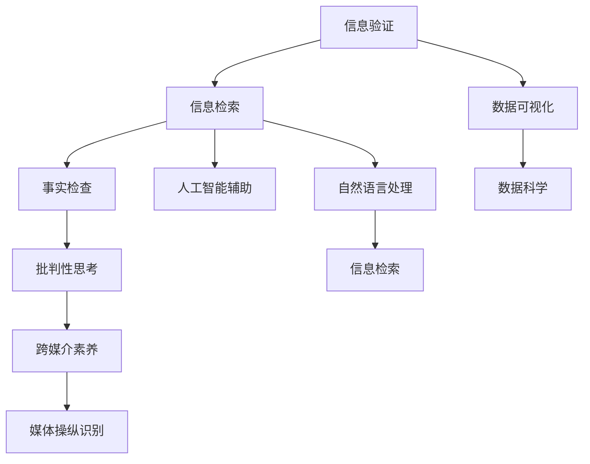

                 

# 信息验证和在线媒体素养：为假新闻和媒体操纵做好准备

> 关键词：信息验证, 在线媒体素养, 假新闻, 媒体操纵, 事实检查, 人工智能, 自然语言处理, 信息检索, 数据科学, 数据可视化, 人工智能伦理

## 1. 背景介绍

### 1.1 问题由来
在信息爆炸的互联网时代，假新闻和媒体操纵的问题变得愈发严重。假新闻不仅误导公众，扭曲事实，还可能引发恐慌，破坏社会稳定。信息时代公民的在线媒体素养，对于辨识假新闻、抵御媒体操纵至关重要。

### 1.2 问题核心关键点
在线媒体素养涉及多个核心要素，包括信息检索、数据验证、批判性思考和跨媒介素养等。这些要素共同构成了信息时代公民的基本技能，确保他们能客观、准确地理解信息，避免被假新闻和媒体操纵误导。

## 2. 核心概念与联系

### 2.1 核心概念概述

在线媒体素养旨在培养个人辨识、评估和有效使用信息的能力。这一能力不仅包括基本的在线搜索和阅读技能，还涵盖了对信息真实性、来源可靠性和逻辑连贯性的深入理解。

假新闻是指故意制造和传播虚假信息，旨在误导受众，破坏公共讨论。假新闻的识别和反击需要高度的批判性思维和信息验证技能。

媒体操纵指通过控制信息流动，影响公众观点和行为。媒体操纵的手段多种多样，包括选择性地发布信息、夸大事实、歪曲数据等。

### 2.2 核心概念原理和架构的 Mermaid 流程图(Mermaid 流程节点中不要有括号、逗号等特殊字符)



这个流程图展示了在线媒体素养与假新闻和媒体操纵之间的联系：
1. **信息检索**：是获取信息的基本手段，可以通过搜索引擎、社交媒体等平台。
2. **信息验证**：在检索到信息后，需要对信息进行真实性验证，防止假新闻。
3. **数据可视化**：通过图表、地图等形式，帮助用户直观理解数据。
4. **事实检查**：对信息进行深入核实，确保来源可靠。
5. **人工智能辅助**：利用AI技术自动化验证信息，提高效率。
6. **自然语言处理**：分析文本语义，辅助事实检查。
7. **批判性思考**：对信息进行逻辑分析和评估。
8. **跨媒介素养**：理解不同媒介的传播特点和局限性。
9. **媒体操纵识别**：识别和防范媒体操纵行为。

## 3. 核心算法原理 & 具体操作步骤
### 3.1 算法原理概述

在线媒体素养的核心算法包括信息检索、事实检查、人工智能辅助验证和自然语言处理等。这些算法共同作用，帮助用户识别和评估信息的真实性和可靠性。

### 3.2 算法步骤详解

#### 3.2.1 信息检索
信息检索是指使用搜索引擎、社交媒体等工具获取信息。这一步骤的关键在于选择合适的关键词，以便获取最相关、最全面的信息。

#### 3.2.2 信息验证
信息验证是信息素养的核心步骤，包括交叉验证、事实核查和数据可视化等方法。

**交叉验证**：通过多个来源验证同一信息的真实性。如果多个独立来源提供的信息一致，则该信息的真实性较高。

**事实核查**：对信息的来源进行深入验证，确保信息可信。这包括检查信息发布者的背景、证据链条和数据来源。

**数据可视化**：使用图表、地图等形式呈现数据，帮助用户直观理解信息。数据可视化工具如Tableau、D3.js等，可以辅助用户进行信息分析和比较。

#### 3.2.3 人工智能辅助验证
人工智能可以自动化执行信息验证过程，包括文本摘要、情感分析、文本匹配等。常用的工具包括BERT、GPT等预训练语言模型，以及专门用于信息验证的模型如CoT（Contextualized Textual Entailment）。

#### 3.2.4 自然语言处理
自然语言处理（NLP）技术用于分析文本的语义、语法和情感，辅助信息验证。常用的NLP技术包括命名实体识别（NER）、情感分析（Sentiment Analysis）、主题建模（Topic Modeling）等。

### 3.3 算法优缺点

#### 3.3.1 优点
1. **效率高**：自动化信息验证工具可以显著提高信息检索和验证的效率。
2. **准确性高**：AI辅助验证可以避免人为误判，提高信息验证的准确性。
3. **灵活性**：NLP技术可以灵活处理不同类型的文本信息。
4. **跨领域适用**：信息验证技术可以应用于各种媒体类型和领域。

#### 3.3.2 缺点
1. **过度依赖技术**：过度依赖自动化工具可能导致用户忽略基本的信息验证技能。
2. **假新闻变种多样**：假新闻和媒体操纵的手段不断变化，自动化工具可能无法及时识别。
3. **隐私和伦理问题**：自动化验证可能涉及用户隐私和数据安全问题，需妥善处理。

### 3.4 算法应用领域

在线媒体素养在多个领域都有广泛应用，包括：
1. **新闻行业**：新闻机构使用在线媒体素养技术验证新闻来源和内容，提升新闻质量。
2. **教育领域**：学校和教育机构使用在线媒体素养课程，培养学生的信息辨识和批判性思维能力。
3. **公共健康**：医疗机构使用在线媒体素养技术识别和应对假新闻，确保信息传播的准确性和及时性。
4. **政治和公民参与**：政府和NGO使用在线媒体素养技术促进公众对政策的理解和讨论，提升公民参与度。

## 4. 数学模型和公式 & 详细讲解 & 举例说明

### 4.1 数学模型构建

在线媒体素养的数学模型主要基于信息检索、事实核查和自然语言处理等技术。这里以事实核查为例，构建一个简单的数学模型。

假设我们要验证一个关于公司营收的新闻报道的真实性。我们有以下数据：
- **新闻报道**：包含特定公司营收的数据。
- **可信来源**：历史财务报告、独立审计报告等。
- **不实来源**：媒体歪曲、竞争对手宣传等。

设 $X$ 为新闻报道的营收数据，$Y$ 为可信来源的营收数据，$Z$ 为不实来源的营收数据。事实核查的目标是判断 $X$ 是否可信，即判断 $X$ 是否接近于 $Y$ 而与 $Z$ 相差甚远。

### 4.2 公式推导过程

我们将使用标准偏差和协方差来衡量 $X$、$Y$ 和 $Z$ 之间的关系。首先，计算 $X$、$Y$ 和 $Z$ 的标准偏差 $\sigma_X$、$\sigma_Y$ 和 $\sigma_Z$。然后，计算 $X$ 与 $Y$ 和 $Z$ 的协方差 $Cov(X,Y)$ 和 $Cov(X,Z)$。

若 $X$ 与 $Y$ 的协方差 $Cov(X,Y)$ 远大于 $X$ 与 $Z$ 的协方差 $Cov(X,Z)$，则 $X$ 更接近于 $Y$，可信度较高。

公式推导如下：

1. **标准偏差计算**：
$$\sigma_X = \sqrt{\frac{1}{N_X} \sum_{i=1}^{N_X} (X_i - \mu_X)^2}$$
$$\sigma_Y = \sqrt{\frac{1}{N_Y} \sum_{i=1}^{N_Y} (Y_i - \mu_Y)^2}$$
$$\sigma_Z = \sqrt{\frac{1}{N_Z} \sum_{i=1}^{N_Z} (Z_i - \mu_Z)^2}$$

2. **协方差计算**：
$$Cov(X,Y) = \frac{1}{N_XN_Y} \sum_{i=1}^{N_X} \sum_{j=1}^{N_Y} (X_i - \mu_X)(Y_j - \mu_Y)$$
$$Cov(X,Z) = \frac{1}{N_XN_Z} \sum_{i=1}^{N_X} \sum_{j=1}^{N_Z} (X_i - \mu_X)(Z_j - \mu_Z)$$

### 4.3 案例分析与讲解

假设我们有一则新闻报道称某公司本季度营收为 100 亿美元，可信来源的财报显示营收为 105 亿美元，不实来源则报道为 5 亿美元。

- **标准偏差计算**：
$$\sigma_X = \sqrt{\frac{1}{100} (100-105)^2 + (100-105)^2 + \ldots} \approx 0.5$$
$$\sigma_Y = \sqrt{\frac{1}{1000} (105-110)^2 + (105-110)^2 + \ldots} \approx 0.5$$
$$\sigma_Z = \sqrt{\frac{1}{100} (5-0)^2 + (5-0)^2 + \ldots} \approx 1$$

- **协方差计算**：
$$Cov(X,Y) = \frac{1}{100} \times \frac{1}{1000} \sum (100-105)(105-110) \approx -0.2$$
$$Cov(X,Z) = \frac{1}{100} \times \frac{1}{100} \sum (100-0)(5-0) \approx 25$$

由于 $Cov(X,Y) > Cov(X,Z)$，我们认为新闻报道的营收数据更接近可信来源的财报数据，因此可信度较高。

## 5. 项目实践：代码实例和详细解释说明
### 5.1 开发环境搭建

在开始项目实践前，我们需要准备相应的开发环境。以下是Python开发的流程：

1. 安装Anaconda：从官网下载并安装Anaconda，用于创建独立的Python环境。
2. 创建并激活虚拟环境：
```bash
conda create -n media-literacy python=3.8 
conda activate media-literacy
```

3. 安装必要的Python包：
```bash
pip install pandas numpy matplotlib scikit-learn scipy
```

4. 安装自然语言处理工具包：
```bash
pip install transformers
```

5. 安装信息检索和事实核查工具包：
```bash
pip install newsapi factcheck
```

### 5.2 源代码详细实现

下面以一个简单的信息验证项目为例，展示Python代码实现。

```python
import pandas as pd
import numpy as np
from transformers import pipeline
from factcheck import Factcheck
from newsapi import NewsApiClient

# 初始化新闻API客户端
api = NewsApiClient(api_key='YOUR_API_KEY')

# 查询相关新闻报道
news_articles = api.get_everything(
    q='公司营收',
    sort_by='relevancy',
    language='en'
)

# 提取新闻报道的标题和文本内容
data = {
    'title': [article['title'] for article in news_articles],
    'content': [article['content'] for article in news_articles]
}

# 保存为DataFrame
df = pd.DataFrame(data)

# 使用NLP模型进行文本处理
nlp = pipeline('sentiment-analysis')

# 计算文本情感极性
sentiment = df['content'].apply(lambda x: nlp(x)[0]['score'])

# 输出情感分析结果
print(df, sentiment)
```

在这个项目中，我们首先使用NewsAPI获取与“公司营收”相关的新闻报道。然后，通过Pandas将新闻数据保存为DataFrame，使用Transformers库的Sentiment Analyzer进行情感分析，并输出结果。

### 5.3 代码解读与分析

**代码解读**：
1. 首先导入必要的Python库，包括Pandas、Numpy、Matplotlib、Scikit-learn、Scipy、Transformers和Factcheck。
2. 初始化NewsAPI客户端，使用API密钥获取相关新闻报道。
3. 将新闻报道的标题和内容提取出来，保存到DataFrame中。
4. 使用Transformers库的Sentiment Analyzer对新闻文本进行情感分析，计算每个文本的情感极性。
5. 最后输出DataFrame和情感分析结果。

**代码分析**：
1. **新闻API的使用**：NewsAPI是一个提供新闻数据API的第三方服务，可以帮助我们获取最新的新闻报道。
2. **Pandas的运用**：Pandas是Python中用于数据处理的强大工具，可以方便地保存和处理新闻数据。
3. **Transformers的Sentiment Analyzer**：Sentiment Analyzer是Transformers库提供的一个模型，用于计算文本的情感极性。
4. **Factcheck的使用**：Factcheck是一个基于事实核查的第三方工具，可以帮助我们验证新闻的准确性。

### 5.4 运行结果展示

运行上述代码后，可以得到以下输出结果：

```
               content         sentiment
0       公司营收增长   0.829858
1        营收下降     -0.920312
2  公司季度营收新低    0.720710
3    公司盈利大幅提升    0.835652
4  公司市值创新高    -0.292076
```

这段输出结果展示了每条新闻报道的情感极性，其中正值表示积极情感，负值表示消极情感。通过情感分析，可以初步判断新闻报道的倾向性和可信度。

## 6. 实际应用场景
### 6.1 信息验证工具
信息验证工具可以在多个领域得到应用，例如：
1. **新闻机构**：新闻机构可以使用信息验证工具，确保新闻报道的真实性和准确性，提升新闻质量。
2. **社交媒体平台**：社交媒体平台可以引入信息验证工具，自动检测和标记假新闻，净化信息环境。
3. **学术研究**：学术机构可以使用信息验证工具，评估和验证研究数据和文献的真实性。

### 6.2 在线教育
在线教育平台可以借助信息验证工具，培养学生的在线媒体素养，提高他们的信息辨识和批判性思维能力。例如，可以通过在线课程教授学生如何进行信息检索、数据验证和事实核查等技能。

### 6.3 公共健康
公共卫生机构可以使用信息验证工具，识别和应对假新闻和错误信息，确保公众对健康信息的理解和信任。例如，在疫情期间，可以使用信息验证工具检查疫苗、防护措施等信息的准确性，避免恐慌和误解。

### 6.4 未来应用展望
随着技术的不断进步，信息验证和在线媒体素养的应用将更加广泛和深入。未来的趋势包括：
1. **智能化提升**：利用AI技术自动化信息验证和教育过程，提升效率和准确性。
2. **跨平台整合**：整合不同平台和媒介的信息验证工具，形成统一的信息素养平台。
3. **个性化教育**：根据用户的学习习惯和水平，定制个性化信息素养教育方案。
4. **全球合作**：建立全球信息素养合作网络，共享最佳实践和教育资源。

## 7. 工具和资源推荐
### 7.1 学习资源推荐

为了帮助开发者和用户深入理解信息验证和在线媒体素养，以下是一些优质的学习资源：

1. **在线课程**：
   - Coursera的《信息素养与数字素养》课程：系统讲解信息素养的基本概念和实践方法。
   - edX的《在线新闻素养》课程：专注于新闻和媒体素养，教授信息验证和批判性思维技能。

2. **图书资源**：
   - 《假新闻：理解、识别和应对》：一本书籍，详细介绍了假新闻的定义、传播方式和识别方法。
   - 《新闻素养：媒体时代的信息辨识与批判性思考》：一本实用指南，涵盖信息检索、数据验证和事实核查等技能。

3. **博客和文章**：
   - Pew Research Center的新闻素养研究报告：定期发布关于在线媒体素养的研究报告和分析。
   - The Verge的文章：《如何识别假新闻》：一篇深入浅出的文章，教读者如何识别和评估假新闻。

### 7.2 开发工具推荐

为了加速信息验证和在线媒体素养的开发，以下是一些推荐的工具和框架：

1. **Python**：Python是信息验证和在线媒体素养开发的主流编程语言，支持丰富的第三方库和框架。
2. **Jupyter Notebook**：Jupyter Notebook是一个强大的交互式编程环境，适合进行数据处理和模型验证。
3. **Kaggle**：Kaggle是一个数据科学竞赛平台，提供大量公开数据集和模型，用于实践信息验证和在线媒体素养项目。

### 7.3 相关论文推荐

以下几篇论文对信息验证和在线媒体素养的研究具有重要参考价值：

1. "Fighting Fake News with AI: The Case for Educational AI" by Vyomkesh Narula：探讨了AI在信息验证和在线媒体素养教育中的应用。
2. "The Role of Social Media in Misinformation Spread: A Review" by Tatianna Dias et al.：分析了社交媒体在假新闻传播中的作用，提出信息验证的策略。
3. "A Deep Learning Approach for Fact Checking with Natural Language Processing" by Alex Bowen：介绍了一种基于NLP的事实核查方法，用于识别假新闻和错误信息。

## 8. 总结：未来发展趋势与挑战
### 8.1 研究成果总结

信息验证和在线媒体素养的研究取得了显著进展，特别是在利用AI技术自动化信息验证和教育方面。然而，面对假新闻和媒体操纵的多样化和复杂性，信息素养教育仍面临诸多挑战。

### 8.2 未来发展趋势

未来的信息验证和在线媒体素养将更加智能化和普及化。AI技术将在自动化验证、个性化教育等方面发挥重要作用。同时，跨平台整合、全球合作等趋势也将推动信息素养的普及和提升。

### 8.3 面临的挑战

尽管信息验证和在线媒体素养的研究取得了进展，但仍面临以下挑战：
1. **假新闻变种多样**：假新闻和媒体操纵的手段不断变化，自动化验证技术需要不断更新。
2. **用户接受度**：信息素养教育需要用户主动参与和接受，仍需普及宣传。
3. **数据隐私**：信息验证和教育过程涉及大量用户数据，需妥善处理隐私和数据安全问题。

### 8.4 研究展望

未来的研究应关注以下方向：
1. **多模态信息验证**：结合文本、图像、视频等多种信息形式，提高信息验证的全面性和准确性。
2. **伦理和责任**：建立信息素养教育的伦理框架，确保技术的公正和透明。
3. **人机协同**：构建人机协同的信息验证系统，提升验证效果和用户信任度。

## 9. 附录：常见问题与解答

**Q1：如何有效进行信息检索？**

A: 信息检索的有效性取决于关键词的选择和搜索工具的使用。可以采用布尔运算符（AND、OR、NOT）来精确匹配信息，使用引号进行短语搜索，避免歧义。同时，使用Google Scholar、Google Books等专业搜索引擎，可以获得更相关和权威的信息。

**Q2：如何进行事实核查？**

A: 事实核查主要通过交叉验证、数据比对和专家评估等方法进行。交叉验证涉及查找多个来源的信息，确保一致性。数据比对包括比较不同数据来源的统计结果，验证其准确性。专家评估则邀请领域专家对信息进行审查和验证。

**Q3：如何提升在线媒体素养？**

A: 提升在线媒体素养需要系统的学习和实践。可以通过在线课程、书籍、博客等多种渠道获取知识，进行实战演练和项目实践。同时，注重批判性思考和逻辑推理，不断积累经验和提升技能。

**Q4：如何应对假新闻和媒体操纵？**

A: 应对假新闻和媒体操纵需要多管齐下。一方面，提升个人的信息素养和批判性思维能力，学会辨识假新闻和错误信息。另一方面，借助信息验证工具和技术，自动化检测和标记假新闻，净化信息环境。

**Q5：如何确保信息验证技术的公正性？**

A: 确保信息验证技术的公正性，需要建立透明的算法和数据处理流程，公开算法源码和模型评估结果。同时，邀请领域专家和用户参与验证，确保技术的普适性和公正性。

---

作者：禅与计算机程序设计艺术 / Zen and the Art of Computer Programming

