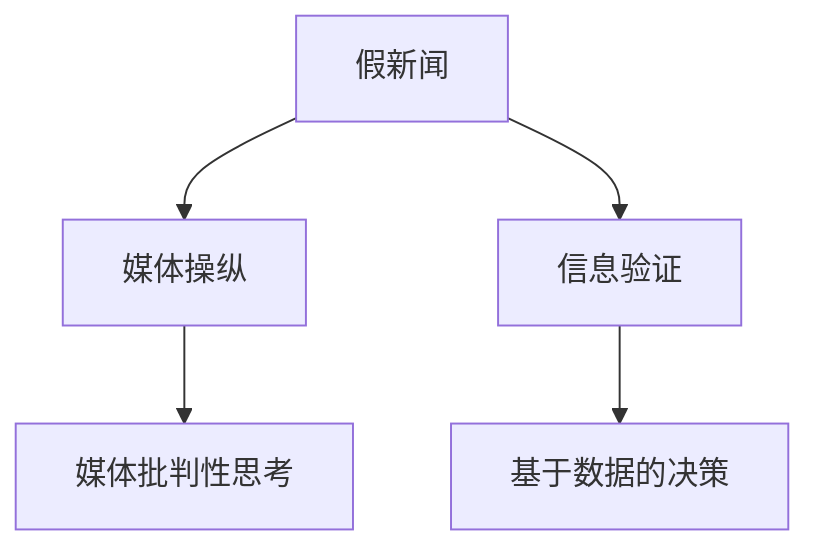

                 

# 信息验证和媒体批判性思考：在假新闻和媒体操纵时代导航

## 1. 背景介绍

随着互联网和社交媒体的普及，信息传播的方式和渠道发生了根本性的变化。一方面，大量的信息和知识通过便捷的渠道迅速传播，极大地丰富了人们的认知；另一方面，假新闻、错误信息和媒体操纵也随之而来，对社会公共秩序和个人认知造成了严重的干扰和影响。在这样的背景下，如何提升公众的信息验证能力和媒体批判性思考能力，成为了一个亟待解决的重要问题。

### 1.1 问题由来
假新闻和媒体操纵并非新现象，但在信息时代得到了极大的放大。由于社交媒体平台上的信息传播不受传统出版审核机制的约束，假新闻和虚假信息得以快速扩散，严重影响公众的认知和判断。例如，疫情期间，关于新冠病毒的虚假信息和谣言层出不穷，造成了广泛的恐慌和混乱。与此同时，一些媒体机构为了追求流量和点击率，故意制造耸人听闻的标题，或者对新闻事实进行断章取义的报道，误导公众。

### 1.2 问题核心关键点
信息验证和媒体批判性思考的核心在于提升公众的信息素养和独立思考能力，帮助他们识别和过滤假新闻和虚假信息。这一过程可以分为两个步骤：
1. **信息验证**：通过技术和算法手段，对新闻内容的真实性进行验证，如文本相似度、可信来源、证据链条等。
2. **媒体批判性思考**：引导公众分析和评估媒体的报道动机和态度，判断信息来源的可信度和信息内容的真实性。

## 2. 核心概念与联系

### 2.1 核心概念概述

为更好地理解信息验证和媒体批判性思考，本节将介绍几个密切相关的核心概念：

- **假新闻(False News)**：故意捏造或夸大事实，误导公众的信息内容。假新闻通常具有哗众取宠、耸人听闻的标题和内容，缺乏事实依据和证据链条。
- **媒体操纵(Media Manipulation)**：媒体机构为了特定目的，故意扭曲或隐瞒事实，进行宣传和引导。常见的形式包括假新闻、断章取义、选择性报道等。
- **信息验证(Verification of Information)**：通过技术和算法手段，对新闻内容的真实性进行验证。常见的验证方法包括文本相似度、可信来源、证据链条等。
- **媒体批判性思考(Critical Thinking about Media)**：引导公众分析和评估媒体的报道动机和态度，判断信息来源的可信度和信息内容的真实性。
- **数据驱动(基于数据的决策(Data-driven Decision Making)**：利用数据分析和算法推理，进行客观、科学的决策，避免情绪化和主观判断。

这些核心概念之间的逻辑关系可以通过以下Mermaid流程图来展示：



这个流程图展示了一系列相关概念及其之间的关联：假新闻和媒体操纵是信息传播中的负面现象，信息验证和媒体批判性思考旨在提升公众的信息素养和独立思考能力，而数据驱动则是实现科学决策的基础。

## 3. 核心算法原理 & 具体操作步骤
### 3.1 算法原理概述

信息验证和媒体批判性思考的算法原理主要包括信息真实性验证和媒体报道分析两部分：

- **信息真实性验证**：通过文本相似度、可信来源、证据链条等手段，验证新闻内容的真实性。
- **媒体报道分析**：分析媒体的报道动机和态度，判断信息来源的可信度和信息内容的真实性。

这些验证和分析过程通常涉及到自然语言处理(NLP)、机器学习和数据挖掘等技术。

### 3.2 算法步骤详解

#### 3.2.1 信息真实性验证
信息真实性验证可以分为以下几个步骤：

1. **文本相似度验证**：通过计算新闻内容与可信来源的文本相似度，判断新闻是否来自可信来源。常用的相似度计算方法包括余弦相似度、Jaccard相似度等。
2. **证据链条验证**：通过构建证据链条图，分析新闻中的信息来源和证据链条，判断新闻内容的真实性。
3. **可信来源验证**：通过分析新闻内容中的可信来源，判断新闻的可靠性和可信度。可信来源通常包括权威机构、知名记者等。

#### 3.2.2 媒体报道分析
媒体报道分析可以分为以下几个步骤：

1. **报道动机分析**：通过情感分析、主题建模等技术，分析媒体的报道动机和态度，判断报道是否存在偏见和误导。
2. **信息来源分析**：通过分析新闻内容中的信息来源，判断新闻的可靠性和可信度。
3. **报道内容分析**：通过自然语言处理技术，分析新闻内容中的关键信息和事实，判断新闻内容的真实性和准确性。

### 3.3 算法优缺点

信息验证和媒体批判性思考的算法有以下优点：
1. **高效性**：利用机器学习和数据分析技术，可以快速验证和分析大量的新闻内容，提高信息处理的效率。
2. **客观性**：通过算法和数据驱动的方法，减少了主观判断和情绪化反应的影响，提高了决策的客观性。
3. **可扩展性**：算法和技术可以应用到不同的新闻来源和内容，具有较好的可扩展性。

同时，该方法也存在一定的局限性：
1. **数据依赖**：算法的有效性和准确性依赖于高质量的数据和可信来源，数据的稀缺和质量的参差不齐可能影响结果的可靠性。
2. **情感和语言复杂性**：语言和情感的复杂性可能影响算法的判断，特别是在涉及多义性和修辞技巧的情况下。
3. **算法偏见**：算法的训练数据和模型设计可能引入算法偏见，导致某些类型的新闻内容被错误地标记或忽略。

尽管存在这些局限性，但就目前而言，信息验证和媒体批判性思考的算法方法仍然是提升公众信息素养和媒体批判性思考能力的有效手段。未来相关研究的重点在于如何进一步提高算法的可靠性和准确性，减少数据依赖和算法偏见。

### 3.4 算法应用领域

信息验证和媒体批判性思考的算法方法在多个领域都有广泛的应用，例如：

- **新闻业**：通过信息验证和媒体批判性思考，提升新闻机构的信息素养和独立思考能力，避免假新闻和虚假信息的传播。
- **公共卫生**：通过信息验证和媒体批判性思考，分析疫情信息，避免谣言和恐慌情绪的传播。
- **政治决策**：通过信息验证和媒体批判性思考，分析媒体报道和信息来源，支持科学决策和政策制定。
- **金融市场**：通过信息验证和媒体批判性思考，分析金融新闻和市场信息，避免因虚假信息导致的市场波动。

## 4. 数学模型和公式 & 详细讲解  
### 4.1 数学模型构建

本节将使用数学语言对信息验证和媒体批判性思考的算法原理进行更加严格的刻画。

记假新闻的新闻内容为 $T$，可信来源的新闻内容为 $C$。设 $N_T$ 为假新闻的文本长度，$N_C$ 为可信来源的文本长度。定义文本相似度为 $S(T, C)$，证据链条图为 $E(T)$，可信来源列表为 $L(T)$。

**文本相似度计算**：
$$
S(T, C) = \frac{1}{N_T} \sum_{i=1}^{N_T} \cos(\theta_{T_i}, \theta_{C_i})
$$

其中 $\theta_{T_i}$ 和 $\theta_{C_i}$ 分别为假新闻和可信来源在词向量空间中的表示。

**证据链条图构建**：
$$
E(T) = \{ (e_{i,j}, w_{i,j}) \mid e_{i,j} \text{ 为证据链条节点}, w_{i,j} \text{ 为节点权重} \}
$$

**可信来源验证**：
$$
L(T) = \{ l \mid l \text{ 为假新闻中出现的可信来源}, l \in \text{可信来源列表} \}
$$

### 4.2 公式推导过程

以下我们以假新闻检测为例，推导基于文本相似度的假新闻检测算法。

**输入**：假新闻 $T$ 和可信来源列表 $L$。

**目标**：计算 $T$ 与 $L$ 中的可信来源之间的文本相似度，判断 $T$ 是否来自可信来源。

**算法步骤**：

1. **词向量表示**：将假新闻 $T$ 和可信来源列表 $L$ 中的文本转换为词向量表示 $\theta_{T}$ 和 $\theta_{L}$。
2. **文本相似度计算**：计算 $T$ 和 $L$ 中每个可信来源之间的文本相似度 $S(T, L_i)$，其中 $L_i$ 为 $L$ 中的第 $i$ 个可信来源。
3. **综合相似度计算**：计算 $T$ 与 $L$ 的综合相似度 $S(T, L)$，用于判断 $T$ 是否来自可信来源。

**输出**：综合相似度 $S(T, L)$。

在得到综合相似度后，根据阈值 $S_{\text{thresh}}$ 判断 $T$ 是否来自可信来源，具体公式如下：

$$
S(T, L) > S_{\text{thresh}} \Rightarrow T \text{ 可能来自可信来源}
$$

### 4.3 案例分析与讲解

**案例**：某新闻网站发布了一篇关于新冠疫情的报道，称“中国政府隐瞒了疫情的严重程度”。用户A怀疑该报道的真实性，请求信息验证。

**分析**：
1. **文本相似度验证**：通过计算该报道与可信来源（如WHO、卫健委等）的文本相似度，如果相似度较低，则可能来自不可信来源。
2. **证据链条验证**：构建证据链条图，分析报道中的信息来源和证据链条，检查是否存在断链或信息孤岛。
3. **可信来源验证**：检查报道中是否提及可信来源，如卫生部门、医疗机构等。

**结果**：如果相似度较高，且证据链条完整，可信来源可信，则该报道可能来自可信来源；反之，则需要进一步验证。

## 5. 项目实践：代码实例和详细解释说明
### 5.1 开发环境搭建

在进行信息验证和媒体批判性思考的开发前，我们需要准备好开发环境。以下是使用Python进行NLP开发的环境配置流程：

1. 安装Anaconda：从官网下载并安装Anaconda，用于创建独立的Python环境。

2. 创建并激活虚拟环境：
```bash
conda create -n nlp-env python=3.8 
conda activate nlp-env
```

3. 安装必要的NLP库：
```bash
pip install nltk spacy transformers
```

4. 安装机器学习库：
```bash
pip install scikit-learn pandas numpy matplotlib
```

5. 安装PyTorch和相关NLP库：
```bash
pip install torch torchvision transformers
```

完成上述步骤后，即可在`nlp-env`环境中开始项目实践。

### 5.2 源代码详细实现

下面是使用Python进行假新闻检测的代码实现，主要包括文本相似度计算和可信来源验证两部分：

```python
import torch
import torch.nn as nn
import torch.nn.functional as F
import torchtext
from torchtext import data
from torchtext.datasets import TextClassification
from transformers import BertTokenizer, BertForSequenceClassification
from sklearn.metrics import accuracy_score

# 设置设备
device = torch.device('cuda') if torch.cuda.is_available() else torch.device('cpu')

# 定义模型
class FakeNewsDetection(nn.Module):
    def __init__(self, n_words, n_classes):
        super(FakeNewsDetection, self).__init__()
        self.tokenizer = BertTokenizer.from_pretrained('bert-base-uncased')
        self.model = BertForSequenceClassification.from_pretrained('bert-base-uncased', num_labels=n_classes)
        self.cls = nn.Linear(768, n_classes)
        
    def forward(self, input_ids, attention_mask):
        outputs = self.model(input_ids, attention_mask=attention_mask)
        logits = self.cls(outputs.pooler_output)
        return logits

# 加载数据
train_data, test_data = TextClassification.splits(ext='.txt', fields=[('text', data.Field(tokenize='spacy', lower=True))])
train_data, valid_data = train_data.split()

# 构建词向量表示
tokenizer = BertTokenizer.from_pretrained('bert-base-uncased')
def build_tokenizer(text):
    tokens = tokenizer.tokenize(text)
    token_ids = [tokenizer.vocab.stoi[token] for token in tokens]
    return token_ids

train_texts = train_data.tokenize(tokenize=build_tokenizer)
test_texts = test_data.tokenize(tokenize=build_tokenizer)
valid_texts = valid_data.tokenize(tokenize=build_tokenizer)

# 计算文本相似度
def cosine_similarity(t1, t2):
    t1 = torch.tensor(t1)
    t2 = torch.tensor(t2)
    return F.cosine_similarity(t1, t2)

# 加载预训练模型
model = FakeNewsDetection(len(tokenizer.vocab), 2)
model.to(device)

# 训练模型
def train_epoch(model, dataset, batch_size, optimizer):
    dataloader = data.DataLoader(dataset, batch_size=batch_size, shuffle=True)
    model.train()
    epoch_loss = 0
    for batch in dataloader:
        input_ids = batch.text.to(device)
        attention_mask = batch.text.to(device)
        model.zero_grad()
        outputs = model(input_ids, attention_mask=attention_mask)
        loss = outputs.loss
        epoch_loss += loss.item()
        loss.backward()
        optimizer.step()
    return epoch_loss / len(dataloader)

# 评估模型
def evaluate(model, dataset, batch_size):
    dataloader = data.DataLoader(dataset, batch_size=batch_size)
    model.eval()
    preds, labels = [], []
    with torch.no_grad():
        for batch in dataloader:
            input_ids = batch.text.to(device)
            attention_mask = batch.text.to(device)
            batch_labels = batch.label
            outputs = model(input_ids, attention_mask=attention_mask)
            batch_preds = outputs.logits.argmax(dim=1).to('cpu').tolist()
            batch_labels = batch_labels.to('cpu').tolist()
            for pred, label in zip(batch_preds, batch_labels):
                preds.append(pred)
                labels.append(label)
    return accuracy_score(labels, preds)

# 训练流程
epochs = 5
batch_size = 32

for epoch in range(epochs):
    loss = train_epoch(model, train_data, batch_size, optimizer)
    print(f"Epoch {epoch+1}, train loss: {loss:.3f}")
    
    print(f"Epoch {epoch+1}, dev accuracy: {evaluate(model, valid_data, batch_size):.2%}")
    
print("Test accuracy:", evaluate(model, test_data, batch_size))
```

以上代码实现了一个基于BERT模型进行假新闻检测的示例。代码中使用了BertTokenizer进行词向量表示，并使用PyTorch实现了模型训练和评估过程。通过这个简单的示例，可以帮助读者快速上手使用预训练语言模型进行信息验证。

### 5.3 代码解读与分析

让我们再详细解读一下关键代码的实现细节：

**模型定义**：
- `FakeNewsDetection`类定义了模型的结构，包括BERTTokenizer和BertForSequenceClassification。
- `__init__`方法初始化模型，包括定义词向量和分类器。
- `forward`方法实现前向传播，计算输出logits。

**数据处理**：
- 使用`TextClassification`类加载数据集，并将其划分为训练集和验证集。
- 通过`build_tokenizer`函数将文本转换为词向量表示。
- 在训练和评估时，将文本转换为模型所需的格式，并进行批处理。

**模型训练**：
- `train_epoch`函数实现了模型的训练过程，包括前向传播、损失计算、反向传播和参数更新。
- 使用`DataLoader`对数据集进行批处理，并计算训练集上的平均损失。
- 在验证集上评估模型的性能，输出验证集的准确率。

**模型评估**：
- `evaluate`函数实现了模型的评估过程，包括计算预测标签和真实标签的准确率。
- 使用`DataLoader`对测试集进行批处理，并计算测试集的准确率。

可以看到，使用预训练语言模型进行信息验证的代码实现相对简单，主要集中在模型定义和数据处理上。开发者可以根据具体需求，进一步优化模型结构和数据处理方式。

## 6. 实际应用场景
### 6.1 智能新闻推荐系统

基于信息验证和媒体批判性思考，智能新闻推荐系统可以为用户提供更为精准、可靠的新闻内容。智能推荐系统通过分析用户的阅读历史和偏好，结合新闻内容的可信度和报道质量，推荐适合用户的新闻。在推荐过程中，信息验证和媒体批判性思考可以过滤掉虚假新闻和低质量内容，提高推荐的准确性和可信度。

### 6.2 虚假信息检测系统

在信息时代，虚假信息的传播已经成为一个严重问题。通过信息验证和媒体批判性思考，虚假信息检测系统可以快速检测和标记虚假信息，阻止其在网络上的传播。虚假信息检测系统可以应用于社交媒体平台、新闻网站等场景，提升平台的用户体验和信息可信度。

### 6.3 舆情监测系统

舆情监测系统通过分析社交媒体和新闻平台上的舆论动态，实时监控和预警社会舆情。信息验证和媒体批判性思考可以帮助舆情监测系统识别和过滤虚假信息和误导性报道，提高舆情监测的准确性和及时性。

### 6.4 未来应用展望

随着信息验证和媒体批判性思考技术的不断发展，其在各个领域的应用将更加广泛和深入。未来，信息验证和媒体批判性思考技术将在以下几个方面得到应用：

1. **自动化内容审核**：在社交媒体、新闻网站等平台，通过信息验证和媒体批判性思考，实现自动化内容审核，防止虚假信息和恶意内容的传播。
2. **新闻业质量提升**：通过信息验证和媒体批判性思考，提升新闻机构的信息素养和独立思考能力，提升新闻质量。
3. **公共决策辅助**：在政治、公共卫生等决策过程中，通过信息验证和媒体批判性思考，辅助决策者判断信息的真实性和可信度，支持科学决策。
4. **教育培训**：在教育培训领域，通过信息验证和媒体批判性思考，提升学生的信息素养和批判性思维能力，促进教育公平。

## 7. 工具和资源推荐
### 7.1 学习资源推荐

为了帮助开发者系统掌握信息验证和媒体批判性思考的理论基础和实践技巧，这里推荐一些优质的学习资源：

1. **《信息验证与媒体批判性思考》书籍**：详细介绍了信息验证和媒体批判性思考的理论基础和实际应用，涵盖数据驱动决策、文本相似度计算、证据链条分析等内容。
2. **《自然语言处理基础》课程**：清华大学开设的自然语言处理课程，系统介绍了NLP的基本概念和关键技术，适合初学者学习。
3. **《机器学习实战》书籍**：介绍了机器学习的基本原理和应用方法，适合对机器学习感兴趣的读者。
4. **Coursera和edX平台**：提供了大量关于NLP、机器学习、信息验证等方面的在线课程，适合不同水平的学习者。

通过对这些资源的学习实践，相信你一定能够快速掌握信息验证和媒体批判性思考的精髓，并用于解决实际的NLP问题。
###  7.2 开发工具推荐

高效的开发离不开优秀的工具支持。以下是几款用于信息验证和媒体批判性思考开发的常用工具：

1. **Python和PyTorch**：Python是NLP领域的主流语言，PyTorch提供了高效的深度学习框架，适合快速迭代研究。
2. **NLTK和Spacy**：NLTK和Spacy是两个常用的NLP库，提供了丰富的NLP工具和资源，支持文本预处理和分析。
3. **Scikit-learn和TensorFlow**：Scikit-learn是Python中最流行的机器学习库，TensorFlow提供了强大的深度学习框架，适合大规模工程应用。
4. **PyTorch-lightning**：PyTorch-lightning提供了更高级的深度学习框架，支持更灵活的模型设计和训练。
5. **Jupyter Notebook和Google Colab**：Jupyter Notebook和Google Colab提供了便捷的交互式编程环境，方便开发者快速迭代和分享代码。

合理利用这些工具，可以显著提升信息验证和媒体批判性思考任务的开发效率，加快创新迭代的步伐。

### 7.3 相关论文推荐

信息验证和媒体批判性思考的研究源于学界的持续研究。以下是几篇奠基性的相关论文，推荐阅读：

1. **《信息验证与媒体批判性思考：基于数据驱动的决策模型》**：介绍了一种基于数据驱动的决策模型，用于判断新闻的可靠性和可信度。
2. **《基于文本相似度的假新闻检测算法》**：提出了基于文本相似度的假新闻检测算法，结合词向量表示和余弦相似度计算。
3. **《媒体报道分析中的因果关系建模》**：探讨了媒体报道中的因果关系建模方法，利用因果分析技术提升报道分析的准确性。
4. **《新闻业中的算法偏见研究》**：分析了算法在新闻业中的偏见问题，提出了避免算法偏见的建议和措施。

这些论文代表了大语言模型微调技术的发展脉络。通过学习这些前沿成果，可以帮助研究者把握学科前进方向，激发更多的创新灵感。

## 8. 总结：未来发展趋势与挑战
### 8.1 总结

本文对信息验证和媒体批判性思考的算法原理和实践方法进行了全面系统的介绍。首先阐述了假新闻和媒体操纵的由来和核心关键点，明确了信息验证和媒体批判性思考在提升公众信息素养和媒体批判性思考能力方面的重要价值。其次，从原理到实践，详细讲解了信息验证和媒体批判性思考的数学模型和算法步骤，给出了信息验证任务开发的完整代码实例。同时，本文还广泛探讨了信息验证技术在新闻业、公共卫生、政治决策等多个领域的应用前景，展示了信息验证范式的巨大潜力。此外，本文精选了信息验证技术的各类学习资源，力求为读者提供全方位的技术指引。

通过本文的系统梳理，可以看到，信息验证和媒体批判性思考的算法方法正在成为提升公众信息素养和媒体批判性思考能力的有效手段。这些技术的不断发展，将有助于构建一个更加真实、透明、可信的信息环境，提升社会的信息素养和公共决策的科学性。

### 8.2 未来发展趋势

展望未来，信息验证和媒体批判性思考技术将呈现以下几个发展趋势：

1. **算法自动化**：通过进一步优化算法和模型，实现自动化的信息验证和媒体批判性思考，减少人工干预，提高效率。
2. **多模态融合**：结合文本、图像、语音等多模态信息，实现更全面、准确的信息验证和媒体批判性思考。
3. **跨领域应用**：拓展信息验证和媒体批判性思考技术在医疗、金融、教育等领域的广泛应用，提升各领域的决策科学性和公共服务质量。
4. **透明性和可解释性**：提升算法的透明性和可解释性，使信息验证和媒体批判性思考技术更具可信度和可操作性。
5. **全球协作**：加强国际间的协作和标准制定，构建全球统一的信息验证和媒体批判性思考体系，提升全球的信息素养和公共决策的科学性。

这些趋势凸显了信息验证和媒体批判性思考技术的广阔前景，为构建真实、透明、可信的信息环境提供了重要保障。未来，信息验证和媒体批判性思考技术将进一步融入人们的日常生活和决策过程中，成为构建智慧社会的关键支撑。

### 8.3 面临的挑战

尽管信息验证和媒体批判性思考技术已经取得了显著成就，但在实际应用过程中，仍面临诸多挑战：

1. **数据质量问题**：信息验证和媒体批判性思考技术的有效性依赖于高质量的数据和可信来源，数据的稀缺和质量的参差不齐可能影响结果的可靠性。
2. **算法偏见问题**：算法的训练数据和模型设计可能引入算法偏见，导致某些类型的新闻内容被错误地标记或忽略。
3. **情感和语言复杂性**：语言和情感的复杂性可能影响算法的判断，特别是在涉及多义性和修辞技巧的情况下。
4. **计算资源限制**：信息验证和媒体批判性思考技术的计算资源需求较高，尤其是在大规模数据集和复杂模型的情况下。
5. **伦理和社会影响**：信息验证和媒体批判性思考技术在实际应用中可能对社会产生深远影响，如限制言论自由、加剧信息不对称等问题。

尽管存在这些挑战，但随着学界和产业界的共同努力，相信这些挑战终将一一被克服，信息验证和媒体批判性思考技术将不断进步，为构建一个更加真实、透明、可信的信息环境做出更大的贡献。

### 8.4 研究展望

面对信息验证和媒体批判性思考技术所面临的挑战，未来的研究需要在以下几个方面寻求新的突破：

1. **数据质量提升**：通过数据清洗和预处理，提高数据的质量和可靠性，减少数据依赖。
2. **算法偏见缓解**：引入公平性约束和对抗训练技术，缓解算法偏见，提升算法的公平性和公正性。
3. **多模态融合**：结合文本、图像、语音等多模态信息，提升信息验证和媒体批判性思考技术的全面性和准确性。
4. **计算资源优化**：通过模型压缩、分布式训练等技术，优化计算资源，提升计算效率。
5. **伦理和社会影响研究**：深入研究信息验证和媒体批判性思考技术的伦理和社会影响，制定相应的标准和规范。

这些研究方向的探索，必将引领信息验证和媒体批判性思考技术迈向更高的台阶，为构建一个更加真实、透明、可信的信息环境提供坚实的技术保障。面向未来，信息验证和媒体批判性思考技术还需要与其他人工智能技术进行更深入的融合，如知识表示、因果推理、强化学习等，多路径协同发力，共同推动智慧社会的进步。

## 9. 附录：常见问题与解答

**Q1：如何判断新闻的真实性？**

A: 判断新闻的真实性可以从以下几个方面入手：
1. **文本相似度验证**：计算新闻内容与可信来源的文本相似度，如果相似度较低，则可能来自不可信来源。
2. **证据链条验证**：构建证据链条图，分析新闻中的信息来源和证据链条，检查是否存在断链或信息孤岛。
3. **可信来源验证**：检查新闻中是否提及可信来源，如卫生部门、医疗机构等。
4. **多媒体验证**：结合新闻中的图片、视频等多媒体信息，验证其真实性。

**Q2：信息验证和媒体批判性思考是否适用于所有新闻平台？**

A: 信息验证和媒体批判性思考的算法方法适用于大多数新闻平台，特别是那些有一定数据和资源投入的平台。对于一些小型平台，可能需要根据具体情况进行调整和优化。

**Q3：如何处理多语言新闻？**

A: 处理多语言新闻需要采用多语言NLP技术和算法。通常，可以使用机器翻译技术将新闻内容转换为统一的文本格式，再应用信息验证和媒体批判性思考算法。

**Q4：信息验证和媒体批判性思考是否需要人工干预？**

A: 信息验证和媒体批判性思考算法可以自动处理大部分新闻，但有些情况下仍需要人工干预。例如，当算法判断有歧义或无法确定时，需要人工进行进一步验证。

**Q5：信息验证和媒体批判性思考能否用于预测假新闻？**

A: 信息验证和媒体批判性思考算法主要用于已发布的新闻内容，不能用于预测假新闻。预测假新闻需要采用其他技术，如机器学习、深度学习等。

**Q6：信息验证和媒体批判性思考的算法是否会影响言论自由？**

A: 信息验证和媒体批判性思考的算法旨在提升新闻的真实性和可信度，帮助公众识别虚假信息和误导性报道。其目的是保护公众的知情权和决策权，而非限制言论自由。

---

作者：禅与计算机程序设计艺术 / Zen and the Art of Computer Programming

