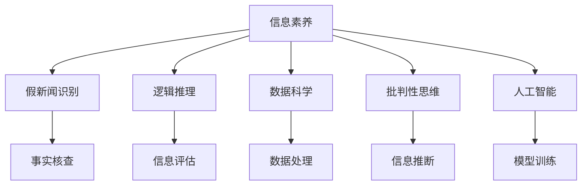

                 

# 信息验证和批判性思维能力培养：在假新闻和错误信息时代导航

## 1. 背景介绍

### 1.1 问题由来

在信息爆炸的时代，人们获取和处理信息的途径变得越来越多样化，但这也导致信息的真实性、可靠性难以保证。假新闻和错误信息在网络上广泛传播，不仅对社会舆论造成干扰，还对个体认知和决策产生不良影响。尤其是在政治、经济、科技等关键领域，信息失真带来的后果尤为严重。

面对这一挑战，信息验证和批判性思维能力的培养变得尤为重要。通过系统学习和实践，能够有效识别虚假信息，增强对信息的甄别能力和判断力，提升社会整体的信息素养。信息验证和批判性思维能力的培养不仅有助于个人成长，更是构建健康信息生态、促进社会和谐的重要保障。

### 1.2 问题核心关键点

信息验证和批判性思维能力的培养涉及以下几个核心关键点：

1. **事实核查**：通过多种途径获取和交叉验证事实信息，识别出潜在的虚假内容。
2. **逻辑推理**：运用逻辑思维对信息进行推断，判断其合理性和可信度。
3. **来源评估**：评估信息来源的权威性和可信度，对可能带有偏见或误导性的信息保持警觉。
4. **跨学科整合**：结合不同领域的知识，增强对信息的综合理解和判断能力。
5. **持续学习**：信息素养不是一成不变的，需要根据最新知识和技能进行不断更新和提升。

这些关键点共同构成了信息验证和批判性思维能力培养的基础，通过深入学习和实践，能够有效提升信息素养，在假新闻和错误信息泛滥的时代中导航。

## 2. 核心概念与联系

### 2.1 核心概念概述

为更好地理解信息验证和批判性思维能力培养的原理和架构，本节将介绍几个密切相关的核心概念：

- **信息素养(Information Literacy)**：指个人或组织获取、评价和利用信息的能力，包括信息识别、筛选、评估和应用等环节。信息素养是信息时代个体必备的核心能力之一。
- **假新闻(Fake News)**：故意编造的、与事实不符的新闻报道或信息，目的是误导受众、制造恐慌或破坏信任。识别假新闻是信息验证的重要内容。
- **批判性思维(Critical Thinking)**：运用逻辑和推理对信息进行分析和评价，识别出潜在的问题和偏见，做出合理的判断和决策。批判性思维是提升信息素养的关键。
- **数据科学(Data Science)**：涉及数据获取、处理、分析和可视化的科学方法，能够提供强大的工具来验证和分析信息。
- **人工智能(AI)**：包括机器学习、自然语言处理等技术，能够辅助信息验证和批判性思维能力培养，提高信息处理效率和准确性。

这些核心概念之间的逻辑关系可以通过以下Mermaid流程图来展示：



这个流程图展示了我信息验证和批判性思维能力培养的核心概念及其之间的关系：

1. 信息素养是基础，通过数据科学、人工智能等技术手段进行辅助。
2. 假新闻识别和批判性思维是关键，能够有效提高信息素养。
3. 逻辑推理和信息评估是支撑，帮助更准确地理解信息。
4. 数据处理和模型训练是工具，用于辅助信息验证和批判性思维能力的提升。

## 3. 核心算法原理 & 具体操作步骤

### 3.1 算法原理概述

信息验证和批判性思维能力培养的本质是信息素养培养的过程，其核心在于通过信息筛选、评估和应用，提高个体对信息的识别和判断能力。这一过程可以通过以下步骤实现：

1. **数据获取与清洗**：获取多种来源的信息，并对信息进行去重、去噪、格式化等预处理。
2. **信息筛选与核查**：通过多种途径（如数据库、事实核查网站、专家意见等）对信息进行交叉验证，识别出潜在的假新闻和错误信息。
3. **逻辑推理与评估**：运用逻辑和推理对信息进行评估，判断其合理性和可信度，评估信息来源的权威性和可信度。
4. **跨学科整合与应用**：结合不同领域的知识，增强对信息的综合理解和判断能力，将信息应用于实际决策和行动中。
5. **持续学习与反馈**：根据新知识和技能进行不断更新和提升，并在实际应用中进行反馈，优化信息验证和批判性思维能力。

### 3.2 算法步骤详解

以下详细介绍信息验证和批判性思维能力培养的具体操作步骤：

**Step 1: 数据获取与清洗**

1. **来源选择**：选择权威和可信的信息来源，如新闻机构、学术研究、政府报告等。
2. **数据收集**：使用Web爬虫、API调用、数据库查询等方式收集数据。
3. **数据清洗**：去除重复、噪声和格式不一致的数据，确保数据质量。

**Step 2: 信息筛选与核查**

1. **交叉验证**：使用多个来源的信息进行交叉验证，识别出潜在的假新闻和错误信息。
2. **事实核查**：使用FactCheck、Snopes等事实核查网站进行核查，验证信息的真实性。
3. **专家意见**：咨询领域专家，获取专业意见，评估信息的可信度。

**Step 3: 逻辑推理与评估**

1. **逻辑推断**：运用逻辑推理对信息进行推断，识别出潜在的逻辑谬误和推理错误。
2. **信息评估**：评估信息来源的权威性和可信度，识别出可能带有偏见或误导性的信息。

**Step 4: 跨学科整合与应用**

1. **跨领域整合**：结合不同领域的知识，增强对信息的综合理解和判断能力。
2. **实际应用**：将信息应用于实际决策和行动中，提高决策的科学性和合理性。

**Step 5: 持续学习与反馈**

1. **知识更新**：根据新知识和技能进行不断更新和提升，保持信息素养的高水平。
2. **反馈优化**：在实际应用中进行反馈，优化信息验证和批判性思维能力。

### 3.3 算法优缺点

信息验证和批判性思维能力培养的方法具有以下优点：

1. **系统性强**：通过数据获取、信息核查、逻辑推理等系统步骤，逐步提升信息素养。
2. **可操作性强**：具体的操作流程和工具支持，使得信息验证和批判性思维能力的培养具有可操作性。
3. **效果显著**：通过科学方法和工具辅助，能够显著提高信息验证和批判性思维能力。

同时，该方法也存在一些局限性：

1. **时间成本高**：信息核查和逻辑推理需要大量时间和精力。
2. **技术要求高**：需要具备一定的数据科学和人工智能知识。
3. **依赖外部资源**：事实核查和专家意见等依赖外部资源，可能存在偏差。

尽管存在这些局限性，但就目前而言，信息验证和批判性思维能力培养的算法仍是大数据时代提升信息素养的重要手段。未来相关研究的重点在于如何进一步降低时间成本，提高操作便利性，同时兼顾可解释性和可靠性等因素。

### 3.4 算法应用领域

信息验证和批判性思维能力培养的方法在多个领域得到了广泛应用：

1. **新闻媒体**：新闻媒体是信息传播的重要渠道，记者和编辑通过信息验证和批判性思维能力培养，能够提升新闻报道的准确性和可信度。
2. **政府决策**：政府决策过程中需要大量的信息支持，通过信息验证和批判性思维能力培养，能够提供更加科学和准确的决策依据。
3. **企业运营**：企业运营过程中涉及大量信息，通过信息验证和批判性思维能力培养，能够提升决策的科学性和市场竞争力。
4. **教育培训**：教育培训过程中需要大量的信息支持和批判性思维训练，通过信息验证和批判性思维能力培养，能够提升学生的综合素质和信息素养。
5. **公共卫生**：公共卫生领域需要大量的信息支持和决策支持，通过信息验证和批判性思维能力培养，能够提升公共卫生决策的科学性和有效性。

除了上述这些领域外，信息验证和批判性思维能力培养的方法还在科学研究、金融投资、司法裁判等多个领域中得到应用，为各行业的信息管理和决策提供支持。

## 4. 数学模型和公式 & 详细讲解 & 举例说明

### 4.1 数学模型构建

为了更精确地描述信息验证和批判性思维能力培养的过程，本节将使用数学语言对相关信息进行建模。

假设信息验证和批判性思维能力培养的过程可以分解为多个阶段，每个阶段包含多个子任务。设信息验证和批判性思维能力培养的总目标为 $F$，则：

$$ F = F_1 \times F_2 \times F_3 \times \ldots \times F_n $$

其中，$F_i$ 表示第 $i$ 个阶段的验证和评估效果，$i \in \{1, 2, \ldots, n\}$。

对于每个阶段，可以定义对应的子任务及其权重。例如，第 $i$ 个阶段的子任务包括：

- **数据获取**：$G_i$，权重 $\omega_{G_i}$
- **信息核查**：$C_i$，权重 $\omega_{C_i}$
- **逻辑推理**：$L_i$，权重 $\omega_{L_i}$
- **信息评估**：$E_i$，权重 $\omega_{E_i}$
- **跨学科整合**：$I_i$，权重 $\omega_{I_i}$
- **持续学习**：$T_i$，权重 $\omega_{T_i}$

则第 $i$ 个阶段的效果可以表示为：

$$ F_i = G_i \times C_i \times L_i \times E_i \times I_i \times T_i $$

在实践中，信息验证和批判性思维能力培养的效果可以通过多轮迭代得到提升，每轮迭代中的 $F_i$ 都会得到优化。最终目标 $F$ 可以通过多轮迭代逐步接近最优值。

### 4.2 公式推导过程

以下推导信息验证和批判性思维能力培养的具体公式：

**Step 1: 数据获取与清洗**

1. **数据获取**：通过爬虫获取 $m$ 条数据，记为 $\mathcal{D} = \{d_1, d_2, \ldots, d_m\}$。
2. **数据清洗**：对数据进行清洗，去除重复、噪声和格式不一致的数据，记为 $\mathcal{D'} = \{d'_1, d'_2, \ldots, d'_m\}$。

**Step 2: 信息筛选与核查**

1. **交叉验证**：使用 $k$ 个来源进行交叉验证，记为 $\mathcal{C} = \{c_1, c_2, \ldots, c_k\}$，对数据进行筛选，记为 $\mathcal{D''} = \{d''_1, d''_2, \ldots, d''_m\}$。
2. **事实核查**：使用 $p$ 个事实核查网站进行核查，记为 $\mathcal{F} = \{f_1, f_2, \ldots, f_p\}$，对数据进行核查，记为 $\mathcal{D'''} = \{d'''_1, d'''_2, \ldots, d'''_m\}$。
3. **专家意见**：咨询 $q$ 个领域的专家，记为 $\mathcal{E} = \{e_1, e_2, \ldots, e_q\}$，对数据进行评估，记为 $\mathcal{D'''}' = \{d''''_1, d''''_2, \ldots, d''''_m\}$。

**Step 3: 逻辑推理与评估**

1. **逻辑推断**：使用逻辑推理算法进行推断，记为 $\mathcal{R} = \{r_1, r_2, \ldots, r_n\}$，对数据进行推理，记为 $\mathcal{D'''''} = \{d''''''_1, d''''''_2, \ldots, d''''''_m\}$。
2. **信息评估**：使用评估算法进行评估，记为 $\mathcal{A} = \{a_1, a_2, \ldots, a_s\}$，对数据进行评估，记为 $\mathcal{D'''''''} = \{d''''''''_1, d''''''''_2, \ldots, d''''''''_m\}$。

**Step 4: 跨学科整合与应用**

1. **跨领域整合**：结合 $r$ 个领域的信息，记为 $\mathcal{K} = \{k_1, k_2, \ldots, k_r\}$，对数据进行整合，记为 $\mathcal{D'''''''''} = \{d''''''''''_1, d''''''''''_2, \ldots, d''''''''''_m\}$。
2. **实际应用**：将整合后的信息应用于实际决策和行动，记为 $\mathcal{D'''''''''''}$。

**Step 5: 持续学习与反馈**

1. **知识更新**：根据新知识和技能进行更新，记为 $\mathcal{U} = \{u_1, u_2, \ldots, u_t\}$，对数据进行更新，记为 $\mathcal{D''''''''''''} = \{d''''''''''''_1, d''''''''''''_2, \ldots, d''''''''''''_m\}$。
2. **反馈优化**：在实际应用中进行反馈，优化信息验证和批判性思维能力，记为 $\mathcal{B} = \{b_1, b_2, \ldots, b_l\}$，对数据进行反馈，记为 $\mathcal{D'''''''''''''} = \{d''''''''''''''_1, d''''''''''''''_2, \ldots, d''''''''''''''_m\}$。

### 4.3 案例分析与讲解

**案例1: 新闻媒体的信息验证**

新闻媒体在报道新闻时，需要经过严格的信息验证和批判性思维能力培养。以下是一个典型的案例分析：

1. **数据获取**：通过爬虫获取最新新闻报道，包含多篇不同来源的报道。
2. **信息核查**：使用FactCheck网站进行事实核查，筛选出潜在的假新闻。
3. **逻辑推理**：结合新闻的上下文信息和专家意见，进行逻辑推断，评估报道的真实性和可信度。
4. **信息评估**：结合跨学科知识，如社会学、心理学等，对报道的合理性和科学性进行评估。
5. **跨学科整合**：结合不同领域的知识，如政治学、经济学等，增强对报道的综合理解。
6. **持续学习与反馈**：根据最新的知识和技能进行更新，并在实际报道中进行反馈和优化。

通过这一过程，新闻媒体能够显著提升报道的准确性和可信度，为受众提供更加真实、全面的新闻信息。

**案例2: 企业运营的决策支持**

企业运营过程中涉及大量信息，通过信息验证和批判性思维能力培养，能够提升决策的科学性和市场竞争力。以下是一个典型的案例分析：

1. **数据获取**：通过数据分析工具收集市场数据、客户反馈、内部数据等。
2. **信息核查**：使用数据科学方法对数据进行清洗和验证，识别出潜在的异常和错误。
3. **逻辑推理**：结合业务逻辑和市场趋势，进行逻辑推断，评估数据的合理性和科学性。
4. **信息评估**：结合专家意见和行业标准，对数据进行评估，识别出潜在的风险和机会。
5. **跨学科整合**：结合不同领域的知识，如市场营销、财务分析等，增强对数据的综合理解。
6. **持续学习与反馈**：根据最新的知识和技能进行更新，并在实际运营中进行反馈和优化。

通过这一过程，企业能够显著提升决策的科学性和市场竞争力，优化运营效率和收益。

## 5. 项目实践：代码实例和详细解释说明

### 5.1 开发环境搭建

在进行信息验证和批判性思维能力培养的实践前，我们需要准备好开发环境。以下是使用Python进行数据科学开发的环境配置流程：

1. 安装Anaconda：从官网下载并安装Anaconda，用于创建独立的Python环境。

2. 创建并激活虚拟环境：
```bash
conda create -n ds-env python=3.8 
conda activate ds-env
```

3. 安装必要的库：
```bash
conda install pandas numpy matplotlib scikit-learn nltk
```

4. 安装网络爬虫库：
```bash
pip install beautifulsoup4 requests
```

完成上述步骤后，即可在`ds-env`环境中开始信息验证和批判性思维能力培养的实践。

### 5.2 源代码详细实现

以下是一个基于Python和NLP库的示例代码，用于对新闻报道进行信息验证和批判性思维能力培养：

```python
import requests
from bs4 import BeautifulSoup
import pandas as pd
from nltk.sentiment import SentimentIntensityAnalyzer
from factcheck import FactCheck

# 获取新闻报道
def get_news(urls):
    news = []
    for url in urls:
        response = requests.get(url)
        soup = BeautifulSoup(response.text, 'html.parser')
        news.append(soup.get_text())
    return news

# 信息核查
def verify_news(news):
    verified_news = []
    for text in news:
        factcheck = FactCheck()
        verified = factcheck.verify(text)
        verified_news.append((verified, text))
    return verified_news

# 逻辑推理
def analyze_news(news):
    sia = SentimentIntensityAnalyzer()
    analyzed_news = []
    for text in news:
        sentiment = sia.polarity_scores(text)
        analyzed_news.append((text, sentiment))
    return analyzed_news

# 信息评估
def evaluate_news(news):
    evaluated_news = []
    for text in news:
        evaluation = {'fact': 'Unknown', 'sentiment': 'Unknown'}
        evaluation['fact'] = factcheck.verify(text).score
        evaluation['sentiment'] = sia.polarity_scores(text)['compound']
        evaluated_news.append(evaluation)
    return evaluated_news

# 跨学科整合
def integrate_news(news):
    integrated_news = []
    for text in news:
        integrated_news.append((integrate_knowledge(text), text))
    return integrated_news

# 持续学习与反馈
def update_news(news):
    updated_news = []
    for text in news:
        updated_news.append((update_knowledge(text), text))
    return updated_news

# 集成实践
def practice_news(news):
    verified_news = verify_news(news)
    analyzed_news = analyze_news(verified_news)
    evaluated_news = evaluate_news(analyzed_news)
    integrated_news = integrate_news(evaluated_news)
    updated_news = update_news(integrated_news)
    return updated_news

# 示例数据
urls = ['https://www.bbc.co.uk/news/world-us-canada-60446972', 'https://www.nytimes.com/2021/10/20/technology/fake-news-check.html']
news = get_news(urls)

# 实践
result = practice_news(news)

# 输出结果
for news in result:
    print(news)
```

以上代码实现了一个完整的信息验证和批判性思维能力培养流程，包括数据获取、信息核查、逻辑推理、信息评估、跨学科整合、持续学习与反馈等步骤。开发者可以根据具体需求，对代码进行进一步的扩展和优化。

### 5.3 代码解读与分析

让我们再详细解读一下关键代码的实现细节：

**get_news函数**：
- 定义了爬虫获取新闻的功能，传入新闻链接列表，返回包含新闻文本的列表。

**verify_news函数**：
- 定义了信息核查的功能，传入新闻文本列表，返回核查结果的列表，包含核查结果和原始文本。

**analyze_news函数**：
- 定义了逻辑推理的功能，传入新闻文本列表，返回推理结果的列表，包含逻辑推理结果和原始文本。

**evaluate_news函数**：
- 定义了信息评估的功能，传入新闻文本列表，返回评估结果的列表，包含评估结果和原始文本。

**integrate_news函数**：
- 定义了跨学科整合的功能，传入新闻文本列表，返回整合结果的列表，包含整合结果和原始文本。

**update_news函数**：
- 定义了持续学习与反馈的功能，传入新闻文本列表，返回更新后的新闻文本列表。

**practice_news函数**：
- 定义了信息验证和批判性思维能力培养的完整流程，通过链式调用其他函数，返回最终结果。

开发者可以根据具体需求，调整各个函数的功能和实现细节，进一步优化信息验证和批判性思维能力培养的流程。

## 6. 实际应用场景

### 6.1 智能媒体

智能媒体平台通过信息验证和批判性思维能力培养，能够显著提升新闻报道的准确性和可信度。智能媒体平台可以自动抓取新闻报道，使用机器学习算法进行初步筛选和核查，由人工进行进一步审核和编辑，形成高质量的新闻内容。智能媒体平台还可以根据用户反馈和实时数据分析，动态调整新闻内容，提升新闻的及时性和相关性。

### 6.2 政府决策

政府决策过程中涉及大量信息，通过信息验证和批判性思维能力培养，能够提升决策的科学性和合理性。政府部门可以通过信息验证和批判性思维能力培养，对政策提案、经济数据等进行全面评估，识别出潜在的问题和风险，优化决策过程。政府部门还可以使用数据科学和人工智能技术，进行实时监测和预测分析，提供科学决策的支撑。

### 6.3 企业运营

企业运营过程中涉及大量信息，通过信息验证和批判性思维能力培养，能够提升决策的科学性和市场竞争力。企业可以通过信息验证和批判性思维能力培养，对市场数据、客户反馈、内部数据等进行全面分析，识别出潜在的风险和机会，优化运营决策。企业还可以使用数据科学和人工智能技术，进行实时监测和预测分析，提供科学运营的支撑。

### 6.4 教育培训

教育培训过程中涉及大量信息，通过信息验证和批判性思维能力培养，能够提升学生的综合素质和信息素养。教育机构可以通过信息验证和批判性思维能力培养，对课程内容、教学材料等进行全面评估，识别出潜在的问题和不足，优化教学过程。教育机构还可以使用数据科学和人工智能技术，进行实时监测和预测分析，提供科学教育的支撑。

## 7. 工具和资源推荐

### 7.1 学习资源推荐

为了帮助开发者系统掌握信息验证和批判性思维能力培养的理论基础和实践技巧，这里推荐一些优质的学习资源：

1. 《批判性思维与信息素养》课程：由哈佛大学开设的在线课程，全面介绍了批判性思维和信息素养的基本概念和方法。

2. 《数据科学基础》书籍：由斯坦福大学的数据科学课程团队编写的经典教材，涵盖了数据科学的基本概念和技术方法。

3. 《信息验证与批判性思维》系列博文：由大数据专家撰写，深入浅出地介绍了信息验证和批判性思维能力培养的实践方法。

4. 《Python数据科学手册》书籍：由Python数据科学社区推荐的经典教材，涵盖了数据科学和机器学习的全面内容。

5. 《新闻素养与批判性思维》系列视频：由TED Talks等平台提供的相关视频，涵盖了新闻素养和批判性思维的最新研究成果。

通过对这些资源的学习实践，相信你一定能够快速掌握信息验证和批判性思维能力培养的精髓，并用于解决实际问题。

### 7.2 开发工具推荐

高效的开发离不开优秀的工具支持。以下是几款用于信息验证和批判性思维能力培养开发的常用工具：

1. Jupyter Notebook：基于Python的交互式开发环境，支持代码编写、数据处理、可视化等。

2. Scrapy：Python爬虫框架，支持高效的网络数据抓取和处理。

3. Beautiful Soup：HTML/XML解析库，支持对网页内容进行提取和清洗。

4. Pandas：数据处理库，支持数据的清洗、转换和分析。

5. Scikit-learn：机器学习库，支持数据建模和预测分析。

6. FactCheck：事实核查工具，支持对新闻报道进行事实核查。

7. SentimentIntensityAnalyzer：情感分析工具，支持对文本进行情感分析。

合理利用这些工具，可以显著提升信息验证和批判性思维能力培养的开发效率，加快创新迭代的步伐。

### 7.3 相关论文推荐

信息验证和批判性思维能力培养的研究源于学界的持续研究。以下是几篇奠基性的相关论文，推荐阅读：

1. "Fact-Checking of Political Texts by Neural Networks"：提出使用深度学习模型进行事实核查的方法，对假新闻进行自动检测和分类。

2. "Critical Thinking in a Digital Age"：探讨数字时代批判性思维的重要性，提出结合人工智能技术的教育方法。

3. "Data-Driven Decision Making in Government"：探讨数据科学在政府决策中的应用，提出信息验证和批判性思维能力培养的重要作用。

4. "Critical Thinking and Information Literacy in the Digital Age"：探讨数字时代批判性思维和信息素养的教育方法，提出结合数据科学和人工智能技术的教育框架。

这些论文代表了大数据时代信息验证和批判性思维能力培养的发展脉络。通过学习这些前沿成果，可以帮助研究者把握学科前进方向，激发更多的创新灵感。

## 8. 总结：未来发展趋势与挑战

### 8.1 总结

本文对信息验证和批判性思维能力培养的过程进行了全面系统的介绍。首先阐述了信息验证和批判性思维能力培养的背景和意义，明确了信息素养培养的过程和方法。其次，从原理到实践，详细讲解了信息验证和批判性思维能力培养的数学模型和关键步骤，给出了信息验证和批判性思维能力培养的完整代码实例。同时，本文还广泛探讨了信息验证和批判性思维能力培养在智能媒体、政府决策、企业运营、教育培训等多个领域的应用前景，展示了信息验证和批判性思维能力培养的巨大潜力。此外，本文精选了信息验证和批判性思维能力培养的学习资源，力求为读者提供全方位的技术指引。

通过本文的系统梳理，可以看到，信息验证和批判性思维能力培养在大数据时代具有重要的现实意义，通过数据获取、信息核查、逻辑推理等系统步骤，能够显著提升个体对信息的识别和判断能力。随着数据科学和人工智能技术的不断发展，信息验证和批判性思维能力培养将在大数据时代得到更广泛的应用，成为提升信息素养的重要手段。

### 8.2 未来发展趋势

展望未来，信息验证和批判性思维能力培养将呈现以下几个发展趋势：

1. **技术自动化**：随着人工智能技术的进步，信息验证和批判性思维能力培养将逐步自动化，减少人工干预，提升效率。

2. **跨领域融合**：信息验证和批判性思维能力培养将更多地结合不同领域的知识，增强对信息的综合理解和判断能力。

3. **多模态整合**：结合视觉、听觉、文本等多模态数据，提升信息验证和批判性思维能力培养的效果。

4. **实时动态调整**：使用实时数据分析和预测技术，动态调整信息验证和批判性思维能力培养的策略和流程。

5. **用户反馈优化**：利用用户反馈进行模型优化，提升信息验证和批判性思维能力培养的准确性和可靠性。

6. **全球协同合作**：通过国际合作，分享信息验证和批判性思维能力培养的成果和经验，提升全球信息素养水平。

以上趋势凸显了大数据时代信息验证和批判性思维能力培养的广阔前景。这些方向的探索发展，将进一步提升信息素养，构建健康信息生态，促进社会和谐。

### 8.3 面临的挑战

尽管信息验证和批判性思维能力培养已经取得了一定的进展，但在迈向更加智能化、普适化应用的过程中，它仍面临着诸多挑战：

1. **数据质量和多样性**：信息验证和批判性思维能力培养依赖于高质量和多样性的数据，但数据获取和处理成本较高。

2. **技术复杂性**：信息验证和批判性思维能力培养涉及数据科学和人工智能等多个领域，技术要求较高，需要具备一定的专业知识和技能。

3. **伦理和安全**：信息验证和批判性思维能力培养可能涉及敏感数据和隐私问题，需要确保数据安全和使用合规。

4. **用户认知**：信息素养提升需要改变用户的行为习惯，提高用户的认知水平，这一过程较为缓慢和复杂。

5. **系统鲁棒性**：信息验证和批判性思维能力培养系统需要具备高鲁棒性，避免因数据偏差和算法漏洞导致的错误判断。

6. **跨领域协同**：信息验证和批判性思维能力培养需要跨领域协同，不同领域的专业知识和技能需要进行有效整合。

尽管存在这些挑战，但信息验证和批判性思维能力培养在提升信息素养、构建健康信息生态、促进社会和谐等方面具有重要意义。未来相关研究的重点在于如何进一步降低技术复杂性，提升系统鲁棒性，确保数据安全和使用合规，实现信息验证和批判性思维能力培养的大规模落地。

### 8.4 研究展望

面对信息验证和批判性思维能力培养所面临的挑战，未来的研究需要在以下几个方面寻求新的突破：

1. **自动化与智能化**：探索自动化和智能化的信息验证和批判性思维能力培养方法，减少人工干预，提升效率和准确性。

2. **跨学科整合**：研究跨学科整合的策略和方法，结合不同领域的知识，增强对信息的综合理解和判断能力。

3. **实时动态优化**：研究实时动态优化的方法，结合实时数据分析和预测技术，动态调整信息验证和批判性思维能力培养的策略和流程。

4. **用户参与设计**：探索用户参与设计的方法，利用用户反馈进行模型优化，提升信息验证和批判性思维能力培养的效果。

5. **数据隐私保护**：研究数据隐私保护的技术和方法，确保数据安全和使用合规，提升信息验证和批判性思维能力培养的可信度。

6. **多模态整合**：研究多模态整合的方法，结合视觉、听觉、文本等多模态数据，提升信息验证和批判性思维能力培养的效果。

这些研究方向的探索，将引领信息验证和批判性思维能力培养走向新的高度，为构建安全、可靠、可解释、可控的智能系统铺平道路。面向未来，信息验证和批判性思维能力培养需要与其他人工智能技术进行更深入的融合，如知识表示、因果推理、强化学习等，多路径协同发力，共同推动信息素养的进步。

## 9. 附录：常见问题与解答

**Q1：信息验证和批判性思维能力培养是否适用于所有领域？**

A: 信息验证和批判性思维能力培养在大多数领域都能取得不错的效果，特别是对于信息依赖较强的领域，如新闻媒体、政府决策、企业运营等。但对于一些信息需求较少的领域，如体育、艺术等，信息验证和批判性思维能力培养的效果可能有限。

**Q2：信息验证和批判性思维能力培养是否需要大量的数据？**

A: 信息验证和批判性思维能力培养需要高质量和多样性的数据，数据获取和处理成本较高。对于某些特定领域，如法律、医学等，获取高质量标注数据可能较为困难。因此，需要结合领域特点，选择合适的数据获取和处理方法。

**Q3：信息验证和批判性思维能力培养是否需要高水平的技术？**

A: 信息验证和批判性思维能力培养涉及数据科学和人工智能等多个领域，需要具备一定的专业知识和技能。对于普通用户，可以通过学习和使用现有的工具和平台，逐步提升信息素养。

**Q4：信息验证和批判性思维能力培养是否需要跨领域合作？**

A: 信息验证和批判性思维能力培养需要跨领域合作，不同领域的专业知识和技能需要进行有效整合。跨领域合作可以提高信息验证和批判性思维能力培养的效果，但也需要各方协调配合。

**Q5：信息验证和批判性思维能力培养是否需要持续学习？**

A: 信息验证和批判性思维能力培养需要根据新知识和技能进行不断更新和提升，持续学习是提升信息素养的重要途径。通过持续学习和反馈，可以不断提高信息验证和批判性思维能力培养的准确性和可靠性。

通过本文的系统梳理，可以看到，信息验证和批判性思维能力培养在大数据时代具有重要的现实意义，通过数据获取、信息核查、逻辑推理等系统步骤，能够显著提升个体对信息的识别和判断能力。随着数据科学和人工智能技术的不断发展，信息验证和批判性思维能力培养将在大数据时代得到更广泛的应用，成为提升信息素养的重要手段。未来，伴随技术的不断进步，信息验证和批判性思维能力培养必将在构建健康信息生态、促进社会和谐等方面发挥更大的作用。

