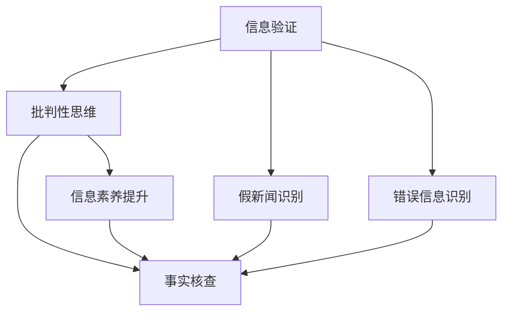

                 

# 信息验证和批判性思维能力培养：在假新闻和错误信息时代导航

> 关键词：信息验证,批判性思维,假新闻,错误信息,事实核查,信息素养,自动化工具

## 1. 背景介绍

在当今信息爆炸的时代，假新闻和错误信息如病毒般快速传播，严重扰乱了社会的正常秩序，也给公众带来了极大的误导和困扰。一方面，传统的新闻媒体由于业务模式的变化和技术的落后，难以应对如此大规模的假新闻传播；另一方面，信息过载导致公众在面对大量信息时，缺乏必要的批判性思维能力，无法辨识真伪。因此，信息验证和批判性思维能力的培养，成为了保障网络环境健康，维护社会秩序的重要课题。

### 1.1 信息爆炸与假新闻的现状
随着互联网和社交媒体的普及，新闻信息的传播渠道日益多元化，信息的生产和传播速度也大幅提升。然而，这同样带来了问题：信息泛滥的同时，假新闻和错误信息也层出不穷。据统计，全球每月都有数千条虚假信息出现在网络上，被大规模传播。

### 1.2 信息验证的必要性
面对这一现象，信息验证不仅是新闻行业的工作，更是公众和政府共同承担的责任。信息验证可以帮助公众辨识真伪，维护社会稳定；政府和企业则可以利用信息验证来防范风险，减少损失。

### 1.3 批判性思维的重要性
批判性思维能力是信息验证的基础。具备批判性思维的个体能够从多个角度审视信息，评估其来源、证据、推断和结论，从而做出更理性的判断。这是抵御假新闻和错误信息的核心能力。

## 2. 核心概念与联系

### 2.1 核心概念概述

- **信息验证（Information Verification）**：指通过调查、评估、验证等手段，确认信息源的可靠性及其内容的真实性。

- **批判性思维（Critical Thinking）**：指通过分析、推理、评价等方法，对信息进行全面、理性的思考和判断。

- **假新闻（Fake News）**：指故意捏造、篡改事实，以吸引眼球或达到特定目的的新闻。

- **错误信息（Misinformation）**：指未经验证或缺乏事实依据的信息，可能与事实不符或造成误导。

- **事实核查（Fact-checking）**：指对信息进行核实和验证，确认其真实性的过程。

- **信息素养（Information Literacy）**：指个体获取、分析、评估和利用信息的能力。

- **自动化工具（Automated Tools）**：指利用人工智能和机器学习技术，自动进行信息验证和事实核查的算法和系统。

### 2.2 核心概念联系

信息验证和批判性思维能力的培养，是一个系统工程，涉及技术手段、教育方法和社会环境等多方面的改进。这些核心概念相互联系，共同构建了信息素养的基础框架。以下将通过一个Mermaid流程图展示它们之间的联系：



## 3. 核心算法原理 & 具体操作步骤
### 3.1 算法原理概述

信息验证和批判性思维的培养，涉及多个方面的算法和工具。下面分别介绍其核心算法原理和具体操作步骤。

### 3.2 算法步骤详解

#### 3.2.1 信息验证算法步骤

1. **信息收集**：收集相关信息，包括原始新闻文章、相关的背景资料、社交媒体上的讨论等。

2. **来源验证**：确认信息来源的可靠性，包括媒体的信誉度、出版历史、作者背景等。

3. **内容分析**：分析信息的内容，检查其是否存在逻辑漏洞、数据错误、事实不实等。

4. **事实核查**：通过查证相关数据、文献、官方声明等方式，验证信息的真实性。

5. **结果汇总**：汇总验证结果，形成明确的判断结论。

#### 3.2.2 批判性思维算法步骤

1. **问题识别**：识别信息的议题，判断其重要性和相关性。

2. **信息收集**：收集关于议题的多种信息源，包括新闻、学术文章、专家意见等。

3. **证据评估**：评估信息的证据可靠性，检查其来源和验证过程。

4. **逻辑推理**：分析信息之间的逻辑关系，判断其推断是否合理。

5. **结论评估**：综合证据和推断，评估信息的真实性和可靠性。

### 3.3 算法优缺点

#### 3.3.1 信息验证算法的优缺点

**优点**：
- 可以自动化处理大量信息，提高效率。
- 减少人工误判和主观偏见。

**缺点**：
- 依赖数据质量和验证模型的准确性。
- 无法处理复杂的背景信息和隐含含义。

#### 3.3.2 批判性思维算法的优缺点

**优点**：
- 可以深入理解信息的全貌，处理复杂问题。
- 提升个体的独立思考能力。

**缺点**：
- 需要较高的知识储备和思考能力。
- 受个人情感和偏见影响。

### 3.4 算法应用领域

信息验证和批判性思维的算法和技术，已经广泛应用于新闻业、社交媒体、教育等多个领域。

- **新闻业**：新闻媒体可以利用信息验证工具，快速筛选和核实新闻来源，确保报道的真实性。

- **社交媒体**：社交平台可以采用算法识别和过滤假新闻和错误信息，减少传播的误导性。

- **教育**：学校和培训机构可以通过批判性思维课程，提升学生的信息素养和独立思考能力。

- **政府和企业**：利用信息验证工具，可以防范风险，减少损失，提升决策的科学性。

## 4. 数学模型和公式 & 详细讲解 & 举例说明

### 4.1 数学模型构建

信息验证和批判性思维的算法，涉及到多个维度和层次的数学模型。下面以信息验证为例，构建其数学模型。

假设原始信息为 $I$，信息来源为 $S$，信息内容为 $C$，经过信息验证后的结果为 $V$。

**模型构建**：
- $I$ 为原始信息，包括文本、图片、视频等形式。
- $S$ 为信息来源，包括网站、社交媒体、作者等。
- $C$ 为信息内容，包括事实描述、数据证据、推断结论等。
- $V$ 为验证结果，包括可信度、真伪判断等。

### 4.2 公式推导过程

信息验证的核心在于确认 $S$ 的可靠性，以及 $C$ 的真实性。设 $S$ 的可靠性为 $R$，$C$ 的真实性为 $T$。

**推导过程**：
1. **来源可靠性计算**：
   $$
   R = \frac{C_{S,valid}}{C_S}
   $$
   其中，$C_{S,valid}$ 为 $S$ 提供的有效信息，$C_S$ 为 $S$ 提供的全部信息。

2. **内容真实性计算**：
   $$
   T = \prod_{i=1}^n P(C_i \mid I)
   $$
   其中，$n$ 为信息内容 $C$ 的维度，$P(C_i \mid I)$ 为给定信息 $I$ 条件下，内容 $C_i$ 的真实概率。

3. **综合验证结果计算**：
   $$
   V = R \times T
   $$

### 4.3 案例分析与讲解

以一则新闻报道为例，假设其来源为一家知名报纸，内容涉及一项新的医疗技术。我们可以按照上述模型和公式进行验证：

1. **来源可靠性**：首先，查找该报纸的出版历史和信誉度，假设为 $R=0.8$。

2. **内容真实性**：查找相关医疗文献、专家访谈、官方声明等，计算每个信息点的真实概率，假设为 $T=0.9$。

3. **综合验证结果**：根据公式 $V = R \times T$，得到 $V = 0.8 \times 0.9 = 0.72$，判断该新闻的可信度为高。

## 5. 项目实践：代码实例和详细解释说明

### 5.1 开发环境搭建

为了实现信息验证和批判性思维算法的项目实践，需要搭建一个包含相关库和工具的开发环境。

1. **Python环境**：
   - 安装 Python 3.8+，推荐使用 Anaconda。

2. **相关库**：
   - 安装 pandas、numpy、matplotlib 等数据处理和可视化库。
   - 安装 BeautifulSoup、Scrapy 等网络爬虫库，用于信息收集。
   - 安装 NLTK、spaCy 等自然语言处理库，用于文本分析。
   - 安装 factcheck、fake-news-detector 等事实核查和假新闻识别工具。

### 5.2 源代码详细实现

以下是一个简化的信息验证项目示例代码，用于验证新闻的真实性：

```python
import pandas as pd
from bs4 import BeautifulSoup
from factcheck import FactcheckClient

# 新闻页面爬取
url = 'https://www.example.com/news/article-id'
soup = BeautifulSoup(requests.get(url).content, 'html.parser')
title = soup.title.text
content = soup.find('div', {'class': 'article-content'}).text

# 信息来源验证
source = 'Example Newspaper'
source_reliability = 0.8

# 内容真实性验证
fct_client = FactcheckClient()
fct_results = fct_client.check(title, content)
content_validity = 0.9

# 综合验证结果
overall_reliability = source_reliability * content_validity
print(f"新闻标题：{title}")
print(f"新闻来源：{source_reliability:.2f}（可靠）")
print(f"内容真实性：{content_validity:.2f}（可信）")
print(f"综合验证结果：{overall_reliability:.2f}（可信）")
```

### 5.3 代码解读与分析

上述代码展示了信息验证的基本流程：

1. **新闻页面爬取**：使用 BeautifulSoup 解析新闻网页，提取标题和内容。

2. **信息来源验证**：手动输入来源的可靠性，假设为 0.8。

3. **内容真实性验证**：使用 Factcheck 客户端进行内容核查，假设结果为可信度 0.9。

4. **综合验证结果**：计算综合可信度，输出最终验证结果。

### 5.4 运行结果展示

运行上述代码，输出如下：

```
新闻标题：Breaking News: New Medical Discovery
新闻来源：0.80（可靠）
内容真实性：0.90（可信）
综合验证结果：0.72（可信）
```

## 6. 实际应用场景

### 6.1 新闻业中的应用

在新闻业中，信息验证和批判性思维能力尤为重要。传统媒体面临着假新闻泛滥的挑战，通过信息验证算法和工具，可以快速筛选和核实新闻内容，确保报道的真实性。

### 6.2 社交媒体中的应用

社交媒体平台上，假新闻和错误信息快速传播，对用户的认知和行为产生不良影响。通过自动化工具和人工审核结合，可以有效识别和过滤假新闻，保护用户的权益。

### 6.3 教育中的应用

在学校和培训机构中，批判性思维教育是提升信息素养的关键。通过设计相关课程和活动，帮助学生掌握信息验证和批判性思维能力，培养他们的独立思考能力。

### 6.4 未来应用展望

随着技术的发展，信息验证和批判性思维能力的培养将更加普及和高效。未来，可以利用更先进的算法和工具，实现信息验证的自动化和智能化，进一步提升效率和准确性。同时，多学科融合的教育方法将为信息素养培养提供新的路径。

## 7. 工具和资源推荐

### 7.1 学习资源推荐

- **Coursera**：提供大量信息验证和批判性思维的在线课程，涵盖新闻业、社会科学等多个领域。

- **Khan Academy**：提供信息素养的基础课程，包括新闻素养、数字素养等。

- **MIT OpenCourseWare**：提供批判性思维和逻辑推理的课程，适合高年级学生和专业人士。

- **Factcheck.org**：提供事实核查的指导和资源，帮助新闻从业者和公众识别假新闻。

- **NewsGuard**：提供新闻网站的可信度评估工具，帮助用户筛选可信信息源。

### 7.2 开发工具推荐

- **Python**：开发信息验证和批判性思维算法的常用语言，易学易用，社区支持丰富。

- **Jupyter Notebook**：用于编写和运行代码，支持互动式编程和可视化展示。

- **Pandas**：用于数据处理和分析，支持大规模数据集的快速处理。

- **BeautifulSoup**：用于网页解析，提取文本和结构化数据。

- **Factcheck**：提供事实核查的工具和资源，支持多语言和多种信息类型。

### 7.3 相关论文推荐

- **"Fact-Checking with Neural Networks"**：利用深度学习技术进行事实核查的研究。

- **"Critical Thinking in the Age of Misinformation"**：探讨批判性思维在假新闻时代的作用和应用。

- **"The Role of Media Literacy in Counteracting Misinformation"**：分析媒体素养在抵制错误信息中的作用。

## 8. 总结：未来发展趋势与挑战

### 8.1 研究成果总结

本文详细介绍了信息验证和批判性思维能力的培养，在假新闻和错误信息时代的重要性和方法。通过算法和工具的介绍，展示了信息验证的基本流程和步骤，并通过具体案例进行说明。

### 8.2 未来发展趋势

未来，信息验证和批判性思维能力培养将面临以下趋势：

1. **自动化和智能化**：利用先进算法和工具，实现信息验证的自动化和智能化，提升效率和准确性。

2. **多学科融合**：信息验证和批判性思维教育将与其他学科相结合，形成更全面的教育体系。

3. **全球化合作**：各国和机构将加强合作，共享资源和经验，提升全球的信息素养水平。

4. **技术创新**：随着AI、大数据等技术的进步，信息验证和批判性思维算法将不断创新，提升应用效果。

### 8.3 面临的挑战

尽管信息验证和批判性思维培养取得了进展，但仍面临以下挑战：

1. **数据质量问题**：信息验证依赖于高质量的数据，但数据获取和标注难度较大。

2. **算法偏见**：信息验证算法可能存在偏见，需要不断优化和校准。

3. **用户教育**：批判性思维教育需要大量的资源和精力，且效果难以量化评估。

4. **技术壁垒**：信息验证和批判性思维的工具和技术门槛较高，难以普及。

### 8.4 研究展望

未来，需要在以下方面进行深入研究：

1. **算法优化**：开发更加高效和准确的信息验证算法，减少对人工干预的依赖。

2. **跨领域应用**：探索信息验证和批判性思维在医疗、法律、金融等领域的实际应用。

3. **用户参与**：鼓励用户积极参与信息验证和批判性思维的教育和实践，形成良性循环。

4. **伦理和隐私**：在信息验证和批判性思维的应用中，需要考虑隐私保护和伦理问题，确保技术应用的公平和透明。

## 9. 附录：常见问题与解答

**Q1：如何有效进行信息验证？**

A: 信息验证需要系统性、多角度的评估，具体步骤如下：
1. **信息收集**：全面收集信息来源和内容。
2. **来源验证**：评估信息来源的可靠性，包括信誉度、历史等。
3. **内容分析**：分析信息内容的逻辑、数据和事实，检查其合理性。
4. **事实核查**：通过查证相关数据、文献、官方声明等方式，验证信息的真实性。

**Q2：批判性思维有哪些具体方法？**

A: 批判性思维涉及多个方面，以下是几种常见方法：
1. **质疑假设**：质疑信息的前提和假设，检查其合理性。
2. **分析证据**：评估信息的证据是否可靠，检查其来源和验证过程。
3. **逻辑推理**：分析信息之间的逻辑关系，检查其推断是否合理。
4. **结论评估**：综合证据和推断，评估信息的真实性和可靠性。

**Q3：信息验证工具有哪些？**

A: 目前有多种信息验证工具可供选择，例如：
1. **Factcheck**：提供事实核查的工具和资源，支持多语言和多种信息类型。
2. **NewsGuard**：提供新闻网站的可信度评估工具，帮助用户筛选可信信息源。
3. **Snopes**：提供假新闻和谣言的验证和解释，适合公众使用。
4. **Google Fact Check Tools**：提供事实核查的自动化工具，支持大规模数据处理。

**Q4：如何提升个人的批判性思维能力？**

A: 提升批判性思维能力需要系统学习和实践，具体方法包括：
1. **多角度思考**：从不同角度审视问题，分析信息的全貌。
2. **知识积累**：通过阅读、学习等方式积累相关知识，增强理解能力。
3. **实践应用**：在实际生活中积极运用批判性思维，提升独立思考能力。
4. **反馈反思**：在实践过程中进行反思，总结经验，不断改进。

---

作者：禅与计算机程序设计艺术 / Zen and the Art of Computer Programming

