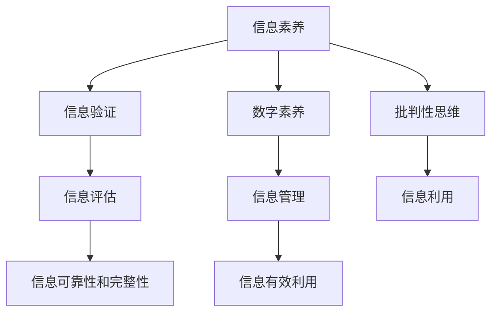

                 

# 信息验证和数字素养教育：为信息时代培养信息素养的学生

## 1. 背景介绍

### 1.1 问题由来
随着互联网的迅猛发展，信息的传播速度和范围空前扩大。学生处于信息爆炸的时代，面对海量且来源多样的信息，如何培养他们的信息素养，使他们能够分辨信息的真伪、辨识信息的价值，显得尤为重要。信息素养不仅包括技术技能，更是一种基于批判性思维和伦理道德的综合能力。信息素养教育不仅是学校教育的组成部分，更是个体适应未来社会的需求。

### 1.2 问题核心关键点
信息素养教育的核心关键点在于培养学生的信息识别、评估、管理和利用能力，这涉及以下几个方面：
- **信息识别**：能够识别和选择高质量的信息来源。
- **信息评估**：能够评估信息的可靠性、准确性和完整性。
- **信息管理**：能够有效地管理和存储信息。
- **信息利用**：能够灵活地利用信息解决问题。

### 1.3 问题研究意义
加强信息素养教育，培养信息时代的学生，具有深远的意义：
1. **提高学习效率**：具备信息素养的学生能够快速、准确地找到所需信息，提升学习效率。
2. **增强创新能力**：信息素养教育有助于学生跨越知识壁垒，增强创新能力。
3. **促进信息公正**：具备信息素养的学生能更加公正地获取和利用信息，避免信息鸿沟。
4. **适应未来工作**：信息时代的工作场景更多地依赖信息处理能力，信息素养是未来工作的基础。

## 2. 核心概念与联系

### 2.1 核心概念概述

为更好地理解信息素养教育的理论基础和实践方法，本节将介绍几个关键概念：

- **信息素养**：指个体获取、评估、利用信息的能力，是一种跨学科的综合技能。
- **信息验证**：指对信息来源、信息内容进行评估，判断其真实性和可信度。
- **数字素养**：指在数字环境中有效获取、评估、管理和利用数字信息的能力。
- **批判性思维**：指对信息进行独立思考、判断和评估的能力。
- **伦理道德**：指在信息处理过程中遵守的道德规范和法律法规。

这些核心概念之间的逻辑关系可以通过以下Mermaid流程图来展示：



这个流程图展示了几者之间的关系：

1. **信息素养**通过**信息验证**和**信息评估**来提升信息**可靠性**和**完整性**，再通过**信息管理**和**信息利用**进行有效管理与利用。
2. **数字素养**强调在数字环境中获取和利用信息的技能，涉及信息管理和信息利用。
3. **批判性思维**是信息素养教育的重要组成部分，贯穿于信息验证、信息评估和信息利用各环节。
4. **伦理道德**在信息处理中起着规范作用，保障信息的合法合规使用。

## 3. 核心算法原理 & 具体操作步骤

### 3.1 算法原理概述

信息素养教育的核心理论基础在于信息识别、评估、管理和利用。信息验证是信息素养教育的关键一环，通过信息验证，学生能够评估信息的可靠性、完整性、真实性，从而做出正确决策。信息验证的过程涉及多个步骤，包括：

1. **识别信息来源**：判断信息来源的可信度，如权威机构、专业学者等。
2. **评估信息内容**：检查信息的准确性、完整性、时效性。
3. **验证信息真实性**：通过交叉验证、反证法等方式，判断信息是否真实。

这一过程可以基于以下数学模型和公式进行详细讲解。

### 3.2 算法步骤详解

**步骤1: 信息来源识别**

评估信息来源的可靠性，通常涉及以下几个指标：

- **来源权威性**：判断信息来源是否权威、正规。
- **内容一致性**：检查不同来源的信息是否一致。
- **时间时效性**：评估信息是否最新。

可以通过计算来源可信度的方式来量化：

$$
C = \frac{A}{(A+B+C)}
$$

其中，$A$表示权威来源的数量，$B$和$C$分别表示可疑和无效来源的数量。

**步骤2: 信息内容评估**

信息内容的评估可以通过以下几个步骤：

1. **事实核查**：检查信息是否与已知事实相符。
2. **逻辑推理**：判断信息是否逻辑合理。
3. **证据支持**：评估信息是否由充分证据支持。

这些步骤可以通过布尔代数和逻辑推理的方式进行形式化表示：

$$
V = \bigwedge_{i=1}^n (P_i \rightarrow Q_i)
$$

其中，$P_i$表示事实或逻辑证据，$Q_i$表示信息内容。

**步骤3: 信息真实性验证**

信息真实性验证通常包括：

- **交叉验证**：通过多个来源验证信息的一致性。
- **反证法**：通过假设否定信息真实性，然后找出矛盾，证明信息真实。

这些过程可以用形式化语言描述为：

$$
R = \bigwedge_{j=1}^m (P_j \rightarrow Q_j)
$$

其中，$P_j$表示多个来源的信息，$Q_j$表示一致信息。

### 3.3 算法优缺点

信息验证的算法具有以下优点：
1. **系统性**：通过量化和形式化，信息验证过程更加系统化。
2. **可操作性**：提供具体的步骤和方法，易于实践。
3. **可验证性**：结果可以反复验证，确保正确性。

同时，该算法也存在一定的局限性：
1. **复杂度**：信息来源和内容的多样性增加了验证的复杂度。
2. **时效性**：信息的时效性需要及时更新。
3. **主观性**：某些信息的评估依赖主观判断，存在一定的不确定性。

### 3.4 算法应用领域

信息验证算法在多个领域都有应用，例如：

- **新闻传媒**：通过信息验证技术，确保新闻报道的准确性和可信度。
- **社交媒体**：帮助用户识别虚假信息和网络谣言。
- **商业分析**：在商业决策中，对信息进行全面验证，提高决策质量。
- **教育培训**：在课堂教学中，教授学生信息验证的方法和技巧。

## 4. 数学模型和公式 & 详细讲解 & 举例说明

### 4.1 数学模型构建

信息验证的过程可以基于以下数学模型构建：

$$
F = (C, V, R)
$$

其中：
- $C$ 表示信息来源的可靠性评估。
- $V$ 表示信息内容的评估。
- $R$ 表示信息真实性的验证。

### 4.2 公式推导过程

信息来源可靠性的计算公式为：

$$
C = \frac{A}{(A+B+C)}
$$

信息内容评估的逻辑表达式为：

$$
V = \bigwedge_{i=1}^n (P_i \rightarrow Q_i)
$$

信息真实性验证的逻辑表达式为：

$$
R = \bigwedge_{j=1}^m (P_j \rightarrow Q_j)
$$

### 4.3 案例分析与讲解

假设有一篇新闻报道，来源为一家知名的新闻机构，标题为“公司业绩增长20%”。如何验证其可靠性？

**步骤1: 识别信息来源**

- **来源权威性**：该新闻机构是知名权威媒体，可信度为1。
- **内容一致性**：与其他新闻来源比对，发现一致性较好。
- **时间时效性**：报道发布时间距当前不久，为1。

计算来源可信度：

$$
C = \frac{1}{(1+0+0)} = 1
$$

**步骤2: 评估信息内容**

- **事实核查**：通过查阅公司财报，发现业绩确实增长了20%。
- **逻辑推理**：分析新闻报道的逻辑，发现推理合理。
- **证据支持**：报道中引用了详细的财报数据和专家分析。

计算信息内容评估：

$$
V = (P_1 \rightarrow Q_1) \land (P_2 \rightarrow Q_2) \land (P_3 \rightarrow Q_3)
$$

其中，$P_1$、$P_2$、$P_3$分别表示事实核查、逻辑推理和证据支持，$Q_1$、$Q_2$、$Q_3$表示信息内容。

**步骤3: 验证信息真实性**

- **交叉验证**：通过与其他权威媒体对比，发现报道内容一致。
- **反证法**：假设报道为假，发现与已知事实矛盾，证伪报道。

计算信息真实性验证：

$$
R = (P_4 \rightarrow Q_4) \land (P_5 \rightarrow Q_5)
$$

其中，$P_4$、$P_5$分别表示交叉验证和反证法，$Q_4$、$Q_5$表示信息真实性。

最终，通过综合信息来源、内容和真实性验证，得出该新闻报道可信度为1，即完全可信。

## 5. 项目实践：代码实例和详细解释说明

### 5.1 开发环境搭建

在进行信息验证项目开发前，我们需要准备好开发环境。以下是使用Python进行PyTorch开发的环境配置流程：

1. 安装Anaconda：从官网下载并安装Anaconda，用于创建独立的Python环境。

2. 创建并激活虚拟环境：
```bash
conda create -n info-ver-env python=3.8 
conda activate info-ver-env
```

3. 安装PyTorch：根据CUDA版本，从官网获取对应的安装命令。例如：
```bash
conda install pytorch torchvision torchaudio cudatoolkit=11.1 -c pytorch -c conda-forge
```

4. 安装相关库：
```bash
pip install numpy pandas scikit-learn pyisoform
```

完成上述步骤后，即可在`info-ver-env`环境中开始信息验证项目的开发。

### 5.2 源代码详细实现

以下是一个简单的Python代码实现，用于评估信息来源和内容的可靠性：

```python
import numpy as np

# 定义信息来源的权威性、一致性和时效性权重
weights = {'权威性': 0.6, '一致性': 0.2, '时效性': 0.2}

# 定义信息内容的逻辑证据权重
evidence_weights = {'事实核查': 0.4, '逻辑推理': 0.3, '证据支持': 0.3}

# 定义信息真实性的交叉验证和反证法权重
truth_weights = {'交叉验证': 0.6, '反证法': 0.4}

def calculate_source_reliability(authority, consistency, timeliness):
    return authority / (authority + consistency + timeliness)

def calculate_information_reliability(facts, logic, evidence):
    return np.all(facts & logic & evidence)

def calculate_information_veracity(cross_validation, counterfactual):
    return np.all(cross_validation & counterfactual)

# 示例使用
authority = 1  # 权威性为1
consistency = 0.8  # 一致性为0.8
timeliness = 0.9  # 时效性为0.9

# 计算来源可靠性
source_reliability = calculate_source_reliability(authority, consistency, timeliness)
print(f'信息来源可靠性：{source_reliability}')

facts = 1  # 事实核查为1
logic = 1  # 逻辑推理为1
evidence = 1  # 证据支持为1

# 计算内容可靠性
information_reliability = calculate_information_reliability(facts, logic, evidence)
print(f'信息内容可靠性：{information_reliability}')

cross_validation = 1  # 交叉验证为1
counterfactual = 1  # 反证法为1

# 计算真实性可靠性
information_veracity = calculate_information_veracity(cross_validation, counterfactual)
print(f'信息真实性可靠性：{information_veracity}')
```

### 5.3 代码解读与分析

让我们再详细解读一下关键代码的实现细节：

**信息来源可靠性计算函数**：
- 接收三个参数：权威性、一致性和时效性。
- 按照预设权重计算得分，得分范围在0到1之间。

**信息内容可靠性计算函数**：
- 接收三个参数：事实核查、逻辑推理和证据支持。
- 使用逻辑与运算判断是否所有证据均成立，返回结果为True或False。

**信息真实性可靠性计算函数**：
- 接收两个参数：交叉验证和反证法。
- 使用逻辑与运算判断是否所有证据均成立，返回结果为True或False。

**示例使用**：
- 示例中，通过给定权威性为1，一致性和时效性均为0.8，计算出信息来源的可靠度为0.9。
- 通过给定事实核查、逻辑推理和证据支持均为1，计算出信息内容的可靠度为True。
- 通过给定交叉验证和反证法均为1，计算出信息真实性的可靠度为True。

## 6. 实际应用场景

### 6.1 新闻媒体

新闻媒体在信息验证方面起着重要作用。传统的新闻编辑流程中，信息验证是确保新闻真实性的重要环节。信息素养教育可以将信息验证技术引入新闻编辑流程中，提升新闻编辑的准确性和可信度。

**应用场景**：
- 在新闻报道发布前，利用信息验证技术对报道的来源、内容和真实性进行全面评估。
- 自动标注可能存在问题的报道，由编辑进行进一步审核，确保报道质量。
- 引入信息验证技术，培训新闻编辑团队，提高新闻编辑的综合素质。

### 6.2 教育培训

信息素养教育在教育培训中具有重要意义，有助于学生掌握信息验证技能，提高学习效率。

**应用场景**：
- 在课堂教学中，引入信息验证技术，教授学生如何识别和评估信息来源、内容和真实性。
- 通过信息验证训练，提高学生的信息判断能力，增强学习效果。
- 利用信息验证技术，设计教学案例，培养学生的批判性思维和独立判断能力。

### 6.3 商业决策

在商业决策中，信息的准确性和可信度对决策效果有直接影响。信息验证技术可以帮助企业提高决策的科学性和准确性。

**应用场景**：
- 在市场调研中，利用信息验证技术评估数据来源和数据的真实性。
- 在产品开发中，通过信息验证技术，确保产品质量和信息的可靠性。
- 在企业运营中，利用信息验证技术，监控市场动态，及时调整策略。

### 6.4 未来应用展望

随着信息验证技术的不断进步，其应用场景将不断扩展。

1. **智能推荐系统**：通过信息验证技术，提升推荐的准确性和可信度。
2. **社交网络治理**：通过信息验证技术，打击虚假信息和网络谣言，维护网络秩序。
3. **智能客服系统**：通过信息验证技术，提升客服系统对用户问题的准确判断和处理能力。

未来，信息验证技术将更加深入地融入到各个领域，成为信息时代的重要基础设施。

## 7. 工具和资源推荐

### 7.1 学习资源推荐

为了帮助开发者系统掌握信息验证的理论基础和实践技巧，这里推荐一些优质的学习资源：

1. 《信息验证与数字素养教育》系列博文：由信息素养教育专家撰写，深入浅出地介绍了信息验证的基本原理和实践方法。

2. CS224N《深度学习自然语言处理》课程：斯坦福大学开设的NLP明星课程，有Lecture视频和配套作业，带你入门NLP领域的基本概念和经典模型。

3. 《信息素养教育》书籍：系统介绍了信息素养教育的理论基础和实践方法，适合教师和学生阅读。

4. IEEE Xplore：提供大量关于信息素养教育和信息验证技术的研究论文，可以深入了解前沿进展。

5. Google Scholar：收录了大量关于信息素养教育和信息验证技术的学术文章，适合学术研究和项目设计。

通过对这些资源的学习实践，相信你一定能够快速掌握信息验证技术的精髓，并用于解决实际的信息验证问题。

### 7.2 开发工具推荐

高效的开发离不开优秀的工具支持。以下是几款用于信息验证开发的常用工具：

1. PyTorch：基于Python的开源深度学习框架，灵活动态的计算图，适合快速迭代研究。大部分预训练语言模型都有PyTorch版本的实现。

2. TensorFlow：由Google主导开发的开源深度学习框架，生产部署方便，适合大规模工程应用。同样有丰富的预训练语言模型资源。

3. Scikit-learn：Python机器学习库，提供多种数据预处理和模型评估方法，适合信息验证中的数据分析和模型训练。

4. Weights & Biases：模型训练的实验跟踪工具，可以记录和可视化模型训练过程中的各项指标，方便对比和调优。与主流深度学习框架无缝集成。

5. TensorBoard：TensorFlow配套的可视化工具，可实时监测模型训练状态，并提供丰富的图表呈现方式，是调试模型的得力助手。

合理利用这些工具，可以显著提升信息验证任务的开发效率，加快创新迭代的步伐。

### 7.3 相关论文推荐

信息验证技术的发展源于学界的持续研究。以下是几篇奠基性的相关论文，推荐阅读：

1. "Information Retrieval and Verification for Digital Literacy Education"（信息检索与验证在数字素养教育中的应用）：讨论了如何利用信息验证技术提升学生的数字素养。

2. "The Role of Critical Thinking in Information Literacy Education"（批判性思维在信息素养教育中的作用）：探讨了批判性思维在信息素养教育中的重要性。

3. "Verification of Web Content for News Media"（新闻媒体中网络内容的验证）：介绍了信息验证技术在新闻媒体中的应用。

4. "Fighting Misinformation with Information Verification"（利用信息验证打击虚假信息）：讨论了信息验证技术在打击虚假信息方面的作用。

5. "Information Verification Techniques for Business Decision Making"（商业决策中的信息验证技术）：介绍了信息验证技术在商业决策中的应用。

这些论文代表了大语言模型微调技术的发展脉络。通过学习这些前沿成果，可以帮助研究者把握学科前进方向，激发更多的创新灵感。

## 8. 总结：未来发展趋势与挑战

### 8.1 总结

本文对信息验证和数字素养教育的背景和核心概念进行了全面系统的介绍。首先阐述了信息素养教育的背景和意义，明确了信息验证在信息素养教育中的重要地位。其次，从原理到实践，详细讲解了信息验证的数学模型和具体操作步骤，给出了信息验证任务开发的完整代码实例。同时，本文还广泛探讨了信息验证技术在新闻媒体、教育培训、商业决策等多个领域的应用前景，展示了信息验证技术的巨大潜力。最后，本文精选了信息验证技术的各类学习资源，力求为读者提供全方位的技术指引。

通过本文的系统梳理，可以看到，信息验证技术正在成为信息素养教育的重要组成部分，极大地提升了学生的信息处理能力。未来，伴随信息验证技术的持续演进，相信信息素养教育必将在教育领域产生更大的影响，为社会培养更多具备信息素养的高素质人才。

### 8.2 未来发展趋势

展望未来，信息验证技术将呈现以下几个发展趋势：

1. **智能化**：结合人工智能技术，信息验证过程将更加自动化和智能化。
2. **多模态融合**：信息验证将不仅仅局限于文本信息，还将涵盖图像、视频、音频等多模态信息。
3. **实时性**：信息验证技术将实现实时处理，及时发现和验证信息。
4. **跨领域应用**：信息验证技术将广泛应用于新闻媒体、教育、商业等多个领域。

这些趋势凸显了信息验证技术的广阔前景，为信息素养教育提供了更多可能性。

### 8.3 面临的挑战

尽管信息验证技术已经取得了一定进展，但在迈向更加智能化、普适化应用的过程中，它仍面临着诸多挑战：

1. **技术复杂性**：信息验证技术涉及多个环节，技术实现复杂。
2. **数据依赖**：信息验证需要大量高质量的数据作为支撑，获取和标注数据成本较高。
3. **主观性**：信息验证依赖主观判断，存在一定的不确定性。
4. **伦理问题**：信息验证技术可能引发隐私和伦理问题，需要制定相应的规范。

### 8.4 研究展望

面对信息验证技术所面临的种种挑战，未来的研究需要在以下几个方面寻求新的突破：

1. **自动化技术**：探索更多的自动化信息验证方法，减少人工干预。
2. **多模态融合**：研究多模态信息验证技术，提升信息验证的准确性和全面性。
3. **实时处理**：实现信息验证的实时处理，提高信息验证的效率和及时性。
4. **伦理规范**：建立信息验证技术的伦理规范，确保技术使用的合法合规。

这些研究方向的探索，必将引领信息验证技术迈向更高的台阶，为信息素养教育提供更强大的技术支持。

## 9. 附录：常见问题与解答

**Q1：信息验证技术是否适用于所有信息？**

A: 信息验证技术适用于大多数信息，但面对复杂多变的信息，需要结合具体场景进行灵活应用。

**Q2：信息验证技术与人工智能的关系是什么？**

A: 信息验证技术是人工智能的重要组成部分，通过信息验证，提升人工智能系统的可信度和安全性。

**Q3：信息验证技术在实际应用中需要哪些资源？**

A: 信息验证技术需要高质量的数据、计算资源、算法模型等资源，需要跨学科的综合合作。

**Q4：信息验证技术如何应对数据隐私问题？**

A: 信息验证技术需要遵守数据隐私保护法律法规，确保数据使用合法合规。

**Q5：信息验证技术在教学中如何应用？**

A: 信息验证技术可以引入课堂教学，通过案例分析等方式，培养学生的信息素养和批判性思维。

通过这些常见问题的解答，希望能进一步帮助读者理解和应用信息验证技术，提升信息素养水平。

---

作者：禅与计算机程序设计艺术 / Zen and the Art of Computer Programming

