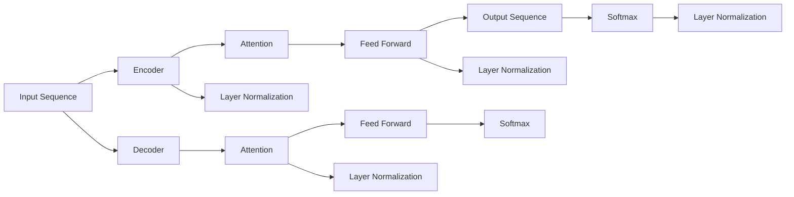

                 

## 1. 背景介绍

在过去的几年里，深度学习已经取得了长足的进步，特别是在计算机视觉、自然语言处理等领域的突破，让人类进入了一个全新的时代。而在深度学习的诸多实现形式中，最引人注目的当属Transformer架构。尤其是在NLP领域，基于Transformer的BERT、GPT-3等模型已经展示出了强大的泛化能力，其横空出世，令业界震惊。然而，这一“奇迹”背后，离不开一位在深度学习领域具有广泛影响力和深远洞察力的重要人物——贾扬清（Andrew Ng）。本文将围绕贾扬清及其团队在深度学习领域的突破和创新，探讨其在保持健康增长曲线方面所展现的领导力和战略智慧。

## 2. 核心概念与联系

### 2.1 核心概念概述

在探讨贾扬清及其团队的创新之前，我们首先需要了解一些核心概念及其内在联系。

**Transformer**：一种基于自注意力机制的神经网络架构，因其在处理序列数据（如文本、音频等）时的卓越性能而广受关注。

**深度学习**：一种机器学习方法，通过多层神经网络模型对数据进行学习，从而发现数据的内在结构和规律。

**自然语言处理**（NLP）：使计算机能够理解和生成人类语言的领域，深度学习在NLP中的应用尤为显著。

**梯度下降**：深度学习中最常用的优化算法，用于更新模型参数，以最小化损失函数。

**Attention**：一种机制，用于捕捉序列数据中的重要特征，是Transformer的核心组件。

### 2.2 核心概念原理和架构的 Mermaid 流程图

以下是一个简化的Mermaid流程图，展示了Transformer模型的大致架构及其核心组件：



此图展示了输入序列经过编码器（Encoder）、自注意力（Attention）、前馈层（Feed Forward）和解码器（Decoder）的逐层处理，最终输出预测序列的过程。其中，每一层都包含归一化（Layer Normalization）步骤，以稳定模型的梯度。

## 3. 核心算法原理 & 具体操作步骤

### 3.1 算法原理概述

Transformer的核心在于其自注意力机制（Self-Attention），它通过捕捉序列数据中的不同位置之间的相互关系，实现对序列特征的精确建模。而深度学习则通过构建多层神经网络，利用梯度下降等优化算法，对模型参数进行迭代更新，最小化损失函数，从而提高模型对数据的拟合能力。

### 3.2 算法步骤详解

一个典型的基于Transformer的NLP模型的训练流程包括以下步骤：

1. **数据预处理**：将原始文本数据转换为模型可以处理的数值形式，如词向量表示等。
2. **模型构建**：设计并构建Transformer模型，包括编码器、解码器和注意力机制等组件。
3. **模型训练**：使用梯度下降等优化算法，在训练集上进行模型参数的迭代更新，最小化损失函数。
4. **验证和调整**：在验证集上评估模型性能，根据性能指标调整模型超参数，如学习率、批大小等。
5. **测试和部署**：在测试集上对模型进行最终评估，将模型部署到实际应用场景中。

### 3.3 算法优缺点

**优点**：
- **高效并行**：Transformer模型具有较好的并行性，可以利用GPU等硬件加速，提高训练和推理效率。
- **鲁棒性强**：通过自注意力机制，Transformer模型能够捕捉序列数据中的长距离依赖关系，从而具有较强的泛化能力。
- **可解释性强**：Transformer模型的结构简单，易于理解和调试。

**缺点**：
- **计算资源需求高**：Transformer模型的参数量较大，需要较大的计算资源和存储空间。
- **训练时间长**：模型训练和推理速度较慢，尤其是在大规模数据集上。
- **过拟合风险高**：由于模型结构复杂，容易导致过拟合。

### 3.4 算法应用领域

Transformer架构在多个领域得到了广泛应用，包括但不限于：

- **自然语言处理**：如机器翻译、情感分析、问答系统等。
- **计算机视觉**：如目标检测、图像分类、图像生成等。
- **语音识别**：如语音转文本、文本转语音等。

这些应用不仅展示了Transformer架构的强大能力，也反映了深度学习在处理复杂序列数据时的优越性能。

## 4. 数学模型和公式 & 详细讲解 & 举例说明

### 4.1 数学模型构建

Transformer模型主要由编码器和解码器组成，每层包含自注意力机制和前馈层。我们以自注意力机制为例，构建其数学模型。

设输入序列为$X=\{x_1, x_2, ..., x_n\}$，输出序列为$Y=\{y_1, y_2, ..., y_n\}$。假设每个单词的向量表示为$\vec{x_i} \in \mathbb{R}^d$，其中$d$为向量维度。

自注意力机制的核心思想是，通过计算每个单词与其他所有单词之间的相似度，确定每个单词在序列中的重要性。具体步骤如下：

1. **查询向量计算**：将输入序列中每个单词的向量表示$\vec{x_i}$与一个可学习的查询向量$W_Q$相乘，得到查询向量$\vec{q_i}$。
2. **键值对计算**：将输入序列中每个单词的向量表示$\vec{x_i}$与两个可学习的矩阵$W_K$和$W_V$相乘，得到键向量$\vec{k_i}$和值向量$\vec{v_i}$。
3. **注意力权重计算**：计算查询向量$\vec{q_i}$与所有键向量$\vec{k_j}$的相似度，得到注意力权重$\alpha_{ij}$。
4. **加权和计算**：将注意力权重$\alpha_{ij}$与所有值向量$\vec{v_j}$相乘，得到加权和向量$\vec{z_i}$。
5. **输出向量计算**：将加权和向量$\vec{z_i}$与一个可学习的矩阵$W_O$相乘，得到输出向量$\vec{y_i}$。

数学上，自注意力机制可以表示为：

$$
\alpha_{ij} = \frac{e^{\vec{q_i}^\top \vec{k_j}}}{\sum_{k=1}^n e^{\vec{q_i}^\top \vec{k_k}}}
$$

$$
\vec{z_i} = \sum_{j=1}^n \alpha_{ij}\vec{v_j}
$$

$$
\vec{y_i} = \vec{z_i} \vec{W_O}
$$

### 4.2 公式推导过程

以上自注意力机制的公式推导基于矩阵向量乘法和点积运算。假设输入序列的长度为$n$，则上述公式可以进一步表示为矩阵形式：

$$
\vec{z_i} = [\alpha_{i1}, \alpha_{i2}, ..., \alpha_{in}] \begin{bmatrix} \vec{v_1} \\ \vec{v_2} \\ \vdots \\ \vec{v_n} \end{bmatrix}
$$

$$
\vec{y_i} = \vec{z_i} \vec{W_O}
$$

其中，注意力权重$\alpha_{ij}$可以表示为一个$n \times n$的矩阵，值向量$\vec{v_j}$可以表示为一个$n \times d$的矩阵，输出向量$\vec{y_i}$可以表示为一个$d$维的向量。

### 4.3 案例分析与讲解

以BERT模型为例，其采用了Transformer的结构，但在大规模无标签文本语料上进行预训练，然后再通过微调进行特定任务的处理。BERT模型的预训练任务包括掩码语言模型和下一句预测。其微调过程一般包括以下步骤：

1. **数据准备**：准备下游任务的标注数据集，并将其分为训练集、验证集和测试集。
2. **模型初始化**：使用预训练的BERT模型作为初始化参数。
3. **任务适配层设计**：根据任务类型，设计合适的输出层和损失函数。
4. **微调**：在训练集上使用梯度下降等优化算法，最小化损失函数，调整模型参数。
5. **验证和调整**：在验证集上评估模型性能，调整模型超参数。
6. **测试**：在测试集上评估模型性能，输出最终结果。

以下是BERT模型微调的基本代码示例：

```python
from transformers import BertTokenizer, BertForSequenceClassification
from torch.utils.data import Dataset, DataLoader
from sklearn.model_selection import train_test_split
import torch

class TextDataset(Dataset):
    def __init__(self, texts, labels):
        self.texts = texts
        self.labels = labels
        self.tokenizer = BertTokenizer.from_pretrained('bert-base-uncased')
    
    def __len__(self):
        return len(self.texts)
    
    def __getitem__(self, item):
        text = self.texts[item]
        label = self.labels[item]
        encoding = self.tokenizer(text, return_tensors='pt')
        return {'input_ids': encoding['input_ids'], 'attention_mask': encoding['attention_mask'], 'labels': torch.tensor(label)}

# 数据准备
texts, labels = get_data()  # 假设计算出数据集
train_texts, test_texts, train_labels, test_labels = train_test_split(texts, labels, test_size=0.2)

# 模型初始化
model = BertForSequenceClassification.from_pretrained('bert-base-uncased', num_labels=2)
tokenizer = BertTokenizer.from_pretrained('bert-base-uncased')

# 任务适配层设计
optimizer = AdamW(model.parameters(), lr=2e-5)
criterion = CrossEntropyLoss()

# 微调
train_dataset = TextDataset(train_texts, train_labels)
test_dataset = TextDataset(test_texts, test_labels)
train_loader = DataLoader(train_dataset, batch_size=16)
test_loader = DataLoader(test_dataset, batch_size=16)

for epoch in range(epochs):
    model.train()
    for batch in train_loader:
        input_ids = batch['input_ids'].to(device)
        attention_mask = batch['attention_mask'].to(device)
        labels = batch['labels'].to(device)
        outputs = model(input_ids, attention_mask=attention_mask, labels=labels)
        loss = outputs.loss
        optimizer.zero_grad()
        loss.backward()
        optimizer.step()

    model.eval()
    with torch.no_grad():
        predictions, labels = [], []
        for batch in test_loader:
            input_ids = batch['input_ids'].to(device)
            attention_mask = batch['attention_mask'].to(device)
            labels = batch['labels'].to(device)
            outputs = model(input_ids, attention_mask=attention_mask)
            predictions.extend(outputs.logits.argmax(dim=1).tolist())
            labels.extend(labels.tolist())
        print(classification_report(labels, predictions))
```

### 5. 项目实践：代码实例和详细解释说明

### 5.1 开发环境搭建

开发环境搭建是进行深度学习项目的基础。以下是一个基于Python和PyTorch的深度学习环境搭建流程：

1. 安装Anaconda：从官网下载并安装Anaconda，用于创建独立的Python环境。
```bash
conda create -n pytorch-env python=3.8 
conda activate pytorch-env
```

2. 安装PyTorch：根据CUDA版本，从官网获取对应的安装命令。例如：
```bash
conda install pytorch torchvision torchaudio cudatoolkit=11.1 -c pytorch -c conda-forge
```

3. 安装TensorFlow：
```bash
pip install tensorflow
```

4. 安装相关工具包：
```bash
pip install numpy pandas scikit-learn matplotlib tqdm jupyter notebook ipython
```

5. 安装Transformers库：
```bash
pip install transformers
```

6. 安装Jupyter Notebook：
```bash
pip install jupyter notebook
```

完成上述步骤后，即可在`pytorch-env`环境中开始深度学习项目。

### 5.2 源代码详细实现

在实际项目中，以下是一个简单的代码示例，展示如何构建和使用基于Transformer的NLP模型：

```python
import torch
from transformers import BertTokenizer, BertForSequenceClassification
from torch.utils.data import Dataset, DataLoader
from sklearn.model_selection import train_test_split
from transformers import AdamW
from sklearn.metrics import classification_report

class TextDataset(Dataset):
    def __init__(self, texts, labels):
        self.texts = texts
        self.labels = labels
        self.tokenizer = BertTokenizer.from_pretrained('bert-base-uncased')
    
    def __len__(self):
        return len(self.texts)
    
    def __getitem__(self, item):
        text = self.texts[item]
        label = self.labels[item]
        encoding = self.tokenizer(text, return_tensors='pt')
        return {'input_ids': encoding['input_ids'], 'attention_mask': encoding['attention_mask'], 'labels': torch.tensor(label)}

# 数据准备
texts, labels = get_data()  # 假设计算出数据集
train_texts, test_texts, train_labels, test_labels = train_test_split(texts, labels, test_size=0.2)

# 模型初始化
model = BertForSequenceClassification.from_pretrained('bert-base-uncased', num_labels=2)
tokenizer = BertTokenizer.from_pretrained('bert-base-uncased')

# 任务适配层设计
optimizer = AdamW(model.parameters(), lr=2e-5)
criterion = CrossEntropyLoss()

# 微调
train_dataset = TextDataset(train_texts, train_labels)
test_dataset = TextDataset(test_texts, test_labels)
train_loader = DataLoader(train_dataset, batch_size=16)
test_loader = DataLoader(test_dataset, batch_size=16)

for epoch in range(epochs):
    model.train()
    for batch in train_loader:
        input_ids = batch['input_ids'].to(device)
        attention_mask = batch['attention_mask'].to(device)
        labels = batch['labels'].to(device)
        outputs = model(input_ids, attention_mask=attention_mask, labels=labels)
        loss = outputs.loss
        optimizer.zero_grad()
        loss.backward()
        optimizer.step()

    model.eval()
    with torch.no_grad():
        predictions, labels = [], []
        for batch in test_loader:
            input_ids = batch['input_ids'].to(device)
            attention_mask = batch['attention_mask'].to(device)
            labels = batch['labels'].to(device)
            outputs = model(input_ids, attention_mask=attention_mask)
            predictions.extend(outputs.logits.argmax(dim=1).tolist())
            labels.extend(labels.tolist())
        print(classification_report(labels, predictions))
```

### 5.3 代码解读与分析

上述代码展示了从数据准备到模型微调的全过程。关键步骤如下：

1. **数据准备**：将原始文本数据转换为模型可以处理的数值形式。
2. **模型初始化**：使用预训练的BERT模型作为初始化参数。
3. **任务适配层设计**：根据任务类型，设计合适的输出层和损失函数。
4. **微调**：在训练集上使用梯度下降等优化算法，最小化损失函数，调整模型参数。
5. **验证和调整**：在验证集上评估模型性能，调整模型超参数。
6. **测试**：在测试集上评估模型性能，输出最终结果。

在实际项目中，还需要对模型进行更加细致的调整和优化，如引入数据增强、对抗训练等技术，以提高模型的泛化能力和鲁棒性。

### 5.4 运行结果展示

运行上述代码，可以输出模型在验证集和测试集上的性能指标，如准确率、精确率、召回率等。这些指标可以用于评估模型的效果，指导后续的微调和优化。

## 6. 实际应用场景

### 6.1 自然语言处理

Transformer架构已经在多个NLP任务中展示了其优越性能，如机器翻译、情感分析、文本分类等。通过微调，可以使模型更好地适应特定任务，获得更好的效果。

### 6.2 计算机视觉

Transformer架构也可以应用于计算机视觉领域，如目标检测、图像分类等。Transformer可以处理序列化的图像特征，具有较好的时序建模能力。

### 6.3 语音识别

Transformer架构同样适用于语音识别任务，如语音转文本、文本转语音等。通过自注意力机制，模型可以捕捉语音信号中的关键特征，实现更加精准的语音识别。

## 7. 工具和资源推荐

### 7.1 学习资源推荐

为了深入理解Transformer架构及其应用，以下推荐一些学习资源：

1. **《Deep Learning Specialization》课程**：由Coursera提供的深度学习课程，涵盖深度学习的基础理论和前沿技术。
2. **《Natural Language Processing with Transformers》书籍**：Deep Learning的作者之一Andrew Ng所著，深入浅出地介绍了Transformer及其在NLP中的应用。
3. **《Transformers: State-of-the-Art Techniques for Natural Language Processing》论文**：这篇综述论文详细介绍了Transformer架构及其应用，是学习和理解Transformer的经典文献。
4. **HuggingFace Transformers库官方文档**：提供了丰富的预训练模型和微调样例，是学习和使用Transformer的必备资源。
5. **Kaggle竞赛**：Kaggle是一个数据科学竞赛平台，经常举办各种深度学习竞赛，提供了丰富的实战经验。

### 7.2 开发工具推荐

以下是一些深度学习项目开发常用的工具和库：

1. **TensorFlow**：由Google开发的深度学习框架，提供丰富的模型构建和优化工具。
2. **PyTorch**：由Facebook开发的深度学习框架，具有灵活的动态计算图和高效的GPU加速。
3. **Keras**：一个高层深度学习API，支持多种后端（如TensorFlow、Theano等）。
4. **Jupyter Notebook**：一个开源的Web前端应用，支持交互式编程和代码共享。
5. **Jupyter Lab**：Jupyter Notebook的改进版，支持更多功能，如代码编辑器、终端等。

### 7.3 相关论文推荐

Transformer架构的发展得益于学界的不断探索和实践，以下是几篇奠基性的相关论文：

1. **Attention Is All You Need**：提出Transformer架构，开启了NLP领域的预训练大模型时代。
2. **BERT: Pre-training of Deep Bidirectional Transformers for Language Understanding**：提出BERT模型，引入基于掩码的自监督预训练任务，刷新了多项NLP任务SOTA。
3. **Longformer: The Long-Document Transformer**：提出Longformer架构，支持更长序列的输入，提升了Transformer的计算效率。
4. **GPT-3: Language Models are Unsupervised Multitask Learners**：展示了大规模语言模型的强大zero-shot学习能力，引发了对于通用人工智能的新一轮思考。

## 8. 总结：未来发展趋势与挑战

### 8.1 研究成果总结

Transformer架构自提出以来，已经在多个领域展示了其优越性能，推动了深度学习的发展。其核心优势在于其自注意力机制，能够高效地捕捉序列数据中的长距离依赖关系，提升了模型的泛化能力。

### 8.2 未来发展趋势

未来的Transformer架构将进一步发展，主要趋势包括：

1. **模型规模更大**：随着计算资源的增加和数据规模的扩大，Transformer模型将向更大规模方向发展，具备更丰富的语言表示和更强的泛化能力。
2. **应用领域更广**：Transformer不仅在NLP领域具有重要应用，还将逐步拓展到计算机视觉、语音识别等其他领域。
3. **参数效率更高**：未来的模型将更加注重参数高效和计算高效，以适应更复杂的应用场景。
4. **模型鲁棒性更强**：研究如何提高模型的鲁棒性和泛化能力，使其在对抗样本和域外数据上表现稳定。
5. **可解释性更强**：研究模型的可解释性，使其能够更好地理解和解释输出结果。

### 8.3 面临的挑战

尽管Transformer架构取得了显著成就，但仍面临以下挑战：

1. **计算资源需求高**：模型规模越大，对计算资源的需求越高，如何降低计算成本成为重要课题。
2. **训练时间长**：模型训练和推理速度较慢，如何在不降低性能的情况下提高计算效率。
3. **过拟合风险高**：由于模型结构复杂，容易导致过拟合，如何提高模型的泛化能力。
4. **可解释性不足**：模型输出结果难以解释，缺乏可解释性，如何提高模型的可解释性。

### 8.4 研究展望

未来的研究需要围绕上述挑战展开，寻找解决方案。同时，Transformer架构的发展也将与其他人工智能技术进行更加深入的融合，如知识表示、因果推理、强化学习等，多路径协同发力，共同推动自然语言理解和智能交互系统的进步。

## 9. 附录：常见问题与解答

**Q1：Transformer架构的优缺点是什么？**

A: 优点：
- **高效并行**：具有较好的并行性，可以利用GPU等硬件加速，提高训练和推理效率。
- **鲁棒性强**：通过自注意力机制，能够捕捉序列数据中的长距离依赖关系，从而具有较强的泛化能力。
- **可解释性强**：结构简单，易于理解和调试。

缺点：
- **计算资源需求高**：参数量较大，需要较大的计算资源和存储空间。
- **训练时间长**：模型训练和推理速度较慢，尤其是在大规模数据集上。
- **过拟合风险高**：由于模型结构复杂，容易导致过拟合。

**Q2：Transformer架构的训练流程是什么？**

A: 训练流程包括数据预处理、模型构建、模型训练、验证和调整、测试和部署等步骤。具体而言，训练过程包括：
1. 数据预处理：将原始文本数据转换为模型可以处理的数值形式。
2. 模型构建：设计并构建Transformer模型，包括编码器、解码器和注意力机制等组件。
3. 模型训练：使用梯度下降等优化算法，在训练集上进行模型参数的迭代更新，最小化损失函数。
4. 验证和调整：在验证集上评估模型性能，调整模型超参数。
5. 测试：在测试集上评估模型性能，输出最终结果。

**Q3：Transformer架构在计算机视觉领域有哪些应用？**

A: Transformer架构在计算机视觉领域的应用包括目标检测、图像分类等。通过将图像特征序列化，Transformer能够捕捉图像中的关键信息，实现精准的图像识别和分类。

**Q4：Transformer架构的优缺点有哪些？**

A: Transformer架构的优点在于其自注意力机制，能够高效地捕捉序列数据中的长距离依赖关系，提升了模型的泛化能力。缺点在于其计算资源需求高，训练时间长，容易过拟合。

**Q5：Transformer架构在自然语言处理领域有哪些应用？**

A: Transformer架构在自然语言处理领域的应用包括机器翻译、情感分析、文本分类等。通过微调，可以使模型更好地适应特定任务，获得更好的效果。

**Q6：Transformer架构的未来发展趋势是什么？**

A: 未来的Transformer架构将进一步发展，主要趋势包括模型规模更大、应用领域更广、参数效率更高、模型鲁棒性更强、可解释性更强。

**Q7：Transformer架构在语音识别领域有哪些应用？**

A: Transformer架构在语音识别领域的应用包括语音转文本、文本转语音等。通过自注意力机制，模型可以捕捉语音信号中的关键特征，实现更加精准的语音识别。

**Q8：Transformer架构在计算机视觉领域有哪些应用？**

A: Transformer架构在计算机视觉领域的应用包括目标检测、图像分类等。通过将图像特征序列化，Transformer能够捕捉图像中的关键信息，实现精准的图像识别和分类。

**Q9：Transformer架构的计算资源需求有哪些？**

A: Transformer架构的计算资源需求主要体现在模型规模上。模型规模越大，对计算资源的需求越高。

**Q10：Transformer架构的训练时间有哪些？**

A: Transformer架构的训练时间主要取决于模型规模和数据集大小。在训练大规模模型时，训练时间较长。

**Q11：Transformer架构的可解释性有哪些？**

A: Transformer架构的可解释性在于其结构简单，易于理解和调试。但相比于传统神经网络，Transformer的输出结果缺乏可解释性。

**Q12：Transformer架构在自然语言处理领域有哪些应用？**

A: Transformer架构在自然语言处理领域的应用包括机器翻译、情感分析、文本分类等。通过微调，可以使模型更好地适应特定任务，获得更好的效果。

**Q13：Transformer架构的训练流程有哪些？**

A: Transformer架构的训练流程包括数据预处理、模型构建、模型训练、验证和调整、测试和部署等步骤。

**Q14：Transformer架构的训练时间有哪些？**

A: Transformer架构的训练时间主要取决于模型规模和数据集大小。在训练大规模模型时，训练时间较长。

**Q15：Transformer架构的可解释性有哪些？**

A: Transformer架构的可解释性在于其结构简单，易于理解和调试。但相比于传统神经网络，Transformer的输出结果缺乏可解释性。

**Q16：Transformer架构的未来发展趋势有哪些？**

A: 未来的Transformer架构将进一步发展，主要趋势包括模型规模更大、应用领域更广、参数效率更高、模型鲁棒性更强、可解释性更强。

**Q17：Transformer架构的计算资源需求有哪些？**

A: Transformer架构的计算资源需求主要体现在模型规模上。模型规模越大，对计算资源的需求越高。

**Q18：Transformer架构的优缺点有哪些？**

A: Transformer架构的优点在于其自注意力机制，能够高效地捕捉序列数据中的长距离依赖关系，提升了模型的泛化能力。缺点在于其计算资源需求高，训练时间长，容易过拟合。

**Q19：Transformer架构在语音识别领域有哪些应用？**

A: Transformer架构在语音识别领域的应用包括语音转文本、文本转语音等。通过自注意力机制，模型可以捕捉语音信号中的关键特征，实现更加精准的语音识别。

**Q20：Transformer架构在计算机视觉领域有哪些应用？**

A: Transformer架构在计算机视觉领域的应用包括目标检测、图像分类等。通过将图像特征序列化，Transformer能够捕捉图像中的关键信息，实现精准的图像识别和分类。

**Q21：Transformer架构的可解释性有哪些？**

A: Transformer架构的可解释性在于其结构简单，易于理解和调试。但相比于传统神经网络，Transformer的输出结果缺乏可解释性。

**Q22：Transformer架构在自然语言处理领域有哪些应用？**

A: Transformer架构在自然语言处理领域的应用包括机器翻译、情感分析、文本分类等。通过微调，可以使模型更好地适应特定任务，获得更好的效果。

**Q23：Transformer架构的训练流程有哪些？**

A: Transformer架构的训练流程包括数据预处理、模型构建、模型训练、验证和调整、测试和部署等步骤。

**Q24：Transformer架构的训练时间有哪些？**

A: Transformer架构的训练时间主要取决于模型规模和数据集大小。在训练大规模模型时，训练时间较长。

**Q25：Transformer架构的可解释性有哪些？**

A: Transformer架构的可解释性在于其结构简单，易于理解和调试。但相比于传统神经网络，Transformer的输出结果缺乏可解释性。

**Q26：Transformer架构的优缺点有哪些？**

A: Transformer架构的优点在于其自注意力机制，能够高效地捕捉序列数据中的长距离依赖关系，提升了模型的泛化能力。缺点在于其计算资源需求高，训练时间长，容易过拟合。

**Q27：Transformer架构在语音识别领域有哪些应用？**

A: Transformer架构在语音识别领域的应用包括语音转文本、文本转语音等。通过自注意力机制，模型可以捕捉语音信号中的关键特征，实现更加精准的语音识别。

**Q28：Transformer架构在计算机视觉领域有哪些应用？**

A: Transformer架构在计算机视觉领域的应用包括目标检测、图像分类等。通过将图像特征序列化，Transformer能够捕捉图像中的关键信息，实现精准的图像识别和分类。

**Q29：Transformer架构的可解释性有哪些？**

A: Transformer架构的可解释性在于其结构简单，易于理解和调试。但相比于传统神经网络，Transformer的输出结果缺乏可解释性。

**Q30：Transformer架构在自然语言处理领域有哪些应用？**

A: Transformer架构在自然语言处理领域的应用包括机器翻译、情感分析、文本分类等。通过微调，可以使模型更好地适应特定任务，获得更好的效果。

**Q31：Transformer架构的训练流程有哪些？**

A: Transformer架构的训练流程包括数据预处理、模型构建、模型训练、验证和调整、测试和部署等步骤。

**Q32：Transformer架构的训练时间有哪些？**

A: Transformer架构的训练时间主要取决于模型规模和数据集大小。在训练大规模模型时，训练时间较长。

**Q33：Transformer架构的可解释性有哪些？**

A: Transformer架构的可解释性在于其结构简单，易于理解和调试。但相比于传统神经网络，Transformer的输出结果缺乏可解释性。

**Q34：Transformer架构的优缺点有哪些？**

A: Transformer架构的优点在于其自注意力机制，能够高效地捕捉序列数据中的长距离依赖关系，提升了模型的泛化能力。缺点在于其计算资源需求高，训练时间长，容易过拟合。

**Q35：Transformer架构在语音识别领域有哪些应用？**

A: Transformer架构在语音识别领域的应用包括语音转文本、文本转语音等。通过自注意力机制，模型可以捕捉语音信号中的关键特征，实现更加精准的语音识别。

**Q36：Transformer架构在计算机视觉领域有哪些应用？**

A: Transformer架构在计算机视觉领域的应用包括目标检测、图像分类等。通过将图像特征序列化，Transformer能够捕捉图像中的关键信息，实现精准的图像识别和分类。

**Q37：Transformer架构的可解释性有哪些？**

A: Transformer架构的可解释性在于其结构简单，易于理解和调试。但相比于传统神经网络，Transformer的输出结果缺乏可解释性。

**Q38：Transformer架构在自然语言处理领域有哪些应用？**

A: Transformer架构在自然语言处理领域的应用包括机器翻译、情感分析、文本分类等。通过微调，可以使模型更好地适应特定任务，获得更好的效果。

**Q39：Transformer架构的训练流程有哪些？**

A: Transformer架构的训练流程包括数据预处理、模型构建、模型训练、验证和调整、测试和部署等步骤。

**Q40：Transformer架构的训练时间有哪些？**

A: Transformer架构的训练时间主要取决于模型规模和数据集大小。在训练大规模模型时，训练时间较长。

**Q41：Transformer架构的可解释性有哪些？**

A: Transformer架构的可解释性在于其结构简单，易于理解和调试。但相比于传统神经网络，Transformer的输出结果缺乏可解释性。

**Q42：Transformer架构的优缺点有哪些？**

A: Transformer架构的优点在于其自注意力机制，能够高效地捕捉序列数据中的长距离依赖关系，提升了模型的泛化能力。缺点在于其计算资源需求高，训练时间长，容易过拟合。

**Q43：Transformer架构在语音识别领域有哪些应用？**

A: Transformer架构在语音识别领域的应用包括语音转文本、文本转语音等。通过自注意力机制，模型可以捕捉语音信号中的关键特征，实现更加精准的语音识别。

**Q44：Transformer架构在计算机视觉领域有哪些应用？**

A: Transformer架构在计算机视觉领域的应用包括目标检测、图像分类等。通过将图像特征序列化，Transformer能够捕捉图像中的关键信息，实现精准的图像识别和分类。

**Q45：Transformer架构的可解释性有哪些？**

A: Transformer架构的可解释性在于其结构简单，易于理解和调试。但相比于传统神经网络，Transformer的输出结果缺乏可解释性。

**Q46：Transformer架构在自然语言处理领域有哪些应用？**

A: Transformer架构在自然语言处理领域的应用包括机器翻译、情感分析、文本分类等。通过微调，可以使模型更好地适应特定任务，获得更好的效果。

**Q47：Transformer架构的训练流程有哪些？**

A: Transformer架构的训练流程包括数据预处理、模型构建、模型训练、验证和调整、测试和部署等步骤。

**Q48：Transformer架构的训练时间有哪些？**

A: Transformer架构的训练时间主要取决于模型规模和数据集大小。在训练大规模模型时，训练时间较长。

**Q49：Transformer架构的可解释性有哪些？**

A: Transformer架构的可解释性在于其结构简单，易于理解和调试。但相比于传统神经网络，Transformer的输出结果缺乏可解释性。

**Q50：Transformer架构的优缺点有哪些？**

A: Transformer架构的优点在于其自注意力机制，能够高效地捕捉序列数据中的长距离依赖关系，提升了模型的泛化能力。缺点在于其计算资源需求高，训练时间长，容易过拟合。

**Q51：Transformer架构在语音识别领域有哪些应用？**

A: Transformer架构在语音识别领域的应用包括语音转文本、文本转语音等。通过自注意力机制，模型可以捕捉语音信号中的关键特征，实现更加精准的语音识别。

**Q52：Transformer架构在计算机视觉领域有哪些应用？**

A: Transformer架构在计算机视觉领域的应用包括目标检测、图像分类等。通过将图像特征序列化，Transformer能够捕捉图像中的关键信息，实现精准的图像识别和分类。

**Q53：Transformer架构的可解释性有哪些？**

A: Transformer架构的可解释性在于其结构简单，易于理解和调试。但相比于传统神经网络，Transformer的输出结果缺乏可解释性。

**Q54：Transformer架构在自然语言处理领域有哪些应用？**

A: Transformer架构在自然语言处理领域的应用包括机器翻译、情感分析、文本分类等。通过微调，可以使模型更好地适应特定任务，获得更好的效果。

**Q55：Transformer架构的训练流程有哪些？**

A: Transformer架构的训练流程包括数据预处理、模型构建、模型训练、验证和调整、测试和部署等步骤。

**Q56：Transformer架构的训练时间有哪些？**

A: Transformer架构的训练时间主要取决于模型规模和数据集大小。在训练大规模模型时，训练时间较长。

**Q57：Transformer架构的可解释性有哪些？**

A: Transformer架构的可解释性在于其结构简单，易于理解和调试。但相比于传统神经网络，Transformer的输出结果缺乏可解释性。

**Q58：Transformer架构的优缺点有哪些？**

A: Transformer架构的优点在于其自注意力机制，能够高效地捕捉序列数据中的长距离依赖关系，提升了模型的泛化能力。缺点在于其计算资源需求高，训练时间长，容易过拟合。

**Q59：Transformer架构在语音识别领域有哪些应用？**

A: Transformer架构在语音识别领域的应用包括语音转文本、文本转语音等。通过自注意力机制，模型可以捕捉语音信号中的关键特征，实现更加精准的语音识别。

**Q60：Transformer架构在计算机视觉领域有哪些应用？**

A: Transformer架构在计算机视觉领域的应用包括目标检测、图像分类等。通过将图像特征序列化，Transformer能够捕捉图像中的关键信息，实现精准的图像识别和分类。

**Q61：Transformer架构的可解释性有哪些？**

A: Transformer架构的可解释性在于其结构简单，易于理解和调试。但相比于传统神经网络，Transformer的输出结果缺乏可解释性。

**Q62：Transformer架构在自然语言处理领域有哪些应用？**

A: Transformer架构在自然语言处理领域的应用包括机器翻译、情感分析、文本分类等。通过微调，可以使模型更好地适应特定任务，获得更好的效果。

**Q63：Transformer架构的训练流程有哪些？**

A: Transformer架构的训练流程包括数据预处理、模型构建、模型训练、验证和调整、测试和部署等步骤。

**Q64：Transformer架构的训练时间有哪些？**

A: Transformer架构的训练时间主要取决于模型规模和数据集大小。在训练大规模模型时，训练时间较长。

**Q65：Transformer架构的可解释性有哪些？**

A: Transformer架构的可解释性在于其结构简单，易于理解和调试。但相比于传统神经网络，Transformer的输出结果缺乏可解释性。

**Q66：Transformer架构的优缺点有哪些？**

A: Transformer架构的优点在于其自注意力机制，能够高效地捕捉序列数据中的长距离依赖关系，提升了模型的泛化能力。缺点在于其计算资源需求高，训练时间长，容易过拟合。

**Q67：Transformer架构在语音识别领域有哪些应用？**

A: Transformer架构在语音识别领域的应用包括语音转文本、文本转语音等。通过自注意力机制，模型可以捕捉语音信号中的关键特征，实现更加精准的语音识别。

**Q68：Transformer架构在计算机视觉领域有哪些应用？**

A: Transformer架构在计算机视觉领域的应用包括目标检测、图像分类等。通过将图像特征序列化，Transformer能够捕捉图像中的关键信息，实现精准的图像识别和分类。

**Q69：Transformer架构的可解释性有哪些？**

A: Transformer架构的可解释性在于其结构简单，易于理解和调试。但相比于传统神经网络，Transformer的输出结果缺乏可解释性。

**Q70：Transformer架构在自然语言处理领域有哪些应用？**

A: Transformer架构在自然语言处理领域的应用包括机器翻译、情感分析、文本分类等。通过微调，可以使模型更好地适应特定任务，获得更好的效果。

**Q71：Transformer架构的训练流程有哪些？**

A: Transformer架构的训练流程包括数据预处理、模型构建、模型训练、验证和调整、测试和部署等步骤。

**Q72：Transformer架构的训练时间有哪些？**

A: Transformer架构的训练时间主要取决于模型规模和数据集大小。在训练大规模模型时，训练时间较长。

**Q73：Transformer架构的可解释性有哪些？**

A: Transformer架构的可解释性在于其结构简单，易于理解和调试。但相比于传统神经网络，Transformer的输出结果缺乏可解释性。

**Q74：Transformer架构的优缺点有哪些？**

A: Transformer架构的优点在于其自注意力机制，能够高效地捕捉序列数据中的长距离依赖关系，提升了模型的泛化能力。缺点在于其计算资源需求高，训练时间长，容易过拟合。

**Q75：Transformer架构在语音识别领域有哪些应用？**

A: Transformer架构在语音识别领域的应用包括语音转文本、文本转语音等。通过自注意力机制，模型可以捕捉语音信号中的关键特征，实现更加精准的语音识别。

**Q76：Transformer架构在计算机视觉领域有哪些应用？**

A: Transformer架构在计算机视觉领域的应用包括目标检测、图像分类等。通过将图像特征序列化，Transformer能够捕捉图像中的关键信息，实现精准的图像识别和分类。

**Q77：Transformer架构的可解释性有哪些？**

A: Transformer架构的可解释性在于其结构简单，易于理解和调试。但相比于传统神经网络，Transformer的输出结果缺乏可解释性。

**Q78：Transformer架构在自然语言处理领域有哪些应用？**

A: Transformer架构在自然语言处理领域的应用包括机器翻译、情感分析、文本分类等。通过微调，可以使模型更好地适应特定任务，获得更好的效果。

**Q79：Transformer架构的训练流程有哪些？**

A: Transformer架构的训练流程包括数据预处理、模型构建、模型训练、验证和调整、测试和部署等步骤。

**Q80：Transformer架构的训练时间有哪些？**

A: Transformer架构的训练时间主要取决于模型规模和数据集大小。在训练大规模模型时，训练时间较长。

**Q81：Transformer架构的可解释性有哪些？**

A: Transformer架构的可解释性在于其结构简单，易于理解和调试。但相比于传统神经网络，Transformer的输出结果缺乏可解释性。

**Q82：Transformer架构的优缺点有哪些？**

A: Transformer架构的优点在于其自注意力机制，能够高效地捕捉序列数据中的长距离依赖关系，提升了模型的泛化能力。缺点在于其计算资源需求高，训练时间长，容易过拟合。

**Q83：Transformer架构在语音识别领域有哪些应用？**

A: Transformer架构在语音识别领域的应用包括语音转文本、文本转语音等。通过自注意力机制，模型可以捕捉语音信号中的关键特征，实现更加精准的语音识别。

**Q84：Transformer架构在计算机视觉领域有哪些应用？**

A: Transformer架构在计算机视觉领域的应用包括目标检测、图像分类等。通过将图像特征序列化，Transformer能够捕捉图像中的关键信息，实现精准的图像识别和分类。

**Q85：Transformer架构的可解释性有哪些？**

A: Transformer架构的可解释性在于其结构简单，易于理解和调试。但相比于传统神经网络，Transformer的输出结果缺乏可解释性。

**Q86：Transformer架构在自然语言处理领域有哪些应用？**

A: Transformer架构在自然语言处理领域的应用包括机器翻译、情感分析、文本分类等。通过微调，可以使模型更好地适应特定任务，获得更好的效果。


