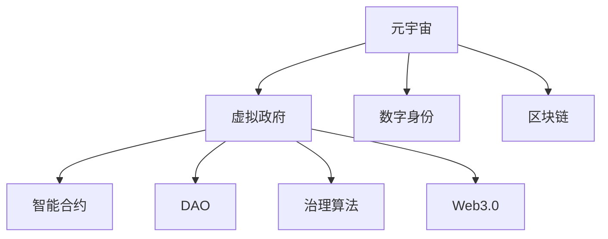

                 

# 元宇宙中的虚拟政府:全球治理的新模式

> 关键词：元宇宙,虚拟政府,全球治理,数字身份,治理算法,区块链,Web3.0

## 1. 背景介绍

### 1.1 问题由来

随着科技的迅猛发展，全球化进程的不断加速，传统的国家主权和法律体系面临巨大挑战。疫情的全球蔓延更是加剧了这一趋势，导致传统的线下政府治理方式无法适应新时代的治理需求。而元宇宙的出现，提供了一个全新的数字化治理平台，为全球治理带来了新的可能性。

在元宇宙中，虚拟政府将成为一种新的治理模式，突破地理、时间、空间的限制，实现跨地域、跨文化、跨行业的协同治理。虚拟政府通过数字化身份验证、区块链技术、智能合约、分布式自治组织（DAO）等手段，构建了一个透明、开放、安全的治理环境，为全球治理提供了新的视角和方案。

### 1.2 问题核心关键点

构建元宇宙中的虚拟政府，需要解决以下核心问题：
- 如何构建数字化身份系统，实现全球身份统一管理？
- 如何利用区块链技术保证治理数据的安全性和不可篡改性？
- 如何设计治理算法，实现高效、公平、透明的决策机制？
- 如何利用智能合约和DAO，实现去中心化的协同治理？
- 如何保障数据隐私和用户权益，构建信任的治理环境？

### 1.3 问题研究意义

元宇宙中的虚拟政府研究具有重要意义：

1. **提升治理效率**：数字化治理平台能够24小时不间断运行，处理海量事务，大幅提升治理效率。
2. **增强公平性**：去中心化的治理机制可以避免单点失效，通过算法决策实现更公平的治理结果。
3. **保障数据安全**：区块链技术可以确保治理数据的不可篡改性和安全性，降低信息泄露风险。
4. **促进国际合作**：虚拟政府跨越地域限制，可以更好地协调国际事务，推动全球治理进程。
5. **推动产业升级**：元宇宙中的虚拟政府将推动数字经济的发展，促进产业数字化转型。

## 2. 核心概念与联系

### 2.1 核心概念概述

为更好地理解元宇宙中的虚拟政府，本节将介绍几个密切相关的核心概念：

- **元宇宙(Metaverse)**：一个基于虚拟现实技术的数字化世界，用户可以通过虚拟身份和虚拟环境进行互动。
- **虚拟政府(Virtual Government)**：利用数字技术构建的政府治理平台，实现数字化身份验证、数字治理、数字服务等职能。
- **数字身份(Digital Identity)**：用户在元宇宙中的唯一标识，包括身份信息、权限认证、隐私保护等。
- **区块链(Blockchain)**：一种去中心化的分布式账本技术，实现数据的安全存储和不可篡改性。
- **智能合约(Smart Contract)**：基于区块链技术自动执行、不可篡改的合约，实现无需信任的协同治理。
- **分布式自治组织(DAO)**：一种去中心化的组织形式，成员共同决策，通过智能合约执行共识。
- **治理算法(Governance Algorithm)**：用于指导和决策的算法，保障治理过程的公平、透明和高效。
- **Web3.0**：下一代互联网，强调去中心化、去中介、开放互联的网络架构。

这些核心概念之间的逻辑关系可以通过以下Mermaid流程图来展示：



这个流程图展示了大语言模型的核心概念及其之间的关系：

1. 元宇宙通过数字身份验证和区块链技术，为虚拟政府提供基础设施。
2. 虚拟政府利用智能合约和DAO，实现去中心化的协同治理。
3. 治理算法指导决策过程，保障治理公平性和透明性。
4. Web3.0提供去中心化的网络架构，支持元宇宙和虚拟政府的构建和运行。

## 3. 核心算法原理 & 具体操作步骤
### 3.1 算法原理概述

元宇宙中的虚拟政府，其核心算法原理可以归纳为以下几个方面：

- **数字身份验证**：利用区块链技术，通过公钥和私钥对用户身份进行验证，确保身份的唯一性和真实性。
- **智能合约执行**：基于区块链技术，编写智能合约，实现无需信任的自动化执行和协同治理。
- **DAO治理模型**：通过DAO，用户共同决策，制定规则，执行共识，实现去中心化的治理结构。
- **治理算法设计**：通过治理算法，实现治理决策的科学化和自动化，提高治理效率和公平性。

### 3.2 算法步骤详解

构建元宇宙中的虚拟政府，一般包括以下几个关键步骤：

**Step 1: 数字身份系统构建**
- 设计数字身份验证系统，包括身份认证、权限管理、隐私保护等功能。
- 利用区块链技术，建立统一的数字身份管理系统，实现全球身份统一管理。

**Step 2: 区块链平台部署**
- 选择合适的区块链平台，部署治理数据存储和交易环境。
- 设计区块链网络，确定共识算法和数据验证机制。

**Step 3: 智能合约设计**
- 根据治理需求，设计智能合约，定义合约条件、执行逻辑和奖惩机制。
- 确保智能合约的透明性和安全性，避免合约漏洞和恶意攻击。

**Step 4: DAO治理模型构建**
- 设计DAO的治理规则和决策流程，确保治理过程的公平性和透明性。
- 利用智能合约实现DAO的决策和执行，确保成员之间的信任和协作。

**Step 5: 治理算法优化**
- 根据治理需求，选择合适的治理算法，如共识算法、奖励机制等。
- 通过数据分析和模型优化，不断提高治理算法的效果和效率。

**Step 6: 系统测试和上线**
- 对系统进行全面测试，确保系统的稳定性和可靠性。
- 上线系统，监控运行状态，收集反馈意见，不断优化改进。

### 3.3 算法优缺点

元宇宙中的虚拟政府算法具有以下优点：
1. **高效透明**：数字化治理平台可以实现24小时不间断运行，快速处理事务。
2. **去中心化**：智能合约和DAO保证了治理过程的透明和公平，减少单点失效的风险。
3. **安全可靠**：区块链技术确保了治理数据的安全性和不可篡改性。
4. **灵活性高**：数字身份和治理算法可以根据需求灵活调整，适应不同的治理场景。

同时，该算法也存在一些局限性：
1. **复杂度高**：系统构建和维护需要较高的技术门槛，复杂度高。
2. **用户信任度**：DAO和智能合约需要用户高度信任，避免信任危机。
3. **法律监管**：虚拟政府面临复杂的法律监管环境，需要跨法域的协调和规范。

尽管存在这些局限性，但就目前而言，元宇宙中的虚拟政府算法仍是大规模治理应用的重要范式。未来相关研究的重点在于如何进一步降低技术门槛，提高系统的可操作性和可维护性，同时兼顾治理的可解释性和安全性等因素。

### 3.4 算法应用领域

元宇宙中的虚拟政府算法已在多个领域得到了广泛应用，例如：

- 数字政府：实现数字化身份验证、电子政务、数字服务等职能。
- 跨境电商：实现跨境支付、物流跟踪、用户投诉处理等功能。
- 供应链管理：实现供应链节点协同、订单跟踪、智能合约执行等功能。
- 智慧医疗：实现患者身份验证、电子病历管理、智能诊疗等功能。
- 智慧城市：实现城市事件监测、公共服务管理、智能交通等功能。

除了上述这些经典应用外，虚拟政府还将被创新性地应用到更多场景中，如智慧农业、智慧能源、智慧旅游等，为各行业带来全新的变革。

## 4. 数学模型和公式 & 详细讲解 & 举例说明

### 4.1 数学模型构建

本节将使用数学语言对元宇宙中的虚拟政府算法进行更加严格的刻画。

记数字身份验证系统为 $ID(\cdot)$，其输入为用户的公钥 $PK$，输出为用户的身份信息 $ID$。智能合约执行系统为 $SC(\cdot)$，其输入为合约代码 $Code$，输出为执行结果 $Result$。DAO治理模型为 $DAO(\cdot)$，其输入为成员投票结果 $Vote$，输出为治理决策 $Decision$。治理算法为 $G(\cdot)$，其输入为治理数据 $Data$，输出为治理策略 $Strategy$。

定义系统整体效用函数为 $U(ID, SC, DAO, G)$，表示虚拟政府的总效用，其中：

$$
U = U_{ID} + U_{SC} + U_{DAO} + U_{G}
$$

其中 $U_{ID}$ 为数字身份验证系统的效用，$U_{SC}$ 为智能合约执行系统的效用，$U_{DAO}$ 为DAO治理模型的效用，$U_{G}$ 为治理算法的效用。

### 4.2 公式推导过程

以下我们以智能合约执行系统为例，推导其效用函数的计算公式。

假设智能合约 $SC$ 的代码段为 $Code$，执行后得到结果 $Result$。定义智能合约的效用函数为 $U_{SC}$，其计算公式为：

$$
U_{SC} = f_{Code}(Result)
$$

其中 $f_{Code}$ 为代码执行函数，用于计算合约执行结果 $Result$ 对合约代码 $Code$ 的效用。

假设 $Result$ 为执行成功的标志，$Code$ 包含关键数据 $Data$ 的计算逻辑，则：

$$
f_{Code}(Result) = \left\{
  \begin{array}{ll}
    +1 & \text{if } Result = \text{Success} \\
    -1 & \text{if } Result = \text{Failure} \\
    0 & \text{otherwise}
  \end{array}
\right.
$$

即，如果执行结果为成功，则效用值为正；如果执行结果为失败，则效用值为负；否则效用值为零。

### 4.3 案例分析与讲解

考虑一个简单的智能合约执行系统 $SC$，用于验证交易双方的身份。假设交易方 $A$ 和 $B$ 分别提交公钥 $PK_A$ 和 $PK_B$，系统执行验证后得到结果 $Result$。此时，系统的效用函数 $U_{SC}$ 计算如下：

$$
U_{SC} = f_{Code}(Result) = \left\{
  \begin{array}{ll}
    +1 & \text{if } Result = \text{Success} \\
    -1 & \text{if } Result = \text{Failure} \\
    0 & \text{otherwise}
  \end{array}
\right.
$$

假设交易方 $A$ 和 $B$ 的公钥均验证通过，系统执行结果为成功，此时 $Result = \text{Success}$，效用值为正：

$$
U_{SC} = f_{Code}(Result) = +1
$$

如果交易方 $A$ 的公钥验证失败，系统执行结果为失败，此时 $Result = \text{Failure}$，效用值为负：

$$
U_{SC} = f_{Code}(Result) = -1
$$

在实际应用中，可以通过调整智能合约的代码逻辑和执行函数，实现更复杂、更灵活的合约功能。例如，在跨境电商中，可以使用智能合约实现跨境支付和物流跟踪，确保交易的透明性和安全性。

## 5. 项目实践：代码实例和详细解释说明
### 5.1 开发环境搭建

在进行虚拟政府项目实践前，我们需要准备好开发环境。以下是使用Python进行Solidity开发的环境配置流程：

1. 安装Node.js：从官网下载并安装Node.js，用于运行智能合约编译器和测试环境。

2. 安装Truffle Suite：使用npm安装Truffle Suite，用于智能合约开发、测试和部署。

3. 配置智能合约模板：下载和使用Truffle提供的智能合约模板，如OpenZeppelin提供的安全模板。

4. 编写和测试智能合约：在Truffle项目中，编写智能合约代码，并在本地测试网络中进行测试。

5. 部署智能合约：将智能合约部署到主网或测试网，完成虚拟政府系统的构建。

完成上述步骤后，即可在区块链平台上开始虚拟政府系统的开发。

### 5.2 源代码详细实现

下面我们以智能合约执行系统为例，给出使用Solidity编写的智能合约代码实现。

首先，定义智能合约的初始状态：

```solidity
pragma solidity ^0.8.0;

contract SC {
    address public owner;
    uint256 public value;
    
    constructor() public {
        owner = msg.sender;
        value = 0;
    }
}
```

然后，定义智能合约的执行函数：

```solidity
function deposit(uint256 _value) public {
    value += _value;
    emit Deposited(_value);
}
```

接着，定义智能合约的支付函数：

```solidity
function pay(uint256 _value) public {
    require(msg.sender == owner, "Not owner");
    require(_value <= value, "Insufficient balance");
    emit Payout(_value);
    value -= _value;
}
```

最后，定义智能合约的事件记录：

```solidity
event Deposited(uint256 _value);
event Payout(uint256 _value);
```

完整代码如下：

```solidity
pragma solidity ^0.8.0;

contract SC {
    address public owner;
    uint256 public value;
    
    constructor() public {
        owner = msg.sender;
        value = 0;
    }
    
    function deposit(uint256 _value) public {
        value += _value;
        emit Deposited(_value);
    }
    
    function pay(uint256 _value) public {
        require(msg.sender == owner, "Not owner");
        require(_value <= value, "Insufficient balance");
        emit Payout(_value);
        value -= _value;
    }
    
    event Deposited(uint256 _value);
    event Payout(uint256 _value);
}
```

### 5.3 代码解读与分析

让我们再详细解读一下关键代码的实现细节：

**SC合约初始化**：
- `constructor` 函数在合约创建时自动执行，将合约的拥有者设为当前账户，并初始化存款值。

**deposit函数**：
- `deposit` 函数用于存储用户提交的存款，每次调用时将存款值加上新的存款，并记录存款事件。

**pay函数**：
- `pay` 函数用于支付存款，需要调用者具有合约拥有者的权限，同时检查余额是否充足，支付成功后记录支付事件并更新余额。

**事件记录**：
- `Deposited` 事件用于记录存款事件，触发时向合约所有者和所有订阅者广播。
- `Payout` 事件用于记录支付事件，触发时向合约所有者和所有订阅者广播。

**测试环境搭建**：
- 使用Truffle测试框架，编写测试用例，测试智能合约的功能和安全性。
- 在本地测试网络中运行测试，验证合约的正确性和稳定性。

**部署和调用**：
- 将智能合约部署到主网或测试网，确保合约的可访问性和安全性。
- 使用Web3.js等工具在前端进行智能合约的调用，验证合约的执行结果。

以上代码和步骤展示了使用Solidity编写智能合约的基本流程，实现了一个简单的智能合约执行系统。

## 6. 实际应用场景
### 6.1 智能政府服务

基于区块链和智能合约的虚拟政府系统，可以构建全新的智能政府服务。例如，通过智能合约实现电子政务服务，用户可以通过数字身份验证进入系统，获取各类电子政务服务，如在线申请、电子支付、电子证书等。

在智能政府服务中，虚拟政府将提供24小时不间断的在线服务，提升政府的治理效率和服务质量。同时，通过智能合约的透明性和去中心化特性，确保服务过程的公平性和透明度，降低腐败和滥用职权的风险。

### 6.2 跨境贸易服务

虚拟政府系统可以应用于跨境贸易领域，通过智能合约实现跨境支付、物流跟踪、用户投诉处理等功能。例如，通过智能合约记录交易订单、支付记录和物流状态，确保交易的透明性和可追溯性。

在跨境贸易服务中，虚拟政府将打破地域和文化的限制，实现跨国跨文化的协同治理。通过智能合约和DAO，各方共同制定贸易规则，执行交易决策，确保贸易过程的公正性和稳定性。

### 6.3 供应链金融服务

虚拟政府系统可以应用于供应链金融领域，通过智能合约实现供应链节点协同、订单跟踪、智能合约执行等功能。例如，通过智能合约记录供应链订单、物流状态和支付记录，确保供应链的透明性和可追溯性。

在供应链金融服务中，虚拟政府将打破传统金融的边界，实现跨组织跨行业的协同治理。通过智能合约和DAO，各方共同制定金融规则，执行金融决策，确保供应链的稳定性。

### 6.4 未来应用展望

随着元宇宙和虚拟政府技术的不断进步，虚拟政府将在更多领域得到应用，为全球治理带来新的可能性。

在智慧医疗领域，虚拟政府可以实现患者身份验证、电子病历管理、智能诊疗等功能，提升医疗服务的效率和质量。

在智慧教育领域，虚拟政府可以实现在线教育、考试管理、学术交流等功能，推动教育公平和资源共享。

在智慧城市治理中，虚拟政府可以实现城市事件监测、公共服务管理、智能交通等功能，提升城市管理的智能化水平。

此外，在金融、能源、农业等众多领域，虚拟政府也将被创新性地应用，推动各行业的数字化转型和智能化发展。

## 7. 工具和资源推荐
### 7.1 学习资源推荐

为了帮助开发者系统掌握虚拟政府的技术基础和实践技巧，这里推荐一些优质的学习资源：

1. 《以太坊智能合约编程》系列书籍：系统介绍了智能合约的开发、测试和部署流程，适合初学者入门。
2. OpenZeppelin智能合约安全指南：提供智能合约的安全设计建议和最佳实践，帮助开发者避免常见的安全漏洞。
3. Truffle官方文档：Truffle智能合约开发平台的详细文档，涵盖智能合约的编写、测试、部署和调试。
4. Solidity官方文档：Solidity编程语言的官方文档，提供了详细的语法和标准库。
5. Utopia智能合约框架：提供了丰富的智能合约组件和模板，帮助开发者快速构建安全、高效的智能合约。

通过对这些资源的学习实践，相信你一定能够快速掌握虚拟政府的核心技术，并用于解决实际的治理问题。

### 7.2 开发工具推荐

高效的开发离不开优秀的工具支持。以下是几款用于虚拟政府开发的常用工具：

1. Ethereum：基于区块链技术的去中心化应用平台，支持智能合约的部署和执行。
2. Truffle Suite：智能合约开发、测试和部署平台，提供丰富的开发工具和插件。
3. Remix IDE：Web3.0开发平台，支持Solidity编写和调试，适合初学者使用。
4. Web3.js：JavaScript库，用于Web3.0开发，支持智能合约的调用和操作。
5. MetaMask：Web3.0钱包和开发环境，支持智能合约的交互和调试。

合理利用这些工具，可以显著提升虚拟政府的开发效率，加快创新迭代的步伐。

### 7.3 相关论文推荐

虚拟政府技术的研究源于学界的持续探索。以下是几篇奠基性的相关论文，推荐阅读：

1. "Blockchain and Digital Governance"：探讨区块链技术在政府治理中的应用，提出了基于区块链的数字身份验证和智能合约模型。
2. "Smart Contracts for Secure Digital Governance"：介绍智能合约在政府治理中的应用，分析了智能合约的安全性和可操作性。
3. "Decentralized Autonomous Organizations in Government"：探讨DAO在政府治理中的应用，分析了DAO的治理机制和优势。
4. "Digital Identity and Security in the New Normal"：讨论数字身份在元宇宙中的重要性，分析了数字身份验证的实现方法和安全性。
5. "Governance Algorithms for Digital Government"：研究治理算法在政府治理中的应用，提出了基于算法和数据的治理模型。

这些论文代表了大语言模型微调技术的发展脉络。通过学习这些前沿成果，可以帮助研究者把握学科前进方向，激发更多的创新灵感。

## 8. 总结：未来发展趋势与挑战

### 8.1 总结

本文对元宇宙中的虚拟政府进行了全面系统的介绍。首先阐述了虚拟政府的背景和意义，明确了虚拟政府在提升治理效率、保障数据安全、促进国际合作等方面的独特价值。其次，从原理到实践，详细讲解了虚拟政府的数学模型和算法实现，给出了虚拟政府系统开发的完整代码实例。同时，本文还广泛探讨了虚拟政府在智能政府、跨境贸易、供应链金融等众多领域的应用前景，展示了虚拟政府技术的巨大潜力。

通过本文的系统梳理，可以看到，元宇宙中的虚拟政府研究正在成为全球治理的新趋势，极大拓展了政府治理的方式和手段，为数字化治理提供了新的范式。未来，伴随元宇宙和虚拟政府技术的不断发展，数字治理将逐步取代传统的线下治理方式，实现跨地域、跨文化、跨行业的协同治理，推动全球治理的现代化进程。

### 8.2 未来发展趋势

展望未来，虚拟政府技术将呈现以下几个发展趋势：

1. **全面数字化**：虚拟政府将覆盖政府治理的各个环节，实现数字化身份验证、数字治理、数字服务等职能，推动政府治理的全方位数字化转型。
2. **去中心化治理**：智能合约和DAO将逐步取代传统的中心化治理模式，实现去中心化、去中介的协同治理。
3. **区块链技术应用**：区块链技术将广泛应用在虚拟政府中，确保治理数据的安全性和透明性。
4. **Web3.0发展**：Web3.0技术将推动虚拟政府的进一步发展，实现更高效、更公平、更开放的治理机制。
5. **国际协同治理**：虚拟政府将推动国际协同治理，促进全球治理的公平性和合作性。

以上趋势凸显了虚拟政府技术的广阔前景。这些方向的探索发展，必将进一步提升虚拟政府的治理能力和应用范围，为构建智能、公平、透明的治理环境铺平道路。

### 8.3 面临的挑战

尽管虚拟政府技术已经取得了瞩目成就，但在迈向更加智能化、普适化应用的过程中，它仍面临着诸多挑战：

1. **技术复杂性**：虚拟政府系统的构建和维护需要高度的技术门槛，复杂度高。
2. **用户信任度**：DAO和智能合约需要用户高度信任，避免信任危机。
3. **法律监管**：虚拟政府面临复杂的法律监管环境，需要跨法域的协调和规范。
4. **数据隐私**：虚拟政府需要平衡数据隐私和公共治理的需求，确保数据的安全性和可追溯性。
5. **安全漏洞**：智能合约和区块链技术存在潜在的安全漏洞，需要持续的技术改进和完善。

尽管存在这些挑战，但通过不断的技术创新和法律规范，相信虚拟政府将逐步克服这些障碍，实现更加高效、公平、透明的全球治理。

### 8.4 研究展望

面对虚拟政府面临的种种挑战，未来的研究需要在以下几个方面寻求新的突破：

1. **提高技术可操作性**：开发更易于使用的智能合约开发工具和平台，降低技术门槛，推动虚拟政府技术的普及和应用。
2. **增强用户信任度**：通过增强合约透明度和用户教育，提高用户对DAO和智能合约的信任度。
3. **优化法律环境**：推动虚拟政府技术的法律规范和标准制定，确保技术应用的合法性和安全性。
4. **加强数据隐私保护**：开发隐私保护技术，确保数据隐私和安全，建立数据使用的规则和规范。
5. **提升安全性和鲁棒性**：研究安全漏洞的检测和修复技术，增强智能合约和区块链的安全性和鲁棒性。

这些研究方向的探索，必将引领虚拟政府技术的不断演进，为全球治理带来新的变革和突破。面向未来，虚拟政府需要与其他人工智能技术进行更深入的融合，如自然语言处理、智能推荐等，多路径协同发力，共同推动全球治理的现代化进程。

## 9. 附录：常见问题与解答

**Q1：虚拟政府如何实现数字身份验证？**

A: 虚拟政府通过区块链技术实现数字身份验证。具体流程如下：
1. 用户提交公钥 $PK$，智能合约验证公钥的有效性。
2. 智能合约根据公钥计算出用户的身份信息 $ID$，并将 $ID$ 存储在区块链中。
3. 用户后续登录时，智能合约验证公钥和 $ID$，判断身份是否合法。
4. 身份验证通过后，用户可以进行相关操作，如访问电子政务服务、支付交易等。

**Q2：智能合约如何实现公平透明的治理？**

A: 智能合约通过公开透明的代码和执行逻辑，实现公平透明的治理。具体流程如下：
1. 用户提交投票结果 $Vote$，智能合约记录投票结果。
2. 智能合约根据投票结果计算出治理决策 $Decision$。
3. 智能合约将治理决策广播到所有成员，确保决策过程的透明性和公开性。
4. 智能合约自动执行决策，确保治理过程的可信性和可追溯性。

**Q3：虚拟政府如何保障数据隐私？**

A: 虚拟政府通过区块链技术保障数据隐私。具体流程如下：
1. 用户提交数据 $Data$，智能合约验证数据的合法性和完整性。
2. 智能合约将数据存储在区块链中，确保数据的不可篡改性和安全性。
3. 用户可以查询数据，但只能看到经过加密和访问权限控制的数据。
4. 智能合约定期对数据进行备份和验证，确保数据的完整性和可靠性。

**Q4：虚拟政府如何应对法律监管？**

A: 虚拟政府需要遵循各地的法律法规，实现跨法域的协同治理。具体流程如下：
1. 虚拟政府设计合规性检测机制，确保治理过程符合各国法律。
2. 虚拟政府提供法律咨询和合规性报告，帮助用户了解法律法规。
3. 虚拟政府协同政府机构，制定合规性标准和规范，确保治理的合法性和公平性。
4. 虚拟政府定期对法律合规性进行审查和评估，确保治理过程的合法性和公正性。

以上问题解答，展示了虚拟政府的核心技术和应用流程，帮助读者更好地理解和应用虚拟政府技术。

---

作者：禅与计算机程序设计艺术 / Zen and the Art of Computer Programming

