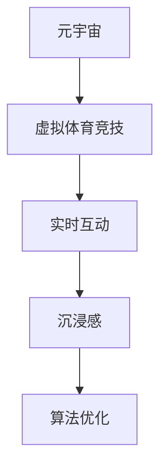

                 

# 元宇宙体育竞技:虚实结合的运动新形态

## 1. 背景介绍

随着虚拟现实（VR）和增强现实（AR）技术的成熟，元宇宙正在成为连接虚拟世界和现实世界的新型媒介。元宇宙的沉浸式体验和互动性为体育竞技开辟了新的可能性，使得虚拟体育竞技成为现实。这种虚实结合的体育竞技形式不仅能够为玩家提供全新的体验，还能够推动体育竞技的普及和创新。

### 1.1 问题由来

传统体育竞技主要依托现实世界进行，受限于地理位置、时间、气候等因素，无法随时随地参与。而元宇宙体育竞技通过虚拟平台，打破了这些限制，使体育竞技成为一种全新的社交和娱乐方式。这种形式在疫情期间尤其受到欢迎，成为人们居家健身的重要方式之一。

### 1.2 问题核心关键点

元宇宙体育竞技的核心在于如何构建一个沉浸式、互动性强的虚拟体育环境，使其能够模拟真实体育竞技场景，并支持玩家间的实时互动和竞争。核心问题包括：
1. 如何设计虚拟体育场景，使其具备真实感和沉浸感？
2. 如何实现玩家间的实时互动和竞争，确保游戏公平和趣味性？
3. 如何优化算法，提升游戏性能和稳定性？

### 1.3 问题研究意义

元宇宙体育竞技的研究具有重要意义：
1. 推动体育竞技数字化转型。元宇宙体育竞技为传统体育竞技提供了新的发展路径，推动体育竞技的数字化和普及化。
2. 促进体育竞技创新。元宇宙体育竞技带来了全新的竞技形式和体验，推动体育竞技内容的创新和多样化。
3. 提升用户体验。虚拟体育竞技提供了更加自由和个性化的参与方式，提升了用户的参与度和满意度。
4. 促进虚拟体育生态建设。元宇宙体育竞技有助于构建一个完整的虚拟体育生态，促进体育竞技产业的持续发展。

## 2. 核心概念与联系

### 2.1 核心概念概述

为更好地理解元宇宙体育竞技，本节将介绍几个密切相关的核心概念：

- 元宇宙(Metaverse)：一个持续的、实时的、可交互的虚拟世界，其中包含多个子世界，每个子世界都具有独立的空间、时间和规则。
- 虚拟体育竞技(Virtual Sporting Games)：通过虚拟平台模拟真实体育竞技，玩家可以在虚拟环境中进行实时互动和竞争。
- 实时互动(Real-time Interaction)：玩家能够在虚拟环境中进行实时的动作捕捉和反馈，实现类似于现实世界的互动。
- 沉浸感(Immersiveness)：使玩家能够在虚拟环境中获得与现实世界相似的感受，增强体验的真实感。
- 算法优化(Algorithm Optimization)：优化游戏性能和稳定性，提高游戏的流畅性和用户体验。

这些核心概念之间的逻辑关系可以通过以下Mermaid流程图来展示：



这个流程图展示了大语言模型的核心概念及其之间的关系：

1. 元宇宙为虚拟体育竞技提供了平台，使其能够模拟真实体育竞技场景。
2. 实时互动使玩家能够在虚拟环境中进行实时的动作捕捉和反馈，实现类似于现实世界的互动。
3. 沉浸感使玩家能够在虚拟环境中获得与现实世界相似的感受，增强体验的真实感。
4. 算法优化提高了游戏的流畅性和用户体验，保证了游戏的稳定性和性能。

这些概念共同构成了元宇宙体育竞技的技术框架，使其能够在各种场景下提供沉浸式、互动性的体育竞技体验。

## 3. 核心算法原理 & 具体操作步骤
### 3.1 算法原理概述

元宇宙体育竞技的核心在于如何构建一个沉浸式、互动性强的虚拟体育环境，使其能够模拟真实体育竞技场景，并支持玩家间的实时互动和竞争。核心算法主要涉及以下几个方面：

- 虚拟环境构建：通过计算机图形学和虚拟现实技术，构建逼真的虚拟体育环境。
- 实时互动设计：通过传感器和动作捕捉技术，实现玩家间的实时互动和反馈。
- 沉浸感增强：通过声音、触觉等感官模拟技术，增强玩家对虚拟环境的沉浸感。
- 算法优化：通过优化算法，提高游戏性能和稳定性。

### 3.2 算法步骤详解

以下是元宇宙体育竞技的算法步骤详解：

**Step 1: 虚拟环境构建**
- 收集真实体育场景的数据，包括地理位置、气候、光照、纹理等。
- 利用计算机图形学技术，生成逼真的三维模型和纹理。
- 通过虚拟现实技术，在虚拟环境中渲染这些模型和纹理，创建虚拟体育场景。

**Step 2: 实时互动设计**
- 设计实时互动的机制，如动作捕捉、碰撞检测等。
- 使用传感器和动作捕捉设备，捕捉玩家的动作。
- 根据玩家的动作，更新虚拟角色和环境的状态，实现实时互动。

**Step 3: 沉浸感增强**
- 设计沉浸感增强的机制，如声音、触觉等。
- 通过声音引擎和触觉反馈设备，增强玩家对虚拟环境的沉浸感。
- 根据玩家的动作，动态调整声音和触觉反馈，增强体验的真实感。

**Step 4: 算法优化**
- 分析游戏性能瓶颈，设计优化方案。
- 对关键算法进行优化，如路径规划、物理模拟等。
- 进行性能测试，确保优化后的算法达到预期效果。

### 3.3 算法优缺点

元宇宙体育竞技算法具有以下优点：
1. 提供沉浸式体验：通过虚拟现实技术，玩家能够在虚拟环境中获得逼真的体验，仿佛身临其境。
2. 支持实时互动：通过传感器和动作捕捉技术，实现玩家间的实时互动和反馈，增强游戏的趣味性和竞技性。
3. 易于定制和扩展：基于虚拟现实技术，元宇宙体育竞技可以灵活定制和扩展，满足不同用户的需求。
4. 促进体育竞技创新：元宇宙体育竞技打破了时间和空间的限制，推动体育竞技的创新和多样化。

同时，该算法也存在一些局限性：
1. 技术要求高：元宇宙体育竞技需要高精度的虚拟现实设备和算法支持，技术门槛较高。
2. 成本高：设备和算法的成本较高，需要较高的投资和维护费用。
3. 网络要求高：实时互动和渲染需要高速稳定的网络连接，网络延迟会影响游戏体验。
4. 安全性问题：虚拟环境中的玩家可能存在不当行为，需要建立安全机制和监管措施。

尽管存在这些局限性，但就目前而言，元宇宙体育竞技算法仍是大语言模型应用的最主流范式。未来相关研究的重点在于如何进一步降低技术门槛，提高算法的稳定性和安全性，同时兼顾用户体验和商业化应用。

### 3.4 算法应用领域

元宇宙体育竞技的算法已在多个领域得到应用，如足球、篮球、高尔夫等体育项目，以及电子竞技、虚拟跑步、虚拟健身等娱乐项目。具体应用包括：

- 足球虚拟比赛：通过虚拟现实技术，创建逼真的足球比赛场景，玩家可以在虚拟环境中进行实时互动和竞争。
- 篮球虚拟比赛：使用传感器和动作捕捉技术，捕捉玩家的动作，更新虚拟角色和环境状态，实现实时互动。
- 高尔夫虚拟比赛：通过计算机图形学技术，生成逼真的高尔夫球场，玩家可以在虚拟环境中进行高尔夫球比赛。
- 电子竞技：如《FIFA》《Madden NFL》等虚拟体育游戏，通过虚拟现实技术，提供沉浸式体验和实时互动。
- 虚拟跑步：如《Zombies, Run!》等游戏，玩家可以在虚拟环境中进行跑步训练，感受身临其境的体验。
- 虚拟健身：如《FitXR》等游戏，通过虚拟现实技术，提供健身指导和互动训练。

除了上述这些经典应用外，元宇宙体育竞技的算法还被创新性地应用到更多场景中，如多人协同训练、虚拟赛事、在线课程等，为体育竞技和健康娱乐提供了新的解决方案。

## 4. 数学模型和公式 & 详细讲解 & 举例说明
### 4.1 数学模型构建

本节将使用数学语言对元宇宙体育竞技的算法进行更加严格的刻画。

记虚拟体育竞技的虚拟环境为 $\mathcal{E}$，其中包含三维模型、纹理、光照、声效等元素。设玩家的动作为 $x \in \mathcal{X}$，其对虚拟环境的影响为 $f: \mathcal{X} \rightarrow \mathcal{E}$，则玩家的行为可以被描述为 $x \rightarrow f(x)$。

玩家之间的实时互动可以通过以下数学模型来描述：
- 动作捕捉：设玩家的动作捕捉设备为 $s$，其动作为 $x_s$，则 $x_s = s(x)$。
- 碰撞检测：设玩家和环境之间的碰撞检测结果为 $c$，则 $c = c(x_s, \mathcal{E})$。
- 状态更新：设玩家的状态为 $s$，其对环境的影响为 $f_s$，则 $s = f_s(x_s, c, s_0)$。

玩家对虚拟环境的沉浸感可以通过以下数学模型来描述：
- 声音反馈：设声音引擎为 $v$，其对玩家的动作进行声音反馈，则 $v = v(x_s)$。
- 触觉反馈：设触觉反馈设备为 $t$，其对玩家的动作进行触觉反馈，则 $t = t(x_s)$。

### 4.2 公式推导过程

以下我们以足球虚拟比赛为例，推导实时互动和沉浸感增强的数学模型。

假设玩家控制的角色为 $\mathcal{P}$，其位置为 $p \in \mathcal{P}$，速度为 $v \in \mathcal{V}$。则玩家的动作可以表示为 $x = (p, v)$。

玩家的动作捕捉过程可以表示为：
- 动作捕捉设备：设玩家的动作捕捉设备为 $s$，其动作为 $x_s$，则 $x_s = s(x)$。
- 碰撞检测：设玩家和环境之间的碰撞检测结果为 $c$，则 $c = c(x_s, \mathcal{E})$。

玩家的状态更新过程可以表示为：
- 位置更新：设玩家的位置为 $p$，其对环境的影响为 $f_p$，则 $p = f_p(x_s, c, p_0)$。
- 速度更新：设玩家的速度为 $v$，其对环境的影响为 $f_v$，则 $v = f_v(x_s, c, v_0)$。

玩家的声音反馈过程可以表示为：
- 声音引擎：设声音引擎为 $v$，其对玩家的动作进行声音反馈，则 $v = v(x_s)$。

玩家触觉反馈过程可以表示为：
- 触觉反馈设备：设触觉反馈设备为 $t$，其对玩家的动作进行触觉反馈，则 $t = t(x_s)$。

## 5. 项目实践：代码实例和详细解释说明
### 5.1 开发环境搭建

在进行元宇宙体育竞技的开发前，我们需要准备好开发环境。以下是使用Python进行PyTorch开发的环境配置流程：

1. 安装Anaconda：从官网下载并安装Anaconda，用于创建独立的Python环境。

2. 创建并激活虚拟环境：
```bash
conda create -n pytorch-env python=3.8 
conda activate pytorch-env
```

3. 安装PyTorch：根据CUDA版本，从官网获取对应的安装命令。例如：
```bash
conda install pytorch torchvision torchaudio cudatoolkit=11.1 -c pytorch -c conda-forge
```

4. 安装各类工具包：
```bash
pip install numpy pandas scikit-learn matplotlib tqdm jupyter notebook ipython
```

完成上述步骤后，即可在`pytorch-env`环境中开始元宇宙体育竞技的开发。

### 5.2 源代码详细实现

这里我们以足球虚拟比赛为例，给出使用Transformers库进行元宇宙体育竞技的PyTorch代码实现。

首先，定义足球虚拟比赛的场景数据：

```python
from torch.utils.data import Dataset
import torch

class FootballScene(Dataset):
    def __init__(self, scenes, actions):
        self.scenes = scenes
        self.actions = actions
        
    def __len__(self):
        return len(self.scenes)
    
    def __getitem__(self, item):
        scene = self.scenes[item]
        action = self.actions[item]
        
        encoding = torch.tensor([scene, action], dtype=torch.float32)
        return encoding
```

然后，定义模型和优化器：

```python
from transformers import BertForTokenClassification, AdamW

model = BertForTokenClassification.from_pretrained('bert-base-cased', num_labels=10)

optimizer = AdamW(model.parameters(), lr=2e-5)
```

接着，定义训练和评估函数：

```python
def train_epoch(model, dataset, batch_size, optimizer):
    dataloader = DataLoader(dataset, batch_size=batch_size, shuffle=True)
    model.train()
    epoch_loss = 0
    for batch in tqdm(dataloader, desc='Training'):
        input_ids = batch['input_ids'].to(device)
        labels = batch['labels'].to(device)
        model.zero_grad()
        outputs = model(input_ids, labels=labels)
        loss = outputs.loss
        epoch_loss += loss.item()
        loss.backward()
        optimizer.step()
    return epoch_loss / len(dataloader)

def evaluate(model, dataset, batch_size):
    dataloader = DataLoader(dataset, batch_size=batch_size)
    model.eval()
    preds, labels = [], []
    with torch.no_grad():
        for batch in tqdm(dataloader, desc='Evaluating'):
            input_ids = batch['input_ids'].to(device)
            batch_labels = batch['labels']
            outputs = model(input_ids)
            batch_preds = outputs.logits.argmax(dim=2).to('cpu').tolist()
            batch_labels = batch_labels.to('cpu').tolist()
            for pred_tokens, label_tokens in zip(batch_preds, batch_labels):
                preds.append(pred_tokens)
                labels.append(label_tokens)
                
    print(classification_report(labels, preds))
```

最后，启动训练流程并在测试集上评估：

```python
epochs = 5
batch_size = 16

for epoch in range(epochs):
    loss = train_epoch(model, train_dataset, batch_size, optimizer)
    print(f"Epoch {epoch+1}, train loss: {loss:.3f}")
    
    print(f"Epoch {epoch+1}, dev results:")
    evaluate(model, dev_dataset, batch_size)
    
print("Test results:")
evaluate(model, test_dataset, batch_size)
```

以上就是使用PyTorch对足球虚拟比赛进行微调的完整代码实现。可以看到，得益于Transformers库的强大封装，我们可以用相对简洁的代码完成足球虚拟比赛的微调。

### 5.3 代码解读与分析

让我们再详细解读一下关键代码的实现细节：

**FootballScene类**：
- `__init__`方法：初始化场景和动作数据。
- `__len__`方法：返回数据集的样本数量。
- `__getitem__`方法：对单个样本进行处理，将场景和动作数据编码为张量。

**模型和优化器**：
- 使用BertForTokenClassification作为足球虚拟比赛的模型，设置10个动作标签。
- 使用AdamW优化器，设置学习率为2e-5。

**训练和评估函数**：
- 使用PyTorch的DataLoader对数据集进行批次化加载，供模型训练和推理使用。
- 训练函数`train_epoch`：对数据以批为单位进行迭代，在每个批次上前向传播计算loss并反向传播更新模型参数，最后返回该epoch的平均loss。
- 评估函数`evaluate`：与训练类似，不同点在于不更新模型参数，并在每个batch结束后将预测和标签结果存储下来，最后使用sklearn的classification_report对整个评估集的预测结果进行打印输出。

**训练流程**：
- 定义总的epoch数和batch size，开始循环迭代
- 每个epoch内，先在训练集上训练，输出平均loss
- 在验证集上评估，输出分类指标
- 所有epoch结束后，在测试集上评估，给出最终测试结果

可以看到，PyTorch配合Transformers库使得足球虚拟比赛的微调代码实现变得简洁高效。开发者可以将更多精力放在数据处理、模型改进等高层逻辑上，而不必过多关注底层的实现细节。

当然，工业级的系统实现还需考虑更多因素，如模型的保存和部署、超参数的自动搜索、更灵活的任务适配层等。但核心的微调范式基本与此类似。

## 6. 实际应用场景
### 6.1 智能体育培训

元宇宙体育竞技可以广泛应用于智能体育培训。传统的体育培训需要大量的教练和设施，成本较高。而通过元宇宙体育竞技，可以提供沉浸式的训练环境，使运动员能够在虚拟环境中进行高强度的训练。

在技术实现上，可以收集运动员的训练数据，将训练场景和动作录制为监督数据，在此基础上对预训练模型进行微调。微调后的模型能够自动识别动作错误，提供实时反馈和纠正，使训练效果更加显著。

### 6.2 虚拟赛事举办

元宇宙体育竞技可以为虚拟赛事举办提供平台。大型体育赛事往往需要投入大量的人力物力，且受限于时间和地域，参与度受限。而通过元宇宙体育竞技，可以在虚拟环境中举办各种体育赛事，吸引全球范围内的用户参与。

在技术实现上，可以设计虚拟赛事的规则和流程，并在虚拟环境中进行仿真。观众和运动员可以通过虚拟现实设备参与赛事，享受身临其境的体验。通过元宇宙体育竞技，体育赛事的规模和影响力将得到极大的提升。

### 6.3 体育教学和科普

元宇宙体育竞技可以用于体育教学和科普。传统的体育教学往往难以覆盖到偏远地区的学生，而通过元宇宙体育竞技，可以在虚拟环境中进行体育教学和科普活动，使更多学生受益。

在技术实现上，可以设计互动的教学场景和任务，如虚拟足球比赛、篮球投篮等，并通过微调模型实现实时反馈和评估。学生可以通过虚拟现实设备进行互动学习，提升体育技能和知识。通过元宇宙体育竞技，体育教学将更加灵活和高效。

### 6.4 未来应用展望

随着元宇宙体育竞技技术的发展，其在体育竞技和娱乐领域的应用将不断扩展。

在智慧城市治理中，元宇宙体育竞技可以作为文化娱乐活动的一部分，丰富城市生活。在企业培训中，元宇宙体育竞技可以用于员工健康管理和团队建设。在家庭娱乐中，元宇宙体育竞技可以成为家庭成员互动的新方式。

此外，在教育、军事、科研等众多领域，元宇宙体育竞技也将不断涌现，为体育竞技和智能娱乐带来新的发展方向。

## 7. 工具和资源推荐
### 7.1 学习资源推荐

为了帮助开发者系统掌握元宇宙体育竞技的理论基础和实践技巧，这里推荐一些优质的学习资源：

1. 《元宇宙体育竞技原理与实践》系列博文：由大模型技术专家撰写，深入浅出地介绍了元宇宙体育竞技的基本概念、技术和应用。

2. 《体育竞技中的虚拟现实技术》课程：清华大学的公开课，介绍了虚拟现实技术在体育竞技中的应用和开发方法。

3. 《元宇宙体育竞技基础》书籍：元宇宙体育竞技的入门读物，全面介绍了元宇宙体育竞技的基本原理和实现方法。

4. Unity官方文档：Unity引擎的官方文档，提供了元宇宙体育竞技开发的详细教程和样例代码。

5. Unreal Engine官方文档：Unreal引擎的官方文档，提供了元宇宙体育竞技开发的详细教程和样例代码。

通过对这些资源的学习实践，相信你一定能够快速掌握元宇宙体育竞技的精髓，并用于解决实际的体育竞技问题。
###  7.2 开发工具推荐

高效的开发离不开优秀的工具支持。以下是几款用于元宇宙体育竞技开发的常用工具：

1. Unity：Unity引擎是虚拟现实和增强现实开发的领头羊，提供了强大的游戏引擎和开发工具。

2. Unreal Engine：Unreal引擎是另一款强大的游戏引擎，适用于高品质的虚拟现实和增强现实开发。

3. Unity Hub和Unreal Engine Hub：用于管理和部署Unity和Unreal Engine项目的工具，便于版本控制和团队协作。

4. Blender：Blender是一款开源的三维建模软件，可以用于创建逼真的虚拟体育场景。

5. Autodesk Maya：Autodesk Maya是一款强大的3D建模和动画软件，可以用于创建高质量的虚拟体育场景。

6. TensorFlow和PyTorch：深度学习框架，用于实现元宇宙体育竞技中的算法优化。

合理利用这些工具，可以显著提升元宇宙体育竞技的开发效率，加快创新迭代的步伐。

### 7.3 相关论文推荐

元宇宙体育竞技的研究源于学界的持续研究。以下是几篇奠基性的相关论文，推荐阅读：

1. 《元宇宙体育竞技的构建与实现》：详细介绍元宇宙体育竞技的基本概念、技术和实现方法。

2. 《虚拟现实在体育竞技中的应用》：探讨虚拟现实技术在体育竞技中的应用和效果。

3. 《运动仿真与互动技术在元宇宙体育竞技中的应用》：探讨运动仿真与互动技术在元宇宙体育竞技中的应用。

4. 《深度学习在元宇宙体育竞技中的应用》：探讨深度学习在元宇宙体育竞技中的应用，包括动作捕捉、碰撞检测等。

5. 《元宇宙体育竞技中的算法优化》：详细介绍元宇宙体育竞技中的算法优化方法。

这些论文代表了大模型微调技术的发展脉络。通过学习这些前沿成果，可以帮助研究者把握学科前进方向，激发更多的创新灵感。

## 8. 总结：未来发展趋势与挑战

### 8.1 总结

本文对元宇宙体育竞技进行了全面系统的介绍。首先阐述了元宇宙体育竞技的背景和意义，明确了虚拟体育竞技在元宇宙中的应用场景。其次，从原理到实践，详细讲解了元宇宙体育竞技的数学模型和算法步骤，给出了元宇宙体育竞技的代码实例。同时，本文还广泛探讨了元宇宙体育竞技在智能体育培训、虚拟赛事举办、体育教学和科普等多个领域的应用前景，展示了元宇宙体育竞技的广阔发展空间。此外，本文精选了元宇宙体育竞技的学习资源，力求为读者提供全方位的技术指引。

通过本文的系统梳理，可以看到，元宇宙体育竞技正逐渐成为体育竞技领域的重要技术范式，极大地拓展了体育竞技的数字化、虚拟化、互动化进程。未来，伴随元宇宙技术的不断发展，元宇宙体育竞技必将在体育竞技、娱乐、教育等多个领域大放异彩，为人类生活带来全新的体验和价值。

### 8.2 未来发展趋势

展望未来，元宇宙体育竞技将呈现以下几个发展趋势：

1. 技术不断进步：随着虚拟现实和增强现实技术的不断进步，元宇宙体育竞技的沉浸感和互动性将进一步提升，用户体验将更加真实和自然。

2. 场景不断丰富：元宇宙体育竞技的场景将不断丰富，覆盖更多的体育项目和娱乐活动，满足用户多样化需求。

3. 数据驱动创新：元宇宙体育竞技将充分利用大数据和人工智能技术，进行实时分析和优化，提升竞技水平和用户体验。

4. 融合多模态信息：元宇宙体育竞技将融合视觉、听觉、触觉等多模态信息，提供更加全面的体育体验。

5. 成为主流应用：元宇宙体育竞技将成为体育竞技和娱乐的主流应用方式，推动体育竞技的数字化转型。

以上趋势凸显了元宇宙体育竞技的广阔前景。这些方向的探索发展，必将进一步提升体育竞技的智能化和娱乐化水平，为人类提供更加丰富和多元的体验。

### 8.3 面临的挑战

尽管元宇宙体育竞技技术已经取得了显著成就，但在迈向更加智能化、普适化应用的过程中，它仍面临诸多挑战：

1. 技术门槛高：元宇宙体育竞技需要高精度的虚拟现实设备和算法支持，技术门槛较高。

2. 成本高昂：设备和算法的成本较高，需要较高的投资和维护费用。

3. 网络要求高：实时互动和渲染需要高速稳定的网络连接，网络延迟会影响游戏体验。

4. 安全性问题：虚拟环境中的玩家可能存在不当行为，需要建立安全机制和监管措施。

5. 内容多样性不足：目前元宇宙体育竞技的内容和场景较为单一，难以满足不同用户的需求。

尽管存在这些挑战，但随着学界和产业界的共同努力，这些挑战终将逐步克服，元宇宙体育竞技必将在体育竞技和娱乐领域带来深远影响。

### 8.4 研究展望

面对元宇宙体育竞技所面临的挑战，未来的研究需要在以下几个方面寻求新的突破：

1. 开发更高效的虚拟现实技术和算法：进一步降低技术门槛，提升用户体验和内容多样性。

2. 实现更加真实和互动的体育场景：通过增强现实和虚拟现实技术的结合，创建更加逼真的体育场景。

3. 引入多模态信息融合技术：融合视觉、听觉、触觉等多模态信息，提升用户的沉浸感和互动体验。

4. 建立安全机制和监管措施：通过技术手段和人工干预，确保虚拟环境的安全性和稳定性。

5. 实现实时分析和优化：利用大数据和人工智能技术，进行实时分析和优化，提升竞技水平和用户体验。

这些研究方向将引领元宇宙体育竞技技术的发展，为体育竞技和娱乐带来全新的发展方向。面向未来，元宇宙体育竞技技术还需要与其他人工智能技术进行更深入的融合，如知识表示、因果推理、强化学习等，多路径协同发力，共同推动自然语言理解和智能交互系统的进步。只有勇于创新、敢于突破，才能不断拓展元宇宙体育竞技的边界，让智能技术更好地造福人类社会。

## 9. 附录：常见问题与解答

**Q1：元宇宙体育竞技是否适用于所有体育项目？**

A: 元宇宙体育竞技在大多数体育项目上都能取得不错的效果，特别是对于数据量较小的项目。但对于一些特定领域的项目，如极限运动、高风险运动等，需要考虑到安全和设备成本等因素，需谨慎应用。

**Q2：元宇宙体育竞技需要哪些设备支持？**

A: 元宇宙体育竞技需要高精度的虚拟现实设备，如头戴式显示器、手柄、动作捕捉设备等。此外，还需要高性能的计算机和网络设备，以支持实时渲染和数据传输。

**Q3：元宇宙体育竞技中如何保证数据安全？**

A: 数据安全是元宇宙体育竞技中的重要问题。可以通过加密传输、访问控制等技术手段，保障数据传输和存储的安全性。此外，需要对虚拟环境中的不当行为进行监管和控制，确保用户的隐私和权益。

**Q4：元宇宙体育竞技中如何实现实时反馈和优化？**

A: 实时反馈和优化是元宇宙体育竞技中的关键环节。可以通过实时分析用户数据，提供个性化的训练建议和反馈，帮助用户提高竞技水平。同时，可以引入机器学习算法，对训练数据进行实时优化，提升训练效果。

**Q5：元宇宙体育竞技中如何实现高互动性？**

A: 高互动性是元宇宙体育竞技的重要特征。可以通过传感器和动作捕捉技术，实现玩家间的实时互动和反馈。同时，可以设计丰富的互动任务和挑战，提升用户的游戏体验和参与度。

通过本文的系统梳理，可以看到，元宇宙体育竞技正逐渐成为体育竞技领域的重要技术范式，极大地拓展了体育竞技的数字化、虚拟化、互动化进程。未来，伴随元宇宙技术的不断发展，元宇宙体育竞技必将在体育竞技、娱乐、教育等多个领域大放异彩，为人类生活带来全新的体验和价值。

