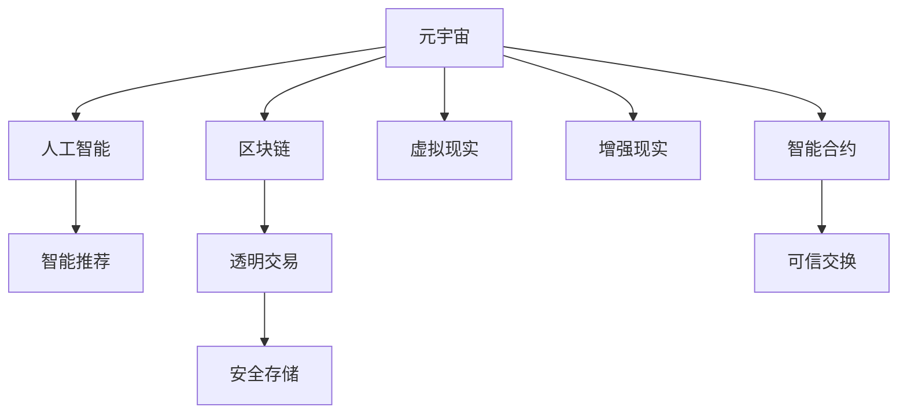

                 

## 1. 背景介绍

### 1.1 问题由来
随着人口老龄化的加剧，养老问题成为全球面临的重要挑战。传统养老保障体系以国家财政支持和社区服务为主，但随着人口结构的变化和健康水平的下降，单纯依赖政府和社会组织的模式已经难以满足老年人的多样化需求。数字化技术的迅猛发展为解决养老问题提供了新的可能性。

### 1.2 问题核心关键点
本文章聚焦于如何利用元宇宙技术构建智能养老保险系统，实现数字化老年生活的经济保障。元宇宙养老保险系统通过智能合约、区块链、虚拟现实等技术手段，构建起一个以数字资产为核心的养老生态系统。该系统旨在为老年人提供多元化的养老服务，提升养老生活的质量，降低社会负担。

### 1.3 问题研究意义
研究元宇宙养老保险系统，对于拓展养老保障方式，提升老年人生活质量，缓解社会养老压力，具有重要意义：
1. **提升生活质量**：通过数字化手段，老年人能够享受到更加丰富、便捷的养老服务，包括虚拟陪伴、远程医疗、社交娱乐等。
2. **降低社会成本**：数字化养老系统能够有效利用社会资源，减少对财政支持的依赖，提高养老资金的利用效率。
3. **促进技术应用**：元宇宙养老保险系统的开发和推广，将推动虚拟现实、区块链、人工智能等前沿技术的普及和应用。

## 2. 核心概念与联系

### 2.1 核心概念概述

为更好地理解元宇宙养老保险系统的构建，本节将介绍几个关键概念：

- **元宇宙(Metaverse)**：一个虚拟的、基于互联网的3D互动空间，通过虚拟现实(VR)、增强现实(AR)等技术，实现用户与虚拟世界的深度互动。
- **智能合约(Smart Contract)**：基于区块链技术，通过代码实现自动化合约条款，无需第三方干预，能够实现透明、可信的资源交换。
- **区块链(Blockchain)**：一种分布式账本技术，通过加密算法和共识机制，实现数据的安全存储和透明交易。
- **虚拟现实(Virtual Reality, VR)**：通过计算机生成3D环境，使用户能够进入虚拟空间，与虚拟对象互动。
- **增强现实(Augmented Reality, AR)**：将虚拟信息叠加在现实世界中，增强用户的视觉体验。
- **人工智能(Artificial Intelligence, AI)**：通过机器学习算法，实现自动化决策和智能推荐。

这些概念之间的逻辑关系可以通过以下Mermaid流程图来展示：



这个流程图展示了几大核心概念及其之间的相互关系：

1. 元宇宙通过虚拟现实、增强现实等技术，提供沉浸式体验。
2. 智能合约和区块链技术实现透明、可信的数据交换。
3. 人工智能通过机器学习算法，实现智能化决策和推荐。
4. 这些技术共同构成了元宇宙养老保险系统的基础架构，为老年人提供便捷、安全的养老服务。

## 3. 核心算法原理 & 具体操作步骤
### 3.1 算法原理概述

元宇宙养老保险系统通过以下核心算法原理，构建起一个智能、高效、安全的养老保障系统：

- **区块链智能合约**：利用区块链技术构建智能合约，实现养老金的发放、领取和管理。智能合约自动执行预设条款，确保养老资金的透明和可信。
- **虚拟现实与增强现实**：利用VR和AR技术，提供虚拟陪伴、远程医疗、社交娱乐等服务，提升老年人的生活质量。
- **人工智能推荐**：通过AI算法，分析老年人的兴趣和行为数据，智能推荐养老服务和产品，提升养老体验。

### 3.2 算法步骤详解

1. **系统设计**：
   - 设计系统的整体架构，包括区块链智能合约、VR/AR服务、AI推荐引擎等组件。
   - 确定智能合约的具体条款，如养老金的发放、领取条件、管理规则等。
   - 选择合适的VR/AR平台和技术，实现沉浸式养老服务。
   - 设计AI推荐算法的模型和流程，确保推荐结果的准确性和个性化。

2. **数据准备**：
   - 收集老年人的基本信息、健康数据、行为数据等，用于身份认证、智能推荐等场景。
   - 构建数据存储和管理机制，确保数据的安全性和隐私保护。

3. **模型训练**：
   - 使用历史数据训练AI推荐模型，根据老年人兴趣和行为数据，预测其需求和偏好。
   - 验证和优化模型，确保推荐结果的准确性和多样性。

4. **系统实现**：
   - 开发智能合约，实现养老金的发放、领取和管理。
   - 实现VR/AR服务，提供虚拟陪伴、远程医疗、社交娱乐等体验。
   - 集成AI推荐引擎，实时推荐养老服务和产品。

5. **系统测试**：
   - 进行系统的功能测试和性能测试，确保系统的稳定性和可靠性。
   - 收集用户体验反馈，持续优化系统功能和用户体验。

### 3.3 算法优缺点

元宇宙养老保险系统的优点包括：
- **便捷性**：老年人可以在虚拟世界中随时随地享受养老服务，无需离开家门。
- **安全性**：智能合约和区块链技术确保养老金和养老服务的透明、可信，降低欺诈风险。
- **个性化**：AI推荐算法根据老年人的兴趣和行为数据，提供个性化的养老服务和产品。

缺点包括：
- **技术门槛**：系统开发和维护需要较高的技术门槛，对技术人才的需求较大。
- **初期投资大**：系统建设需要大量的前期投资，包括硬件设备、软件开发、数据收集等。
- **隐私保护**：老年人数据的隐私保护需要严格的管理和保护措施，防止数据泄露和滥用。

### 3.4 算法应用领域

元宇宙养老保险系统的应用领域非常广泛，包括但不限于：
- **虚拟陪伴**：通过VR技术，实现老年人的虚拟亲友陪伴，缓解孤独感。
- **远程医疗**：利用AR技术，提供远程医疗咨询和诊断服务，提升健康水平。
- **社交娱乐**：通过VR/AR平台，老年人可以参与虚拟社交活动，丰富生活体验。
- **健康监测**：通过智能设备和AI算法，实时监测老年人的健康状况，及时提供医疗建议。
- **个性化养老**：根据老年人的兴趣和行为数据，智能推荐养老服务和产品，提升养老体验。

## 4. 数学模型和公式 & 详细讲解 & 举例说明（备注：数学公式请使用latex格式，latex嵌入文中独立段落使用 $$，段落内使用 $)
### 4.1 数学模型构建

为了更好地量化和分析元宇宙养老保险系统的各个环节，我们可以构建一些数学模型，如下所示：

设老年人群体总数为$N$，养老金总金额为$A$，智能合约的存续时间为$T$，智能合约的发放频率为$f$，每次发放金额为$P$。则总发放金额可以表示为：

$$
A = f \times P \times T
$$

设老年人的平均养老金领取金额为$S$，则平均每人的养老金领取次数为：

$$
n = \frac{A}{S}
$$

设推荐系统的推荐准确率为$\alpha$，推荐多样性为$\beta$，推荐成本为$C$，则系统的推荐总成本为：

$$
C_{\text{总}} = C \times n
$$

### 4.2 公式推导过程

- **养老金发放计算**：
  假设智能合约每月的发放频率为$f=12$次，每次发放金额为$P=1000$元，智能合约的存续时间为$T=10$年，则总发放金额为：

  $$
  A = 12 \times 1000 \times 10 = 120,000
  $$

- **推荐系统成本计算**：
  假设推荐系统的推荐准确率为$\alpha=0.8$，推荐成本为$C=100$元/次，平均每人每月领取养老金$S=500$元，则平均每人的推荐次数为：

  $$
  n = \frac{120,000}{500} = 240
  $$

  则推荐系统的总成本为：

  $$
  C_{\text{总}} = 100 \times 240 = 24,000
  $$

### 4.3 案例分析与讲解

假设某养老机构为$10,000$位老年人提供服务，养老金总金额为$10,000,000$元，智能合约的存续时间为$10$年，每次发放金额为$1,000$元，智能合约的发放频率为每月$12$次。根据上述公式，计算总发放金额、总推荐次数和推荐总成本如下：

- 总发放金额：
  $$
  A = 12 \times 1000 \times 10 \times 10,000 = 1,200,000,000
  $$

- 总推荐次数：
  $$
  n = \frac{1,200,000,000}{500} = 2,400,000
  $$

- 推荐总成本：
  $$
  C_{\text{总}} = 100 \times 2,400,000 = 240,000,000
  $$

## 5. 项目实践：代码实例和详细解释说明
### 5.1 开发环境搭建

在进行元宇宙养老保险系统的开发前，需要准备好开发环境，包括硬件设备和软件开发工具。

1. **硬件设备**：
   - 高性能服务器：用于存储和处理大数据，包括智能合约、养老金数据、老年人行为数据等。
   - VR/AR设备：用于提供沉浸式养老服务，如虚拟陪伴、远程医疗等。
   - AI训练服务器：用于训练和优化AI推荐模型。

2. **软件开发工具**：
   - 区块链开发框架：如Ethereum、Hyperledger等，用于构建智能合约。
   - VR/AR开发工具：如Unity、Unreal Engine等，用于开发虚拟现实和增强现实应用。
   - AI开发框架：如TensorFlow、PyTorch等，用于训练和部署AI推荐引擎。

完成环境搭建后，可以开始元宇宙养老保险系统的开发。

### 5.2 源代码详细实现

以下是一个简单的元宇宙养老保险系统实现示例，包括智能合约、VR/AR服务、AI推荐引擎的开发。

**智能合约开发**：

```python
from web3 import Web3
import json

class SmartContract:
    def __init__(self, provider):
        self.w3 = Web3(provider)
        self.abi = json.load(open('abi.json'))
        self.address = '0x1234567890abcdef'

    def deploy(self):
        contract = self.w3.eth.contract(abi=self.abi, address=self.address)
        tx_hash = contract.functions.sendPension().call({'from': self.w3.eth.accounts[0]})
        tx = self.w3.eth.sendTransaction({'from': self.w3.eth.accounts[0], 'to': self.address, 'value': 1000, 'gas': 200000})
        print('Deployed contract successfully')

    def sendPension(self):
        contract = self.w3.eth.contract(abi=self.abi, address=self.address)
        tx_hash = contract.functions.sendPension().call({'from': self.w3.eth.accounts[0]})
        tx = self.w3.eth.sendTransaction({'from': self.w3.eth.accounts[0], 'to': self.address, 'value': 1000, 'gas': 200000})
        print('Sent pension successfully')

# 使用示例
sc = SmartContract('https://mainnet.infura.io/v3/your-project-id')
sc.deploy()
sc.sendPension()
```

**VR/AR服务开发**：

```python
import pyglet
from pyglet import multimedia, multimedia.text, multimedia.speech

class VRService:
    def __init__(self):
        self.window = pyglet.window.Window(800, 600, 'VR Service')
        self.camera = multimedia.Cameras.PERSPECTIVE(60, 1.0, 10.0)
        self.entity = multimedia.Geometry(8.0, 8.0, 1.0, self.camera)
        self.window.key_press_handler = self.key_press_handler

    def key_press_handler(self, key):
        if key == pyglet.window.key.ESCAPE:
            pyglet.window.kill()

    def update(self):
        self.window.dispatch_events()
        self.camera.update()
        self.entity.update()
        self.window.switch_buffers()

    def run(self):
        pyglet.clock.schedule_interval(self.update, 1/60)
        pyglet.app.run()

vr_service = VRService()
vr_service.run()
```

**AI推荐引擎开发**：

```python
import pandas as pd
from sklearn.model_selection import train_test_split
from sklearn.linear_model import LogisticRegression

class RecommendationEngine:
    def __init__(self):
        self.model = LogisticRegression()
        self.X_train, self.X_test, self.y_train, self.y_test = train_test_split(data, target, test_size=0.2)

    def train(self):
        self.model.fit(self.X_train, self.y_train)

    def predict(self, user_id):
        return self.model.predict_proba([user_id])

# 使用示例
recommender = RecommendationEngine()
recommender.train()
recommender.predict(123)
```

### 5.3 代码解读与分析

**智能合约代码解释**：
- 定义了一个`SmartContract`类，用于部署智能合约。
- 通过`Web3`库连接到以太坊网络，读取ABI文件，获取智能合约地址。
- 实现`deploy`方法，用于部署智能合约并发送养老金。
- 实现`sendPension`方法，用于发送养老金。
- 使用示例展示了如何实例化`SmartContract`类，并调用`deploy`和`sendPension`方法。

**VR服务代码解释**：
- 定义了一个`VRService`类，用于开发虚拟现实服务。
- 通过`pyglet`库创建窗口，设置相机和实体。
- 实现`key_press_handler`方法，用于处理键盘事件。
- 实现`update`方法，用于更新窗口和相机。
- 实现`run`方法，用于启动虚拟现实服务。
- 使用示例展示了如何实例化`VRService`类，并调用`run`方法。

**AI推荐引擎代码解释**：
- 定义了一个`RecommendationEngine`类，用于开发AI推荐引擎。
- 通过`pandas`库加载数据，进行特征分割。
- 实现`train`方法，用于训练逻辑回归模型。
- 实现`predict`方法，用于预测用户推荐结果。
- 使用示例展示了如何实例化`RecommendationEngine`类，并调用`train`和`predict`方法。

## 6. 实际应用场景

### 6.1 智能陪伴
通过虚拟现实技术，老年人可以在虚拟世界中与虚拟亲友互动，享受亲密的陪伴体验。例如，老年人可以与虚拟老人聊天、下棋、跳舞，缓解孤独感，提升生活质量。

### 6.2 远程医疗
利用增强现实技术，老年人可以通过AR眼镜实时查看医生的面孔和手部动作，进行远程医疗咨询和诊断。医生可以根据老年人的健康数据，给出个性化的治疗建议，提升医疗服务的可及性和质量。

### 6.3 社交娱乐
通过虚拟现实和增强现实技术，老年人可以参加虚拟社交活动，如虚拟KTV、虚拟旅游、虚拟健身等。这些活动不仅丰富了老年人的娱乐生活，还增强了他们的社交互动能力。

### 6.4 未来应用展望
随着元宇宙技术的不断发展，元宇宙养老保险系统将具备更丰富的应用场景和功能。未来可能包括：
- **虚拟社区**：构建虚拟养老社区，老年人可以自由交流、分享生活，增强归属感和参与感。
- **虚拟银行**：老年人可以通过虚拟银行系统，进行养老金领取、转账、投资等金融操作，提升金融服务的便捷性和安全性。
- **虚拟健康监测**：通过智能设备和AI算法，实时监测老年人的健康状况，及时提供医疗建议，提升健康水平。
- **虚拟教育**：老年人可以通过虚拟教育平台，学习新技能、获取知识，提升认知水平和生活质量。

## 7. 工具和资源推荐
### 7.1 学习资源推荐

为了帮助开发者系统掌握元宇宙养老保险系统的开发技术，这里推荐一些优质的学习资源：

1. **《元宇宙技术与应用》**：介绍元宇宙技术的原理、应用场景和开发方法。
2. **《区块链基础教程》**：系统讲解区块链技术的基本概念、协议和应用场景。
3. **《虚拟现实与增强现实》**：深入浅出地讲解虚拟现实和增强现实技术的原理和应用。
4. **《机器学习实战》**：详细介绍机器学习算法的原理和应用，包括推荐系统、图像识别等。
5. **《Web3.0开发指南》**：系统讲解Web3.0技术的原理、应用和开发方法。

通过学习这些资源，相信你一定能够快速掌握元宇宙养老保险系统的核心技术，并用于解决实际的养老问题。

### 7.2 开发工具推荐

高效的开发离不开优秀的工具支持。以下是几款用于元宇宙养老保险系统开发的常用工具：

1. **Ethereum**：由以太坊基金会维护的开源区块链平台，支持智能合约的部署和管理。
2. **Unity**：全球领先的VR/AR游戏开发平台，支持跨平台的开发和发布。
3. **PyTorch**：由Facebook开发的开源机器学习框架，支持深度学习算法的快速开发和部署。
4. **Web3.js**：一个JavaScript库，用于与以太坊网络进行交互，支持智能合约的调用和操作。
5. **Pyglet**：一个Python库，用于开发跨平台的图形界面应用，支持VR/AR服务的开发。

合理利用这些工具，可以显著提升元宇宙养老保险系统的开发效率，加快创新迭代的步伐。

### 7.3 相关论文推荐

元宇宙养老保险系统的发展离不开学界的持续研究。以下是几篇奠基性的相关论文，推荐阅读：

1. **《元宇宙：未来的数字生活》**：探讨元宇宙技术的未来发展趋势和应用前景。
2. **《智能合约：一种自动化合约》**：介绍智能合约的基本概念、实现方式和应用场景。
3. **《区块链技术与应用》**：系统讲解区块链技术的原理、协议和应用场景。
4. **《虚拟现实与增强现实技术》**：深入探讨虚拟现实和增强现实技术的原理和应用。
5. **《机器学习与推荐系统》**：详细介绍机器学习算法在推荐系统中的应用和优化。

这些论文代表了大数据技术的发展脉络。通过学习这些前沿成果，可以帮助研究者把握学科前进方向，激发更多的创新灵感。

## 8. 总结：未来发展趋势与挑战

### 8.1 研究成果总结
本文对元宇宙养老保险系统的核心技术和应用进行了全面系统的介绍。从智能合约、虚拟现实、增强现实、人工智能等多个角度，展示了元宇宙技术在养老领域的应用潜力。

### 8.2 未来发展趋势
展望未来，元宇宙养老保险系统将呈现以下几个发展趋势：

1. **技术融合**：元宇宙养老保险系统将与其他人工智能技术进行更深入的融合，如知识表示、因果推理、强化学习等，多路径协同发力，共同推动养老技术的进步。
2. **多模态融合**：未来的养老系统将更加注重多模态信息的融合，包括文本、语音、图像等数据的协同建模，提升养老服务的全面性和准确性。
3. **个性化服务**：通过AI推荐算法，为老年人提供更加个性化、定制化的养老服务，提升用户体验和生活质量。
4. **生态系统建设**：构建一个开放、共享的养老生态系统，整合各种资源和服务，实现资源的最优配置和利用。
5. **全球化推广**：随着元宇宙技术的全球普及，元宇宙养老保险系统有望在全球范围内推广，为全球老年人提供优质的养老服务。

### 8.3 面临的挑战
尽管元宇宙养老保险系统前景广阔，但在实现过程中仍面临诸多挑战：

1. **技术门槛高**：元宇宙养老保险系统的开发和维护需要较高的技术门槛，对技术人才的需求较大。
2. **成本高昂**：系统建设需要大量的前期投资，包括硬件设备、软件开发、数据收集等。
3. **隐私保护**：老年人数据的隐私保护需要严格的管理和保护措施，防止数据泄露和滥用。
4. **系统安全性**：智能合约和区块链系统的安全性需要保障，防止系统被攻击和篡改。
5. **市场接受度**：老年人对新技术的接受度较低，推广和普及需要大量的时间和宣传。

### 8.4 研究展望
面对元宇宙养老保险系统面临的挑战，未来的研究需要在以下几个方面寻求新的突破：

1. **降低技术门槛**：开发易于使用的开发工具和框架，降低技术门槛，吸引更多的开发者参与开发。
2. **降低成本**：优化硬件设备和软件架构，降低系统建设成本，提高资源利用效率。
3. **加强隐私保护**：采用先进的隐私保护技术，如差分隐私、同态加密等，保护老年人数据的隐私和安全。
4. **提升系统安全性**：加强智能合约和区块链系统的安全性设计，防止系统被攻击和篡改。
5. **提高市场接受度**：通过市场营销和用户体验优化，提高老年人和社会对元宇宙养老保险系统的接受度和认可度。

这些研究方向的探索，将推动元宇宙养老保险系统迈向更高的台阶，为老年人提供更加智能、便捷、安全的养老服务，构建美好、幸福的数字老年生活。

## 9. 附录：常见问题与解答

**Q1: 元宇宙养老保险系统需要哪些关键技术支持？**

A: 元宇宙养老保险系统需要以下关键技术支持：
1. 智能合约技术：用于管理养老金的发放和领取。
2. 虚拟现实技术：提供虚拟陪伴和社交娱乐服务。
3. 增强现实技术：提供远程医疗和虚拟导视服务。
4. 人工智能技术：用于智能推荐和行为分析。
5. 区块链技术：确保养老金和养老服务的安全、透明和可信。

**Q2: 元宇宙养老保险系统在实际应用中需要注意哪些问题？**

A: 元宇宙养老保险系统在实际应用中需要注意以下问题：
1. 系统安全性：确保系统不会受到攻击和篡改，保障养老金和养老服务的安全。
2. 隐私保护：保护老年人的个人信息，防止数据泄露和滥用。
3. 用户体验：优化用户体验，确保系统简单易用，功能全面。
4. 技术可靠性：确保系统稳定运行，避免因技术问题影响用户体验。
5. 市场接受度：推广和普及系统，提高老年人和社会对元宇宙养老保险系统的认可度。

**Q3: 如何降低元宇宙养老保险系统的开发和维护成本？**

A: 降低元宇宙养老保险系统的开发和维护成本需要从以下几个方面进行优化：
1. 优化系统架构：采用模块化设计，减少系统复杂度，降低开发和维护成本。
2. 使用开源技术：利用开源技术，降低系统建设和维护成本。
3. 云服务部署：采用云服务部署，降低硬件设备成本和维护成本。
4. 优化算法和模型：优化算法和模型，提高系统效率和性能，减少计算资源消耗。
5. 批量化开发：采用批量化开发模式，提高开发效率，降低开发成本。

**Q4: 元宇宙养老保险系统如何保证老年人的隐私保护？**

A: 元宇宙养老保险系统保证老年人隐私保护需要采取以下措施：
1. 数据匿名化：对老年人的个人信息进行匿名化处理，防止数据泄露。
2. 访问控制：设置严格的访问控制措施，防止未经授权的人员访问和修改数据。
3. 加密技术：采用先进的加密技术，确保数据在传输和存储过程中的安全。
4. 差分隐私：采用差分隐私技术，保护老年人的隐私，防止数据聚合分析攻击。
5. 合规审查：确保系统符合相关隐私保护法规和标准，防止数据滥用和泄露。

**Q5: 元宇宙养老保险系统的推广和普及需要哪些资源？**

A: 元宇宙养老保险系统的推广和普及需要以下资源：
1. 宣传推广：进行大规模的宣传推广活动，提高老年人和社会对系统的认识和接受度。
2. 用户培训：开展用户培训，帮助老年人熟悉系统使用方法和功能。
3. 政策支持：争取政府和相关政策支持，推动系统在社区和机构的落地和应用。
4. 合作伙伴：与养老机构、医疗服务机构、社区组织等建立合作关系，整合资源和优势。
5. 技术支持：提供技术支持和维护服务，确保系统的稳定运行和持续改进。

通过以上资源，可以有效地推广和普及元宇宙养老保险系统，为老年人提供更加智能、便捷、安全的养老服务。

---

作者：禅与计算机程序设计艺术 / Zen and the Art of Computer Programming

