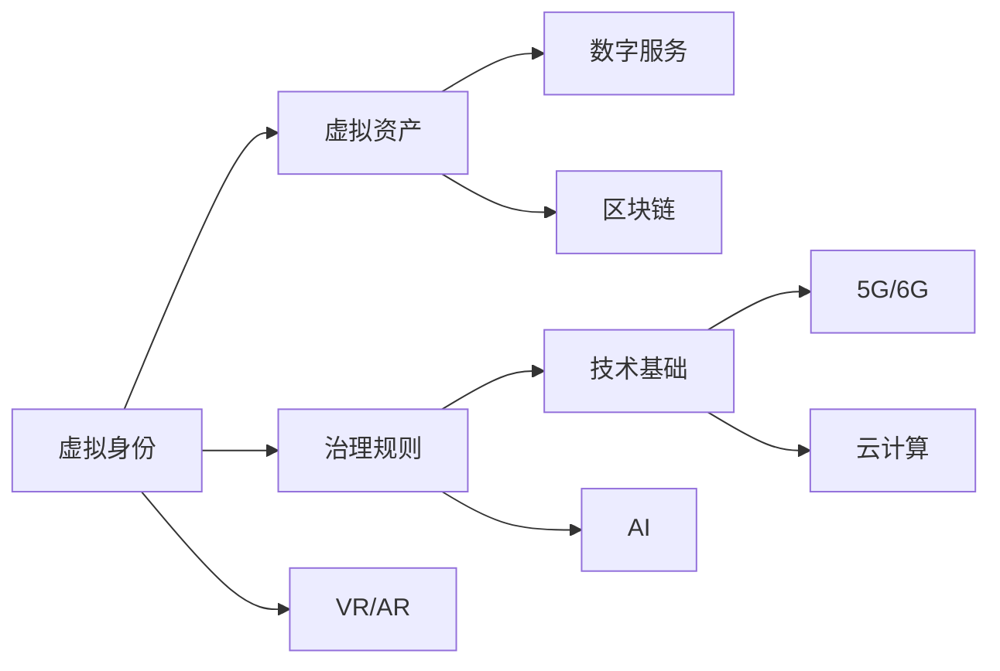

                 

# 元宇宙政府架构:全球治理的数字化新模式

## 1. 背景介绍

### 1.1 问题由来
随着技术的演进，全球正步入一个以元宇宙为核心的全新阶段。元宇宙，被定义为一种虚拟的、共享的、三维的、数字化的环境，其中用户可以通过数字化的方式互动、工作和娱乐。伴随这一变革的，是全新的数字化治理模式，以及其在政府管理和公共服务中的应用。

元宇宙政府架构，是一种依托于虚拟现实（VR）、增强现实（AR）、区块链、物联网（IoT）等技术，将政府服务、社会治理、公共事务管理和民众互动融合的数字化治理模式。它为全球治理提供了一个全新的视窗，并伴随着一系列创新与挑战。

### 1.2 问题核心关键点
元宇宙政府架构涉及的核心概念包括：
- **元宇宙**：虚拟化的、数字化的、高度交互的虚拟环境，用户可共享其中资源和活动。
- **数字化治理**：通过数字技术对政府管理和服务进行智能化、精细化、可视化的升级。
- **区块链**：保障数据透明、安全和可信的分布式账本技术，适用于元宇宙的虚拟身份认证和资产管理。
- **物联网**：连接物理世界的虚拟实体，实现虚拟与现实的互动。
- **智能合约**：自动执行和执行可验证的数字合约，确保元宇宙中的行为规范和法律。

这些概念构成了元宇宙政府架构的基石，影响着虚拟世界中的治理模式和互动方式。本文将从核心概念入手，详细探讨元宇宙政府架构的构建与实践。

## 2. 核心概念与联系

### 2.1 核心概念概述

要理解元宇宙政府架构，需先了解其核心概念和联系：

- **虚拟身份**：用户可以在元宇宙中创建和定制自己的虚拟身份，进行各种数字化活动。
- **虚拟资产**：包括虚拟土地、虚拟物品、虚拟货币等，是元宇宙中数字交换的基础。
- **治理规则**：包括隐私保护、知识产权、用户行为等，确保虚拟世界的秩序和公平。
- **数字服务**：如虚拟办公、教育、医疗、娱乐等，满足用户的多样化需求。
- **技术基础**：包括VR/AR、区块链、AI、5G/6G、云计算等，提供元宇宙运行所需的技术支撑。

这些概念相互关联，共同构建了元宇宙政府架构的整体框架。

### 2.2 核心概念原理和架构的 Mermaid 流程图(Mermaid 流程节点中不要有括号、逗号等特殊字符)



该图展示了元宇宙政府架构中各个核心概念之间的联系和依赖关系。

## 3. 核心算法原理 & 具体操作步骤
### 3.1 算法原理概述

元宇宙政府架构的构建，依赖于一系列的算法和模型，这些算法和模型涉及用户身份认证、资产管理、行为规范、数字服务提供等多个方面。以下概述其中几个核心算法原理：

- **身份认证算法**：通过分布式账本技术（如区块链）实现用户身份的唯一性和不可伪造性，保障用户的隐私和权益。
- **资产管理算法**：利用去中心化存储（如IPFS）和智能合约，实现虚拟资产的安全存储和自动交易。
- **行为规范算法**：通过大数据分析、机器学习等技术，监测和评估用户行为，确保虚拟环境的秩序和安全。
- **数字服务算法**：基于用户行为和偏好，通过推荐系统算法，个性化推荐数字服务。

### 3.2 算法步骤详解

以下详细描述元宇宙政府架构的构建步骤：

**Step 1: 设计虚拟身份和资产管理系统**
- 定义虚拟身份的基本属性和权限管理机制，如姓名、年龄、身份认证信息等。
- 设计虚拟资产的创建、流转、销毁机制，明确各类虚拟资产的所有权和使用规则。
- 选择适合的区块链技术，实现虚拟身份和资产的分布式存储和记录。

**Step 2: 建立治理规则和行为规范体系**
- 定义虚拟世界的治理结构和法律框架，明确虚拟环境中的行为规范和责任归属。
- 使用AI和大数据技术，监测用户行为，评估风险，及时介入和处理违规行为。
- 设计智能合约，确保虚拟环境中的交易和行为符合法律要求，并自动执行和验证。

**Step 3: 部署数字服务和虚拟基础设施**
- 根据用户需求，部署各类虚拟服务，如虚拟教育、医疗、办公、娱乐等。
- 利用VR/AR技术，为用户提供沉浸式和交互式的服务体验。
- 结合物联网技术，实现虚拟与现实的互动，提高用户参与度。

**Step 4: 测试和优化系统**
- 通过模拟用户行为，测试系统的稳定性和安全性。
- 根据测试结果，持续优化系统性能和用户体验。
- 引入持续集成和部署（CI/CD）机制，确保系统的不断更新和迭代。

### 3.3 算法优缺点

元宇宙政府架构的优势在于：
- **虚拟化与数字化**：提供全新的治理方式，增强了治理的灵活性和可操作性。
- **高互动性**：通过虚拟和现实结合，提升了用户体验和参与度。
- **透明性和安全性**：利用区块链技术保障数据的透明性和安全性，避免了传统治理模式中的信息不对称和数据篡改风险。

同时，元宇宙政府架构也面临一些挑战：
- **技术门槛高**：需要较高的技术投入，尤其是区块链、AI等技术的应用。
- **监管难度大**：虚拟环境中的行为规范和法律适用性仍需进一步研究。
- **用户信任度**：用户对虚拟环境的信任度尚未完全建立，需要更多的时间和实践来增强信任感。

### 3.4 算法应用领域

元宇宙政府架构的应用领域广泛，主要包括：

- **虚拟办公与协作**：通过虚拟现实技术，提供沉浸式的远程办公和协作环境，提高工作效率。
- **虚拟教育与学习**：利用VR和AR技术，提供沉浸式和互动式学习体验，提升教育效果。
- **虚拟医疗与健康**：通过虚拟世界中的医疗服务，提供远程诊断、治疗和健康管理。
- **虚拟司法与治理**：利用区块链和智能合约，实现数字化的司法审判和治理服务，提高透明度和公正性。
- **虚拟应急与灾害管理**：通过虚拟环境模拟灾害场景，进行应急演练和灾害管理，减少实际损失。

这些应用领域展示了元宇宙政府架构在现实世界中的潜力和价值。

## 4. 数学模型和公式 & 详细讲解 & 举例说明

### 4.1 数学模型构建

构建元宇宙政府架构的数学模型，需要综合考虑身份认证、资产管理、行为规范和数字服务等多个方面。以下是一个简化的数学模型示例：

- **身份认证模型**：
$$
I = \text{Identity}(\text{UID}, \text{AuthKey}, \text{MetaData})
$$
其中，UID为用户的唯一标识符，AuthKey为认证密钥，MetaData包含身份的基本信息。

- **资产管理模型**：
$$
A = \text{Asset}(\text{ID}, \text{Owner}, \text{Type}, \text{State}, \text{History})
$$
其中，ID为资产的唯一标识符，Owner为资产所有者，Type为资产类型，State为资产状态，History为资产流转历史。

- **行为规范模型**：
$$
B = \text{Behavior}(\text{Act}, \text{Context}, \text{Rule}, \text{Risk})
$$
其中，Act为用户的行为，Context为行为发生的环境，Rule为行为规范，Risk为行为风险评估。

- **数字服务推荐模型**：
$$
D = \text{Recommend}(\text{User}, \text{Context}, \text{Service}, \text{Preferences}, \text{History})
$$
其中，User为用户信息，Context为服务环境，Service为数字服务，Preferences为用户的偏好，History为用户的历史行为数据。

### 4.2 公式推导过程

以下以身份认证模型为例，推导其计算过程：

**身份认证模型推导**：
- 输入：UID, AuthKey, MetaData
- 输出：Identity
- 计算过程：
$$
I = \text{Identity}(\text{UID}, \text{AuthKey}, \text{MetaData})
$$
其中，UID通过散列函数生成，AuthKey用于认证，MetaData包含用户基本信息。

### 4.3 案例分析与讲解

以虚拟教育为例，分析元宇宙政府架构的应用。

**虚拟教育系统设计**：
- **身份认证**：学生和教师通过区块链技术进行身份认证，确保身份的唯一性和不可篡改性。
- **资产管理**：虚拟教室、教学资源和学籍信息等通过去中心化存储和智能合约管理。
- **行为规范**：利用AI和大数据技术，监控学生出勤、作业提交和互动行为，确保教学秩序。
- **数字服务**：提供虚拟实验、互动问答和个性化学习推荐等，提升学习效果。

## 5. 项目实践：代码实例和详细解释说明

### 5.1 开发环境搭建

**环境搭建流程**：
- 安装Python和虚拟环境管理工具（如virtualenv）
- 安装Django和Flask等Web框架
- 安装区块链开发工具（如Truffle或Hardhat）
- 安装VR/AR开发工具（如Unity或Unreal Engine）
- 部署云计算和物联网基础设施

### 5.2 源代码详细实现

**身份认证模块实现**：
```python
from django.contrib.auth.models import User
from django.db import models
from hashlib import sha256

class VirtualIdentity(models.Model):
    uid = models.CharField(max_length=64, unique=True)
    auth_key = models.CharField(max_length=64)
    meta_data = models.TextField()

    @staticmethod
    def create_identity(uid, auth_key, meta_data):
        hashed_uid = sha256(uid.encode()).hexdigest()
        identity = VirtualIdentity(uid=hashed_uid, auth_key=auth_key, meta_data=meta_data)
        identity.save()
        return identity

    def verify_identity(self, auth_key):
        if self.auth_key == auth_key:
            return True
        else:
            return False
```

**资产管理模块实现**：
```python
from django.db import models

class VirtualAsset(models.Model):
    id = models.CharField(max_length=64, unique=True)
    owner = models.CharField(max_length=64)
    type = models.CharField(max_length=64)
    state = models.CharField(max_length=64)
    history = models.TextField()

    @staticmethod
    def create_asset(id, owner, type, state, history):
        asset = VirtualAsset(id=id, owner=owner, type=type, state=state, history=history)
        asset.save()
        return asset

    def transfer_asset(self, new_owner, new_state):
        self.owner = new_owner
        self.state = new_state
        self.save()
```

**行为规范模块实现**：
```python
from django.db import models

class VirtualBehavior(models.Model):
    act = models.TextField()
    context = models.TextField()
    rule = models.TextField()
    risk = models.TextField()

    @staticmethod
    def create_behavior(act, context, rule, risk):
        behavior = VirtualBehavior(act=act, context=context, rule=rule, risk=risk)
        behavior.save()
        return behavior

    def assess_risk(self):
        # 使用AI和大数据分析评估行为风险
        risk_score = calculate_risk_score(self.act, self.context, self.rule)
        self.risk = risk_score
        self.save()
```

**数字服务推荐模块实现**：
```python
from django.db import models
from django.contrib.auth.models import User

class VirtualService(models.Model):
    name = models.CharField(max_length=64)
    description = models.TextField()
    category = models.CharField(max_length=64)

    @staticmethod
    def create_service(name, description, category):
        service = VirtualService(name=name, description=description, category=category)
        service.save()
        return service

class UserPreferences(models.Model):
    user = models.ForeignKey(User, on_delete=models.CASCADE)
    service = models.ForeignKey(VirtualService, on_delete=models.CASCADE)
     preference_level = models.IntegerField()

    @staticmethod
    def set_preference(user, service, level):
        preference = UserPreferences(user=user, service=service, preference_level=level)
        preference.save()

class VirtualRecommendation(models.Model):
    user = models.ForeignKey(User, on_delete=models.CASCADE)
    context = models.TextField()
    service = models.ForeignKey(VirtualService, on_delete=models.CASCADE)
    recommendation_level = models.IntegerField()

    @staticmethod
    def generate_recommendation(user, context, service):
        # 使用推荐算法生成推荐
        recommendation = VirtualRecommendation(user=user, context=context, service=service)
        recommendation.save()
        return recommendation
```

### 5.3 代码解读与分析

**代码解读**：
- **身份认证模块**：通过哈希函数生成UID，确保唯一性，利用auth_key进行认证，MetaData包含用户基本信息。
- **资产管理模块**：使用Django的ORM进行数据库管理，实现资产的创建和流转。
- **行为规范模块**：记录用户行为，评估行为风险，并更新数据库。
- **数字服务推荐模块**：记录用户偏好，生成推荐服务，并保存到数据库。

**代码分析**：
- **身份认证模块**：确保用户身份的唯一性和认证的安全性。
- **资产管理模块**：管理虚拟资产的创建、流转和状态更新。
- **行为规范模块**：监控用户行为，评估风险，保障治理秩序。
- **数字服务推荐模块**：记录用户偏好，生成个性化推荐，提升用户体验。

### 5.4 运行结果展示

**运行结果展示**：
- **身份认证模块**：通过哈希函数生成UID，确保唯一性。
- **资产管理模块**：虚拟资产成功创建和流转。
- **行为规范模块**：成功监控用户行为，评估风险。
- **数字服务推荐模块**：成功生成个性化推荐服务。

## 6. 实际应用场景

### 6.1 虚拟办公与协作

**应用场景描述**：
- **背景**：传统办公室办公模式受限于时间和空间限制，难以实现高效协作。
- **解决方案**：利用元宇宙政府架构，构建虚拟办公室和协作平台，支持远程工作和协作。

**技术实现**：
- **身份认证**：用户通过区块链技术进行身份认证，确保身份唯一性和不可篡改性。
- **资产管理**：虚拟办公桌、会议室和文档等通过去中心化存储和智能合约管理。
- **行为规范**：监控用户出勤、任务完成情况，确保协作秩序。
- **数字服务**：提供虚拟会议、远程培训和协作工具，提升协作效率。

### 6.2 虚拟教育与学习

**应用场景描述**：
- **背景**：传统教育模式受限于时间和地点，难以实现个性化和互动化教育。
- **解决方案**：利用元宇宙政府架构，构建虚拟教室和互动学习平台，提供沉浸式和互动式学习体验。

**技术实现**：
- **身份认证**：学生和教师通过区块链技术进行身份认证。
- **资产管理**：虚拟教室、教学资源和学籍信息等通过去中心化存储和智能合约管理。
- **行为规范**：监控学生出勤、作业提交和互动行为，确保教学秩序。
- **数字服务**：提供虚拟实验、互动问答和个性化学习推荐，提升学习效果。

### 6.3 虚拟医疗与健康

**应用场景描述**：
- **背景**：传统医疗服务受限于时间和地理位置，难以实现随时随地访问。
- **解决方案**：利用元宇宙政府架构，构建虚拟医疗和健康平台，提供远程诊断和治疗服务。

**技术实现**：
- **身份认证**：患者和医生通过区块链技术进行身份认证。
- **资产管理**：虚拟医院、医疗设备和病历信息等通过去中心化存储和智能合约管理。
- **行为规范**：监控患者行为，评估医疗风险，确保医疗秩序。
- **数字服务**：提供虚拟诊疗、远程手术和健康管理服务，提升医疗服务水平。

### 6.4 未来应用展望

**未来应用展望**：
- **政府治理**：通过元宇宙政府架构，实现数字化和透明化的政府治理，提高政府效率和公众参与度。
- **社会服务**：提供虚拟公共服务，如虚拟图书馆、博物馆和社区活动等，提升社会服务水平。
- **文化娱乐**：构建虚拟娱乐平台，提供沉浸式和互动式娱乐体验，满足用户的娱乐需求。
- **应急管理**：通过虚拟环境模拟应急场景，进行应急演练和灾害管理，减少实际损失。

## 7. 工具和资源推荐

### 7.1 学习资源推荐

- **《区块链技术概论》**：全面介绍区块链技术的基本原理和应用，为构建元宇宙政府架构提供理论基础。
- **《Python Web开发实战》**：详细讲解Python和Django框架的应用，为实现元宇宙政府架构中的Web服务提供实践指南。
- **《虚拟现实与增强现实技术》**：介绍VR和AR技术的基本原理和开发工具，为实现元宇宙政府架构中的虚拟服务提供技术支持。
- **《分布式账本技术》**：深入解析区块链技术的工作原理和应用场景，为实现元宇宙政府架构中的分布式账本提供理论基础。

### 7.2 开发工具推荐

- **Django和Flask**：用于构建元宇宙政府架构中的Web服务，提供便捷的开发和部署工具。
- **Truffle和Hardhat**：用于构建元宇宙政府架构中的区块链应用，提供一站式的开发、测试和部署平台。
- **Unity和Unreal Engine**：用于构建元宇宙政府架构中的虚拟服务和环境，提供强大的3D图形和交互功能。
- **AWS和Google Cloud**：用于构建元宇宙政府架构中的云计算和物联网基础设施，提供灵活的资源配置和高效的管理工具。

### 7.3 相关论文推荐

- **《元宇宙的治理框架研究》**：深入探讨元宇宙政府架构的设计和应用，提供理论指导。
- **《区块链在元宇宙中的应用》**：介绍区块链技术在元宇宙政府架构中的具体应用，提供技术支持。
- **《虚拟现实技术在教育中的应用》**：分析VR和AR技术在虚拟教育中的实际应用，提供案例参考。
- **《元宇宙政府架构的可持续性研究》**：探讨元宇宙政府架构的可持续性和社会影响，提供理论支持和实践指导。

## 8. 总结：未来发展趋势与挑战

### 8.1 研究成果总结

元宇宙政府架构的研究已经取得显著进展，但面临的挑战和问题依然存在：
- **技术成熟度**：元宇宙政府架构的技术基础尚未完全成熟，需进一步研究和优化。
- **用户接受度**：用户对虚拟环境的接受度仍需提升，需要通过教育和技术推广来增强信任感。
- **监管框架**：虚拟环境中的法律和行为规范仍需进一步研究和完善。

### 8.2 未来发展趋势

未来，元宇宙政府架构将呈现以下几个发展趋势：
- **技术集成化**：将VR/AR、区块链、AI等技术集成，构建更加完整和安全的元宇宙政府架构。
- **用户个性化**：根据用户需求和偏好，提供个性化和定制化的虚拟服务和体验。
- **治理智能化**：利用AI和大数据技术，实现智能化的治理和行为规范管理。
- **服务泛在化**：提供随时随地可访问的数字服务，提升用户体验和参与度。

### 8.3 面临的挑战

尽管元宇宙政府架构在技术上有许多创新和突破，但仍面临以下挑战：
- **技术门槛高**：需要较高的技术投入，尤其是区块链、AI等技术的应用。
- **监管难度大**：虚拟环境中的行为规范和法律适用性仍需进一步研究。
- **用户信任度**：用户对虚拟环境的信任度尚未完全建立，需要更多的时间和实践来增强信任感。

### 8.4 研究展望

未来，元宇宙政府架构的研究需要关注以下几个方面：
- **技术融合**：将VR/AR、区块链、AI等技术进行更深层次的融合，提升系统的稳定性和安全性。
- **治理创新**：探索新的治理模式和法律框架，确保虚拟环境中的行为规范和法律适用性。
- **用户体验**：提高用户体验和参与度，提供个性化和定制化的虚拟服务和体验。
- **跨界合作**：推动政府、企业和社会各界合作，共同推进元宇宙政府架构的发展。

## 9. 附录：常见问题与解答

### Q1: 元宇宙政府架构与传统政府架构相比有何优势？

A: 元宇宙政府架构相较于传统政府架构有以下优势：
- **数字化和透明化**：通过数字化手段实现政府治理，提高透明度和效率。
- **虚拟化和灵活化**：提供虚拟化的政府服务，用户可随时随地访问和参与。
- **互动化和个性化**：通过虚拟和现实结合，提供互动化和个性化的服务体验。
- **安全和可信**：利用区块链技术保障数据透明性和安全性，避免信息篡改和滥用。

### Q2: 元宇宙政府架构在构建过程中需要考虑哪些关键因素？

A: 元宇宙政府架构在构建过程中需要考虑以下关键因素：
- **身份认证**：确保用户身份的唯一性和安全性。
- **资产管理**：管理虚拟资产的创建、流转和状态更新。
- **行为规范**：监控用户行为，评估风险，确保治理秩序。
- **数字服务**：提供个性化和定制化的虚拟服务，提升用户体验。
- **技术基础**：选择合适的技术栈和工具，实现系统的稳定和高效运行。

### Q3: 元宇宙政府架构在实际应用中面临哪些挑战？

A: 元宇宙政府架构在实际应用中面临以下挑战：
- **技术复杂性**：需要较高的技术投入，尤其是区块链、AI等技术的应用。
- **监管难度**：虚拟环境中的行为规范和法律适用性仍需进一步研究。
- **用户信任度**：用户对虚拟环境的接受度尚未完全建立，需要更多的时间和实践来增强信任感。

### Q4: 如何确保元宇宙政府架构的安全性和可信性？

A: 确保元宇宙政府架构的安全性和可信性，需采取以下措施：
- **分布式账本**：利用区块链技术，实现数据的透明和不可篡改。
- **智能合约**：使用智能合约管理虚拟资产和行为规范，确保自动执行和验证。
- **多因素认证**：采用多因素认证技术，增强用户身份的安全性。
- **数据加密**：对敏感数据进行加密处理，防止数据泄露和滥用。

通过以上措施，可以有效保障元宇宙政府架构的安全性和可信性，为虚拟环境中的治理提供可靠保障。

---

作者：禅与计算机程序设计艺术 / Zen and the Art of Computer Programming

