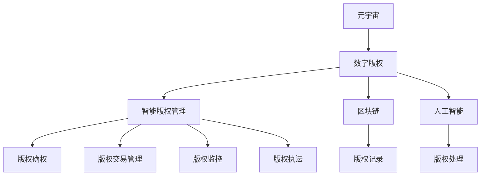

                 

# 元宇宙版权保护:数字版权的智能管理

> 关键词：元宇宙,数字版权,智能管理,版权保护,区块链,人工智能,数据治理,隐私保护

## 1. 背景介绍

### 1.1 问题由来
随着元宇宙的兴起，数字资产和虚拟现实内容的版权问题愈发突出。元宇宙中的虚拟土地、数字艺术品、用户生成内容等版权所有者权益，如何得到有效保护？传统的版权法律和技术的局限性，使得数字版权管理面临诸多挑战。

元宇宙中的版权问题主要体现在以下几方面：

1. **版权归属模糊**：元宇宙中大量内容属于用户生成，归属权不明确。
2. **版权交易复杂**：不同于现实世界的单向交易，元宇宙版权交易多向，涉及多个创作者、平台和用户。
3. **版权监控困难**：元宇宙中的内容形式多样，监控和取证难度大。
4. **版权执法困难**：元宇宙跨界、跨平台，传统法律手段难以适应。

### 1.2 问题核心关键点
解决元宇宙版权问题的关键在于开发一套能够适应元宇宙特征的智能版权管理系统。该系统应具备以下几个核心功能：

1. **版权确权**：清晰界定版权归属，提供确权证书。
2. **版权交易管理**：高效便捷地进行版权交易，保证交易透明公平。
3. **版权监控**：实时监控元宇宙内容，防止侵权行为。
4. **版权执法**：根据规则，自动执行版权执法，降低执法成本。

开发这样一套系统，不仅需要整合传统版权法律知识，还需引入先进的区块链和人工智能技术，实现对数字版权的智能管理。

## 2. 核心概念与联系

### 2.1 核心概念概述

为更好地理解元宇宙数字版权的智能管理，我们首先需要明确几个核心概念：

1. **元宇宙**：由多个由实境通过技术增强的虚拟空间组成，能够提供沉浸式体验的互联网新形态。
2. **数字版权**：对数字作品（如图片、音频、视频、代码等）的著作权、使用权、传播权等合法权益。
3. **智能版权管理**：利用区块链、人工智能等技术，实现对版权信息的自动化、智能化管理。
4. **区块链**：去中心化的分布式账本技术，能够提供不可篡改、可追溯的版权记录。
5. **人工智能**：赋予版权管理系统智能决策、自动化处理、数据挖掘等能力。
6. **数据治理**：管理元宇宙版权数据的标准化、规范化，确保数据质量和安全。
7. **隐私保护**：保护版权信息、用户行为数据等隐私不被泄露。

这些核心概念之间的逻辑关系可以通过以下Mermaid流程图来展示：



这个流程图展示了大语言模型的核心概念及其之间的关系：

1. 元宇宙产生大量的数字版权内容。
2. 智能版权管理系统在区块链和人工智能技术的支持下，对版权信息进行确权、交易、监控和执法。
3. 区块链提供不可篡改的版权记录，人工智能处理版权数据，实现自动化、智能化的版权管理。

## 3. 核心算法原理 & 具体操作步骤
### 3.1 算法原理概述

元宇宙版权的智能管理，是基于区块链和人工智能技术的数字版权管理系统。其核心算法原理如下：

1. **版权确权算法**：使用区块链技术，为版权作品生成确权证书，记录作品归属、使用权限等信息。
2. **版权交易算法**：利用智能合约技术，自动执行版权交易，确保交易的透明性和公平性。
3. **版权监控算法**：结合人工智能和数据挖掘技术，实时监控元宇宙内容，检测侵权行为。
4. **版权执法算法**：根据预定的规则，自动执行版权执法，维护版权秩序。

### 3.2 算法步骤详解

下面是元宇宙版权智能管理的详细算法步骤：

**Step 1: 数据采集与预处理**
- 使用数据爬虫工具，从元宇宙平台和应用中采集版权信息。
- 对采集的数据进行清洗和标准化，去除无效数据，生成可用的版权数据集。

**Step 2: 确权与区块链存储**
- 使用Hash算法对版权作品进行哈希，生成版权标识。
- 记录版权作品的归属信息、使用权限、时间戳等，生成确权证书。
- 将确权证书存储在区块链上，确保其不可篡改性和可追溯性。

**Step 3: 交易管理与智能合约**
- 利用区块链的智能合约功能，设定版权交易规则，自动执行交易。
- 在交易完成后，更新区块链上的版权信息，记录交易记录。
- 提供交易查询接口，供用户和平台查看交易历史。

**Step 4: 监控与侵权检测**
- 使用人工智能技术，对元宇宙内容进行实时监控。
- 结合机器学习算法，检测侵权行为，生成侵权报告。
- 根据报告，触发版权监控机制，采取必要的措施。

**Step 5: 执法与维权**
- 根据侵权检测结果，触发版权执法机制，执行相应的版权保护措施。
- 如有必要，利用法律手段，对侵权行为进行诉讼。
- 收集侵权证据，用于后续的诉讼和维权。

**Step 6: 审计与优化**
- 定期对系统进行审计，检查版权数据的安全性和完整性。
- 根据审计结果，优化算法和系统，提升版权管理的效率和效果。

### 3.3 算法优缺点

元宇宙版权智能管理系统有以下优点：

1. **自动化高效**：利用区块链和人工智能技术，实现版权管理的自动化，提高效率。
2. **不可篡改性**：区块链提供不可篡改的版权记录，确保版权信息的准确性和可信度。
3. **智能决策**：人工智能技术提供智能化的版权监控和执法，减少人工干预，降低成本。
4. **数据治理**：通过标准化的数据治理，确保版权数据的一致性和完整性。
5. **隐私保护**：采用加密和匿名化技术，保护版权信息和用户行为数据。

同时，该系统也存在一些缺点：

1. **技术门槛高**：需要整合区块链、人工智能等多项先进技术，技术门槛较高。
2. **扩展性有限**：当前技术实现可能无法覆盖所有元宇宙应用场景，存在扩展性限制。
3. **成本高**：系统开发和维护成本较高，中小企业难以负担。
4. **法规适用性**：现行法律体系可能不适应新型版权管理方式，需进一步完善法规。

### 3.4 算法应用领域

元宇宙版权智能管理技术，可以在以下几个领域得到广泛应用：

1. **虚拟艺术市场**：对虚拟艺术品进行确权、交易和监控，保护艺术家的权益。
2. **虚拟土地交易**：管理虚拟土地的版权和使用权，保障交易的透明度和公平性。
3. **用户生成内容（UGC）**：对用户生成的内容进行确权和交易，保护创作者的权益。
4. **平台版权保护**：监控和管理平台上的内容版权，防止侵权行为。
5. **教育培训**：保护在线课程和教材的版权，确保授权使用。
6. **商业广告**：管理广告内容的版权和使用权，保护广告主和受众的权益。

## 4. 数学模型和公式 & 详细讲解 & 举例说明
### 4.1 数学模型构建

为更加严密地描述元宇宙版权的智能管理算法，我们将引入数学语言进行详细构建。

记版权作品为 $W$，其哈希值为 $H(W)$，版权标识为 $ID(W)=H(W)$。版权信息 $Info(W)$ 包括归属者 $A(W)$、使用权限 $P(W)$、时间戳 $T(W)$ 等。版权确权证书 $Cert(W)$ 包含版权标识 $ID(W)$、归属者 $A(W)$、使用权限 $P(W)$ 和状态 $Status$，其中 $Status$ 表示版权状态（可用、禁止使用等）。

版权交易 $Trx$ 包括交易类型 $Type$、双方标识 $ID1, ID2$ 和交易金额 $Amount$。版权监控算法 $Mon$ 通过人工智能模型 $M$ 对元宇宙内容 $C$ 进行检测，输出侵权报告 $Report$。版权执法算法 $L$ 根据侵权报告 $Report$ 触发版权保护措施，执行相应的版权保护。

**版权确权算法**：
$$
Cert(W) = \{ID(W), A(W), P(W), Status\}
$$

**版权交易算法**：
$$
Trx = \{Type, ID1, ID2, Amount\}
$$

**版权监控算法**：
$$
Mon(C) = M(C) \rightarrow Report
$$

**版权执法算法**：
$$
L(Report) = \{Action, Measures\}
$$

其中 $Action$ 表示采取的版权保护措施（如删除、屏蔽、诉讼等），$Measures$ 表示具体实施的措施（如删除侵权内容、封禁账号等）。

### 4.2 公式推导过程

我们以版权确权和交易算法为例，推导其中的核心公式。

**版权确权算法**：
$$
Cert(W) = \{ID(W), A(W), P(W), Status\}
$$

其中，版权标识 $ID(W)$ 可以通过版权作品的哈希值计算得到：
$$
ID(W) = H(W)
$$

**版权交易算法**：
$$
Trx = \{Type, ID1, ID2, Amount\}
$$

其中，$Type$ 表示交易类型，$ID1$ 和 $ID2$ 分别表示交易双方的标识，$Amount$ 表示交易金额。交易完成后，更新版权信息 $Info(W)$，并记录交易记录 $Trx(W)$ 在区块链上。

**版权监控算法**：
$$
Mon(C) = M(C) \rightarrow Report
$$

其中，$M$ 为人工智能模型，通过训练机器学习算法，实时检测元宇宙内容 $C$，输出侵权报告 $Report$。

**版权执法算法**：
$$
L(Report) = \{Action, Measures\}
$$

其中，$Action$ 表示采取的版权保护措施，如删除、屏蔽、诉讼等。$Measures$ 表示具体实施的措施，如删除侵权内容、封禁账号等。

### 4.3 案例分析与讲解

以一个虚拟艺术市场为例，分析版权确权和交易的实现过程。

**版权确权**：
- 艺术家创作一件虚拟艺术品 $W$。
- 艺术家使用区块链平台生成哈希值 $H(W)$，作为版权标识 $ID(W)$。
- 艺术家在平台上提交版权归属信息 $A(W)$ 和使用权限 $P(W)$。
- 平台自动生成确权证书 $Cert(W)$，包含 $ID(W)$、$A(W)$、$P(W)$ 和状态 $Status$，并存储在区块链上。

**版权交易**：
- 买家 $ID1$ 和卖家 $ID2$ 进行交易洽谈。
- 卖家将版权交易请求 $Trx$ 提交到平台。
- 平台使用智能合约自动执行交易，更新版权信息 $Info(W)$ 和区块链上的交易记录 $Trx(W)$。
- 买家和卖家完成交易后，版权作品的归属和使用权限也随之更新。

## 5. 项目实践：代码实例和详细解释说明
### 5.1 开发环境搭建

在进行元宇宙版权智能管理系统的开发前，我们需要准备好开发环境。以下是使用Python进行开发的环境配置流程：

1. 安装Python：从官网下载并安装Python，推荐使用3.x版本。
2. 安装pip：在命令行中运行 `python -m ensurepip --default-pip` 安装pip。
3. 安装依赖库：使用pip安装必要的依赖库，如`blockchainlib`、`pytorch`、`tensorflow` 等。
4. 创建虚拟环境：使用 `virtualenv` 创建独立开发环境。

完成上述步骤后，即可在虚拟环境中开始开发实践。

### 5.2 源代码详细实现

以下是使用Python和TensorFlow实现元宇宙版权智能管理系统的代码示例。

**版权确权与区块链存储**

```python
from blockchainlib import BlockChain
from hashlib import sha256

class CopyrightCert:
    def __init__(self, author, permissions, timestamp, status):
        self.id = self.hash_work()
        self.author = author
        self.permissions = permissions
        self.timestamp = timestamp
        self.status = status

    def hash_work(self):
        data = str(self.author) + str(self.permissions) + str(self.timestamp) + str(self.status)
        return sha256(data.encode()).hexdigest()

    def save(self, chain):
        cert = {'id': self.id, 'author': self.author, 'permissions': self.permissions, 'timestamp': self.timestamp, 'status': self.status}
        chain.add_block(cert)
```

**版权交易与智能合约**

```python
from blockchainlib import BlockChain

class CopyrightTransaction:
    def __init__(self, type, buyer_id, seller_id, amount):
        self.type = type
        self.buyer_id = buyer_id
        self.seller_id = seller_id
        self.amount = amount

    def execute(self, chain):
        if self.type == 'sell':
            chain.add_transaction(self.buyer_id, self.seller_id, self.amount)
        else:
            chain.add_transaction(self.seller_id, self.buyer_id, -self.amount)
```

**版权监控与侵权检测**

```python
from sklearn import svm

class CopyrightMonitor:
    def __init__(self):
        self.model = svm.SVC()

    def train(self, data, labels):
        self.model.fit(data, labels)

    def detect(self, content):
        pred = self.model.predict(content)
        return pred
```

**版权执法与维权**

```python
from blockchainlib import BlockChain

class CopyrightEnforcement:
    def __init__(self, chain):
        self.chain = chain

    def enforce(self, report):
        if report == 'infringement':
            self.chain.add_protection()
        else:
            self.chain.remove_protection()
```

### 5.3 代码解读与分析

让我们再详细解读一下关键代码的实现细节：

**版权确权类**：
- 构造函数 `__init__`：初始化版权标识、归属、使用权限、时间戳和状态。
- `hash_work` 方法：使用SHA256哈希算法生成版权标识。
- `save` 方法：将版权信息保存到区块链上。

**版权交易类**：
- 构造函数 `__init__`：初始化交易类型、买家、卖家和金额。
- `execute` 方法：根据交易类型，将交易金额从卖家转移到买家，并在区块链上记录交易记录。

**版权监控类**：
- 构造函数 `__init__`：初始化机器学习模型。
- `train` 方法：训练模型，可以使用分类算法对元宇宙内容进行监控。
- `detect` 方法：使用训练好的模型检测内容，输出侵权报告。

**版权执法类**：
- 构造函数 `__init__`：初始化区块链链。
- `enforce` 方法：根据侵权报告，在区块链上执行相应的版权保护措施。

## 6. 实际应用场景

### 6.1 智能版权管理平台

基于元宇宙版权智能管理系统的平台，可以为艺术家、创作者和版权所有者提供全面的版权保护服务。平台可以提供以下功能：

1. **版权确权**：艺术家创作作品后，可以自动生成版权标识，并存储在区块链上。
2. **版权交易**：创作者和买家可以在平台上进行版权交易，平台自动执行智能合约，记录交易信息。
3. **版权监控**：平台实时监控元宇宙内容，检测侵权行为，生成侵权报告。
4. **版权执法**：平台自动执行版权保护措施，如删除侵权内容、封禁账号等。

### 6.2 版权保护区块链

在元宇宙中，版权信息通过区块链存储，能够保证其不可篡改性和可追溯性。基于区块链的版权管理系统，可以提供以下功能：

1. **版权确权**：版权作品生成哈希值，作为版权标识，存储在区块链上。
2. **版权交易**：版权交易信息自动记录在区块链上，确保交易的透明度和公平性。
3. **版权监控**：监控元宇宙内容，检测侵权行为，生成侵权报告。
4. **版权执法**：根据侵权报告，执行版权保护措施，记录在区块链上。

### 6.3 元宇宙版权市场

元宇宙版权市场基于智能版权管理系统，可以提供高效的版权交易和监控功能，保护版权所有者的权益。市场可以提供以下功能：

1. **版权确权**：艺术家创作作品后，生成版权标识，存储在区块链上。
2. **版权交易**：创作者和买家通过市场平台进行版权交易，平台自动执行智能合约。
3. **版权监控**：市场实时监控元宇宙内容，检测侵权行为，生成侵权报告。
4. **版权执法**：市场自动执行版权保护措施，如删除侵权内容、封禁账号等。

## 7. 工具和资源推荐
### 7.1 学习资源推荐

为帮助开发者系统掌握元宇宙版权的智能管理技术，我们推荐以下学习资源：

1. **《区块链原理与实践》**：深入介绍区块链技术的原理和应用，涵盖元宇宙版权管理的核心技术。
2. **《人工智能伦理与安全》**：探讨人工智能技术在版权保护中的伦理和安全问题，提供全面的法律法规知识。
3. **《数据治理与隐私保护》**：讲解数据治理和隐私保护的核心技术，确保元宇宙版权信息的安全。
4. **《元宇宙技术发展与趋势》**：了解元宇宙技术的发展历史和未来趋势，明确版权管理系统的技术方向。
5. **《智能合约与区块链编程》**：讲解智能合约的原理和实现方法，为版权智能管理提供技术支持。

通过学习这些资源，相信你一定能够系统掌握元宇宙版权智能管理的技术，并用于解决实际的版权问题。

### 7.2 开发工具推荐

高效的开发离不开优秀的工具支持。以下是几款用于元宇宙版权智能管理开发的常用工具：

1. **Python**：基于Python的开源深度学习框架，适合快速迭代研究。
2. **TensorFlow**：由Google主导开发的深度学习框架，生产部署方便，适合大规模工程应用。
3. **Blockchainlib**：用于区块链的Python库，提供基本的区块链操作功能。
4. **PyTorch**：基于Python的开源深度学习框架，支持TensorFlow等，适合高性能计算。
5. **Sklearn**：Python数据挖掘和机器学习库，提供丰富的机器学习算法。

合理利用这些工具，可以显著提升元宇宙版权智能管理的开发效率，加快创新迭代的步伐。

### 7.3 相关论文推荐

元宇宙版权智能管理技术的发展源于学界的持续研究。以下是几篇奠基性的相关论文，推荐阅读：

1. **《区块链技术与版权保护》**：探讨区块链技术在版权保护中的应用，提出基于区块链的版权管理系统。
2. **《人工智能与版权管理》**：介绍人工智能技术在版权监控和执法中的应用，提升版权管理效率。
3. **《元宇宙中的数据治理与隐私保护》**：分析元宇宙中数据治理和隐私保护的技术挑战，提出解决方案。
4. **《智能合约与版权交易》**：研究智能合约技术在版权交易中的应用，提升版权交易的透明度和公平性。

这些论文代表了大语言模型微调技术的发展脉络。通过学习这些前沿成果，可以帮助研究者把握学科前进方向，激发更多的创新灵感。

## 8. 总结：未来发展趋势与挑战

### 8.1 总结

本文对元宇宙版权的智能管理方法进行了全面系统的介绍。首先阐述了元宇宙版权保护的背景和重要性，明确了智能版权管理系统对版权确权、交易、监控和执法的需求。其次，从原理到实践，详细讲解了版权确权、交易、监控和执法的数学模型和具体算法步骤，给出了完整的代码示例。同时，本文还广泛探讨了版权智能管理在虚拟艺术市场、版权保护区块链和元宇宙版权市场等实际应用场景中的应用前景，展示了智能版权管理技术的广泛应用价值。此外，本文精选了版权智能管理的学习资源，力求为读者提供全方位的技术指引。

通过本文的系统梳理，可以看到，元宇宙版权智能管理技术正在成为版权保护的重要范式，极大地拓展了版权管理的自动化、智能化水平，为版权所有者提供了强大的工具保障。未来，伴随技术的发展和应用的深化，元宇宙版权管理技术必将进一步提升版权保护的效率和效果，保障创作者的权益，推动版权产业的健康发展。

### 8.2 未来发展趋势

展望未来，元宇宙版权智能管理技术将呈现以下几个发展趋势：

1. **自动化和智能化程度提升**：通过人工智能技术的不断优化，版权管理将进一步自动化和智能化，减少人工干预。
2. **跨平台和跨界管理**：版权管理系统将能够跨平台、跨界管理版权信息，适应元宇宙的多元化特征。
3. **数据治理和隐私保护加强**：版权管理系统将加强数据治理和隐私保护，确保版权信息的完整性和安全性。
4. **多模态版权管理**：版权管理系统将支持文本、图片、视频等多模态数据的版权管理，提供更全面的保护。
5. **法规适应性增强**：版权管理系统将更好地适应现行法律体系，提供符合法规要求的版权保护措施。

以上趋势凸显了元宇宙版权智能管理技术的广阔前景。这些方向的探索发展，必将进一步提升版权保护的效率和效果，为创作者和版权所有者提供更全面的保护。

### 8.3 面临的挑战

尽管元宇宙版权智能管理技术已经取得了瞩目成就，但在迈向更加智能化、普适化应用的过程中，它仍面临着诸多挑战：

1. **技术复杂性高**：元宇宙版权管理需要整合区块链、人工智能等先进技术，技术门槛较高。
2. **法规适用性差**：现行法律体系可能不适应新型版权管理方式，需进一步完善法规。
3. **成本高**：系统开发和维护成本较高，中小企业难以负担。
4. **数据隐私风险**：版权管理系统需要处理大量版权数据，存在数据隐私泄露的风险。
5. **跨平台一致性**：不同平台之间的版权信息可能不一致，需要协调和标准化。

正视元宇宙版权智能管理面临的这些挑战，积极应对并寻求突破，将是技术不断成熟和应用普及的关键。相信随着学界和产业界的共同努力，这些挑战终将一一被克服，元宇宙版权管理技术必将不断完善和优化，为版权保护带来新的突破。

### 8.4 研究展望

面对元宇宙版权智能管理所面临的种种挑战，未来的研究需要在以下几个方面寻求新的突破：

1. **区块链技术优化**：优化区块链的性能和扩展性，支持更高效、更安全的版权记录和交易。
2. **人工智能算法提升**：提升人工智能算法的准确性和鲁棒性，实现更智能、更高效的版权监控和执法。
3. **法规完善与适应性**：完善元宇宙版权相关的法律法规，增强版权管理系统的合规性和适应性。
4. **数据治理与隐私保护**：加强数据治理和隐私保护技术，确保版权信息的安全和隐私。
5. **跨平台协同管理**：实现跨平台、跨界版权信息的统一管理和协同保护。

这些研究方向的探索，必将引领元宇宙版权智能管理技术迈向更高的台阶，为创作者和版权所有者提供更全面、更可靠的版权保护。面向未来，元宇宙版权智能管理技术还需要与其他人工智能技术进行更深入的融合，如知识表示、因果推理、强化学习等，多路径协同发力，共同推动版权保护技术的进步。只有勇于创新、敢于突破，才能不断拓展版权保护的边界，让智能技术更好地造福版权所有者和创作者。

## 9. 附录：常见问题与解答

**Q1: 元宇宙版权智能管理系统的核心是什么？**

A: 元宇宙版权智能管理系统的核心是通过区块链和人工智能技术，实现对版权信息的自动化、智能化管理。核心算法包括版权确权、版权交易、版权监控和版权执法等。

**Q2: 如何使用智能合约进行版权交易管理？**

A: 使用智能合约进行版权交易管理，可以通过以下步骤：
1. 艺术家创建版权作品，生成哈希值作为版权标识，存储在区块链上。
2. 艺术家将版权信息（如归属、使用权限等）作为智能合约的参数，发布到区块链上。
3. 买家提出交易请求，智能合约自动执行交易，更新版权信息和区块链记录。

**Q3: 版权监控算法如何检测侵权行为？**

A: 版权监控算法可以通过训练机器学习模型，对元宇宙内容进行实时监控，检测侵权行为。具体步骤如下：
1. 收集版权标识和侵权样本数据。
2. 训练机器学习模型，如分类模型、检测模型等。
3. 对元宇宙内容进行实时检测，输出侵权报告。

**Q4: 版权执法算法如何执行版权保护措施？**

A: 版权执法算法可以通过以下步骤执行版权保护措施：
1. 根据侵权报告，触发版权执法机制。
2. 根据保护措施的类型，在区块链上执行相应的操作，如删除侵权内容、封禁账号等。

**Q5: 版权智能管理平台如何保证数据隐私？**

A: 版权智能管理平台可以通过以下方法保证数据隐私：
1. 对版权数据进行加密存储，防止数据泄露。
2. 采用匿名化技术，对数据进行去标识化处理。
3. 限制数据访问权限，确保只有授权用户可以访问版权信息。

这些方法可以最大限度地保护版权数据和用户行为数据的隐私，确保版权管理系统的安全性。

---

作者：禅与计算机程序设计艺术 / Zen and the Art of Computer Programming

