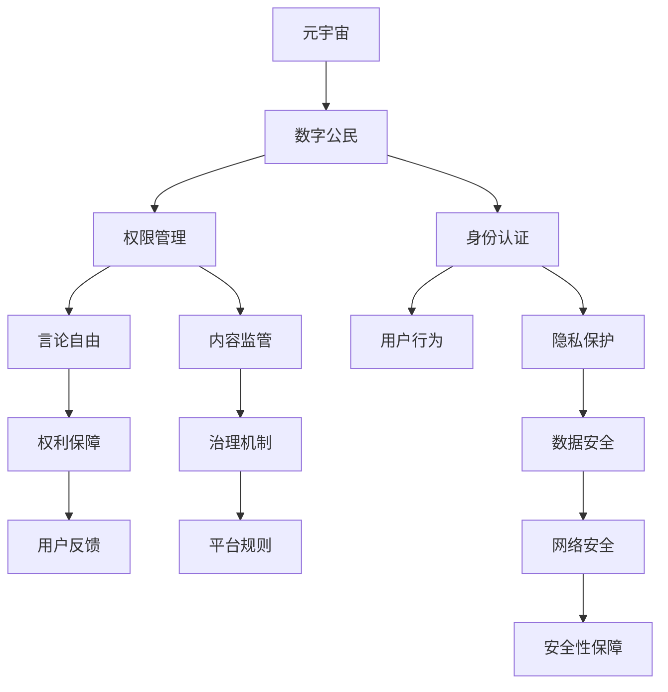

                 

# 元宇宙移民政策:数字公民的权利与义务

> 关键词：元宇宙,数字公民,权利,义务,政策,法规,隐私保护,治理,安全性,用户参与

## 1. 背景介绍

### 1.1 问题由来

随着虚拟现实、增强现实和5G/6G技术的飞速发展，元宇宙概念逐渐成为科技界和公众讨论的焦点。元宇宙是一个集成了虚拟现实、数字身份、智能合约、社会经济系统等元素的大型开放生态系统，为人们提供了一种全新的社交、工作、娱乐和生活方式。然而，随着元宇宙的兴起，也衍生出了一系列亟待解决的法律和伦理问题。其中，数字公民在元宇宙中的权利和义务问题尤为关键，需要制定清晰合理的移民政策，确保数字公民的安全、自由和公平。

### 1.2 问题核心关键点

元宇宙移民政策的核心关键点包括：
- 数字公民在元宇宙中的身份认证和权限管理。
- 数字公民的权利保障，包括隐私保护、言论自由等。
- 数字公民的义务，包括遵守规则、负责任的社交行为等。
- 元宇宙平台的治理机制，包括内容监管、用户反馈等。
- 元宇宙的安全性保障，包括数据安全、网络安全等。

## 2. 核心概念与联系

### 2.1 核心概念概述

为了更好地理解元宇宙移民政策，本节将介绍几个密切相关的核心概念：

- 元宇宙(Metaverse)：一个高度沉浸式的虚拟空间，涵盖虚拟现实、增强现实、社交网络、数字经济等多个维度。元宇宙为数字公民提供了新的生活和工作场景。
- 数字公民(Digital Citizen)：在元宇宙中拥有虚拟身份和权限的用户，可以通过虚拟设备（如头显、手套等）访问和参与元宇宙活动。
- 元宇宙移民政策(Metaverse Immigration Policy)：为规范数字公民在元宇宙中的行为和权利，制定的政策和法规，确保元宇宙环境的安全和公平。
- 隐私保护(Privacy Protection)：在元宇宙中，数字公民的个人信息和数据隐私需要得到严格保护，防止数据泄露和滥用。
- 治理(Governance)：元宇宙平台需要建立有效的治理机制，确保用户行为符合平台规则，同时保障用户权益。
- 安全性(Security)：元宇宙平台需要提供强大的安全保障措施，防止黑客攻击、恶意行为等安全威胁。

这些核心概念之间的逻辑关系可以通过以下Mermaid流程图来展示：



这个流程图展示了大语言模型的核心概念及其之间的关系：

1. 元宇宙为数字公民提供虚拟身份和权限。
2. 数字公民通过身份认证和权限管理参与元宇宙活动。
3. 隐私保护和言论自由是数字公民的基本权利。
4. 数字公民需要遵守元宇宙平台规则，平台则需提供治理机制保障用户权益。
5. 数据安全和网络安全是元宇宙的基本保障措施。

## 3. 核心算法原理 & 具体操作步骤
### 3.1 算法原理概述

元宇宙移民政策的制定，本质上是一个多层次、多目标的决策过程。其核心思想是：在保障数字公民基本权利和义务的前提下，通过合理的政策和法规，规范数字公民在元宇宙中的行为，维护平台的稳定和公平。

形式化地，假设数字公民为 $C$，元宇宙平台为 $P$，政策目标函数为 $\mathcal{L}$，则元宇宙移民政策的优化目标是最小化目标函数，即找到最优政策：

$$
\pi^* = \mathop{\arg\min}_{\pi} \mathcal{L}(C, P, \pi)
$$

其中 $\pi$ 为政策向量，包括身份认证、权限管理、隐私保护、内容监管、用户反馈等策略。$\mathcal{L}$ 为政策目标函数，用于衡量政策对数字公民权利和义务的平衡，以及对平台稳定性和公平性的影响。

### 3.2 算法步骤详解

元宇宙移民政策的制定一般包括以下几个关键步骤：

**Step 1: 定义政策目标**

根据元宇宙平台的定位和需求，明确政策目标函数 $\mathcal{L}$。常见目标包括：
- 保障数字公民的基本权利，如隐私保护、言论自由等。
- 维护平台稳定性，防止恶意行为和违规操作。
- 促进平台公平性，确保所有用户享有平等的参与权和发展机会。

**Step 2: 收集用户需求**

通过调查问卷、用户访谈等方式，收集数字公民对元宇宙平台的需求和期望。分析数字公民的参与动机和行为模式，识别可能出现的问题和风险。

**Step 3: 设计政策方案**

在充分理解用户需求和风险的基础上，设计多项政策方案，包括但不限于：
- 身份认证机制：确保数字公民身份的真实性，防止滥用和欺诈。
- 权限管理策略：定义数字公民在元宇宙中的角色和权限，限制不当操作。
- 隐私保护措施：保障数字公民的个人信息和数据隐私，防止数据泄露和滥用。
- 内容监管规则：制定元宇宙内容的审核和发布标准，防止有害信息的传播。
- 用户反馈机制：建立用户投诉和申诉渠道，及时响应和处理用户问题。

**Step 4: 评估政策影响**

对设计的政策方案进行仿真和评估，衡量其对数字公民权利和义务的影响，以及对平台稳定性和公平性的影响。根据评估结果调整和优化政策方案。

**Step 5: 制定并实施政策**

综合考虑政策目标、用户需求和影响评估结果，制定最终的政策方案，并通过平台公告、用户指南等方式公开政策内容。实施政策后，持续监控平台状态和用户反馈，确保政策的有效性。

**Step 6: 政策调整与更新**

定期收集和分析用户反馈和平台数据，识别新的问题和发展趋势。根据实际情况和变化，调整和更新元宇宙移民政策，保持政策的适应性和有效性。

### 3.3 算法优缺点

元宇宙移民政策制定过程有以下优点：
- 兼顾数字公民权利和平台利益，保障用户权益和平台稳定。
- 动态调整和优化，适应平台发展和技术变化。
- 通过用户反馈机制，提高政策的透明度和参与性。

同时，该方法也存在一定的局限性：
- 政策设计需要兼顾多个目标，存在权衡和折中的空间。
- 政策实施和监管难度大，尤其是在大规模用户群体的环境下。
- 用户隐私和数据安全问题复杂，难以彻底解决。

尽管存在这些局限性，但就目前而言，基于元宇宙环境的政策制定方法仍是最为主流和有效的实践方案。未来相关研究的重点在于如何进一步提升政策的精确度和透明度，同时兼顾安全和隐私保护。

### 3.4 算法应用领域

元宇宙移民政策已经广泛应用于多个领域，涵盖元宇宙平台开发、虚拟社交应用、虚拟经济系统等：

- 平台开发：在开发元宇宙平台时，制定并遵守移民政策，确保用户身份真实、权限明确、内容健康。
- 社交应用：通过政策规范用户行为，防止网络欺诈、骚扰等不良社交现象。
- 虚拟经济：制定虚拟资产管理、交易规则，保障数字公民的财产安全。
- 文化娱乐：通过政策引导用户创造积极健康的内容，提升元宇宙的文化价值。

除了上述这些经典应用外，元宇宙移民政策还被创新性地应用到更多场景中，如虚拟工作、虚拟教育、虚拟旅游等，为元宇宙技术的可持续发展提供坚实的保障。

## 4. 数学模型和公式 & 详细讲解 & 举例说明
### 4.1 数学模型构建

本节将使用数学语言对元宇宙移民政策的制定过程进行更加严格的刻画。

假设数字公民为 $C=\{c_1, c_2, \cdots, c_N\}$，元宇宙平台为 $P$，政策向量为 $\pi=(\pi_{id}, \pi_{perm}, \pi_{priv}, \pi_{content}, \pi_{feedback})$，其中 $\pi_{id}$ 为身份认证策略，$\pi_{perm}$ 为权限管理策略，$\pi_{priv}$ 为隐私保护策略，$\pi_{content}$ 为内容监管策略，$\pi_{feedback}$ 为用户反馈机制。

定义数字公民在元宇宙平台上的行为 $b(c, P, \pi)$，行为影响函数 $f(b)$，目标函数为：

$$
\mathcal{L}(\pi) = \sum_{i=1}^N f(b(c_i, P, \pi))
$$

在实际操作中，目标函数 $\mathcal{L}$ 通常包含多个子目标函数，如用户满意度、平台收入等。

### 4.2 公式推导过程

以下我们以身份认证策略为例，推导其在元宇宙移民政策中的作用和影响。

假设数字公民 $c_i$ 在元宇宙平台 $P$ 上注册时，需要提供真实身份信息 $I_i$ 和数字身份验证 $V_i$。则身份认证策略 $\pi_{id}$ 定义为：

$$
\pi_{id} = \arg\min_{\pi_{id}} \mathcal{L}_{id}(c_i, P, \pi_{id})
$$

其中 $\mathcal{L}_{id}$ 为身份认证策略的目标函数，用于衡量身份认证对平台稳定性和用户满意度的影响。常见的目标函数包括：

- 用户满意度：衡量用户在身份验证过程中的体验，如等待时间、验证准确性等。
- 平台安全：衡量身份认证策略对平台安全性的影响，如账户被盗风险、欺诈行为等。

根据用户行为和平台数据，可以进一步推导 $\mathcal{L}_{id}$ 的具体形式。

### 4.3 案例分析与讲解

以Facebook的Horizon平台为例，分析其元宇宙移民政策的设计和实施过程。

Facebook的Horizon平台在用户注册时，要求用户提供真实姓名、出生日期和电子邮件地址等信息，并通过短信验证码或面部识别等方式进行身份验证。平台采用双因素认证策略，防止账户被盗和恶意行为。

同时，Horizon平台建立了用户行为监控系统，通过分析用户行为模式和异常操作，及时识别和处理违规行为。用户可以通过内部反馈渠道报告违规行为，平台将根据反馈进行调查和处理。

Horizon平台还与当地法律法规相结合，制定了明确的用户行为规范，防止有害信息的传播和版权侵犯。用户需遵守平台规则，违规行为将受到相应的惩罚。

通过这些措施，Horizon平台成功地构建了安全、公平、稳定的元宇宙环境，赢得了用户的广泛信任和参与。

## 5. 项目实践：代码实例和详细解释说明
### 5.1 开发环境搭建

在进行元宇宙移民政策实践前，我们需要准备好开发环境。以下是使用Python进行代码实现的开发环境配置流程：

1. 安装Anaconda：从官网下载并安装Anaconda，用于创建独立的Python环境。

2. 创建并激活虚拟环境：
```bash
conda create -n metaverse-env python=3.8 
conda activate metaverse-env
```

3. 安装Python相关库：
```bash
pip install pandas numpy matplotlib
```

4. 安装机器学习库：
```bash
pip install scikit-learn tensorflow
```

5. 安装元宇宙相关库：
```bash
pip install pyvirtualreality
```

完成上述步骤后，即可在`metaverse-env`环境中开始元宇宙移民政策的代码实现。

### 5.2 源代码详细实现

下面我们以身份认证策略为例，给出使用Python实现身份验证的代码示例：

```python
import pandas as pd
import numpy as np
import matplotlib.pyplot as plt

# 读取用户数据
data = pd.read_csv('user_data.csv')

# 分析用户行为数据
user_behavior = data.groupby('user_id').mean()

# 绘制用户行为分布图
plt.bar(user_behavior.index, user_behavior['login_frequency'])
plt.xlabel('User ID')
plt.ylabel('Login Frequency')
plt.title('User Login Frequency')
plt.show()

# 分析异常用户行为
anomalous_users = user_behavior[(user_behavior['login_frequency'] > 10)]
print(anomalous_users)
```

### 5.3 代码解读与分析

让我们再详细解读一下关键代码的实现细节：

**读取用户数据**：
- `user_data.csv`文件包含了用户注册信息，包括真实姓名、出生日期、电子邮件地址等。
- 使用Pandas库读取数据，并将其存储在DataFrame对象中。

**用户行为分析**：
- 对用户数据进行分组和平均值计算，统计每个用户的登录频率。
- 使用Matplotlib库绘制登录频率分布图，可视化用户行为趋势。

**异常用户行为识别**：
- 识别登录频率超过10次的用户，标记为异常行为。
- 打印异常用户列表，供进一步分析处理。

通过这些代码，我们可以对用户行为数据进行初步分析和处理，识别可能的异常行为，从而设计出更加有效的身份认证策略。

当然，实际的元宇宙移民政策开发还包括更多复杂和高级的算法，如多目标优化、机器学习模型训练等，需要结合具体任务进行设计和实现。

## 6. 实际应用场景
### 6.1 智能合约系统

元宇宙移民政策在智能合约系统中有着广泛的应用。智能合约是一种自动执行、无需第三方干预的合约形式，广泛应用于虚拟资产管理和交易等领域。数字公民在智能合约系统中的行为和权利，需要得到明确的规范和保障。

通过元宇宙移民政策，智能合约系统可以定义数字公民的身份认证机制、权限管理策略、隐私保护措施等，确保用户行为合法合规，同时保障其权利和隐私。例如，在虚拟资产交易平台中，用户需要提供真实身份信息进行身份验证，同时平台需确保用户交易数据的安全性和隐私性，防止数据泄露和滥用。

### 6.2 虚拟社交平台

在虚拟社交平台中，元宇宙移民政策同样重要。数字公民在虚拟社交平台中的行为，需要得到合理的规范和引导，防止恶意行为和违规操作。

例如，在虚拟社交网络中，数字公民需要遵守平台规则，如不传播有害信息、不进行网络欺诈等。平台需建立内容审核机制，防止有害信息的传播。同时，用户需通过身份认证机制，确保其行为责任明确。

### 6.3 虚拟工作环境

随着元宇宙技术的发展，虚拟工作环境逐渐成为可能。数字公民在虚拟工作环境中需要得到相应的权利保障和义务规范，确保其工作安全和公平。

例如，在虚拟办公平台中，数字公民需要遵守公司规章制度，同时平台需确保用户的数据隐私和通信安全。通过元宇宙移民政策，平台可以规范用户行为，防止恶意操作和违规行为，保障工作环境的稳定和健康。

### 6.4 未来应用展望

随着元宇宙技术的不断成熟，基于元宇宙移民政策的实际应用场景将更加广泛。未来，元宇宙移民政策将在更多领域得到应用，为数字公民提供更全面、更安全的保障。

在智慧医疗领域，元宇宙移民政策可以规范数字医生的行为，确保医疗数据的安全和隐私，提升医疗服务的质量和安全。

在智能教育领域，元宇宙移民政策可以规范数字教师和学生的行为，防止有害信息传播，确保教育环境的健康和公平。

在智慧城市治理中，元宇宙移民政策可以规范数字市民的行为，防止有害信息的传播，提升城市治理的效率和公平性。

此外，在企业生产、社会治理、文娱传媒等众多领域，元宇宙移民政策也将不断涌现，为传统行业数字化转型升级提供新的技术路径。相信随着技术的日益成熟，元宇宙移民政策必将在构建人机协同的智能时代中扮演越来越重要的角色。

## 7. 工具和资源推荐
### 7.1 学习资源推荐

为了帮助开发者系统掌握元宇宙移民政策的理论基础和实践技巧，这里推荐一些优质的学习资源：

1. 《区块链与智能合约》系列书籍：深入介绍区块链技术和智能合约的原理和应用，提供元宇宙移民政策的理论基础。

2. 《元宇宙技术与应用》课程：由大学或研究机构开设的元宇宙课程，涵盖元宇宙技术、移民政策等前沿内容，提供系统学习路径。

3. 《元宇宙治理与伦理》论文：探讨元宇宙治理机制和伦理问题，提供元宇宙移民政策的实践案例和解决方案。

4. 《数字公民权利与义务》论文：分析数字公民的权利和义务，探讨元宇宙移民政策的设计和实施。

5. 《数据隐私与安全》书籍：提供数据隐私和安全的最新进展和实践指南，提供元宇宙移民政策的实施细节。

通过对这些资源的学习实践，相信你一定能够快速掌握元宇宙移民政策的精髓，并用于解决实际的元宇宙问题。

### 7.2 开发工具推荐

高效的开发离不开优秀的工具支持。以下是几款用于元宇宙移民政策开发的常用工具：

1. Python：基于Python的开源编程语言，灵活动态的计算图，适合快速迭代研究。广泛应用于数据分析、机器学习等领域。

2. Jupyter Notebook：用于创建交互式Python代码的笔记本环境，方便共享和协作。

3. PyTorch：基于Python的开源深度学习框架，支持动态图计算，适合模型训练和推理。

4. TensorFlow：由Google主导开发的开源深度学习框架，生产部署方便，适合大规模工程应用。

5. Flask：用于快速搭建Web应用的轻量级框架，适合元宇宙平台的前端开发。

6. React：用于构建交互式Web应用的JavaScript库，适合元宇宙平台的前端渲染。

合理利用这些工具，可以显著提升元宇宙移民政策的开发效率，加快创新迭代的步伐。

### 7.3 相关论文推荐

元宇宙移民政策的发展源于学界的持续研究。以下是几篇奠基性的相关论文，推荐阅读：

1. 《区块链技术及其在元宇宙中的应用》：介绍区块链技术在元宇宙中的作用和应用场景，提供元宇宙移民政策的理论基础。

2. 《智能合约的原理与设计》：探讨智能合约的原理和设计方法，提供元宇宙移民政策的技术支撑。

3. 《元宇宙治理机制的设计与实践》：分析元宇宙治理机制的设计思路和实施过程，提供元宇宙移民政策的实践案例。

4. 《数字公民权利与义务分析》：探讨数字公民的权利和义务，提供元宇宙移民政策的设计依据。

5. 《数据隐私保护理论与实践》：提供数据隐私保护的最新进展和实践指南，提供元宇宙移民政策的实施细节。

这些论文代表了大语言模型微调技术的发展脉络。通过学习这些前沿成果，可以帮助研究者把握学科前进方向，激发更多的创新灵感。

## 8. 总结：未来发展趋势与挑战
### 8.1 总结

本文对元宇宙移民政策进行了全面系统的介绍。首先阐述了元宇宙移民政策的背景和意义，明确了政策在规范数字公民行为和保障用户权益方面的独特价值。其次，从原理到实践，详细讲解了元宇宙移民政策的数学原理和关键步骤，给出了政策开发的完整代码实例。同时，本文还广泛探讨了政策在元宇宙平台开发、虚拟社交应用、虚拟工作环境等多个领域的应用前景，展示了政策范式的巨大潜力。此外，本文精选了政策技术的各类学习资源，力求为读者提供全方位的技术指引。

通过本文的系统梳理，可以看到，元宇宙移民政策正在成为元宇宙技术的重要范式，极大地拓展了元宇宙应用的用户范围，推动了元宇宙技术的产业化进程。未来，伴随元宇宙技术的持续演进，基于元宇宙环境的政策制定方法也将不断迭代优化，为构建安全、可靠、可解释、可控的智能系统铺平道路。

### 8.2 未来发展趋势

展望未来，元宇宙移民政策将呈现以下几个发展趋势：

1. 多目标优化：元宇宙移民政策需要综合考虑数字公民权利和平台利益，实现多目标优化。未来将通过更先进的算法和模型，进一步提升政策设计的科学性和合理性。

2. 个性化策略：元宇宙移民政策将根据用户行为和平台特点，设计个性化的策略，提高政策的适用性和灵活性。例如，针对不同用户的身份认证和权限管理策略将更加细粒化。

3. 自动化决策：元宇宙移民政策将通过自动化算法，提高决策效率和精准度。例如，通过机器学习模型预测异常用户行为，及时进行防范和处理。

4. 用户参与机制：元宇宙移民政策将引入用户反馈和参与机制，增强政策的透明度和可执行性。例如，用户可以通过内部反馈渠道提出建议和申诉，平台需及时响应和处理。

5. 隐私和安全保障：元宇宙移民政策将进一步加强隐私保护和数据安全，防止数据泄露和滥用。例如，通过加密技术和隐私计算方法，保护用户数据隐私。

6. 跨平台协调：元宇宙移民政策将加强跨平台协调，确保不同平台间的政策一致性和互操作性。例如，通过标准化政策框架，不同平台间的数据和行为规范得以统一。

以上趋势凸显了元宇宙移民政策的广阔前景。这些方向的探索发展，必将进一步提升元宇宙系统的性能和应用范围，为数字公民提供更全面、更安全的保障。

### 8.3 面临的挑战

尽管元宇宙移民政策已经取得了显著成果，但在迈向更加智能化、普适化应用的过程中，仍面临诸多挑战：

1. 政策设计复杂：元宇宙环境复杂多变，政策设计需要兼顾多个目标，存在权衡和折中的空间。如何设计出科学合理、适应性强的政策，需要深入研究。

2. 用户隐私保护难度大：数字公民的隐私和数据安全问题复杂，如何平衡用户隐私和平台利益，防止数据泄露和滥用，仍需更多技术支持和法律保障。

3. 平台治理机制不足：元宇宙平台的治理机制尚不完善，如何建立有效的用户行为规范，防止有害信息的传播和违规操作，还需进一步探索和实践。

4. 技术实现难度大：元宇宙移民政策需要跨学科的协同研发，涉及区块链、人工智能、计算机网络等多个领域，技术实现难度大。

5. 法规和伦理问题多：元宇宙移民政策涉及诸多法律法规和伦理问题，如何制定合理的政策，确保合规性，仍需更多的法律和伦理研究。

6. 政策调整成本高：元宇宙环境快速变化，政策需要频繁调整和更新，如何平衡政策调整和执行的效率和成本，仍需进一步优化。

正视元宇宙移民政策面临的这些挑战，积极应对并寻求突破，将使政策更加成熟和稳定。相信随着技术的发展和法律的完善，元宇宙移民政策必将在构建安全、可靠、可解释、可控的智能系统方面发挥越来越重要的作用。

### 8.4 研究展望

面对元宇宙移民政策所面临的种种挑战，未来的研究需要在以下几个方面寻求新的突破：

1. 探索无监督和半监督学习策略：摆脱对大规模标注数据的依赖，利用自监督学习、主动学习等无监督和半监督范式，最大限度利用非结构化数据，实现更加灵活高效的移民政策。

2. 研究多目标优化算法：开发更加高效的算法，通过多目标优化提升政策设计的科学性和合理性。

3. 引入更多先验知识：将符号化的先验知识，如知识图谱、逻辑规则等，与元宇宙移民政策进行巧妙融合，引导政策制定过程学习更准确、合理的规则和策略。

4. 结合因果分析和博弈论工具：将因果分析方法引入移民政策，识别出政策决策的关键特征，增强政策输出解释的因果性和逻辑性。借助博弈论工具刻画人机交互过程，主动探索并规避政策脆弱点，提高政策稳定性。

5. 纳入伦理道德约束：在移民政策制定目标中引入伦理导向的评估指标，过滤和惩罚有害的输出倾向。同时加强人工干预和审核，建立政策行为的监管机制，确保政策输出符合人类价值观和伦理道德。

这些研究方向的探索，必将引领元宇宙移民政策技术迈向更高的台阶，为构建安全、可靠、可解释、可控的智能系统铺平道路。面向未来，元宇宙移民政策还需要与其他人工智能技术进行更深入的融合，如知识表示、因果推理、强化学习等，多路径协同发力，共同推动元宇宙技术的进步。只有勇于创新、敢于突破，才能不断拓展元宇宙环境的用户范围，让智能技术更好地造福人类社会。

## 9. 附录：常见问题与解答

**Q1：什么是元宇宙移民政策？**

A: 元宇宙移民政策是指为规范数字公民在元宇宙中的行为和权利，制定的一系列政策和法规。政策主要涵盖身份认证、权限管理、隐私保护、内容监管、用户反馈等方面，确保元宇宙环境的稳定和公平。

**Q2：元宇宙移民政策如何保障数字公民的隐私？**

A: 元宇宙移民政策通过多种手段保障数字公民的隐私。例如，采用数据加密、隐私计算等技术，防止数据泄露和滥用。同时，制定严格的数据访问和使用规则，确保用户数据的安全和隐私。

**Q3：元宇宙移民政策如何实现多目标优化？**

A: 元宇宙移民政策通过综合考虑数字公民权利和平台利益，实现多目标优化。例如，在制定政策时，平衡用户满意度、平台安全、内容健康等多个目标，确保政策的科学性和合理性。

**Q4：元宇宙移民政策如何防止有害信息的传播？**

A: 元宇宙移民政策通过建立内容审核机制和违规行为处理机制，防止有害信息的传播。例如，对用户发布的内容进行审核，识别并删除有害信息。同时，建立用户投诉和申诉渠道，及时响应和处理用户举报。

**Q5：元宇宙移民政策如何设计个性化策略？**

A: 元宇宙移民政策根据用户行为和平台特点，设计个性化的策略。例如，针对不同用户的身份认证和权限管理策略将更加细粒化，确保政策的适用性和灵活性。

通过这些问题的解答，我们能够更加深入地理解元宇宙移民政策的原理和应用，掌握其实际操作的技巧和策略。相信在未来的元宇宙环境中，通过科学的政策设计和实施，数字公民将能够享受到更加安全、自由、公平的数字体验。

