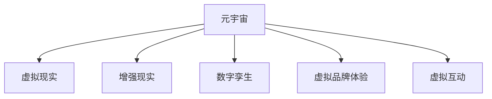

                 

# 元宇宙营销:数字化品牌建设新阵地

## 1. 背景介绍

### 1.1 问题由来
随着技术的进步和市场的成熟，传统的营销手段已经不再能满足品牌商家的需求。互联网、社交媒体等数字平台的兴起，带来了新的品牌传播和互动方式。然而，随着用户对于传统数字内容的厌倦，品牌商家需要找到新的形式来吸引消费者的注意。这时，元宇宙营销应运而生，成为了数字化品牌建设的新阵地。

### 1.2 问题核心关键点
元宇宙营销，即通过构建虚拟世界平台，实现品牌商家的数字化品牌建设，并通过虚拟场景、虚拟产品、虚拟互动等方式，提升品牌影响力和用户体验。其主要核心点包括：

1. 虚拟世界的搭建：创建3D虚拟空间，并通过虚拟建筑、场景等元素来构建完整的虚拟世界。
2. 虚拟产品设计：设计虚拟产品，并进行虚拟展示和互动。
3. 虚拟品牌体验：通过虚拟场景和互动，提升用户对品牌的认知和体验。

### 1.3 问题研究意义
元宇宙营销对品牌商家来说，具有以下重要意义：

1. 打破空间限制：元宇宙营销允许品牌商家不受物理世界空间的限制，创造新的品牌体验。
2. 提升用户互动：通过虚拟互动，提升用户对品牌的认知度和粘性。
3. 创新品牌传播：品牌商家可以通过虚拟世界，进行形式多样的营销活动，增强传播效果。

## 2. 核心概念与联系

### 2.1 核心概念概述

为更好地理解元宇宙营销的原理与实施，本节将介绍几个密切相关的核心概念：

- **元宇宙(Metaverse)**：一个由虚拟用户和虚拟经济组成的完全沉浸式的虚拟世界，如《头号玩家》中的OASIS。
- **虚拟现实(Virtual Reality, VR)**：通过计算机模拟出一个3D虚拟空间，使用户感觉身临其境。
- **增强现实(Augmented Reality, AR)**：在现实世界中，通过虚拟元素对现实环境进行增强。
- **数字孪生(Digital Twin)**：通过数字建模，创建物理世界的虚拟映射。
- **虚拟品牌体验(Virtual Brand Experience, VBE)**：通过虚拟世界平台，提供品牌体验，提升品牌认知。
- **虚拟互动(Virtual Interaction)**：在虚拟世界中进行的人机交互和用户间的互动。

这些核心概念之间的逻辑关系可以通过以下Mermaid流程图来展示：



这个流程图展示了大语言模型的核心概念及其之间的关系：

1. 元宇宙作为基础平台，支持虚拟现实、增强现实等技术。
2. 通过数字孪生技术，将现实世界映射到虚拟世界中。
3. 虚拟品牌体验通过虚拟世界和用户互动，提升品牌认知。
4. 虚拟互动促进用户之间的互动，提升用户体验。

## 3. 核心算法原理 & 具体操作步骤
### 3.1 算法原理概述

元宇宙营销的核心算法原理可以概括为：利用虚拟现实、增强现实等技术，构建虚拟世界平台，并通过数字孪生技术将现实世界的品牌信息映射到虚拟世界。品牌商家在虚拟世界中进行虚拟产品设计、虚拟品牌体验、虚拟互动等操作，从而提升用户对品牌的认知度和粘性。

### 3.2 算法步骤详解

元宇宙营销的实现过程主要包括以下几个关键步骤：

**Step 1: 搭建虚拟世界平台**
- 选择合适的虚拟现实引擎，如Unity、Unreal Engine等，进行虚拟世界搭建。
- 设计虚拟建筑、场景等，确保虚拟世界完整且符合品牌商家的需求。

**Step 2: 数字孪生技术应用**
- 收集现实世界的品牌信息，如logo、广告、产品等。
- 通过数字孪生技术，将现实世界的信息映射到虚拟世界中，并进行虚拟展示。

**Step 3: 虚拟产品设计**
- 设计虚拟产品，并进行3D建模和渲染。
- 通过虚拟互动，让用户能够与虚拟产品进行交互，提升品牌认知。

**Step 4: 虚拟品牌体验**
- 通过虚拟世界平台，提供品牌故事、产品试用等虚拟体验。
- 设计虚拟互动活动，增强用户体验，提升品牌忠诚度。

**Step 5: 用户互动与反馈**
- 通过虚拟互动，收集用户反馈和数据。
- 根据用户反馈，不断优化虚拟世界和虚拟产品。

### 3.3 算法优缺点

元宇宙营销具有以下优点：
1. 沉浸式体验：用户可以在虚拟世界中全方位地体验品牌，提升品牌认知。
2. 多维度互动：用户可以进行虚拟互动，增强品牌粘性。
3. 个性化定制：品牌商家可以根据用户需求，进行虚拟产品定制。

同时，元宇宙营销也存在一些局限性：
1. 技术门槛高：虚拟现实、增强现实等技术要求高，搭建成本大。
2. 用户接受度低：部分用户对虚拟世界接受度较低，推广难度大。
3. 隐私和安全问题：虚拟世界中的用户隐私和安全问题需引起重视。
4. 维护成本高：虚拟世界的维护和更新成本较高。

### 3.4 算法应用领域

元宇宙营销已在多个领域得到了广泛应用，包括：

- 电子商务：通过虚拟场景和产品展示，提升用户购买意愿。
- 旅游业：通过虚拟旅游体验，吸引游客参观和旅游。
- 教育：通过虚拟教室和实验，提升教育效果和体验。
- 房地产：通过虚拟看房和社区，提升房地产的销售效果。
- 游戏娱乐：通过虚拟世界和互动，提升游戏体验和用户粘性。

## 4. 数学模型和公式 & 详细讲解

### 4.1 数学模型构建

元宇宙营销的核心数学模型构建主要涉及以下几个方面：

- **虚拟世界建模**：通过数学建模，构建虚拟世界的3D几何模型。
- **虚拟产品建模**：通过数学建模，设计虚拟产品的几何模型。
- **虚拟品牌体验**：通过数学建模，设计虚拟品牌体验的交互逻辑。

### 4.2 公式推导过程

以虚拟产品建模为例，假设虚拟产品的3D模型为 $M$，其体积为 $V$，表面积为 $A$。则有：

$$
V = \sum_{i=1}^{n} V_i
$$

其中 $V_i$ 表示第 $i$ 个体积单元的体积。

$$
A = \sum_{i=1}^{n} A_i
$$

其中 $A_i$ 表示第 $i$ 个表面积单元的表面积。

### 4.3 案例分析与讲解

以下是一个虚拟产品建模的案例分析：

假设一个虚拟产品的几何模型由多个三角形面组成，每个三角形面的面积 $A_i$ 和体积 $V_i$ 通过公式计算得出。通过对这些三角形面的面积和体积求和，得到虚拟产品的总表面积 $A$ 和总体积 $V$。

## 5. 项目实践：代码实例和详细解释说明
### 5.1 开发环境搭建

在进行元宇宙营销的开发之前，需要先搭建好开发环境。以下是使用Unity进行虚拟世界开发的环境配置流程：

1. 安装Unity Hub：从官网下载并安装Unity Hub。
2. 创建新项目：使用Unity Hub创建新的Unity项目。
3. 添加VR插件：在Unity项目中，添加虚拟现实插件，如Oculus VR、HTC Vive等。
4. 下载并安装VR设备：根据使用的VR设备，下载并安装对应的VR驱动。
5. 配置VR设备：将VR设备与Unity项目连接，并进行配置。

### 5.2 源代码详细实现

这里以Unity的虚拟产品建模为例，给出虚拟产品建模的代码实现。

```csharp
using UnityEngine;

public class VirtualProductModel : MonoBehaviour
{
    // 产品体积
    public float volume = 1.0f;
    // 产品表面积
    public float area = 1.0f;
    
    void Update()
    {
        // 计算体积和表面积
        float volume = volume;
        float area = area;
        // 输出体积和表面积
        Debug.Log("Volume: " + volume + ", Area: " + area);
    }
}
```

### 5.3 代码解读与分析

这个虚拟产品建模的代码实现，使用了Unity的脚本和组件。

**VirtualProductModel类**：
- `public float volume`：产品体积。
- `public float area`：产品表面积。
- `void Update()`：在Update方法中，计算并输出产品体积和表面积。

在Unity中，可以通过添加组件的方式，对虚拟产品的体积和表面积进行计算，并通过脚本实现逻辑处理。

### 5.4 运行结果展示

虚拟产品建模完成后，可以通过Unity的3D视图进行查看和测试。在虚拟世界中，可以看到虚拟产品的大小和形状，并对其进行旋转、缩放等操作。

## 6. 实际应用场景

### 6.1 虚拟展示平台

品牌商家可以通过虚拟展示平台，进行虚拟产品的展示和体验。例如，宝马公司推出了虚拟试驾平台，用户可以在虚拟世界中试驾宝马的虚拟汽车，并进行虚拟驾驶体验。

### 6.2 虚拟品牌体验活动

品牌商家可以通过虚拟世界平台，举办虚拟品牌体验活动。例如，耐克公司在其虚拟品牌体验平台上，推出了虚拟运动比赛和互动游戏，吸引用户参与，增强品牌认知。

### 6.3 虚拟互动

品牌商家可以通过虚拟互动，增强用户对品牌的粘性。例如，虚拟品牌体验平台上，用户可以进行虚拟购物、虚拟体验等互动，提升品牌忠诚度。

### 6.4 未来应用展望

未来，随着技术的进步和市场的成熟，元宇宙营销将进一步普及和深化。其应用场景将更加多样，如虚拟旅游、虚拟地产等。同时，元宇宙营销将与其他技术进行更深入的融合，如人工智能、物联网等，为品牌商家带来更多的创新应用。

## 7. 工具和资源推荐
### 7.1 学习资源推荐

为了帮助开发者系统掌握元宇宙营销的理论基础和实践技巧，这里推荐一些优质的学习资源：

1. Unity官方文档：Unity的官方文档，提供了详细的虚拟现实开发指南和示例代码。
2. Unreal Engine官方文档：Unreal Engine的官方文档，提供了虚拟现实和增强现实开发指南和示例代码。
3. Digital Twin技术白皮书：介绍了数字孪生技术的基本概念和应用场景。
4. 《元宇宙营销白皮书》：介绍了元宇宙营销的基本概念和应用场景。
5. 《虚拟现实技术与应用》课程：介绍虚拟现实技术的基本原理和应用场景。

通过对这些资源的学习实践，相信你一定能够快速掌握元宇宙营销的理论基础和实践技巧，并用于解决实际的营销问题。

### 7.2 开发工具推荐

高效的开发离不开优秀的工具支持。以下是几款用于元宇宙营销开发的常用工具：

1. Unity：Unity是一款强大的游戏引擎，具有广泛的支持和丰富的资源库，适合进行虚拟世界的开发。
2. Unreal Engine：Unreal Engine是另一款强大的游戏引擎，支持虚拟现实和增强现实开发，适用于复杂场景的虚拟世界构建。
3. Oculus SDK：Oculus SDK提供了虚拟现实设备的驱动和支持，便于在Unity或Unreal Engine中进行虚拟现实开发。
4. Google Cardboard：Google Cardboard是一款低成本的虚拟现实头显，便于开发者进行虚拟现实开发和测试。
5. VRTK：VRTK是一款开源的虚拟现实工具包，支持Unity和Unreal Engine，提供了丰富的虚拟现实组件和插件。

合理利用这些工具，可以显著提升元宇宙营销开发的效率和质量，加快创新迭代的步伐。

### 7.3 相关论文推荐

元宇宙营销的发展源于学界的持续研究。以下是几篇奠基性的相关论文，推荐阅读：

1. "Designing for Social Interaction in Virtual Reality"：探讨了虚拟现实环境中社会互动的设计方法。
2. "Virtual Reality and Training: A Review of Research and Development"：介绍了虚拟现实在培训领域的应用。
3. "The Virtual Brandscape: A Study of Virtual Branding in the Metaverse"：分析了虚拟品牌体验活动的效果和用户反馈。
4. "Digital Twin: A survey on its development and applications"：介绍了数字孪生技术的基本概念和应用场景。
5. "Metaverse: A Survey of Its Concepts, Challenges, and Opportunities"：分析了元宇宙的基本概念和应用场景。

这些论文代表了大语言模型微调技术的发展脉络。通过学习这些前沿成果，可以帮助研究者把握学科前进方向，激发更多的创新灵感。

## 8. 总结：未来发展趋势与挑战

### 8.1 总结

本文对元宇宙营销的理论基础和实践技巧进行了全面系统的介绍。首先阐述了元宇宙营销的背景和核心关键点，明确了虚拟世界平台、数字孪生技术、虚拟品牌体验和虚拟互动等核心概念。其次，从原理到实践，详细讲解了元宇宙营销的数学模型和操作步骤，给出了虚拟产品建模的代码实例。同时，本文还广泛探讨了元宇宙营销在虚拟展示平台、虚拟品牌体验活动和虚拟互动等场景的应用前景，展示了元宇宙营销的巨大潜力。

通过本文的系统梳理，可以看到，元宇宙营销为品牌商家提供了全新的品牌建设方式，极大地提升了品牌商家的品牌认知度和用户粘性。未来，随着技术的进步和市场的成熟，元宇宙营销必将在更广泛的领域中发挥重要作用，为品牌商家带来更多的创新应用。

### 8.2 未来发展趋势

展望未来，元宇宙营销将呈现以下几个发展趋势：

1. 技术平台普及：虚拟现实、增强现实等技术将逐渐普及，更多品牌商家将尝试使用元宇宙营销。
2. 数据和用户体验提升：通过数据收集和用户行为分析，不断优化虚拟品牌体验，提升用户体验。
3. 跨平台协同：元宇宙营销将与其他技术进行更深入的融合，如人工智能、物联网等，为品牌商家带来更多的创新应用。
4. 虚拟品牌活动多元化：品牌商家将进行更多的虚拟品牌活动，如虚拟展览、虚拟竞赛等，增强用户互动和参与感。
5. 个性化定制：品牌商家将进行更多的个性化定制，根据用户需求，提供个性化的虚拟产品和服务。

### 8.3 面临的挑战

尽管元宇宙营销已经取得了瞩目成就，但在迈向更加智能化、普适化应用的过程中，它仍面临诸多挑战：

1. 技术门槛高：虚拟现实、增强现实等技术要求高，搭建成本大。
2. 用户接受度低：部分用户对虚拟世界接受度较低，推广难度大。
3. 隐私和安全问题：虚拟世界中的用户隐私和安全问题需引起重视。
4. 维护成本高：虚拟世界的维护和更新成本较高。
5. 用户体验不一致：不同平台和设备的体验不一致，影响用户对品牌的认知。

### 8.4 研究展望

面对元宇宙营销面临的挑战，未来的研究需要在以下几个方面寻求新的突破：

1. 提升技术普及度：通过技术进步和成本降低，降低虚拟现实、增强现实等技术的门槛，促进其普及。
2. 提升用户体验：通过优化虚拟品牌体验和互动，提升用户对品牌的认知和粘性。
3. 安全性和隐私保护：加强用户隐私保护和安全防护，确保用户数据安全。
4. 跨平台协同：促进虚拟现实、增强现实等技术与其他技术的融合，提升用户体验。
5. 个性化定制：开发个性化定制技术，满足用户需求，提升用户体验。

这些研究方向的探索，必将引领元宇宙营销技术迈向更高的台阶，为品牌商家带来更多的创新应用。面向未来，元宇宙营销还需要与其他人工智能技术进行更深入的融合，如知识表示、因果推理、强化学习等，多路径协同发力，共同推动元宇宙营销的发展。只有勇于创新、敢于突破，才能不断拓展品牌商家的品牌建设方式，让元宇宙营销更好地服务于品牌商家和用户。

## 9. 附录：常见问题与解答

**Q1：虚拟世界平台搭建复杂吗？**

A: 虚拟世界平台的搭建，确实有一定的技术门槛。但随着技术的进步和平台支持的增多，搭建过程越来越便捷。品牌商家可以选择Unity、Unreal Engine等工具，并使用现有的虚拟现实插件，大大降低了搭建的难度。

**Q2：元宇宙营销能适用于所有品牌商家吗？**

A: 元宇宙营销对于技术要求较高的品牌商家，如游戏、汽车、房地产等，具有较好的适用性。但对于一些小型商家，尤其是面向大众的日常消费品品牌，可能不太适合。需要根据品牌商家的需求和目标用户群体进行评估。

**Q3：虚拟互动的体验效果如何？**

A: 虚拟互动的体验效果，在很大程度上取决于虚拟世界的构建质量和互动设计。一般来说，虚拟互动的体验效果较好，用户可以通过虚拟互动，进行多维度的品牌体验和互动，提升品牌认知和粘性。

**Q4：如何提升用户对虚拟品牌的认知度？**

A: 品牌商家可以通过虚拟品牌体验活动、虚拟互动等方式，提升用户对虚拟品牌的认知度。同时，通过虚拟产品展示和试用，让用户感受到品牌价值。

**Q5：虚拟品牌体验和实际品牌体验有什么不同？**

A: 虚拟品牌体验和实际品牌体验，在形式和内容上存在较大差异。虚拟品牌体验更注重沉浸式体验和互动，而实际品牌体验更注重感官和感官体验。两者相结合，能够为品牌商家提供更加丰富和多样的品牌体验。

---

作者：禅与计算机程序设计艺术 / Zen and the Art of Computer Programming

