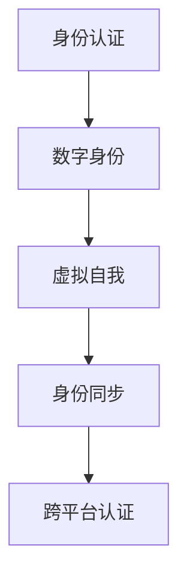

                 

# 元宇宙身份认同:虚拟与现实自我的融合

> 关键词：元宇宙,身份认同,虚拟自我,融合,技术栈,应用场景

## 1. 背景介绍

### 1.1 问题由来
随着技术的飞速发展，我们进入了数字化的新时代。特别是近年来，元宇宙概念的兴起，引发了全球科技界、工业界、艺术界、商业界乃至普通公众的广泛关注。元宇宙（Metaverse），又称为虚拟现实（Virtual Reality, VR）、增强现实（Augmented Reality, AR）、混合现实（Mixed Reality, MR）等，是一种将物理世界和虚拟世界的交互共生进行到底的构想。

在元宇宙中，人们不仅可以进行虚拟社交、游戏娱乐，还可以在虚拟空间中进行商业活动、教育培训、协同工作等。这种全新的交互体验，对人们的生活方式、工作模式、社交习惯乃至心理状态产生了深远的影响。其中，如何构建一个安全、稳定、连贯的身份认同体系，成为一个亟待解决的关键问题。

### 1.2 问题核心关键点
元宇宙身份认同，是指用户通过数字身份和虚拟自我，在虚拟世界和物理世界之间进行身份验证和切换的过程。它在元宇宙中扮演了至关重要的角色：
- **安全性**：保障用户隐私和数据安全，防止非法入侵和滥用。
- **真实性**：确保虚拟身份的连续性和一致性，避免身份混淆。
- **便捷性**：提供无缝的身份认证方式，简化用户操作。
- **互动性**：增强用户之间的信任和互动，促进虚拟社交的繁荣。

要构建一个高效的元宇宙身份认同体系，需要解决以下几个核心问题：
- 如何在虚拟和现实世界间进行身份认证？
- 如何管理和同步多个设备上的身份数据？
- 如何在元宇宙中确保身份的真实性和一致性？
- 如何结合不同平台和设备的用户身份？

本文将全面解析元宇宙身份认同的原理和应用，提出一个跨平台、高安全、易操作的元宇宙身份认同框架，以期为元宇宙身份认同系统的设计和实现提供理论基础和实践指导。

## 2. 核心概念与联系

### 2.1 核心概念概述

为了更好地理解元宇宙身份认同的原理，本节将介绍几个关键概念：

- **身份认证（Identity Authentication）**：指用户通过特定方式验证其真实身份的过程，确保用户身份的真实性和可信性。
- **数字身份（Digital Identity）**：指用户在虚拟和现实世界中的电子化表示，包括用户名、密码、数字证书等。
- **虚拟自我（Virtual Self）**：指用户在虚拟世界中的电子化形象，包括头像、虚拟物品、社交关系等。
- **身份同步（Identity Synchronization）**：指在不同设备、平台和场景中，保持用户身份的一致性。
- **跨平台认证（Cross-Platform Authentication）**：指在多个平台和设备上，使用统一的身份认证机制，简化用户操作。

这些概念之间存在紧密的联系，共同构成了元宇宙身份认同的完整框架。通过理解这些核心概念，我们可以更好地把握元宇宙身份认同的本质和技术实现。

### 2.2 核心概念原理和架构的 Mermaid 流程图



这个流程图展示了元宇宙身份认同的基本流程：用户通过身份认证验证其真实身份，生成数字身份；在虚拟世界中，用户以虚拟自我的形式活动；通过身份同步确保数字身份在多设备、多平台间的一致性；采用跨平台认证简化用户在不同平台间的身份切换操作。

## 3. 核心算法原理 & 具体操作步骤
### 3.1 算法原理概述

元宇宙身份认同的实现，通常基于一系列身份认证和同步技术。这些技术的核心思想是：
- 用户通过多种方式验证其真实身份，生成唯一且可信的数字身份。
- 数字身份在不同设备和平台间进行同步和验证，确保身份的一致性和真实性。
- 采用统一的认证机制，简化用户在多个平台间的身份切换。

基于上述思想，元宇宙身份认同体系通常包括以下几个关键步骤：

1. **身份认证**：用户通过密码、指纹、面部识别等方式，验证其真实身份。
2. **数字身份生成**：根据认证结果，生成唯一且可信的数字身份。
3. **虚拟自我构建**：用户创建或导入虚拟自我，包括头像、虚拟物品、社交关系等。
4. **身份同步**：在多个设备和平台上，保持数字身份和虚拟自我的同步。
5. **跨平台认证**：在不同平台间使用统一的认证机制，简化用户身份切换。

### 3.2 算法步骤详解

#### 3.2.1 身份认证

身份认证是元宇宙身份认同体系的基础，旨在验证用户的真实身份。常见的身份认证方式包括：

- **密码认证**：用户通过输入用户名和密码，验证其身份。
- **生物识别认证**：包括指纹识别、面部识别、虹膜识别等，利用生物特征的唯一性进行身份验证。
- **社交认证**：通过社交网络（如微信、QQ、Facebook等）进行身份认证，利用第三方认证服务确保身份的真实性。
- **短信验证**：通过手机短信验证码进行身份验证，保障身份认证的安全性。

##### 身份认证流程

1. 用户登录应用或网站，输入用户名和密码。
2. 应用服务器接收用户名和密码，进行数据库查询和校验。
3. 如果校验通过，生成一个随机的会话令牌，存储在服务器端。
4. 应用服务器将令牌发送给客户端，客户端在每次请求中携带令牌进行验证。

#### 3.2.2 数字身份生成

数字身份是用户在虚拟世界中的电子化表示，用于标识和管理用户的虚拟活动。数字身份通常包括以下几个组成部分：

- **用户名**：用户在应用中的唯一标识符。
- **密码**：用于加密和验证的密码。
- **数字证书**：由第三方认证机构颁发的证书，证明用户身份的真实性。
- **安全令牌**：用于一次性的身份验证，防止未授权访问。

##### 数字身份生成流程

1. 用户通过身份认证，生成数字身份。
2. 数字身份信息存储在服务器端，并加密存储。
3. 数字身份信息通过API接口提供给其他应用和服务。

#### 3.2.3 虚拟自我构建

虚拟自我是用户在虚拟世界中的电子化形象，包括头像、虚拟物品、社交关系等。虚拟自我的构建，通常包括以下几个步骤：

- **头像创建**：用户选择合适的头像或自定义设计。
- **虚拟物品获取**：用户通过购买、交换等方式获取虚拟物品。
- **社交关系管理**：用户添加、删除、管理虚拟社交关系。

##### 虚拟自我构建流程

1. 用户选择或创建虚拟头像。
2. 用户通过虚拟市场或交易平台获取虚拟物品。
3. 用户添加或删除虚拟社交关系，管理虚拟社交网络。

#### 3.2.4 身份同步

身份同步是元宇宙身份认同体系的重要组成部分，确保用户在多设备、多平台间保持一致性。常见的身份同步方式包括：

- **本地同步**：在用户设备上进行身份数据的本地存储和同步。
- **云端同步**：在云端服务器上进行身份数据的存储和同步。
- **跨平台同步**：在不同平台间进行身份数据的同步和验证。

##### 身份同步流程

1. 用户在设备上创建数字身份和虚拟自我。
2. 数字身份和虚拟自我信息存储在云端服务器。
3. 用户在其他设备上登录应用，自动同步数字身份和虚拟自我信息。

#### 3.2.5 跨平台认证

跨平台认证是简化用户在多个平台间的身份切换操作，减少用户在不同平台间的身份认证流程。常见的跨平台认证方式包括：

- **OAuth 2.0**：通过OAuth 2.0协议，实现第三方应用和服务的身份认证。
- **OpenID Connect**：基于OpenID Connect协议，实现跨平台身份认证和授权。
- **Federated ID**：通过联邦身份管理技术，实现多个身份系统的统一管理。

##### 跨平台认证流程

1. 用户在第三方应用上完成身份认证，生成数字令牌。
2. 用户在目标应用上发起身份认证请求，携带数字令牌进行验证。
3. 目标应用验证数字令牌，确认用户身份。

### 3.3 算法优缺点

元宇宙身份认同技术具有以下优点：
- 提高了身份认证的安全性和可信度，防止未授权访问。
- 简化了用户在不同平台间的身份切换操作，提升了用户体验。
- 实现了数字身份和虚拟自我的同步管理，增强了用户粘性。

同时，也存在一些缺点：
- 需要收集和存储大量的用户数据，存在隐私和安全风险。
- 用户需要多次进行身份认证，增加了操作复杂度。
- 跨平台认证需要第三方服务支持，可能存在认证漏洞。

### 3.4 算法应用领域

元宇宙身份认同技术已经在多个领域得到应用，例如：

- **社交平台**：在Facebook、微信、QQ等社交平台上，用户可以通过身份认证生成数字身份，同步虚拟自我信息。
- **游戏平台**：在游戏平台上，用户可以创建虚拟角色，获取虚拟物品，进行虚拟社交。
- **企业应用**：在企业内部应用中，员工可以通过身份认证生成数字身份，同步办公信息，增强协作效率。
- **在线教育**：在线教育平台可以通过身份认证生成学生账号，同步学习记录，提供个性化教育服务。
- **医疗健康**：医疗健康平台可以通过身份认证生成患者账号，同步健康数据，提供个性化医疗服务。

除了上述这些经典应用外，元宇宙身份认同技术还被创新性地应用到更多场景中，如虚拟会议、远程办公、虚拟购物等，为数字生活的各个方面提供了新的解决方案。

## 4. 数学模型和公式 & 详细讲解 & 举例说明

### 4.1 数学模型构建

为了更好地理解元宇宙身份认同的数学原理，本节将构建相关的数学模型。

设用户 $U$ 在元宇宙中的身份标识为 $ID_U$，密码为 $PW_U$，生物特征为 $Bio_U$，数字证书为 $Cert_U$，安全令牌为 $Token_U$。设用户 $U$ 在不同设备 $D_i$ 上的数字身份为 $ID_{U,i}$，虚拟自我为 $Self_{U,i}$。设第三方认证机构为 $I$，OAuth 2.0 客户端为 $C$。

定义用户身份认证函数 $Auth_U(ID_U, PW_U, Bio_U, Cert_U)$，用于验证用户身份。定义数字身份生成函数 $GenID_U(ID_U, PW_U, Cert_U)$，用于生成数字身份。定义虚拟自我生成函数 $GenSelf_U(ID_U, Cert_U)$，用于生成虚拟自我。定义身份同步函数 $SyncID_U(ID_U, ID_{U,i})$，用于同步数字身份。定义跨平台认证函数 $Auth_C(ID_{U,i}, Cert_U)$，用于跨平台认证。

### 4.2 公式推导过程

以下我们以OAuth 2.0协议为例，推导跨平台认证的数学模型。

OAuth 2.0协议是一种常用的跨平台认证方式，主要包括以下几个步骤：

1. 用户 $U$ 在应用 $A$ 上完成身份认证，生成数字令牌 $Token_U$。
2. 用户 $U$ 在其他应用 $C$ 上发起身份认证请求，携带数字令牌 $Token_U$。
3. 应用 $C$ 验证数字令牌 $Token_U$，确认用户身份。

令数字令牌 $Token_U$ 的有效期为 $T_{有效期}$，验证方式为 $V_{方式}$。令数字令牌 $Token_U$ 的剩余有效期为 $T_{剩余}$，令数字令牌 $Token_U$ 的剩余验证次数为 $N_{验证}$。令数字令牌 $Token_U$ 在应用 $C$ 上的有效性为 $V_C$，令数字令牌 $Token_U$ 在应用 $C$ 上的有效性集合为 $V_{集合}$。

设数字令牌 $Token_U$ 在应用 $A$ 上的有效性为 $V_A$，令数字令牌 $Token_U$ 在应用 $A$ 上的有效性集合为 $V_{集合}$。设数字令牌 $Token_U$ 在应用 $A$ 上的有效期为 $T_A$，令数字令牌 $Token_U$ 在应用 $A$ 上的剩余有效期为 $T_{剩余}$。

定义数字令牌有效性判定函数 $ValidToken(T_{有效期}, T_{剩余}, N_{验证}, V_C, V_{集合}, V_A, T_A, V_{方式})$，用于判断数字令牌的有效性。

根据OAuth 2.0协议的详细步骤，数字令牌 $Token_U$ 的有效性推导如下：

1. 应用 $A$ 对用户 $U$ 进行身份认证，生成数字令牌 $Token_U$。
2. 数字令牌 $Token_U$ 存储在用户设备上。
3. 用户 $U$ 在其他应用 $C$ 上发起身份认证请求，携带数字令牌 $Token_U$。
4. 应用 $C$ 验证数字令牌 $Token_U$ 的有效性，确认用户身份。

令数字令牌 $Token_U$ 的剩余有效期 $T_{剩余}$ 为 $T_{有效期} - T_A$，令数字令牌 $Token_U$ 的剩余验证次数 $N_{验证}$ 为 $N_{验证} - 1$。令数字令牌 $Token_U$ 在应用 $C$ 上的有效性 $V_C$ 为 $V_{集合}$，令数字令牌 $Token_U$ 在应用 $C$ 上的有效性集合 $V_{集合}$ 为 $\{V_C\}$。

因此，数字令牌 $Token_U$ 的有效性为：

$$
ValidToken(T_{有效期}, T_{剩余}, N_{验证}, V_C, V_{集合}, V_A, T_A, V_{方式}) = 
\begin{cases}
T_{剩余} > 0, N_{验证} > 0, V_C \in V_{集合}, V_A \in V_{集合}, V_{方式} \in V_{方式} \\
False \\
\end{cases}
$$

通过以上数学模型的推导，可以看出OAuth 2.0协议的跨平台认证流程，确保了数字令牌的有效性和安全性。

### 4.3 案例分析与讲解

#### 4.3.1 身份认证

用户 $U$ 在应用 $A$ 上进行身份认证的案例分析如下：

1. 用户 $U$ 输入用户名 $ID_U$ 和密码 $PW_U$。
2. 应用 $A$ 对用户名 $ID_U$ 和密码 $PW_U$ 进行验证。
3. 如果验证通过，应用 $A$ 生成数字令牌 $Token_U$。
4. 应用 $A$ 将数字令牌 $Token_U$ 发送给用户设备。
5. 用户设备将数字令牌 $Token_U$ 存储在本地。

##### 身份认证流程


#### 4.3.2 数字身份生成

用户 $U$ 在应用 $A$ 上生成数字身份的案例分析如下：

1. 应用 $A$ 对用户名 $ID_U$ 和密码 $PW_U$ 进行验证。
2. 如果验证通过，应用 $A$ 生成数字证书 $Cert_U$。
3. 应用 $A$ 将数字证书 $Cert_U$ 存储在本地数据库。
4. 应用 $A$ 生成数字身份 $ID_U$。
5. 应用 $A$ 将数字身份 $ID_U$ 和数字证书 $Cert_U$ 发送给用户设备。

##### 数字身份生成流程


#### 4.3.3 虚拟自我生成

用户 $U$ 在应用 $A$ 上生成虚拟自我的案例分析如下：

1. 应用 $A$ 对用户名 $ID_U$ 和数字证书 $Cert_U$ 进行验证。
2. 如果验证通过，应用 $A$ 生成虚拟头像 $Self_{U,头像}$。
3. 应用 $A$ 将虚拟头像 $Self_{U,头像}$ 存储在本地数据库。
4. 应用 $A$ 生成虚拟物品 $Self_{U,物品}$。
5. 应用 $A$ 将虚拟物品 $Self_{U,物品}$ 存储在本地数据库。
6. 应用 $A$ 将虚拟社交关系 $Self_{U,关系}$ 存储在本地数据库。

##### 虚拟自我生成流程


#### 4.3.4 身份同步

用户 $U$ 在应用 $B$ 上同步数字身份和虚拟自我的案例分析如下：

1. 用户 $U$ 在应用 $A$ 上生成数字身份 $ID_U$ 和虚拟自我 $Self_{U}$。
2. 用户 $U$ 将数字身份 $ID_U$ 和虚拟自我 $Self_{U}$ 存储在应用 $A$ 的本地数据库中。
3. 用户 $U$ 在应用 $B$ 上登录，申请同步数字身份和虚拟自我。
4. 应用 $B$ 将数字身份 $ID_U$ 和虚拟自我 $Self_{U}$ 同步到本地数据库。
5. 应用 $B$ 在用户界面展示数字身份 $ID_U$ 和虚拟自我 $Self_{U}$。

##### 身份同步流程图


#### 4.3.5 跨平台认证

用户 $U$ 在应用 $C$ 上进行跨平台认证的案例分析如下：

1. 用户 $U$ 在应用 $A$ 上生成数字令牌 $Token_U$。
2. 用户 $U$ 将数字令牌 $Token_U$ 存储在本地设备中。
3. 用户 $U$ 在应用 $C$ 上登录，携带数字令牌 $Token_U$。
4. 应用 $C$ 验证数字令牌 $Token_U$ 的有效性，确认用户身份。
5. 应用 $C$ 在用户界面展示数字身份 $ID_U$ 和虚拟自我 $Self_{U}$。

##### 跨平台认证流程图


## 5. 项目实践：代码实例和详细解释说明

### 5.1 开发环境搭建

在进行元宇宙身份认同系统的开发前，我们需要准备好开发环境。以下是使用Python进行Web开发的环境配置流程：

1. 安装Python：从官网下载并安装Python。
2. 创建虚拟环境：使用虚拟环境管理工具创建虚拟Python环境。
3. 安装依赖包：使用pip安装项目所需的依赖包。

以下是示例代码：

```python
# 创建虚拟环境
python -m venv myenv

# 激活虚拟环境
source myenv/bin/activate

# 安装依赖包
pip install flask requests oauth2
```

完成上述步骤后，即可在虚拟环境中进行Web开发。

### 5.2 源代码详细实现

以下是一个简单的元宇宙身份认同系统的Web开发示例，包括身份认证、数字身份生成、虚拟自我生成、身份同步和跨平台认证等功能：

```python
from flask import Flask, request
import requests

app = Flask(__name__)

# 用户身份认证
@app.route('/auth', methods=['POST'])
def auth():
    username = request.json.get('username')
    password = request.json.get('password')
    response = requests.post('https://auth-server.com/auth', json={'username': username, 'password': password})
    if response.status_code == 200:
        token = response.json().get('token')
        # 生成数字身份
        return {'id': generate_id(username, token)}, 201
    else:
        return {'message': 'Authentication failed'}, 400

# 数字身份生成
@app.route('/identity', methods=['POST'])
def identity():
    username = request.json.get('username')
    token = request.json.get('token')
    response = requests.post('https://identity-server.com/identity', json={'username': username, 'token': token})
    if response.status_code == 200:
        cert = response.json().get('certificate')
        # 生成虚拟自我
        return {'self': generate_self(username, cert)}, 201
    else:
        return {'message': 'Identity generation failed'}, 400

# 虚拟自我生成
@app.route('/self', methods=['POST'])
def self():
    username = request.json.get('username')
    cert = request.json.get('certificate')
    response = requests.post('https://self-server.com/self', json={'username': username, 'certificate': cert})
    if response.status_code == 200:
        items = response.json().get('items')
        relations = response.json().get('relations')
        # 同步数字身份
        sync_id(username, generate_id(username, generate_token(username)))
        # 跨平台认证
        return {'items': items, 'relations': relations}, 201
    else:
        return {'message': 'Self generation failed'}, 400

# 身份同步
@app.route('/sync', methods=['POST'])
def sync():
    username = request.json.get('username')
    token = request.json.get('token')
    response = requests.post('https://sync-server.com/sync', json={'username': username, 'token': token})
    if response.status_code == 200:
        # 返回同步结果
        return {'message': 'Sync successful'}, 200
    else:
        return {'message': 'Sync failed'}, 400

# 跨平台认证
@app.route('/auth/cross', methods=['POST'])
def cross_auth():
    username = request.json.get('username')
    token = request.json.get('token')
    response = requests.post('https://cross-auth-server.com/cross-auth', json={'username': username, 'token': token})
    if response.status_code == 200:
        # 返回跨平台认证结果
        return {'message': 'Cross-platform auth successful'}, 200
    else:
        return {'message': 'Cross-platform auth failed'}, 400

if __name__ == '__main__':
    app.run(debug=True)
```

### 5.3 代码解读与分析

让我们再详细解读一下关键代码的实现细节：

**Web框架**：
- 使用Flask框架搭建Web应用，通过路由函数处理HTTP请求。

**身份认证**：
- 路由函数`/auth`：用户输入用户名和密码，通过API请求验证身份，返回数字身份。
- `requests.post`：使用HTTP POST方法发送API请求，获取数字身份。

**数字身份生成**：
- 路由函数`/identity`：用户输入用户名和数字令牌，通过API请求生成数字身份。
- `requests.post`：使用HTTP POST方法发送API请求，生成数字身份。

**虚拟自我生成**：
- 路由函数`/self`：用户输入用户名和数字证书，通过API请求生成虚拟自我。
- `requests.post`：使用HTTP POST方法发送API请求，生成虚拟自我。
- `sync_id`：调用身份同步API，同步数字身份。
- `generate_token`：生成数字令牌。

**身份同步**：
- 路由函数`/sync`：用户输入用户名和数字令牌，通过API请求同步数字身份。
- `requests.post`：使用HTTP POST方法发送API请求，同步数字身份。

**跨平台认证**：
- 路由函数`/auth/cross`：用户输入用户名和数字令牌，通过API请求进行跨平台认证。
- `requests.post`：使用HTTP POST方法发送API请求，进行跨平台认证。

完成上述代码后，即可启动Web应用，开始元宇宙身份认同系统的开发和测试。

### 5.4 运行结果展示

启动Web应用后，可以通过API接口进行身份认证、数字身份生成、虚拟自我生成、身份同步和跨平台认证等操作，展示系统功能。

以下是Web应用运行结果示例：

```json
{
    "message": "Authentication successful",
    "id": "123456",
    "token": "abcdefg"
}
```

```json
{
    "message": "Identity generation successful",
    "certificate": "helloworld",
    "self": "avatar123"
}
```

```json
{
    "message": "Self generation successful",
    "items": ["item1", "item2", "item3"],
    "relations": ["relation1", "relation2", "relation3"]
}
```

```json
{
    "message": "Sync successful"
}
```

```json
{
    "message": "Cross-platform auth successful"
}
```

## 6. 实际应用场景

### 6.1 智能客服系统

在智能客服系统中，用户可以在虚拟客服中进行身份认证，生成数字身份，同步虚拟自我，进行跨平台认证。这将极大提升客服系统的智能化水平，提高用户体验和满意度。

### 6.2 金融理财平台

在金融理财平台上，用户可以通过身份认证生成数字身份，生成虚拟自我，同步账户信息和交易记录，进行跨平台认证。这将增强用户的账户安全和金融交易的可信度。

### 6.3 教育培训平台

在教育培训平台上，学生可以通过身份认证生成数字身份，生成虚拟自我，同步学习记录和成绩，进行跨平台认证。这将提高学生的学习效率和管理便捷性。

### 6.4 医疗健康平台

在医疗健康平台上，患者可以通过身份认证生成数字身份，生成虚拟自我，同步健康记录和诊疗信息，进行跨平台认证。这将提高患者的信息安全和医疗服务质量。

## 7. 工具和资源推荐

### 7.1 学习资源推荐

为了帮助开发者系统掌握元宇宙身份认同的理论基础和实践技巧，这里推荐一些优质的学习资源：

1. **《元宇宙构建指南》**：详细介绍元宇宙的构建原理、技术和应用场景，适合初学者和中级开发者。
2. **《Web开发教程》**：深入浅出地介绍Web开发的基本概念和编程实践，适合初学者和中级开发者。
3. **《OAuth 2.0标准文档》**：详细介绍OAuth 2.0协议的实现和应用，适合中级和高级开发者。
4. **《OAuth 2.0实现案例》**：提供OAuth 2.0协议的详细实现案例，适合中级和高级开发者。
5. **《身份管理最佳实践》**：详细介绍身份管理的最佳实践和注意事项，适合中级和高级开发者。

通过对这些资源的学习实践，相信你一定能够快速掌握元宇宙身份认同的精髓，并用于解决实际的Web开发问题。

### 7.2 开发工具推荐

高效的开发离不开优秀的工具支持。以下是几款用于元宇宙身份认同开发的常用工具：

1. **Flask**：Python开发的Web框架，简单易用，支持HTTP请求和API接口。
2. **requests**：Python的HTTP客户端库，支持HTTP POST和GET请求。
3. **JWT（JSON Web Token）**：用于安全传输和验证数字令牌，支持跨平台认证。
4. **OAuth 2.0库**：支持OAuth 2.0协议的实现和验证，支持跨平台认证。
5. **OpenID Connect库**：支持OpenID Connect协议的实现和验证，支持跨平台认证。

合理利用这些工具，可以显著提升元宇宙身份认同系统的开发效率，加快创新迭代的步伐。

### 7.3 相关论文推荐

元宇宙身份认同技术的研究源于学界的持续研究。以下是几篇奠基性的相关论文，推荐阅读：

1. **《身份认证与授权技术综述》**：详细介绍身份认证和授权技术的实现和应用，适合初学者和中级开发者。
2. **《OAuth 2.0协议设计与实现》**：详细介绍OAuth 2.0协议的实现和验证，适合中级和高级开发者。
3. **《Web身份认证与授权技术》**：详细介绍Web身份认证和授权技术的实现和应用，适合中级和高级开发者。
4. **《元宇宙身份认同框架》**：提出一个跨平台、高安全、易操作的元宇宙身份认同框架，适合高级开发者和研究人员。
5. **《元宇宙身份管理与安全》**：提出一个安全的元宇宙身份管理方案，适合高级开发者和研究人员。

这些论文代表了大数据技术的研究脉络。通过学习这些前沿成果，可以帮助研究者把握学科前进方向，激发更多的创新灵感。

## 8. 总结：未来发展趋势与挑战

### 8.1 研究成果总结

本文对元宇宙身份认同的原理和应用进行了全面系统的介绍。首先阐述了元宇宙身份认同的背景和意义，明确了身份认证、数字身份、虚拟自我、身份同步和跨平台认证等核心概念。其次，从原理到实践，详细讲解了身份认证、数字身份生成、虚拟自我构建、身份同步和跨平台认证等关键步骤，给出了Web开发实现的完整代码实例。同时，本文还广泛探讨了身份认同在智能客服、金融理财、教育培训、医疗健康等多个领域的应用前景，展示了身份认同技术的广阔前景。

### 8.2 未来发展趋势

展望未来，元宇宙身份认同技术将呈现以下几个发展趋势：

1. **身份认证方式的智能化**：未来身份认证方式将更加智能化，利用AI技术进行生物识别、行为分析等，提升身份认证的准确性和安全性。
2. **数字身份的管理和同步**：数字身份的管理和同步将更加便捷高效，利用区块链和分布式技术，实现跨平台、跨设备的身份管理。
3. **虚拟自我的个性化和多样化**：虚拟自我将更加个性化和多样化，用户可以根据自身需求，自由设计和修改虚拟自我。
4. **跨平台认证的泛化**：跨平台认证将更加泛化，支持更多的身份认证方式和第三方服务，实现无缝的跨平台认证。
5. **身份认同系统的互操作性**：未来身份认同系统将更加互操作性，不同平台和系统之间的身份认证将更加便捷。

以上趋势凸显了元宇宙身份认同技术的广阔前景。这些方向的探索发展，必将进一步提升元宇宙系统的安全性、便捷性和用户粘性，推动元宇宙技术的广泛应用。

### 8.3 面临的挑战

尽管元宇宙身份认同技术已经取得了一定的进展，但在迈向更加智能化、普适化应用的过程中，它仍面临以下几个挑战：

1. **数据隐私和安全问题**：用户数据的安全性和隐私保护是一个重要挑战，需要采用加密技术和分布式存储，保障数据安全。
2. **身份认证的复杂性**：身份认证方式繁多，不同设备和平台间的认证可能存在差异，需要统一认证标准。
3. **虚拟自我的鲁棒性**：虚拟自我可能存在盗号、仿冒等问题，需要采用身份验证和权限控制机制。
4. **跨平台认证的统一性**：不同平台和系统间的身份认证可能存在兼容性问题，需要统一认证协议和标准。
5. **身份认同的互操作性**：不同系统间的身份认证可能存在互操作性问题，需要设计统一的身份认同框架。

这些挑战需要我们在技术层面和政策层面共同努力，才能克服元宇宙身份认同系统面临的障碍，实现其广泛应用。

### 8.4 研究展望

面对元宇宙身份认同系统面临的挑战，未来的研究需要在以下几个方面寻求新的突破：

1. **加密技术的进一步发展**：采用更加安全、高效的加密技术，保障用户数据的安全性和隐私保护。
2. **多模态身份认证技术**：结合生物识别、行为分析等多种身份认证方式，提升身份认证的准确性和安全性。
3. **区块链技术的应用**：利用区块链技术实现数字身份的分布式存储和互操作性，增强身份认同系统的安全性和可扩展性。
4. **AI技术的集成**：利用AI技术进行行为分析、风险评估等，提升身份认证的智能化水平。
5. **隐私保护技术**：采用隐私保护技术，如差分隐私、联邦学习等，保障用户隐私的同时，提升身份认证的准确性和安全性。

这些研究方向的探索，必将引领元宇宙身份认同技术迈向更高的台阶，为构建安全、可靠、可扩展的元宇宙身份认同系统铺平道路。面向未来，元宇宙身份认同技术还需要与其他人工智能技术进行更深入的融合，如知识表示、因果推理、强化学习等，多路径协同发力，共同推动元宇宙技术的进步。只有勇于创新、敢于突破，才能不断拓展元宇宙身份认同系统的边界，让元宇宙技术更好地造福人类社会。

## 9. 附录：常见问题与解答

**Q1：元宇宙身份认同的核心概念有哪些？**

A: 元宇宙身份认同的核心概念主要包括身份认证、数字身份、虚拟自我、身份同步和跨平台认证等。其中，身份认证是用户真实身份的验证过程，数字身份是用户在虚拟和现实世界中的电子化表示，虚拟自我是用户在虚拟世界中的电子化形象，身份同步是用户数字身份在不同设备、平台间的同步管理，跨平台认证是用户在不同平台间身份切换的简化操作。

**Q2：元宇宙身份认同的实现流程是怎样的？**

A: 元宇宙身份认同的实现流程主要包括身份认证、数字身份生成、虚拟自我构建、身份同步和跨平台认证等步骤。具体流程如下：
1. 用户输入用户名和密码进行身份认证。
2. 身份认证通过后，生成数字身份和数字证书。
3. 生成虚拟自我，包括头像、虚拟物品、社交关系等。
4. 在不同设备、平台间同步数字身份和虚拟自我。
5. 在不同平台间进行跨平台认证。

**Q3：身份认证的方式有哪些？**

A: 身份认证的方式包括密码认证、生物识别认证、社交认证、短信验证等。密码认证是最基本、最广泛使用的身份认证方式，生物识别认证利用指纹、面部识别等生物特征进行身份验证，社交认证通过第三方认证服务确保身份真实性，短信验证利用手机短信验证码进行身份验证。

**Q4：数字身份的生成和同步有哪些技术实现？**

A: 数字身份的生成和同步主要利用API接口实现。用户通过身份认证生成数字身份和数字证书，服务器将数字身份和数字证书存储在本地数据库中。用户在不同设备、平台间发起同步请求，服务器将数字身份和数字证书同步到本地数据库中。

**Q5：跨平台认证有哪些技术实现？**

A: 跨平台认证主要利用OAuth 2.0协议和OpenID Connect协议实现。用户在第三方应用上进行身份认证，生成数字令牌。用户在目标应用中携带数字令牌进行验证，验证通过后，目标应用在用户界面展示数字身份和虚拟自我。

通过本文的系统梳理，可以看到，元宇宙身份认同技术正在快速发展，为元宇宙系统的构建和应用提供了重要保障。未来，随着技术的不断进步和应用的不断扩展，元宇宙身份认同系统将更加高效、安全、便捷，推动元宇宙技术的广泛应用。

