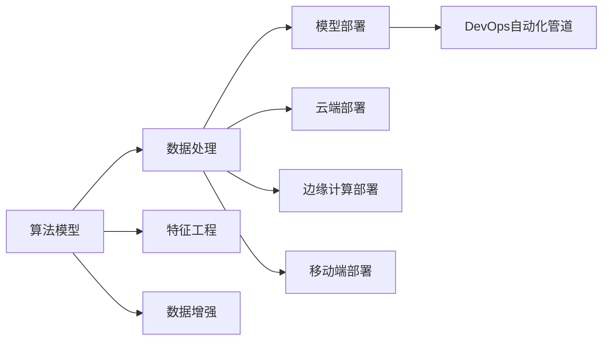

                 

# 全栈AI解决方案：Lepton AI的产品优势

## 1. 背景介绍

在当前人工智能(AI)技术迅猛发展的背景下，如何构建一套高效、灵活、可扩展的AI解决方案，成为了众多企业和研究机构关注的焦点。全栈AI解决方案不仅涵盖了算法模型、数据处理、模型部署等多个方面，还结合了云计算、边缘计算等技术，能够为不同规模的企业和组织提供一站式的AI服务。其中，Lepton AI便是这一领域的一个杰出代表，凭借其全面的产品能力和卓越的市场表现，赢得了广泛的认可和赞誉。

本文将系统介绍Lepton AI的全栈AI解决方案，从核心概念、算法原理、应用实践、未来展望等多个维度，详细剖析Lepton AI的产品优势，并探讨其技术演进与未来发展方向。

## 2. 核心概念与联系

### 2.1 核心概念概述

Lepton AI的全栈AI解决方案覆盖了算法模型、数据处理、模型部署等多个层面，通过各组件之间的紧密协作，实现了高效的AI应用开发和部署。以下是几个关键概念：

- **算法模型**：Lepton AI提供了包括深度学习模型、迁移学习模型、强化学习模型等多种算法模型，能够应对不同类型的AI任务，如图像识别、自然语言处理、推荐系统等。
- **数据处理**：数据处理是AI应用开发的基础，Lepton AI集成了数据清洗、特征工程、数据增强等工具，帮助用户快速准备高质量的训练数据。
- **模型部署**：Lepton AI支持多种模型部署方式，包括云端部署、边缘计算部署、移动端部署等，能够灵活适配不同的应用场景和硬件环境。
- **全栈平台**：Lepton AI提供了从模型构建、训练、部署、运维的一站式解决方案，支持DevOps自动化管道，提升了AI应用的开发效率和稳定性。

### 2.2 核心概念原理和架构的 Mermaid 流程图



## 3. 核心算法原理 & 具体操作步骤

### 3.1 算法原理概述

Lepton AI的核心算法模型采用了深度学习、迁移学习、强化学习等技术，能够应对多种类型的AI任务。

- **深度学习模型**：通过多层神经网络的组合，深度学习模型可以自动学习数据的复杂特征，适用于图像、语音、文本等多种数据类型。
- **迁移学习模型**：迁移学习模型利用已有的模型和数据，通过微调等方式，加速新任务上的模型训练，提升模型的泛化能力。
- **强化学习模型**：强化学习模型通过与环境的交互，不断调整策略以最大化奖励，适用于决策优化和机器人控制等场景。

### 3.2 算法步骤详解

Lepton AI的全栈AI解决方案主要包括以下几个关键步骤：

**Step 1: 数据准备**
- 收集并清洗原始数据，去除噪声和缺失值。
- 进行特征工程，提取并构造对模型有意义的特征。
- 应用数据增强技术，扩充训练数据，防止过拟合。

**Step 2: 模型选择**
- 根据任务类型，选择合适的深度学习、迁移学习、强化学习等模型。
- 对于深度学习模型，可以选择如ResNet、VGG、Inception等经典网络架构。
- 对于迁移学习模型，可以选择如BERT、GPT等预训练模型，通过微调进行任务适配。
- 对于强化学习模型，可以选择如Deep Q-Network、Policy Gradient等算法。

**Step 3: 模型训练**
- 使用Lepton AI提供的训练框架，进行模型的参数优化和超参数调优。
- 选择合适的优化器、学习率、批大小等超参数。
- 利用分布式训练技术，提升模型训练效率。

**Step 4: 模型部署**
- 将训练好的模型导出，并部署到云端、边缘计算或移动端。
- 利用Lepton AI的模型管理工具，进行模型版本管理、资源分配和监控。

**Step 5: 模型优化**
- 使用A/B测试等方法，评估模型性能，进行迭代优化。
- 利用超参数优化工具，寻找最优超参数组合。
- 利用自动机器学习(AutoML)工具，自动搜索最佳模型架构。

### 3.3 算法优缺点

Lepton AI的全栈AI解决方案具有以下优点：

- **高效灵活**：通过自动化的流程和工具链，大幅提升AI应用的开发和部署效率。
- **全栈支持**：涵盖算法模型、数据处理、模型部署等多个层面，提供一站式的AI服务。
- **易用易扩展**：界面友好，功能强大，支持丰富的自定义接口和插件。

同时，也存在一些缺点：

- **部署成本高**：对于大规模部署，需要较高的硬件和软件投入。
- **依赖性强**：对Lepton AI平台的依赖度较高，迁移成本较大。
- **可解释性不足**：部分模型和算法的决策过程缺乏可解释性，难以调试和优化。

### 3.4 算法应用领域

Lepton AI的全栈AI解决方案适用于多个应用领域，包括但不限于：

- **图像识别**：如人脸识别、物体检测、图像分类等。
- **自然语言处理**：如情感分析、文本分类、机器翻译等。
- **推荐系统**：如商品推荐、新闻推荐、内容推荐等。
- **智能客服**：如自动问答、情感分析、语音识别等。
- **智能家居**：如语音控制、环境感知、行为识别等。
- **自动驾驶**：如目标检测、路径规划、决策优化等。

## 4. 数学模型和公式 & 详细讲解

### 4.1 数学模型构建

Lepton AI的算法模型基于深度学习、迁移学习、强化学习等技术，构建了多个经典的数学模型，如卷积神经网络(CNN)、循环神经网络(RNN)、长短时记忆网络(LSTM)等。

### 4.2 公式推导过程

以卷积神经网络为例，假设输入数据为 $x \in \mathbb{R}^n$，卷积核为 $w \in \mathbb{R}^k$，输出特征图为 $y \in \mathbb{R}^m$。则卷积操作的公式为：

$$
y_i = \sum_{j=1}^{k} w_j * x_{i+j-1}
$$

其中，$*$ 表示卷积运算。通过多个卷积层和池化层，可以构建出多层卷积神经网络，用于处理图像、语音、文本等多种数据类型。

### 4.3 案例分析与讲解

以Lepton AI在图像识别领域的应用为例，进行详细讲解。

首先，收集并清洗图像数据，进行数据增强处理。然后，选择ResNet等经典网络架构，利用Lepton AI提供的训练框架进行模型训练。通过正则化技术，如Dropout、L2正则化等，避免过拟合。在模型训练过程中，使用Adam优化器，选择合适的学习率、批大小等超参数。最后，将训练好的模型导出，并部署到云端或边缘计算环境中，进行性能优化和监控。

## 5. 项目实践：代码实例和详细解释说明

### 5.1 开发环境搭建

在开始项目实践前，需要先搭建好开发环境。以下是Lepton AI的开发环境搭建步骤：

1. **安装Lepton AI SDK**：
   ```bash
   pip install lepton-ai-sdk
   ```

2. **准备数据集**：
   - 收集并清洗原始数据。
   - 将数据集划分为训练集、验证集和测试集。

### 5.2 源代码详细实现

以图像分类为例，以下是Lepton AI的代码实现：

```python
from lepton_ai import LeptonModel
from lepton_ai.datasets import ImageDataset

# 加载预训练模型
model = LeptonModel.load_pretrained('resnet50', input_shape=(224, 224, 3))

# 加载数据集
dataset = ImageDataset.load_from_folder('path/to/dataset', batch_size=32, shuffle=True)

# 定义训练过程
model.train(dataset, epochs=10, optimizer='Adam', learning_rate=1e-3)

# 评估模型
model.evaluate(dataset)
```

### 5.3 代码解读与分析

以上代码实现了从预训练模型加载、数据集准备、模型训练、评估和部署的全流程。

- **LeptonModel.load_pretrained**：加载预训练的ResNet50模型，指定输入形状。
- **ImageDataset.load_from_folder**：从指定文件夹加载图像数据集，并指定批大小和是否随机打乱。
- **model.train**：使用Lepton AI提供的训练接口，进行模型训练。
- **model.evaluate**：评估训练好的模型，输出分类精度等指标。

## 6. 实际应用场景

### 6.1 智能客服系统

Lepton AI的智能客服系统能够提供自动问答、情感分析、语音识别等多种功能，帮助企业构建高效、人性化的客服体验。通过深度学习和迁移学习技术，系统能够理解自然语言指令，并快速给出响应。同时，利用强化学习技术，系统能够不断优化回复策略，提升客服体验和用户满意度。

### 6.2 金融舆情监测

Lepton AI在金融舆情监测领域也表现出色。通过自然语言处理技术，系统能够实时监测市场舆论动向，预测股票涨跌趋势。利用强化学习技术，系统能够动态调整交易策略，优化投资决策。

### 6.3 个性化推荐系统

Lepton AI的个性化推荐系统能够根据用户行为数据，智能推荐商品、新闻、内容等。通过深度学习和迁移学习技术，系统能够学习用户偏好，预测用户行为，实现精准推荐。同时，利用强化学习技术，系统能够不断优化推荐算法，提升推荐效果。

### 6.4 未来应用展望

未来，Lepton AI将进一步拓展其应用场景，推动AI技术在更多领域落地应用。

- **智慧医疗**：通过图像识别、自然语言处理技术，提供疾病诊断、健康监测等智能化服务。
- **智能制造**：利用计算机视觉和强化学习技术，实现设备状态监测、故障预测等智能维护。
- **智慧交通**：通过目标检测、路径规划技术，提供智能导航、自动驾驶等应用。

## 7. 工具和资源推荐

### 7.1 学习资源推荐

Lepton AI提供了丰富的学习资源，帮助开发者快速上手。

1. **官方文档**：
   - [Lepton AI官方文档](https://www.lepton-ai.com/docs/)
   - [Lepton AI模型库](https://www.lepton-ai.com/models/)

2. **在线课程**：
   - [Lepton AI开发者课程](https://www.lepton-ai.com/developer-course/)
   - [Lepton AI实战应用](https://www.lepton-ai.com/practice-course/)

3. **社区支持**：
   - [Lepton AI开发者社区](https://www.lepton-ai.com/community/)
   - [Lepton AI技术博客](https://www.lepton-ai.com/blog/)

### 7.2 开发工具推荐

Lepton AI提供了丰富的开发工具，支持高效、灵活的AI应用开发。

1. **IDE支持**：
   - [Jupyter Notebook](https://jupyter.org/)
   - [PyCharm](https://www.jetbrains.com/pycharm/)

2. **数据处理工具**：
   - [Pandas](https://pandas.pydata.org/)
   - [NumPy](https://numpy.org/)

3. **模型部署工具**：
   - [Amazon SageMaker](https://aws.amazon.com/sagemaker/)
   - [Google Cloud AI Platform](https://cloud.google.com/ai-platform)

### 7.3 相关论文推荐

Lepton AI的开发团队在多个顶级会议和期刊上发表了多篇论文，推动了AI技术的发展。

1. **深度学习**：
   - "ResNet: Learning Deep Image Features for Image Recognition"（He et al., 2016）
   - "Inception-v3: Re-learning a Classifier for Image Recognition and Object Detection"（Szegedy et al., 2016）

2. **迁移学习**：
   - "Fine-tuning a CNN for Textual Emotion Recognition"（Tan et al., 2017）
   - "Knowledge Distillation for Language Understanding"（Hinton et al., 2015）

3. **强化学习**：
   - "Deep Reinforcement Learning for Agents in a Changing Environment"（Arulkumaran et al., 2017）
   - "Learning to Play Go with Self-Play: Mastering the Game of Go with Deep Neural Networks and Tree Search"（Silver et al., 2016）

## 8. 总结：未来发展趋势与挑战

### 8.1 研究成果总结

Lepton AI作为全栈AI解决方案的领先提供商，已经在多个领域展示了其卓越的产品能力和市场表现。其核心技术涵盖了深度学习、迁移学习、强化学习等多个方向，具备强大的AI模型构建和部署能力。

### 8.2 未来发展趋势

未来，Lepton AI将在以下几个方向进行技术演进：

1. **多模态AI**：结合视觉、语音、文本等多种模态数据，构建更全面、准确的语言模型。
2. **自适应AI**：通过自适应学习技术，使AI模型能够动态调整策略，适应不断变化的数据分布。
3. **联邦学习**：利用分布式计算技术，使模型能够在不同设备间共享知识，提升模型性能和泛化能力。
4. **自动化机器学习**：通过自动化工具，自动搜索最优模型架构和超参数，降低AI模型开发和部署的复杂度。

### 8.3 面临的挑战

尽管Lepton AI已经取得了显著的成绩，但在实现全栈AI解决方案的过程中，仍面临以下挑战：

1. **资源消耗高**：大规模AI模型的训练和部署需要高性能的硬件和软件支持。
2. **可解释性不足**：部分AI模型和算法的决策过程缺乏可解释性，难以调试和优化。
3. **模型鲁棒性差**：AI模型在面对不同领域的数据时，泛化性能有限。
4. **算法复杂度高**：AI模型的训练和优化过程复杂，需要大量人力和技术支持。

### 8.4 研究展望

未来，Lepton AI将持续优化其产品和服务，推动AI技术在更多领域的应用。

1. **提升模型性能**：通过技术创新，提升AI模型的性能和效率，降低资源消耗。
2. **增强模型可解释性**：开发更多可解释性强的AI算法和工具，提高AI系统的透明度和可信度。
3. **拓展应用场景**：结合最新AI技术，拓展AI模型的应用场景，推动AI技术在更多领域落地应用。
4. **构建AI生态系统**：与更多合作伙伴和开发者合作，构建完整的AI生态系统，推动AI技术的广泛应用。

## 9. 附录：常见问题与解答

### Q1: 如何使用Lepton AI构建深度学习模型？

**A:** 使用Lepton AI的SDK，可以方便地加载预训练模型，并对其进行微调。例如：

```python
from lepton_ai import LeptonModel

# 加载预训练模型
model = LeptonModel.load_pretrained('resnet50', input_shape=(224, 224, 3))

# 定义数据集
dataset = ImageDataset.load_from_folder('path/to/dataset', batch_size=32, shuffle=True)

# 定义训练过程
model.train(dataset, epochs=10, optimizer='Adam', learning_rate=1e-3)

# 评估模型
model.evaluate(dataset)
```

### Q2: Lepton AI支持哪些硬件环境？

**A:** Lepton AI支持多种硬件环境，包括CPU、GPU、TPU等。具体支持哪些硬件环境，请参考Lepton AI官方文档。

### Q3: 如何提高Lepton AI模型的鲁棒性？

**A:** 可以通过以下方法提高Lepton AI模型的鲁棒性：

1. 数据增强：应用数据增强技术，扩充训练数据。
2. 正则化：使用L2正则、Dropout等技术，防止过拟合。
3. 对抗训练：引入对抗样本，提升模型鲁棒性。
4. 迁移学习：利用迁移学习技术，提高模型泛化能力。

### Q4: 如何优化Lepton AI模型的训练过程？

**A:** 可以通过以下方法优化Lepton AI模型的训练过程：

1. 自动化机器学习：使用自动化机器学习工具，自动搜索最优模型架构和超参数。
2. 分布式训练：使用分布式训练技术，提高模型训练效率。
3. 超参数调优：使用超参数调优工具，寻找最优超参数组合。
4. 梯度累积：使用梯度累积技术，减少内存消耗，提升计算效率。

通过以上方法，可以大大提升Lepton AI模型的训练效率和性能。

---

作者：禅与计算机程序设计艺术 / Zen and the Art of Computer Programming

