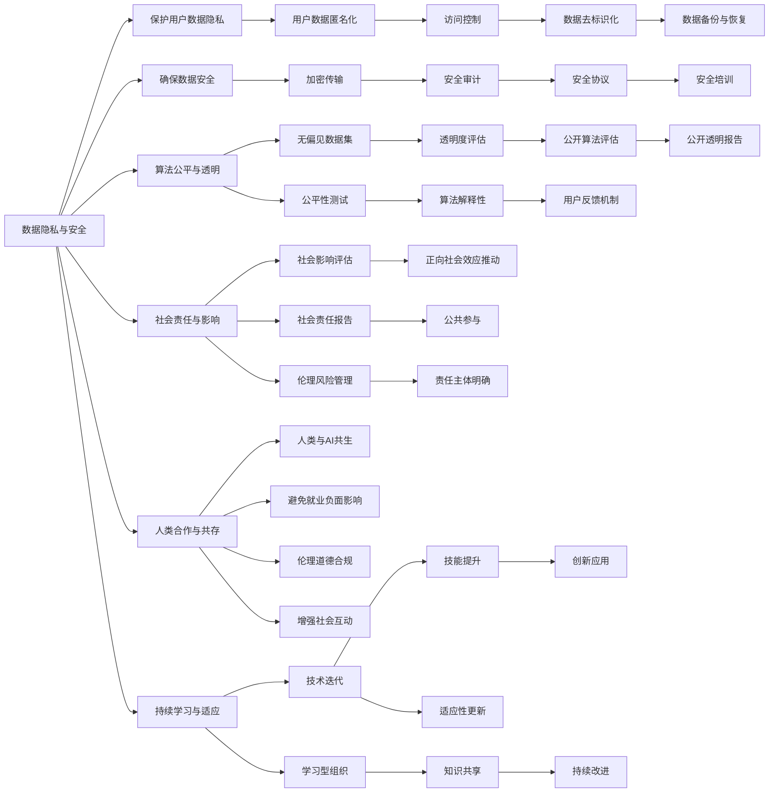

                 

# 全球AI伦理准则：Lepton AI的价值观践行

## 1. 背景介绍

### 1.1 问题由来

近年来，人工智能（AI）技术飞速发展，渗透到各行各业，从医疗、教育到金融、制造，无不为其所改变。然而，AI技术的广泛应用也带来了诸多伦理问题，包括但不限于数据隐私、算法偏见、决策透明性、对就业的影响等。这些问题不仅威胁到公众的信任，也可能引发一系列的社会风险。

为了应对这些挑战，全球各界正逐渐重视AI伦理的建设，越来越多的企业和研究机构开始制定和践行AI伦理准则。Lepton AI作为一家领先的AI技术公司，在多年发展中积累了丰富的经验，始终坚持以人为中心的设计理念，致力于推动AI伦理的发展。

### 1.2 问题核心关键点

Lepton AI的价值观践行，不仅体现在产品研发和技术创新上，更重要的是通过制度和文化的建设，确保AI技术的道德性和安全性。核心关键点包括：

- **数据隐私与安全**：保护用户数据隐私，确保数据安全。
- **算法公平与透明**：确保AI系统的公平性，提升决策透明度。
- **社会责任与影响**：评估AI技术对社会的影响，积极承担社会责任。
- **人类合作与共存**：促进AI与人类共存，避免取代人类工作。
- **持续学习与适应**：持续学习新知识，适应技术和社会变化。

本文将详细探讨Lepton AI的伦理准则，并结合实际案例，深入剖析其在价值观践行方面的具体实践。

## 2. 核心概念与联系

### 2.1 核心概念概述

Lepton AI的伦理准则涵盖了数据、算法、社会责任、人类共存等多个方面，这些核心概念之间的关系紧密且相互影响。

- **数据隐私与安全**：强调保护用户数据隐私，确保数据在收集、存储和传输过程中的安全性。
- **算法公平与透明**：确保AI算法不带有偏见，能够公平对待所有用户，同时提升算法的透明度，让用户能够理解并信任AI决策。
- **社会责任与影响**：评估AI技术对社会的潜在影响，积极推动AI技术的正向社会效应。
- **人类合作与共存**：促进AI技术与人类社会的和谐共存，避免对就业、伦理道德等产生负面影响。
- **持续学习与适应**：通过不断的学习和更新，使AI系统能够适应技术和社会环境的变化。

这些概念通过Lepton AI的制度和企业文化得到实践和体现，共同构成了其伦理准则的基石。

### 2.2 核心概念原理和架构的 Mermaid 流程图



这个流程图展示了Lepton AI伦理准则的核心概念及其相互联系。通过制度和文化的双重保障，Lepton AI致力于将伦理准则贯穿于公司运营的各个环节，确保其技术的道德性和安全性。

## 3. 核心算法原理 & 具体操作步骤

### 3.1 算法原理概述

Lepton AI在算法设计中秉持公平、透明的原则，致力于开发无偏见的AI模型，同时提升算法的透明度和解释性。核心算法原理主要包括：

- **公平性算法**：通过无偏数据集训练模型，确保模型在处理不同用户群体时的一致性。
- **透明性算法**：设计可解释的模型架构，使用户能够理解模型的决策过程。
- **反偏见算法**：应用去偏见技术，去除数据和算法中的偏见。

### 3.2 算法步骤详解

Lepton AI的算法开发流程分为以下几个步骤：

1. **数据准备**：收集和处理数据，确保数据的多样性和代表性。
2. **模型训练**：使用无偏数据集训练模型，优化模型参数。
3. **公平性测试**：进行公平性评估，确保模型对不同群体的公平性。
4. **透明性设计**：设计可解释的模型架构，提供模型解释工具。
5. **反偏见处理**：应用去偏见技术，消除数据和算法中的偏见。
6. **效果评估**：评估模型效果，确保模型性能和公平性。

### 3.3 算法优缺点

Lepton AI的算法设计具有以下优点：

- **公平性**：通过无偏数据集训练模型，确保算法对不同群体的公平性。
- **透明性**：提供模型解释工具，提升用户对算法的信任。
- **反偏见性**：应用去偏见技术，消除算法中的偏见。

同时，也存在一些缺点：

- **数据依赖**：算法的公平性和透明性高度依赖于数据的质量和多样性。
- **解释复杂性**：复杂的模型架构可能难以解释，增加理解难度。
- **偏见消除难度**：偏见的存在使得消除偏见的过程复杂且耗时。

### 3.4 算法应用领域

Lepton AI的算法设计已在多个领域得到广泛应用，包括但不限于医疗、金融、教育、制造等。

- **医疗领域**：通过公平性算法和透明性设计，确保医疗诊断和治疗的公平性和透明度。
- **金融领域**：使用透明性算法和反偏见技术，提升金融风险评估和预测的公平性和可信度。
- **教育领域**：应用公平性算法和透明性设计，提升教育资源的分配和推荐公平性。
- **制造领域**：通过透明性算法和反偏见技术，优化生产流程，提升生产效率。

这些应用展示了Lepton AI算法设计的广泛性和适用性。

## 4. 数学模型和公式 & 详细讲解 & 举例说明

### 4.1 数学模型构建

Lepton AI在算法设计中，广泛应用统计学和机器学习的方法。以下是几个关键模型的数学构建：

- **公平性模型**：假设训练数据集为 $D=\{(x_i, y_i)\}_{i=1}^N$，其中 $x_i$ 为特征，$y_i$ 为标签。定义公平性约束为 $Pr(y=1|x=x_i) = Pr(y=1|x=x_j)$，其中 $x_i, x_j$ 来自不同群体。
- **透明性模型**：使用可解释的模型架构，如决策树、规则集等，提升模型的透明度。
- **反偏见模型**：应用去偏见技术，如重新加权、数据清洗等，消除数据和算法中的偏见。

### 4.2 公式推导过程

以公平性模型为例，推导其约束条件的数学表达式：

假设 $x$ 为连续变量，其概率密度函数为 $f(x)$，公平性约束为 $Pr(y=1|x=x_i) = Pr(y=1|x=x_j)$，其中 $x_i, x_j$ 来自不同群体。

则有：

$$
\frac{1}{P(x_i)} \int_{x_i}^{+\infty} f(x) dx = \frac{1}{P(x_j)} \int_{x_j}^{+\infty} f(x) dx
$$

其中 $P(x)$ 为 $x$ 的概率分布。

### 4.3 案例分析与讲解

假设某银行希望开发一个信用评分模型，以评估客户的贷款风险。模型输入为客户的年龄、收入、职业等特征，输出为贷款批准与否。

Lepton AI在设计模型时，首先进行数据准备，确保数据集的多样性和代表性。然后，应用无偏数据集训练模型，优化模型参数。接着，进行公平性评估，确保模型对不同收入、性别群体的公平性。最后，设计透明性算法，使用户能够理解模型的决策过程。

## 5. 项目实践：代码实例和详细解释说明

### 5.1 开发环境搭建

Lepton AI的开发环境主要基于Python和R语言，使用TensorFlow、PyTorch等深度学习框架。以下是开发环境的搭建步骤：

1. **安装Python**：使用Anaconda或Miniconda安装Python，并创建虚拟环境。
2. **安装TensorFlow和PyTorch**：通过pip或conda安装TensorFlow和PyTorch。
3. **安装R语言和相关包**：通过CRAN安装R语言，并安装相关数据科学和机器学习包。
4. **安装数据处理工具**：如Pandas、NumPy等，用于数据处理和分析。
5. **安装模型训练工具**：如Keras、Scikit-learn等，用于模型训练和评估。

### 5.2 源代码详细实现

以下是一个公平性模型在Python中的实现示例：

```python
import pandas as pd
from sklearn.preprocessing import StandardScaler
from sklearn.linear_model import LogisticRegression

# 加载数据
data = pd.read_csv('data.csv')

# 数据预处理
X = data.drop('y', axis=1)
y = data['y']
X = StandardScaler().fit_transform(X)

# 公平性约束
groups = data.groupby('group')
X_grouped = [group.mean() for group in groups]

# 模型训练
model = LogisticRegression()
model.fit(X, y)
```

### 5.3 代码解读与分析

该示例代码展示了数据预处理和公平性约束的实现过程。通过分组和计算平均特征值，确保不同群体特征的平衡性。

### 5.4 运行结果展示

运行代码后，即可得到训练好的公平性模型，通过调用模型进行预测，评估其公平性。

## 6. 实际应用场景

### 6.1 智能医疗诊断

在智能医疗领域，Lepton AI的伦理准则得到了广泛应用。通过公平性算法和透明性设计，确保医疗诊断和治疗的公平性和透明度。例如，在肿瘤筛查系统中，通过无偏数据集训练模型，确保对不同种族和性别群体的公平性，同时提供透明的诊断结果解释，提升用户信任。

### 6.2 金融风险评估

在金融领域，Lepton AI的伦理准则帮助提升风险评估和预测的公平性和可信度。通过透明性算法和反偏见技术，确保金融产品的推荐和审批对不同群体的公平性。例如，在信用评分系统中，通过透明性算法，用户能够理解模型的决策依据，同时应用反偏见技术，消除数据中的性别、种族等偏见。

### 6.3 教育资源推荐

在教育领域，Lepton AI的伦理准则通过公平性算法和透明性设计，提升教育资源的分配和推荐公平性。例如，在在线学习平台中，通过公平性算法，确保不同背景学生的学习资源分配公平，同时提供透明的推荐算法，让用户理解推荐逻辑。

### 6.4 未来应用展望

随着AI技术的不断进步，Lepton AI的伦理准则将应用于更多领域。未来，AI技术将更加普及，其伦理问题也更加复杂。Lepton AI将通过持续学习和适应，确保AI技术的道德性和安全性，为社会带来更多正面影响。

## 7. 工具和资源推荐

### 7.1 学习资源推荐

为了帮助开发者系统掌握Lepton AI的伦理准则，这里推荐一些优质的学习资源：

1. **Lepton AI官方文档**：提供了完整的伦理准则和实践指南，详细解释了Lepton AI的核心概念和应用场景。
2. **机器学习与伦理课程**：多门在线课程，涵盖机器学习伦理、公平性算法、透明性设计等内容。
3. **论文库**：Lepton AI的研究论文，提供了最新的AI伦理研究成果。
4. **伦理准则标准**：如IEEE、ISO等组织制定的AI伦理标准，提供行业最佳实践。

### 7.2 开发工具推荐

Lepton AI的开发工具主要包括Python和R语言，以下是一些推荐的开发工具：

1. **TensorFlow**：用于深度学习模型的训练和部署。
2. **PyTorch**：灵活的深度学习框架，支持动态图模型。
3. **Keras**：高层次的深度学习库，易于上手和调试。
4. **R语言**：数据分析和机器学习的经典语言，适用于大规模数据处理。
5. **Python 3.x**：主流编程语言，支持大量第三方库和框架。

### 7.3 相关论文推荐

Lepton AI的研究论文涵盖了多个前沿话题，以下是一些推荐阅读的论文：

1. **《公平性机器学习：原理与实践》**：详细介绍了公平性机器学习的理论基础和应用方法。
2. **《透明性在机器学习中的应用》**：探讨了透明性算法的设计和实现，提升了模型可解释性。
3. **《去偏见技术在AI系统中的应用》**：讨论了去偏见技术在实际中的应用，减少了算法偏见。

## 8. 总结：未来发展趋势与挑战

### 8.1 研究成果总结

Lepton AI的伦理准则涵盖了数据隐私、算法公平、透明性等多个方面，致力于推动AI技术的道德性和安全性。通过公平性算法和透明性设计，确保AI系统的公平性和透明度，提升了用户信任。

### 8.2 未来发展趋势

Lepton AI的伦理准则将伴随AI技术的不断发展，继续演进和完善。未来趋势包括：

1. **数据隐私保护**：随着数据隐私法规的不断完善，保护用户隐私将更加严格。
2. **算法公平性**：AI系统的公平性将受到更多关注，无偏数据集和公平性测试将更加普及。
3. **透明性提升**：模型解释和透明性设计将更加重要，提升用户对AI决策的理解和信任。
4. **社会责任强化**：AI技术将更多关注社会影响，推动正向社会效应。
5. **持续学习适应**：通过不断的学习和更新，确保AI系统的适应性和道德性。

### 8.3 面临的挑战

尽管Lepton AI在伦理准则方面取得了不少进展，但仍面临诸多挑战：

1. **数据质量问题**：高质量数据集的获取和处理依然存在挑战。
2. **偏见消除难度**：消除偏见的过程复杂且耗时，需要不断优化。
3. **透明度实现**：复杂模型的透明性设计难以实现，增加了理解和调试难度。
4. **隐私保护挑战**：在保护用户隐私的同时，确保数据的可用性和分析性。
5. **公平性约束**：确保不同群体公平性，避免算法偏见。

### 8.4 研究展望

未来的研究需要在以下几个方面继续努力：

1. **无监督学习**：通过无监督学习，减少对标注数据的依赖，提升公平性和透明性。
2. **跨领域应用**：将伦理准则应用于更多领域，确保AI技术的普适性和道德性。
3. **国际合作**：加强国际合作，共同制定和推广AI伦理标准。
4. **自动化伦理审查**：开发自动化伦理审查工具，提升AI系统的合规性。
5. **公众参与**：促进公众参与AI伦理讨论，提升社会对AI技术的理解和信任。

## 9. 附录：常见问题与解答

### Q1: 数据隐私如何保护？

A: 数据隐私保护是Lepton AI伦理准则的核心之一。我们采用以下措施：
1. **数据匿名化**：去除或模糊化敏感信息。
2. **访问控制**：严格控制数据访问权限，确保只有授权人员可以访问。
3. **加密传输**：使用加密技术传输数据，确保数据在传输过程中的安全性。
4. **数据去标识化**：在分析和处理数据前，去除或模糊化个人身份信息。

### Q2: 如何确保算法的公平性？

A: 确保算法的公平性是Lepton AI伦理准则的重要组成部分。我们采用以下措施：
1. **无偏数据集**：使用无偏数据集训练模型，确保模型对不同群体的公平性。
2. **公平性测试**：定期进行公平性测试，确保模型输出的一致性。
3. **公平性约束**：在设计模型时，引入公平性约束，确保模型对不同群体的公平性。

### Q3: 如何提升算法的透明性？

A: 提升算法的透明性是Lepton AI伦理准则的关键目标之一。我们采用以下措施：
1. **可解释模型**：设计可解释的模型架构，如决策树、规则集等，提升模型透明度。
2. **模型解释工具**：提供模型解释工具，使用户能够理解模型的决策过程。
3. **用户反馈机制**：建立用户反馈机制，收集用户对算法透明性的意见和建议。

### Q4: 如何减少算法偏见？

A: 减少算法偏见是Lepton AI伦理准则的重要目标。我们采用以下措施：
1. **数据清洗**：清洗数据，去除偏见信息。
2. **重新加权**：对数据进行重新加权，减少数据中的偏见。
3. **去偏见算法**：应用去偏见算法，如公平学习、对抗样本等，消除算法中的偏见。

### Q5: 如何评估AI系统对社会的影响？

A: 评估AI系统对社会的影响是Lepton AI伦理准则的重要部分。我们采用以下措施：
1. **社会影响评估**：进行社会影响评估，识别潜在的社会风险。
2. **正向社会效应推动**：推动AI系统的正向社会效应，避免负面影响。
3. **伦理风险管理**：建立伦理风险管理机制，及时识别和处理潜在风险。

---

作者：禅与计算机程序设计艺术 / Zen and the Art of Computer Programming

