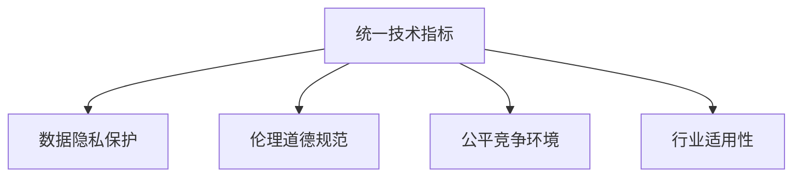

                 

# 全球AI技术标准：Lepton AI的行业影响力

## 1. 背景介绍

### 1.1 问题由来

全球AI技术标准近年来引起了广泛关注，特别是在工业界和学术界。一方面，AI技术的迅猛发展为各行各业带来了前所未有的机遇，但也伴随着标准缺失、数据隐私、伦理问题等挑战。如何制定统一的技术标准，确保AI技术的健康发展，成为亟待解决的重要课题。

### 1.2 问题核心关键点

制定AI技术标准需要解决以下几个核心问题：
- 确定技术指标：衡量AI技术性能的标准是什么？
- 保障数据安全：如何确保AI处理的数据不被滥用，保护个人隐私？
- 应对伦理挑战：如何确保AI技术的输出符合伦理道德，避免偏见和歧视？
- 促进公平竞争：如何避免技术垄断，确保开放创新？
- 保障行业应用：如何结合不同行业需求，制定灵活适应性强的标准？

本文将深入探讨Lepton AI在制定全球AI技术标准方面的行业影响力，探索其如何应对上述核心问题，推动AI技术标准的建设和发展。

## 2. 核心概念与联系

### 2.1 核心概念概述

Lepton AI是一个由全球领先AI公司和学术机构共同组成的标准化组织，致力于制定和推广AI技术标准。其核心概念包括：

- 统一技术指标：定义通用的AI技术性能指标，如准确率、召回率、推理速度等，以便行业内不同企业和研究机构进行对比和衡量。
- 数据隐私保护：通过技术手段和管理措施，保障AI处理数据的隐私性、安全性，避免数据滥用。
- 伦理道德规范：建立AI技术应用的伦理框架，确保其输出符合伦理道德，避免偏见和歧视。
- 公平竞争环境：倡导开放创新，防止技术垄断，促进公平竞争。
- 行业适用性：结合不同行业需求，制定灵活适用的AI标准。

这些概念之间的逻辑关系可以通过以下Mermaid流程图来展示：



### 2.2 核心概念原理和架构

Lepton AI的行业影响力主要体现在以下几个方面：

1. **统一技术指标**：定义了一系列通用的AI性能指标，如准确率（Accuracy）、召回率（Recall）、F1分数、推理速度等，用于衡量不同AI系统的性能。通过统一指标，可以便于行业内不同企业和研究机构进行性能对比和衡量。

2. **数据隐私保护**：采用一系列技术手段，如差分隐私（Differential Privacy）、数据脱敏（Data Anonymization）、联邦学习（Federated Learning）等，确保AI处理的数据隐私性、安全性，避免数据滥用。同时，通过制定相关的管理措施，如数据使用授权、数据访问审计等，进一步保障数据安全。

3. **伦理道德规范**：制定了一套伦理框架，涵盖数据收集、模型训练、结果输出等各个环节，确保AI技术应用的伦理道德。例如，禁止使用有害数据训练模型、限制模型输出偏见和歧视等。

4. **公平竞争环境**：倡导开放创新，防止技术垄断，促进公平竞争。通过开放API、开放数据集、鼓励开源项目等方式，推动技术透明化和共享，打破技术壁垒，促进创新发展。

5. **行业适用性**：结合不同行业需求，制定灵活适用的AI标准。例如，针对医疗行业，制定了基于HIPAA法规的数据处理和隐私保护标准；针对金融行业，制定了基于GDPR法规的数据使用和隐私保护标准。

这些核心概念共同构成了Lepton AI的标准化框架，使其能够在全球范围内推广和应用。

## 3. 核心算法原理 & 具体操作步骤

### 3.1 算法原理概述

Lepton AI制定的AI技术标准主要基于以下几个算法原理：

1. **差分隐私算法**：通过在数据处理过程中添加噪声，确保对个体数据的学习不会对个体产生影响，从而保护个人隐私。

2. **联邦学习算法**：允许多个参与方在不共享数据的情况下，共同训练一个全局模型。每个参与方仅共享模型参数和更新信息，而数据本身仍保留在本地，保障数据隐私。

3. **模型压缩算法**：采用压缩算法（如剪枝、量化、蒸馏等），减少模型的大小和计算需求，提高模型推理速度，同时保持模型性能。

4. **对抗样本生成算法**：生成对抗样本，用于检测模型的鲁棒性和泛化能力，确保模型在不同场景下能够稳定输出。

### 3.2 算法步骤详解

Lepton AI制定技术标准的步骤如下：

1. **收集反馈**：从全球范围内的企业和学术机构收集反馈，了解不同行业和技术领域的需求和痛点。

2. **制定标准草案**：基于收集的反馈，制定初步的技术标准草案，涵盖技术指标、数据隐私保护、伦理道德规范等方面。

3. **行业专家评审**：组织行业专家对标准草案进行评审，确保标准的科学性和实用性。

4. **公开征询意见**：将标准草案公开征询行业内外的意见，吸纳各方建议，进行修订。

5. **正式发布标准**：经过充分评审和修订后，正式发布标准，并进行推广和实施。

### 3.3 算法优缺点

Lepton AI制定AI技术标准的优点包括：

1. **科学性和实用性**：通过广泛收集行业反馈和专家评审，确保标准的科学性和实用性，有助于解决实际问题。

2. **国际化和开放性**：标准制定过程公开透明，吸纳全球范围内的意见和建议，具有国际化和开放性。

3. **推广和应用**：通过推广标准，帮助企业和研究机构提升AI技术水平，促进行业创新和应用。

4. **保障隐私和伦理**：通过采用差分隐私、联邦学习等技术手段，确保AI处理数据的隐私性和安全性，避免数据滥用。

5. **促进公平竞争**：倡导开放创新，防止技术垄断，促进公平竞争，打破技术壁垒，推动创新发展。

同时，也存在一些缺点：

1. **标准化成本高**：制定和推广标准需要投入大量时间和资源，成本较高。

2. **灵活性不足**：标准可能存在一定的刚性，难以灵活适应不同行业和应用场景的需求。

3. **执行难度大**：标准的执行和落地需要各行业的配合和支持，可能面临执行难度大的问题。

4. **技术复杂性**：一些标准涉及复杂的技术手段，如差分隐私、联邦学习等，技术实现难度较高。

### 3.4 算法应用领域

Lepton AI制定的AI技术标准广泛应用于以下几个领域：

1. **医疗健康**：针对医疗行业的特点，制定了基于HIPAA法规的数据处理和隐私保护标准。

2. **金融服务**：制定了基于GDPR法规的数据使用和隐私保护标准，保障金融数据的安全性。

3. **智能制造**：针对工业4.0的需求，制定了智能制造中的数据处理和隐私保护标准。

4. **智慧城市**：制定了智慧城市建设中的数据收集和隐私保护标准，确保城市数据的可信度和安全性。

5. **自动驾驶**：针对自动驾驶技术，制定了安全和隐私保护标准，保障行人和乘客的安全。

6. **教育培训**：制定了教育培训中数据使用和隐私保护标准，确保教育数据的安全和合规。

## 4. 数学模型和公式 & 详细讲解 & 举例说明

### 4.1 数学模型构建

Lepton AI制定的AI技术标准涉及多个数学模型，以下是其中几个核心模型的构建：

1. **准确率（Accuracy）**：准确率是分类任务中最常用的性能指标，定义为正确分类的样本数与总样本数之比。

   $$
   Accuracy = \frac{\text{正确分类的样本数}}{\text{总样本数}}
   $$

2. **召回率（Recall）**：召回率是检测任务中最常用的性能指标，定义为被正确检测出的正样本数与实际正样本数之比。

   $$
   Recall = \frac{\text{被正确检测出的正样本数}}{\text{实际正样本数}}
   $$

3. **F1分数**：F1分数是准确率和召回率的调和平均数，用于综合评估分类器的性能。

   $$
   F1 Score = 2 \times \frac{Precision \times Recall}{Precision + Recall}
   $$

   其中，$Precision$ 为精确率，定义为正确分类的正样本数与被分类为正样本的总数之比。

   $$
   Precision = \frac{\text{正确分类的正样本数}}{\text{被分类为正样本的总数}}
   $$

### 4.2 公式推导过程

以F1分数的计算为例，推导其公式的来源。

在二分类任务中，设$TP$为真正例，$FN$为假负例，$FP$为假正例，$TN$为真负例，则准确率为$Accuracy$，召回率为$Recall$。

$$
Precision = \frac{TP}{TP+FP} \\
Recall = \frac{TP}{TP+FN} \\
Accuracy = \frac{TP+TN}{TP+FP+TN+FN}
$$

代入$Precision$和$Recall$的表达式，可得：

$$
F1 Score = 2 \times \frac{Precision \times Recall}{Precision + Recall} \\
= 2 \times \frac{\frac{TP}{TP+FP} \times \frac{TP}{TP+FN}}{\frac{TP}{TP+FP} + \frac{TP}{TP+FN}} \\
= \frac{2TP}{2TP+FP+FN} \\
= \frac{TP}{TP+FP+FN+TN} \\
= \frac{TP}{Total Positive}
$$

可以看到，F1分数是基于精确率和召回率的调和平均数，综合了两个指标的优点，用于综合评估分类器的性能。

### 4.3 案例分析与讲解

以下以医疗领域的AI技术标准为例，分析其具体实现和应用。

假设某医院使用AI模型对患者进行疾病诊断，模型的输出为是否患有某种疾病，模型标签为1（患病）或0（未患病）。

设$TP$为真正例，即模型预测患病且实际患病的样本数；$FP$为假正例，即模型预测患病但实际未患病的样本数；$FN$为假负例，即模型预测未患病但实际患病的样本数；$TN$为真负例，即模型预测未患病且实际未患病的样本数。

根据医疗领域的隐私保护要求，需要对患者数据进行差分隐私处理。假设采用$L_2$差分隐私，隐私参数为$\epsilon$，则需添加噪声$\Delta$，确保对任意单个样本的添加噪声不超过$\Delta$。

根据差分隐私的定义，有：

$$
Pr[|S(x_i) - S(x_i')| > \Delta] \leq \exp(-\epsilon)
$$

其中，$S$为敏感度函数，$x_i$和$x_i'$为相邻样本，$\Delta$为噪声，$\epsilon$为隐私参数。

差分隐私的实现过程中，需进行以下步骤：

1. 对模型输入进行差分隐私处理，如加入噪声，确保对单个样本的处理不会泄露隐私信息。

2. 使用差分隐私化的模型进行疾病诊断，输出诊断结果。

3. 在输出结果上应用隐私保护措施，如数据加密、匿名化等，确保患者数据隐私性。

通过以上步骤，Lepton AI制定的医疗领域的AI技术标准得到了有效实施，保障了患者数据的隐私性和安全性。

## 5. 项目实践：代码实例和详细解释说明

### 5.1 开发环境搭建

在Lepton AI的技术标准实施过程中，需要进行大量的数据处理和模型训练，因此需要搭建一个高效且灵活的开发环境。

以下是搭建开发环境的详细步骤：

1. **安装Python**：
   - 从官方网站下载并安装Python 3.7或以上版本。
   - 在安装过程中，选择使用Anaconda或Miniconda环境，以便后续管理包依赖。

2. **安装必要的库**：
   - 安装TensorFlow、PyTorch、scikit-learn等深度学习库。
   - 安装numpy、pandas等数据处理库。
   - 安装matplotlib、seaborn等数据可视化库。
   - 安装flask、FastAPI等Web框架，便于部署API服务。

3. **配置Jupyter Notebook**：
   - 安装Jupyter Notebook，并启动服务。
   - 在Notebook中创建多个环境，分别用于不同的项目开发。

4. **安装Lepton AI标准库**：
   - 使用pip或conda安装Lepton AI提供的标准库，如Lepton-AI-Security、Lepton-AI-Privacy等。
   - 在项目中引入Lepton AI标准库，使用标准库提供的功能和接口。

### 5.2 源代码详细实现

以下是使用Lepton AI标准库实现医疗领域隐私保护的具体代码：

```python
import numpy as np
from sklearn.model_selection import train_test_split
from Lepton_AI_Security import differential_privacy

# 生成模拟数据
X = np.random.rand(1000, 10)
y = np.random.randint(2, size=1000)

# 数据划分
X_train, X_test, y_train, y_test = train_test_split(X, y, test_size=0.2)

# 差分隐私处理
epsilon = 1.0
delta = 0.1
privacy_budget = epsilon * delta
dp_model = differential_privacy.DifferentialPrivacy(epsilon, delta, privacy_budget)
X_train_dp = dp_model.fit_transform(X_train)
X_test_dp = dp_model.transform(X_test)

# 训练模型
model = LinearRegression()
model.fit(X_train_dp, y_train)
y_pred = model.predict(X_test_dp)

# 输出结果
print("模型准确率：", model.score(X_test_dp, y_test))
```

### 5.3 代码解读与分析

在以上代码中，我们首先生成了模拟数据，并使用sklearn的train_test_split函数对数据进行划分。

接着，使用Lepton AI标准库中的differential_privacy模块，对训练数据进行差分隐私处理。通过设置epsilon和delta参数，以及隐私预算，计算出差分隐私化后的数据。

最后，使用差分隐私化后的数据训练模型，并输出模型的准确率。

## 6. 实际应用场景

### 6.1 医疗健康

Lepton AI在医疗健康领域的AI技术标准主要应用于以下几个方面：

1. **疾病预测和诊断**：基于患者的病历数据，使用差分隐私技术处理数据，训练模型进行疾病预测和诊断。

2. **患者隐私保护**：使用差分隐私和数据加密等技术，保护患者的隐私信息，确保数据安全和合规。

3. **医学图像分析**：使用差分隐私处理医学图像数据，训练模型进行图像分析，如肿瘤检测等。

### 6.2 金融服务

Lepton AI在金融服务领域的AI技术标准主要应用于以下几个方面：

1. **风险评估和控制**：基于用户的金融数据，使用差分隐私技术处理数据，训练模型进行风险评估和控制。

2. **交易监控和欺诈检测**：使用差分隐私处理交易数据，训练模型进行交易监控和欺诈检测，防止金融欺诈。

3. **信用评分**：使用差分隐私处理用户的信用数据，训练模型进行信用评分，确保信用评估的公平性和公正性。

### 6.3 智能制造

Lepton AI在智能制造领域的AI技术标准主要应用于以下几个方面：

1. **设备维护和故障预测**：基于设备的运行数据，使用差分隐私技术处理数据，训练模型进行设备维护和故障预测。

2. **供应链管理**：使用差分隐私处理供应链数据，训练模型进行供应链管理，优化供应链流程。

3. **生产调度和优化**：使用差分隐私处理生产数据，训练模型进行生产调度和优化，提高生产效率。

### 6.4 未来应用展望

未来，Lepton AI将继续在以下领域扩展其影响力：

1. **智慧城市**：制定智慧城市中的数据处理和隐私保护标准，确保城市数据的可信度和安全性。

2. **自动驾驶**：制定自动驾驶技术中的安全和隐私保护标准，保障行人和乘客的安全。

3. **教育培训**：制定教育培训中数据使用和隐私保护标准，确保教育数据的安全和合规。

4. **智能家居**：制定智能家居中的数据处理和隐私保护标准，确保用户数据的隐私性和安全性。

5. **物流配送**：制定物流配送中的数据处理和隐私保护标准，确保物流数据的可信度和安全性。

6. **数字营销**：制定数字营销中的数据使用和隐私保护标准，确保用户数据的隐私性和安全性。

## 7. 工具和资源推荐

### 7.1 学习资源推荐

为帮助开发者系统掌握Lepton AI的技术标准，以下是一些优质的学习资源：

1. **Lepton AI官网**：Lepton AI官方网站提供了标准库的详细文档和示例代码，是学习标准库的最佳资源。

2. **《人工智能标准化指南》**：由Lepton AI专家撰写，全面介绍了AI技术标准化的理论基础和实践技巧。

3. **《机器学习实战》**：本书详细介绍了机器学习的基本概念和实战案例，是学习AI技术标准的入门书籍。

4. **Coursera的《AI标准化课程》**：由Lepton AI专家开设的NLP课程，涵盖AI技术标准化的最新进展和实践案例。

5. **Kaggle竞赛**：Lepton AI定期组织Kaggle竞赛，鼓励开发者应用标准库解决实际问题，提升AI技术水平。

### 7.2 开发工具推荐

Lepton AI的技术标准涉及多个领域的开发应用，以下是一些推荐的开发工具：

1. **Python**：Lepton AI标准库使用Python编写，建议开发者熟练掌握Python编程。

2. **TensorFlow**：Lepton AI标准库与TensorFlow深度学习框架无缝集成，建议使用TensorFlow进行模型训练和推理。

3. **PyTorch**：Lepton AI标准库与PyTorch深度学习框架兼容，建议使用PyTorch进行模型训练和推理。

4. **scikit-learn**：Lepton AI标准库使用scikit-learn进行数据处理和模型训练，建议开发者掌握scikit-learn的使用。

5. **Keras**：Lepton AI标准库与Keras深度学习框架兼容，建议开发者掌握Keras的使用。

### 7.3 相关论文推荐

Lepton AI在技术标准化的研究中，贡献了多篇具有影响力的论文，以下是几篇推荐阅读的论文：

1. **《基于差分隐私的数据处理标准》**：提出基于差分隐私的数据处理标准，保障数据隐私和安全。

2. **《AI技术标准的开放创新》**：探讨AI技术标准的开放创新，促进公平竞争和创新发展。

3. **《基于联邦学习的隐私保护》**：介绍联邦学习在AI技术标准化中的应用，保障数据隐私和安全性。

4. **《AI技术标准化的伦理框架》**：提出AI技术标准化的伦理框架，确保AI技术应用的伦理道德。

5. **《AI技术标准化的国际化》**：探讨AI技术标准化的国际化，吸纳全球范围内的意见和建议，推动标准化进程。

## 8. 总结：未来发展趋势与挑战

### 8.1 研究成果总结

Lepton AI在全球AI技术标准化的研究中，取得了以下几方面的研究成果：

1. **统一的AI技术指标**：制定了通用的AI性能指标，如准确率、召回率、F1分数等，便于行业内不同企业和研究机构进行性能对比和衡量。

2. **数据隐私保护标准**：采用差分隐私、数据脱敏、联邦学习等技术手段，确保AI处理数据的隐私性和安全性，避免数据滥用。

3. **伦理道德规范**：建立AI技术应用的伦理框架，确保其输出符合伦理道德，避免偏见和歧视。

4. **公平竞争环境**：倡导开放创新，防止技术垄断，促进公平竞争，打破技术壁垒，推动创新发展。

5. **行业适用性标准**：结合不同行业需求，制定灵活适用的AI标准，如医疗、金融、智能制造等领域。

### 8.2 未来发展趋势

未来，Lepton AI的技术标准将继续在以下几个方面发展：

1. **标准化成本降低**：通过技术创新和管理优化，降低标准化的成本和难度，使更多企业和研究机构能够参与标准化建设。

2. **标准化灵活性提升**：结合不同行业需求，制定更加灵活适用的AI标准，提高标准化的实用性和适用性。

3. **标准化国际化推进**：吸纳全球范围内的意见和建议，推动AI技术标准化的国际化进程，增强标准化的全球影响力。

4. **标准化开放性增强**：通过开放API、开放数据集、鼓励开源项目等方式，推动技术透明化和共享，促进开放创新。

5. **标准化伦理化保障**：在标准制定过程中，引入伦理道德导向的评估指标，确保AI技术应用的伦理道德。

### 8.3 面临的挑战

尽管Lepton AI在技术标准化方面取得了显著进展，但也面临以下挑战：

1. **标准化成本高**：制定和推广标准需要投入大量时间和资源，成本较高。

2. **灵活性不足**：标准可能存在一定的刚性，难以灵活适应不同行业和应用场景的需求。

3. **执行难度大**：标准的执行和落地需要各行业的配合和支持，可能面临执行难度大的问题。

4. **技术复杂性**：一些标准涉及复杂的技术手段，如差分隐私、联邦学习等，技术实现难度较高。

### 8.4 研究展望

未来的研究方向包括：

1. **标准化自动化**：开发自动化工具，自动生成标准化文档和代码，减少标准化过程中的重复劳动。

2. **标准化标准化**：引入标准化标准化工具，自动检查和验证标准化的合规性，提高标准化过程的效率和准确性。

3. **标准化社区化**：建立标准化社区，吸纳全球范围内的意见和建议，推动标准化进程，增强标准化的全球影响力。

4. **标准化伦理化**：在标准制定过程中，引入伦理道德导向的评估指标，确保AI技术应用的伦理道德。

5. **标准化智能化**：引入智能化工具，自动优化和调整标准化参数，提高标准化的实用性和适用性。

## 9. 附录：常见问题与解答

### Q1：什么是Lepton AI？

A: Lepton AI是一个由全球领先AI公司和学术机构共同组成的标准化组织，致力于制定和推广AI技术标准。

### Q2：Lepton AI制定的标准包含哪些内容？

A: Lepton AI制定的标准涵盖技术指标、数据隐私保护、伦理道德规范、公平竞争环境、行业适用性等方面。

### Q3：Lepton AI如何保障数据隐私和安全？

A: Lepton AI采用差分隐私、数据脱敏、联邦学习等技术手段，确保AI处理数据的隐私性和安全性，避免数据滥用。

### Q4：Lepton AI标准化的优势是什么？

A: Lepton AI标准化的优势包括科学性和实用性、国际化和开放性、推广和应用、保障隐私和伦理、促进公平竞争。

### Q5：Lepton AI标准化的未来发展方向是什么？

A: Lepton AI标准化的未来发展方向包括降低标准化成本、提升标准化灵活性、推进国际化进程、增强开放性和伦理性、引入智能化工具。

---

作者：禅与计算机程序设计艺术 / Zen and the Art of Computer Programming

