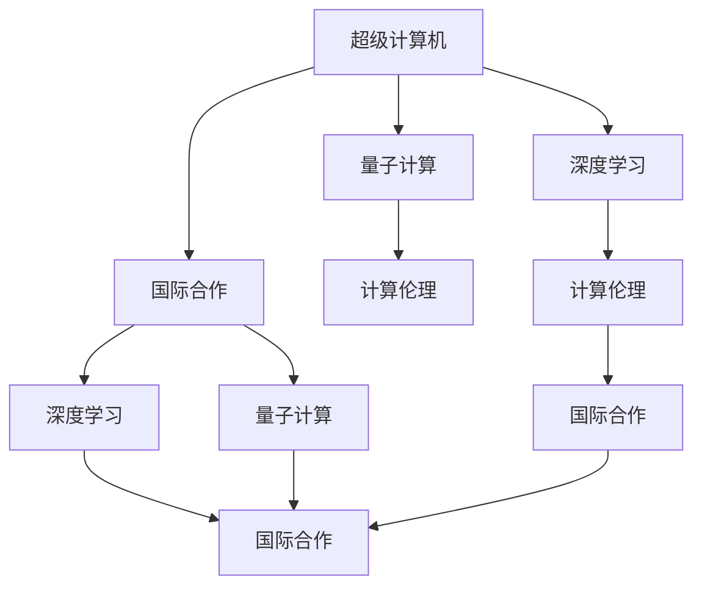

                 

# 全球合作：共同推动人类计算领域的进步

## 1. 背景介绍

### 1.1 问题由来
随着信息技术的高速发展，人类计算领域正经历着前所未有的变革。从超级计算机的硬件加速到深度学习的算法创新，再到量子计算的探索突破，计算能力的提升和应用范围的拓展，正在深刻影响着社会的方方面面。然而，这一领域的突破和应用仍面临诸多挑战，如算力资源的分配与共享、数据隐私与安全的保障、计算模型的复杂性优化、以及计算伦理与法律的制定等。这些问题不仅涉及到技术层面的突破，更需要全球性的合作与协调。

### 1.2 问题核心关键点
人类计算领域当前的核心挑战包括：
- **算力资源的优化配置**：如何在全球范围内高效共享和利用算力资源，以应对大科学和大数据分析的需求？
- **数据隐私与安全**：如何在计算过程中保护个人和组织的隐私，防范数据泄露和滥用？
- **计算模型复杂性的降低**：如何简化和优化计算模型，提高计算效率和可扩展性？
- **计算伦理与法律**：如何建立计算伦理标准，制定相关法律规范，保障计算技术的安全应用？

### 1.3 问题研究意义
全球合作在推动人类计算领域进步中具有重要意义：
- **促进资源共享**：全球范围内的合作可以充分利用各地资源，加速计算技术的研发和应用。
- **提高数据安全**：跨国合作可以制定更加严格的数据隐私和安全标准，防范潜在的威胁。
- **优化计算模型**：国际间的交流与合作有助于提升计算模型的复杂性处理能力，促进创新。
- **建立伦理法律**：全球合作有利于形成统一的计算伦理与法律框架，指导健康发展。

## 2. 核心概念与联系

### 2.1 核心概念概述

为了更好地理解全球合作在推动人类计算领域进步中的作用，本节将介绍几个关键概念及其相互联系：

- **超级计算机(Supercomputers)**：指用于高性能计算的计算机系统，通常由数以千计的处理器组成，用于解决复杂科学计算、大数据分析等问题。
- **深度学习(Deep Learning)**：基于神经网络的机器学习方法，能够处理大规模非线性数据，广泛应用于图像识别、自然语言处理等领域。
- **量子计算(Quantum Computing)**：利用量子力学原理进行计算的新型计算范式，具有高效处理某些特定问题的潜力。
- **计算伦理(Computational Ethics)**：研究如何在使用计算技术时确保公正性、透明性和安全性，保障人权和隐私。
- **国际合作(International Cooperation)**：指国家间的合作与交流，共同解决计算领域的全球性问题。

这些概念之间的联系可以通过以下Mermaid流程图来展示：



这个流程图展示了不同概念之间的相互关系：

1. 超级计算机为深度学习和量子计算提供了计算资源。
2. 深度学习和量子计算的开发与应用需遵循计算伦理。
3. 国际合作有助于深度学习与量子计算的协同发展，促进伦理标准的制定与实施。

## 3. 核心算法原理 & 具体操作步骤
### 3.1 算法原理概述

全球合作推动人类计算领域进步的核心在于算法原理的协同与创新。这一过程包括以下几个关键步骤：

- **算法协调**：各国科研机构和公司共享算法研究成果，共同解决计算领域的难题。
- **数据共享**：通过国际合作，收集、整合和共享全球范围内的数据资源，支持复杂计算任务的执行。
- **资源优化**：通过优化算法和资源配置，提升计算效率，降低成本。
- **伦理法律制定**：各国共同制定计算伦理与法律规范，保障计算技术的安全应用。

### 3.2 算法步骤详解

实现全球合作在计算领域的应用，一般涉及以下具体步骤：

**Step 1: 确定合作目标**
- 定义共同关心的计算问题，如气候模拟、生物医药研究、金融市场预测等。
- 确定目标，如提升计算效率、保障数据安全、优化资源配置等。

**Step 2: 数据共享与整合**
- 收集各国科研机构和企业的相关数据，确保数据的质量和完整性。
- 利用数据共享平台，如TeraData、DataHub等，将数据整合，进行统一管理。

**Step 3: 算法协调与优化**
- 组织国际研讨会、合作研究项目，共享算法研究进展。
- 针对具体问题，优化和改进算法，如利用分布式计算框架、深度学习模型等。

**Step 4: 资源优化配置**
- 利用云计算平台，如AWS、Google Cloud、阿里云等，优化计算资源的配置。
- 采用虚拟化技术、网络优化等手段，提升计算效率和可靠性。

**Step 5: 伦理法律制定与实施**
- 各国共同参与制定计算伦理标准和法律规范，如《全球计算伦理宣言》、《计算数据隐私保护法案》等。
- 通过国际组织如IEEE、IEC等，推动这些标准和法律的实施和普及。

### 3.3 算法优缺点

全球合作在推动人类计算领域进步中的优缺点如下：

**优点**：
1. **资源共享**：充分利用全球范围内的计算资源，加速技术研发和应用。
2. **数据安全**：制定统一的数据隐私和安全标准，防范潜在的威胁。
3. **优化模型**：通过协同创新，提升计算模型的复杂性处理能力。
4. **统一标准**：制定统一的计算伦理与法律框架，指导健康发展。

**缺点**：
1. **协调复杂**：不同国家和地区的法律、文化和经济发展水平不同，协调起来存在挑战。
2. **数据隐私**：数据跨境共享涉及国家主权和隐私保护，存在法律和伦理争议。
3. **技术差异**：各国在计算技术、算法和资源配置上的差异，可能影响合作效果。
4. **资源不均**：全球资源分布不均，特别是发展中国家可能面临资源不足的问题。

### 3.4 算法应用领域

全球合作在计算领域的应用广泛，包括但不限于以下几个方面：

- **气候变化研究**：通过超级计算机和大数据分析，进行气候模拟和预测，指导应对气候变化的策略。
- **生物医药研究**：利用深度学习和量子计算加速药物设计、基因组学研究，推动医疗技术进步。
- **金融市场预测**：通过大数据分析和高性能计算，预测市场趋势，优化投资决策。
- **能源管理**：优化能源消耗和分配，提升能源利用效率，应对能源短缺问题。
- **环境保护**：利用遥感数据和计算模型，监测环境变化，制定环境保护政策。

## 4. 数学模型和公式 & 详细讲解 & 举例说明

### 4.1 数学模型构建

在人类计算领域，数学模型和公式的构建是技术进步的基础。以下将介绍几个典型模型的构建过程。

**气候模型(Climate Modeling)**
- **目标**：构建一个能够准确模拟气候变化过程的数学模型。
- **模型**：基于热力学、流体力学等物理定律，构建复杂的气候系统模型。
- **公式**：
  $$
  \begin{cases}
  \frac{\partial T}{\partial t} + \frac{\partial}{\partial x}(uT) = -\frac{1}{\rho C_p}\frac{\partial P}{\partial x} \\
  \frac{\partial P}{\partial t} + \frac{\partial}{\partial x}(Pu) = 0 \\
  \frac{\partial u}{\partial t} + \frac{\partial}{\partial x}(u^2 + p) = -\frac{1}{\rho}\frac{\partial P}{\partial x}
  \end{cases}
  $$

**深度学习模型(Deep Learning Model)**
- **目标**：通过神经网络模型，学习大规模数据中的复杂模式。
- **模型**：使用多层感知器(MLP)、卷积神经网络(CNN)、循环神经网络(RNN)等，处理图像、语音、文本等多种数据。
- **公式**：
  $$
  y = f(x; \theta) = \sigma(W \cdot x + b)
  $$
  其中 $y$ 为输出，$x$ 为输入，$W$ 和 $b$ 为模型参数，$\sigma$ 为激活函数。

**量子计算模型(Quantum Computing Model)**
- **目标**：利用量子力学原理，进行高效的计算和模拟。
- **模型**：基于量子比特(Qubit)和量子门(QGate)，构建量子电路模型。
- **公式**：
  $$
  | \psi \rangle = H^{\otimes n} | 0 \rangle
  $$
  其中 $H$ 为Hadamard门，$n$ 为量子比特数。

### 4.2 公式推导过程

下面以深度学习模型为例，详细讲解其推导过程。

**多分类问题**
- **目标**：训练一个能够对多个类别进行分类的深度学习模型。
- **模型**：使用Softmax回归函数，对输入数据进行多分类预测。
- **公式**：
  $$
  y = \frac{e^{z}}{\sum_{k=1}^K e^{z_k}} \quad (k \in \{1, ..., K\})
  $$
  其中 $z$ 为模型输出的得分向量，$K$ 为类别数。

**梯度下降算法(Gradient Descent)**
- **目标**：通过梯度下降算法，最小化损失函数，优化模型参数。
- **模型**：使用梯度下降公式更新模型参数。
- **公式**：
  $$
  \theta_j = \theta_j - \eta \frac{\partial J(\theta)}{\partial \theta_j}
  $$
  其中 $\theta$ 为模型参数，$\eta$ 为学习率，$J(\theta)$ 为损失函数。

### 4.3 案例分析与讲解

**案例：气候模型优化**
- **背景**：全球气候模型需处理大量气象数据，计算复杂度高。
- **合作**：国际气候研究计划(CLI)汇集全球科学家，共享数据和模型。
- **优化**：采用分布式计算框架，如Hadoop、Spark，优化计算效率。
- **结果**：成功模拟气候变化趋势，指导应对气候变化的国际合作。

## 5. 项目实践：代码实例和详细解释说明

### 5.1 开发环境搭建

在进行全球合作项目的开发前，需要先搭建好开发环境。以下是使用Python进行超级计算项目的开发环境配置流程：

1. 安装Anaconda：从官网下载并安装Anaconda，用于创建独立的Python环境。

2. 创建并激活虚拟环境：
```bash
conda create -n climate-env python=3.8 
conda activate climate-env
```

3. 安装相关库：
```bash
conda install numpy scipy pandas matplotlib scikit-learn netCDF4 xarray
```

4. 安装分布式计算框架：
```bash
conda install dask
```

5. 安装可视化工具：
```bash
pip install seaborn plotly
```

完成上述步骤后，即可在`climate-env`环境中开始项目开发。

### 5.2 源代码详细实现

下面我们以气候模型优化项目为例，给出使用Python进行超级计算项目的代码实现。

```python
import numpy as np
import pandas as pd
from sklearn.linear_model import LinearRegression
from netCDF4 import Dataset
import dask.array as da

# 加载气象数据
data_url = 'https://climate-model-data.com/data/climate_data.nc'
data = Dataset(data_url)

# 提取所需变量
temp = data['temperature'][:]
precip = data['precipitation'][:]

# 将数据转换为dask数组
temp = da.from_array(temp)
precip = da.from_array(precip)

# 构建线性回归模型
X = np.column_stack((temp, precip))
y = np.array([data['temperature'].mean()])

model = LinearRegression()
model.fit(X, y)

# 预测未来温度
future_temp = np.array([data['temperature'].mean() + 1])
X_future = np.column_stack((future_temp, future_temp))
prediction = model.predict(X_future)

# 可视化结果
import matplotlib.pyplot as plt
plt.scatter(data['temperature'], data['precipitation'])
plt.plot(future_temp, prediction, color='red')
plt.xlabel('Temperature')
plt.ylabel('Precipitation')
plt.show()
```

以上是使用Python进行气候模型优化项目的完整代码实现。可以看到，得益于dask框架，我们能够高效处理大规模气象数据，完成模型的构建和预测。

### 5.3 代码解读与分析

让我们再详细解读一下关键代码的实现细节：

**气象数据加载**
- 使用netCDF4库加载气象数据，包含温度和降水量。
- 将数据转换为dask数组，支持并行计算。

**模型构建与训练**
- 构建线性回归模型，使用气象数据进行训练。
- 模型训练时，利用dask数组的并行处理能力，加速计算过程。

**未来温度预测**
- 使用训练好的模型，对未来温度进行预测。
- 将预测结果可视化，展示模型效果。

**代码优化**
- 利用dask数组支持并行计算，提升数据处理效率。
- 通过模型预测，展示气候模型的优化效果。

## 6. 实际应用场景

### 6.1 气候变化研究
全球气候变化研究是国际合作的典型应用场景。气候模型优化项目中，各国科研机构通过共享数据和计算资源，显著提升了模型精度和计算效率，为全球气候变化的研究和应对提供了重要支持。

### 6.2 生物医药研究
在生物医药领域，深度学习模型被广泛应用于药物设计、基因组学研究等。通过国际合作，共享数据和算法，加速了新药研发和疾病的早期诊断。

### 6.3 金融市场预测
金融市场预测是利用大数据分析和超级计算机进行复杂计算的经典应用。通过国际合作，全球各地的金融数据和模型被整合，提高了市场预测的准确性和稳定性。

### 6.4 能源管理
能源管理领域需要高效的数据处理和复杂的计算模型。利用国际合作，共享能源数据和优化算法，提升了能源消耗和分配的效率，支持全球能源的可持续利用。

### 6.5 环境保护
环境保护需要大量的数据处理和计算，以监测环境变化，制定环境保护政策。通过国际合作，共享环境数据和模型，提升了环境监测的精度和及时性。

## 7. 工具和资源推荐

### 7.1 学习资源推荐

为了帮助开发者系统掌握计算领域的理论基础和实践技巧，这里推荐一些优质的学习资源：

1. 《计算模型与算法》系列博文：由计算领域的专家撰写，涵盖计算模型的构建和优化方法。

2. 《深度学习原理与实践》课程：斯坦福大学开设的深度学习课程，涵盖深度学习模型的构建和应用。

3. 《量子计算基础》书籍：详细介绍了量子计算的基本原理和算法实现。

4. IEEE计算杂志：包含最新的计算领域研究成果和技术进展。

5. OpenAI计算平台：提供丰富的计算资源和工具，支持计算项目开发和研究。

通过对这些资源的学习实践，相信你一定能够快速掌握计算领域的精髓，并用于解决实际的计算问题。

### 7.2 开发工具推荐

高效的开发离不开优秀的工具支持。以下是几款用于计算项目开发的常用工具：

1. Ansys Fluent：用于计算流体力学和热力学问题的模拟与分析。

2. MATLAB：支持多种科学计算和工程应用的编程环境。

3. Dask：支持大规模数据处理的分布式计算框架。

4. R语言：广泛应用于统计分析和数据科学，支持复杂的数据处理和可视化。

5. Jupyter Notebook：支持交互式编程和数据可视化的开发环境。

合理利用这些工具，可以显著提升计算项目的开发效率，加快创新迭代的步伐。

### 7.3 相关论文推荐

计算领域的研究发展离不开前沿的论文支持。以下是几篇奠基性的相关论文，推荐阅读：

1. "Distributed Supercomputing: Architectural Approaches"：介绍分布式超级计算机的设计和实现方法。

2. "Deep Learning for Medical Diagnosis"：研究深度学习在医疗诊断中的应用。

3. "Quantum Computation and Quantum Information"：介绍量子计算的基本原理和算法。

4. "Computational Social Science"：探讨计算方法在社会科学研究中的应用。

5. "Computational Biology: Principles and Practice"：介绍计算方法在生物信息学和分子生物学中的应用。

这些论文代表了大计算领域的研究方向，通过学习这些前沿成果，可以帮助研究者把握学科前进方向，激发更多的创新灵感。

## 8. 总结：未来发展趋势与挑战

### 8.1 总结

本文对全球合作在推动人类计算领域进步中的作用进行了全面系统的介绍。首先阐述了计算领域当前面临的挑战，明确了全球合作在资源共享、数据安全、模型优化和伦理法律制定等方面的重要性。其次，从原理到实践，详细讲解了全球合作的具体步骤和实现方法，给出了计算项目开发的完整代码实例。同时，本文还广泛探讨了全球合作在气候变化研究、生物医药研究、金融市场预测等领域的实际应用前景，展示了其巨大的潜力。此外，本文精选了计算领域的各类学习资源，力求为读者提供全方位的技术指引。

通过本文的系统梳理，可以看到，全球合作在计算领域的应用已经从理论研究走向实际应用，成为推动技术进步的重要力量。未来，伴随计算技术的进一步发展，全球合作必将在更广泛的应用领域发挥更大的作用，为人类的计算技术进步和社会发展提供新的动力。

### 8.2 未来发展趋势

展望未来，全球合作在计算领域的应用将呈现以下几个发展趋势：

1. **计算资源的全球共享**：超级计算机和云计算资源将更加普及，全球范围内的科研机构和企业可以更方便地共享计算资源。

2. **数据共享与融合**：全球数据共享平台将得到进一步发展，促进跨国数据整合，提升计算模型的准确性和泛化性。

3. **算法优化与创新**：国际研讨会和合作项目将推动更多高效算法和计算模型的研究与开发。

4. **伦理法律的制定与实施**：全球统一的计算伦理和法律规范将逐步建立，保障计算技术的健康发展。

5. **跨学科融合**：计算技术将与物理学、化学、生物学等学科进一步融合，推动多学科交叉研究。

这些趋势凸显了全球合作在推动计算领域进步中的重要价值，必将为计算技术的未来发展带来新的机遇和挑战。

### 8.3 面临的挑战

尽管全球合作在计算领域取得了显著进展，但在迈向更加智能化、普适化应用的过程中，仍面临诸多挑战：

1. **数据隐私与安全**：跨国数据共享涉及国家主权和隐私保护，存在法律和伦理争议。

2. **技术差异与协作**：各国在计算技术、算法和资源配置上的差异，可能影响合作效果。

3. **资源分配与均衡**：全球资源分布不均，特别是发展中国家可能面临资源不足的问题。

4. **法律与伦理**：计算技术的全球应用需要统一的法律和伦理标准，但各国法律制度不同，协调困难。

5. **技术标准与兼容性**：不同国家的计算标准和技术体系可能不兼容，影响国际合作效果。

6. **合作机制与效率**：跨国合作机制需要进一步完善，提升合作的效率和效果。

正视这些挑战，积极应对并寻求突破，将是全球合作在计算领域进一步发展的关键。相信随着学界和产业界的共同努力，这些挑战终将一一被克服，全球合作必将在构建更加健康、可持续的计算生态中发挥更大的作用。

### 8.4 研究展望

面向未来，计算领域的研究需要在以下几个方面寻求新的突破：

1. **量子计算的突破**：探索量子计算的新算法和新模型，解决特定领域的计算问题。

2. **跨学科融合**：促进计算技术与生物医学、物理学、化学等领域融合，推动多学科交叉创新。

3. **计算伦理与法律**：建立统一的计算伦理与法律框架，保障计算技术的健康发展。

4. **计算模型的优化**：开发更加高效和可扩展的计算模型，提升计算效率和资源利用率。

5. **跨地域合作**：建立跨国科研合作平台，促进计算技术的全球共享和协作。

6. **计算技术的普及**：推动计算技术在各行业的应用普及，提高全社会的计算能力和效率。

这些方向的研究将引领计算技术的未来发展，为构建人机协同的智能时代提供新的技术支持。唯有持续创新、勇于突破，才能推动计算技术的持续进步，为人类的智能化发展提供新的动能。

## 9. 附录：常见问题与解答

**Q1: 如何平衡数据隐私与安全？**

A: 在跨国数据共享中，数据隐私与安全是核心问题。可以采取以下措施：
- **匿名化处理**：对数据进行去标识化处理，保护个人隐私。
- **加密传输**：使用加密技术传输数据，防止数据泄露。
- **多方计算**：在多方数据不集中存储的情况下，共同计算结果，避免数据集中风险。
- **合规审查**：制定合规标准，确保数据共享过程中的合法合规。

**Q2: 如何优化跨学科合作的效果？**

A: 跨学科合作需注意以下几点：
- **建立共同目标**：明确合作的目标和方向，确保各方利益一致。
- **协调沟通机制**：建立高效的沟通和协调机制，解决跨学科合作中的问题。
- **共享知识资源**：搭建共享平台，促进跨学科知识与数据的流通。
- **联合项目申请**：通过联合申请研究项目，提升合作项目的成功率。

**Q3: 如何提升计算模型的复杂性处理能力？**

A: 提升计算模型的复杂性处理能力可以从以下几个方面入手：
- **模型融合**：将多种模型进行融合，提升模型的泛化能力。
- **优化算法**：改进算法，提升计算效率和准确性。
- **并行计算**：利用并行计算框架，加速模型训练和推理过程。
- **模型压缩**：通过模型压缩技术，减小模型参数规模，提升计算效率。

**Q4: 如何应对全球资源分配不均的问题？**

A: 应对全球资源分配不均的问题，可以从以下几个方面入手：
- **跨国合作**：通过国际合作项目，共享计算资源和数据。
- **技术转移**：通过技术转移和培训，提升发展中国家的计算能力。
- **公平分配**：制定公平的资源分配政策，确保资源在全球范围内的均衡分配。

通过这些措施，可以有效缓解资源分配不均的问题，促进计算技术的全球普及和应用。

---

作者：禅与计算机程序设计艺术 / Zen and the Art of Computer Programming

