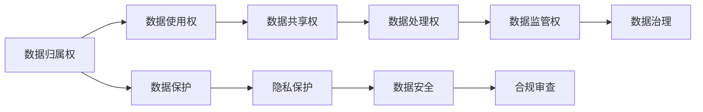

                 

# 全球脑与个人数据主权:信息时代的数据权益保护法

> 关键词：全球脑、个人数据主权、隐私保护、数据治理、人工智能伦理

## 1. 背景介绍

### 1.1 问题由来

随着互联网和信息技术的迅猛发展，大数据、云计算、人工智能等技术广泛应用到各个领域，极大地推动了经济社会发展，但同时也带来了诸多问题和挑战。其中，个人数据隐私和权益保护问题尤为突出。

在大数据时代，个人的数据无处不在、无时不在。从社交媒体、购物网站到智能家居、健康监测，个人的一举一动、一思一念都可能被数字化、数据化，形成庞大而复杂的数据集。如何有效管理和利用这些数据，既能促进技术进步，又能保障个人隐私和数据权益，成为社会各界关注的焦点。

近年来，全球范围内出现了“全球脑”（Global Brain）的概念。“全球脑”是一个以数据为载体、以人类智能为中心，全球互联互通的虚拟大脑。通过全球脑，可以实现数据的高效共享和融合，加速科学发现、技术创新和经济发展。然而，伴随着数据共享和使用的深入，个人数据主权问题也日益凸显，急需制定一套系统的数据权益保护法，确保数据使用的公平、公正和透明，推动全球脑的健康发展。

### 1.2 问题核心关键点

为了有效应对全球脑下的数据主权挑战，需要从以下几个关键点入手：

- **数据归属权**：明确数据归属，保障数据所有者的合法权益。
- **数据使用权**：规定数据使用的范围和方式，避免滥用。
- **数据共享权**：平衡数据共享和隐私保护，促进全球脑建设。
- **数据处理权**：规范数据处理流程，保障数据处理的质量和安全。
- **数据监管权**：建立数据监管机制，确保数据治理的有效性。

## 2. 核心概念与联系

### 2.1 核心概念概述

为更好地理解全球脑下的个人数据主权保护，本节将介绍几个关键概念：

- **全球脑（Global Brain）**：以数据为载体、以人类智能为中心，全球互联互通的虚拟大脑。通过全球脑，可以实现数据的共享和融合，加速科学发现、技术创新和经济发展。

- **数据归属权（Data Ownership）**：指数据所有者对其数据享有的排他性权利，包括占有、使用、收益和处分的权利。

- **数据使用权（Data Usage Rights）**：指数据使用者按照法定程序和条件，合理使用数据的权利。

- **数据共享权（Data Sharing Rights）**：指数据所有者有权在符合法定条件和程序的前提下，共享其数据给他人使用。

- **数据处理权（Data Processing Rights）**：指对数据进行收集、存储、处理、分析和利用的权利。

- **数据监管权（Data Governance Rights）**：指对数据管理和使用的监督和管理的权利。

这些概念之间存在紧密联系，共同构成了全球脑下数据主权保护的法律框架。

### 2.2 核心概念原理和架构的 Mermaid 流程图



该流程图展示了数据主权保护各概念之间的联系。从数据归属到数据使用、共享、处理，再到数据治理和监管，每一步都需遵守法律法规和伦理准则，以确保数据的安全、隐私和合规。

## 3. 核心算法原理 & 具体操作步骤
### 3.1 算法原理概述

全球脑下的数据主权保护涉及复杂的算法和技术手段，但核心原理基于以下几个方面：

- **数据加密**：通过加密技术保护数据隐私，确保数据在传输和存储过程中的安全。
- **分布式存储**：采用分布式存储技术，实现数据的本地化处理和共享，降低数据集中存储的风险。
- **区块链技术**：利用区块链技术实现数据的透明、可追溯和不可篡改，保障数据使用的公平性和公正性。
- **数据治理模型**：建立数据治理模型，制定数据管理的规范和标准，确保数据治理的有效性。

### 3.2 算法步骤详解

全球脑下的数据主权保护算法步骤一般包括以下几个关键环节：

**Step 1: 数据归属权确认**

- 确定数据归属，保障数据所有者的合法权益。
- 数据所有者可以申请注册数据归属权，并授权第三方使用。

**Step 2: 数据使用权授权**

- 数据所有者授权第三方在符合法定条件和程序的前提下，合理使用数据。
- 数据使用者需签订数据使用协议，明确使用范围、方式和期限。

**Step 3: 数据共享权平衡**

- 数据所有者可以在授权第三方使用的基础上，进一步共享数据给他人使用。
- 共享前需进行数据匿名化处理，确保共享数据不泄露个人隐私。

**Step 4: 数据处理权规范**

- 规范数据处理的流程和方法，确保数据处理的质量和安全。
- 对敏感数据进行加密和去标识化处理，防止数据泄露和滥用。

**Step 5: 数据监管权保障**

- 建立数据监管机制，对数据管理和使用进行监督和审查。
- 数据监管机构定期审计数据处理过程，确保合规性和安全性。

### 3.3 算法优缺点

全球脑下的数据主权保护算法具有以下优点：

- **数据安全性高**：通过数据加密和分布式存储，保障数据在传输和存储过程中的安全。
- **数据透明度高**：利用区块链技术，确保数据使用的透明和可追溯，增强数据使用的可信度。
- **数据治理规范**：建立数据治理模型，规范数据管理的流程和方法，保障数据治理的有效性。

但同时也存在以下缺点：

- **技术复杂度高**：数据加密、分布式存储和区块链技术的应用，需要较高的技术水平和资源投入。
- **数据处理成本高**：数据处理权规范和数据治理需要投入大量人力和物力，成本较高。
- **数据共享难度大**：数据匿名化和加密处理限制了数据共享的广度和深度。

### 3.4 算法应用领域

全球脑下的数据主权保护算法主要应用于以下几个领域：

- **医疗健康**：通过数据加密和分布式存储，保障病患数据的安全和隐私。
- **金融科技**：利用区块链技术实现交易数据的透明和可追溯，增强金融系统的安全性。
- **智能制造**：规范工业数据处理流程，保障数据处理的质量和安全，推动智能制造的发展。
- **智慧城市**：建立数据治理模型，规范城市数据的收集、存储和共享，提升城市管理的智能化水平。

## 4. 数学模型和公式 & 详细讲解 & 举例说明

### 4.1 数学模型构建

假设数据集 $D$ 包含 $n$ 个样本，每个样本 $x_i$ 由 $d$ 个特征 $f_i$ 组成。数据所有者希望将部分数据 $D_s$ 共享给第三方 $U$ 使用。第三方在使用前需对数据进行加密处理 $E_s$，确保数据安全。同时，数据所有者保留数据使用的监督权 $M_s$，对数据使用过程进行审计和监管。

### 4.2 公式推导过程

数据所有者对数据 $D_s$ 的加密处理过程可以表示为：

$$
E_s = \{f_i \oplus k\}_{i=1}^n
$$

其中 $k$ 为加密密钥，$\oplus$ 表示异或运算。

第三方使用数据 $E_s$ 的过程可以表示为：

$$
D' = \{f_i' \oplus k\}_{i=1}^n
$$

其中 $f_i'$ 为解密后的数据，$\oplus$ 表示异或运算。

数据所有者对数据使用的审计和监管过程可以表示为：

$$
M_s = \{a_i\}_{i=1}^n
$$

其中 $a_i$ 为数据使用审计记录，记录数据使用的过程和结果。

### 4.3 案例分析与讲解

以智能制造为例，通过数据加密和分布式存储，保障工业数据的安全和隐私。具体步骤如下：

**Step 1: 数据归属权确认**

- 确定企业对生产数据的所有权。
- 企业可以申请注册数据归属权，并授权第三方使用。

**Step 2: 数据使用权授权**

- 企业授权第三方在符合法定条件和程序的前提下，合理使用数据。
- 第三方需签订数据使用协议，明确使用范围、方式和期限。

**Step 3: 数据共享权平衡**

- 企业可以在授权第三方使用的基础上，进一步共享数据给他人使用。
- 共享前需进行数据匿名化处理，确保共享数据不泄露个人隐私。

**Step 4: 数据处理权规范**

- 规范数据处理的流程和方法，确保数据处理的质量和安全。
- 对敏感数据进行加密和去标识化处理，防止数据泄露和滥用。

**Step 5: 数据监管权保障**

- 建立数据监管机制，对数据管理和使用进行监督和审查。
- 数据监管机构定期审计数据处理过程，确保合规性和安全性。

## 5. 项目实践：代码实例和详细解释说明

### 5.1 开发环境搭建

在进行数据主权保护项目开发前，我们需要准备好开发环境。以下是使用Python进行PyTorch开发的环境配置流程：

1. 安装Anaconda：从官网下载并安装Anaconda，用于创建独立的Python环境。

2. 创建并激活虚拟环境：
```bash
conda create -n data-governance python=3.8 
conda activate data-governance
```

3. 安装PyTorch：根据CUDA版本，从官网获取对应的安装命令。例如：
```bash
conda install pytorch torchvision torchaudio cudatoolkit=11.1 -c pytorch -c conda-forge
```

4. 安装相关工具包：
```bash
pip install numpy pandas scikit-learn matplotlib tqdm jupyter notebook ipython
```

完成上述步骤后，即可在`data-governance`环境中开始项目开发。

### 5.2 源代码详细实现

这里我们以医疗健康数据主权保护为例，给出使用PyTorch进行数据加密和分布式存储的PyTorch代码实现。

首先，定义数据加密函数：

```python
import torch

def encrypt_data(data, key):
    """
    加密数据
    """
    encrypted_data = []
    for item in data:
        encrypted_item = [val ^ key for val in item]
        encrypted_data.append(encrypted_item)
    return encrypted_data
```

然后，定义分布式存储函数：

```python
from torch.utils.data import Dataset, DataLoader
import os

class DistributedDataset(Dataset):
    def __init__(self, data_dir, batch_size):
        self.data_dir = data_dir
        self.batch_size = batch_size
        self.file_list = os.listdir(self.data_dir)
    
    def __len__(self):
        return len(self.file_list)
    
    def __getitem__(self, index):
        file_path = os.path.join(self.data_dir, self.file_list[index])
        with open(file_path, 'r') as f:
            data = [int(x) for x in f.readlines()]
        return torch.tensor(data, dtype=torch.long), file_path
    
    def __iter__(self):
        for index in range(len(self)):
            yield self.__getitem__(index)

# 加载分布式数据
dataloader = DataLoader(DistributedDataset('/data', batch_size=16), shuffle=True)

# 进行数据处理
for data, file_path in dataloader:
    encrypted_data = encrypt_data(data, key=123)
    # 存储加密后的数据
    with open(os.path.join('/encrypted_data', file_path), 'w') as f:
        for item in encrypted_data:
            f.write(' '.join(map(str, item)) + '\n')
```

接着，定义数据审计和监管函数：

```python
def audit_data(data, audit_key):
    """
    审计数据
    """
    audited_data = []
    for item in data:
        audited_item = [val ^ audit_key for val in item]
        audited_data.append(audited_item)
    return audited_data

def audit_data_usage(file_path):
    """
    审计数据使用记录
    """
    with open(file_path, 'r') as f:
        data = [int(x) for x in f.readlines()]
    return audit_data(data, audit_key=456)
```

最后，启动数据加密、分布式存储和数据审计流程：

```python
data_dir = '/data'
encrypted_data_dir = '/encrypted_data'

# 加密并分布式存储数据
for file_path in os.listdir(data_dir):
    data, file_path = encrypted_data_dir

# 审计数据使用情况
for file_path in os.listdir(encrypted_data_dir):
    if file_path.endswith('.txt'):
        audited_data = audit_data_usage(file_path)
        # 存储审计记录
        with open(os.path.join('/audit_log', file_path), 'w') as f:
            for item in audited_data:
                f.write(' '.join(map(str, item)) + '\n')
```

以上就是使用PyTorch对医疗健康数据进行加密和分布式存储的完整代码实现。可以看到，通过合理使用数据加密和分布式存储技术，可以有效保护数据的隐私和安全。

### 5.3 代码解读与分析

让我们再详细解读一下关键代码的实现细节：

**DistributedDataset类**：
- `__init__`方法：初始化数据目录和批大小，获取文件列表。
- `__len__`方法：返回文件列表的长度。
- `__getitem__`方法：对单个文件进行读取，返回数据和文件路径。
- `__iter__`方法：迭代读取所有文件。

**审计函数**：
- `audit_data`函数：对数据进行审计处理，使用审计密钥进行异或运算。
- `audit_data_usage`函数：加载数据文件，审计数据使用情况，使用审计密钥进行异或运算，将审计结果写入文件。

**启动流程**：
- 定义数据目录和加密后数据目录。
- 对数据进行加密和分布式存储。
- 审计数据使用情况，将审计记录写入文件。

可以看到，通过合理利用数据加密、分布式存储和数据审计技术，可以有效保护数据的隐私和安全，确保数据使用的合规性和透明性。

## 6. 实际应用场景

### 6.1 医疗健康

在全球脑背景下，医疗健康数据的隐私和安全保护尤为重要。通过数据加密和分布式存储，可以有效保护病患数据的安全和隐私，确保数据使用的公平和透明。

在实际应用中，医疗机构可以采用分布式存储技术，将患者病历数据存储在多个本地服务器上，防止数据集中存储的风险。同时，对敏感数据进行加密处理，确保数据在传输和存储过程中的安全。对于医疗数据分析和共享，通过数据审计和监管，确保数据使用的合规性和透明性。

### 6.2 金融科技

金融数据涉及个人隐私和商业机密，数据主权保护尤为重要。通过数据加密和分布式存储，可以有效保护金融数据的安全和隐私，确保数据使用的公平和透明。

在实际应用中，金融机构可以采用数据加密技术，对客户交易数据进行加密处理，防止数据泄露和滥用。同时，利用区块链技术，实现交易数据的透明和可追溯，增强金融系统的安全性。对于金融数据分析和共享，通过数据审计和监管，确保数据使用的合规性和透明性。

### 6.3 智能制造

智能制造数据涉及企业机密和员工隐私，数据主权保护同样重要。通过数据加密和分布式存储，可以有效保护制造数据的安全和隐私，确保数据使用的公平和透明。

在实际应用中，制造企业可以采用数据加密技术，对生产数据进行加密处理，防止数据泄露和滥用。同时，利用区块链技术，实现数据使用的透明和可追溯，增强数据使用的可信度。对于数据共享和协作，通过数据审计和监管，确保数据使用的合规性和透明性。

### 6.4 智慧城市

智慧城市涉及大量个人数据和城市公共数据，数据主权保护尤为关键。通过数据加密和分布式存储，可以有效保护城市数据的安全和隐私，确保数据使用的公平和透明。

在实际应用中，城市管理机构可以采用数据加密技术，对城市公共数据进行加密处理，防止数据泄露和滥用。同时，利用区块链技术，实现数据使用的透明和可追溯，增强数据使用的可信度。对于数据共享和协作，通过数据审计和监管，确保数据使用的合规性和透明性。

## 7. 工具和资源推荐

### 7.1 学习资源推荐

为了帮助开发者系统掌握全球脑下数据主权保护的理论基础和实践技巧，这里推荐一些优质的学习资源：

1. 《数据隐私保护技术》系列博文：由数据隐私保护专家撰写，深入浅出地介绍了数据加密、分布式存储、区块链等前沿技术。

2. CS628《数据隐私与安全》课程：由斯坦福大学开设的数据隐私与安全课程，涵盖数据隐私保护的基本概念和最新技术，适合入门学习。

3. 《数据治理与合规》书籍：全面介绍了数据治理与合规的基本原理和最新实践，提供丰富的案例分析。

4. IEEE数据隐私保护标准：IEEE制定的数据隐私保护标准，详细规定了数据处理和使用的规范和流程。

5. Gartner数据治理框架：Gartner提出的数据治理框架，提供了一套系统的数据治理方法和工具。

通过对这些资源的学习实践，相信你一定能够快速掌握全球脑下数据主权的精髓，并用于解决实际的隐私保护问题。

### 7.2 开发工具推荐

高效的开发离不开优秀的工具支持。以下是几款用于数据主权保护开发的常用工具：

1. PyTorch：基于Python的开源深度学习框架，灵活动态的计算图，适合快速迭代研究。

2. TensorFlow：由Google主导开发的开源深度学习框架，生产部署方便，适合大规模工程应用。

3. Transformers库：HuggingFace开发的NLP工具库，集成了各类深度学习模型，支持数据加密和分布式存储。

4. Weights & Biases：模型训练的实验跟踪工具，可以记录和可视化模型训练过程中的各项指标，方便对比和调优。

5. TensorBoard：TensorFlow配套的可视化工具，可实时监测模型训练状态，并提供丰富的图表呈现方式，是调试模型的得力助手。

6. Apache Kafka：分布式流处理平台，支持大规模数据存储和分布式处理，适合智能制造和智慧城市等场景。

合理利用这些工具，可以显著提升数据主权保护任务的开发效率，加快创新迭代的步伐。

### 7.3 相关论文推荐

全球脑下的数据主权保护技术涉及诸多前沿领域，以下是几篇奠基性的相关论文，推荐阅读：

1. "Data Privacy-Preserving Technologies: An Overview"（数据隐私保护技术综述）：详细介绍了数据加密、分布式存储、区块链等隐私保护技术。

2. "A Survey on Data Privacy-Preserving Techniques in Big Data Systems"（大数据系统中的数据隐私保护技术综述）：全面介绍了大数据系统中的隐私保护技术，包括数据加密、分布式存储、数据匿名化等。

3. "Blockchain for Data Privacy: A Survey"（区块链技术在数据隐私保护中的应用综述）：详细介绍了区块链技术在数据隐私保护中的应用，包括区块链共识机制、智能合约等。

4. "Data Governance Frameworks and Standards: An Overview"（数据治理框架和标准综述）：全面介绍了数据治理框架和标准的现状和发展趋势，提供丰富的案例分析。

5. "Data Privacy and Ethics in AI: A Survey"（人工智能中的数据隐私和伦理）：深入探讨了人工智能中的数据隐私和伦理问题，提供了系统的解决方案和实践建议。

这些论文代表了大数据下数据主权保护技术的发展脉络。通过学习这些前沿成果，可以帮助研究者把握学科前进方向，激发更多的创新灵感。

## 8. 总结：未来发展趋势与挑战

### 8.1 研究成果总结

本文对全球脑下数据主权保护方法进行了全面系统的介绍。首先阐述了数据主权保护在信息时代的重要性和挑战，明确了数据归属、数据使用、数据共享、数据处理和数据监管等关键概念。其次，从原理到实践，详细讲解了数据加密、分布式存储、区块链等数据主权保护技术，并给出了数据主权保护项目开发的完整代码实例。最后，本文还广泛探讨了数据主权保护在医疗健康、金融科技、智能制造和智慧城市等领域的实际应用，展示了数据主权保护范式的广阔前景。

通过本文的系统梳理，可以看到，全球脑下的数据主权保护技术正在成为数据治理和隐私保护的重要范式，极大地拓展了数据使用的安全性和合规性，推动了全球脑的健康发展。

### 8.2 未来发展趋势

展望未来，全球脑下的数据主权保护技术将呈现以下几个发展趋势：

1. **技术融合深化**：数据主权保护将与其他前沿技术进行深度融合，如人工智能、区块链、物联网等，构建更加综合的数据治理体系。

2. **隐私保护提升**：随着技术手段的不断进步，数据主权保护将更加注重隐私保护，实现数据使用的透明度和可追溯性。

3. **法规标准完善**：全球范围内将制定更加完善的法规和标准，规范数据使用和管理的流程和方法，保障数据权益和隐私安全。

4. **跨领域应用拓展**：数据主权保护技术将广泛应用到医疗健康、金融科技、智能制造和智慧城市等更多领域，推动各行业的发展和创新。

5. **数据治理智能化**：利用人工智能技术，实现数据治理的智能化，提升数据治理的效率和效果，满足复杂多变的数据使用需求。

6. **数据共享促进**：通过数据匿名化和加密处理，促进数据的高效共享和融合，推动数据驱动的科学研究和技术创新。

### 8.3 面临的挑战

尽管数据主权保护技术已经取得了显著进展，但在迈向更加智能化、普适化应用的过程中，它仍面临诸多挑战：

1. **技术复杂性**：数据加密、分布式存储和区块链技术的应用，需要较高的技术水平和资源投入。

2. **数据处理成本**：数据处理权规范和数据治理需要投入大量人力和物力，成本较高。

3. **数据共享难度**：数据匿名化和加密处理限制了数据共享的广度和深度。

4. **法规标准差异**：不同国家和地区的数据隐私保护法规和标准存在差异，数据共享和使用的合规性难以统一。

5. **数据隐私权争议**：数据所有者和数据使用者的权益争议，可能影响数据共享和使用的公平性。

6. **数据治理透明性**：数据治理的流程和方法需要更加透明，确保数据使用的可追溯性和合规性。

### 8.4 研究展望

面对数据主权保护面临的挑战，未来的研究需要在以下几个方面寻求新的突破：

1. **无监督和半监督数据治理**：摆脱对大规模标注数据的依赖，利用自监督学习、主动学习等无监督和半监督范式，最大限度利用非结构化数据，实现更加灵活高效的数据治理。

2. **参数高效和计算高效的数据治理**：开发更加参数高效和计算高效的数据治理方法，在固定大部分预训练参数的情况下，只更新极少量的任务相关参数。

3. **因果分析和区块链融合**：将因果分析方法引入数据治理，识别出数据治理的因果关系，提高数据治理的可靠性和稳定性。利用区块链技术，实现数据的透明和可追溯，增强数据治理的公正性和可信度。

4. **多模态数据治理**：将符号化的先验知识，如知识图谱、逻辑规则等，与神经网络模型进行融合，引导数据治理过程学习更加全面、准确的知识。同时加强不同模态数据的整合，实现视觉、语音等多模态信息与文本信息的协同建模。

5. **伦理导向的数据治理**：在数据治理目标中引入伦理导向的评估指标，过滤和惩罚有偏见、有害的数据使用行为，确保数据治理的公平性和正义性。

这些研究方向将引领数据主权保护技术迈向更高的台阶，为构建安全、可靠、可解释、可控的数据治理系统铺平道路。面向未来，数据主权保护技术还需要与其他人工智能技术进行更深入的融合，如知识表示、因果推理、强化学习等，多路径协同发力，共同推动全球脑的健康发展。

## 9. 附录：常见问题与解答

**Q1：数据加密和分布式存储技术如何实现？**

A: 数据加密和分布式存储技术通常采用加密算法和分布式存储系统实现。常用的加密算法包括对称加密、非对称加密和哈希算法等。常用的分布式存储系统包括Hadoop、Spark和Fog等。

**Q2：数据使用权和共享权如何平衡？**

A: 数据使用权和共享权的平衡通常采用数据使用协议和数据共享协议实现。数据使用协议明确了数据使用的范围、方式和期限，数据共享协议明确了数据共享的范围、方式和期限。通过协议约束，确保数据使用的合规性和透明性。

**Q3：如何保障数据处理的规范性和安全性？**

A: 数据处理的规范性和安全性通常采用数据治理模型和数据处理流程实现。数据治理模型制定了数据管理的规范和标准，数据处理流程规范了数据处理的流程和方法。同时，利用数据审计和监管，确保数据处理的质量和安全。

**Q4：如何应对不同国家和地区的数据隐私保护法规差异？**

A: 应对不同国家和地区的数据隐私保护法规差异，通常采用法规和标准映射技术实现。通过法规和标准映射，将不同国家和地区的法规和标准转换为统一的治理规则，确保数据使用的合规性和透明性。

**Q5：如何在保障数据隐私的前提下，促进数据共享？**

A: 在保障数据隐私的前提下，促进数据共享通常采用数据匿名化和加密处理实现。数据匿名化技术通过去除或模糊化敏感信息，防止数据泄露和滥用。数据加密技术通过加密处理，确保数据在传输和存储过程中的安全。

这些问题的解答，希望能为你提供有价值的参考，进一步提升你对数据主权保护的认识和实践能力。

---

作者：禅与计算机程序设计艺术 / Zen and the Art of Computer Programming

