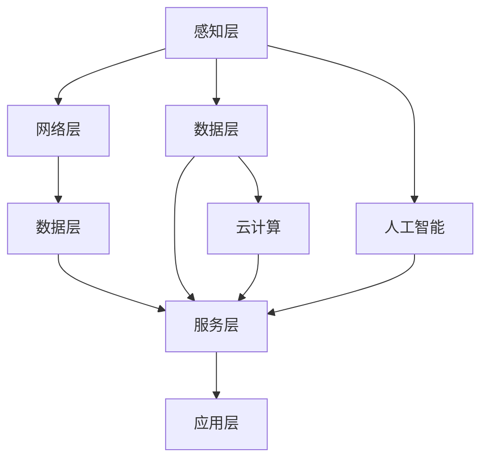
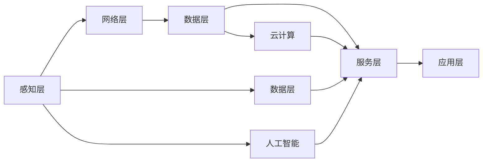

                 

## 1. 背景介绍

### 1.1 问题由来
随着全球化和城市化进程的加速，人类社会面临着前所未有的挑战。人口激增、资源匮乏、环境污染、交通拥堵等问题日益突出，迫切需要探索新的城市规划与管理模式。智慧城市作为一种创新的城市规划与运营方式，正在成为全球各地政府、企业和学术界共同关注的热点话题。

智慧城市利用先进的信息技术，通过感知、互联、整合、优化、决策等步骤，实现对城市各要素的全面感知和管理，提升城市运行效率和服务质量，构建绿色、宜居、智能的城市环境。其核心思想是通过数据驱动的方式，实现对城市运行规律的深刻理解和主动治理，从而推动城市可持续发展。

### 1.2 问题核心关键点
智慧城市规划与建设的成败，直接关系到城市管理的效率和质量。主要涉及以下几个核心关键点：

1. **数据获取与处理**：智慧城市建设的基础是大量高质量的数据。如何获取、存储和处理这些数据，是智慧城市建设的首要任务。
2. **智能决策支持**：智慧城市需要具备智能化的决策能力，通过对海量数据进行深度分析和建模，为城市规划和管理提供科学依据。
3. **集成与协同**：智慧城市需要实现各个子系统之间的无缝集成与协同，形成整体运行的高效系统。
4. **隐私与安全性**：智慧城市涉及大量个人隐私和敏感信息，如何保护数据安全，防止信息泄露，是智慧城市建设的重要问题。
5. **可持续性**：智慧城市的建设必须考虑其可持续性，包括环境友好、经济高效、社会公平等方面。

### 1.3 问题研究意义
智慧城市的规划与建设，不仅是现代城市管理的一次深刻变革，也是推动科技进步和社会进步的重要手段。其研究意义体现在以下几个方面：

1. **提升城市管理效率**：通过智能化手段，智慧城市可以实现对城市运行的实时监控和管理，提高城市运行效率和服务质量。
2. **推动经济社会发展**：智慧城市的发展，可以带动信息、通信、物联网等相关产业的发展，促进经济结构的优化升级。
3. **改善居民生活质量**：智慧城市能够提供更加便捷、高效、智能的城市服务，改善居民生活质量，提升幸福感。
4. **促进绿色可持续发展**：智慧城市能够优化资源配置，减少环境污染，推动绿色可持续发展。
5. **应对未来挑战**：智慧城市是未来城市发展的必然趋势，通过智能化手段，可以有效应对人口老龄化、资源短缺、气候变化等未来挑战。

## 2. 核心概念与联系

### 2.1 核心概念概述
智慧城市建设涉及多个层面和领域，主要包括物联网(IoT)、大数据、人工智能、云计算等技术。其中，物联网用于城市各要素的全面感知，大数据用于数据的存储和分析，人工智能用于智能决策和自动化处理，云计算用于数据的存储和计算。这些技术相互依存、相互支持，共同构成了智慧城市的核心技术架构。

智慧城市的核心概念包括：

- **感知层**：通过传感器、摄像头、RFID等设备，实现对城市各要素的全面感知。
- **网络层**：利用移动互联网、物联网等技术，实现感知数据的快速传输和交换。
- **数据层**：通过大数据存储和管理技术，实现对海量数据的有效管理和分析。
- **服务层**：通过人工智能、云计算等技术，实现对数据的深度分析和智能决策。
- **应用层**：根据智慧城市的具体应用需求，开发各种智能应用系统，如交通管理、环境监测、公共安全等。

### 2.2 核心概念原理和架构的 Mermaid 流程图

### 2.3 核心概念联系
智慧城市建设涉及多个核心概念，它们之间的联系可以通过以下图表展示：

## 3. 核心算法原理 & 具体操作步骤

### 3.1 算法原理概述
智慧城市建设的核心算法原理包括数据融合、智能决策、优化算法等。其主要过程包括以下几个步骤：

1. **数据融合**：通过对各类传感器、摄像头、RFID等设备采集的数据进行集成和融合，实现对城市各要素的全面感知。
2. **智能决策**：通过对融合后的数据进行深度分析和建模，实现对城市运行规律的深刻理解，提供科学决策支持。
3. **优化算法**：利用优化算法，实现对城市运行的管理和优化，提高城市运行效率和服务质量。

### 3.2 算法步骤详解
智慧城市建设的具体操作步骤如下：

1. **数据采集与预处理**：通过传感器、摄像头、RFID等设备，采集城市各要素的数据，并进行预处理，如数据清洗、去重、降噪等。
2. **数据融合与存储**：利用大数据技术，将各类数据进行集成和融合，存储在数据仓库中。
3. **数据建模与分析**：利用人工智能技术，对融合后的数据进行建模和分析，提取城市运行规律和特征。
4. **智能决策与优化**：利用优化算法，实现对城市运行的决策和管理，提高城市运行效率和服务质量。
5. **应用开发与部署**：根据智慧城市的具体应用需求，开发各种智能应用系统，如交通管理、环境监测、公共安全等。
6. **用户反馈与持续改进**：通过用户反馈，持续改进智慧城市系统，提升服务质量和用户体验。

### 3.3 算法优缺点
智慧城市建设的核心算法具有以下优点：

1. **全面感知**：通过数据融合技术，实现对城市各要素的全面感知，提升城市运行效率和服务质量。
2. **智能决策**：通过智能决策技术，实现对城市运行规律的深刻理解，提供科学决策支持。
3. **实时响应**：通过优化算法，实现对城市运行的管理和优化，提高城市运行效率和服务质量。

同时，智慧城市建设的核心算法也存在一些缺点：

1. **数据隐私**：智慧城市涉及大量个人隐私和敏感信息，如何保护数据安全，防止信息泄露，是智慧城市建设的重要问题。
2. **数据质量**：智慧城市建设对数据质量要求较高，如何获取、存储和处理高质量的数据，是智慧城市建设的首要任务。
3. **技术复杂**：智慧城市建设涉及多项先进技术，需要综合集成和协同，技术复杂度较高。
4. **投入成本高**：智慧城市建设需要大量的硬件设备和软件系统，投入成本较高。

### 3.4 算法应用领域
智慧城市建设的核心算法在多个领域得到广泛应用，包括：

1. **交通管理**：通过感知和分析交通数据，实现对城市交通的智能管理和优化，减少交通拥堵和事故。
2. **环境监测**：通过感知和分析环境数据，实现对城市环境的监测和管理，提升环境质量和可持续发展。
3. **公共安全**：通过感知和分析安全数据，实现对城市安全的监测和管理，保障公共安全。
4. **资源管理**：通过感知和分析资源数据，实现对城市资源的优化配置和管理，提高资源利用效率。
5. **智能服务**：通过感知和分析用户数据，实现对城市服务的智能提供和管理，提升用户体验。

## 4. 数学模型和公式 & 详细讲解 & 举例说明

### 4.1 数学模型构建
智慧城市建设涉及多个数学模型，主要包括数据融合模型、智能决策模型、优化算法模型等。这里以智能决策模型为例，构建数学模型。

假设智慧城市的数据融合层有 $n$ 种数据源，每种数据源的数据表示为 $x_i$，其中 $i \in \{1,2,...,n\}$。数据融合后的特征向量表示为 $X$，其中 $X = [x_1^T, x_2^T, ..., x_n^T]^T$。智能决策模型的目标是通过特征向量 $X$，预测城市运行状态 $y$，其中 $y \in \{0,1\}$ 表示城市运行状态正常与否。

### 4.2 公式推导过程
智能决策模型的数学公式如下：

$$
y = f(X; \theta)
$$

其中 $f(\cdot)$ 为智能决策模型，$\theta$ 为模型参数。

假设智能决策模型为线性回归模型，则公式如下：

$$
y = \theta_0 + \sum_{i=1}^n \theta_i x_i
$$

其中 $\theta = [\theta_0, \theta_1, ..., \theta_n]^T$ 为模型参数，$x_i$ 为数据源 $i$ 的特征向量。

### 4.3 案例分析与讲解
以交通管理为例，智慧城市通过感知交通数据，利用智能决策模型预测交通拥堵状态，进而采取相应的管理措施，如增加交通流量、优化信号灯控制等。

假设智慧城市有三种交通数据源：车辆速度、道路占用率、事故率。数据融合后的特征向量 $X$ 包括三种交通数据，即 $x_1$ 为车辆速度，$x_2$ 为道路占用率，$x_3$ 为事故率。智能决策模型的目标是预测城市交通是否拥堵，即 $y \in \{0,1\}$。

构建智能决策模型，假设模型为线性回归模型，公式如下：

$$
y = \theta_0 + \theta_1 x_1 + \theta_2 x_2 + \theta_3 x_3
$$

其中 $\theta_0, \theta_1, \theta_2, \theta_3$ 为模型参数。

通过训练智能决策模型，可以预测未来城市的交通拥堵状态，从而采取相应的管理措施，如调整交通流量、优化信号灯控制等，减少交通拥堵，提升城市运行效率。

## 5. 项目实践：代码实例和详细解释说明

### 5.1 开发环境搭建
智慧城市建设需要搭建复杂的软件和硬件环境，以下是基本的开发环境搭建步骤：

1. **硬件设备**：包括传感器、摄像头、RFID等设备，用于感知城市各要素。
2. **网络设备**：包括路由器、交换机、防火墙等设备，用于数据传输和交换。
3. **服务器设备**：包括计算服务器、存储服务器等，用于数据存储和处理。
4. **软件环境**：包括操作系统、数据库、编程语言等，用于软件开发和运行。

### 5.2 源代码详细实现
以交通管理为例，智慧城市的代码实现主要包括以下几个部分：

1. **数据采集与预处理**：通过传感器、摄像头、RFID等设备，采集交通数据，并进行预处理，如数据清洗、去重、降噪等。
2. **数据融合与存储**：利用大数据技术，将各类数据进行集成和融合，存储在数据库中。
3. **数据建模与分析**：利用人工智能技术，对融合后的数据进行建模和分析，提取交通运行规律和特征。
4. **智能决策与优化**：利用优化算法，实现对交通运行的决策和管理，提高交通运行效率和服务质量。

### 5.3 代码解读与分析
以数据建模与分析为例，智慧城市的代码实现主要包括以下几个部分：

1. **数据预处理**：将采集到的交通数据进行清洗和去重，生成特征向量 $X$。
2. **模型训练**：利用机器学习算法，如线性回归、决策树等，对数据进行建模和分析，提取交通运行规律和特征。
3. **模型评估**：利用测试数据集，评估模型的预测性能，调整模型参数。

### 5.4 运行结果展示
以智能决策与优化为例，智慧城市的代码实现主要包括以下几个部分：

1. **数据输入**：将交通数据输入智能决策模型。
2. **模型预测**：利用智能决策模型，预测未来交通拥堵状态。
3. **管理措施**：根据预测结果，采取相应的交通管理措施，如调整交通流量、优化信号灯控制等。

## 6. 实际应用场景

### 6.1 智能交通系统
智能交通系统是智慧城市建设的重要应用场景之一。通过感知和分析交通数据，实现对城市交通的智能管理和优化，减少交通拥堵和事故。

以交通流量监控为例，智慧城市通过感知器和摄像头，采集道路交通数据，包括车辆速度、道路占用率、事故率等。利用大数据和人工智能技术，对交通数据进行建模和分析，提取交通运行规律和特征。根据分析结果，智能决策系统可以预测未来交通拥堵状态，并采取相应的管理措施，如增加交通流量、优化信号灯控制等。

### 6.2 智能环境监测系统
智能环境监测系统是智慧城市建设的另一个重要应用场景。通过感知和分析环境数据，实现对城市环境的监测和管理，提升环境质量和可持续发展。

以空气质量监测为例，智慧城市通过传感器和监测设备，采集空气质量数据，包括PM2.5、SO2、NOx等。利用大数据和人工智能技术，对空气质量数据进行建模和分析，提取空气污染规律和特征。根据分析结果，智能决策系统可以预测未来空气质量状况，并采取相应的管理措施，如调整工业排放、增加绿化等。

### 6.3 智能公共安全系统
智能公共安全系统是智慧城市建设的重要组成部分。通过感知和分析安全数据，实现对城市安全的监测和管理，保障公共安全。

以视频监控系统为例，智慧城市通过摄像头和传感器，采集视频和音频数据，包括行人、车辆、事故等。利用大数据和人工智能技术，对安全数据进行建模和分析，提取安全事件规律和特征。根据分析结果，智能决策系统可以预测未来安全事件，并采取相应的管理措施，如增加安保力量、优化安防设备等。

## 7. 工具和资源推荐

### 7.1 学习资源推荐
智慧城市建设涉及多个学科和技术领域，以下是一些推荐的优质学习资源：

1. **《智慧城市：理论与实践》**：系统介绍智慧城市的基本概念、技术架构、应用场景等，适合入门学习。
2. **《物联网与智慧城市》**：介绍物联网技术在智慧城市中的应用，包括感知层、网络层、数据层、服务层和应用层等。
3. **《大数据技术与应用》**：介绍大数据技术的基本概念、存储、处理和分析等，适合深入学习。
4. **《人工智能基础与前沿》**：介绍人工智能技术的基本概念、算法、应用等，适合人工智能领域的学习者。
5. **《智慧城市开源项目》**：提供大量智慧城市项目和资源，包括代码、文档、论文等，适合实战学习。

### 7.2 开发工具推荐
智慧城市建设涉及多个技术领域，以下是一些推荐的开发工具：

1. **Python**：Python是智慧城市建设的主流编程语言，具备丰富的第三方库和框架，适合开发各种智能应用。
2. **TensorFlow**：TensorFlow是谷歌开发的人工智能框架，支持大规模分布式计算，适合开发各种智能决策模型。
3. **Keras**：Keras是基于TensorFlow的高层框架，适合快速开发和调试智能决策模型。
4. **Flask**：Flask是Python开发的网络框架，支持快速搭建Web应用，适合智慧城市的用户接口开发。
5. **OpenStreetMap**：OpenStreetMap是一个开源地图项目，支持城市地理数据的采集和分析，适合智慧城市的数据处理。

### 7.3 相关论文推荐
智慧城市建设涉及多个学科和技术领域，以下是一些推荐的经典论文：

1. **《智能城市：理念、设计、应用》**：介绍智能城市的基本概念、理念和设计思路，适合深入学习。
2. **《智慧城市基础设施的智能设计》**：介绍智慧城市基础设施的智能设计和应用，适合技术开发者。
3. **《物联网在智慧城市中的应用》**：介绍物联网技术在智慧城市中的应用，适合物联网领域的学习者。
4. **《大数据在智慧城市中的应用》**：介绍大数据技术在智慧城市中的应用，适合大数据领域的学习者。
5. **《人工智能在智慧城市中的应用》**：介绍人工智能技术在智慧城市中的应用，适合人工智能领域的学习者。

## 8. 总结：未来发展趋势与挑战

### 8.1 研究成果总结
智慧城市建设是一个复杂的系统工程，涉及多个学科和技术领域。其主要研究成果包括：

1. **数据采集与处理**：通过感知层和网络层技术，实现对城市各要素的全面感知和数据传输。
2. **智能决策支持**：通过数据建模和分析技术，实现对城市运行规律的深刻理解，提供科学决策支持。
3. **优化算法与模型**：利用优化算法，实现对城市运行的管理和优化，提高城市运行效率和服务质量。

### 8.2 未来发展趋势
智慧城市建设将呈现以下几个发展趋势：

1. **技术融合**：智慧城市建设将更多地融合物联网、大数据、人工智能、云计算等技术，实现多技术协同。
2. **应用场景多样化**：智慧城市建设将更多地应用于交通管理、环境监测、公共安全、资源管理、智能服务等场景，实现全场景覆盖。
3. **数据共享与协同**：智慧城市建设将更多地实现数据共享与协同，实现跨部门、跨地域的信息互通和协同管理。
4. **智能决策与优化**：智慧城市建设将更多地实现智能决策与优化，提升城市运行效率和服务质量。
5. **可持续性**：智慧城市建设将更多地注重可持续性，实现绿色、节能、环保等目标。

### 8.3 面临的挑战
智慧城市建设将面临以下几个挑战：

1. **数据隐私与安全**：智慧城市建设涉及大量个人隐私和敏感信息，如何保护数据安全，防止信息泄露，是智慧城市建设的重要问题。
2. **数据质量与可靠性**：智慧城市建设对数据质量要求较高，如何获取、存储和处理高质量的数据，是智慧城市建设的首要任务。
3. **技术复杂性**：智慧城市建设涉及多个学科和技术领域，技术复杂度较高，需要综合集成和协同。
4. **投入成本高**：智慧城市建设需要大量的硬件设备和软件系统，投入成本较高。
5. **用户体验**：智慧城市建设需要更多地考虑用户体验，如何提供便捷、高效、智能的城市服务，提升用户满意度。

### 8.4 研究展望
智慧城市建设需要多学科、多技术的协同努力，未来研究展望包括：

1. **跨学科合作**：智慧城市建设需要跨学科合作，结合城市规划、交通工程、环境科学、信息技术等学科，实现多学科融合。
2. **技术创新**：智慧城市建设需要技术创新，开发更加高效、智能、绿色的技术，提升城市运行效率和服务质量。
3. **数据共享与协同**：智慧城市建设需要更多地实现数据共享与协同，实现跨部门、跨地域的信息互通和协同管理。
4. **智能决策与优化**：智慧城市建设将更多地实现智能决策与优化，提升城市运行效率和服务质量。
5. **可持续性**：智慧城市建设将更多地注重可持续性，实现绿色、节能、环保等目标。

## 9. 附录：常见问题与解答

**Q1：智慧城市建设需要哪些技术和资源？**

A: 智慧城市建设需要多种技术和资源，主要包括：

1. **感知层**：传感器、摄像头、RFID等设备，用于感知城市各要素。
2. **网络层**：路由器、交换机、防火墙等设备，用于数据传输和交换。
3. **服务器设备**：计算服务器、存储服务器等，用于数据存储和处理。
4. **软件环境**：操作系统、数据库、编程语言等，用于软件开发和运行。
5. **数据资源**：各类传感器、摄像头、RFID等设备采集的数据，用于智慧城市建设。

**Q2：智慧城市建设面临哪些挑战？**

A: 智慧城市建设面临以下几个挑战：

1. **数据隐私**：智慧城市建设涉及大量个人隐私和敏感信息，如何保护数据安全，防止信息泄露，是智慧城市建设的重要问题。
2. **数据质量**：智慧城市建设对数据质量要求较高，如何获取、存储和处理高质量的数据，是智慧城市建设的首要任务。
3. **技术复杂性**：智慧城市建设涉及多个学科和技术领域，技术复杂度较高，需要综合集成和协同。
4. **投入成本高**：智慧城市建设需要大量的硬件设备和软件系统，投入成本较高。
5. **用户体验**：智慧城市建设需要更多地考虑用户体验，如何提供便捷、高效、智能的城市服务，提升用户满意度。

**Q3：如何提升智慧城市的运行效率和服务质量？**

A: 提升智慧城市的运行效率和服务质量，主要可以从以下几个方面入手：

1. **数据融合**：通过数据融合技术，实现对城市各要素的全面感知，提升城市运行效率和服务质量。
2. **智能决策**：通过智能决策技术，实现对城市运行规律的深刻理解，提供科学决策支持。
3. **优化算法**：利用优化算法，实现对城市运行的管理和优化，提高城市运行效率和服务质量。
4. **应用开发**：根据智慧城市的具体应用需求，开发各种智能应用系统，如交通管理、环境监测、公共安全等。
5. **用户反馈**：通过用户反馈，持续改进智慧城市系统，提升服务质量和用户体验。

**Q4：智慧城市建设需要哪些关键技术？**

A: 智慧城市建设需要以下关键技术：

1. **感知层**：传感器、摄像头、RFID等设备，用于感知城市各要素。
2. **网络层**：移动互联网、物联网等技术，用于数据传输和交换。
3. **数据层**：大数据存储和管理技术，用于数据的有效管理和分析。
4. **服务层**：人工智能、云计算等技术，用于智能决策和自动化处理。
5. **应用层**：各种智能应用系统，如交通管理、环境监测、公共安全等。

**Q5：智慧城市建设需要哪些软件工具？**

A: 智慧城市建设需要以下软件工具：

1. **Python**：Python是智慧城市建设的主流编程语言，具备丰富的第三方库和框架，适合开发各种智能应用。
2. **TensorFlow**：TensorFlow是谷歌开发的人工智能框架，支持大规模分布式计算，适合开发各种智能决策模型。
3. **Keras**：Keras是基于TensorFlow的高层框架，适合快速开发和调试智能决策模型。
4. **Flask**：Flask是Python开发的网络框架，支持快速搭建Web应用，适合智慧城市的用户接口开发。
5. **OpenStreetMap**：OpenStreetMap是一个开源地图项目，支持城市地理数据的采集和分析，适合智慧城市的数据处理。

**Q6：智慧城市建设如何实现数据共享与协同？**

A: 智慧城市建设需要实现数据共享与协同，主要可以从以下几个方面入手：

1. **数据标准化**：制定统一的数据标准和规范，实现不同数据源之间的互操作性。
2. **数据共享平台**：建立统一的数据共享平台，实现不同部门和机构之间的数据共享和协作。
3. **数据安全保护**：制定数据安全和隐私保护措施，确保数据在共享过程中的安全性和隐私性。
4. **数据质量管理**：建立数据质量管理机制，确保数据的准确性和可靠性。
5. **数据协同分析**：利用大数据和人工智能技术，实现数据的深度分析和协同处理，提升数据利用效率。

