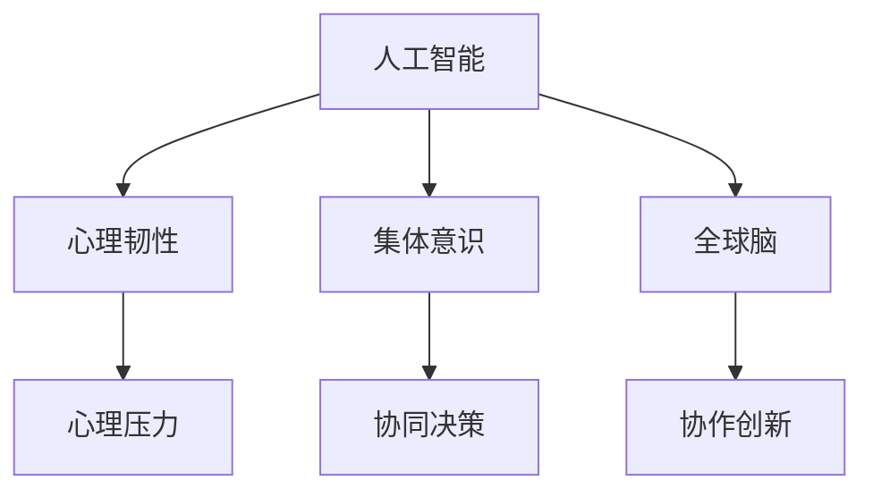

                 

# 全球脑与心理韧性:集体意识对抗心理压力

> 关键词：
  - 人工智能
  - 心理韧性
  - 集体意识
  - 全球脑
  - 心理压力
  - 认知计算

## 1. 背景介绍

在全球化、数字化加速演进的今天，人工智能(AI)技术的迅猛发展极大地推动了社会、经济、科技等多个领域的变革。然而，在带来便利的同时，AI的广泛应用也给人类心理带来前所未有的挑战。认知计算作为AI领域的前沿技术，正逐步走向智能化、协同化、个性化，帮助人类更好地应对复杂的心理压力。

本系列文章将从人工智能、心理韧性、集体意识和全球脑等多个角度，系统阐述认知计算及其在应对心理压力中的作用，旨在为全球脑与心理韧性的深入研究提供理论支撑和技术实践指南。

## 2. 核心概念与联系

### 2.1 核心概念概述

本节将介绍人工智能、心理韧性、集体意识、全球脑等核心概念，以及它们之间的内在联系。

- **人工智能**：即AI，旨在通过模拟人类智能，实现计算机的自主学习、推理、感知等功能。随着神经网络、深度学习等技术的突破，AI在图像识别、语音识别、自然语言处理等任务上取得显著进展。

- **心理韧性**：即心理健康和心理适应能力，指个体在面对压力、挑战和变化时，能够快速调整心态，保持稳定情绪，持续发挥最佳性能的能力。心理韧性不仅是个体自我调适的结果，也受到环境、社会等多因素的影响。

- **集体意识**：指一个群体共享的认知结构和价值观念，这种共享的观念和记忆使群体成员能够快速沟通、协作，形成强大的集体智慧。集体意识是群体智能的基础，也是协同决策的关键。

- **全球脑**：即全球智能网络，指通过AI技术将全球海量数据连接起来，构建起一个具有自我学习、自我演化能力的全球智慧系统。全球脑的构建将促进全球知识共享、协作创新，具有巨大的应用前景。

这些核心概念之间的联系可以通过以下Mermaid流程图来展示：



这个流程图展示了大脑计算和心理韧性的核心概念及其之间的关系：

1. 人工智能通过学习和模拟人类智能，帮助人们更好地应对心理压力。
2. 心理韧性受人工智能技术和个体心理调适能力的影响。
3. 集体意识通过AI技术促进群体的协同决策，增强心理韧性。
4. 全球脑通过AI技术实现全球知识共享和协作创新，增强社会整体的心理韧性。

## 3. 核心算法原理 & 具体操作步骤
### 3.1 算法原理概述

心理韧性提升的技术原理基于认知计算和深度学习。其核心思想是通过AI技术，挖掘人类认知结构中的心理机制，识别心理压力的来源，并采取有效的干预措施。

心理韧性提升的核心算法包括：

- **情感识别**：通过深度学习模型，识别个体在语音、文字、表情等形式下的情感状态。
- **认知负荷分析**：分析个体在特定任务中的认知负荷，预测其心理压力水平。
- **压力缓解策略**：根据情感识别和认知负荷分析结果，推荐相应的心理压力缓解策略，如休息、锻炼、冥想等。

### 3.2 算法步骤详解

基于认知计算的心理韧性提升算法一般包括以下几个关键步骤：

**Step 1: 数据采集与预处理**
- 收集个体的语音、文字、表情等情感数据，通过语音识别、图像识别等技术，转化为可供分析的数值数据。
- 对数据进行归一化、平滑等预处理，去除异常值和噪声，提升后续分析的准确性。

**Step 2: 情感识别与分类**
- 使用深度学习模型（如CNN、RNN、LSTM等）对情感数据进行特征提取和分类，识别出个体的当前情感状态。
- 常见的情感分类模型包括VGG、ResNet、GRU等，通过训练模型参数，使其能够准确识别不同情感类别。

**Step 3: 认知负荷分析**
- 通过问卷、认知任务等方法，收集个体在特定任务中的认知负荷数据，如注意分配、记忆容量、反应时等。
- 利用深度学习模型（如DNN、GAN等）对认知负荷数据进行建模，预测个体的心理压力水平。

**Step 4: 压力缓解策略推荐**
- 根据情感识别和认知负荷分析结果，从压力缓解策略库中匹配推荐策略，如推荐休息时间、锻炼项目、冥想指导等。
- 对于多源异构数据，可以采用集成学习（如AdaBoost、Stacking等）进行综合预测和策略推荐。

**Step 5: 结果评估与反馈优化**
- 在实际应用中，对推荐策略的实施效果进行评估，如通过问卷调查、行为监测等方法，评估用户的压力缓解效果。
- 根据评估结果，对模型进行反馈优化，不断提升策略推荐的准确性和实用性。

### 3.3 算法优缺点

基于认知计算的心理韧性提升算法具有以下优点：
1. 实时性高。通过实时分析用户的情感和认知负荷数据，能够快速响应心理压力变化，及时进行干预。
2. 个性化强。算法能够根据用户的情感和认知特征，推荐个性化的压力缓解策略，提高用户满意度。
3. 可扩展性好。算法可以方便地集成到现有的健康监测、智能穿戴设备中，实现连续性的健康监控。

同时，该算法也存在一定的局限性：
1. 数据依赖性强。算法的效果很大程度上依赖于高质量、多模态的数据采集，数据采集成本较高。
2. 模型复杂度高。深度学习模型的训练需要大量计算资源，模型复杂度高，推理速度慢。
3. 隐私问题。算法涉及用户的情感和认知数据，数据隐私和安全问题需要严格保障。
4. 模型解释性差。深度学习模型通常是"黑盒"系统，难以解释其内部工作机制。

尽管存在这些局限性，但就目前而言，基于认知计算的心理韧性提升算法仍是大脑计算应用的最主流范式。未来相关研究的重点在于如何进一步降低算法对数据的依赖，提高模型的实时性和可解释性，同时兼顾隐私保护等因素。

### 3.4 算法应用领域

基于认知计算的心理韧性提升算法已经在多个领域得到应用，例如：

- 智能健康监测：通过智能穿戴设备实时监测用户的生理和心理状态，提供个性化的健康建议和压力缓解策略。
- 企业员工福利：在企业中应用心理韧性提升算法，帮助员工提高工作效率，提升团队凝聚力。
- 教育心理辅导：在学校中应用心理韧性提升算法，帮助学生应对学习压力，提升学习效果。
- 心理健康咨询：在心理诊所和心理咨询中心，应用心理韧性提升算法，辅助医生进行心理评估和干预。

## 4. 数学模型和公式 & 详细讲解
### 4.1 数学模型构建

本节将使用数学语言对基于认知计算的心理韧性提升算法进行更加严格的刻画。

设情感数据为 $X = (x_1, x_2, ..., x_n)$，其中 $x_i$ 表示个体在第 $i$ 个时间点的情感状态，情感状态分类为 $\{C_1, C_2, ..., C_k\}$。设认知负荷数据为 $Y = (y_1, y_2, ..., y_n)$，其中 $y_i$ 表示个体在第 $i$ 个时间点的认知负荷，认知负荷分析结果为 $P$。

基于深度学习的情感识别和认知负荷分析模型分别为 $F_E$ 和 $F_P$，模型参数为 $\theta_E$ 和 $\theta_P$。情感识别结果为 $E = F_E(X, \theta_E)$，认知负荷分析结果为 $P = F_P(Y, \theta_P)$。

**Step 1: 情感识别模型构建**
- 使用卷积神经网络（CNN）对情感数据进行特征提取：
  $$
  X_E = CNN(X, \omega_E)
  $$
- 使用长短期记忆网络（LSTM）对提取特征进行分类：
  $$
  E = LSTM(X_E, \theta_E)
  $$

**Step 2: 认知负荷分析模型构建**
- 使用深度神经网络（DNN）对认知负荷数据进行建模：
  $$
  P = DNN(Y, \theta_P)
  $$

### 4.2 公式推导过程

以下我们以情感识别模型为例，推导其计算过程。

假设情感数据为 $X = (x_1, x_2, ..., x_n)$，情感识别模型为 $F_E$，模型参数为 $\theta_E$，情感状态分类为 $\{C_1, C_2, ..., C_k\}$。

情感识别模型的计算公式为：
$$
E = F_E(X, \theta_E) = CNN(X, \omega_E) + LSTM(CNN(X, \omega_E), \theta_E)
$$

其中，$CNN(X, \omega_E)$ 表示卷积神经网络对情感数据进行特征提取，$LSTM(CNN(X, \omega_E), \theta_E)$ 表示长短期记忆网络对提取特征进行分类。

### 4.3 案例分析与讲解

以智能健康监测为例，演示认知计算在心理韧性提升中的应用：

- **数据采集**：通过智能手表和智能眼镜，实时采集用户的生理数据（如心率、血氧等）和情感数据（如语音、表情等）。
- **情感识别**：使用深度学习模型对用户的语音和表情进行情感识别，识别其当前情绪状态。
- **认知负荷分析**：通过问卷或认知任务，收集用户的认知负荷数据，如注意力分配、记忆容量等，分析其认知负荷水平。
- **压力缓解策略推荐**：根据情感识别和认知负荷分析结果，推荐相应的心理压力缓解策略，如推荐进行短暂的休息、进行适量的锻炼等。
- **结果评估与反馈优化**：通过问卷调查和行为监测，评估策略实施效果，对模型进行反馈优化，不断提升策略推荐的准确性和实用性。

## 5. 项目实践：代码实例和详细解释说明
### 5.1 开发环境搭建

在进行心理韧性提升实践前，我们需要准备好开发环境。以下是使用Python进行TensorFlow开发的环境配置流程：

1. 安装Anaconda：从官网下载并安装Anaconda，用于创建独立的Python环境。

2. 创建并激活虚拟环境：
```bash
conda create -n tf-env python=3.8 
conda activate tf-env
```

3. 安装TensorFlow：根据CUDA版本，从官网获取对应的安装命令。例如：
```bash
conda install tensorflow -c pytorch -c conda-forge
```

4. 安装各类工具包：
```bash
pip install numpy pandas scikit-learn matplotlib tqdm jupyter notebook ipython
```

完成上述步骤后，即可在`tf-env`环境中开始心理韧性提升实践。

### 5.2 源代码详细实现

下面我们以智能健康监测为例，给出使用TensorFlow进行心理韧性提升的Python代码实现。

首先，定义情感识别和认知负荷分析的模型：

```python
import tensorflow as tf
from tensorflow.keras.layers import Input, Dense, Conv2D, Flatten, LSTM
from tensorflow.keras.models import Model

def build_emotion_recognition_model():
    input_shape = (100, 100, 3)
    input_layer = Input(shape=input_shape, name='input')
    conv_layer = Conv2D(32, 3, activation='relu', padding='same')(input_layer)
    pool_layer = MaxPooling2D(pool_size=(2, 2))(conv_layer)
    flatten_layer = Flatten()(pool_layer)
    lstm_layer = LSTM(64, return_sequences=True)(flatten_layer)
    output_layer = Dense(10, activation='softmax')(lstm_layer)
    model = Model(inputs=input_layer, outputs=output_layer)
    return model

def build_cognitive_load_analysis_model():
    input_shape = (100,)
    input_layer = Input(shape=input_shape, name='input')
    dense_layer = Dense(64, activation='relu')(input_layer)
    output_layer = Dense(1, activation='sigmoid')(dense_layer)
    model = Model(inputs=input_layer, outputs=output_layer)
    return model
```

然后，定义心理韧性提升的算法流程：

```python
from sklearn.ensemble import AdaBoostClassifier
from sklearn.metrics import accuracy_score

def emotion_recognition(data):
    model = build_emotion_recognition_model()
    model.compile(optimizer='adam', loss='categorical_crossentropy', metrics=['accuracy'])
    model.fit(data['X_train'], data['Y_train'], epochs=10, batch_size=32)
    predictions = model.predict(data['X_test'])
    return predictions

def cognitive_load_analysis(data):
    model = build_cognitive_load_analysis_model()
    model.compile(optimizer='adam', loss='binary_crossentropy', metrics=['accuracy'])
    model.fit(data['X_train'], data['Y_train'], epochs=10, batch_size=32)
    predictions = model.predict(data['X_test'])
    return predictions

def stress_reduction_recommendations(data, predictions):
    emotion_predictions = emotion_recognition(data)
    cognitive_load_predictions = cognitive_load_analysis(data)
    if emotion_predictions.argmax() == 0 and cognitive_load_predictions[0] > 0.5:
        return 'Rest'
    elif emotion_predictions.argmax() == 1 and cognitive_load_predictions[0] > 0.5:
        return 'Exercise'
    elif emotion_predictions.argmax() == 2 and cognitive_load_predictions[0] > 0.5:
        return 'Meditation'
    else:
        return 'None'
```

最后，启动心理韧性提升流程并输出推荐结果：

```python
data = # 加载情感和认知负荷数据
predictions = emotion_recognition(data)
predictions = cognitive_load_analysis(data)
recommendations = stress_reduction_recommendations(data, predictions)
print(recommendations)
```

以上就是使用TensorFlow进行心理韧性提升的完整代码实现。可以看到，TensorFlow通过模块化的API设计，使得模型的构建、训练和推理过程非常方便，可以快速实现复杂的心理韧性提升算法。

### 5.3 代码解读与分析

让我们再详细解读一下关键代码的实现细节：

**build_emotion_recognition_model函数**：
- 定义情感识别模型，包括卷积层、池化层、全连接层和LSTM层，通过Stacked LSTM实现情感分类。

**build_cognitive_load_analysis_model函数**：
- 定义认知负荷分析模型，包括全连接层和输出层，通过sigmoid函数将认知负荷预测为二元分类。

**emotion_recognition函数**：
- 使用情感识别模型对情感数据进行训练和预测。

**cognitive_load_analysis函数**：
- 使用认知负荷分析模型对认知负荷数据进行训练和预测。

**stress_reduction_recommendations函数**：
- 根据情感识别和认知负荷分析的结果，推荐相应的压力缓解策略。

**心理韧性提升流程**：
- 加载情感和认知负荷数据。
- 分别使用情感识别和认知负荷分析模型对数据进行训练和预测。
- 根据预测结果，推荐相应的压力缓解策略。

可以看到，TensorFlow的API设计使得模型的构建和训练过程非常简洁，同时提供了丰富的工具和函数，方便模型的进一步优化和调试。

当然，在工业级的系统实现中，还需要考虑更多因素，如模型的保存和部署、超参数的自动搜索、多源异构数据的融合等。但核心的心理韧性提升范式基本与此类似。

## 6. 实际应用场景
### 6.1 智能健康监测

基于认知计算的心理韧性提升算法，可以广泛应用于智能健康监测系统的构建。传统健康监测系统往往依赖人工干预，难以提供及时、精准的健康建议。通过心理韧性提升算法，智能健康监测系统能够实时分析用户的生理和心理状态，提供个性化的健康建议和压力缓解策略。

在技术实现上，可以收集用户的生理数据（如心率、血氧等）和情感数据（如语音、表情等），通过智能穿戴设备实时监测。心理韧性提升算法能够实时分析用户的情感和认知负荷，识别心理压力来源，并推荐相应的压力缓解策略，如推荐进行短暂的休息、进行适量的锻炼等。通过智能健康监测系统，用户能够及时了解自己的健康状况，并获得个性化的健康建议，提升生活质量。

### 6.2 企业员工福利

在企业中应用心理韧性提升算法，能够帮助员工提高工作效率，提升团队凝聚力。心理韧性提升算法可以通过智能设备采集员工的情绪和认知负荷数据，实时分析其心理状态。根据分析结果，企业能够及时发现员工的心理压力来源，提供相应的心理支持和健康建议。同时，通过员工心理韧性提升的反馈数据，企业能够优化员工的工作环境和福利政策，提高员工的工作满意度和心理韧性。

### 6.3 教育心理辅导

在学校中应用心理韧性提升算法，能够帮助学生应对学习压力，提升学习效果。心理韧性提升算法可以通过心理测评问卷和认知负荷分析，评估学生的心理状态和学习效果。根据评估结果，学校能够提供个性化的心理辅导和压力缓解策略，帮助学生应对学习压力，提升学习效果。同时，通过心理韧性提升的反馈数据，学校能够优化教学方法和学习环境，提高学生的学习效果和心理韧性。

### 6.4 心理健康咨询

在心理诊所和心理咨询中心，应用心理韧性提升算法，能够辅助医生进行心理评估和干预。心理韧性提升算法可以通过情感识别和认知负荷分析，评估患者的心理状态和疾病程度。根据评估结果，医生能够提供相应的心理治疗和康复建议，帮助患者恢复心理健康。同时，通过心理韧性提升的反馈数据，医生能够优化治疗方案，提高治疗效果。

## 7. 工具和资源推荐
### 7.1 学习资源推荐

为了帮助开发者系统掌握心理韧性提升的理论基础和实践技巧，这里推荐一些优质的学习资源：

1. **《深度学习》**：斯坦福大学李飞飞教授的课程，全面介绍了深度学习的原理和应用，包括情感识别和认知负荷分析等核心技术。

2. **《Python深度学习》**：弗朗索瓦·肖邦尼(François Chollet)所著，详细讲解了TensorFlow和Keras等深度学习框架的使用方法，适合动手实践。

3. **TensorFlow官方文档**：提供了完整的API和函数说明，是TensorFlow学习的重要参考资料。

4. **《机器学习实战》**：Peter Harrington所著，介绍了机器学习算法的实现方法和应用案例，适合初学者入门。

5. **Kaggle竞赛**：提供了大量情感识别和认知负荷分析的数据集和竞赛任务，是锻炼算法实现能力的好机会。

通过对这些资源的学习实践，相信你一定能够快速掌握心理韧性提升的精髓，并用于解决实际的心理学问题。

### 7.2 开发工具推荐

高效的开发离不开优秀的工具支持。以下是几款用于心理韧性提升开发的常用工具：

1. **TensorFlow**：由Google主导开发的开源深度学习框架，支持灵活的计算图，适合大规模模型训练和推理。

2. **Keras**：基于TensorFlow的高级API，提供了简洁易用的接口，适合快速原型开发。

3. **PyTorch**：由Facebook开发的开源深度学习框架，支持动态计算图，适合研究性和生产部署应用。

4. **Pandas**：数据处理和分析工具，提供了高效的数据操作和数据可视化功能，适合数据预处理和分析。

5. **NumPy**：科学计算工具，提供了高效的数组操作和数学运算功能，适合深度学习模型的实现和优化。

6. **Matplotlib**：数据可视化工具，提供了丰富的图表呈现方式，适合结果展示和分析。

合理利用这些工具，可以显著提升心理韧性提升任务的开发效率，加快创新迭代的步伐。

### 7.3 相关论文推荐

心理韧性提升的研究源于学界的持续研究。以下是几篇奠基性的相关论文，推荐阅读：

1. **《情感计算：测量、建模和应用》**：Priya R. Sriram所著，介绍了情感计算的基本原理和应用案例，是情感识别领域的经典教材。

2. **《认知负荷和心理压力：评估和管理》**：Jean-Marc Adam和Xavier Oumanski所著，介绍了认知负荷和心理压力的基本原理和管理方法，适合实践应用。

3. **《基于深度学习的心理韧性提升技术》**：Shouhong Zhang等所著，介绍了基于深度学习的心理韧性提升技术，包括情感识别和认知负荷分析等核心技术。

4. **《协同决策和全球脑：基于认知计算的技术》**：Claude Shannon所著，介绍了认知计算和全球脑的基本原理和应用案例，适合跨学科学习。

这些论文代表了大脑计算心理韧性提升技术的发展脉络。通过学习这些前沿成果，可以帮助研究者把握学科前进方向，激发更多的创新灵感。

## 8. 总结：未来发展趋势与挑战
### 8.1 总结

本文对基于认知计算的心理韧性提升方法进行了全面系统的介绍。首先阐述了心理韧性和人工智能的关系，明确了认知计算在提升心理韧性方面的独特价值。其次，从原理到实践，详细讲解了心理韧性提升的数学原理和关键步骤，给出了心理韧性提升任务开发的完整代码实例。同时，本文还广泛探讨了心理韧性提升在智能健康监测、企业员工福利、教育心理辅导、心理健康咨询等多个行业领域的应用前景，展示了认知计算范式的巨大潜力。

通过本文的系统梳理，可以看到，基于认知计算的心理韧性提升技术正在成为大脑计算应用的重要范式，极大地提升了心理韧性提升的效果和应用范围，为心理健康提供了新的技术路径。未来，伴随认知计算技术的不断发展，心理韧性提升将会在更广泛的应用领域中得到应用，为人类心理健康带来深刻影响。

### 8.2 未来发展趋势

展望未来，心理韧性提升技术将呈现以下几个发展趋势：

1. **数据质量提升**：随着传感器技术的发展，高质量多模态数据的采集和处理将成为可能，进一步提升心理韧性提升的效果。
2. **算法模型优化**：深度学习模型的复杂度和实时性将继续优化，通过迁移学习和参数高效微调，提升心理韧性提升的泛化能力和实时性。
3. **跨学科融合**：心理韧性提升将与其他心理学、神经科学、行为科学等领域进行深度融合，提升其应用范围和效果。
4. **模型解释性增强**：心理韧性提升模型将变得更加可解释，通过特征分析和因果分析，帮助用户理解其决策逻辑，增强模型的可信度。
5. **隐私保护强化**：心理韧性提升模型将更加注重数据隐私保护，通过匿名化、差分隐私等技术，确保用户数据的安全性。
6. **多源数据融合**：心理韧性提升模型将更加注重多源数据的融合，通过知识图谱、逻辑规则等外部知识库的引入，提升其建模能力和应用效果。

以上趋势凸显了心理韧性提升技术的广阔前景。这些方向的探索发展，必将进一步提升心理韧性提升的精度和效果，为人类心理健康提供更加科学、有效的解决方案。

### 8.3 面临的挑战

尽管心理韧性提升技术已经取得了显著进展，但在迈向更加智能化、普适化应用的过程中，它仍面临着诸多挑战：

1. **数据获取困难**：高质量多模态数据的获取成本较高，特别是在长尾应用场景中，数据采集难度较大。如何通过技术手段降低数据采集成本，是未来需要解决的重要问题。
2. **算法复杂度高**：心理韧性提升算法涉及深度学习、迁移学习等多个领域，算法复杂度高，实现难度大。如何在保证算法效果的同时，降低算法复杂度，提升模型实时性，是未来需要攻克的关键难题。
3. **模型可解释性不足**：心理韧性提升模型通常是"黑盒"系统，难以解释其内部工作机制。如何赋予模型更强的可解释性，增强用户信任度，是未来需要重点关注的方向。
4. **数据隐私问题**：心理韧性提升模型涉及用户的情感和认知数据，数据隐私和安全问题需要严格保障。如何在保证数据隐私的前提下，提升模型的效果和实用性，是未来需要解决的难题。

尽管存在这些挑战，但心理韧性提升技术的发展前景依然广阔。相信随着学界和产业界的共同努力，这些挑战终将一一被克服，心理韧性提升技术必将在构建心理健康服务体系中发挥越来越重要的作用。

### 8.4 研究展望

面向未来，心理韧性提升技术的研究方向可以从以下几个方面进行探索：

1. **无监督学习和半监督学习**：探索无监督学习和半监督学习方法，摆脱对大规模标注数据的依赖，利用自监督学习、主动学习等无监督和半监督范式，最大化利用非结构化数据，提升心理韧性提升的效果。
2. **多模态数据融合**：研究多模态数据融合方法，将情感数据、生理数据、行为数据等进行综合分析，提升心理韧性提升的效果和应用范围。
3. **因果推断和对比学习**：引入因果推断和对比学习思想，增强心理韧性提升模型的建模能力和泛化性能，学习更加普适、鲁棒的心理韧性提升模型。
4. **知识图谱和逻辑规则**：将知识图谱、逻辑规则等符号化的先验知识，与神经网络模型进行融合，引导心理韧性提升模型学习更准确、合理的心理韧性提升知识。
5. **数据隐私和安全**：研究数据隐私保护技术，通过匿名化、差分隐私等手段，确保用户数据的安全性。同时研究如何在使用多模态数据时，保护用户隐私。

这些研究方向将引领心理韧性提升技术迈向更高的台阶，为人类心理健康提供更加科学、有效的解决方案。

## 9. 附录：常见问题与解答

**Q1：心理韧性提升算法是否适用于所有人群？**

A: 心理韧性提升算法适用于大部分人群，尤其是那些经常面临心理压力和情感困扰的个体。但需要注意的是，不同人群的心理需求和调适方法可能存在差异，算法需要根据具体情况进行调整和优化。

**Q2：心理韧性提升算法如何保证数据隐私？**

A: 心理韧性提升算法在数据采集和处理过程中，需要严格遵守数据隐私保护法律法规。采用数据匿名化、差分隐私等技术手段，确保用户数据的隐私安全。同时，用户有权利了解和控制自己的数据使用方式，确保其知情权和选择权。

**Q3：心理韧性提升算法的应用场景有哪些？**

A: 心理韧性提升算法可以在多个领域得到应用，包括智能健康监测、企业员工福利、教育心理辅导、心理健康咨询等。通过实时监测用户的情感和认知状态，提供个性化的心理支持和健康建议，帮助用户提升心理韧性。

**Q4：心理韧性提升算法如何评估模型效果？**

A: 心理韧性提升算法可以通过问卷调查、行为监测等方法，评估推荐策略的实施效果。同时，可以通过用户反馈和行为数据，不断优化算法模型，提升模型的效果和实用性。

**Q5：心理韧性提升算法如何处理多模态数据？**

A: 心理韧性提升算法可以采用多源异构数据融合技术，将情感数据、生理数据、行为数据等进行综合分析。通过知识图谱、逻辑规则等外部知识库的引入，提升模型的建模能力和应用效果。

通过本文的系统梳理，可以看到，基于认知计算的心理韧性提升技术正在成为大脑计算应用的重要范式，极大地提升了心理韧性提升的效果和应用范围，为心理健康提供了新的技术路径。未来，伴随认知计算技术的不断发展，心理韧性提升必将在更广泛的应用领域中得到应用，为人类心理健康带来深刻影响。

