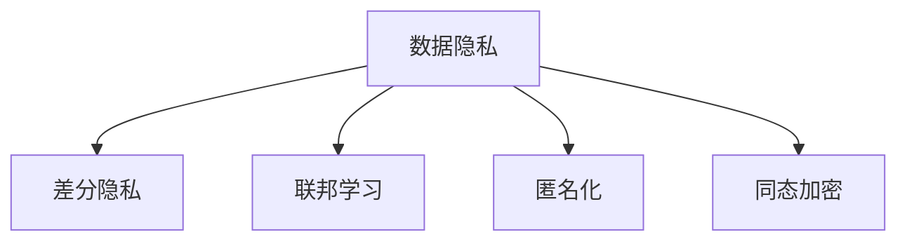

                 

## 1. 背景介绍

### 1.1 问题由来

随着互联网和人工智能技术的迅猛发展，数据成为一种新的战略资产，其利用价值日益凸显。然而，数据同时也带来隐私泄露的风险。个人信息的获取和分享变得更为便利，但如何确保这些信息不被滥用，成为当前亟需解决的问题。

### 1.2 问题核心关键点

数据隐私保护问题涉及技术、法律、伦理等多个维度。如何在确保数据利用的同时，保障个人隐私权益，是全球脑（Global Brain）和人工智能（AI）领域的重要挑战。

- **技术层面**：如何构建隐私友好的数据处理机制，避免数据泄露和滥用。
- **法律层面**：如何在现有的法律法规框架下，保障用户隐私权益，避免因数据利用引发的法律纠纷。
- **伦理层面**：如何在技术进步与个人隐私保护之间取得平衡，确保技术的可持续发展。

### 1.3 问题研究意义

研究数据隐私保护问题，对于维护公众信任、促进数据利用、推动人工智能技术的健康发展具有重要意义：

1. **增强公众信任**：通过有效的隐私保护措施，增强公众对AI技术的信任，促进其在医疗、教育、金融等领域的广泛应用。
2. **促进数据利用**：在法律和技术双重保障下，充分利用数据资源，推动经济社会发展。
3. **推动技术创新**：隐私保护的挑战促使AI领域不断探索新技术，如差分隐私、联邦学习等，提升整体技术水平。
4. **保障个人权益**：确保个人隐私数据不被滥用，保护个人的基本权益。

## 2. 核心概念与联系

### 2.1 核心概念概述

为更好地理解数据隐私保护问题，本节将介绍几个关键概念：

- **数据隐私（Data Privacy）**：指个人在数据处理和使用过程中，其隐私权利不受侵犯的状态。
- **差分隐私（Differential Privacy）**：一种隐私保护技术，通过在数据处理中加入噪声，确保个体数据无法被逆推到个体身份，从而保护隐私。
- **联邦学习（Federated Learning）**：一种分布式机器学习方法，允许参与方在不共享数据的情况下，协同训练模型。
- **匿名化（Anonymization）**：通过去除或模糊化个人身份信息，使数据无法直接关联到个体。
- **同态加密（Homomorphic Encryption）**：一种加密技术，允许在加密数据上直接进行计算，结果解密后仍安全可靠。

这些概念之间的关系可以通过以下Mermaid流程图来展示：



这个流程图展示了数据隐私保护的几个关键技术手段，以及它们之间的相互作用。

## 3. 核心算法原理 & 具体操作步骤
### 3.1 算法原理概述

数据隐私保护的核心在于如何平衡数据利用与隐私保护之间的矛盾。常见的隐私保护方法包括差分隐私、联邦学习和匿名化等。这些方法通常通过在数据处理过程中引入噪声、分布式训练或去除标识信息等方式，降低隐私泄露风险。

### 3.2 算法步骤详解

以差分隐私为例，其基本步骤如下：

1. **定义隐私预算**：确定允许的最大隐私损失，通常用$\epsilon$表示。
2. **加入噪声**：在数据处理过程中，向结果中加入噪声，确保个体数据无法被逆推到个体身份。
3. **计算响应**：处理后生成响应结果，并提供给用户或第三方。
4. **评估隐私风险**：定期评估隐私风险，确保不超预算。

### 3.3 算法优缺点

差分隐私的优势在于其理论上的严密性，能够保证在特定隐私预算下，个体数据难以被逆推到个体身份。但其缺点也明显：

- **计算开销大**：加入噪声会降低数据精度，增加计算成本。
- **隐私预算设置困难**：如何设定合适的隐私预算，是一个需要深入研究的问题。
- **应用场景受限**：对于需要高精度数据的场景，差分隐私可能不适用。

### 3.4 算法应用领域

差分隐私和联邦学习等隐私保护方法在多个领域得到了应用，例如：

- **医疗数据共享**：通过差分隐私，医疗机构可以在不泄露患者隐私的情况下，共享医疗数据，推动医疗研究的进步。
- **金融数据分析**：金融机构可以在联邦学习框架下，分析用户消费行为，提供个性化服务。
- **智能城市管理**：在智能城市建设中，通过联邦学习协同训练模型，实现跨域数据共享和分析，提升城市管理效率。
- **社交媒体分析**：社交媒体平台可以通过差分隐私保护用户隐私，同时进行大规模数据分析，优化内容推荐算法。

## 4. 数学模型和公式 & 详细讲解

### 4.1 数学模型构建

差分隐私的数学模型可以表示为：

$$
\mathcal{L}(f) \approx f(x) + N(\sigma)
$$

其中，$\mathcal{L}(f)$ 表示数据处理后的响应结果，$f(x)$ 表示原始数据处理后的结果，$N(\sigma)$ 表示加入的噪声，$\sigma$ 为噪声标准差。

### 4.2 公式推导过程

差分隐私的核心在于隐私预算$\epsilon$的设定。隐私预算越小，隐私保护效果越好，但数据精度损失越大。隐私预算的计算公式如下：

$$
\epsilon = \ln(\frac{1}{\delta}) + \frac{\sqrt{2\Delta^2}}{\sigma}
$$

其中，$\delta$ 表示隐私泄露概率，$\Delta$ 表示噪声方差。

### 4.3 案例分析与讲解

假设有一个包含10000个用户消费记录的数据集，我们想要分析这些记录的平均消费金额。通过差分隐私，我们可以在加入噪声后，计算出平均消费金额，并确保个体数据无法被逆推到个体身份。具体步骤如下：

1. 定义隐私预算$\epsilon = 1$。
2. 假设噪声标准差为$\sigma = 1$。
3. 在每个用户的消费记录上加入噪声，生成一个新的数据集。
4. 计算新数据集的平均消费金额，并返回给用户或第三方。

通过这种方式，我们确保了在数据处理过程中，个体消费记录不会被泄露。

## 5. 项目实践：代码实例和详细解释说明
### 5.1 开发环境搭建

在进行隐私保护项目开发前，我们需要准备好开发环境。以下是使用Python进行差分隐私实践的环境配置流程：

1. 安装Anaconda：从官网下载并安装Anaconda，用于创建独立的Python环境。

2. 创建并激活虚拟环境：
```bash
conda create -n dp-env python=3.8 
conda activate dp-env
```

3. 安装差分隐私库：
```bash
pip install differential_privacy
```

4. 安装必要的依赖包：
```bash
pip install numpy pandas sklearn scikit-learn
```

完成上述步骤后，即可在`dp-env`环境中开始差分隐私实践。

### 5.2 源代码详细实现

下面我们以差分隐私保护消费数据为例，给出使用Differential Privacy库进行保护的PyTorch代码实现。

```python
import differential_privacy as dp
import pandas as pd
import numpy as np

# 构建数据集
data = pd.read_csv('consumption_data.csv')
data = pd.get_dummies(data)

# 定义隐私预算
epsilon = 1.0
delta = 0.1

# 计算隐私保护参数
privacy_params = dp.get_privacy_params(data, epsilon, delta)

# 定义差分隐私机制
dp_mechanism = dp.GaussianMechanism(epsilon=epsilon, delta=delta)

# 对数据集进行差分隐私保护
protected_data = dp_mechanism.noise(data.values)

# 输出保护后的数据集
print(protected_data)
```

### 5.3 代码解读与分析

**构建数据集**：
- 使用pandas读取消费数据，并将其转换为哑变量表示形式。

**定义隐私预算**：
- 隐私预算$\epsilon$和隐私泄露概率$\delta$是差分隐私保护的两个关键参数，需要通过实验调优确定。

**计算隐私保护参数**：
- 使用差分隐私库提供的函数，计算隐私保护所需的噪声参数。

**定义差分隐私机制**：
- 选择GaussianMechanism作为差分隐私机制，加入高斯噪声保护数据。

**对数据集进行差分隐私保护**：
- 使用差分隐私机制对数据集进行处理，生成保护后的数据集。

**输出保护后的数据集**：
- 打印保护后的数据集，观察其变化情况。

可以看到，通过差分隐私保护，个体消费数据被成功隐藏，从而保护了隐私。

### 5.4 运行结果展示

运行上述代码后，将输出保护后的数据集。由于加入了噪声，保护后的数据与原始数据存在一定差异，但仍然保留了整体消费特征。

## 6. 实际应用场景
### 6.1 医疗数据共享

医疗数据的隐私保护在数据共享和研究中尤为重要。医疗机构可以通过差分隐私保护患者隐私，同时共享医疗数据，推动医学研究。

在实践中，可以收集大量匿名化的医疗数据，对其进行统计分析，生成研究报告。通过差分隐私保护，确保患者隐私不被泄露，同时为医学研究提供数据支持。

### 6.2 金融数据分析

金融机构的消费数据具有高价值，但数据泄露可能导致严重的金融风险。通过联邦学习和差分隐私，金融机构可以在不共享数据的情况下，协同训练模型，提供个性化服务。

具体而言，金融机构可以在联邦学习框架下，通过差分隐私保护用户消费数据，协同训练信用评分模型，提供贷款审批等服务。

### 6.3 智能城市管理

智能城市建设涉及大量数据的共享和分析。通过联邦学习协同训练模型，实现跨域数据共享和分析，提升城市管理效率。

在智能交通管理中，可以通过差分隐私保护用户出行数据，生成交通流量预测模型，优化交通信号控制，提高道路通行效率。

### 6.4 社交媒体分析

社交媒体平台可以通过差分隐私保护用户数据，同时进行大规模数据分析，优化内容推荐算法。

在实践中，社交媒体平台可以收集用户互动数据，通过差分隐私保护隐私，生成用户兴趣模型。在此基础上，优化推荐算法，提升用户体验。

## 7. 工具和资源推荐
### 7.1 学习资源推荐

为了帮助开发者系统掌握差分隐私和联邦学习等隐私保护技术，这里推荐一些优质的学习资源：

1. **《Differential Privacy: Theory and Practice》书籍**：由Differential Privacy社区创办者Jayadev S. ATish教授撰写，详细介绍了差分隐私的理论基础和实践应用。
2. **《Federated Learning: Concepts, Techniques, and Applications》书籍**：由Xavier M懂的ds书号团队撰写，全面介绍了联邦学习的概念、技术和应用场景。
3. **Kaggle差分隐私比赛**：参与差分隐私相关的Kaggle比赛，实践隐私保护技术，学习最新动态。
4. **Coursera差分隐私课程**：斯坦福大学提供的差分隐私课程，涵盖差分隐私的理论基础和实际应用。
5. **arXiv差分隐私论文**：阅读差分隐私领域最新的研究成果，跟踪前沿技术。

通过对这些资源的学习实践，相信你一定能够快速掌握差分隐私和联邦学习等隐私保护技术，并应用于实际项目中。

### 7.2 开发工具推荐

高效的开发离不开优秀的工具支持。以下是几款用于差分隐私开发常用的工具：

1. **Python差分隐私库**：Differential Privacy库提供了丰富的差分隐私机制，适合进行隐私保护实践。
2. **TensorFlow联邦学习库**：TensorFlow的联邦学习库，提供了联邦学习的基本框架和工具，便于开发者快速上手。
3. **Kaggle差分隐私竞赛平台**：Kaggle提供了差分隐私相关的竞赛和数据集，便于开发者实践和测试。
4. **Google Cloud Differential Privacy**：谷歌提供的差分隐私服务，支持在云上进行隐私保护实践。
5. **Federated Learning Playground**：联邦学习平台，提供联邦学习实验环境，便于开发者进行实验和调试。

合理利用这些工具，可以显著提升差分隐私和联邦学习的开发效率，加快创新迭代的步伐。

### 7.3 相关论文推荐

差分隐私和联邦学习的发展源于学界的持续研究。以下是几篇奠基性的相关论文，推荐阅读：

1. **《A Framework for Differential Privacy》论文**：差分隐私的奠基性论文，提出了差分隐私的定义和理论基础。
2. **《Federated Learning: Concepts and Foundations》论文**：联邦学习的奠基性论文，详细介绍了联邦学习的概念和理论基础。
3. **《Federated Learning: Concepts, Techniques, and Applications》书籍**：由Xavier M懂的ds书号团队撰写，全面介绍了联邦学习的概念、技术和应用场景。
4. **《Federated Learning for Mobile Health Data Collection》论文**：介绍了联邦学习在移动健康数据收集中的应用，展示了联邦学习的实际效果。
5. **《Differential Privacy: Tutorial and Survey》论文**：差分隐私的教程和综述论文，详细介绍了差分隐私的理论基础和实际应用。

这些论文代表了大数据隐私保护技术的发展脉络。通过学习这些前沿成果，可以帮助研究者把握学科前进方向，激发更多的创新灵感。

## 8. 总结：未来发展趋势与挑战

### 8.1 总结

本文对基于差分隐私和联邦学习的数据隐私保护方法进行了全面系统的介绍。首先阐述了数据隐私保护的研究背景和意义，明确了隐私保护在数据利用和用户权益保护中的重要性。其次，从原理到实践，详细讲解了差分隐私和联邦学习的数学模型和操作步骤，给出了隐私保护任务开发的完整代码实例。同时，本文还广泛探讨了隐私保护方法在医疗数据共享、金融数据分析、智能城市管理等多个领域的应用前景，展示了隐私保护范式的巨大潜力。此外，本文精选了隐私保护技术的各类学习资源，力求为读者提供全方位的技术指引。

通过本文的系统梳理，可以看到，差分隐私和联邦学习等隐私保护方法正在成为数据利用和用户隐私保护的重要工具，极大地拓展了数据处理的应用边界，催生了更多的落地场景。得益于差分隐私和联邦学习技术的不断演进，数据利用和用户隐私保护必将进一步走向成熟，为人工智能技术的可持续发展提供坚实保障。

### 8.2 未来发展趋势

展望未来，差分隐私和联邦学习等隐私保护技术将呈现以下几个发展趋势：

1. **隐私预算优化**：隐私预算的设定和优化是隐私保护的核心问题。未来将发展出更多智能化的隐私预算分配算法，确保在最小隐私预算下，获得最佳的隐私保护效果。
2. **联邦学习优化**：联邦学习技术将不断发展，提升模型训练效率和精度，推动跨域数据协同计算。
3. **差分隐私算法优化**：差分隐私算法将不断改进，提升数据处理效率和隐私保护效果。
4. **隐私保护与区块链结合**：利用区块链的分布式特性，提升数据共享和隐私保护的安全性。
5. **隐私保护与人工智能结合**：隐私保护技术与AI算法的结合，将在更多领域得到应用，推动AI技术的普及和应用。

以上趋势凸显了隐私保护技术的广阔前景。这些方向的探索发展，必将进一步提升数据利用的安全性、透明性和效率，为人工智能技术的可持续发展提供有力保障。

### 8.3 面临的挑战

尽管差分隐私和联邦学习技术已经取得了显著进展，但在迈向更加智能化、普适化应用的过程中，仍面临诸多挑战：

1. **隐私预算设定困难**：如何设定合适的隐私预算，是一个需要深入研究的问题。
2. **计算开销大**：加入噪声会降低数据精度，增加计算成本。
3. **隐私预算与数据精度平衡**：如何在隐私预算与数据精度之间取得平衡，是一个需要不断探索的问题。
4. **联邦学习模型协同问题**：联邦学习需要在不共享数据的情况下，协同训练模型，如何设计高效的模型结构，是一个重要研究方向。
5. **隐私保护算法复杂性**：隐私保护算法通常较为复杂，如何简化算法，提升实用性，是一个重要的挑战。
6. **隐私保护与业务需求结合**：如何在隐私保护与业务需求之间取得平衡，是一个需要深入研究的问题。

正视隐私保护面临的这些挑战，积极应对并寻求突破，将是大数据隐私保护技术走向成熟的必由之路。相信随着学界和产业界的共同努力，这些挑战终将一一被克服，大数据隐私保护技术必将在构建人机协同的智能时代中扮演越来越重要的角色。

### 8.4 未来突破

面对隐私保护所面临的种种挑战，未来的研究需要在以下几个方面寻求新的突破：

1. **隐私预算动态调整**：开发隐私预算动态调整算法，根据数据处理需求，实时调整隐私预算，确保隐私保护效果和数据精度之间的平衡。
2. **差分隐私与差分隐私机制结合**：探索新的差分隐私机制，提升隐私保护效果，同时保持数据精度。
3. **联邦学习优化**：开发更加高效的联邦学习算法，提升模型训练效率和精度，推动跨域数据协同计算。
4. **隐私保护与区块链结合**：利用区块链的分布式特性，提升数据共享和隐私保护的安全性。
5. **隐私保护与人工智能结合**：隐私保护技术与AI算法的结合，将在更多领域得到应用，推动AI技术的普及和应用。
6. **隐私保护算法简化**：简化隐私保护算法，提升其实用性和可操作性，推动隐私保护技术的广泛应用。

这些研究方向的探索，必将引领隐私保护技术迈向更高的台阶，为构建安全、可靠、可解释、可控的智能系统铺平道路。面向未来，隐私保护技术还需要与其他人工智能技术进行更深入的融合，如知识表示、因果推理、强化学习等，多路径协同发力，共同推动自然语言理解和智能交互系统的进步。只有勇于创新、敢于突破，才能不断拓展隐私保护技术的边界，让智能技术更好地造福人类社会。

## 9. 附录：常见问题与解答

**Q1：差分隐私与联邦学习有何区别？**

A: 差分隐私和联邦学习都是隐私保护技术，但主要关注点不同。差分隐私关注个体隐私保护，通过加入噪声保护个体数据，防止隐私泄露。联邦学习关注数据利用，通过分布式训练模型，确保数据隐私同时进行协同计算。

**Q2：如何在隐私保护和数据精度之间取得平衡？**

A: 隐私保护和数据精度之间需要权衡，通常隐私预算设定是一个关键因素。隐私预算越宽松，隐私保护效果越好，但数据精度损失越大。需要通过实验调优，找到合适的隐私预算。

**Q3：差分隐私和同态加密有何区别？**

A: 差分隐私通过加入噪声保护个体数据，防止隐私泄露。同态加密则在加密数据上直接进行计算，解密后结果仍然安全可靠。两者的保护方式不同，但都实现了隐私保护的目的。

**Q4：联邦学习中的联邦成员如何选择？**

A: 联邦学习中的联邦成员需要满足以下条件：
1. 具备一定计算资源和数据资源。
2. 数据质量和分布均衡，避免数据偏差。
3. 通信带宽足够，确保数据传输效率。
4. 联邦成员间具有信任关系，避免恶意行为。

**Q5：如何评估隐私保护效果？**

A: 隐私保护效果的评估通常通过隐私预算、隐私泄露概率和数据精度三个指标进行。隐私预算设定越小，隐私保护效果越好，但数据精度损失越大。隐私泄露概率越低，隐私保护效果越好。数据精度越高，隐私保护效果越差。需要在三者之间进行平衡。

通过本文的系统梳理，可以看到，差分隐私和联邦学习等隐私保护方法正在成为数据利用和用户隐私保护的重要工具，极大地拓展了数据处理的应用边界，催生了更多的落地场景。得益于差分隐私和联邦学习技术的不断演进，数据利用和用户隐私保护必将进一步走向成熟，为人工智能技术的可持续发展提供坚实保障。

