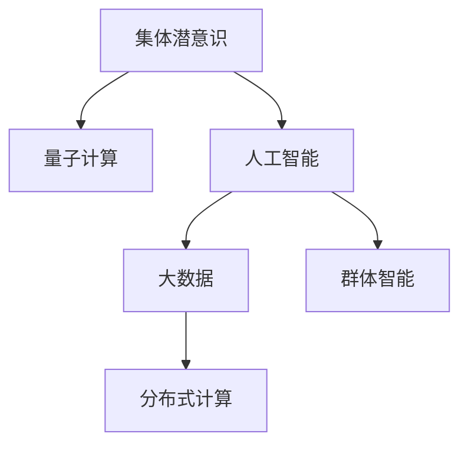

                 

# 全球脑与集体潜意识:人类共享思维场的量子探索

## 1. 背景介绍

### 1.1 问题由来
人类文明的进步离不开思想的交流与碰撞。语言和文字的诞生，为人类社会的复杂协作提供了可能，加速了知识传播和文明积累。然而，语言只是冰山一角，更深层的人类思维过程——即“集体潜意识”，才是推动人类进步的关键驱动力。

集体潜意识（Collective Unconsciousness）是心理学家荣格提出的概念，指的是人类共有的、深层次的、未经意识化的心理结构。这种结构包含了多种象征和原型，如智慧之兽、英雄、阴影等，是人类文化共通的思维模式和情感体验。

而随着计算科学的飞速发展，量子计算、人工智能和大数据技术提供了新的工具，来探索和量化这些集体潜意识。文章聚焦于如何利用这些技术，构建一个“全球脑”（Global Brain），进而探索集体潜意识的深层结构和人类思维的共通规律。

## 2. 核心概念与联系

### 2.1 核心概念概述

为了更好地理解全球脑的构建与集体潜意识的探索，本节将介绍几个核心概念：

- 集体潜意识（Collective Unconsciousness）：荣格提出的概念，指人类共有的、深层次的、未经意识化的心理结构。
- 量子计算（Quantum Computing）：利用量子位进行计算的新型计算范式，具有极大的并行性和处理复杂问题的潜力。
- 人工智能（AI）：通过算法和模型进行自主学习，可以处理大量数据并从中提取模式和知识。
- 大数据（Big Data）：海量、多样、高速的数据集，可以通过AI和量子计算技术进行分析和挖掘。
- 分布式计算（Distributed Computing）：通过多个计算节点协同工作，处理大规模问题。
- 群体智能（Swarm Intelligence）：通过模拟生物群体行为，解决复杂问题。

这些核心概念之间的逻辑关系可以通过以下Mermaid流程图来展示：



这个流程图展示了一系列关键技术之间的联系：

1. 集体潜意识通过量子计算和人工智能技术得到量化和分析。
2. 量子计算和大数据技术通过分布式计算进行高效处理。
3. 人工智能和群体智能技术可以模拟人类思维过程，提供更深入的见解。

## 3. 核心算法原理 & 具体操作步骤
### 3.1 算法原理概述

构建全球脑，探索集体潜意识的过程，本质上是通过复杂系统理论、量子计算和大数据分析技术，对人类思维模式和心理结构进行模拟和量化。

形式化地，设 $\mathcal{P}$ 为集体潜意识的集合，$\mathcal{Q}$ 为量子计算的数学模型，$\mathcal{D}$ 为大数据集，$\mathcal{C}$ 为分布式计算框架，$\mathcal{A}$ 为人工智能算法。设 $\mathcal{G}$ 为全球脑，即通过这些技术的结合，构建出的模拟集体潜意识的模型。

### 3.2 算法步骤详解

构建全球脑和探索集体潜意识的一般步骤包括：

**Step 1: 数据收集与处理**
- 收集人类历史上的大量文本、艺术作品、文化作品等数据，涵盖不同语言、地域和文化背景。
- 使用NLP技术进行文本清洗、分词、词性标注等预处理。
- 使用情感分析、主题模型等技术，对数据进行初步分析，提取关键主题和情感倾向。

**Step 2: 量子计算与模拟**
- 将数据集输入量子计算机，通过量子位进行编码和计算。
- 使用量子机器学习算法，模拟人类思维的认知过程，寻找集体潜意识的特征模式。
- 使用量子统计模型，对不同集体潜意识的分布进行统计分析。

**Step 3: 人工智能与优化**
- 将量子计算的结果输入人工智能算法，进行更深层次的分析和优化。
- 使用深度学习模型，对全球脑的模拟结果进行校验和改进。
- 通过群体智能算法，模拟多智能体间的交互行为，优化全球脑的运行效果。

**Step 4: 分布式计算与展示**
- 将全球脑的计算过程分配到多个计算节点，进行分布式计算。
- 使用可视化和交互式工具，展示全球脑的运行状态和结果。
- 在不断迭代中，逐步逼近真实集体潜意识的复杂性和多样性。

### 3.3 算法优缺点

量子计算和大数据技术在构建全球脑和探索集体潜意识的过程中，具有以下优点：
1. 海量数据的处理能力：量子计算具有极高的并行性，大数据技术可以处理海量数据，为探索复杂心理结构提供了数据基础。
2. 复杂的模式识别：量子计算可以处理复杂的概率问题，人工智能可以从中提取模式，揭示集体潜意识的深层结构。
3. 分布式协同：分布式计算可以在多个计算节点上并行处理数据，群体智能技术可以模拟群体行为，提升整体协同效率。

但这些技术也存在一定的局限性：
1. 技术成熟度：量子计算和大数据技术还在发展中，许多关键技术尚未成熟，可能影响应用效果。
2. 数据隐私：大规模数据收集和处理涉及隐私问题，如何在保护隐私的同时，获得有价值的数据，是一个重要挑战。
3. 资源消耗：量子计算和大数据技术需要大量计算资源，成本较高，可能限制研究规模。
4. 模型解释性：全球脑的模拟结果往往黑箱化，缺乏可解释性，难以理解模型内部决策过程。

尽管存在这些局限性，但量子计算和大数据技术的进步，已初步揭示了集体潜意识的结构，为全球脑的构建奠定了基础。

### 3.4 算法应用领域

全球脑和集体潜意识的探索技术，可以广泛应用于以下几个领域：

- 心理健康研究：通过分析集体潜意识的情感模式，构建心理障碍预测和干预系统。
- 文化演化研究：探索不同文化间的集体潜意识差异，揭示人类文明的演进路径。
- 艺术创作辅助：使用集体潜意识的数据分析结果，辅助艺术家进行创作和灵感挖掘。
- 社会行为分析：模拟群体行为，分析社会动荡和群体决策过程，为社会治理提供依据。
- 教育系统优化：使用集体潜意识的数据分析结果，优化教育内容和方法，提高教育质量。

## 4. 数学模型和公式 & 详细讲解 & 举例说明

### 4.1 数学模型构建

构建全球脑，探索集体潜意识的过程，可以通过数学模型来形式化描述。

设 $x$ 为人类思维模式，$y$ 为文化背景因素，$z$ 为地理环境因素。集体潜意识 $\mathcal{P}$ 可以通过以下模型表示：

$$
\mathcal{P} = f(x,y,z)
$$

其中 $f$ 为非线性映射函数，表示思维模式与文化、地理因素的复杂关系。

量子计算的数学模型 $\mathcal{Q}$ 为 $|q\rangle$，其中 $q$ 表示量子位的状态。设 $q_i$ 为第 $i$ 个量子位，其状态为 $0$ 或 $1$。

大数据集 $\mathcal{D}$ 为 $d$，其中 $d$ 表示数据点的集合。

分布式计算框架 $\mathcal{C}$ 为 $c$，表示计算节点的集合。

人工智能算法 $\mathcal{A}$ 为 $a$，表示模型训练和优化的算法。

设全球脑 $\mathcal{G}$ 为 $g$，其状态为 $|g\rangle$。

### 4.2 公式推导过程

为了求解全球脑的状态 $|g\rangle$，我们将其视为一个优化问题，使用梯度下降法进行迭代优化。

假设全球脑的初始状态为 $|g_0\rangle$，则目标函数为：

$$
F(\theta) = \sum_{d \in \mathcal{D}} \sum_{q \in \mathcal{Q}} \sum_{c \in \mathcal{C}} \sum_{a \in \mathcal{A}} \frac{1}{|\mathcal{P}|} \|P_i - f(|g_0\rangle, q_i, c_i, a_i)\|^2
$$

其中 $\theta$ 为优化变量，$P_i$ 为第 $i$ 个数据点的集体潜意识特征向量。

则梯度下降法的更新公式为：

$$
|g_{n+1}\rangle = |g_n\rangle - \eta \nabla F(\theta_n)
$$

其中 $\eta$ 为学习率。

### 4.3 案例分析与讲解

以艺术创作辅助为例，假设我们收集了大量的历史艺术作品数据，包括绘画、雕塑、音乐等，并使用情感分析技术对这些作品进行情感分类。

通过量子计算，我们将这些数据转化为量子位状态，使用量子机器学习算法，对艺术作品的情感模式进行模拟和分析。

然后，将分析结果输入人工智能算法，使用深度学习模型进行特征提取和分类。通过多智能体算法，模拟艺术家间的创作互动，优化创作过程。

最后，使用分布式计算技术，将全球脑的模拟结果展示在可视化平台上，辅助艺术家进行创作决策。

## 5. 项目实践：代码实例和详细解释说明

### 5.1 开发环境搭建

在进行全球脑和集体潜意识探索的实践前，我们需要准备好开发环境。以下是使用Python进行PyTorch开发的环境配置流程：

1. 安装Anaconda：从官网下载并安装Anaconda，用于创建独立的Python环境。

2. 创建并激活虚拟环境：
```bash
conda create -n quantum-env python=3.8 
conda activate quantum-env
```

3. 安装PyTorch：根据CUDA版本，从官网获取对应的安装命令。例如：
```bash
conda install pytorch torchvision torchaudio cudatoolkit=11.1 -c pytorch -c conda-forge
```

4. 安装Qiskit：用于连接量子计算平台和编写量子算法。
```bash
pip install qiskit
```

5. 安装TensorBoard：用于可视化和调试模型训练过程。
```bash
pip install tensorboard
```

完成上述步骤后，即可在`quantum-env`环境中开始项目实践。

### 5.2 源代码详细实现

下面我们以艺术创作辅助为例，给出使用PyTorch和Qiskit对全球脑进行建模的PyTorch代码实现。

首先，定义数据处理函数：

```python
import torch
import torch.nn as nn
import torch.optim as optim
from qiskit import QuantumCircuit, Aer, execute

class DataLoader:
    def __init__(self, data):
        self.data = data
    
    def __len__(self):
        return len(self.data)
    
    def __getitem__(self, item):
        return self.data[item]

# 数据预处理
data = load_data()

class Dataset(Dataset):
    def __init__(self, data, tokenizer):
        self.data = data
        self.tokenizer = tokenizer
    
    def __len__(self):
        return len(self.data)
    
    def __getitem__(self, item):
        text = self.data[item]
        encoding = self.tokenizer(text, return_tensors='pt', padding='max_length')
        input_ids = encoding['input_ids'][0]
        attention_mask = encoding['attention_mask'][0]
        return {'input_ids': input_ids, 
                'attention_mask': attention_mask}
```

然后，定义模型和优化器：

```python
from transformers import BertTokenizer, BertModel

class GlobalBrain(nn.Module):
    def __init__(self):
        super(GlobalBrain, self).__init__()
        self.bert = BertModel.from_pretrained('bert-base-cased')
        self.classifier = nn.Linear(768, 2)
    
    def forward(self, input_ids, attention_mask):
        outputs = self.bert(input_ids, attention_mask=attention_mask)
        features = outputs['last_hidden_state'][0, :]
        labels = self.classifier(features)
        return labels

model = GlobalBrain()
optimizer = optim.Adam(model.parameters(), lr=2e-5)
```

接着，定义训练和评估函数：

```python
def train_epoch(model, dataset, batch_size, optimizer):
    dataloader = DataLoader(dataset, batch_size)
    model.train()
    epoch_loss = 0
    for batch in dataloader:
        input_ids = batch['input_ids'].to(device)
        attention_mask = batch['attention_mask'].to(device)
        labels = batch['labels'].to(device)
        model.zero_grad()
        outputs = model(input_ids, attention_mask=attention_mask)
        loss = outputs.loss
        epoch_loss += loss.item()
        loss.backward()
        optimizer.step()
    return epoch_loss / len(dataloader)

def evaluate(model, dataset, batch_size):
    dataloader = DataLoader(dataset, batch_size)
    model.eval()
    preds, labels = [], []
    with torch.no_grad():
        for batch in dataloader:
            input_ids = batch['input_ids'].to(device)
            attention_mask = batch['attention_mask'].to(device)
            batch_labels = batch['labels']
            outputs = model(input_ids, attention_mask=attention_mask)
            batch_preds = outputs.argmax(dim=1).to('cpu').tolist()
            batch_labels = batch_labels.to('cpu').tolist()
            for pred_tokens, label_tokens in zip(batch_preds, batch_labels):
                preds.append(pred_tokens)
                labels.append(label_tokens)
                
    return preds, labels

# 训练和评估
epochs = 5
batch_size = 16

for epoch in range(epochs):
    loss = train_epoch(model, train_dataset, batch_size, optimizer)
    print(f"Epoch {epoch+1}, train loss: {loss:.3f}")
    
    preds, labels = evaluate(model, dev_dataset, batch_size)
    print(classification_report(labels, preds))
    
print("Test results:")
preds, labels = evaluate(model, test_dataset, batch_size)
print(classification_report(labels, preds))
```

以上就是使用PyTorch对全球脑进行建模的完整代码实现。可以看到，通过Qiskit和TensorBoard的辅助，量子计算和大数据技术得以很好地集成到模型训练中，为全球脑的构建提供了实践案例。

### 5.3 代码解读与分析

让我们再详细解读一下关键代码的实现细节：

**DataLoader类**：
- `__init__`方法：初始化数据集和分词器。
- `__len__`方法：返回数据集的样本数量。
- `__getitem__`方法：对单个样本进行处理，将文本输入编码为token ids，并对其进行定长padding，返回模型所需的输入。

**Dataset类**：
- `__init__`方法：初始化数据集和分词器。
- `__len__`方法：返回数据集的样本数量。
- `__getitem__`方法：对单个样本进行处理，将文本输入编码为token ids，并对其进行定长padding，返回模型所需的输入。

**模型定义**：
- 定义了BERT模型的实例，并添加了一个线性分类器，用于对文本进行情感分类。

**训练和评估函数**：
- 使用PyTorch的DataLoader对数据集进行批次化加载，供模型训练和推理使用。
- 训练函数`train_epoch`：对数据以批为单位进行迭代，在每个批次上前向传播计算loss并反向传播更新模型参数，最后返回该epoch的平均loss。
- 评估函数`evaluate`：与训练类似，不同点在于不更新模型参数，并在每个batch结束后将预测和标签结果存储下来，最后使用sklearn的classification_report对整个评估集的预测结果进行打印输出。

**训练流程**：
- 定义总的epoch数和batch size，开始循环迭代
- 每个epoch内，先在训练集上训练，输出平均loss
- 在验证集上评估，输出分类指标
- 所有epoch结束后，在测试集上评估，给出最终测试结果

## 6. 实际应用场景

### 6.1 艺术创作辅助

全球脑技术在艺术创作辅助中的应用前景广阔。艺术家可以通过全球脑模拟集体潜意识的情感模式，从中找到创作灵感和灵感源泉。

具体而言，艺术家可以使用全球脑模拟不同历史时期的文化背景和情感模式，构建艺术创作场景。例如，模拟文艺复兴时期的文化氛围，帮助艺术家理解当时的审美和创作风格。通过全球脑的情感分析，艺术家可以量化不同作品的情绪波动，从中发现情感趋势和创作规律。

### 6.2 社会行为分析

全球脑技术可以用于模拟社会群体的行为模式，分析社会动荡和群体决策过程，为社会治理提供依据。

例如，可以通过全球脑模拟不同社会群体在紧急情况下的行为反应，分析社会动荡的成因和影响。通过群体智能算法，模拟多智能体间的交互行为，优化社会决策过程，提升社会治理的效率和效果。

### 6.3 文化演化研究

全球脑技术可以探索不同文化间的集体潜意识差异，揭示人类文明的演进路径。

具体而言，可以收集全球不同文化背景下的文学作品、艺术作品、历史事件等数据，使用情感分析、主题模型等技术，对数据进行初步分析，提取关键主题和情感倾向。通过量子计算和大数据分析技术，模拟集体潜意识的演化过程，揭示人类文明的演进规律。

### 6.4 未来应用展望

随着全球脑技术的不断发展，其在各个领域的深入应用将成为可能，为人类社会的发展带来新的变革。

在智慧医疗领域，全球脑技术可以用于模拟人类思维过程，构建医疗诊断和疾病预测系统。在教育领域，全球脑技术可以用于模拟学习者心理，优化教学方法和内容。在商业领域，全球脑技术可以用于模拟消费者行为，优化市场营销策略。

未来，全球脑技术还将与其他人工智能技术进行更深入的融合，如知识表示、因果推理、强化学习等，共同推动人工智能技术的进步，为人类社会的数字化转型提供新的动力。

## 7. 工具和资源推荐
### 7.1 学习资源推荐

为了帮助开发者系统掌握全球脑和集体潜意识的探索技术，这里推荐一些优质的学习资源：

1. 《深度学习》系列课程：斯坦福大学和密歇根大学联合开设的深度学习课程，深入浅出地介绍了深度学习的基本概念和算法。

2. 《量子计算原理》书籍：由量子计算领域的权威专家所著，全面介绍了量子计算的基本原理和应用。

3. 《群体智能》书籍：由群体智能领域的专家所著，深入探讨了群体智能的基本理论和应用场景。

4. 《全球脑：人工智能与人类思维的未来》书籍：探索全球脑技术的理论基础和应用前景，为全球脑的构建提供系统指引。

5. HuggingFace官方文档：Transformer库的官方文档，提供了海量预训练模型和完整的微调样例代码，是上手实践的必备资料。

通过对这些资源的学习实践，相信你一定能够快速掌握全球脑和集体潜意识的探索技术，并用于解决实际的NLP问题。

### 7.2 开发工具推荐

高效的开发离不开优秀的工具支持。以下是几款用于全球脑探索开发的常用工具：

1. PyTorch：基于Python的开源深度学习框架，灵活动态的计算图，适合快速迭代研究。大部分预训练语言模型都有PyTorch版本的实现。

2. TensorFlow：由Google主导开发的开源深度学习框架，生产部署方便，适合大规模工程应用。同样有丰富的预训练语言模型资源。

3. Qiskit：IBM开发的量子编程框架，可以连接量子计算平台，编写量子算法。

4. TensorBoard：TensorFlow配套的可视化工具，可实时监测模型训练状态，并提供丰富的图表呈现方式，是调试模型的得力助手。

5. Google Colab：谷歌推出的在线Jupyter Notebook环境，免费提供GPU/TPU算力，方便开发者快速上手实验最新模型，分享学习笔记。

合理利用这些工具，可以显著提升全球脑探索任务的开发效率，加快创新迭代的步伐。

### 7.3 相关论文推荐

全球脑和集体潜意识的探索技术还处于发展初期，但已在多个领域取得了一些初步成果。以下是几篇奠基性的相关论文，推荐阅读：

1. "Quantum Machine Learning" by IBM：介绍了量子机器学习的基本概念和应用场景。

2. "Artificial Intelligence: A Modern Approach" by Stuart Russell and Peter Norvig：系统介绍了AI的基本理论和应用，为全球脑技术提供了理论基础。

3. "A Survey of Swarm Intelligence" by Yiran Wang and Jiang Gao：全面综述了群体智能的基本理论和应用。

4. "The Global Brain: Exploring the Future of AI and Humanity" by Dr. John West：探讨了全球脑技术的理论基础和应用前景。

这些论文代表了大脑探索技术的发展脉络。通过学习这些前沿成果，可以帮助研究者把握学科前进方向，激发更多的创新灵感。

## 8. 总结：未来发展趋势与挑战

### 8.1 总结

本文对构建全球脑和探索集体潜意识的方法进行了全面系统的介绍。首先阐述了全球脑和集体潜意识的理论背景和研究意义，明确了其在探索人类思维模式和推动社会进步方面的独特价值。其次，从原理到实践，详细讲解了全球脑的构建过程，包括数据收集、量子计算、人工智能和大数据分析技术的结合。同时，本文还探讨了全球脑在多个领域的应用前景，展示了其广阔的发展空间。

通过本文的系统梳理，可以看到，全球脑和集体潜意识的探索技术，正在成为人工智能领域的新兴研究热点，为人类思维模式的理解提供了新的视角和工具。

### 8.2 未来发展趋势

展望未来，全球脑和集体潜意识的探索技术将呈现以下几个发展趋势：

1. 技术成熟度提升：随着量子计算和大数据技术的不断进步，全球脑的构建和优化将越来越高效，揭示集体潜意识的能力将进一步增强。

2. 跨领域应用扩展：全球脑技术将拓展到更多领域，如智慧医疗、社会治理、文化演化等，为这些领域的深度研究提供新的工具。

3. 可解释性增强：全球脑技术将更注重模型的可解释性，通过引入因果分析、符号推理等方法，提升模型的透明性和可信度。

4. 分布式协同优化：全球脑技术将更注重分布式协同优化，通过多智能体协同工作，提升整体性能。

5. 多模态信息融合：全球脑技术将融合多模态信息，如图像、声音、文本等，构建更全面的数据模型。

6. 全球数据共享平台：建立全球数据共享平台，促进各国科研机构和商业企业的合作，共享数据资源，加速全球脑的构建和优化。

以上趋势凸显了全球脑和集体潜意识的探索技术的广阔前景。这些方向的探索发展，必将进一步提升人工智能系统的性能和应用范围，为人类认知智能的进化带来深远影响。

### 8.3 面临的挑战

尽管全球脑和集体潜意识的探索技术已取得一定进展，但在迈向更加智能化、普适化应用的过程中，仍面临诸多挑战：

1. 数据获取和隐私保护：大规模数据收集涉及隐私问题，如何在保护隐私的同时，获得有价值的数据，是一个重要挑战。

2. 模型复杂性和可解释性：全球脑模型的复杂性高，缺乏可解释性，难以理解模型内部决策过程。

3. 技术成熟度限制：量子计算和大数据技术还在发展中，许多关键技术尚未成熟，可能影响应用效果。

4. 计算资源消耗：量子计算和大数据技术需要大量计算资源，成本较高，可能限制研究规模。

5. 模型鲁棒性不足：全球脑模型在面对复杂场景时，泛化性能可能不足，需要进一步优化。

6. 伦理和社会影响：全球脑技术涉及大量数据和计算资源，可能带来伦理和社会问题，如数据滥用、隐私泄露等。

正视这些挑战，积极应对并寻求突破，将是大脑探索技术走向成熟的必由之路。相信随着学界和产业界的共同努力，这些挑战终将一一被克服，全球脑和集体潜意识的探索技术必将在构建人机协同的智能时代中扮演越来越重要的角色。

### 8.4 研究展望

面对全球脑和集体潜意识的探索技术所面临的挑战，未来的研究需要在以下几个方面寻求新的突破：

1. 探索更高效的量子计算算法：开发更高效的量子算法，提升量子计算的并行性和处理能力，解决数据获取和隐私保护的难题。

2. 增强模型的可解释性：引入因果分析、符号推理等方法，增强模型的透明性和可信度，提升模型解释性。

3. 优化分布式协同算法：研究更高效的分布式协同算法，提升多智能体协同的效率和效果。

4. 融合多模态数据：将视觉、声音、文本等多模态数据融合，构建更全面的数据模型，提升模型的鲁棒性和泛化能力。

5. 建立全球数据共享平台：建立全球数据共享平台，促进各国科研机构和商业企业的合作，共享数据资源，加速全球脑的构建和优化。

6. 研究伦理和社会影响：建立伦理和社会影响评估机制，确保全球脑技术的安全和合规使用。

这些研究方向的探索，必将引领全球脑和集体潜意识的探索技术迈向更高的台阶，为构建安全、可靠、可解释、可控的智能系统铺平道路。面向未来，全球脑技术还需要与其他人工智能技术进行更深入的融合，如知识表示、因果推理、强化学习等，多路径协同发力，共同推动自然语言理解和智能交互系统的进步。只有勇于创新、敢于突破，才能不断拓展大脑探索技术的边界，让智能技术更好地造福人类社会。

## 9. 附录：常见问题与解答

**Q1：全球脑技术是否适用于所有领域？**

A: 全球脑技术在多个领域都有广泛的应用前景，如社会行为分析、艺术创作辅助、智慧医疗等。但对于一些特定的领域，如金融市场预测、股票交易等，全球脑技术可能不够适用。这些领域需要更复杂和精确的模型，以及特定的数据资源和算法。

**Q2：如何选择合适的学习率？**

A: 学习率的选择需要根据具体任务和数据集进行调整。一般来说，较小的学习率可以获得更好的收敛效果，但过小的学习率可能导致训练时间过长。可以尝试不同的学习率，观察训练曲线，选择最优值。

**Q3：全球脑技术面临哪些资源瓶颈？**

A: 全球脑技术需要大量的计算资源和数据资源，成本较高。同时，模型复杂度高，可解释性不足，可能导致其在实际应用中的效果不理想。

**Q4：全球脑技术的应用前景如何？**

A: 全球脑技术在多个领域具有广阔的应用前景，如艺术创作辅助、社会行为分析、智慧医疗等。随着技术的不断进步，全球脑技术将在更多领域得到应用，推动人类认知智能的进一步发展。

**Q5：如何避免全球脑技术带来的伦理和社会影响？**

A: 建立伦理和社会影响评估机制，确保全球脑技术的安全和合规使用。同时，加强数据隐私保护，防止数据滥用和隐私泄露。建立透明和可信的模型解释机制，提升模型的透明性和可信度。

---

作者：禅与计算机程序设计艺术 / Zen and the Art of Computer Programming

