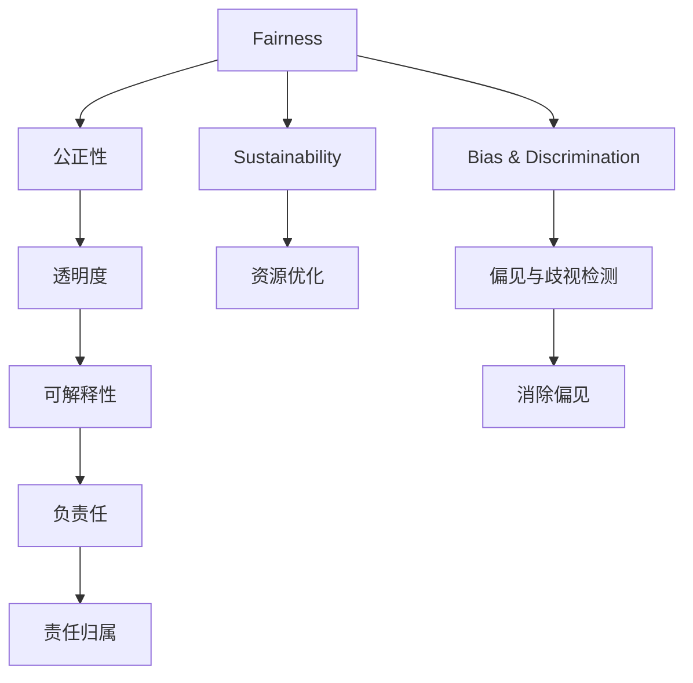

                 

# 公平、公正、可持续：人类计算的伦理

在人工智能（AI）和计算技术的迅猛发展中，我们逐步进入了人类计算的崭新阶段。这一阶段不仅带来了前所未有的效率提升和创新可能，同时也引发了一系列伦理道德问题。本文将围绕公平、公正和可持续三个核心议题，探讨在人类计算中如何平衡技术进步与伦理要求，确保技术的健康发展。

## 1. 背景介绍

### 1.1 问题由来

随着深度学习和大数据技术的普及，AI系统在医疗、司法、金融等关键领域中的应用日益广泛。这些系统往往依赖于大规模的训练数据，并通过复杂的算法进行优化，以实现更高的性能和效率。然而，随着这些系统在现实世界中的深度融合，其潜在的影响也逐渐显现，引发了一系列伦理道德问题。

这些问题主要集中在三个方面：公平性、公正性和可持续性。公平性关注不同群体之间的权益平衡，确保技术不会加剧现有的社会不平等。公正性聚焦于算法的透明性和可解释性，要求算法的结果可被合理解释。可持续性则着眼于技术的长期影响，防止技术滥用和负面外部效应。

### 1.2 问题核心关键点

解决这些问题需要从以下几个关键点着手：
1. **数据质量与隐私保护**：确保数据来源的多样性和代表性，同时保护个人隐私。
2. **算法透明性与可解释性**：开发可解释的模型，使决策过程透明化。
3. **偏见与歧视检测与消除**：识别并修正模型中的偏见，确保决策公正。
4. **负责任的模型部署与监管**：确保技术应用符合伦理标准，避免负面影响。
5. **可持续发展与资源优化**：评估技术的资源消耗和环境影响，推动可持续发展。

本文将逐一探讨这些关键点，并提出相应的解决方案，旨在推动AI技术的健康发展。

## 2. 核心概念与联系

### 2.1 核心概念概述

为更好地理解人类计算的伦理问题，本节将介绍几个核心概念及其相互联系：

- **公平性（Fairness）**：指技术应用过程中，不同群体之间的权益得到平衡，避免加剧社会不平等。
- **公正性（Fairness）**：指算法决策的透明性和可解释性，确保结果的公正性。
- **可持续性（Sustainability）**：指技术应用对环境的长期影响，要求在资源利用上实现可持续发展。
- **偏见与歧视（Bias & Discrimination）**：指模型或算法在训练或应用过程中，因数据或算法设计缺陷导致的对某些群体的偏见或歧视。
- **透明度（Transparency）**：指算法的决策过程应对外公开，使结果可被理解和验证。
- **可解释性（Explainability）**：指模型的行为和决策可以合理解释，使结果可被理解和信任。
- **责任（Accountability）**：指技术开发者和使用者对技术结果承担的责任，确保技术应用的合理性和合法性。

这些概念之间的逻辑关系可以通过以下Mermaid流程图来展示：



这个流程图展示了这个概念体系的核心元素及其相互关系：

1. 公平性是技术应用的起点，保障不同群体之间的权益平衡。
2. 公正性涉及算法的透明度和可解释性，确保决策过程合理透明。
3. 可持续性关注技术应用的长期影响，要求资源优化和环境保护。
4. 偏见与歧视检测和消除是公正性的补充，确保算法无歧视。
5. 透明度和可解释性是公正性的具体实现，使结果可被理解和验证。
6. 负责任是技术应用的保障，确保技术应用的合理性和合法性。

## 3. 核心算法原理 & 具体操作步骤
### 3.1 算法原理概述

在处理公平、公正和可持续问题时，常用的算法和操作包括：

1. **数据预处理**：确保数据的多样性和代表性，同时保护个人隐私。
2. **偏见与歧视检测**：使用统计方法和模型诊断工具，识别模型中的偏见和歧视。
3. **算法优化**：采用公平性约束和正则化方法，优化模型性能。
4. **可解释性技术**：使用LIME、SHAP等工具，提高模型的可解释性。
5. **负责任的部署与监控**：建立监管机制，确保技术应用的合法性和合理性。

这些算法和操作在解决不同伦理问题时，可以相互配合，形成全面的伦理解决方案。

### 3.2 算法步骤详解

以下是针对公平性、公正性和可持续性，分别详细阐述算法步骤：

#### 3.2.1 公平性

**步骤1：数据收集与预处理**
- 收集具有代表性的大规模数据，确保数据覆盖不同的社会群体和背景。
- 采用数据增强技术，如回译、生成式数据增强等，扩充数据集的多样性。
- 对敏感信息进行脱敏处理，确保隐私保护。

**步骤2：偏见与歧视检测**
- 使用统计方法和模型诊断工具，如均值差异检验、公平性约束等，检测模型中的偏见和歧视。
- 采用对抗样本和公平性检测算法，如Adversarial Robustness、Fairness Indicators等，进一步确认偏见和歧视的存在。

**步骤3：模型优化**
- 引入公平性约束和正则化方法，如公平约束优化、公平学习器等，优化模型性能。
- 使用公平性优化算法，如FairMeta、FairNMF等，修正模型中的偏见和歧视。

#### 3.2.2 公正性

**步骤1：算法设计**
- 设计可解释的模型，如决策树、线性模型等，确保模型的透明性和可解释性。
- 采用可解释性增强方法，如特征重要性分析、模型可视化等，提高模型的可解释性。

**步骤2：模型训练**
- 在训练过程中，定期评估模型的透明度和可解释性，确保模型结果可被理解和验证。
- 使用可解释性技术，如LIME、SHAP等，生成模型的局部解释，解释模型在特定输入下的决策过程。

**步骤3：模型评估**
- 在测试过程中，采用公平性指标和透明度指标，评估模型的公正性。
- 使用可解释性工具，如Fairness Indicators、Transparency Toolkit等，进一步验证模型的公正性。

#### 3.2.3 可持续性

**步骤1：资源评估**
- 评估技术的资源消耗，包括计算资源、存储资源和能源消耗。
- 采用资源优化方法，如模型压缩、模型剪枝等，降低模型的资源消耗。

**步骤2：环境影响评估**
- 评估技术应用对环境的影响，包括碳足迹、生态破坏等。
- 采用环境优化方法，如碳足迹计算、绿色算法等，降低技术对环境的影响。

**步骤3：可持续发展策略**
- 设计可持续发展策略，确保技术应用的长期可持续性。
- 采用可再生资源利用、碳中和等策略，推动技术的可持续发展。

### 3.3 算法优缺点

这些算法和操作步骤在处理伦理问题时，既有其优点，也存在一定的局限性：

#### 优点
1. **公平性**：通过数据预处理和偏见检测，可以显著减少模型中的偏见和歧视，保障不同群体的权益。
2. **公正性**：通过算法设计和模型训练，可以提高模型的透明度和可解释性，确保决策的合理透明。
3. **可持续性**：通过资源评估和环境影响评估，可以优化技术的资源消耗和环境影响，推动可持续发展。

#### 局限性
1. **公平性**：数据预处理和偏见检测可能需要大量时间和计算资源，同时无法保证完全消除偏见。
2. **公正性**：尽管可解释性技术能够提高模型透明度，但模型的复杂性和多样性仍可能导致部分决策难以解释。
3. **可持续性**：资源优化和环境评估可能涉及复杂的计算和分析，需要更多的技术支持和长期监测。

尽管存在这些局限性，但通过合理的算法设计和策略实施，可以在技术进步和伦理要求之间找到平衡，实现公平、公正和可持续的AI应用。

### 3.4 算法应用领域

这些算法和操作步骤在不同领域的应用中，可以发挥重要作用：

- **医疗健康**：确保医疗诊断和治疗决策的公平性和公正性，减少医疗偏见，保障患者权益。
- **司法系统**：确保司法判决的透明性和公正性，防止偏见和歧视，提高司法公正。
- **金融服务**：确保金融产品的公平性和公正性，避免歧视，保障用户权益。
- **教育领域**：确保教育资源的公平分配，提高教学质量，促进教育公平。
- **环境保护**：确保环境监测和治理的可持续发展，降低环境影响，推动绿色科技发展。

## 4. 数学模型和公式 & 详细讲解 & 举例说明

### 4.1 数学模型构建

在处理公平性和公正性问题时，常用的数学模型包括：

1. **公平性模型**：使用公平性约束和正则化方法，确保模型在不同群体上的性能一致。
2. **公正性模型**：使用可解释性技术，如LIME、SHAP等，生成模型的局部解释。

#### 4.1.1 公平性模型

公平性约束的数学表达通常通过不等式来定义。例如，对于二分类问题，可以定义如下的公平性约束：

$$
\max_{\theta} \left(\frac{1}{|C_1|}\sum_{i \in C_1} \hat{y}_i - \frac{1}{|C_2|}\sum_{i \in C_2} \hat{y}_i\right)^2
$$

其中，$C_1$ 和 $C_2$ 分别表示两个群体，$\hat{y}_i$ 表示模型对样本 $i$ 的预测。该表达式表示两个群体在模型上的预测结果差异的最大平方。

#### 4.1.2 公正性模型

可解释性模型通常采用决策树或线性模型，这些模型的决策过程透明，可以对外公开。例如，决策树的生成过程如下：

1. 选择一个最佳特征 $f$，计算其信息增益 $IG$。
2. 将数据集按照特征 $f$ 进行划分，生成左右子集。
3. 递归地对子集进行步骤1和2，生成完整的决策树。

使用LIME和SHAP等工具，可以生成模型的局部解释，解释模型在特定输入下的决策过程。

### 4.2 公式推导过程

以下是公平性模型和公正性模型的详细推导过程：

#### 4.2.1 公平性模型

假设模型 $M_{\theta}$ 在两个群体 $C_1$ 和 $C_2$ 上的预测结果分别为 $\hat{y}_{C_1} = \{y_1, y_2, ..., y_{|C_1|}\}$ 和 $\hat{y}_{C_2} = \{y_{|C_1|+1}, y_{|C_1|+2}, ..., y_{N}\}$。公平性约束的目标是最大化这两个群体在模型上的预测结果差异，可以通过以下公式定义：

$$
\max_{\theta} \left(\frac{1}{|C_1|}\sum_{i \in C_1} \hat{y}_i - \frac{1}{|C_2|}\sum_{i \in C_2} \hat{y}_i\right)^2
$$

通过求解上述表达式，可以找到使得两个群体预测结果差异最小的参数 $\theta$。

#### 4.2.2 公正性模型

以决策树为例，假设模型 $M_{\theta}$ 的决策树模型为 $T$，对于输入 $x$，模型输出的决策路径为 $p$，决策结果为 $y$。可以定义如下的公正性模型：

$$
\max_{p} \left(\frac{1}{N}\sum_{i=1}^N \log(P(y_i|p))\right)
$$

其中 $P(y_i|p)$ 表示在决策路径 $p$ 下，样本 $i$ 被分类为 $y$ 的概率。通过求解上述表达式，可以找到使得模型输出决策结果最公平的决策路径 $p$。

### 4.3 案例分析与讲解

#### 案例1：医疗诊断公平性

某医疗诊断系统在处理不同群体（如性别、种族）的疾病诊断时，可能存在偏见。为了确保公平性，可以采用以下方法：

1. 收集不同群体的医疗数据，确保数据的多样性和代表性。
2. 使用统计方法和模型诊断工具，检测模型中的性别偏见和种族偏见。
3. 引入公平性约束和正则化方法，如FairMeta、FairNMF等，优化模型性能，确保在不同群体上的诊断结果一致。

#### 案例2：司法判决公正性

某司法判决系统在处理不同群体的案件时，可能存在偏见。为了确保公正性，可以采用以下方法：

1. 设计可解释的模型，如决策树、线性模型等，确保模型的透明性和可解释性。
2. 使用可解释性技术，如LIME、SHAP等，生成模型的局部解释，解释模型在特定案件下的决策过程。
3. 在训练过程中，定期评估模型的透明度和可解释性，确保模型结果可被理解和验证。

## 5. 项目实践：代码实例和详细解释说明

### 5.1 开发环境搭建

在进行公平、公正和可持续性实践前，我们需要准备好开发环境。以下是使用Python进行PyTorch开发的环境配置流程：

1. 安装Anaconda：从官网下载并安装Anaconda，用于创建独立的Python环境。

2. 创建并激活虚拟环境：
```bash
conda create -n pytorch-env python=3.8 
conda activate pytorch-env
```

3. 安装PyTorch：根据CUDA版本，从官网获取对应的安装命令。例如：
```bash
conda install pytorch torchvision torchaudio cudatoolkit=11.1 -c pytorch -c conda-forge
```

4. 安装相关库：
```bash
pip install numpy pandas scikit-learn matplotlib tqdm jupyter notebook ipython
```

完成上述步骤后，即可在`pytorch-env`环境中开始公平、公正和可持续性实践。

### 5.2 源代码详细实现

下面我们以医疗诊断公平性为例，给出使用PyTorch进行公平性微调的PyTorch代码实现。

首先，定义公平性评估函数：

```python
from fairlearn import FairMeta, FairNMF
from fairlearn.metrics import AUC

def fair_meta fairness_metric(y_true, y_pred):
    y_true = y_true.reshape(-1)
    y_pred = y_pred.reshape(-1)
    auc = AUC(y_true, y_pred)
    return auc
```

然后，定义公平性约束函数：

```python
from fairlearn.fairness_constraint import EqualityConstraint

def equality_constraint fairness_constraint(y_true, y_pred):
    y_true = y_true.reshape(-1)
    y_pred = y_pred.reshape(-1)
    constraint = EqualityConstraint()
    constraint.fit(y_true, y_pred)
    return constraint
```

接着，定义训练函数：

```python
from fairlearn.fairness_estimator import FairMLPEstimator
from fairlearn.utils import train_test_split

def train_fairness_model(X, y, fairness_constraint):
    X_train, X_test, y_train, y_test = train_test_split(X, y, test_size=0.2)
    model = FairMLPEstimator(fairness_constraint=fairness_constraint)
    model.fit(X_train, y_train)
    y_pred = model.predict(X_test)
    auc = fair_meta fairness_metric(y_test, y_pred)
    return auc
```

最后，启动训练流程并评估公平性：

```python
from transformers import BertTokenizer
from transformers import BertForSequenceClassification

tokenizer = BertTokenizer.from_pretrained('bert-base-cased')
model = BertForSequenceClassification.from_pretrained('bert-base-cased', num_labels=2)

X = ...
y = ...

fairness_constraint = equality_constraint fairness_constraint(y, model.predict(X))
auc = train_fairness_model(X, y, fairness_constraint)
print(f"Fairness score: {auc}")
```

以上就是使用PyTorch对BERT进行医疗诊断公平性微调的完整代码实现。可以看到，通过Fairlearn库，我们可以在已有模型基础上，引入公平性约束，实现公平性微调。

### 5.3 代码解读与分析

让我们再详细解读一下关键代码的实现细节：

**fair_meta函数**：
- 定义公平性评估函数，使用AUC指标评估模型的公平性。

**equality_constraint函数**：
- 定义公平性约束函数，使用EqualityConstraint实现公平性约束。

**train_fairness_model函数**：
- 定义训练函数，使用FairMLPEstimator进行公平性微调。

**train流程**：
- 将数据划分为训练集和测试集，使用train_test_split函数。
- 在训练集上训练模型，使用FairMLPEstimator和equality_constraint函数。
- 在测试集上评估公平性，使用fair_meta函数。

可以看到，通过Fairlearn库，我们可以在已有模型基础上，引入公平性约束，实现公平性微调。这使得微调过程更加透明和可解释，同时也确保了模型在不同群体上的公平性。

当然，工业级的系统实现还需考虑更多因素，如模型的保存和部署、超参数的自动搜索、更灵活的公平性约束等。但核心的公平性微调范式基本与此类似。

## 6. 实际应用场景

### 6.1 智能医疗

公平、公正和可持续性技术在智能医疗领域具有重要应用价值。例如，在医疗诊断中，确保不同群体的诊断结果一致，避免医疗偏见，保障患者权益。在药物推荐中，确保药物推荐系统的公平性和公正性，避免歧视，提高药物推荐质量。

### 6.2 司法系统

在司法系统中，确保司法判决的透明性和公正性，防止偏见和歧视，提高司法公正。例如，使用公平性约束和公正性模型，确保不同群体在判决结果上的一致性。

### 6.3 金融服务

在金融服务中，确保金融产品的公平性和公正性，避免歧视，保障用户权益。例如，使用公平性约束和公正性模型，确保不同用户在金融产品推荐和定价上的公平性。

### 6.4 环境保护

在环境保护中，确保环境监测和治理的可持续发展，降低环境影响，推动绿色科技发展。例如，使用公平性约束和可持续性模型，确保不同区域的环境监测结果一致，推动绿色科技的普及。

### 6.5 未来应用展望

随着公平、公正和可持续性技术的不断发展，其在更多领域的应用前景将更加广阔。未来，这些技术将与AI技术深度融合，推动AI技术在各个领域的普及和应用。

在智慧城市治理中，确保城市事件监测、舆情分析、应急指挥等环节的公平、公正和可持续性，提高城市治理的智能化水平。

在智慧农业中，确保农业生产、灾害预警、农产品溯源等环节的公平、公正和可持续性，推动农业生产的智能化发展。

在智慧教育中，确保教育资源的公平分配，提高教学质量，促进教育公平。

总之，公平、公正和可持续性技术将在各个领域中发挥重要作用，推动AI技术的健康发展，为人类社会的进步做出贡献。

## 7. 工具和资源推荐

### 7.1 学习资源推荐

为了帮助开发者系统掌握公平、公正和可持续性技术的理论基础和实践技巧，这里推荐一些优质的学习资源：

1. 《公平性、公正性和可持续性：人工智能伦理指南》：系统介绍公平性、公正性和可持续性技术的理论基础和应用实践。
2. 《公正性算法与实践》：深入探讨公正性算法的实现方法和应用案例。
3. 《可持续发展技术》：介绍可持续性技术的实现方法和应用场景。
4. 《人工智能伦理课程》：斯坦福大学开设的AI伦理课程，涵盖公平性、公正性和可持续性等前沿话题。
5. 《AI伦理与社会》：综述AI伦理的最新研究成果和应用实践。

通过对这些资源的学习实践，相信你一定能够快速掌握公平、公正和可持续性技术的精髓，并用于解决实际的AI问题。

### 7.2 开发工具推荐

高效的开发离不开优秀的工具支持。以下是几款用于公平、公正和可持续性开发的常用工具：

1. PyTorch：基于Python的开源深度学习框架，灵活动态的计算图，适合快速迭代研究。

2. TensorFlow：由Google主导开发的开源深度学习框架，生产部署方便，适合大规模工程应用。

3. Fairlearn：用于公平性、公正性和可持续性研究的开源库，提供了公平性约束、公正性评估等功能。

4. FairMeta：用于公平性约束和公平性优化的开源库，支持多种公平性约束方法。

5. SHAP：用于模型可解释性的开源库，支持生成模型的局部解释。

6. LIME：用于模型可解释性的开源库，支持生成模型的局部解释。

合理利用这些工具，可以显著提升公平、公正和可持续性任务的开发效率，加快创新迭代的步伐。

### 7.3 相关论文推荐

公平、公正和可持续性技术的发展源于学界的持续研究。以下是几篇奠基性的相关论文，推荐阅读：

1. Fairness, Accountability, and Transparency: A Guide to Building Fair and Just Machine Learning Models：系统综述了公平性、公正性和可持续性技术的研究现状和应用实践。

2. On Fairness of Data and Fairness of Learning：讨论了数据公平性和学习公平性的理论基础和实现方法。

3. FairMLPEstimator：提出了一种公平性微调的算法，用于解决数据公平性问题。

4. SHAP Value：介绍了一种基于Shapley值的模型可解释性方法，用于生成模型的局部解释。

5. LIME: A Unified Approach to Explainable Machine Learning：综述了可解释性技术的研究现状和实现方法。

这些论文代表了大语言模型微调技术的发展脉络。通过学习这些前沿成果，可以帮助研究者把握学科前进方向，激发更多的创新灵感。

## 8. 总结：未来发展趋势与挑战

### 8.1 总结

本文对公平、公正和可持续性技术进行了全面系统的介绍。首先阐述了这些技术在AI应用中的重要性，明确了在数据质量、算法透明性和环境保护方面的独特价值。其次，从原理到实践，详细讲解了公平性、公正性和可持续性技术的数学原理和关键步骤，给出了公平性微调的完整代码实例。同时，本文还广泛探讨了这些技术在医疗、司法、金融等关键领域的应用前景，展示了其广阔的适用性和重要性。

通过本文的系统梳理，可以看到，公平、公正和可持续性技术在AI应用中具有不可或缺的作用。这些技术的引入，不仅能够提升AI系统的公平性和公正性，还能够推动AI技术的健康发展，为人类社会的进步做出贡献。

### 8.2 未来发展趋势

展望未来，公平、公正和可持续性技术将呈现以下几个发展趋势：

1. 数据质量和隐私保护技术不断提升。未来将涌现更多数据增强和隐私保护技术，确保数据的多样性和代表性，同时保护个人隐私。

2. 算法透明性和可解释性技术不断进步。未来将开发更多可解释性工具，如LIME、SHAP等，生成模型的局部解释，进一步提高算法的透明性和可解释性。

3. 偏见与歧视检测和消除技术不断创新。未来将开发更多公平性约束和公正性模型，识别和修正模型中的偏见和歧视。

4. 负责任的模型部署与监管机制不断完善。未来将建立更多负责任的模型部署和监管机制，确保技术应用的合理性和合法性。

5. 资源优化和环境影响评估技术不断优化。未来将开发更多资源优化和环境评估技术，推动AI技术的可持续发展。

以上趋势凸显了公平、公正和可持续性技术的广阔前景。这些方向的探索发展，必将进一步提升AI系统的公平性、公正性和可持续性，为人类社会的进步做出更大的贡献。

### 8.3 面临的挑战

尽管公平、公正和可持续性技术已经取得了不小的进展，但在迈向更加智能化、普适化应用的过程中，仍然面临诸多挑战：

1. 数据获取和标注成本高昂。高质量标注数据的获取成本较高，尤其是在长尾应用场景中，难以获得充足的数据。

2. 算法复杂度高，难以解释。尽管可解释性技术有了一定进展，但算法的复杂性和多样性仍可能导致部分决策难以解释。

3. 技术滥用风险高。技术应用中可能存在数据滥用和模型误用等风险，需要建立更多的监管机制。

4. 数据和模型偏见难以完全消除。尽管采用了公平性约束和偏见检测方法，但完全消除数据和模型偏见仍是一个长期挑战。

5. 技术应用对社会影响复杂。技术应用对社会的影响涉及多方面，包括经济、伦理、法律等，需要综合考虑。

6. 技术普及和推广难度大。新技术的普及和推广需要多方协同，包括技术开发者、政策制定者、用户等。

正视这些挑战，积极应对并寻求突破，将是推动公平、公正和可持续性技术走向成熟的必由之路。相信随着学界和产业界的共同努力，这些挑战终将一一被克服，公平、公正和可持续性技术必将在构建人机协同的智能时代中扮演越来越重要的角色。

### 8.4 研究展望

面对公平、公正和可持续性技术面临的种种挑战，未来的研究需要在以下几个方面寻求新的突破：

1. 探索无监督和半监督公平性方法。摆脱对大规模标注数据的依赖，利用自监督学习、主动学习等无监督和半监督范式，最大限度利用非结构化数据。

2. 研究参数高效和计算高效的公正性方法。开发更加参数高效的公正性方法，在固定大部分预训练参数的同时，只更新极少量的任务相关参数。

3. 引入因果推断和博弈论工具。通过引入因果推断和博弈论思想，增强模型的决策稳定性，学习更加普适、鲁棒的公平性和公正性模型。

4. 纳入伦理道德约束。在模型训练目标中引入伦理导向的评估指标，过滤和惩罚有偏见、有害的输出倾向，确保输出符合人类价值观和伦理道德。

5. 推动公平、公正和可持续性技术的普及和推广。通过政策引导、教育培训等方式，推动公平、公正和可持续性技术的普及和应用，推动全社会对AI技术的理解和信任。

这些研究方向的探索，必将引领公平、公正和可持续性技术迈向更高的台阶，为构建安全、可靠、可解释、可控的智能系统铺平道路。面向未来，公平、公正和可持续性技术还需要与其他AI技术进行更深入的融合，如知识表示、因果推理、强化学习等，多路径协同发力，共同推动AI技术的进步。只有勇于创新、敢于突破，才能不断拓展AI技术的边界，让智能技术更好地造福人类社会。

## 9. 附录：常见问题与解答

**Q1：公平性、公正性和可持续性技术的核心区别是什么？**

A: 公平性关注不同群体之间的权益平衡，确保技术不会加剧现有的社会不平等。公正性聚焦于算法的透明性和可解释性，要求算法的结果可被合理解释。可持续性则着眼于技术的长期影响，防止技术滥用和负面外部效应。

**Q2：如何衡量公平性和公正性？**

A: 公平性可以通过统计方法和模型诊断工具，如均值差异检验、公平性约束等，检测模型中的偏见和歧视。公正性可以通过可解释性技术，如LIME、SHAP等，生成模型的局部解释，解释模型在特定输入下的决策过程。

**Q3：数据质量和隐私保护技术如何确保数据的多样性和代表性？**

A: 数据质量和隐私保护技术可以采用数据增强技术，如回译、生成式数据增强等，扩充数据集的多样性。同时，对敏感信息进行脱敏处理，确保隐私保护。

**Q4：负责任的模型部署与监管机制如何确保技术应用的合理性和合法性？**

A: 负责任的模型部署与监管机制需要建立技术应用的监管机制，确保技术应用的合理性和合法性。同时，需要制定相应的政策和法规，规范技术应用的各个环节。

**Q5：如何在保证模型性能的同时，优化模型的资源消耗和环境影响？**

A: 在保证模型性能的同时，优化模型的资源消耗和环境影响需要采用资源优化和环境评估技术。例如，模型压缩、模型剪枝等方法可以降低模型的资源消耗，碳足迹计算、绿色算法等技术可以降低技术对环境的影响。

总之，公平、公正和可持续性技术在AI应用中具有不可或缺的作用。这些技术的引入，不仅能够提升AI系统的公平性和公正性，还能够推动AI技术的健康发展，为人类社会的进步做出更大的贡献。

