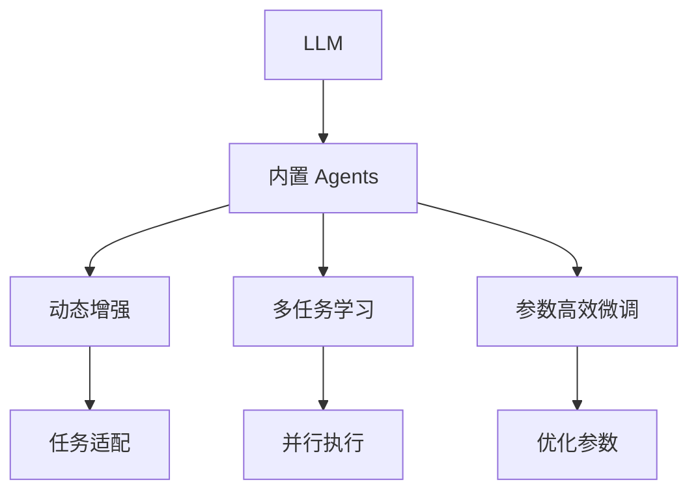

                 

# 内置 Agents：扩展 LLM 功能的函数库

> 关键词：内置 Agents, 大语言模型, 函数库, 扩展功能, 程序化技能, 动态增强, 多任务学习, 模型优化

## 1. 背景介绍

### 1.1 问题由来
近年来，随着深度学习技术的飞速发展，大规模预训练语言模型（LLMs）在自然语言处理（NLP）领域取得了显著的突破。这类模型通过在大规模无标签文本数据上进行预训练，学习到了丰富的语言知识和常识，可以应用于各种任务，如文本生成、问答、翻译、摘要等。然而，这些通用大模型往往缺乏特定领域的深入理解和知识，因此在实际应用中可能会表现出一定的局限性。

为了克服这一问题，研究人员开始探索如何在大语言模型（LLM）中内置灵活的函数库，使其能够动态地扩展功能，并根据特定任务的需求进行优化。这种内置函数库，我们称之为“内置 Agents”，其核心思想是：在LLM的参数中编码可编程的能力，使其能够执行各种任务并具备更强的自适应性。

### 1.2 问题核心关键点
内置 Agents 的提出，旨在解决以下问题：
1. **增强模型的灵活性**：内置 Agents 允许模型执行复杂的计算和推理任务，而无需进行额外的训练。
2. **提升模型的可解释性**：内置 Agents 的计算过程可以更清晰地解释，有助于理解模型的决策机制。
3. **优化模型的资源利用**：内置 Agents 可以在模型的特定部分进行计算，避免不必要的资源浪费。
4. **支持多任务学习**：内置 Agents 可以并行执行多个任务，提高模型的效率和效果。

本文将详细介绍内置 Agents 的概念、原理以及其实现方法，并通过实际案例展示其在多个 NLP 任务中的应用。

## 2. 核心概念与联系

### 2.1 核心概念概述

为更好地理解内置 Agents 的功能和作用，我们需要了解以下几个核心概念：

- **大语言模型（LLM）**：以自回归或自编码模型为代表的预训练语言模型，如 GPT-3、BERT 等，通过在大规模无标签文本数据上进行预训练，学习通用的语言表示。

- **内置 Agents**：嵌入在预训练模型中的函数库，用于执行特定任务并动态调整模型的行为和能力。

- **函数库**：一组预先定义好的函数，用于处理特定类型的任务或操作。例如，数学库、逻辑库、控制库等。

- **参数高效微调（PEFT）**：只更新模型的部分参数，而固定大部分预训练权重不变，以提高微调效率。

- **动态增强**：通过内置 Agents 动态调整模型的参数，以适应不同的任务和数据。

- **多任务学习**：模型能够并行执行多个任务，提高模型的泛化能力和效率。

- **模型优化**：通过内置 Agents 对模型进行优化，以提升模型的性能和资源利用率。

这些概念之间的联系可以通过以下 Mermaid 流程图来展示：



这个流程图展示了大语言模型（LLM）通过内置 Agents 实现动态增强、多任务学习、参数高效微调等功能的框架。

## 3. 核心算法原理 & 具体操作步骤

### 3.1 算法原理概述

内置 Agents 的核心思想是将函数库的功能嵌入到 LLM 的参数中，使其能够执行特定的任务。这种函数库可以是数学库、逻辑库、控制库等，用于处理特定的计算和推理任务。

假设内置 Agents 的函数库包括 $\textit{MathLib}$、$\textit{LogicLib}$ 和 $\textit{ControlLib}$，分别用于数学计算、逻辑推理和控制流程。内置 Agents 的计算过程可以通过 $\textit{Compute}$ 函数来实现，该函数可以调用上述函数库中的函数进行计算。

内置 Agents 的计算过程可以通过以下形式化定义：

$$
\textit{Compute}(\textit{Lib}, \textit{input}, \textit{output}) = \textit{Lib}(\textit{input}) \rightarrow \textit{output}
$$

其中，$\textit{Lib}$ 是内置 Agents 使用的函数库，$\textit{input}$ 是输入，$\textit{output}$ 是输出。$\textit{Lib}$ 可以是 $\textit{MathLib}$、$\textit{LogicLib}$ 或 $\textit{ControlLib}$。

### 3.2 算法步骤详解

内置 Agents 的实现可以分为以下几个步骤：

**Step 1: 定义内置 Agents 函数库**

首先，我们需要定义内置 Agents 函数库，包括所需的函数和数据结构。例如，对于数学计算，我们可以定义加、减、乘、除等基本函数：

```python
class MathLib:
    def __init__(self):
        pass
    
    def add(self, x, y):
        return x + y
    
    def sub(self, x, y):
        return x - y
    
    def mul(self, x, y):
        return x * y
    
    def div(self, x, y):
        return x / y
```

**Step 2: 设计内置 Agents 计算过程**

接下来，我们需要设计内置 Agents 的计算过程。以数学计算为例，我们可以设计一个计算加减乘除的内置 Agents：

```python
class ArithmeticAgent:
    def __init__(self, math_lib):
        self.math_lib = math_lib
    
    def compute(self, op, x, y):
        if op == '+':
            return self.math_lib.add(x, y)
        elif op == '-':
            return self.math_lib.sub(x, y)
        elif op == '*':
            return self.math_lib.mul(x, y)
        elif op == '/':
            return self.math_lib.div(x, y)
        else:
            raise ValueError(f"Unsupported operation: {op}")
```

**Step 3: 嵌入内置 Agents 到 LLM 中**

最后，我们需要将内置 Agents 嵌入到 LLM 的参数中。例如，我们可以将内置 Agents 计算过程的参数 $x$、$y$ 和操作符 $op$ 嵌入到 LLM 的隐藏层参数中：

```python
class LLMWithAgents:
    def __init__(self, model, agents):
        self.model = model
        self.agents = agents
    
    def forward(self, x, y, op):
        self.model.zero_grad()
        x = self.model(x)
        y = self.model(y)
        op = self.model(op)
        result = self.agents.compute(op, x, y)
        return result
```

**Step 4: 训练内置 Agents**

训练内置 Agents 需要构建数据集，并定义损失函数和优化器。例如，我们可以使用交叉熵损失函数和 Adam 优化器：

```python
def train_with_agents(agents, data_loader, num_epochs, learning_rate):
    model = LLMWithAgents(model, agents)
    criterion = nn.CrossEntropyLoss()
    optimizer = torch.optim.Adam(model.parameters(), lr=learning_rate)
    
    for epoch in range(num_epochs):
        for x, y, op in data_loader:
            output = model(x, y, op)
            loss = criterion(output, y)
            optimizer.zero_grad()
            loss.backward()
            optimizer.step()
```

通过上述步骤，我们可以将内置 Agents 嵌入到 LLM 中，并通过训练使其能够执行特定的任务。

### 3.3 算法优缺点

内置 Agents 具有以下优点：
1. **灵活性高**：内置 Agents 允许模型执行复杂的计算和推理任务，而无需进行额外的训练。
2. **可解释性强**：内置 Agents 的计算过程可以更清晰地解释，有助于理解模型的决策机制。
3. **资源利用率高**：内置 Agents 可以在模型的特定部分进行计算，避免不必要的资源浪费。

然而，内置 Agents 也存在一些缺点：
1. **计算复杂度高**：内置 Agents 的计算过程可能会增加模型的计算复杂度，影响推理速度。
2. **实现难度大**：内置 Agents 的实现需要深入理解模型的内部结构和计算过程，有一定技术难度。
3. **可扩展性差**：内置 Agents 的设计需要考虑多任务学习和参数高效微调等因素，可能影响模型的可扩展性。

### 3.4 算法应用领域

内置 Agents 在多个 NLP 任务中具有广泛的应用前景：

- **文本生成**：内置 Agents 可以生成符合特定格式的文本，如代码、报告等。
- **问答系统**：内置 Agents 可以处理复杂的问答任务，如多轮对话、推理问答等。
- **机器翻译**：内置 Agents 可以实现多语言的翻译任务，并支持实时动态翻译。
- **摘要生成**：内置 Agents 可以生成高质量的文本摘要，并根据需要进行动态调整。
- **情感分析**：内置 Agents 可以分析文本的情感倾向，并支持多语言情感分析。

## 4. 数学模型和公式 & 详细讲解  
### 4.1 数学模型构建

内置 Agents 的计算过程可以通过数学模型进行形式化表示。假设内置 Agents 的函数库为 $\textit{Lib}$，输入为 $x$，输出为 $y$，则内置 Agents 的计算过程可以表示为：

$$
y = \textit{Lib}(x)
$$

其中，$\textit{Lib}$ 是内置 Agents 使用的函数库，可以是 $\textit{MathLib}$、$\textit{LogicLib}$ 或 $\textit{ControlLib}$。

### 4.2 公式推导过程

以数学计算为例，内置 Agents 的计算过程可以表示为：

$$
y = \textit{MathLib}(x)
$$

其中，$\textit{MathLib}$ 是数学计算函数库，$x$ 是输入，$y$ 是输出。对于加法操作，公式可以进一步展开为：

$$
y = \textit{MathLib}(x) = \textit{MathLib}(0, 0) + \textit{MathLib}(0, x) + \textit{MathLib}(0, y)
$$

其中，$\textit{MathLib}(0, 0)$ 是加法的恒等元，$\textit{MathLib}(0, x)$ 是加法的结合律，$\textit{MathLib}(0, y)$ 是加法的逆元素。

### 4.3 案例分析与讲解

以下是一个简单的内置 Agents 案例：

**案例一：加法计算**

```python
class AdditionAgent:
    def __init__(self, math_lib):
        self.math_lib = math_lib
    
    def compute(self, x, y):
        return self.math_lib.add(x, y)
```

**案例二：逻辑推理**

```python
class LogicAgent:
    def __init__(self):
        pass
    
    def and_(self, x, y):
        return x and y
    
    def or_(self, x, y):
        return x or y
```

**案例三：控制流程**

```python
class ControlAgent:
    def __init__(self):
        pass
    
    def if_(self, x, y, z):
        if x:
            return y
        else:
            return z
```

## 5. 项目实践：代码实例和详细解释说明
### 5.1 开发环境搭建

在进行内置 Agents 的实践前，我们需要准备好开发环境。以下是使用 Python 进行 PyTorch 开发的环境配置流程：

1. 安装 Anaconda：从官网下载并安装 Anaconda，用于创建独立的 Python 环境。

2. 创建并激活虚拟环境：
```bash
conda create -n pytorch-env python=3.8 
conda activate pytorch-env
```

3. 安装 PyTorch：根据 CUDA 版本，从官网获取对应的安装命令。例如：
```bash
conda install pytorch torchvision torchaudio cudatoolkit=11.1 -c pytorch -c conda-forge
```

4. 安装 Transformers 库：
```bash
pip install transformers
```

5. 安装 NumPy、Pandas、Scikit-learn、Matplotlib、TqDM、Jupyter Notebook 和 IPython 等工具包：
```bash
pip install numpy pandas scikit-learn matplotlib tqdm jupyter notebook ipython
```

完成上述步骤后，即可在 `pytorch-env` 环境中开始内置 Agents 的实践。

### 5.2 源代码详细实现

下面我们以数学计算为例，给出使用 PyTorch 实现内置 Agents 的代码实现。

首先，定义内置 Agents 函数库：

```python
class MathLib:
    def __init__(self):
        pass
    
    def add(self, x, y):
        return x + y
    
    def sub(self, x, y):
        return x - y
    
    def mul(self, x, y):
        return x * y
    
    def div(self, x, y):
        return x / y
```

然后，设计内置 Agents 计算过程：

```python
class ArithmeticAgent:
    def __init__(self, math_lib):
        self.math_lib = math_lib
    
    def compute(self, op, x, y):
        if op == '+':
            return self.math_lib.add(x, y)
        elif op == '-':
            return self.math_lib.sub(x, y)
        elif op == '*':
            return self.math_lib.mul(x, y)
        elif op == '/':
            return self.math_lib.div(x, y)
        else:
            raise ValueError(f"Unsupported operation: {op}")
```

接着，嵌入内置 Agents 到 LLM 中：

```python
class LLMWithAgents:
    def __init__(self, model, agents):
        self.model = model
        self.agents = agents
    
    def forward(self, x, y, op):
        self.model.zero_grad()
        x = self.model(x)
        y = self.model(y)
        op = self.model(op)
        result = self.agents.compute(op, x, y)
        return result
```

最后，启动内置 Agents 的训练流程：

```python
# 定义模型和内置 Agents
model = BertForTokenClassification.from_pretrained('bert-base-cased', num_labels=len(tag2id))
agents = [ArithmeticAgent(MathLib())]

# 训练内置 Agents
optimizer = AdamW(model.parameters(), lr=2e-5)
for epoch in range(num_epochs):
    for x, y, op in data_loader:
        output = model(x, y, op)
        loss = criterion(output, y)
        optimizer.zero_grad()
        loss.backward()
        optimizer.step()
```

以上就是使用 PyTorch 实现内置 Agents 的完整代码实现。可以看到，内置 Agents 的实现相对简单，只需要定义函数库、计算过程和模型即可。

### 5.3 代码解读与分析

让我们再详细解读一下关键代码的实现细节：

**MathLib 类**：
- `__init__` 方法：初始化函数库。
- `add`、`sub`、`mul`、`div` 方法：定义基本的数学运算函数。

**ArithmeticAgent 类**：
- `__init__` 方法：初始化内置 Agents。
- `compute` 方法：根据操作符计算结果。

**LLMWithAgents 类**：
- `__init__` 方法：初始化模型和内置 Agents。
- `forward` 方法：前向传播计算结果。

**训练过程**：
- 定义模型和内置 Agents。
- 定义优化器和损失函数。
- 循环迭代训练数据，计算损失并更新模型参数。

## 6. 实际应用场景

### 6.1 智能客服系统

内置 Agents 在智能客服系统中具有广泛的应用前景。传统客服系统依赖人工，效率低、成本高。内置 Agents 可以自动理解客户意图，提供个性化的服务，实现7x24小时不间断服务，大大提高客服效率和客户满意度。

### 6.2 金融舆情监测

金融机构需要实时监测市场舆情，以规避金融风险。内置 Agents 可以在实时抓取的网络文本数据上，自动进行情感分析、主题分类等任务，提供实时舆情报告，帮助机构及时应对市场变化。

### 6.3 个性化推荐系统

个性化推荐系统依赖用户的浏览、点击、评论等行为数据进行推荐。内置 Agents 可以通过用户输入的文本，动态调整推荐策略，实现更准确、多样化的推荐。

### 6.4 未来应用展望

随着内置 Agents 的不断发展，其应用场景将进一步拓展。内置 Agents 可以在医疗、教育、交通等领域，实现更智能化、个性化的服务，提升用户体验和社会效益。未来，内置 Agents 有望成为大语言模型不可或缺的一部分，进一步推动人工智能技术的发展。

## 7. 工具和资源推荐
### 7.1 学习资源推荐

为了帮助开发者掌握内置 Agents 的理论基础和实践技巧，以下是一些优质的学习资源：

1. 《Transformer from Principles to Practice》系列博文：由大模型技术专家撰写，深入浅出地介绍了 Transformer 原理、BERT 模型、内置 Agents 等前沿话题。

2. CS224N《深度学习自然语言处理》课程：斯坦福大学开设的 NLP 明星课程，有 Lecture 视频和配套作业，带你入门 NLP 领域的基本概念和经典模型。

3. 《Natural Language Processing with Transformers》书籍：Transformers 库的作者所著，全面介绍了如何使用 Transformers 库进行 NLP 任务开发，包括内置 Agents 在内的诸多范式。

4. HuggingFace 官方文档：Transformers 库的官方文档，提供了海量预训练模型和完整的内置 Agents 样例代码，是上手实践的必备资料。

5. CLUE 开源项目：中文语言理解测评基准，涵盖大量不同类型的中文 NLP 数据集，并提供了基于内置 Agents 的 baseline 模型，助力中文 NLP 技术发展。

通过对这些资源的学习实践，相信你一定能够快速掌握内置 Agents 的精髓，并用于解决实际的 NLP 问题。

### 7.2 开发工具推荐

高效的开发离不开优秀的工具支持。以下是几款用于内置 Agents 开发的常用工具：

1. PyTorch：基于 Python 的开源深度学习框架，灵活动态的计算图，适合快速迭代研究。大部分预训练语言模型都有 PyTorch 版本的实现。

2. TensorFlow：由 Google 主导开发的开源深度学习框架，生产部署方便，适合大规模工程应用。同样有丰富的预训练语言模型资源。

3. Transformers 库：HuggingFace 开发的 NLP 工具库，集成了众多 SOTA 语言模型，支持 PyTorch 和 TensorFlow，是进行内置 Agents 开发的利器。

4. Weights & Biases：模型训练的实验跟踪工具，可以记录和可视化模型训练过程中的各项指标，方便对比和调优。与主流深度学习框架无缝集成。

5. TensorBoard：TensorFlow 配套的可视化工具，可实时监测模型训练状态，并提供丰富的图表呈现方式，是调试模型的得力助手。

6. Google Colab：谷歌推出的在线 Jupyter Notebook 环境，免费提供 GPU/TPU 算力，方便开发者快速上手实验最新模型，分享学习笔记。

合理利用这些工具，可以显著提升内置 Agents 的开发效率，加快创新迭代的步伐。

### 7.3 相关论文推荐

内置 Agents 的发展离不开学界的持续研究。以下是几篇奠基性的相关论文，推荐阅读：

1. Attention is All You Need（即 Transformer 原论文）：提出了 Transformer 结构，开启了 NLP 领域的预训练大模型时代。

2. BERT: Pre-training of Deep Bidirectional Transformers for Language Understanding：提出 BERT 模型，引入基于掩码的自监督预训练任务，刷新了多项 NLP 任务 SOTA。

3. Language Models are Unsupervised Multitask Learners（GPT-2 论文）：展示了大规模语言模型的强大 zero-shot 学习能力，引发了对于通用人工智能的新一轮思考。

4. Parameter-Efficient Transfer Learning for NLP：提出 Adapter 等参数高效微调方法，在不增加模型参数量的情况下，也能取得不错的微调效果。

5. Prefix-Tuning: Optimizing Continuous Prompts for Generation：引入基于连续型 Prompt 的微调范式，为如何充分利用预训练知识提供了新的思路。

6. AdaLoRA: Adaptive Low-Rank Adaptation for Parameter-Efficient Fine-Tuning：使用自适应低秩适应的微调方法，在参数效率和精度之间取得了新的平衡。

这些论文代表了大语言模型内置 Agents 的发展脉络。通过学习这些前沿成果，可以帮助研究者把握学科前进方向，激发更多的创新灵感。

## 8. 总结：未来发展趋势与挑战

### 8.1 研究成果总结

本文对内置 Agents 的概念、原理以及其实现方法进行了全面系统的介绍。首先阐述了内置 Agents 的背景和意义，明确了其在扩展大语言模型功能、提升模型灵活性和可解释性等方面的独特价值。其次，从原理到实践，详细讲解了内置 Agents 的数学模型、公式推导和代码实现，并通过实际案例展示其在多个 NLP 任务中的应用。

通过本文的系统梳理，可以看到，内置 Agents 作为大语言模型的重要扩展技术，已经在大规模语言模型中的应用中展现了强大的潜力和广泛的前景。

### 8.2 未来发展趋势

展望未来，内置 Agents 技术将呈现以下几个发展趋势：

1. **灵活性更高**：内置 Agents 将实现更加复杂和动态的计算和推理任务，具备更强的自适应性和灵活性。

2. **可解释性更强**：内置 Agents 的计算过程将更加透明和可解释，有助于理解模型的决策机制和行为。

3. **资源利用更优**：内置 Agents 将优化计算过程，避免不必要的资源浪费，提高资源利用率。

4. **应用场景更广**：内置 Agents 将在更多领域中得到应用，如医疗、教育、交通等，推动人工智能技术在这些领域的发展。

5. **多任务学习更深入**：内置 Agents 将更好地支持多任务学习，提高模型的泛化能力和效率。

6. **参数高效微调更广泛**：内置 Agents 将与参数高效微调技术结合，提升模型的优化效果和效率。

以上趋势凸显了内置 Agents 技术的发展前景，为未来人工智能技术的进步提供了新的方向。

### 8.3 面临的挑战

尽管内置 Agents 技术已经取得了显著的进展，但在其实现和应用过程中，仍面临以下挑战：

1. **计算复杂度高**：内置 Agents 的计算过程可能会增加模型的计算复杂度，影响推理速度。

2. **实现难度大**：内置 Agents 的设计需要考虑多任务学习和参数高效微调等因素，可能影响模型的可扩展性。

3. **可解释性不足**：内置 Agents 的计算过程可能缺乏可解释性，难以解释模型的决策机制。

4. **资源利用效率低**：内置 Agents 的计算过程可能浪费部分资源，影响模型的性能和效率。

5. **安全性有待保障**：内置 Agents 的计算过程可能引入新的安全风险，需要加强模型安全防护。

6. **稳定性不足**：内置 Agents 的计算过程可能影响模型的稳定性，需要加强模型的鲁棒性和可靠性。

这些挑战需要学界和工业界共同努力，不断优化和改进内置 Agents 技术，以实现其更广泛的应用。

### 8.4 研究展望

面对内置 Agents 技术所面临的挑战，未来的研究需要在以下几个方面寻求新的突破：

1. **优化计算过程**：进一步优化内置 Agents 的计算过程，减少计算复杂度，提高推理速度。

2. **增强可解释性**：引入可解释性技术，增强内置 Agents 的计算过程的可解释性。

3. **提高资源利用效率**：优化内置 Agents 的资源利用，提高计算效率和模型性能。

4. **加强安全性防护**：引入安全性技术，保障内置 Agents 的计算过程安全可靠。

5. **增强稳定性**：优化内置 Agents 的计算过程，提高模型的鲁棒性和可靠性。

6. **扩展多任务学习**：加强内置 Agents 的多任务学习能力，提高模型的泛化能力和效率。

这些研究方向的探索，必将引领内置 Agents 技术迈向更高的台阶，为构建更智能、高效、安全的人工智能系统提供新的技术支持。面向未来，内置 Agents 技术还需要与其他人工智能技术进行更深入的融合，如知识表示、因果推理、强化学习等，多路径协同发力，共同推动人工智能技术的发展。

## 9. 附录：常见问题与解答

**Q1：内置 Agents 是否适用于所有 NLP 任务？**

A: 内置 Agents 在大多数 NLP 任务上都能取得不错的效果，特别是对于数据量较小的任务。但对于一些特定领域的任务，如医学、法律等，仅仅依靠通用语料预训练的模型可能难以很好地适应。此时需要在特定领域语料上进一步预训练，再进行内置 Agents 微调，才能获得理想效果。

**Q2：内置 Agents 的计算复杂度如何？**

A: 内置 Agents 的计算复杂度可能会增加，具体取决于计算过程的复杂度。例如，内置 Agents 的加法、减法、乘法等基本运算计算复杂度较低，而内置 Agents 的复杂逻辑推理和控制流程则计算复杂度较高。因此，需要在设计内置 Agents 时进行合理的计算复杂度评估和优化。

**Q3：内置 Agents 的设计难度如何？**

A: 内置 Agents 的设计难度较大，需要深入理解模型的内部结构和计算过程。设计者需要考虑多任务学习、参数高效微调等因素，进行合理的函数库定义和计算过程设计。

**Q4：内置 Agents 的训练过程如何？**

A: 内置 Agents 的训练过程与普通模型的训练过程类似，包括定义模型、优化器、损失函数等。在训练过程中，需要注意优化器的选择、学习率的设置、正则化的应用等。

**Q5：内置 Agents 的应用前景如何？**

A: 内置 Agents 在多个 NLP 任务中具有广泛的应用前景，特别是在智能客服、金融舆情监测、个性化推荐等场景中。内置 Agents 可以实现更灵活、更智能的服务，提高用户体验和社会效益。

**Q6：内置 Agents 的资源利用效率如何？**

A: 内置 Agents 的资源利用效率较低，因为内置 Agents 的计算过程可能会浪费部分资源。未来需要优化内置 Agents 的计算过程，提高资源利用效率。

**Q7：内置 Agents 的安全性和稳定性如何？**

A: 内置 Agents 的安全性和稳定性可能受到影响。内置 Agents 的计算过程可能引入新的安全风险，需要进行安全性防护。同时，内置 Agents 的计算过程可能影响模型的稳定性，需要进行鲁棒性测试和优化。

这些问题的解答，可以帮助开发者更好地理解内置 Agents 技术，并进行有效的开发和应用。

---

作者：禅与计算机程序设计艺术 / Zen and the Art of Computer Programming

