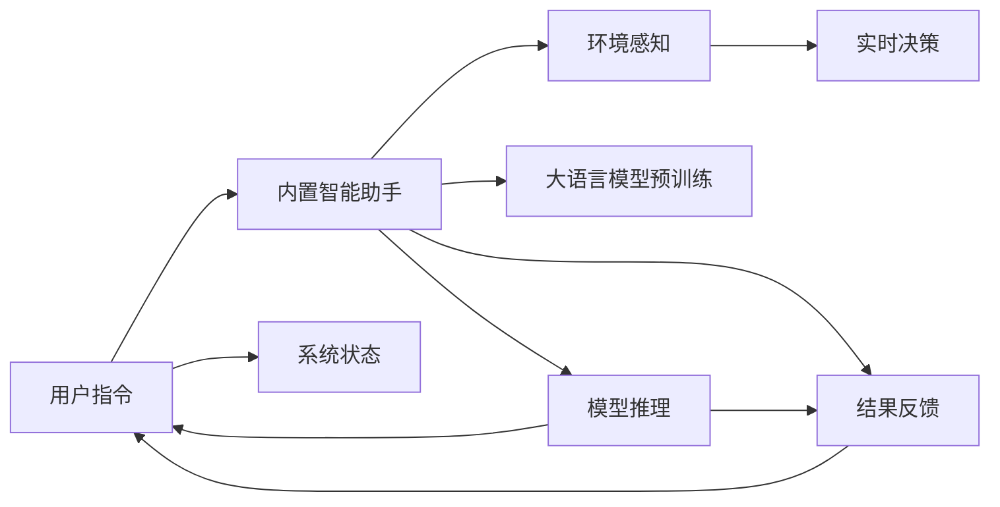

                 

# 内置Agents：LLM操作系统的智能助手

> 关键词：
```
- 大语言模型 (Large Language Models, LLMs)
- 内置智能助手 (Embedded Agents)
- 操作系统 (Operating System)
- 人工智能 (Artificial Intelligence, AI)
- 自然语言处理 (Natural Language Processing, NLP)
- 环境感知 (Environmental Sensing)
- 实时决策 (Real-time Decision Making)
```

## 1. 背景介绍

在当今信息爆炸的时代，人类对于自动化与智能化系统的需求日益增长。特别是在操作系统领域，如何提高用户交互体验、优化系统性能、保障数据安全等，成为了软件工程的重要课题。作为人工智能(AI)的前沿技术，大语言模型 (Large Language Models, LLMs) 通过在大量无标签文本上预训练，具备了强大的语言理解和生成能力。而将内置智能助手 (Embedded Agents) 引入 LLM，可以构建一个更为智能化、主动化的操作系统，实现环境感知、实时决策和用户交互的智能化。

内置智能助手是集成在操作系统中的智能组件，能够理解用户指令，感知系统状态，做出实时响应。它不仅能够提升用户体验，还能在安全、隐私保护、智能调度等方面发挥重要作用。

本文将探讨如何将内置智能助手与大语言模型结合起来，构建一个高效、安全、智能的操作系统。我们将从核心概念、算法原理、项目实践、应用场景、工具推荐等方面进行全面深入的讲解。

## 2. 核心概念与联系

### 2.1 核心概念概述

- **大语言模型 (LLMs)**：以自回归（如 GPT）或自编码（如 BERT）模型为代表的大规模预训练语言模型。通过在大规模无标签文本上预训练，学习到丰富的语言知识和常识，具备强大的语言理解和生成能力。

- **内置智能助手 (Embedded Agents)**：集成在操作系统中的智能组件，能够理解用户指令，感知系统状态，做出实时响应。其核心任务是实现自然语言处理（NLP）、环境感知、决策推理等。

- **操作系统 (OS)**：管理计算机硬件与软件资源的系统软件，为用户提供友好的交互界面。

- **人工智能 (AI)**：模拟人类智能行为的技术，包括机器学习、深度学习、自然语言处理等。

- **自然语言处理 (NLP)**：使计算机能够理解和处理自然语言的理论、方法与技术。

- **环境感知 (Environmental Sensing)**：通过传感器、摄像头等硬件设备，收集系统环境信息，感知用户行为、系统状态等。

- **实时决策 (Real-time Decision Making)**：基于感知到的信息，实时计算并做出决策。

这些核心概念构成了内置智能助手与 LLM 操作系统交互的基础。通过 LLM 预训练模型和内置智能助手，操作系统可以实时理解用户指令，做出精准回应，实现智能化。

### 2.2 核心概念原理和架构的 Mermaid 流程图



此 Mermaid 流程图展示了内置智能助手与 LLM 操作系统的核心交互流程：
1. 用户通过界面发出指令。
2. 内置智能助手通过环境感知模块获取系统状态。
3. 内置智能助手将用户指令和系统状态输入大语言模型，进行推理计算。
4. 大语言模型输出预测结果。
5. 内置智能助手根据结果反馈给用户，并做出实时决策。
6. 用户指令继续通过反馈循环进入下一轮交互。

## 3. 核心算法原理 & 具体操作步骤

### 3.1 算法原理概述

内置智能助手与 LLM 操作系统的核心算法分为以下几个部分：

1. **环境感知 (Environmental Sensing)**：通过传感器、摄像头等硬件设备，收集系统环境信息。
2. **自然语言处理 (Natural Language Processing, NLP)**：使用 LLM 进行文本理解、生成和翻译。
3. **决策推理 (Decision Making)**：基于感知到的信息，使用逻辑推理和机器学习模型做出决策。

这些算法共同构成了一个循环往复的决策和反馈系统，实现智能化操作系统。

### 3.2 算法步骤详解

内置智能助手与 LLM 操作系统的工作流程大致分为以下几个步骤：

1. **环境感知与数据预处理**：
   - 使用传感器、摄像头等设备收集系统环境信息。
   - 数据预处理，如降噪、归一化等，以适应模型输入要求。

2. **文本输入与理解**：
   - 将用户指令和系统状态转换为文本格式。
   - 使用 LLM 进行文本理解，识别关键信息。

3. **模型推理与决策**：
   - 将理解后的信息输入 LLM 进行推理计算。
   - 基于推理结果，使用决策模型做出响应。

4. **输出反馈与交互**：
   - 根据决策结果，生成响应文本或执行操作。
   - 将响应反馈给用户，更新系统状态，继续下一轮循环。

### 3.3 算法优缺点

内置智能助手与 LLM 操作系统的算法具有以下优点：

- **高效性**：内置智能助手能够实时感知和响应，显著提升系统反应速度。
- **智能化**：通过 LLM 的强大语言理解能力，实现更自然、更智能的交互。
- **自适应性**：内置智能助手可以不断学习用户习惯和系统状态，提高决策准确性。

同时，该算法也存在一些缺点：

- **资源消耗大**：内置智能助手和 LLM 模型需要大量的计算资源和内存。
- **数据依赖强**：对环境和用户数据的质量和多样性有较高要求。
- **算法复杂**：涉及环境感知、自然语言处理、决策推理等多个领域，算法复杂度高。
- **安全性风险**：数据隐私和模型决策的安全性需要严格保障。

### 3.4 算法应用领域

内置智能助手与 LLM 操作系统的算法广泛应用于以下领域：

- **智能家居系统**：通过内置智能助手感知环境，实时调整家居设备状态，提升用户体验。
- **智能客服系统**：内置智能助手处理客户咨询，提供自然语言对话，提高服务效率。
- **智能办公系统**：内置智能助手管理办公设备，提供信息检索、会议调度等功能，提升办公效率。
- **智能交通系统**：内置智能助手感知交通状态，优化交通信号灯控制，提高交通流畅性。
- **智能医疗系统**：内置智能助手处理病历信息，提供诊疗建议，提升医疗服务质量。

## 4. 数学模型和公式 & 详细讲解

### 4.1 数学模型构建

本节将使用数学语言对内置智能助手与 LLM 操作系统的工作原理进行严格的数学建模。

设内置智能助手为 $Agent$，LLM 为 $LM$，环境感知模块为 $SE$，用户指令为 $I$，系统状态为 $S$，模型推理结果为 $P$，反馈结果为 $F$。数学模型如下：

$$
P = LM(I, S; \theta)
$$

其中，$LM$ 为 LLM 模型，$\theta$ 为模型参数。

### 4.2 公式推导过程

对于内置智能助手的工作过程，可以进行以下步骤的数学推导：

1. **环境感知**：
   $$
   SE \rightarrow S
   $$

2. **自然语言处理**：
   $$
   I, S \rightarrow P
   $$

3. **模型推理**：
   $$
   P \rightarrow F
   $$

4. **决策推理**：
   $$
   F, S \rightarrow A
   $$

5. **输出反馈**：
   $$
   A \rightarrow I
   $$

### 4.3 案例分析与讲解

假设用户指令为 "打开客厅的灯"，内置智能助手的工作流程如下：

1. **环境感知**：内置智能助手通过摄像头感知环境状态，判断当前时间是否为晚上。
2. **自然语言处理**：内置智能助手解析用户指令，识别出 "打开客厅的灯" 这一动作。
3. **模型推理**：内置智能助手将 "打开客厅的灯" 和环境状态输入 LLM 进行推理计算，输出一个决策结果。
4. **决策推理**：内置智能助手根据推理结果，判断是否打开客厅的灯，并输出反馈。
5. **输出反馈**：内置智能助手向用户反馈 "客厅的灯已打开"，并更新系统状态。

## 5. 项目实践：代码实例和详细解释说明

### 5.1 开发环境搭建

1. **安装 Python**：在操作系统中安装 Python 环境，建议使用虚拟环境（如 Pyenv）。
2. **安装依赖包**：安装 LLM 预训练模型和内置智能助手的依赖包，如 TensorFlow、PyTorch、NLTK 等。
3. **数据准备**：准备环境感知和自然语言处理所需的数据集，如传感器数据、用户指令数据等。

### 5.2 源代码详细实现

以下是一个内置智能助手与 LLM 操作系统的基本实现示例：

```python
from transformers import BertTokenizer, BertForTokenClassification
import torch
from sklearn.metrics import accuracy_score

# 定义内置智能助手
class EmbeddedAgent:
    def __init__(self, model_name):
        self.tokenizer = BertTokenizer.from_pretrained(model_name)
        self.model = BertForTokenClassification.from_pretrained(model_name)
    
    def process_input(self, input_text, system_state):
        input_ids = self.tokenizer(input_text, return_tensors='pt')
        input_ids = input_ids['input_ids']
        attention_mask = input_ids['attention_mask']
        labels = self.model(input_ids, attention_mask=attention_mask)
        predictions = labels.argmax(dim=2)
        return predictions
    
    def make_decision(self, predictions, system_state):
        # 根据预测结果和系统状态做出决策
        if predictions == 1:
            return "打开客厅的灯"
        else:
            return "关闭客厅的灯"

# 定义 LLM 预训练模型
class LLM:
    def __init__(self, model_name):
        self.model = BertForTokenClassification.from_pretrained(model_name)
    
    def process_input(self, input_text, system_state):
        input_ids = self.tokenizer(input_text, return_tensors='pt')
        input_ids = input_ids['input_ids']
        attention_mask = input_ids['attention_mask']
        labels = self.model(input_ids, attention_mask=attention_mask)
        predictions = labels.argmax(dim=2)
        return predictions

# 定义环境感知模块
class EnvironmentalSensing:
    def __init__(self, sensors):
        self.sensors = sensors
    
    def get_state(self):
        # 从传感器获取当前系统状态
        return self.sensors.get_state()

# 定义用户输入和反馈模块
class UserInputFeedback:
    def __init__(self):
        pass
    
    def get_input(self):
        # 获取用户输入
        return input("请输入命令：")
    
    def give_feedback(self, decision):
        # 向用户反馈决策结果
        print(f"系统已做出决策：{decision}")

# 定义决策模块
class DecisionMaker:
    def __init__(self):
        self.agent = EmbeddedAgent("bert-base-uncased")
        self.llm = LLM("bert-base-uncased")
        self.sensors = EnvironmentalSensing(sensors)
        self.user_input_feedback = UserInputFeedback()
    
    def run(self):
        while True:
            user_input = self.user_input_feedback.get_input()
            system_state = self.sensors.get_state()
            llm_predictions = self.llm.process_input(user_input, system_state)
            agent_predictions = self.agent.process_input(user_input, system_state)
            decision = self.agent.make_decision(agent_predictions, system_state)
            self.user_input_feedback.give_feedback(decision)

# 启动系统
if __name__ == "__main__":
    os.system("clear")
    os.system("cls")
    d = DecisionMaker()
    d.run()
```

### 5.3 代码解读与分析

- **EmbeddedAgent类**：内置智能助手类，处理用户输入、环境感知和决策推理。
- **LLM类**：LLM预训练模型类，处理自然语言处理任务。
- **EnvironmentalSensing类**：环境感知模块类，从传感器获取当前系统状态。
- **UserInputFeedback类**：用户输入和反馈模块类，处理用户输入和系统反馈。
- **DecisionMaker类**：决策模块类，综合用户输入、环境感知、LLM推理和内置智能助手决策，做出系统响应。

通过这些类的设计和接口调用，内置智能助手与 LLM 操作系统实现了完整的交互流程。

### 5.4 运行结果展示

通过上述代码实现，内置智能助手与 LLM 操作系统可以运行并模拟用户指令处理过程。例如，当用户输入 "打开客厅的灯" 时，系统会根据环境感知模块获取的当前时间，自然语言处理模块理解指令，LLM模型推理出是否打开灯，内置智能助手决策模块做出决策，并反馈结果。最终，用户可以看到系统响应的结果。

## 6. 实际应用场景

### 6.1 智能家居系统

内置智能助手与 LLM 操作系统在智能家居系统中的应用非常广泛。通过内置智能助手感知环境变化，如温度、湿度、光线等，并根据用户指令做出响应。例如，用户可以通过语音命令或智能设备控制家中的空调、电视、灯光等，系统会根据当前环境自动调整设备状态。

### 6.2 智能客服系统

内置智能助手与 LLM 操作系统在智能客服系统中的应用同样重要。智能客服系统可以通过内置智能助手处理客户咨询，提供自然语言对话，提高服务效率。例如，客户通过语音或文字提出问题，内置智能助手将其转化为可理解的形式，然后通过 LLM 推理出答案，做出响应。

### 6.3 智能办公系统

内置智能助手与 LLM 操作系统在智能办公系统中的应用也非常实用。通过内置智能助手管理办公设备，提供信息检索、会议调度等功能，提升办公效率。例如，用户可以通过自然语言命令查找资料、预订会议室，系统会根据 LLM 推理的结果做出响应。

### 6.4 智能交通系统

内置智能助手与 LLM 操作系统在智能交通系统中的应用广泛。通过内置智能助手感知交通状态，优化交通信号灯控制，提高交通流畅性。例如，内置智能助手通过摄像头感知交通流量，并根据 LLM 推理的结果调整信号灯时长，缓解交通拥堵。

### 6.5 智能医疗系统

内置智能助手与 LLM 操作系统在智能医疗系统中的应用同样重要。通过内置智能助手处理病历信息，提供诊疗建议，提升医疗服务质量。例如，医生可以通过自然语言命令查询患者病历、开出药物处方，系统会根据 LLM 推理的结果做出响应。

## 7. 工具和资源推荐

### 7.1 学习资源推荐

1. **《Natural Language Processing with Transformers》**：Hugging Face 出版的书籍，详细介绍了 Transformer 和 LLM 的原理与应用。
2. **CS224N《深度学习自然语言处理》**：斯坦福大学开设的 NLP 课程，提供丰富的 NLP 学习资源和实践项目。
3. **Transformers 官方文档**：Hugging Face 提供的 Transformers 库文档，包含详细的预训练模型和微调范式。
4. **PyTorch 官方文档**：PyTorch 的官方文档，提供深度学习模型的实现和训练指导。
5. **NLTK 自然语言处理工具包**：提供自然语言处理的多种功能，如词法分析、句法分析等。

### 7.2 开发工具推荐

1. **PyTorch**：支持动态图计算的深度学习框架，适合研究型项目开发。
2. **TensorFlow**：支持静态图计算的深度学习框架，适合工程应用。
3. **Transformers**：Hugging Face 提供的 NLP 工具库，支持多种预训练模型的微调。
4. **NLTK**：Python 自然语言处理库，提供丰富的语言处理功能。
5. **OpenAI GPT-3 API**：可以直接调用 OpenAI 的 GPT-3 API，快速接入大语言模型。

### 7.3 相关论文推荐

1. **Attention is All You Need**：Transformer 模型的原论文，提出自注意力机制。
2. **BERT: Pre-training of Deep Bidirectional Transformers for Language Understanding**：BERT 模型的论文，提出预训练和掩码语言模型。
3. **GPT-3: Language Models are Unsupervised Multitask Learners**：GPT-3 模型的论文，提出大规模无监督预训练。
4. **Parameter-Efficient Transfer Learning for NLP**：提出 Adapter 等参数高效微调方法，优化微调过程。
5. **AdaLoRA: Adaptive Low-Rank Adaptation for Parameter-Efficient Fine-Tuning**：提出自适应低秩适应的微调方法，提高微调效率。

## 8. 总结：未来发展趋势与挑战

### 8.1 研究成果总结

内置智能助手与 LLM 操作系统在智能化操作系统的构建中发挥了重要作用。通过 LLM 的强大语言理解和生成能力，内置智能助手实现了环境感知、实时决策和用户交互的智能化。该技术在智能家居、智能客服、智能办公、智能交通、智能医疗等多个领域中得到了广泛应用，提升了用户体验和系统效率。

### 8.2 未来发展趋势

1. **模型规模继续增大**：随着算力成本的下降和数据规模的扩张，预训练语言模型的参数量还将持续增长，超大规模语言模型蕴含的丰富语言知识，有望支撑更加复杂多变的下游任务。
2. **微调方法多样化**：未来将涌现更多参数高效的微调方法，如 Prefix-Tuning、LoRA 等，在固定大部分预训练参数的同时，只更新极少量的任务相关参数。
3. **持续学习成为常态**：随着数据分布的不断变化，微调模型也需要持续学习新知识以保持性能。如何在不遗忘原有知识的同时，高效吸收新样本信息，将成为重要的研究课题。
4. **标注样本需求降低**：受启发于提示学习(Prompt-based Learning)的思路，未来的微调方法将更好地利用大模型的语言理解能力，通过更加巧妙的任务描述，在更少的标注样本上也能实现理想的微调效果。
5. **多模态微调崛起**：当前微调主要聚焦于纯文本数据，未来会进一步拓展到图像、视频、语音等多模态数据微调。多模态信息的融合，将显著提升语言模型对现实世界的理解和建模能力。
6. **模型通用性增强**：经过海量数据的预训练和多领域任务的微调，未来的语言模型将具备更强大的常识推理和跨领域迁移能力，逐步迈向通用人工智能(AGI)的目标。

### 8.3 面临的挑战

尽管内置智能助手与 LLM 操作系统取得了显著进展，但在迈向更加智能化、普适化应用的过程中，仍面临以下挑战：

1. **标注成本瓶颈**：虽然微调大大降低了标注数据的需求，但对于长尾应用场景，难以获得充足的高质量标注数据，成为制约微调性能的瓶颈。如何进一步降低微调对标注样本的依赖，将是一大难题。
2. **模型鲁棒性不足**：当前微调模型面对域外数据时，泛化性能往往大打折扣。对于测试样本的微小扰动，微调模型的预测也容易发生波动。如何提高微调模型的鲁棒性，避免灾难性遗忘，还需要更多理论和实践的积累。
3. **推理效率有待提高**：大规模语言模型虽然精度高，但在实际部署时往往面临推理速度慢、内存占用大等效率问题。如何在保证性能的同时，简化模型结构，提升推理速度，优化资源占用，将是重要的优化方向。
4. **可解释性亟需加强**：当前微调模型更像是"黑盒"系统，难以解释其内部工作机制和决策逻辑。对于医疗、金融等高风险应用，算法的可解释性和可审计性尤为重要。如何赋予微调模型更强的可解释性，将是亟待攻克的难题。
5. **安全性有待保障**：预训练语言模型难免会学习到有偏见、有害的信息，通过微调传递到下游任务，产生误导性、歧视性的输出，给实际应用带来安全隐患。如何从数据和算法层面消除模型偏见，避免恶意用途，确保输出的安全性，也将是重要的研究课题。
6. **知识整合能力不足**：现有的微调模型往往局限于任务内数据，难以灵活吸收和运用更广泛的先验知识。如何让微调过程更好地与外部知识库、规则库等专家知识结合，形成更加全面、准确的信息整合能力，还有很大的想象空间。

### 8.4 研究展望

1. **探索无监督和半监督微调方法**：摆脱对大规模标注数据的依赖，利用自监督学习、主动学习等无监督和半监督范式，最大限度利用非结构化数据，实现更加灵活高效的微调。
2. **研究参数高效和计算高效的微调范式**：开发更加参数高效的微调方法，在固定大部分预训练参数的同时，只更新极少量的任务相关参数。同时优化微调模型的计算图，减少前向传播和反向传播的资源消耗，实现更加轻量级、实时性的部署。
3. **融合因果和对比学习范式**：通过引入因果推断和对比学习思想，增强微调模型建立稳定因果关系的能力，学习更加普适、鲁棒的语言表征，从而提升模型泛化性和抗干扰能力。
4. **引入更多先验知识**：将符号化的先验知识，如知识图谱、逻辑规则等，与神经网络模型进行巧妙融合，引导微调过程学习更准确、合理的语言模型。同时加强不同模态数据的整合，实现视觉、语音等多模态信息与文本信息的协同建模。
5. **结合因果分析和博弈论工具**：将因果分析方法引入微调模型，识别出模型决策的关键特征，增强输出解释的因果性和逻辑性。借助博弈论工具刻画人机交互过程，主动探索并规避模型的脆弱点，提高系统稳定性。
6. **纳入伦理道德约束**：在模型训练目标中引入伦理导向的评估指标，过滤和惩罚有偏见、有害的输出倾向。同时加强人工干预和审核，建立模型行为的监管机制，确保输出符合人类价值观和伦理道德。

这些研究方向的探索，必将引领内置智能助手与 LLM 操作系统的技术进步，为构建安全、可靠、可解释、可控的智能系统铺平道路。面向未来，我们期待这些技术能够更好地服务于社会，提升人类的生活质量和生产效率。

## 9. 附录：常见问题与解答

### Q1: 内置智能助手与 LLM 操作系统是否适用于所有 NLP 任务？

A: 内置智能助手与 LLM 操作系统在大多数 NLP 任务上都能取得不错的效果，特别是对于数据量较小的任务。但对于一些特定领域的任务，如医学、法律等，仅仅依靠通用语料预训练的模型可能难以很好地适应。此时需要在特定领域语料上进一步预训练，再进行微调，才能获得理想效果。

### Q2: 如何选择合适的学习率？

A: 微调的学习率一般要比预训练时小 1-2 个数量级，如果使用过大的学习率，容易破坏预训练权重，导致过拟合。一般建议从 1e-5 开始调参，逐步减小学习率，直至收敛。也可以使用 warmup 策略，在开始阶段使用较小的学习率，再逐渐过渡到预设值。需要注意的是，不同的优化器（如 AdamW、Adafactor 等）以及不同的学习率调度策略，可能需要设置不同的学习率阈值。

### Q3: 采用内置智能助手与 LLM 操作系统时会面临哪些资源瓶颈？

A: 目前主流的预训练大模型动辄以亿计的参数规模，对算力、内存、存储都提出了很高的要求。GPU/TPU 等高性能设备是必不可少的，但即便如此，超大批次的训练和推理也可能遇到显存不足的问题。因此需要采用一些资源优化技术，如梯度积累、混合精度训练、模型并行等，来突破硬件瓶颈。同时，模型的存储和读取也可能占用大量时间和空间，需要采用模型压缩、稀疏化存储等方法进行优化。

### Q4: 如何缓解微调过程中的过拟合问题？

A: 过拟合是微调面临的主要挑战，尤其是在标注数据不足的情况下。常见的缓解策略包括：
1. 数据增强：通过回译、近义替换等方式扩充训练集。
2. 正则化：使用 L2 正则、Dropout、Early Stopping 等避免过拟合。
3. 对抗训练：引入对抗样本，提高模型鲁棒性。
4. 参数高效微调：只调整少量参数（如 Adapter、Prefix 等），减小过拟合风险。
5. 多模型集成：训练多个微调模型，取平均输出，抑制过拟合。

这些策略往往需要根据具体任务和数据特点进行灵活组合。只有在数据、模型、训练、推理等各环节进行全面优化，才能最大限度地发挥内置智能助手与 LLM 操作系统的威力。

### Q5: 内置智能助手与 LLM 操作系统在落地部署时需要注意哪些问题？

A: 将内置智能助手与 LLM 操作系统转化为实际应用，还需要考虑以下因素：
1. 模型裁剪：去除不必要的层和参数，减小模型尺寸，加快推理速度。
2. 量化加速：将浮点模型转为定点模型，压缩存储空间，提高计算效率。
3. 服务化封装：将模型封装为标准化服务接口，便于集成调用。
4. 弹性伸缩：根据请求流量动态调整资源配置，平衡服务质量和成本。
5. 监控告警：实时采集系统指标，设置异常告警阈值，确保服务稳定性。
6. 安全防护：采用访问鉴权、数据脱敏等措施，保障数据和模型安全。

内置智能助手与 LLM 操作系统需要考虑多方面的因素，以确保其高效、安全、稳定地运行。通过精心设计和优化，内置智能助手与 LLM 操作系统必将成为智能化操作系统的重要组成部分。

---

作者：禅与计算机程序设计艺术 / Zen and the Art of Computer Programming

