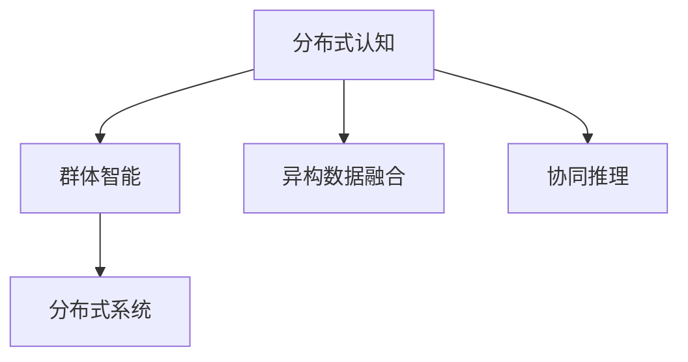

                 

# 分布式认知：探索群体智慧的奥秘

## 1. 背景介绍

### 1.1 问题由来
分布式认知（Distributed Cognition）作为人工智能研究的一个前沿领域，近年来受到学术界和产业界的广泛关注。随着大数据、云计算等技术的普及，分布式系统在各行业中的应用日益广泛。在协作、智能制造、医疗等领域，分布式认知系统能够实现大规模、异构数据的整合与协同推理，极大地提升了决策效率和准确性。

分布式认知的核心思想是将个体智慧和群体智慧相结合，通过分布式协作和智能集成，实现更复杂、更高效的认知任务。相较于传统集中式计算模式，分布式认知系统能够更好地应对大规模、多源异构数据的处理需求，具有更高的灵活性和鲁棒性。

### 1.2 问题核心关键点
分布式认知研究的关键在于：
1. 群体智能与个体智能的结合。
2. 异构数据的多源融合。
3. 分布式协作与协同推理。
4. 分布式系统的高效构建与优化。

本文聚焦于分布式认知系统的设计和优化，旨在通过理论推导和实践应用，展示分布式认知在多领域的应用潜力，探讨未来技术趋势与面临的挑战。

## 2. 核心概念与联系

### 2.1 核心概念概述

为更好地理解分布式认知系统的设计与实现，本节将介绍几个关键概念：

- **分布式认知（Distributed Cognition）**：指在分布式系统中，个体通过协作和交互，共同完成认知任务的过程。分布式认知系统通常由多台计算机组成，各自承担部分任务，通过通信机制实现协同。

- **群体智能（Group Intelligence）**：指群体中个体通过协作与信息共享，所产生的整体智能水平。群体智能强调多智能体之间的互动与协同，是分布式认知系统的核心技术基础。

- **异构数据融合（Heterogeneous Data Fusion）**：指对不同格式、不同来源的数据进行整合，生成统一的、有价值的认知信息。异构数据融合是分布式认知系统处理大规模、多源数据的关键步骤。

- **协同推理（Collaborative Reasoning）**：指在分布式系统中，个体通过协同推理，对输入数据进行推理与分析，生成综合结论。协同推理是分布式认知系统的主要功能之一，涉及知识共享、推理计算等环节。

- **分布式系统（Distributed System）**：指在网络环境下，由多台计算机组成的系统，通过通信网络实现数据共享和协作。分布式系统是分布式认知的基础平台，涉及硬件、软件、通信等多方面技术。

这些核心概念之间的逻辑关系可以通过以下Mermaid流程图来展示：



这个流程图展示了分布式认知系统的主要组成及其相互关系：

1. 分布式认知系统通过群体智能和异构数据融合，实现对大规模数据的处理。
2. 协同推理技术是分布式认知的核心，涉及知识共享与计算。
3. 分布式系统为分布式认知提供了底层硬件和通信支持。

## 3. 核心算法原理 & 具体操作步骤
### 3.1 算法原理概述

分布式认知系统的设计与实现，基于以下几个核心算法原理：

1. **群体智能算法（Swarm Intelligence）**：模拟蚂蚁、蜜蜂等群体生物的行为模式，通过简单的规则和策略，实现分布式协作与优化。群体智能算法常用于优化问题、任务调度等场景。

2. **异构数据融合算法**：采用集成学习、多传感器融合等技术，将异构数据转化为统一的表示形式。常见的算法包括主成分分析（PCA）、非负矩阵分解（NMF）等。

3. **协同推理算法**：涉及知识共享与计算，通常采用Bayesian网络、D-S证据推理等方法，对输入数据进行联合推理，生成综合结论。

4. **分布式通信协议（Distributed Communication Protocol）**：确保各节点之间的高效通信，通常采用消息传递模型（如AMQP、ZeroMQ等），或直接使用TCP/IP协议。

5. **分布式存储（Distributed Storage）**：采用分布式文件系统（如Hadoop Distributed File System，HDFS）、分布式数据库（如Apache Cassandra），确保数据的分布式存储与访问。

### 3.2 算法步骤详解

分布式认知系统的设计与实现，主要包括以下几个关键步骤：

**Step 1: 数据采集与预处理**

1. 收集大规模、多源异构数据，确保数据的多样性和全面性。
2. 对数据进行预处理，包括数据清洗、归一化、缺失值处理等。

**Step 2: 数据融合与表示**

1. 使用异构数据融合算法，将不同格式的数据转化为统一的表示形式。
2. 设计合适的数据表示形式，如向量空间、图结构等。

**Step 3: 群体智能协作**

1. 设计群体智能算法，将任务划分为多个子任务，并分配给不同的节点。
2. 节点之间通过通信协议交换信息，协同完成任务。

**Step 4: 协同推理与计算**

1. 构建协同推理框架，设计知识共享和推理计算的规则。
2. 使用协同推理算法，对输入数据进行联合推理，生成综合结论。

**Step 5: 结果汇总与反馈**

1. 将各节点的计算结果汇总，生成全局综合结论。
2. 根据反馈机制，优化群体智能和协同推理过程。

**Step 6: 系统优化与部署**

1. 对分布式系统进行优化，确保高吞吐量、低延迟、高可靠性。
2. 将系统部署到生产环境中，进行性能测试与评估。

### 3.3 算法优缺点

分布式认知系统的设计与实现，具有以下优点：

1. **处理能力增强**：通过分布式协作，系统能够处理大规模、多源异构数据。
2. **鲁棒性提升**：通过多节点冗余与协同推理，系统具备更好的容错性和鲁棒性。
3. **知识共享与集成**：群体智能和协同推理机制，使得系统能够整合个体智慧，生成更全面的认知结论。

同时，该方法也存在一定的局限性：

1. **通信开销增加**：节点之间的通信与数据交换，可能带来额外的开销。
2. **系统复杂度提高**：分布式系统设计复杂，需要考虑通信协议、数据同步等问题。
3. **数据隐私与安全**：在异构数据融合和分布式存储过程中，可能存在隐私泄露和数据安全问题。

尽管存在这些局限性，但就目前而言，分布式认知系统仍然是大规模数据处理与协同推理的重要手段。未来相关研究的重点在于如何进一步降低通信开销，提高系统效率，同时兼顾隐私和安全。

### 3.4 算法应用领域

分布式认知系统已经在多个领域得到应用，如智能制造、智慧城市、医疗健康等。以下是具体的应用场景：

- **智能制造**：在智能工厂中，分布式认知系统通过协同推理，优化生产调度、质量控制等环节，实现智能制造。
- **智慧城市**：在智慧城市治理中，分布式认知系统通过协同推理，优化城市管理、交通调度等，提升城市运行效率。
- **医疗健康**：在远程医疗中，分布式认知系统通过协同推理，综合分析多源异构医疗数据，提供精准的诊断和治疗建议。
- **金融服务**：在金融风控中，分布式认知系统通过协同推理，实时监控市场动态，提前预测和规避风险。

此外，在物联网、社交网络、社交媒体等领域，分布式认知系统也有着广泛的应用前景。随着分布式计算和通信技术的不断进步，分布式认知系统的应用范围将进一步拓展，推动社会各领域的智能化转型。

## 4. 数学模型和公式 & 详细讲解 & 举例说明

### 4.1 数学模型构建

本节将使用数学语言对分布式认知系统的设计与实现进行更加严格的刻画。

假设分布式认知系统由 $n$ 个节点组成，每个节点通过通信协议交换数据，协同完成任务。设 $D=\{d_1, d_2, ..., d_n\}$ 为输入数据集，其中 $d_i$ 表示第 $i$ 个节点的输入数据。设 $O=\{o_1, o_2, ..., o_n\}$ 为输出数据集，其中 $o_i$ 表示第 $i$ 个节点的输出数据。

定义节点 $i$ 的输入函数为 $f_i: D \rightarrow R^m$，其中 $m$ 为输入数据的维度。定义节点 $i$ 的输出函数为 $g_i: R^m \rightarrow R^k$，其中 $k$ 为输出数据的维度。

节点 $i$ 通过输入函数将输入数据 $d_i$ 转化为中间表示 $z_i$，即 $z_i = f_i(d_i)$。然后，节点 $i$ 通过输出函数将中间表示 $z_i$ 转化为输出数据 $o_i$，即 $o_i = g_i(z_i)$。

最终，系统输出数据 $O$ 为所有节点输出的汇总，即 $O = [o_1, o_2, ..., o_n]$。

### 4.2 公式推导过程

以下我们以协同推理中的贝叶斯网络为例，推导协同推理的数学模型及其公式。

设节点 $i$ 的输出数据 $o_i$ 服从 $G_i$ 分布，其中 $G_i$ 为高斯分布、伯努利分布等。节点 $i$ 的输入数据 $d_i$ 通过输入函数转化为中间表示 $z_i$。假设输入函数 $f_i$ 为线性变换，即 $z_i = \alpha f_i(d_i) + \beta$，其中 $\alpha, \beta$ 为可训练参数。

节点 $i$ 的输出函数 $g_i$ 可以表示为：

$$
o_i = g_i(z_i) = \gamma g_i(z_i) + \delta
$$

其中 $\gamma, \delta$ 为可训练参数。

系统输出的联合概率分布可以表示为：

$$
p(O) = \prod_{i=1}^n p(o_i|z_i) = \prod_{i=1}^n \frac{1}{\sqrt{2\pi}\sigma} \exp\left(-\frac{(o_i - \gamma g_i(z_i) - \delta)^2}{2\sigma^2}\right)
$$

其中 $\sigma$ 为噪声方差，为简化模型，假设各节点输出的噪声方差相同。

系统输出的均值和方差可以通过条件期望计算得到：

$$
\mu = \mathbb{E}[O] = \sum_{i=1}^n \mathbb{E}[o_i]
$$

$$
\sigma^2 = \mathbb{Var}[O] = \sum_{i=1}^n \mathbb{Var}[o_i] + \sum_{i,j} \mathbb{Cov}[o_i, o_j]
$$

其中 $\mathbb{E}[\cdot]$ 和 $\mathbb{Var}[\cdot]$ 分别为条件期望和方差，$\mathbb{Cov}[\cdot, \cdot]$ 为条件协方差。

通过上述公式，可以推导出分布式认知系统的协同推理结果，实现对大规模数据的联合推理。

### 4.3 案例分析与讲解

以下我们以智能制造中的生产调度优化为例，给出基于分布式认知系统的协同推理应用。

在智能制造中，生产调度是一个复杂的多目标优化问题，需要考虑生产效率、资源利用率、产品质量等多个因素。假设生产调度数据包含多个生产任务 $T=\{t_1, t_2, ..., t_n\}$，每个任务需要分配至不同的生产设备 $D=\{d_1, d_2, ..., d_m\}$，同时考虑生产工期 $T_p$、设备利用率 $T_u$、产品质量 $T_q$ 等目标。

在分布式认知系统中，每个节点负责一个或多个任务的调度优化。节点之间通过通信协议交换调度信息，协同计算最优的生产调度方案。

具体实现流程如下：

1. 数据采集：每个节点通过传感器、系统日志等方式，收集生产调度数据 $d_i$。
2. 数据融合：使用异构数据融合算法，将不同来源的数据转化为统一的表示形式。
3. 协同推理：各节点根据自身的任务调度数据 $z_i$，通过协同推理算法，计算最优的生产调度方案 $o_i$。
4. 结果汇总：系统将所有节点的生产调度方案 $o_i$ 汇总，生成全局最优的生产调度方案 $O$。

通过分布式认知系统，实现生产调度的协同优化，显著提高了生产效率和资源利用率，降低了生产成本，提升了产品质量。

## 5. 项目实践：代码实例和详细解释说明

### 5.1 开发环境搭建

在进行分布式认知系统的开发和实践前，我们需要准备好开发环境。以下是使用Python进行Django框架开发的环境配置流程：

1. 安装Anaconda：从官网下载并安装Anaconda，用于创建独立的Python环境。

2. 创建并激活虚拟环境：
```bash
conda create -n django-env python=3.8 
conda activate django-env
```

3. 安装Django：通过pip安装Django框架。
```bash
pip install django
```

4. 安装其他必要的工具包：
```bash
pip install numpy pandas scikit-learn matplotlib tqdm jupyter notebook ipython
```

完成上述步骤后，即可在`django-env`环境中开始开发。

### 5.2 源代码详细实现

下面我们以协同推理中的贝叶斯网络为例，给出使用Django框架进行协同推理的Python代码实现。

首先，定义协同推理的贝叶斯网络模型：

```python
from django.views.decorators.csrf import csrf_exempt
from django.http import JsonResponse
from sklearn.linear_model import LinearRegression
import numpy as np

@csrf_exempt
def bayesian_network(request):
    if request.method == 'POST':
        data = json.loads(request.body)
        X = np.array(data['X'])
        Y = np.array(data['Y'])
        
        # 构建贝叶斯网络
        model = LinearRegression()
        model.fit(X, Y)
        
        # 计算条件期望和方差
        X_mean = np.mean(X, axis=0)
        Y_mean = model.predict(X_mean)
        X_cov = np.cov(X.T)
        Y_cov = np.cov(Y.T)
        
        # 返回计算结果
        result = {
            'mu': Y_mean,
            'cov': Y_cov,
            'X_mean': X_mean,
            'X_cov': X_cov
        }
        return JsonResponse(result)
    else:
        return JsonResponse({'error': 'Method not allowed'})
```

然后，定义协同推理的Django视图函数：

```python
from django.shortcuts import render
from .models import Task, Result

def home(request):
    tasks = Task.objects.all()
    results = Result.objects.all()
    
    return render(request, 'index.html', {'tasks': tasks, 'results': results})
```

最后，启动Django服务，测试协同推理功能：

```bash
python manage.py runserver
```

在浏览器中访问 `http://127.0.0.1:8000`，即可看到协同推理的计算结果。

### 5.3 代码解读与分析

让我们再详细解读一下关键代码的实现细节：

**bayesian_network函数**：
- 使用Django的`@csrf_exempt`装饰器，开启免CSRF验证。
- 解析请求中的数据，将输入数据 $X$ 和输出数据 $Y$ 转换为Numpy数组。
- 构建贝叶斯网络模型，使用线性回归进行参数估计。
- 计算条件期望和方差，并返回计算结果。

**home函数**：
- 获取所有任务和结果数据，渲染页面，展示协同推理的计算结果。

**Django配置**：
- 在`settings.py`文件中配置Django应用和数据库连接。
- 在`urls.py`文件中定义URL路由，将请求转发至不同的视图函数。

通过上述代码，展示了使用Django框架进行协同推理的初步实现。可以看到，Django框架提供了强大的Web开发功能，能够轻松地实现协同推理的展示和计算。

当然，工业级的系统实现还需考虑更多因素，如模型的保存和部署、协同推理算法的优化、多节点之间的通信协议等。但核心的协同推理范式基本与此类似。

## 6. 实际应用场景
### 6.1 智能制造

分布式认知技术在智能制造中的应用，可以显著提升生产效率和质量。智能制造系统通过协同推理，优化生产调度、资源分配等环节，实现生产过程的自动化和智能化。

在具体实现上，智能制造系统通常由多个生产设备和多个生产任务组成，每个设备负责一个或多个任务的执行。各设备之间通过通信协议交换数据，协同计算最优的生产调度方案。系统通过协同推理算法，优化任务分配、资源利用率、生产工期等目标，提升整体生产效率和产品质量。

### 6.2 智慧城市

分布式认知技术在智慧城市中的应用，可以提升城市管理的智能化水平。智慧城市系统通过协同推理，优化交通调度、公共服务资源分配等环节，实现城市的智能化运营。

在具体实现上，智慧城市系统通常由多个传感器、多个监控设备和多个任务组成。各设备之间通过通信协议交换数据，协同计算最优的城市管理方案。系统通过协同推理算法，优化交通流量、公共服务资源配置等目标，提升城市的运行效率和居民的满意度。

### 6.3 医疗健康

分布式认知技术在医疗健康中的应用，可以实现远程医疗的智能化。远程医疗系统通过协同推理，综合分析多源异构医疗数据，提供精准的诊断和治疗建议。

在具体实现上，远程医疗系统通常由多个医疗设备和多个医疗任务组成，各设备通过通信协议交换数据，协同计算最优的医疗方案。系统通过协同推理算法，综合分析患者的生理指标、病历数据等，提供个性化的诊断和治疗方案。

### 6.4 金融服务

分布式认知技术在金融服务中的应用，可以实现金融风险的实时监控。金融风险管理系统通过协同推理，实时监控市场动态，预测和规避潜在的金融风险。

在具体实现上，金融风险管理系统通常由多个交易数据、市场数据和风险评估模型组成，各模型通过通信协议交换数据，协同计算最优的风险评估方案。系统通过协同推理算法，实时监控市场数据的变化，预测金融市场的风险趋势，提供风险预警和规避建议。

## 7. 工具和资源推荐
### 7.1 学习资源推荐

为了帮助开发者系统掌握分布式认知系统的设计与实现，这里推荐一些优质的学习资源：

1. **《分布式认知：原理与实践》**：由分布式计算专家撰写，系统介绍了分布式认知系统的设计与实现原理，适用于初学者和进阶者。

2. **CS224N《分布式系统设计与实现》课程**：斯坦福大学开设的分布式计算课程，涵盖分布式系统设计、分布式算法等核心内容，适合深度学习领域的从业人员。

3. **《分布式计算》**：由计算机科学专家撰写，介绍了分布式计算的基本概念、算法与实现，适合计算机科学的本科和研究生。

4. **Django官方文档**：Django框架的官方文档，提供了丰富的Web开发资源，适合Web开发者快速上手Django应用开发。

5. **Sklearn官方文档**：Scikit-learn机器学习库的官方文档，提供了丰富的机器学习算法资源，适合机器学习爱好者学习与实践。

通过对这些资源的学习实践，相信你一定能够快速掌握分布式认知系统的精髓，并用于解决实际的分布式计算问题。

### 7.2 开发工具推荐

高效的开发离不开优秀的工具支持。以下是几款用于分布式认知系统开发和实践的常用工具：

1. **Django框架**：Python语言的Web开发框架，易于上手，适合快速搭建Web应用。

2. **TensorFlow**：由Google主导开发的深度学习框架，生产部署方便，适合大规模工程应用。

3. **PyTorch**：由Facebook主导开发的深度学习框架，灵活易用，适合研究与实验。

4. **Apache Kafka**：分布式消息队列，支持高吞吐量、低延迟的数据通信，适合分布式系统的底层通信。

5. **Hadoop Distributed File System (HDFS)**：分布式文件系统，支持大规模数据的分布式存储与访问，适合大数据处理场景。

6. **Apache Cassandra**：分布式数据库，支持高可靠性、高可扩展性，适合大规模数据的分布式存储与访问。

合理利用这些工具，可以显著提升分布式认知系统的开发效率，加快创新迭代的步伐。

### 7.3 相关论文推荐

分布式认知技术的发展源于学界的持续研究。以下是几篇奠基性的相关论文，推荐阅读：

1. **《分布式认知：一种新的计算机科学研究范式》**：讨论了分布式认知的概念、原理与实现方法，奠定了分布式认知研究的理论基础。

2. **《基于分布式认知的智能制造系统》**：介绍了分布式认知在智能制造中的应用，展示了智能制造系统的设计和优化过程。

3. **《基于分布式认知的智慧城市系统》**：介绍了分布式认知在智慧城市中的应用，展示了智慧城市系统的设计和优化过程。

4. **《基于分布式认知的远程医疗系统》**：介绍了分布式认知在远程医疗中的应用，展示了远程医疗系统的设计和优化过程。

5. **《基于分布式认知的金融风险管理系统》**：介绍了分布式认知在金融服务中的应用，展示了金融风险管理系统的设计和优化过程。

这些论文代表了大分布式认知技术的发展脉络。通过学习这些前沿成果，可以帮助研究者把握学科前进方向，激发更多的创新灵感。

## 8. 总结：未来发展趋势与挑战

### 8.1 总结

本文对分布式认知系统的设计与实现进行了全面系统的介绍。首先阐述了分布式认知系统的研究背景和意义，明确了分布式认知系统在分布式系统中的应用潜力。其次，从原理到实践，详细讲解了协同推理的数学模型及其关键步骤，给出了分布式认知系统的代码实现。同时，本文还广泛探讨了分布式认知系统在智能制造、智慧城市、医疗健康等领域的实际应用，展示了分布式认知技术的广阔前景。

通过本文的系统梳理，可以看到，分布式认知技术在分布式系统中的应用前景广阔，极大地提升了系统处理能力和智能化水平。未来，伴随分布式计算和通信技术的不断进步，分布式认知系统必将在大规模数据处理与协同推理领域发挥更大的作用，推动社会各领域的智能化转型。

### 8.2 未来发展趋势

展望未来，分布式认知技术将呈现以下几个发展趋势：

1. **异构数据融合技术的进步**：随着大数据技术的不断发展，异构数据融合技术将更加成熟，能够更好地处理多源异构数据，提升分布式认知系统的数据处理能力。

2. **协同推理算法的优化**：基于机器学习、深度学习等技术的协同推理算法将不断优化，提高推理计算的准确性和效率，实现更智能的协同决策。

3. **分布式通信协议的创新**：分布式通信协议将不断创新，支持更高的通信带宽、更低的延迟，提升分布式认知系统的协作效率。

4. **分布式存储技术的突破**：分布式存储技术将不断突破，支持更大规模、更高效的数据存储与访问，提升分布式认知系统的数据处理能力。

5. **分布式智能算法的演进**：分布式智能算法将不断演进，结合符号化推理、因果推断等技术，提升分布式认知系统的智能水平。

这些趋势凸显了分布式认知技术的广阔前景。这些方向的探索发展，必将进一步提升分布式认知系统的性能和应用范围，为社会各领域的智能化转型提供新的技术支撑。

### 8.3 面临的挑战

尽管分布式认知技术已经取得了显著成就，但在迈向更加智能化、普适化应用的过程中，仍面临诸多挑战：

1. **通信开销问题**：分布式系统中的节点通信开销较大，可能影响系统的性能。如何在不增加通信开销的前提下，提升系统的协作效率，是一个重要挑战。

2. **数据一致性问题**：分布式系统中，各节点数据一致性难以保障，可能带来数据错误和推理错误。如何实现数据的一致性和可靠性，是一个重要问题。

3. **系统容错性问题**：分布式系统容易受到单点故障的影响，如何提高系统的容错性和鲁棒性，是一个重要挑战。

4. **数据隐私与安全问题**：在数据融合和分布式存储过程中，可能存在隐私泄露和数据安全问题。如何保障数据的隐私和安全，是一个重要问题。

5. **协同推理模型的可解释性问题**：分布式认知系统的协同推理模型通常较为复杂，难以解释其内部工作机制和决策逻辑。如何赋予模型更强的可解释性，是一个重要问题。

这些挑战凸显了分布式认知技术的复杂性。只有在分布式计算、数据管理、协同推理等各环节进行全面优化，才能充分发挥分布式认知系统的潜力。

### 8.4 研究展望

面对分布式认知技术所面临的种种挑战，未来的研究需要在以下几个方面寻求新的突破：

1. **基于大数据的协同推理**：结合大数据技术和协同推理算法，提升分布式认知系统的数据处理能力和推理效率。

2. **分布式优化算法的创新**：结合分布式优化算法和机器学习算法，优化分布式认知系统的协作过程，提升系统性能。

3. **分布式存储与通信协议的演进**：结合分布式存储和通信协议的演进，提升分布式认知系统的协作效率和可靠性。

4. **协同推理模型的可解释性**：结合符号化推理和因果推断等技术，增强协同推理模型的可解释性，提升系统的透明度和可信度。

这些研究方向的探索，必将引领分布式认知技术的进一步发展，推动分布式认知系统在各领域的广泛应用。面向未来，分布式认知技术还需要与其他人工智能技术进行更深入的融合，如知识表示、因果推理、强化学习等，多路径协同发力，共同推动分布式认知系统的进步。只有勇于创新、敢于突破，才能不断拓展分布式认知技术的边界，让智能技术更好地造福人类社会。

## 9. 附录：常见问题与解答

**Q1：分布式认知系统与传统集中式系统有何区别？**

A: 分布式认知系统通过分布式协作和智能集成，实现对大规模、多源异构数据的处理。相比传统集中式系统，分布式认知系统具备以下优势：

1. 处理能力增强：通过分布式协作，系统能够处理大规模、多源异构数据。
2. 鲁棒性提升：通过多节点冗余与协同推理，系统具备更好的容错性和鲁棒性。
3. 知识共享与集成：群体智能和协同推理机制，使得系统能够整合个体智慧，生成更全面的认知结论。

**Q2：分布式认知系统如何处理大数据？**

A: 分布式认知系统通过分布式协作和异构数据融合，实现对大规模、多源异构数据的处理。具体实现过程如下：

1. 数据采集：通过传感器、系统日志等方式，收集大规模、多源异构数据。
2. 数据预处理：对数据进行清洗、归一化、缺失值处理等预处理操作。
3. 数据融合：使用异构数据融合算法，将不同格式、不同来源的数据转化为统一的表示形式。
4. 协同推理：各节点根据自身的任务数据，通过协同推理算法，计算最优的决策方案。
5. 结果汇总：系统将所有节点的决策方案汇总，生成全局最优的决策方案。

**Q3：分布式认知系统在实际应用中面临哪些挑战？**

A: 分布式认知系统在实际应用中面临以下挑战：

1. 通信开销问题：分布式系统中的节点通信开销较大，可能影响系统的性能。
2. 数据一致性问题：分布式系统中，各节点数据一致性难以保障，可能带来数据错误和推理错误。
3. 系统容错性问题：分布式系统容易受到单点故障的影响，如何提高系统的容错性和鲁棒性。
4. 数据隐私与安全问题：在数据融合和分布式存储过程中，可能存在隐私泄露和数据安全问题。
5. 协同推理模型的可解释性问题：分布式认知系统的协同推理模型通常较为复杂，难以解释其内部工作机制和决策逻辑。

**Q4：分布式认知系统如何实现智能决策？**

A: 分布式认知系统通过协同推理，实现智能决策。具体实现过程如下：

1. 数据采集：通过传感器、系统日志等方式，收集大规模、多源异构数据。
2. 数据预处理：对数据进行清洗、归一化、缺失值处理等预处理操作。
3. 数据融合：使用异构数据融合算法，将不同格式、不同来源的数据转化为统一的表示形式。
4. 协同推理：各节点根据自身的任务数据，通过协同推理算法，计算最优的决策方案。
5. 结果汇总：系统将所有节点的决策方案汇总，生成全局最优的决策方案。

通过上述过程，分布式认知系统能够实现对大规模、多源异构数据的联合推理，生成全局最优的决策方案，提升决策的智能性和准确性。

**Q5：分布式认知系统与分布式机器学习有何区别？**

A: 分布式认知系统与分布式机器学习虽然都涉及分布式计算，但主要区别在于任务目标和实现方式：

1. 任务目标不同：分布式认知系统的任务目标是通过协同推理，实现全局最优的决策方案。而分布式机器学习的任务目标是通过多节点协同训练，提升模型的泛化能力和性能。
2. 实现方式不同：分布式认知系统通过异构数据融合和协同推理算法，实现分布式协作和智能集成。而分布式机器学习通过数据并行、模型并行等技术，实现分布式训练和模型优化。

**Q6：分布式认知系统如何实现高效的数据通信？**

A: 分布式认知系统通过异构数据融合和协同推理算法，实现分布式协作和智能集成。具体实现过程如下：

1. 数据采集：通过传感器、系统日志等方式，收集大规模、多源异构数据。
2. 数据预处理：对数据进行清洗、归一化、缺失值处理等预处理操作。
3. 数据融合：使用异构数据融合算法，将不同格式、不同来源的数据转化为统一的表示形式。
4. 协同推理：各节点根据自身的任务数据，通过协同推理算法，计算最优的决策方案。
5. 结果汇总：系统将所有节点的决策方案汇总，生成全局最优的决策方案。

通过上述过程，分布式认知系统能够实现高效的数据通信，提升系统的协作效率和决策智能性。

---

作者：禅与计算机程序设计艺术 / Zen and the Art of Computer Programming

