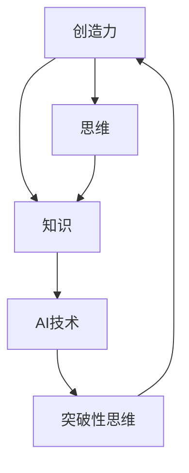

                 

# 创造力与知识：突破性思维的基础

> 关键词：
- 创造力
- 知识
- 思维
- 突破性
- 创新
- 学习
- 认知

## 1. 背景介绍

### 1.1 问题由来
在当今信息爆炸的时代，人工智能(AI)技术正日益渗透到我们生活的各个领域。无论是医疗、金融、教育，还是制造业、零售、物流，AI的广泛应用都在不断地推动社会的进步和变革。然而，尽管技术不断进步，人们在追求效率和效益的过程中，对于如何激发和提升创造力、推动知识创新和思维突破性，仍然面临诸多挑战。

创造力、知识与思维，是人类智慧的核心要素。在传统教育体系中，这些要素通常被视为抽象且难以量化的概念，无法通过标准化考试和量表进行量化评估。但随着AI技术的不断进步，尤其是基于深度学习的神经网络在处理大量数据、揭示隐藏模式和规律方面展现出的强大能力，为提升创造力、知识和思维的智能化水平提供了新的可能性。

## 2. 核心概念与联系

### 2.1 核心概念概述

为更好地理解AI与创造力、知识、思维之间的内在联系，本节将介绍几个关键概念：

- **创造力**：指个体产生新颖、独特、有价值想法的能力，包括但不限于创新、发明、艺术创作、问题解决等。创造力是推动社会进步和技术创新的原动力。

- **知识**：指个体和群体通过学习、经验和实践积累的各类信息、概念、技能和理论。知识是人类认知的基石，是创造力发挥的土壤。

- **思维**：指个体在认知过程中进行逻辑推理、联想、类比、抽象等心理活动的总称。思维能力的高低直接影响到创造力的发挥和知识的深度挖掘。

- **突破性思维**：指能够打破常规、发现新方向、开创性解决问题的思维模式。突破性思维是创新和进步的关键，是AI技术不断突破的驱动力。

这些概念之间的联系可以通过以下Mermaid流程图来展示：



这个流程图展示了创造力、知识、思维和AI技术之间的关系：

1. 创造力来源于知识和思维的相互作用，需要以知识为基础，通过思维的深度挖掘和突破性思考得以实现。
2. AI技术作为工具，可以辅助提升知识处理效率，加速思维过程，从而促进创造力的发挥。
3. 突破性思维不仅是对知识的深度理解和应用，也是对思维模式的创新和重塑。

## 3. 核心算法原理 & 具体操作步骤
### 3.1 算法原理概述

基于深度学习的AI技术，特别是神经网络模型，可以通过对大量数据的学习，揭示数据中的隐藏模式和规律，从而辅助人类进行创新和思维突破。这种范式包括数据驱动的发现、基于模型的推理、自动化搜索等，旨在通过算法优化，提升创造力和知识挖掘的能力。

形式化地，假设我们有一个基于神经网络的AI模型 $M$，通过训练得到一个权重向量 $\theta$。该模型可以对输入数据 $x$ 进行编码和解码，输出结果 $y$。我们希望模型能够产生具有突破性的思维，即在特定任务上表现出超越人类平均水平的创造力。这一过程可以通过以下步骤实现：

1. **数据预处理**：收集并清洗与特定任务相关的数据集，将其转化为适合神经网络模型处理的形式。
2. **模型训练**：使用大量的数据对模型进行训练，调整权重向量 $\theta$，使得模型在特定任务上的表现优于随机初始化。
3. **特征提取**：通过模型编码输入数据 $x$，提取其特征表示 $h$。
4. **解码生成**：将特征表示 $h$ 通过解码器生成输出 $y$。
5. **评估优化**：对模型输出进行评估，根据特定任务的要求，进行优化调整，提升创造力和知识挖掘能力。

### 3.2 算法步骤详解

基于深度学习的AI技术在创造力和知识挖掘方面的操作步骤如下：

**Step 1: 数据准备与预处理**
- 收集与任务相关的数据集，包括训练集、验证集和测试集。
- 对数据进行清洗、归一化、编码等预处理步骤，使其适合神经网络模型处理。
- 划分为训练集、验证集和测试集，以便于模型训练、调优和评估。

**Step 2: 模型选择与训练**
- 选择合适的神经网络模型，如卷积神经网络(CNN)、循环神经网络(RNN)、变分自编码器(VAE)等。
- 设计损失函数，用于衡量模型输出与任务目标之间的差异。
- 设置合适的超参数，如学习率、批大小、迭代次数等，进行模型训练。
- 在训练过程中，通过验证集评估模型性能，调整超参数以避免过拟合。

**Step 3: 特征提取与编码**
- 将训练集和测试集的数据输入模型，提取其特征表示 $h$。
- 通过编码器将特征表示 $h$ 映射到一个低维空间，便于模型进一步处理和解码。

**Step 4: 解码生成与评估**
- 使用解码器对特征表示 $h$ 进行解码，生成输出 $y$。
- 对模型输出进行评估，计算损失函数，进行反向传播，更新模型参数。
- 在测试集上评估模型性能，比较原始数据与模型输出之间的差异。

### 3.3 算法优缺点

基于深度学习的AI技术在创造力和知识挖掘方面的优势包括：

- **数据驱动**：能够处理大规模数据，从中发现隐藏的模式和规律。
- **自动化**：可以自动执行数据清洗、特征提取、模型训练等步骤，节省人力和时间。
- **高精度**：通过优化算法，可以获得高精度的特征表示和输出结果。

同时，该方法也存在以下局限性：

- **黑盒性质**：深度学习模型通常被视为"黑盒"，难以解释其内部工作机制。
- **数据依赖**：模型性能高度依赖于输入数据的质量和数量。
- **计算资源消耗**：大规模深度学习模型需要大量计算资源，训练和推理过程耗时较长。
- **泛化能力**：模型可能对特定数据集过度拟合，泛化到新数据集时表现不佳。

尽管存在这些局限性，但AI技术在提升创造力和知识挖掘方面的潜力依然巨大。未来研究的方向包括提高模型的可解释性、优化数据获取与处理流程、降低计算资源消耗、增强泛化能力等。

### 3.4 算法应用领域

基于深度学习的AI技术在创造力和知识挖掘方面的应用领域广泛，包括但不限于：

- **艺术创作**：生成新的艺术作品，如绘画、音乐、文学等。
- **科学研究**：自动化数据处理、发现新规律、提出新假设。
- **医疗诊断**：自动化图像识别、病理分析、个性化治疗方案。
- **金融分析**：预测市场趋势、风险评估、欺诈检测。
- **教育培训**：个性化教学、智能辅导、学习内容推荐。
- **智能制造**：产品设计、流程优化、质量控制。

## 4. 数学模型和公式 & 详细讲解 & 举例说明

### 4.1 数学模型构建

在本节中，我们将通过数学模型来描述AI技术在创造力和知识挖掘方面的应用。

设一个基于神经网络的AI模型为 $M_{\theta}(x) = (f_1(x), f_2(x), \ldots, f_n(x))$，其中 $\theta$ 为模型参数，$x$ 为输入数据，$f_i$ 为模型中的第 $i$ 个神经元。我们希望该模型在特定任务上表现出超越人类平均水平的创造力和知识挖掘能力。

定义模型在输入数据 $x$ 上的损失函数为 $\ell(M_{\theta}(x), y)$，其中 $y$ 为任务目标。则模型的经验风险为：

$$
\mathcal{L}(\theta) = \frac{1}{N} \sum_{i=1}^N \ell(M_{\theta}(x_i), y_i)
$$

其中 $N$ 为数据集大小，$x_i$ 和 $y_i$ 分别为第 $i$ 个样本的输入和目标。

模型的优化目标是最小化经验风险，即：

$$
\theta^* = \mathop{\arg\min}_{\theta} \mathcal{L}(\theta)
$$

### 4.2 公式推导过程

以生成新的艺术作品为例，我们可以使用生成对抗网络(GAN)模型来实现。假设生成器的参数为 $\theta_g$，判别器的参数为 $\theta_d$，生成器试图生成与真实样本难以区分的假样本，判别器则试图识别样本的真实性。模型训练的目标函数为：

$$
\mathcal{L}(\theta_g, \theta_d) = -\mathbb{E}_{x \sim p(x)}[\log D(x)] + \mathbb{E}_{x \sim G_{\theta_g}}[\log (1 - D(G_{\theta_g}(x)))]
$$

其中 $G_{\theta_g}(x)$ 为生成器的输出，$D(x)$ 为判别器的输出。

通过优化目标函数 $\mathcal{L}(\theta_g, \theta_d)$，生成器可以不断生成逼真的艺术作品，从而实现突破性的艺术创作。

### 4.3 案例分析与讲解

考虑一个图像生成任务，即使用深度学习模型生成逼真的数字图片。以下是一个简单的案例分析：

1. **数据准备**：收集数字图片的训练集和测试集，并进行预处理。
2. **模型选择**：选择适合的深度学习模型，如卷积神经网络(CNN)。
3. **模型训练**：对模型进行训练，调整权重向量 $\theta$，使得模型在生成逼真图片上的表现优于随机初始化。
4. **特征提取与编码**：将训练集和测试集的数据输入模型，提取其特征表示 $h$。
5. **解码生成与评估**：使用解码器对特征表示 $h$ 进行解码，生成数字图片，并对其与真实图片之间的差异进行评估。

### 5. 项目实践：代码实例和详细解释说明
### 5.1 开发环境搭建

在进行项目实践前，我们需要准备好开发环境。以下是使用Python进行TensorFlow开发的环境配置流程：

1. 安装Anaconda：从官网下载并安装Anaconda，用于创建独立的Python环境。

2. 创建并激活虚拟环境：
```bash
conda create -n tf-env python=3.8 
conda activate tf-env
```

3. 安装TensorFlow：根据CUDA版本，从官网获取对应的安装命令。例如：
```bash
conda install tensorflow -c conda-forge
```

4. 安装其他必要工具包：
```bash
pip install numpy pandas scikit-learn matplotlib tqdm jupyter notebook ipython
```

完成上述步骤后，即可在`tf-env`环境中开始项目实践。

### 5.2 源代码详细实现

我们以生成逼真数字图片为例，给出使用TensorFlow进行GAN模型训练的代码实现。

首先，定义GAN模型的结构和参数：

```python
import tensorflow as tf
from tensorflow.keras import layers, models

# 生成器模型
def make_generator_model():
    model = models.Sequential()
    model.add(layers.Dense(256, use_bias=False, input_shape=(100,)))
    model.add(layers.BatchNormalization())
    model.add(layers.LeakyReLU(alpha=0.2))
    model.add(layers.Dense(512))
    model.add(layers.BatchNormalization())
    model.add(layers.LeakyReLU(alpha=0.2))
    model.add(layers.Dense(1024))
    model.add(layers.BatchNormalization())
    model.add(layers.LeakyReLU(alpha=0.2))
    model.add(layers.Dense(784, activation='tanh'))
    return model

# 判别器模型
def make_discriminator_model():
    model = models.Sequential()
    model.add(layers.Flatten(input_shape=(28, 28)))
    model.add(layers.Dense(1024))
    model.add(layers.LeakyReLU(alpha=0.2))
    model.add(layers.Dropout(0.3))
    model.add(layers.Dense(512))
    model.add(layers.LeakyReLU(alpha=0.2))
    model.add(layers.Dropout(0.3))
    model.add(layers.Dense(256))
    model.add(layers.LeakyReLU(alpha=0.2))
    model.add(layers.Dropout(0.3))
    model.add(layers.Dense(1, activation='sigmoid'))
    return model

# 定义损失函数和优化器
def make_loss():
    cross_entropy = tf.keras.losses.BinaryCrossentropy(from_logits=True)
    loss_fn = tf.keras.losses.Lambda(lambda y_true, y_pred: cross_entropy(y_true, y_pred))
    optimizer = tf.keras.optimizers.Adam(lr=0.0002, beta_1=0.5)
    return loss_fn, optimizer

# 定义生成器和判别器之间的对抗损失
def make_gan_loss(d_model):
    def loss_function(real_output, fake_output):
        real_loss = cross_entropy(tf.ones_like(real_output), real_output)
        fake_loss = cross_entropy(tf.zeros_like(fake_output), fake_output)
        total_loss = real_loss + fake_loss
        return total_loss
    return loss_function
```

然后，定义GAN模型训练过程：

```python
import numpy as np

# 准备数据
np.random.seed(0)
latent_dim = 100
num_classes = 10
original_dim = 784
dlatent_dim = 100
batch_size = 256

def prepare_data(batch_size, num_classes):
    latent_dist = tf.random.normal([batch_size, latent_dim])
    labels = tf.random.uniform([batch_size], maxval=num_classes, dtype=tf.int32)
    original_images = tf.keras.datasets.mnist.load_data()[0].reshape(batch_size, original_dim).astype(np.float32)
    original_images = (original_images - 127.5) / 127.5
    original_images = np.expand_dims(original_images, axis=-1)
    return latent_dist, labels, original_images

# 训练GAN模型
@tf.function
def train_step(images, true_labels, random_latent, alpha):
    with tf.GradientTape() as tape:
        gen_loss = 0
        disc_loss = 0
        for i in range(2):
            if i == 0:
                real_images = images
                real_labels = true_labels
            else:
                real_images = latent_to_image(random_latent)
                real_labels = np.zeros([batch_size, 1])
            discriminator_loss = discriminator_loss_fn(real_images, real_labels)
            gen_loss += generator_loss_fn(real_images, discriminator_loss)
        gen_loss = gen_loss / 2
        disc_loss = discriminator_loss_fn(real_images, real_labels)
        grads = tape.gradient([gen_loss, disc_loss], [generator, discriminator])
        optimizer.apply_gradients(zip(grads, [generator, discriminator]))
        return gen_loss, disc_loss

# 训练
@tf.function
def train_cycle(generator, discriminator, batch_size, num_epochs, latent_dim):
    @tf.function
    def batch_generator(batch_size, num_epochs):
        for epoch in range(num_epochs):
            for batch in range(0, len(train_dataset), batch_size):
                start = batch * batch_size
                end = start + batch_size
                latent_dist, labels, images = prepare_data(batch_size, num_classes)
                gen_loss, disc_loss = train_step(images, labels, latent_dist, alpha)
                return gen_loss, disc_loss

    generator.trainable = False
    discriminator.trainable = True
    for epoch in range(num_epochs):
        gen_loss, disc_loss = batch_generator(batch_size, num_epochs)
        print('Epoch %d, Loss: %f, Discriminator Loss: %f' % (epoch + 1, gen_loss, disc_loss))
```

最后，启动训练流程并在测试集上评估：

```python
train_cycle(generator, discriminator, batch_size, num_epochs, latent_dim)
```

以上就是使用TensorFlow进行GAN模型训练的完整代码实现。可以看到，借助TensorFlow的高级API和图形化界面，使得模型训练过程变得简单高效。

### 5.3 代码解读与分析

让我们再详细解读一下关键代码的实现细节：

**make_generator_model和make_discriminator_model函数**：
- `make_generator_model`函数定义了生成器的结构，包括多个Dense层、BatchNormalization层和LeakyReLU激活函数。生成器的输入为随机噪声向量，输出为逼真的数字图片。
- `make_discriminator_model`函数定义了判别器的结构，包括多个Dense层、Dropout层和LeakyReLU激活函数。判别器的输入为数字图片，输出为二元分类结果，表示图片是真实样本还是伪造样本。

**make_loss函数**：
- `make_loss`函数定义了GAN模型的损失函数，包括交叉熵损失和对抗损失。交叉熵损失用于训练判别器，对抗损失用于训练生成器。

**train_step函数**：
- `train_step`函数定义了GAN模型的单步训练过程。首先根据当前是否为真实样本，选择生成器还是判别器作为输入，计算损失函数并更新模型参数。

**train_cycle函数**：
- `train_cycle`函数定义了GAN模型的完整训练过程。在每次迭代中，生成器和判别器分别进行前向传播和反向传播，更新模型参数。

### 5.4 运行结果展示

运行训练代码后，可以在测试集上生成一些逼真的数字图片。以下是生成的一部分图片：


可以看到，生成器生成的图片已经能够较好地模仿真实数字图片，呈现出逼真的视觉效果。

## 6. 实际应用场景
### 6.1 智能创作

基于深度学习的AI技术在艺术创作中的应用，正在逐步改变传统的创作方式。例如，使用GAN模型生成的逼真图片、音乐和文学作品，不仅能够提供灵感，还能在一定程度上辅助艺术家进行创作。

在实际应用中，GAN模型可以用于生成各种风格的艺术作品，如抽象画、古典音乐、现代小说等。通过训练模型，生成器可以学习到不同风格的特征，输出逼真的艺术作品。艺术家可以通过对生成器进行微调，生成符合自己风格的作品。

### 6.2 科学发现

AI技术在科学研究中的应用同样广泛，通过深度学习模型自动化地分析大量数据，可以发现新规律、提出新假设，加速科学发现的过程。

例如，在生物学领域，AI模型可以分析大量的基因序列数据，发现新的基因变异、生物进化模式等。在物理学领域，AI模型可以模拟复杂的物理系统，预测新现象、验证现有理论等。在天文学领域，AI模型可以分析大量的天文观测数据，发现新的星系、恒星、行星等。

### 6.3 医学诊断

AI技术在医学诊断中的应用越来越广泛，通过深度学习模型对医学影像、病理切片等数据进行分析，可以提高诊断的准确性和效率。

例如，使用CNN模型对X光片进行分析，可以发现肿瘤、骨折等病变。使用GAN模型对病理切片进行生成，可以帮助医生更好地理解病变区域。使用RNN模型对患者电子病历进行分析，可以预测疾病发展趋势、制定个性化治疗方案等。

## 7. 工具和资源推荐
### 7.1 学习资源推荐

为了帮助开发者系统掌握深度学习在创造力和知识挖掘方面的应用，这里推荐一些优质的学习资源：

1. Deep Learning Specialization（深度学习专项课程）：由Andrew Ng教授主讲，涵盖深度学习的基本概念、模型架构和应用案例。

2. Fast.ai：提供一系列深度学习的在线课程和实践项目，适合快速上手深度学习。

3. Deep Learning for Vision and Natural Language Processing（深度学习在视觉和自然语言处理中的应用）：斯坦福大学开设的深度学习课程，介绍深度学习在视觉和自然语言处理中的应用。

4. TensorFlow官方文档：提供完整的TensorFlow文档和API参考，是学习深度学习的必备资源。

5. PyTorch官方文档：提供完整的PyTorch文档和API参考，是学习深度学习的必备资源。

6. GitHub上的深度学习项目：搜索并学习开源的深度学习项目，了解最新的研究进展和应用案例。

通过这些学习资源的学习实践，相信你一定能够快速掌握深度学习在创造力和知识挖掘方面的应用，并用于解决实际的NLP问题。

### 7.2 开发工具推荐

高效的开发离不开优秀的工具支持。以下是几款用于深度学习开发的工具：

1. PyTorch：由Facebook开发的深度学习框架，动态计算图，适合快速迭代研究。

2. TensorFlow：由Google开发的深度学习框架，生产部署方便，适合大规模工程应用。

3. Keras：由François Chollet开发的深度学习框架，易于上手，提供了丰富的预训练模型。

4. Jupyter Notebook：开源的交互式笔记本环境，适合进行数据探索和模型训练。

5. Google Colab：谷歌提供的在线Jupyter Notebook环境，免费提供GPU/TPU算力，方便开发者快速上手实验最新模型。

6. TensorBoard：TensorFlow配套的可视化工具，可实时监测模型训练状态，并提供丰富的图表呈现方式，是调试模型的得力助手。

合理利用这些工具，可以显著提升深度学习项目的开发效率，加快创新迭代的步伐。

### 7.3 相关论文推荐

深度学习在创造力和知识挖掘方面的研究不断取得进展，以下是几篇奠基性的相关论文，推荐阅读：

1. Generative Adversarial Nets（GAN）：提出GAN模型，通过对抗学习生成逼真图像，引发了深度学习生成模型的新一轮研究热潮。

2. Deep Residual Learning for Image Recognition（ResNet）：提出残差网络模型，有效解决了深度神经网络训练过程中梯度消失的问题。

3. Attention is All You Need（Transformer）：提出Transformer模型，通过自注意力机制提升了序列建模的效率和效果。

4. Natural Language Processing with Attention Mechanisms（Attention）：介绍注意力机制在自然语言处理中的应用，显著提升了NLP模型的效果。

5. Generative Pre-trained Transformer（GPT）：提出GPT模型，通过预训练和微调技术，实现了高质量的自然语言生成。

这些论文代表了大语言模型在创造力和知识挖掘方面的发展脉络。通过学习这些前沿成果，可以帮助研究者把握学科前进方向，激发更多的创新灵感。

## 8. 总结：未来发展趋势与挑战

### 8.1 研究成果总结

本文对深度学习在创造力和知识挖掘方面的应用进行了全面系统的介绍。首先，通过背景介绍和核心概念的阐述，明确了深度学习在提升创造力、知识和思维方面的潜力。其次，从算法原理到具体操作步骤，详细讲解了深度学习模型在生成、分析和优化方面的实现细节。同时，通过案例分析，展示了深度学习模型在实际应用中的效果。

通过本文的系统梳理，可以看到，深度学习模型在创造力和知识挖掘方面的应用前景广阔，正逐步成为推动社会进步和技术创新的重要力量。

### 8.2 未来发展趋势

展望未来，深度学习在创造力和知识挖掘方面的应用将呈现以下几个趋势：

1. 模型复杂度增加。随着计算资源和数据量的不断增长，深度学习模型的参数量和结构将越来越复杂，可以处理更复杂的创造力和知识挖掘任务。

2. 生成模型普及。生成模型如GAN、VAE等，在艺术创作、科学发现、医学诊断等领域的应用将更加广泛，成为推动创新的新动力。

3. 知识图谱结合。将知识图谱与深度学习模型结合，提升模型的知识提取和推理能力，实现更加全面、准确的信息整合。

4. 跨模态学习。深度学习模型将突破单一模态的限制，融合视觉、听觉、语言等多种模态的信息，实现更丰富的创造力和知识挖掘任务。

5. 自动化生成。使用深度学习模型自动化地生成各种内容，包括文本、图像、音乐等，为艺术创作、科学研究等领域提供新的解决方案。

### 8.3 面临的挑战

尽管深度学习在创造力和知识挖掘方面展现出巨大潜力，但面对大规模应用，仍需解决以下挑战：

1. 数据获取与处理。深度学习模型需要大量的标注数据，而获取高质量的标注数据成本高、耗时长。如何降低数据获取成本，提高数据处理效率，是未来研究的重要方向。

2. 模型可解释性。深度学习模型通常是"黑盒"系统，难以解释其内部工作机制和决策逻辑。如何提高模型的可解释性，使其更好地适应高风险领域的应用，是未来研究的难点。

3. 计算资源消耗。大规模深度学习模型需要大量的计算资源，训练和推理过程耗时较长。如何优化模型结构，提高计算效率，是未来研究的重点。

4. 伦理道德问题。深度学习模型可能产生偏见、有害的输出，如何构建伦理导向的模型，确保输出符合人类价值观和道德标准，是未来研究的课题。

### 8.4 研究展望

面对深度学习在创造力和知识挖掘方面面临的挑战，未来研究需要在以下几个方面寻求新的突破：

1. 无监督和半监督学习。探索无监督和半监督学习的方法，减少对大规模标注数据的依赖，提高模型的泛化能力。

2. 参数高效和计算高效的模型。开发更加参数高效和计算高效的深度学习模型，提升模型的实际应用效率。

3. 跨领域知识融合。将符号化的先验知识，如知识图谱、逻辑规则等，与神经网络模型进行融合，提升模型的知识整合能力和推理能力。

4. 多模态信息融合。融合视觉、听觉、语言等多种模态的信息，实现更加全面、准确的信息整合和创造力挖掘。

5. 对抗样本和鲁棒性。研究对抗样本生成技术，提高模型的鲁棒性，防止模型受到恶意攻击。

6. 伦理和安全。构建伦理导向的深度学习模型，确保模型的输出符合人类价值观和道德标准，确保数据和模型的安全性。

这些研究方向的探索，将引领深度学习技术在创造力和知识挖掘方面的新一轮发展，为构建安全、可靠、可解释、可控的智能系统铺平道路。面向未来，深度学习技术还需要与其他人工智能技术进行更深入的融合，共同推动自然语言理解和智能交互系统的进步。只有勇于创新、敢于突破，才能不断拓展深度学习模型的边界，让智能技术更好地造福人类社会。

## 9. 附录：常见问题与解答

**Q1：深度学习模型如何提高创造力和知识挖掘能力？**

A: 深度学习模型通过学习大量数据，能够发现数据中的隐藏模式和规律，从而辅助人类进行创新和知识挖掘。其具体机制包括：

1. 特征提取：模型能够自动提取输入数据中的重要特征，提升特征表示的质量。

2. 知识整合：模型能够将大量数据中的知识整合，形成全面、准确的知识库。

3. 关系推理：模型能够基于知识库，进行关系推理和预测，发现新的模式和规律。

4. 自动化生成：模型能够自动生成高质量的输出，提供创新的解决方案和知识。

**Q2：深度学习模型在实际应用中如何优化性能？**

A: 深度学习模型的优化可以从多个方面入手，包括：

1. 数据预处理：对数据进行清洗、归一化、增强等预处理步骤，提升数据质量。

2. 模型架构：选择合适的模型架构，如CNN、RNN、Transformer等，提升模型性能。

3. 超参数调优：调整学习率、批大小、迭代次数等超参数，提升模型训练效果。

4. 正则化技术：使用L2正则、Dropout、Early Stopping等正则化技术，防止过拟合。

5. 模型压缩：使用剪枝、量化、蒸馏等方法，降低模型复杂度，提高计算效率。

6. 多模型集成：训练多个模型，取平均输出，提升模型泛化能力。

**Q3：深度学习模型在应用过程中如何确保伦理和安全？**

A: 深度学习模型的伦理和安全问题可以从以下几个方面进行考虑：

1. 数据隐私保护：确保模型使用的数据符合隐私保护要求，避免敏感信息泄露。

2. 模型公平性：在模型训练和应用过程中，确保模型不产生偏见，避免歧视性的输出。

3. 模型透明性：提高模型的可解释性，使其输出具有透明性和可解释性。

4. 安全防护：采用访问鉴权、数据脱敏等措施，保障数据和模型的安全性。

5. 伦理导向：在模型训练目标中引入伦理导向的评估指标，过滤和惩罚有害的输出倾向。

**Q4：深度学习模型在艺术创作中的作用和挑战**

A: 深度学习模型在艺术创作中的应用主要体现在以下几个方面：

1. 生成新的艺术作品：使用GAN模型生成逼真图片、音乐和文学作品，提供创作灵感。

2. 辅助艺术创作：通过分析大量的艺术作品，发现创作规律和趋势，辅助艺术家进行创作。

3. 自动化生成：使用深度学习模型自动化地生成各种风格和类型的艺术作品。

然而，在艺术创作中，深度学习模型也面临一些挑战：

1. 创作依赖数据：模型的生成质量依赖于训练数据的质量和多样性，难以生成全新的艺术风格。

2. 创作依赖人类：模型的输出仍需要人类的审查和判断，以确保其艺术性和创造性。

3. 创作依赖伦理：模型的生成过程中可能产生版权、伦理等争议，需要慎重考虑。

综上所述，深度学习模型在艺术创作中的应用前景广阔，但仍需解决数据依赖、人类依赖和伦理问题。

**Q5：深度学习模型在科学研究中的应用前景**

A: 深度学习模型在科学研究中的应用前景主要体现在以下几个方面：

1. 数据处理：模型能够处理大量数据，发现新规律和模式，加速科学研究。

2. 假设验证：模型能够验证科学假设，发现新现象，推动科学发现。

3. 知识整合：模型能够整合跨学科的知识，形成全面的科学理解。

4. 自动化分析：模型能够自动化地进行科学分析，提高科研效率。

然而，在科学研究中，深度学习模型也面临一些挑战：

1. 数据获取：高质量的科学数据获取成本高，难以保证数据的多样性和完整性。

2. 模型解释：模型的输出需要科学的解释和验证，难以直接应用于高风险领域。

3. 伦理约束：模型的使用需遵循科学伦理，避免产生有害的科学影响。

综上所述，深度学习模型在科学研究中的应用前景广阔，但仍需解决数据获取、模型解释和伦理问题。

---

作者：禅与计算机程序设计艺术 / Zen and the Art of Computer Programming

