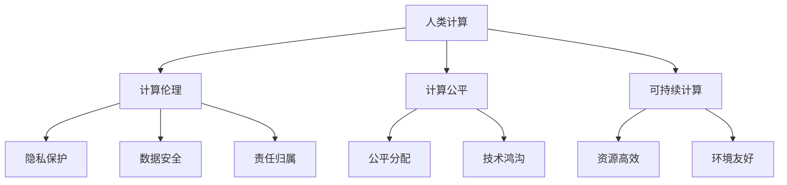

                 

# 创造更美好的明天：人类计算的积极作用

## 1. 背景介绍

### 1.1 问题由来
随着科技的不断进步，人类计算正以前所未有的速度改变着我们的生活方式和社会结构。从最初的机械计算，到电子计算机的问世，再到如今的人工智能和量子计算的兴起，每一次技术变革都在重新定义人类与机器的关系，推动着社会的整体进步。然而，这些技术的优势和劣势同样明显，如何平衡它们的影响，引导它们为人类带来更多福祉，是当前科技发展过程中需要深思的问题。

### 1.2 问题核心关键点
1. **计算的利与弊**：计算机和人工智能技术带来了前所未有的效率提升和问题解决能力，但也引发了隐私、安全、伦理等新问题。
2. **人类计算的社会影响**：计算技术的广泛应用，如何对教育、医疗、环境等社会重要领域产生积极影响？
3. **可持续发展的计算**：如何在追求计算效率的同时，保证环境的可持续性，避免资源浪费和环境破坏。
4. **公平与公正的计算**：如何让计算技术更加公平地服务于每一个人，避免技术鸿沟带来的不平等。

这些问题的答案，关乎人类计算的积极作用，以及未来的可持续发展。本文将围绕这些关键点，深入探讨人类计算的积极作用及其社会影响。

## 2. 核心概念与联系

### 2.1 核心概念概述

- **人类计算**：指利用计算技术解决人类社会问题，提升生活质量的活动。涵盖从传统计算到人工智能、量子计算等多个领域。
- **计算伦理**：在计算技术应用过程中，涉及的隐私保护、数据安全、责任归属等伦理问题。
- **计算公平**：确保计算技术带来的利益能够公平地分配给每一个人，避免技术鸿沟带来的社会不平等。
- **可持续计算**：计算技术的开发和应用，应当考虑环境影响，追求资源高效利用和环境友好。

这些概念之间相互关联，共同构成了人类计算的宏观框架。计算技术的进步，应以伦理、公平和可持续为原则，服务于人类社会的整体福祉。

### 2.2 核心概念原理和架构的 Mermaid 流程图



这个流程图展示了人类计算在伦理、公平和可持续三个方面的具体应用，以及它们之间的相互影响。

## 3. 核心算法原理 & 具体操作步骤

### 3.1 算法原理概述

人类计算的积极作用，不仅在于其技术本身带来的效率提升，还在于其对人类社会问题的解决能力。具体来说，人类计算的积极作用可以通过以下几个方面来体现：

1. **提高效率**：通过自动化处理和数据分析，大大提升问题解决的效率。
2. **增强决策质量**：利用计算技术进行数据驱动的决策，提高决策的科学性和准确性。
3. **促进创新**：计算技术的应用，推动了科学研究的进展和创新能力的提升。
4. **促进社会公正**：通过计算技术的应用，实现资源的公平分配和公正使用。
5. **环境保护**：利用计算技术优化资源利用，减少环境污染和资源浪费。

这些积极作用，需要通过算法和技术的实现来具体体现。

### 3.2 算法步骤详解

以下是一个典型的人类计算应用步骤：

1. **问题定义**：明确需要解决的社会问题，如医疗诊断、环境保护等。
2. **数据收集**：收集相关数据，如医疗病例、环境监测数据等。
3. **算法选择**：选择适合的算法和模型，如机器学习、深度学习等，进行数据处理和分析。
4. **模型训练和验证**：使用收集的数据对模型进行训练，并在验证集上验证模型的性能。
5. **应用部署**：将训练好的模型部署到实际应用中，进行问题解决和效果评估。
6. **持续改进**：根据实际应用反馈，不断改进模型和算法，提升问题解决能力。

### 3.3 算法优缺点

人类计算的算法，具有以下优点：

1. **高效率**：自动化处理和数据分析，极大地提升了问题解决的效率。
2. **高准确性**：利用计算技术进行数据分析和决策，提高了决策的科学性和准确性。
3. **高可扩展性**：算法和模型可以大规模扩展应用，适用于各类社会问题的解决。

然而，这些算法也存在一些缺点：

1. **数据依赖性强**：算法的性能很大程度上依赖于数据的质量和完整性。
2. **模型复杂度高**：复杂的算法和模型需要大量的计算资源和时间。
3. **可解释性差**：某些算法和模型的决策过程难以解释，缺乏透明度。

### 3.4 算法应用领域

人类计算的应用领域非常广泛，涵盖了医疗、环境、教育等多个社会重要领域：

- **医疗健康**：通过计算技术进行疾病诊断、治疗方案推荐等。
- **环境保护**：利用计算技术进行环境监测、污染控制等。
- **教育**：通过数据分析和个性化推荐，提升教育质量和效果。
- **社会治理**：利用计算技术进行智能监管、公共安全等。

这些领域的应用，展示了计算技术在解决人类社会问题中的巨大潜力。

## 4. 数学模型和公式 & 详细讲解 & 举例说明

### 4.1 数学模型构建

人类计算的应用，通常涉及到大量的数据处理和分析。以下是一个简化的数学模型构建过程：

1. **数据预处理**：对原始数据进行清洗、去噪、归一化等处理。
2. **特征工程**：从原始数据中提取有用的特征，如医疗病例中的症状、实验室结果等。
3. **模型选择**：根据问题类型选择适合的模型，如回归模型、分类模型等。
4. **模型训练**：使用训练集对模型进行训练，并使用验证集进行调参和优化。
5. **模型评估**：使用测试集对模型进行评估，判断其性能和可靠性。

### 4.2 公式推导过程

以医疗诊断为例，假设有一个二分类问题：判断患者是否患有某种疾病。设训练集为$(x_i,y_i)$，其中$x_i$为患者的症状特征向量，$y_i \in \{0,1\}$表示患者是否患有该疾病。设模型为$h(x)$，目标是最小化预测误差$L(h(x),y)$。常见的损失函数有交叉熵损失、平方误差损失等。

设模型参数为$\theta$，则优化目标为：

$$
\min_{\theta} \frac{1}{N} \sum_{i=1}^N L(h(x_i),y_i)
$$

常用的优化算法有梯度下降法、随机梯度下降法等。

### 4.3 案例分析与讲解

假设有一个名为“智能医生”的系统，使用深度学习模型对患者症状进行诊断。系统首先对患者的症状进行特征提取，然后使用深度学习模型进行训练和预测。训练集包含大量已标注的病例数据，验证集和测试集用于评估模型性能。训练过程中，需要不断调整模型的参数，以最小化预测误差。最终，系统能够在实际应用中对新患者的症状进行快速、准确的诊断。

## 5. 项目实践：代码实例和详细解释说明

### 5.1 开发环境搭建

要实现一个完整的“智能医生”系统，需要搭建一个包含数据预处理、模型训练、模型评估和应用部署的开发环境。以下是Python开发环境搭建步骤：

1. 安装Python：选择最新版本的Python进行开发。
2. 安装依赖包：使用pip安装必要的依赖包，如TensorFlow、Pandas等。
3. 数据准备：准备医疗病例数据，包括症状、诊断结果等。
4. 模型构建：选择适合的深度学习模型，如卷积神经网络(CNN)、循环神经网络(RNN)等。
5. 模型训练：使用训练集对模型进行训练，并使用验证集进行调参和优化。
6. 模型评估：使用测试集对模型进行评估，判断其性能和可靠性。

### 5.2 源代码详细实现

以下是一个简化的Python代码示例，用于训练一个简单的医疗诊断模型：

```python
import tensorflow as tf
from tensorflow import keras
import pandas as pd
from sklearn.model_selection import train_test_split

# 数据准备
data = pd.read_csv('hospital_data.csv')
features = data.drop('disease', axis=1)
labels = data['disease']

# 数据预处理
features = keras.preprocessing.text.Tokenizer().fit_on_texts(features)
features = keras.preprocessing.sequence.pad_sequences(features, maxlen=100)

# 模型构建
model = keras.Sequential([
    keras.layers.Embedding(input_dim=len(features[0]), output_dim=16, input_length=100),
    keras.layers.Conv1D(32, 3, activation='relu'),
    keras.layers.MaxPooling1D(2),
    keras.layers.Conv1D(64, 3, activation='relu'),
    keras.layers.MaxPooling1D(2),
    keras.layers.Dense(1, activation='sigmoid')
])

# 模型编译
model.compile(optimizer='adam', loss='binary_crossentropy', metrics=['accuracy'])

# 模型训练
history = model.fit(features, labels, epochs=10, validation_split=0.2)

# 模型评估
test_data = pd.read_csv('hospital_test_data.csv')
test_features = keras.preprocessing.text.Tokenizer().fit_on_texts(test_data)
test_features = keras.preprocessing.sequence.pad_sequences(test_features, maxlen=100)
loss, accuracy = model.evaluate(test_features, test_labels, verbose=0)

# 应用部署
# 在实际应用中，将模型部署为服务，对新患者的症状进行诊断
```

### 5.3 代码解读与分析

以上代码实现了医疗诊断模型的基本流程，包括数据预处理、模型构建、训练、评估和应用部署。代码中使用了TensorFlow和Keras等工具，展示了如何使用Python进行深度学习模型开发。

在实际应用中，需要根据具体问题进行调整和优化。例如，对于不同的症状特征，可能需要调整模型的结构和参数。此外，为了提高模型的准确性，还可以引入更多的数据集进行训练，或者使用更复杂的模型进行优化。

### 5.4 运行结果展示

训练模型后，可以在测试集上进行评估，判断其性能和可靠性。使用混淆矩阵等工具，可以进一步分析模型的性能和表现。

## 6. 实际应用场景

### 6.1 智能医疗

在智能医疗领域，人类计算的积极作用体现在提高医疗效率和诊断准确性上。通过计算技术对患者数据进行分析，可以快速诊断出疾病，并推荐相应的治疗方案。智能医生系统可以大幅度降低医生的工作负担，提升医疗服务质量。

### 6.2 环境保护

人类计算在环境保护中的应用，主要体现在环境监测和污染控制上。利用计算技术对环境数据进行分析和预测，可以及时发现环境问题，采取措施进行治理。例如，通过计算技术对空气质量数据进行分析，可以预测未来的空气质量变化趋势，指导城市规划和环境保护。

### 6.3 教育公平

在教育领域，计算技术可以提供个性化的学习推荐，提升教育效果和公平性。通过分析学生的学习行为和成绩，计算技术可以为每个学生推荐适合的学习内容和资源，帮助学生更好地学习。此外，计算技术还可以帮助教师进行教学评估和改进，提升整体教育质量。

### 6.4 未来应用展望

未来，人类计算将在更多的领域发挥积极作用。随着计算技术的不断进步，计算的效率和精度将不断提升，应用的领域也将更加广泛。以下是一些未来可能的应用方向：

1. **智能城市**：利用计算技术对城市运行数据进行分析，优化城市交通、能源等管理，提高城市运行效率。
2. **智慧农业**：通过计算技术对农业数据进行分析，优化农业生产和管理，提高农业生产效率和资源利用率。
3. **智能交通**：利用计算技术对交通数据进行分析，优化交通流量和交通管理，提高交通安全和效率。
4. **智能制造**：通过计算技术对制造业数据进行分析，优化生产流程和管理，提高生产效率和产品质量。

## 7. 工具和资源推荐

### 7.1 学习资源推荐

为了深入理解人类计算的积极作用，以下是一些推荐的学习资源：

1. **《人工智能导论》**：由斯坦福大学教授Andrew Ng编写，全面介绍人工智能的基础知识和应用。
2. **《深度学习》**：由Ian Goodfellow、Yoshua Bengio和Aaron Courville合著，详细讲解深度学习的原理和实践。
3. **《数据科学导论》**：由Pamela Meyer和Josua Draxler编写，全面介绍数据科学的基础知识和应用。
4. **Coursera和edX**：提供丰富的在线课程，涵盖人工智能、深度学习、数据科学等多个领域。
5. **Kaggle**：提供大量的数据集和竞赛，锻炼数据处理和机器学习技能。

### 7.2 开发工具推荐

为了高效开发和应用人类计算技术，以下是一些推荐的开发工具：

1. **TensorFlow**：由Google开发的深度学习框架，支持大规模分布式计算。
2. **PyTorch**：由Facebook开发的深度学习框架，支持动态图和静态图，易于使用。
3. **Jupyter Notebook**：提供交互式编程环境，方便代码调试和实验。
4. **Google Colab**：提供免费的GPU/TPU资源，方便进行大规模计算实验。
5. **AWS SageMaker**：提供全面的云服务，支持模型训练、部署和应用。

### 7.3 相关论文推荐

以下是一些经典的人类计算相关的论文：

1. **“A Survey on Human-Computer Interaction”**：由Usman Iqbal等人合著，全面综述了人机交互的研究现状和未来方向。
2. **“Human-Computer Interaction and User Experience”**：由Bruce T.Wilson和Nick manage合著，介绍人机交互的最新研究成果和应用。
3. **“Human-Computer Interaction in a Smart World”**：由Kent M.Darabi等人合著，探讨智能时代的人机交互新趋势和新挑战。

## 8. 总结：未来发展趋势与挑战

### 8.1 研究成果总结

人类计算技术的积极作用已经得到广泛认可，并且在各个领域都取得了显著的成果。计算技术的进步，极大地提高了问题解决的效率和质量，推动了社会整体的进步。

### 8.2 未来发展趋势

未来，人类计算将在更多的领域发挥积极作用，技术也将不断进步。以下是一些可能的发展趋势：

1. **智能化**：计算技术将更加智能化，能够更好地理解和处理复杂问题。
2. **自动化**：计算技术将更加自动化，能够自主进行问题分析和决策。
3. **协作化**：计算技术将更加协作化，能够与人类共同解决问题。
4. **社会化**：计算技术将更加社会化，能够更好地服务于社会公共需求。

### 8.3 面临的挑战

尽管人类计算技术带来了许多积极作用，但也面临一些挑战：

1. **数据隐私**：计算技术的应用涉及大量敏感数据，如何保护数据隐私是一个重要问题。
2. **技术鸿沟**：技术发展的不平衡，可能导致技术鸿沟加剧，影响技术应用的普及。
3. **伦理问题**：计算技术的应用可能涉及伦理问题，如何确保技术的道德性和公正性是一个重要课题。
4. **环境影响**：计算技术的广泛应用，可能带来环境问题，如何确保计算技术的可持续发展是一个重要方向。

### 8.4 研究展望

面对人类计算技术的挑战，未来的研究需要关注以下几个方面：

1. **数据隐私保护**：开发隐私保护技术，确保计算技术在应用过程中不泄露敏感数据。
2. **技术公平性**：确保计算技术在各个社会群体中公平应用，避免技术鸿沟带来的不平等。
3. **可持续发展**：开发资源高效利用技术，确保计算技术在应用过程中不带来环境问题。
4. **伦理规范**：建立计算技术的伦理规范，确保技术的道德性和公正性。

通过这些努力，人类计算技术将更好地服务于人类社会，为创造更美好的明天提供坚实的技术支持。

## 9. 附录：常见问题与解答

**Q1：如何平衡计算技术的利与弊？**

A: 计算技术的利与弊需要综合考虑。在应用计算技术时，应当注重隐私保护、数据安全和伦理问题，确保技术的道德性和公正性。同时，应当开发资源高效利用技术，确保计算技术的可持续发展。

**Q2：如何确保计算技术的公平应用？**

A: 确保计算技术的公平应用，需要关注以下几个方面：
1. 数据公平：确保训练数据集的代表性，避免数据偏见。
2. 算法公平：开发公平的算法和模型，确保模型对各个群体的公平性。
3. 使用公平：确保计算技术在各个社会群体中公平应用，避免技术鸿沟带来的不平等。

**Q3：计算技术如何保护环境？**

A: 计算技术保护环境，可以通过以下几个方面实现：
1. 优化资源利用：通过算法和模型优化，提高资源利用效率。
2. 数据绿色化：采用绿色数据采集和处理技术，减少资源消耗。
3. 能源优化：采用能源高效的技术，减少计算过程中的能耗。

**Q4：计算技术如何提高教育公平？**

A: 计算技术提高教育公平，可以通过以下几个方面实现：
1. 个性化学习：通过数据分析和推荐，提供个性化的学习内容和资源，提升教育效果。
2. 教师辅助：通过计算技术辅助教师进行教学评估和改进，提升整体教育质量。
3. 教育资源共享：通过计算技术，实现教育资源的共享和普及，减少教育资源的不平等。

**Q5：计算技术如何促进社会治理？**

A: 计算技术促进社会治理，可以通过以下几个方面实现：
1. 智能监管：通过计算技术对社会数据进行分析，进行智能监管和预警。
2. 公共服务优化：通过计算技术对公共服务数据进行分析，优化公共服务资源配置。
3. 社会安全保障：通过计算技术对社会安全数据进行分析，保障社会安全。

---

作者：禅与计算机程序设计艺术 / Zen and the Art of Computer Programming

