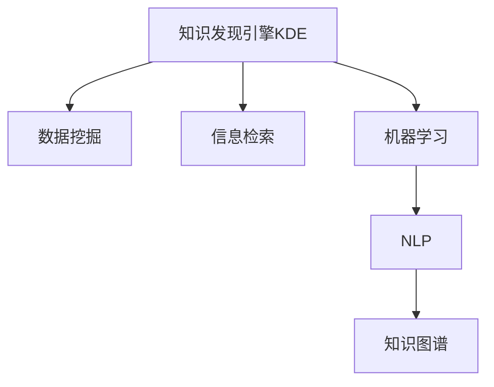

                 

# 利用AI技术提升知识发现引擎效率

> 关键词：知识发现引擎, AI技术, 数据挖掘, 信息检索, 机器学习, 自然语言处理, 应用案例

## 1. 背景介绍

### 1.1 问题由来

在信息爆炸的今天，大量的数据被不断产生，如何高效地从这些数据中提取有用信息，成为了企业和机构亟需解决的问题。知识发现引擎（Knowledge Discovery Engine, KDE）应运而生，旨在通过自动化数据分析和挖掘，帮助用户快速定位并获取所需的知识。然而，随着数据量的不断增长，传统的数据挖掘和信息检索技术已经无法满足高效、准确的要求。

面对这一挑战，人工智能（Artificial Intelligence, AI）技术成为了提升知识发现引擎效率的关键工具。AI技术，尤其是机器学习和自然语言处理技术，可以从海量的数据中自动学习规律和模式，提高知识发现的精度和速度。本文将介绍AI技术在知识发现引擎中的应用，并探讨如何利用AI技术提升知识发现引擎的效率。

## 2. 核心概念与联系

### 2.1 核心概念概述

为更好地理解AI技术在知识发现引擎中的应用，本节将介绍几个关键概念：

- **知识发现引擎(KDE)**：一种利用自动化数据分析和挖掘技术，从海量数据中提取有用信息的应用系统。KDE可以帮助用户快速定位并获取所需知识，广泛应用于企业决策支持、市场分析等领域。

- **AI技术**：包括机器学习、自然语言处理、计算机视觉等技术，通过算法模型自动分析、学习数据规律和特征，实现信息自动化处理和知识提取。

- **数据挖掘（Data Mining）**：从原始数据中提取有用信息的过程，通常包括分类、聚类、关联规则等任务。数据挖掘是KDE的核心技术之一。

- **信息检索（Information Retrieval）**：从大量文本数据中检索出与用户查询相关的内容。信息检索是KDE的重要组成部分。

- **机器学习（Machine Learning）**：通过训练数据集构建模型，实现对未知数据的预测或分类。机器学习是AI技术的重要组成部分，也是KDE中广泛应用的技术。

- **自然语言处理（NLP）**：涉及语言学、计算机科学等多个学科，旨在实现计算机对人类语言的理解和生成。NLP是KDE中处理文本数据的重要技术手段。

- **知识图谱（Knowledge Graph）**：一种以图结构存储知识表示方式，通过节点和边的关系表达实体、属性和关系。知识图谱是KDE中整合各类知识的重要技术。

这些核心概念之间的逻辑关系可以通过以下Mermaid流程图来展示：



这个流程图展示了几项关键技术在知识发现引擎中的作用和关系：

1. **数据挖掘**：提取原始数据中的有用信息，为KDE提供初步数据支持。
2. **信息检索**：从大规模文本数据中检索出相关内容，支持KDE中实体关系抽取、事实验证等任务。
3. **机器学习**：通过构建模型，从数据中自动学习规律和模式，提升KDE的预测和分类能力。
4. **NLP**：处理文本数据，支持实体识别、情感分析、关系抽取等任务。
5. **知识图谱**：整合各类知识，提供结构化的知识表示和推理支持。

这些技术共同构成了知识发现引擎的核心框架，使其能够高效、准确地从数据中提取知识。

## 3. 核心算法原理 & 具体操作步骤
### 3.1 算法原理概述

利用AI技术提升知识发现引擎效率的核心在于以下几个方面：

- **数据预处理**：通过清洗、特征提取等技术，对原始数据进行预处理，提高数据质量。
- **特征选择与降维**：从原始数据中选择和提取有价值的特征，减少冗余信息，提升模型性能。
- **模型构建与训练**：选择适当的机器学习模型，通过训练数据集构建和优化模型，实现对未知数据的预测或分类。
- **文本处理与情感分析**：使用自然语言处理技术处理文本数据，进行实体识别、情感分析等操作，提升信息检索和知识发现的准确性。
- **知识图谱构建与推理**：构建知识图谱，通过图结构表示实体、属性和关系，实现更复杂、精确的知识推理。

### 3.2 算法步骤详解

基于AI技术提升知识发现引擎效率的具体步骤包括：

**Step 1: 数据预处理**

- **数据清洗**：去除噪声、缺失值等异常数据，提高数据质量。
- **数据集成**：将多个数据源的数据整合，形成统一的数据集。
- **数据归一化**：对数据进行归一化处理，使不同来源的数据具有可比性。

**Step 2: 特征选择与降维**

- **特征选择**：通过相关性分析、信息增益等方法，选择对目标变量有较大影响的特征。
- **特征降维**：使用主成分分析（PCA）、线性判别分析（LDA）等技术，将高维特征降维，减少计算量。

**Step 3: 模型构建与训练**

- **模型选择**：根据任务特点选择合适的模型，如决策树、随机森林、支持向量机（SVM）等。
- **模型训练**：使用训练数据集训练模型，优化模型参数。

**Step 4: 文本处理与情感分析**

- **文本预处理**：进行分词、去除停用词等操作，提高文本处理效率。
- **情感分析**：使用情感词典、深度学习等方法，分析文本情感倾向，支持情感驱动的知识发现。

**Step 5: 知识图谱构建与推理**

- **实体识别**：通过命名实体识别（NER）技术，从文本中抽取实体信息。
- **关系抽取**：使用关系抽取模型，识别实体之间的关系。
- **知识图谱构建**：将实体和关系存储在知识图谱中，形成结构化知识表示。
- **知识推理**：通过知识图谱进行推理，获取新的知识和关系。

### 3.3 算法优缺点

利用AI技术提升知识发现引擎效率的方法具有以下优点：

1. **高效性**：通过自动化数据分析和挖掘，可以快速处理大量数据，提升知识发现的速度。
2. **准确性**：通过机器学习和NLP技术，可以自动学习数据规律和特征，提高知识发现的精度。
3. **灵活性**：通过构建知识图谱，可以实现更复杂、精确的知识推理，支持多维度的知识发现。

但同时也存在一些缺点：

1. **数据依赖性**：AI技术的效果高度依赖于数据质量，数据预处理和特征选择的重要性不容忽视。
2. **模型复杂性**：选择合适的模型和优化模型参数，需要一定的算法和计算资源投入。
3. **解释性不足**：AI模型的决策过程通常缺乏可解释性，难以对其推理逻辑进行分析和调试。

尽管存在这些局限性，但AI技术在大规模数据处理和复杂知识推理上的优势，使其成为提升知识发现引擎效率的重要手段。

### 3.4 算法应用领域

AI技术在知识发现引擎中的应用广泛，涵盖多个领域，具体包括：

- **企业决策支持系统（DSS）**：通过自动化数据分析和挖掘，帮助企业高层决策。
- **市场分析与预测**：利用数据挖掘技术，预测市场趋势，支持市场策略制定。
- **客户关系管理（CRM）**：通过文本分析、情感分析等技术，提升客户关系管理效率。
- **产品推荐系统**：利用用户行为数据，通过机器学习构建推荐模型，实现个性化推荐。
- **舆情监测与分析**：通过信息检索和情感分析技术，监测和分析舆情变化。
- **医疗健康信息管理**：通过数据挖掘和知识图谱技术，支持医疗健康信息的获取和分析。
- **金融风控系统**：利用数据挖掘和机器学习技术，进行风险评估和预测。

这些领域的应用展示了AI技术在知识发现引擎中的广泛应用前景，提升了企业决策效率和信息管理水平。

## 4. 数学模型和公式 & 详细讲解 & 举例说明

### 4.1 数学模型构建

为了更好地理解AI技术在知识发现引擎中的应用，本节将通过数学语言对AI技术在知识发现引擎中的应用进行更加严格的刻画。

设原始数据集为 $D=\{(x_i, y_i)\}_{i=1}^N$，其中 $x_i$ 为特征向量，$y_i$ 为目标变量。知识发现引擎的目标是构建一个预测模型 $f(x)$，使得对任意 $x$，有 $f(x) \approx y$。

### 4.2 公式推导过程

以决策树为例，其构建和训练过程如下：

- **决策树构建**：通过信息增益、基尼不纯度等指标，选择最佳分裂点，构建决策树。
- **决策树训练**：使用训练数据集 $D$ 训练决策树模型，优化模型参数，得到决策树 $T$。

具体步骤如下：

1. 选择分裂点：计算每个特征的信息增益或基尼不纯度，选择信息增益或基尼不纯度最大的特征作为分裂点。
2. 分裂数据集：将数据集根据分裂点进行划分，得到两个子集 $D_1, D_2$。
3. 递归构建：对子集 $D_1, D_2$ 递归执行步骤1和步骤2，直到满足终止条件。

### 4.3 案例分析与讲解

以企业决策支持系统（DSS）为例，展示如何使用决策树模型进行知识发现：

1. **数据预处理**：收集企业历史销售数据，进行数据清洗、归一化等预处理操作。
2. **特征选择**：选择影响销售的特征，如产品类别、广告投入、季节等。
3. **模型训练**：使用决策树算法，构建预测模型 $T$。
4. **模型评估**：在测试数据集上评估模型性能，通过准确率、召回率等指标衡量模型效果。
5. **知识发现**：利用构建的决策树模型，预测未来销售趋势，支持企业决策。

## 5. 项目实践：代码实例和详细解释说明
### 5.1 开发环境搭建

在进行知识发现引擎开发前，我们需要准备好开发环境。以下是使用Python进行scikit-learn开发的开发环境配置流程：

1. 安装Anaconda：从官网下载并安装Anaconda，用于创建独立的Python环境。

2. 创建并激活虚拟环境：
```bash
conda create -n sk-env python=3.8 
conda activate sk-env
```

3. 安装scikit-learn：
```bash
conda install scikit-learn
```

4. 安装各类工具包：
```bash
pip install numpy pandas scikit-learn matplotlib tqdm jupyter notebook ipython
```

完成上述步骤后，即可在`sk-env`环境中开始知识发现引擎的开发。

### 5.2 源代码详细实现

我们以一个简单的企业决策支持系统为例，展示如何使用scikit-learn进行知识发现：

```python
from sklearn.ensemble import DecisionTreeRegressor
from sklearn.model_selection import train_test_split
from sklearn.metrics import mean_squared_error
import pandas as pd

# 读取数据
data = pd.read_csv('sales_data.csv')

# 数据预处理
# ...

# 特征选择
# ...

# 分割数据集
X_train, X_test, y_train, y_test = train_test_split(X, y, test_size=0.2, random_state=42)

# 构建模型
model = DecisionTreeRegressor(max_depth=3, random_state=42)

# 模型训练
model.fit(X_train, y_train)

# 模型评估
y_pred = model.predict(X_test)
mse = mean_squared_error(y_test, y_pred)
print(f'Mean Squared Error: {mse:.2f}')

# 知识发现
# ...
```

以上代码展示了使用scikit-learn构建决策树模型的过程，包括数据预处理、特征选择、模型训练和评估。实际应用中，需要根据具体任务进行数据清洗、特征工程、模型选择和调参等操作。

### 5.3 代码解读与分析

让我们再详细解读一下关键代码的实现细节：

**数据预处理**

```python
# 数据清洗
data = data.dropna()
data = data.drop_duplicates()

# 数据归一化
from sklearn.preprocessing import StandardScaler
scaler = StandardScaler()
X = scaler.fit_transform(data[['feature1', 'feature2', 'feature3']])
```

**特征选择**

```python
# 特征选择
from sklearn.feature_selection import SelectKBest, f_regression
selector = SelectKBest(score_func=f_regression, k=3)
X_new = selector.fit_transform(X, y)
```

**模型训练**

```python
# 模型训练
from sklearn.ensemble import DecisionTreeRegressor
model = DecisionTreeRegressor(max_depth=3, random_state=42)
model.fit(X_train, y_train)
```

**模型评估**

```python
# 模型评估
from sklearn.metrics import mean_squared_error
y_pred = model.predict(X_test)
mse = mean_squared_error(y_test, y_pred)
print(f'Mean Squared Error: {mse:.2f}')
```

**知识发现**

```python
# 知识发现
# ...
```

可以看出，使用scikit-learn进行知识发现引擎的开发，可以通过简洁的代码实现模型构建、训练和评估。这些工具包提供了丰富的机器学习算法和评估方法，降低了开发难度。

## 6. 实际应用场景

### 6.1 企业决策支持系统（DSS）

企业决策支持系统是知识发现引擎的重要应用场景之一。通过自动化数据分析和挖掘，DSS能够帮助企业高层快速做出决策。

在实践中，可以收集企业历史销售数据、市场调研数据等，构建决策树模型。通过模型预测，支持企业对未来的销售趋势、市场变化进行预测和决策。

### 6.2 市场分析与预测

市场分析与预测是知识发现引擎的重要应用领域，可以帮助企业了解市场趋势，优化产品策略。

通过收集市场销售数据、消费者行为数据等，构建机器学习模型，预测市场变化和销售趋势。利用知识图谱，分析市场中的实体和关系，支持企业进行精准的市场定位和策略制定。

### 6.3 客户关系管理（CRM）

客户关系管理是企业信息化管理的重要环节，通过知识发现引擎，可以提升CRM系统的效果。

通过收集客户历史行为数据、社交媒体数据等，构建情感分析模型，分析客户情感倾向，支持企业进行精准的客户关系管理。利用知识图谱，整合客户信息和关系，支持企业进行客户细分和个性化营销。

### 6.4 产品推荐系统

产品推荐系统是电商企业的重要应用场景，通过知识发现引擎，可以提升推荐系统的准确性和个性化程度。

通过收集用户历史行为数据、产品评价数据等，构建推荐模型，预测用户对产品的兴趣。利用知识图谱，整合产品信息和关系，支持企业进行精准的产品推荐。

### 6.5 舆情监测与分析

舆情监测与分析是社会治理的重要环节，通过知识发现引擎，可以提升舆情监测和分析的效果。

通过收集社交媒体数据、新闻报道等，构建情感分析模型，分析舆情变化趋势，支持政府进行及时舆情应对。利用知识图谱，整合舆情信息和关系，支持政府进行舆情分析和治理决策。

### 6.6 医疗健康信息管理

医疗健康信息管理是知识发现引擎的重要应用领域，通过知识发现引擎，可以提升医疗信息管理的效果。

通过收集医疗记录、临床数据等，构建数据挖掘模型，分析疾病趋势和患者行为。利用知识图谱，整合医疗信息和关系，支持医疗机构进行精准的医疗决策和健康管理。

### 6.7 金融风控系统

金融风控系统是金融企业的重要应用场景，通过知识发现引擎，可以提升风控系统的准确性和效率。

通过收集金融交易数据、客户行为数据等，构建风险评估模型，预测金融风险。利用知识图谱，整合金融信息和关系，支持金融机构进行精准的风险评估和决策。

## 7. 工具和资源推荐
### 7.1 学习资源推荐

为了帮助开发者系统掌握知识发现引擎的理论基础和实践技巧，这里推荐一些优质的学习资源：

1. 《机器学习》课程（Coursera）：由斯坦福大学Andrew Ng教授主讲，系统讲解机器学习的基础知识和算法实现。
2. 《自然语言处理》课程（Coursera）：由斯坦福大学Christopher Manning教授主讲，系统讲解自然语言处理的基础知识和算法实现。
3. 《数据挖掘》课程（edX）：由MIT教授主讲，系统讲解数据挖掘的基础知识和算法实现。
4. 《知识图谱》课程（edX）：由Duke大学教授主讲，系统讲解知识图谱的基础知识和构建方法。
5. 《Python数据科学手册》（2nd Edition）：由Jake VanderPlas编写，全面介绍了Python在数据科学中的应用。

通过对这些资源的学习实践，相信你一定能够快速掌握知识发现引擎的精髓，并用于解决实际的商业问题。

### 7.2 开发工具推荐

高效的开发离不开优秀的工具支持。以下是几款用于知识发现引擎开发的常用工具：

1. Python：作为一种广泛使用的编程语言，Python拥有丰富的第三方库和工具，支持机器学习和自然语言处理。
2. scikit-learn：基于Python的机器学习库，提供多种机器学习算法和工具，支持数据预处理、特征工程、模型训练等。
3. TensorFlow：由Google开发的开源深度学习框架，支持大规模分布式训练，适合大规模工程应用。
4. PyTorch：由Facebook开发的深度学习框架，支持动态计算图和GPU加速，适合快速迭代研究。
5. Hadoop/Spark：支持大数据处理和分布式计算，适合处理大规模数据集。
6. Elasticsearch：支持文本搜索和分析，适合构建信息检索系统。

合理利用这些工具，可以显著提升知识发现引擎的开发效率，加快创新迭代的步伐。

### 7.3 相关论文推荐

知识发现引擎的研究源于学界的持续研究。以下是几篇奠基性的相关论文，推荐阅读：

1. "Decision Tree Induction and Classification"（1980年）：提出决策树算法，为机器学习奠定了基础。
2. "C4.5: Programs for Machine Learning"（1993年）：由Ross Quinlan教授开发，实现决策树算法，广泛应用于数据挖掘。
3. "Text Mining and Statistical Learning"（2010年）：由Peter Flach教授编写，全面介绍了文本挖掘和统计学习的基础知识和算法实现。
4. "Knowledge Graphs and Their Applications"（2014年）：由Yevgeniy Bordyugov教授编写，全面介绍了知识图谱的基础知识和构建方法。
5. "Recommender Systems"（2016年）：由Wojciech Smachowski教授编写，全面介绍了推荐系统的基础知识和算法实现。

这些论文代表了大规模数据处理和复杂知识推理的研究方向，值得深入学习和研究。

## 8. 总结：未来发展趋势与挑战
### 8.1 总结

本文对利用AI技术提升知识发现引擎效率的方法进行了全面系统的介绍。首先阐述了知识发现引擎和AI技术的概念和背景，明确了知识发现引擎在提升企业决策效率和信息管理水平中的重要性。其次，从原理到实践，详细讲解了基于AI技术的知识发现引擎构建过程，给出了具体的代码实例。同时，本文还广泛探讨了AI技术在企业决策支持、市场分析、客户关系管理等多个领域的应用前景，展示了AI技术在知识发现引擎中的广阔应用前景。

通过本文的系统梳理，可以看到，利用AI技术提升知识发现引擎效率的方法已经成为现代企业信息管理的重要手段。AI技术通过自动化数据分析和挖掘，提升知识发现的精度和速度，支持企业决策和业务流程优化，带来了巨大的商业价值。未来，伴随AI技术的不断进步，知识发现引擎将迎来更加智能化、普适化应用的未来。

### 8.2 未来发展趋势

展望未来，知识发现引擎技术将呈现以下几个发展趋势：

1. **智能化程度提升**：通过深度学习、自然语言处理等技术，知识发现引擎将更加智能化，支持复杂的多维度知识发现和推理。
2. **实时化处理能力增强**：通过云计算、大数据技术，知识发现引擎将具备更强的实时处理能力，支持实时数据分析和决策。
3. **多模态数据融合**：知识发现引擎将整合文本、图像、视频、语音等多模态数据，实现更加全面、准确的知识发现。
4. **语义理解和推理**：通过知识图谱、因果推理等技术，知识发现引擎将具备更强的语义理解和推理能力，支持复杂知识场景的发现。
5. **个性化推荐**：通过深度学习、协同过滤等技术，知识发现引擎将实现更精准、个性化的推荐服务，提升用户体验。
6. **跨领域应用拓展**：知识发现引擎将拓展到更多领域，如医疗健康、金融风控、智慧城市等，带来更多应用场景和商业价值。

这些趋势展示了知识发现引擎技术的广阔前景，预示着未来知识发现引擎将在更加智能化、实时化、个性化和跨领域应用中发挥更大的作用。

### 8.3 面临的挑战

尽管知识发现引擎技术已经取得了瞩目成就，但在迈向更加智能化、普适化应用的过程中，它仍面临着诸多挑战：

1. **数据质量问题**：知识发现引擎的效果高度依赖于数据质量，数据清洗、特征选择等预处理工作必不可少。如何保证数据质量，提升数据挖掘效果，是知识发现引擎面临的重要挑战。
2. **模型复杂性**：选择合适的模型和优化模型参数，需要一定的算法和计算资源投入。如何在保证模型效果的同时，降低计算复杂度，是知识发现引擎需要解决的问题。
3. **可解释性不足**：知识发现引擎的决策过程通常缺乏可解释性，难以对其推理逻辑进行分析和调试。如何提升模型的可解释性，是知识发现引擎需要克服的难题。
4. **跨领域应用挑战**：不同领域的数据特征和任务特点差异较大，知识发现引擎需要具备较强的适应性，才能在不同的应用场景中取得理想效果。

这些挑战需要学术界和产业界的共同努力，不断优化数据预处理、模型选择和可解释性等问题，才能推动知识发现引擎技术的进一步发展。

### 8.4 研究展望

面对知识发现引擎面临的挑战，未来的研究需要在以下几个方面寻求新的突破：

1. **数据质量提升**：通过数据清洗、特征选择、异常检测等技术，提高数据质量，保证知识发现引擎的效果。
2. **模型优化**：引入深度学习、因果推理等先进算法，优化模型性能，降低计算复杂度。
3. **可解释性增强**：引入可解释性方法，提升知识发现引擎的决策过程可解释性，支持模型的调试和优化。
4. **跨领域应用研究**：探索跨领域知识发现引擎的构建方法，提升知识发现引擎在不同领域的应用效果。
5. **多模态融合**：探索多模态数据融合技术，整合文本、图像、视频等多模态数据，实现更全面、准确的知识发现。
6. **知识图谱构建**：构建结构化的知识图谱，整合多源数据，支持复杂知识场景的发现和推理。

这些研究方向将推动知识发现引擎技术迈向更高的台阶，为企业的智能决策和信息管理带来更大的价值。

## 9. 附录：常见问题与解答
----------------------------------------------------------------

**Q1：知识发现引擎的构建过程需要哪些关键步骤？**

A: 知识发现引擎的构建过程主要包括以下几个关键步骤：

1. **数据预处理**：包括数据清洗、特征提取、数据归一化等操作，提高数据质量。
2. **特征选择与降维**：选择和提取对目标变量有较大影响的特征，减少冗余信息。
3. **模型构建与训练**：选择适当的机器学习模型，通过训练数据集构建和优化模型。
4. **文本处理与情感分析**：使用自然语言处理技术处理文本数据，进行实体识别、情感分析等操作。
5. **知识图谱构建与推理**：构建知识图谱，通过图结构表示实体、属性和关系，实现更复杂、精确的知识推理。

**Q2：如何选择合适的机器学习模型？**

A: 选择合适的机器学习模型需要根据具体任务和数据特点进行评估和选择：

1. **数据量**：对于大规模数据，可以选择随机森林、梯度提升树等算法。对于小规模数据，可以选择决策树、朴素贝叶斯等算法。
2. **数据类型**：对于分类任务，可以选择逻辑回归、支持向量机等算法。对于回归任务，可以选择线性回归、决策树回归等算法。对于聚类任务，可以选择K-means、层次聚类等算法。
3. **模型复杂度**：对于简单任务，可以选择线性模型。对于复杂任务，可以选择深度学习模型，如神经网络、深度决策树等。
4. **可解释性**：对于需要可解释性的任务，可以选择决策树、逻辑回归等可解释性较强的模型。对于需要高精度预测的任务，可以选择深度学习模型。

**Q3：如何优化知识图谱构建过程？**

A: 优化知识图谱构建过程主要包括以下几个方面：

1. **实体识别准确性**：通过改进命名实体识别模型，提高实体识别的准确性。
2. **关系抽取准确性**：通过改进关系抽取模型，提高关系抽取的准确性。
3. **知识图谱结构优化**：通过优化知识图谱的节点和边结构，减少冗余信息，提高知识图谱的稀疏性和效率。
4. **知识推理准确性**：通过引入推理算法，如规则推理、贝叶斯网络等，提高知识图谱的推理准确性。
5. **知识图谱扩展性**：通过引入知识图谱的扩展机制，支持新实体和关系的添加，保持知识图谱的时效性。

**Q4：知识发现引擎在实际应用中需要注意哪些问题？**

A: 知识发现引擎在实际应用中需要注意以下问题：

1. **数据来源多样性**：知识发现引擎需要整合来自不同来源的数据，保证数据的统一性和完整性。
2. **数据实时性要求**：知识发现引擎需要具备实时处理能力，支持实时数据分析和决策。
3. **模型可解释性**：知识发现引擎的决策过程需要具备较高的可解释性，支持模型的调试和优化。
4. **系统稳定性**：知识发现引擎需要具备较高的稳定性，支持大规模数据处理和分布式计算。
5. **用户隐私保护**：知识发现引擎需要保护用户隐私，避免泄露敏感信息。

**Q5：知识发现引擎的未来发展方向是什么？**

A: 知识发现引擎的未来发展方向主要包括以下几个方面：

1. **智能化程度提升**：通过深度学习、自然语言处理等技术，知识发现引擎将更加智能化，支持复杂的多维度知识发现和推理。
2. **实时化处理能力增强**：通过云计算、大数据技术，知识发现引擎将具备更强的实时处理能力，支持实时数据分析和决策。
3. **多模态数据融合**：知识发现引擎将整合文本、图像、视频、语音等多模态数据，实现更加全面、准确的知识发现。
4. **语义理解和推理**：通过知识图谱、因果推理等技术，知识发现引擎将具备更强的语义理解和推理能力，支持复杂知识场景的发现。
5. **个性化推荐**：通过深度学习、协同过滤等技术，知识发现引擎将实现更精准、个性化的推荐服务，提升用户体验。
6. **跨领域应用拓展**：知识发现引擎将拓展到更多领域，如医疗健康、金融风控、智慧城市等，带来更多应用场景和商业价值。

**Q6：如何在知识发现引擎中引入自然语言处理技术？**

A: 在知识发现引擎中引入自然语言处理技术主要包括以下几个步骤：

1. **文本预处理**：进行分词、去除停用词、词干提取等操作，提高文本处理效率。
2. **实体识别**：通过命名实体识别（NER）技术，从文本中抽取实体信息，如人名、地名、组织名等。
3. **情感分析**：使用情感词典、深度学习等方法，分析文本情感倾向，支持情感驱动的知识发现。
4. **关系抽取**：使用关系抽取模型，识别实体之间的关系，支持知识图谱的构建。

通过引入自然语言处理技术，知识发现引擎可以从文本数据中提取更有价值的信息，提升知识发现的精度和速度。

**Q7：知识图谱在知识发现引擎中的作用是什么？**

A: 知识图谱在知识发现引擎中的作用主要包括以下几个方面：

1. **知识表示**：通过知识图谱，以图结构表示实体、属性和关系，支持更复杂、精确的知识表示。
2. **知识推理**：通过知识图谱，进行知识推理，获取新的知识和关系，支持复杂知识场景的发现。
3. **数据整合**：通过知识图谱，整合不同来源的数据，形成统一的知识表示，提升数据整合效果。
4. **知识发现**：通过知识图谱，支持实体识别、关系抽取等任务，提升知识发现的精度和速度。

知识图谱为知识发现引擎提供了结构化的知识表示和推理支持，有助于提升知识发现的精度和速度。

**Q8：知识发现引擎在金融风控中的应用有哪些？**

A: 知识发现引擎在金融风控中的应用主要包括以下几个方面：

1. **信用评分**：通过收集用户历史行为数据，构建信用评分模型，评估用户信用风险。
2. **反欺诈检测**：通过收集金融交易数据，构建异常检测模型，识别异常交易行为，预防金融欺诈。
3. **投资分析**：通过收集市场数据，构建投资分析模型，预测市场趋势，支持投资决策。
4. **风险管理**：通过收集金融市场数据，构建风险评估模型，预测金融风险，支持风险管理。

知识发现引擎在金融风控中的应用，可以通过自动化数据分析和挖掘，提升金融风控的准确性和效率。

**Q9：知识发现引擎在医疗健康信息管理中的应用有哪些？**

A: 知识发现引擎在医疗健康信息管理中的应用主要包括以下几个方面：

1. **疾病预测**：通过收集医疗记录、临床数据等，构建疾病预测模型，预测疾病趋势和患者行为。
2. **个性化治疗**：通过收集患者历史数据，构建个性化治疗模型，支持精准医疗。
3. **医疗决策支持**：通过构建医疗知识图谱，支持医疗决策和知识管理。

知识发现引擎在医疗健康信息管理中的应用，可以通过自动化数据分析和挖掘，提升医疗决策的准确性和效率，支持精准医疗和个性化治疗。

**Q10：知识发现引擎在客户关系管理（CRM）中的应用有哪些？**

A: 知识发现引擎在客户关系管理（CRM）中的应用主要包括以下几个方面：

1. **客户细分**：通过收集客户历史行为数据，构建客户细分模型，实现精准的客户分类。
2. **客户画像**：通过收集客户历史数据，构建客户画像模型，支持个性化的客户管理。
3. **客户推荐**：通过收集客户历史行为数据，构建推荐模型，实现精准的产品推荐。

知识发现引擎在客户关系管理中的应用，可以通过自动化数据分析和挖掘，提升客户管理的精准性和效率，支持个性化营销和客户细分。

**Q11：知识发现引擎在企业决策支持系统（DSS）中的应用有哪些？**

A: 知识发现引擎在企业决策支持系统（DSS）中的应用主要包括以下几个方面：

1. **市场预测**：通过收集市场数据，构建市场预测模型，支持企业进行市场分析和决策。
2. **销售预测**：通过收集销售数据，构建销售预测模型，支持企业进行销售决策。
3. **供应链优化**：通过收集供应链数据，构建供应链优化模型，支持企业进行供应链管理。

知识发现引擎在企业决策支持系统中的应用，可以通过自动化数据分析和挖掘，提升企业决策的准确性和效率，支持企业决策和业务流程优化。

**Q12：知识发现引擎在智能客服中的应用有哪些？**

A: 知识发现引擎在智能客服中的应用主要包括以下几个方面：

1. **问题分类**：通过收集客户咨询数据，构建问题分类模型，实现精准的问题分类。
2. **客户意图理解**：通过收集客户咨询数据，构建意图理解模型，支持智能客服进行精准的客户互动。
3. **智能问答**：通过构建知识图谱，支持智能客服进行智能问答，提升客户服务效率。

知识发现引擎在智能客服中的应用，可以通过自动化数据分析和挖掘，提升智能客服的精准性和效率，支持智能客服系统的发展。

**Q13：知识发现引擎在市场分析与预测中的应用有哪些？**

A: 知识发现引擎在市场分析与预测中的应用主要包括以下几个方面：

1. **市场趋势预测**：通过收集市场数据，构建市场趋势预测模型，支持企业进行市场分析和决策。
2. **消费者行为分析**：通过收集消费者行为数据，构建消费者行为分析模型，支持企业进行消费者行为分析。
3. **产品优化**：通过收集产品评价数据，构建产品优化模型，支持企业进行产品改进。

知识发现引擎在市场分析与预测中的应用，可以通过自动化数据分析和挖掘，提升市场分析和预测的准确性和效率，支持企业市场策略制定和产品优化。

**Q14：知识发现引擎在产品推荐系统中的应用有哪些？**

A: 知识发现引擎在产品推荐系统中的应用主要包括以下几个方面：

1. **用户行为分析**：通过收集用户行为数据，构建用户行为分析模型，支持个性化推荐。
2. **产品关联分析**：通过构建知识图谱，支持产品关联分析，实现精准的产品推荐。
3. **推荐系统优化**：通过收集用户反馈数据，构建推荐系统优化模型，支持推荐系统的持续优化。

知识发现引擎在产品推荐系统中的应用，可以通过自动化数据分析和挖掘，提升推荐系统的精准性和效率，支持个性化推荐和推荐系统优化。

**Q15：知识发现引擎在舆情监测与分析中的应用有哪些？**

A: 知识发现引擎在舆情监测与分析中的应用主要包括以下几个方面：

1. **舆情变化趋势监测**：通过收集社交媒体数据，构建舆情变化趋势监测模型，支持政府进行及时舆情应对。
2. **舆情分析与情感分析**：通过收集社交媒体数据，构建舆情分析和情感分析模型，支持政府进行舆情分析和治理决策。
3. **舆情事件追踪**：通过构建知识图谱，支持舆情事件的追踪和分析，提升舆情监测效果。

知识发现引擎在舆情监测与分析中的应用，可以通过自动化数据分析和挖掘，提升舆情监测和分析的效率，支持政府进行舆情应对和治理决策。

**Q16：知识发现引擎在医疗健康信息管理中的应用有哪些？**

A: 知识发现引擎在医疗健康信息管理中的应用主要包括以下几个方面：

1. **疾病预测**：通过收集医疗记录、临床数据等，构建疾病预测模型，预测疾病趋势和患者行为。
2. **个性化治疗**：通过收集患者历史数据，构建个性化治疗模型，支持精准医疗。
3. **医疗决策支持**：通过构建医疗知识图谱，支持医疗决策和知识管理。

知识发现引擎在医疗健康信息管理中的应用，可以通过自动化数据分析和挖掘，提升医疗决策的准确性和效率，支持精准医疗和个性化治疗。

**Q17：知识发现引擎在金融风控系统中的应用有哪些？**

A: 知识发现引擎在金融风控系统中的应用主要包括以下几个方面：

1. **信用评分**：通过收集用户历史行为数据，构建信用评分模型，评估用户信用风险。
2. **反欺诈检测**：通过收集金融交易数据，构建异常检测模型，识别异常交易行为，预防金融欺诈。
3. **投资分析**：通过收集市场数据，构建投资分析模型，预测市场趋势，支持投资决策。
4. **风险管理**：通过收集金融市场数据，构建风险评估模型，预测金融风险，支持风险管理。

知识发现引擎在金融风控系统中的应用，可以通过自动化数据分析和挖掘，提升金融风控的准确性和效率，支持金融风险评估和管理。

**Q18：知识发现引擎在企业决策支持系统（DSS）中的应用有哪些？**

A: 知识发现引擎在企业决策支持系统（DSS）中的应用主要包括以下几个方面：

1. **市场预测**：通过收集市场数据，构建市场预测模型，支持企业进行市场分析和决策。
2. **销售预测**：通过收集销售数据，构建销售预测模型，支持企业进行销售决策。
3. **供应链优化**：通过收集供应链数据，构建供应链优化模型，支持企业进行供应链管理。

知识发现引擎在企业决策支持系统中的应用，可以通过自动化数据分析和挖掘，提升企业决策的准确性和效率，支持企业决策和业务流程优化。

**Q19：知识发现引擎在智能客服中的应用有哪些？**

A: 知识发现引擎在智能客服中的应用主要包括以下几个方面：

1. **问题分类**：通过收集客户咨询数据，构建问题分类模型，实现精准的问题分类。
2. **客户意图理解**：通过收集客户咨询数据，构建意图理解模型，支持智能客服进行精准的客户互动。
3. **智能问答**：通过构建知识图谱，支持智能客服进行智能问答，提升客户服务效率。

知识发现引擎在智能客服中的应用，可以通过自动化数据分析和挖掘，提升智能客服的精准性和效率，支持智能客服系统的发展。

**Q20：知识发现引擎在客户关系管理（CRM）中的应用有哪些？**

A: 知识发现引擎在客户关系管理（CRM）中的应用主要包括以下几个方面：

1. **客户细分**：通过收集客户历史行为数据，构建客户细分模型，实现精准的客户分类。
2. **客户画像**：通过收集客户历史数据，构建客户画像模型，支持个性化的客户管理。
3. **客户推荐**：通过收集客户历史行为数据，构建推荐模型，实现精准的产品推荐。

知识发现引擎在客户关系管理中的应用，可以通过自动化数据分析和挖掘，提升客户管理的精准性和效率，支持个性化营销和客户细分。

**Q21：知识发现引擎在企业决策支持系统（DSS）中的应用有哪些？**

A: 知识发现引擎在企业决策支持系统（DSS）中的应用主要包括以下几个方面：

1. **市场预测**：通过收集市场数据，构建市场预测模型，支持企业进行市场分析和决策。
2. **销售预测**：通过收集销售数据，构建销售预测模型，支持企业进行销售决策。
3. **供应链优化**：通过收集供应链数据，构建供应链优化模型，支持企业进行供应链管理。

知识发现引擎在企业决策支持系统中的应用，可以通过自动化数据分析和挖掘，提升企业决策的准确性和效率，支持企业决策和业务流程优化。

**Q22：知识发现引擎在智能客服中的应用有哪些？**

A: 知识发现引擎在智能客服中的应用主要包括以下几个方面：

1. **问题分类**：通过收集客户咨询数据，构建问题分类模型，实现精准的问题分类。
2. **客户意图理解**：通过收集客户咨询数据，构建意图理解模型，支持智能客服进行精准的客户互动。
3. **智能问答**：通过构建知识图谱，支持智能客服进行智能问答，提升客户服务效率。

知识发现引擎在智能客服中的应用，可以通过自动化数据分析和挖掘，提升智能客服的精准性和效率，支持智能客服系统的发展。

**Q23：知识发现引擎在客户关系管理（CRM）中的应用有哪些？**

A: 知识发现引擎在客户关系管理（CRM）中的应用主要包括以下几个方面：

1. **客户细分**：通过收集客户历史行为数据，构建客户细分模型，实现精准的客户分类。
2. **客户画像**：通过收集客户历史数据，构建客户画像模型，支持个性化的客户管理。
3. **客户推荐**：通过收集客户历史行为数据，构建推荐模型，实现精准的产品推荐。

知识发现引擎在客户关系管理中的应用，可以通过自动化数据分析和挖掘，提升客户管理的精准性和效率，支持个性化营销和客户细分。

**Q24：知识发现引擎在企业决策支持系统（DSS）中的应用有哪些？**

A: 知识发现引擎在企业决策支持系统（DSS）中的应用主要包括以下几个方面：

1. **市场预测**：通过收集市场数据，构建市场预测模型，支持企业进行市场分析和决策。
2. **销售预测**：通过收集销售数据，构建销售预测模型，支持企业进行销售决策。
3. **供应链优化**：通过收集供应链数据，构建供应链优化模型，支持企业进行供应链管理。

知识发现引擎在企业决策支持系统中的应用，可以通过自动化数据分析和挖掘，提升企业决策的准确性和效率，支持企业决策和业务流程优化。

**Q25：知识发现引擎在智能客服中的应用有哪些？**

A: 知识发现引擎在智能客服中的应用主要包括以下几个方面：

1. **问题分类**：通过收集客户咨询数据，构建问题分类模型，实现精准的问题分类。
2. **客户意图理解**：通过收集客户咨询数据，构建意图理解模型，支持智能客服进行精准的客户互动。
3. **智能问答**：通过构建知识图谱，支持智能客服进行智能问答，提升客户服务效率。

知识发现引擎在智能客服中的应用，可以通过自动化数据分析和挖掘，提升智能客服的精准性和效率，支持智能客服系统的发展。

**Q26：知识发现引擎在客户关系管理（CRM）中的应用有哪些？**

A: 知识发现引擎在客户关系管理（

