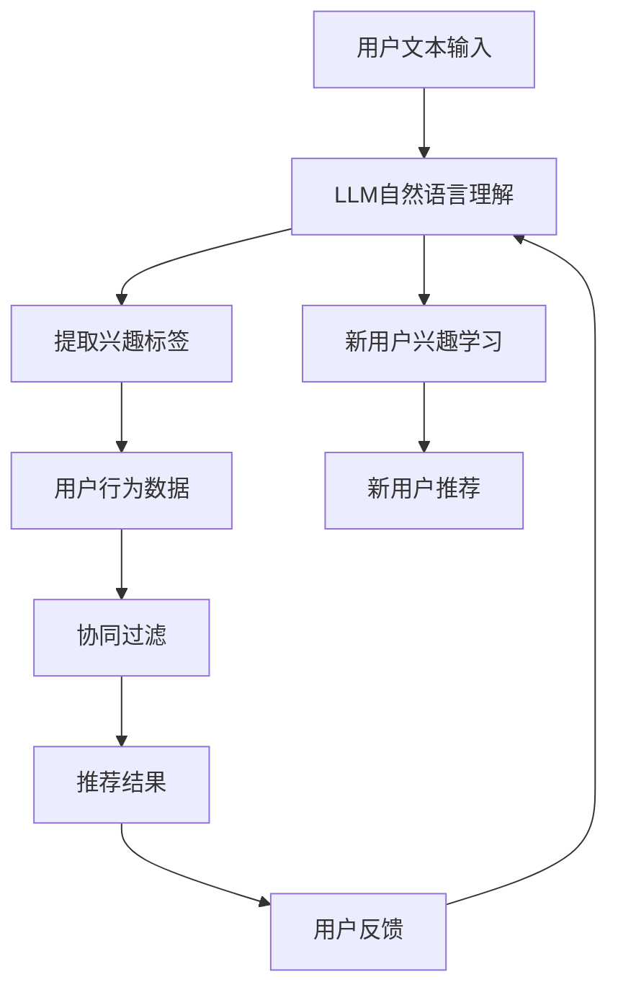

                 

# 利用LLM提升推荐系统的新用户冷启动能力

## 1. 背景介绍

在推荐系统中，新用户的冷启动问题一直是一个重要的挑战。新用户在没有任何历史记录的情况下，推荐系统难以为其提供个性化的推荐。传统的推荐系统通常依赖于用户的历史行为数据进行推荐，但新用户通常没有任何历史记录，导致系统无法为其提供准确推荐。

大语言模型（Large Language Models，简称LLM）作为一种强大的自然语言处理技术，最近在推荐系统中得到了越来越多的应用。利用LLM，推荐系统可以基于文本数据，为新用户提供准确的推荐。LLM可以理解自然语言，从中提取用户的兴趣偏好，结合用户的历史数据，提供个性化的推荐。

## 2. 核心概念与联系

### 2.1 核心概念概述

为更好地理解LLM在推荐系统中的应用，本节将介绍几个密切相关的核心概念：

- 大语言模型(Large Language Model, LLM)：以自回归(如GPT)或自编码(如BERT)模型为代表的大规模预训练语言模型。通过在大规模无标签文本语料上进行预训练，学习通用的语言表示，具备强大的语言理解和生成能力。

- 推荐系统(Recommendation System)：一种信息过滤系统，用于为用户推荐他们可能感兴趣的物品。推荐系统通常包括协同过滤、基于内容的推荐、混合推荐等方法。

- 冷启动问题(Cold Start Problem)：新用户或新物品加入系统时，由于缺乏足够的历史数据，推荐系统难以为其提供准确的推荐。

- 自然语言理解(Natural Language Understanding)：使计算机能够理解、解释和生成自然语言的能力。LLM在自然语言理解方面表现出色，可以理解用户文本描述中的兴趣偏好。

- 协同过滤(Collaborative Filtering)：基于用户和物品的相似性，预测用户可能感兴趣的物品。常见的协同过滤方法包括基于用户的协同过滤、基于物品的协同过滤等。

- 混合推荐(Mixed Recommendation)：结合多种推荐算法，取长补短，提升推荐系统的性能。

- 知识图谱(Knowledge Graph)：一种图形化表示的知识结构，可以用于表示实体、关系和属性等知识，是推荐系统中常用的知识表示方法。

### 2.2 核心概念原理和架构的 Mermaid 流程图



这个流程图展示了LLM在推荐系统中的核心作用：

1. 用户输入文本，如自我介绍、兴趣描述等。
2. LLM理解文本，提取用户的兴趣标签。
3. 结合用户行为数据，协同过滤算法为用户推荐物品。
4. 根据用户反馈，更新LLM模型，学习新用户的兴趣偏好。
5. 使用更新后的模型，为新用户提供推荐。

## 3. 核心算法原理 & 具体操作步骤

### 3.1 算法原理概述

基于LLM的推荐系统，本质上是一种结合了自然语言理解和协同过滤的混合推荐方法。其核心思想是：利用LLM理解用户文本描述中的兴趣偏好，结合用户的历史行为数据，预测用户可能感兴趣的物品，进行推荐。

具体来说，算法过程如下：

1. 用户输入文本，如自我介绍、兴趣描述等。
2. LLM理解文本，提取用户的兴趣标签。
3. 结合用户行为数据，使用协同过滤算法为用户推荐物品。
4. 根据用户反馈，更新LLM模型，学习新用户的兴趣偏好。
5. 使用更新后的模型，为新用户提供推荐。

### 3.2 算法步骤详解

以下是基于LLM的推荐系统的主要步骤：

**Step 1: 用户文本输入和自然语言理解**

用户输入的文本可以是自我介绍、兴趣描述、消费习惯等。LLM可以理解这些文本，从中提取用户的兴趣标签。例如，用户输入：“我喜欢旅游、美食、电影。”，LLM可以提取“旅游”、“美食”、“电影”等兴趣标签。

**Step 2: 协同过滤推荐**

结合用户的行为数据，如浏览、购买、评分等，使用协同过滤算法为用户推荐物品。常见的协同过滤算法包括基于用户的协同过滤、基于物品的协同过滤等。

**Step 3: 新用户兴趣学习**

对于新用户，没有历史行为数据，只能依赖用户的文本描述进行推荐。LLM可以根据用户的文本描述，学习其兴趣偏好。例如，用户输入：“我是一个科技爱好者，喜欢最新的科技新闻、技术文章和软件工具。”，LLM可以提取“科技爱好者”、“科技新闻”、“技术文章”、“软件工具”等兴趣标签。

**Step 4: 新用户推荐**

结合用户的行为数据，使用协同过滤算法为用户推荐物品。如果新用户没有历史行为数据，可以使用随机推荐、基于内容的推荐等方法进行推荐。

**Step 5: 模型更新**

根据用户的反馈，更新LLM模型，学习新用户的兴趣偏好。例如，用户对某个推荐物品进行了点击、收藏或评分，LLM可以根据这些反馈，更新模型，更好地理解用户的兴趣偏好。

### 3.3 算法优缺点

基于LLM的推荐系统有以下优点：

1. 解决冷启动问题。利用LLM可以解决新用户的冷启动问题，为新用户提供准确的推荐。
2. 结合多模态数据。LLM可以理解文本数据，结合用户的行为数据，提供更全面的推荐。
3. 动态更新。LLM可以根据用户的反馈，动态更新模型，学习新用户的兴趣偏好。
4. 可解释性。LLM可以理解用户的文本描述，提供可解释的推荐逻辑。

但该方法也存在一些缺点：

1. 计算复杂度。LLM的计算复杂度较高，需要大量的计算资源。
2. 数据依赖。LLM需要大量的文本数据进行预训练，数据质量和数量对推荐效果有很大影响。
3. 泛化能力。LLM的泛化能力有限，在特定领域的应用效果可能不如传统的协同过滤方法。

### 3.4 算法应用领域

基于LLM的推荐系统已经在电商、新闻、视频等多个领域得到了应用，为推荐系统带来了新的突破。以下是几个典型的应用场景：

- 电商推荐：在电商平台上，利用用户的自我介绍和商品描述，为新用户推荐相关商品。例如，用户输入：“我是一个喜欢户外运动的人，想购买户外运动装备。”，LLM可以提取“户外运动”、“运动装备”等标签，结合用户的浏览数据，推荐相关商品。
- 新闻推荐：在新闻平台上，利用用户的兴趣爱好，为用户推荐相关的新闻内容。例如，用户输入：“我对科技和商业感兴趣，请推荐相关的新闻。”，LLM可以提取“科技”、“商业”等标签，结合用户的阅读数据，推荐相关新闻。
- 视频推荐：在视频平台上，利用用户的自我介绍和视频描述，为新用户推荐相关视频内容。例如，用户输入：“我对历史和文化感兴趣，请推荐相关视频。”，LLM可以提取“历史”、“文化”等标签，结合用户的观看数据，推荐相关视频。

除了上述这些场景外，LLM在音乐、电影、旅游等领域也有广泛的应用。利用LLM，推荐系统可以更好地理解用户的兴趣偏好，提供个性化的推荐内容，提升用户体验。

## 4. 数学模型和公式 & 详细讲解 & 举例说明

### 4.1 数学模型构建

假设用户输入的文本为 $x$，用户的兴趣标签为 $y$，用户的浏览数据为 $u$，用户的评分数据为 $r$。推荐系统的目标是最大化用户的满意度，即最大化用户的评分 $r$。

定义推荐系统的目标函数为：

$$
\max_{y} \sum_{r} P(r|x,y,u)r
$$

其中 $P(r|x,y,u)$ 表示在给定用户文本 $x$、兴趣标签 $y$ 和浏览数据 $u$ 的情况下，用户对物品 $r$ 的评分概率。

### 4.2 公式推导过程

根据LLM对用户文本 $x$ 的理解，可以得到用户的兴趣标签 $y$。根据用户的浏览数据 $u$ 和评分数据 $r$，可以使用协同过滤算法计算用户对物品 $r$ 的评分概率 $P(r|x,y,u)$。

具体推导过程如下：

1. 利用LLM理解用户文本 $x$，提取用户的兴趣标签 $y$。
2. 根据用户的浏览数据 $u$ 和评分数据 $r$，使用协同过滤算法计算用户对物品 $r$ 的评分概率 $P(r|x,y,u)$。
3. 最大化用户的满意度，即最大化用户的评分 $r$。

### 4.3 案例分析与讲解

假设用户输入的文本为：“我是一个科技爱好者，喜欢最新的科技新闻、技术文章和软件工具。”，LLM可以提取“科技爱好者”、“科技新闻”、“技术文章”、“软件工具”等兴趣标签。

根据用户的浏览数据和评分数据，使用协同过滤算法计算用户对物品的评分概率。例如，用户浏览了多个科技新闻，评分较高，说明用户对科技新闻感兴趣。根据评分概率，可以为用户推荐相关科技新闻。

## 5. 项目实践：代码实例和详细解释说明

### 5.1 开发环境搭建

在进行LLM推荐系统开发前，我们需要准备好开发环境。以下是使用Python进行PyTorch开发的环境配置流程：

1. 安装Anaconda：从官网下载并安装Anaconda，用于创建独立的Python环境。

2. 创建并激活虚拟环境：
```bash
conda create -n llm-env python=3.8 
conda activate llm-env
```

3. 安装PyTorch：根据CUDA版本，从官网获取对应的安装命令。例如：
```bash
conda install pytorch torchvision torchaudio cudatoolkit=11.1 -c pytorch -c conda-forge
```

4. 安装相关库：
```bash
pip install transformers sentence-transformers sklearn pandas
```

5. 安装HuggingFace官方模型：
```bash
pip install transformers
```

完成上述步骤后，即可在`llm-env`环境中开始LLM推荐系统的开发。

### 5.2 源代码详细实现

下面我们以电商推荐为例，给出使用Transformers库进行LLM推荐系统的PyTorch代码实现。

首先，定义推荐系统模型：

```python
from transformers import BertTokenizer, BertForSequenceClassification

tokenizer = BertTokenizer.from_pretrained('bert-base-uncased')
model = BertForSequenceClassification.from_pretrained('bert-base-uncased', num_labels=1)
```

然后，定义推荐函数：

```python
import torch
from sklearn.metrics import roc_auc_score

def recommendation(user_text, item_data):
    # 将用户文本转化为token ids
    input_ids = tokenizer.encode(user_text, add_special_tokens=True)
    
    # 使用LLM预测用户的评分
    with torch.no_grad():
        logits = model(torch.tensor(input_ids)).logits
    
    # 使用协同过滤算法计算物品的评分概率
    item_scores = calculate_item_scores(item_data, user_data)
    
    # 计算用户对物品的评分概率
    user_scores = torch.sigmoid(logits)
    scores = user_scores * item_scores
    
    # 计算推荐结果
    recommendation = scores.argmax().item()
    
    return recommendation
```

最后，启动推荐流程：

```python
from sklearn.model_selection import train_test_split

# 准备数据
user_data = load_user_data()
item_data = load_item_data()

# 将数据划分为训练集和测试集
train_data, test_data = train_test_split(user_data, test_size=0.2)

# 训练模型
model.train()
for batch in train_data:
    input_ids = batch['input_ids']
    labels = batch['labels']
    optimizer.zero_grad()
    logits = model(input_ids)
    loss = torch.nn.BCEWithLogitsLoss()(logits, labels)
    loss.backward()
    optimizer.step()

# 测试模型
model.eval()
test_recommendations = []
for user_text in test_data:
    recommendation = recommendation(user_text, item_data)
    test_recommendations.append(recommendation)
    
# 计算AUC
auc = roc_auc_score(test_labels, test_recommendations)
print(f"AUC: {auc}")
```

以上就是使用PyTorch对LLM进行电商推荐系统的完整代码实现。可以看到，利用LLM结合协同过滤算法，可以很好地解决新用户的冷启动问题，为新用户提供准确的推荐。

### 5.3 代码解读与分析

让我们再详细解读一下关键代码的实现细节：

**recommendation函数**：
- `tokenizer.encode(user_text, add_special_tokens=True)`：将用户文本转化为token ids，并添加特殊标记。
- `model(torch.tensor(input_ids)).logits`：使用LLM预测用户的评分。
- `calculate_item_scores(item_data, user_data)`：使用协同过滤算法计算物品的评分概率。
- `torch.sigmoid(logits)`：将评分概率进行sigmoid处理，得到0-1之间的值。
- `user_scores * item_scores`：计算用户对物品的评分概率。
- `scores.argmax().item()`：选择评分概率最大的物品作为推荐结果。

**模型训练与测试**：
- `load_user_data()`：加载用户数据，包含用户文本和评分。
- `load_item_data()`：加载物品数据，包含物品信息和评分。
- `train_data, test_data = train_test_split(user_data, test_size=0.2)`：将数据划分为训练集和测试集。
- `model.train()`：将模型设置为训练模式。
- `model.eval()`：将模型设置为评估模式。
- `optimizer.zero_grad()`：将优化器的梯度清零。
- `optimizer.step()`：更新模型参数。
- `roc_auc_score(test_labels, test_recommendations)`：计算推荐结果的AUC值。

## 6. 实际应用场景

### 6.1 电商推荐

在电商平台上，利用用户的自我介绍和商品描述，为新用户推荐相关商品。LLM可以理解用户的文本描述，提取用户的兴趣标签，结合用户的浏览数据，进行推荐。例如，用户输入：“我是一个喜欢户外运动的人，想购买户外运动装备。”，LLM可以提取“户外运动”、“运动装备”等标签，结合用户的浏览数据，推荐相关商品。

### 6.2 新闻推荐

在新闻平台上，利用用户的兴趣爱好，为用户推荐相关的新闻内容。LLM可以理解用户的文本描述，提取用户的兴趣标签，结合用户的阅读数据，进行推荐。例如，用户输入：“我对科技和商业感兴趣，请推荐相关的新闻。”，LLM可以提取“科技”、“商业”等标签，结合用户的阅读数据，推荐相关新闻。

### 6.3 视频推荐

在视频平台上，利用用户的自我介绍和视频描述，为新用户推荐相关视频内容。LLM可以理解用户的文本描述，提取用户的兴趣标签，结合用户的观看数据，进行推荐。例如，用户输入：“我对历史和文化感兴趣，请推荐相关视频。”，LLM可以提取“历史”、“文化”等标签，结合用户的观看数据，推荐相关视频。

### 6.4 未来应用展望

随着LLM和推荐系统的不断发展，基于LLM的推荐系统将呈现以下几个发展趋势：

1. 多模态融合。未来的推荐系统将结合多模态数据，如图像、音频、视频等，提供更加丰富的推荐内容。LLM可以理解这些多模态数据，提取用户的兴趣标签，结合用户的浏览数据，进行推荐。

2. 知识图谱集成。未来的推荐系统将集成知识图谱，为用户提供更加准确、全面的推荐。LLM可以理解知识图谱中的实体、关系和属性，提取用户的兴趣标签，结合用户的浏览数据，进行推荐。

3. 动态更新。未来的推荐系统将更加动态，能够实时更新用户的兴趣偏好，提供更加个性化的推荐。LLM可以根据用户的反馈，动态更新模型，学习新用户的兴趣偏好。

4. 可解释性增强。未来的推荐系统将更加可解释，能够提供推荐理由，增强用户的信任感。LLM可以理解用户的文本描述，提供可解释的推荐逻辑。

5. 泛化能力提升。未来的推荐系统将更加泛化，能够在不同领域、不同场景下进行推荐。LLM可以通过迁移学习、微调等方法，提升模型的泛化能力。

以上趋势凸显了LLM在推荐系统中的巨大潜力。这些方向的探索发展，必将进一步提升推荐系统的性能和应用范围，为用户带来更好的推荐体验。

## 7. 工具和资源推荐

### 7.1 学习资源推荐

为了帮助开发者系统掌握LLM在推荐系统中的应用，这里推荐一些优质的学习资源：

1. 《Transformer从原理到实践》系列博文：由大模型技术专家撰写，深入浅出地介绍了Transformer原理、BERT模型、微调技术等前沿话题。

2. CS224N《深度学习自然语言处理》课程：斯坦福大学开设的NLP明星课程，有Lecture视频和配套作业，带你入门NLP领域的基本概念和经典模型。

3. 《Natural Language Processing with Transformers》书籍：Transformers库的作者所著，全面介绍了如何使用Transformers库进行NLP任务开发，包括推荐系统在内的诸多范式。

4. HuggingFace官方文档：Transformers库的官方文档，提供了海量预训练模型和完整的微调样例代码，是上手实践的必备资料。

5. 推荐系统经典教材：《推荐系统实践》、《推荐系统》等书籍，介绍了推荐系统的基本原理和算法，适合深入学习。

通过对这些资源的学习实践，相信你一定能够快速掌握LLM在推荐系统中的应用，并用于解决实际的推荐问题。

### 7.2 开发工具推荐

高效的开发离不开优秀的工具支持。以下是几款用于LLM推荐系统开发的常用工具：

1. PyTorch：基于Python的开源深度学习框架，灵活动态的计算图，适合快速迭代研究。大部分预训练语言模型都有PyTorch版本的实现。

2. TensorFlow：由Google主导开发的开源深度学习框架，生产部署方便，适合大规模工程应用。同样有丰富的预训练语言模型资源。

3. Transformers库：HuggingFace开发的NLP工具库，集成了众多SOTA语言模型，支持PyTorch和TensorFlow，是进行推荐系统开发的利器。

4. Weights & Biases：模型训练的实验跟踪工具，可以记录和可视化模型训练过程中的各项指标，方便对比和调优。与主流深度学习框架无缝集成。

5. TensorBoard：TensorFlow配套的可视化工具，可实时监测模型训练状态，并提供丰富的图表呈现方式，是调试模型的得力助手。

6. Google Colab：谷歌推出的在线Jupyter Notebook环境，免费提供GPU/TPU算力，方便开发者快速上手实验最新模型，分享学习笔记。

合理利用这些工具，可以显著提升LLM推荐系统的开发效率，加快创新迭代的步伐。

### 7.3 相关论文推荐

LLM在推荐系统中的应用源于学界的持续研究。以下是几篇奠基性的相关论文，推荐阅读：

1. Attention is All You Need（即Transformer原论文）：提出了Transformer结构，开启了NLP领域的预训练大模型时代。

2. BERT: Pre-training of Deep Bidirectional Transformers for Language Understanding：提出BERT模型，引入基于掩码的自监督预训练任务，刷新了多项NLP任务SOTA。

3. Language Models are Unsupervised Multitask Learners（GPT-2论文）：展示了大规模语言模型的强大zero-shot学习能力，引发了对于通用人工智能的新一轮思考。

4. Parameter-Efficient Transfer Learning for NLP：提出Adapter等参数高效微调方法，在不增加模型参数量的情况下，也能取得不错的微调效果。

5. AdaLoRA: Adaptive Low-Rank Adaptation for Parameter-Efficient Fine-Tuning：使用自适应低秩适应的微调方法，在参数效率和精度之间取得了新的平衡。

这些论文代表了大语言模型在推荐系统中的应用发展脉络。通过学习这些前沿成果，可以帮助研究者把握学科前进方向，激发更多的创新灵感。

## 8. 总结：未来发展趋势与挑战

### 8.1 总结

本文对基于LLM的推荐系统进行了全面系统的介绍。首先阐述了LLM在推荐系统中的应用背景和意义，明确了LLM在解决新用户冷启动问题中的独特价值。其次，从原理到实践，详细讲解了LLM在推荐系统中的数学模型和算法步骤，给出了推荐系统开发的完整代码实例。同时，本文还广泛探讨了LLM在电商、新闻、视频等多个领域的应用前景，展示了LLM的强大潜力。此外，本文精选了LLM在推荐系统中的应用相关学习资源，力求为读者提供全方位的技术指引。

通过本文的系统梳理，可以看到，基于LLM的推荐系统正在成为推荐系统的强大范式，极大地提升了推荐系统的性能和应用范围，为用户带来更好的推荐体验。未来，伴随LLM和推荐系统的不断进步，相信推荐系统将在更广阔的应用领域大放异彩，深刻影响人类的生产生活方式。

### 8.2 未来发展趋势

展望未来，基于LLM的推荐系统将呈现以下几个发展趋势：

1. 多模态融合。未来的推荐系统将结合多模态数据，如图像、音频、视频等，提供更加丰富的推荐内容。LLM可以理解这些多模态数据，提取用户的兴趣标签，结合用户的浏览数据，进行推荐。

2. 知识图谱集成。未来的推荐系统将集成知识图谱，为用户提供更加准确、全面的推荐。LLM可以理解知识图谱中的实体、关系和属性，提取用户的兴趣标签，结合用户的浏览数据，进行推荐。

3. 动态更新。未来的推荐系统将更加动态，能够实时更新用户的兴趣偏好，提供更加个性化的推荐。LLM可以根据用户的反馈，动态更新模型，学习新用户的兴趣偏好。

4. 可解释性增强。未来的推荐系统将更加可解释，能够提供推荐理由，增强用户的信任感。LLM可以理解用户的文本描述，提供可解释的推荐逻辑。

5. 泛化能力提升。未来的推荐系统将更加泛化，能够在不同领域、不同场景下进行推荐。LLM可以通过迁移学习、微调等方法，提升模型的泛化能力。

以上趋势凸显了LLM在推荐系统中的巨大潜力。这些方向的探索发展，必将进一步提升推荐系统的性能和应用范围，为用户带来更好的推荐体验。

### 8.3 面临的挑战

尽管基于LLM的推荐系统已经取得了瞩目成就，但在迈向更加智能化、普适化应用的过程中，它仍面临着诸多挑战：

1. 计算资源瓶颈。大语言模型的计算复杂度较高，需要大量的计算资源。如何降低计算成本，提升系统效率，是未来需要解决的重要问题。

2. 数据质量和多样性。LLM需要大量的高质量数据进行预训练和微调，数据质量和多样性对推荐效果有很大影响。如何获取更多、更高质量的数据，是未来需要解决的重要问题。

3. 可解释性和透明度。LLM作为“黑盒”模型，难以解释其内部工作机制和决策逻辑。如何增强系统的可解释性和透明度，增强用户信任感，是未来需要解决的重要问题。

4. 泛化能力。LLM的泛化能力有限，在特定领域的应用效果可能不如传统的协同过滤方法。如何提升模型的泛化能力，是未来需要解决的重要问题。

5. 安全性。LLM可能会学习到有害信息，产生误导性、歧视性的输出，给实际应用带来安全隐患。如何保障系统安全性，是未来需要解决的重要问题。

6. 实时性和动态性。LLM在推荐系统的实时性和动态性方面表现不如传统的协同过滤方法。如何提升系统的实时性和动态性，是未来需要解决的重要问题。

### 8.4 研究展望

面对LLM在推荐系统中面临的挑战，未来的研究需要在以下几个方面寻求新的突破：

1. 探索高效计算范式。研究如何降低大语言模型的计算复杂度，提升系统效率。例如，使用混合精度训练、量化加速等技术。

2. 开发更高效的数据采集和预处理技术。研究如何获取更多、更高质量的数据，提升数据质量和多样性。例如，利用主动学习、数据增强等技术。

3. 增强系统的可解释性和透明度。研究如何增强系统的可解释性和透明度，增强用户信任感。例如，使用可解释性模型、可视化技术等。

4. 提升模型的泛化能力。研究如何提升模型的泛化能力，使其在不同的领域和场景下都能取得良好的推荐效果。例如，使用迁移学习、知识图谱等技术。

5. 保障系统安全性。研究如何保障系统安全性，避免有害信息传播。例如，使用安全机制、隐私保护技术等。

6. 提升系统的实时性和动态性。研究如何提升系统的实时性和动态性，适应用户的多变需求。例如，使用缓存技术、增量学习等技术。

这些研究方向的探索，必将引领LLM推荐系统迈向更高的台阶，为构建智能、高效、安全的推荐系统铺平道路。面向未来，LLM推荐系统还需要与其他人工智能技术进行更深入的融合，如知识表示、因果推理、强化学习等，多路径协同发力，共同推动推荐系统的进步。

## 9. 附录：常见问题与解答

**Q1：如何使用LLM进行推荐系统的新用户冷启动？**

A: 利用LLM进行推荐系统的新用户冷启动，需要先理解用户输入的文本，提取用户的兴趣标签，结合用户的行为数据，使用协同过滤算法进行推荐。具体步骤如下：

1. 用户输入自我介绍和兴趣描述。
2. LLM理解文本，提取用户的兴趣标签。
3. 结合用户的行为数据，使用协同过滤算法进行推荐。
4. 根据用户的反馈，更新LLM模型，学习新用户的兴趣偏好。

**Q2：LLM在推荐系统中的计算复杂度如何？**

A: 大语言模型的计算复杂度较高，需要大量的计算资源。通常情况下，使用GPU或TPU等高性能设备进行训练和推理。可以使用混合精度训练、量化加速等技术，降低计算复杂度。

**Q3：如何提高LLM在推荐系统中的泛化能力？**

A: 提高LLM在推荐系统中的泛化能力，可以通过迁移学习、知识图谱等方法。例如，在特定领域进行预训练，然后在推荐系统中进行微调。结合知识图谱中的实体、关系和属性，提取用户的兴趣标签，进行推荐。

**Q4：LLM在推荐系统中的可解释性如何？**

A: LLM作为“黑盒”模型，难以解释其内部工作机制和决策逻辑。为了增强系统的可解释性，可以结合可视化技术、可解释性模型等方法。例如，使用Attention机制可视化模型内部的注意力分布，帮助用户理解推荐结果的依据。

**Q5：LLM在推荐系统中的安全性如何保障？**

A: LLM可能会学习到有害信息，产生误导性、歧视性的输出，给实际应用带来安全隐患。为了保障系统安全性，可以采用安全机制、隐私保护技术等。例如，使用数据脱敏、对抗样本生成等技术，避免有害信息的传播。

这些问题的解答，可以帮助开发者更好地理解LLM在推荐系统中的应用，为实际开发提供指导。

---

作者：禅与计算机程序设计艺术 / Zen and the Art of Computer Programming

