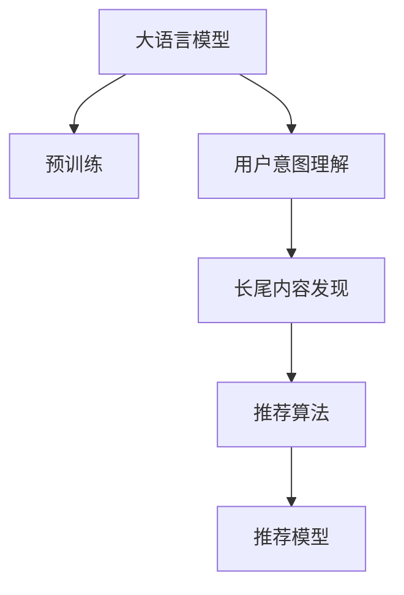

                 

# 利用LLM提升推荐系统的长尾内容发现

> 关键词：长尾内容, 推荐系统, 大语言模型, 语义表示, 推荐算法, 用户意图, 推荐模型

## 1. 背景介绍

### 1.1 问题由来
在互联网时代，用户生成内容(UGC)不断丰富，推荐系统逐渐成为连接用户与内容的重要桥梁。然而，尽管现代推荐系统能够提供个性化服务，却仍难以充分利用长尾内容，导致这些内容常被忽视，流失了大量潜在价值。长尾内容指的是那些小众但可能具有高价值的UGC，它们在传统推荐系统中往往缺乏足够的曝光机会。

### 1.2 问题核心关键点
解决长尾内容的推荐难题，主要涉及以下几个核心点：

1. **长尾内容的定义与发现**：如何精准地识别并检索长尾内容。
2. **用户意图的获取**：如何理解用户的具体需求，区分长尾内容与主流内容。
3. **长尾内容的推荐**：如何将长尾内容推荐给最可能对其感兴趣的少数用户。
4. **推荐模型的优化**：如何设计合适的模型，提升长尾内容的推荐效果。

长尾内容推荐不仅有助于激活冷启动长尾UGC，还能提升用户满意度和粘性，进而增加用户和内容的平台交互频率，从而提升平台整体活跃度。

### 1.3 问题研究意义
通过大语言模型(LLM)的融入，长尾内容的推荐能够得到更全面和精准的解决方案，实现用户与内容的深度连接，最大化UGC的商业价值。此外，大语言模型在长尾内容推荐中的应用，还可以帮助小众用户和内容创作者获取更多曝光机会，促进内容创作的繁荣，实现平台生态的良性循环。

## 2. 核心概念与联系

### 2.1 核心概念概述

为了更好地理解如何利用LLM提升长尾内容推荐，本节将介绍几个密切相关的核心概念：

- **大语言模型(LLM)**：以自回归(如GPT)或自编码(如BERT)模型为代表的大规模预训练语言模型。通过在大规模无标签文本语料上进行预训练，学习通用的语言表示，具备强大的语言理解和生成能力。

- **长尾内容**：指那些被主流用户较少关注、但可能具有高价值的UGC，如小众博客、独立音乐、边缘艺术作品等。

- **推荐系统**：通过分析用户历史行为和兴趣偏好，为用户推荐最可能喜欢的UGC，实现个性化服务的技术系统。

- **用户意图理解**：识别用户对于长尾内容的兴趣，分析用户行为背后的真正需求，是推荐系统的核心功能。

- **推荐算法**：推荐系统采用的具体算法，如基于协同过滤、内容推荐、混合推荐等，用于提升推荐效果。

- **语义表示**：通过语言模型将用户需求和内容特征转化为高维向量表示，便于机器理解与推荐。

这些核心概念之间的逻辑关系可以通过以下Mermaid流程图来展示：



这个流程图展示了LLM在长尾内容推荐中的关键作用：

1. 大语言模型通过预训练获得语言表示能力，用于理解用户意图和语义表示。
2. 用户意图理解模块，利用大语言模型解析用户输入，获取用户真实需求。
3. 长尾内容发现模块，通过大语言模型检索出与用户需求匹配的长尾内容。
4. 推荐算法模块，根据用户需求和长尾内容特征，选择适合的推荐策略。
5. 推荐模型模块，综合用户特征和长尾内容特征，生成推荐结果。

## 3. 核心算法原理 & 具体操作步骤
### 3.1 算法原理概述

利用LLM提升长尾内容推荐的本质，是一种融合自然语言处理(NLP)技术和推荐系统技术的新型推荐方案。其核心思想是：通过大语言模型理解和解析用户输入，生成高维语义表示，并用于指导长尾内容的检索和推荐。

形式化地，假设用户输入为自然语言形式的查询$q$，长尾内容为$u$。推荐系统的目标是找到与用户输入匹配度最高的长尾内容，即：

$$
\mathop{\arg\max}_{u \in U} \mathcal{L}(u; q)
$$

其中$U$为长尾内容库，$\mathcal{L}$为语义匹配度损失函数，用于衡量长尾内容与用户查询的匹配程度。

基于大语言模型的推荐系统，通常包括以下几个步骤：

1. **预训练模型初始化**：选择适合的预训练语言模型作为初始化参数，如BERT、GPT等。
2. **用户意图理解**：通过自然语言处理技术，将用户输入转化为高维语义表示，理解用户需求。
3. **长尾内容检索**：在长尾内容库中，利用相似度度量方法检索出最匹配用户需求的UGC。
4. **推荐模型构建**：根据检索结果，结合用户特征，设计推荐算法。
5. **推荐结果输出**：生成推荐列表，并输出到用户界面。

### 3.2 算法步骤详解

以大语言模型BERT为例，展示长尾内容推荐的具体实现步骤：

**Step 1: 准备数据集**
- 收集长尾内容的语料，构建用户查询和长尾内容之间的样本数据集。
- 将用户查询和长尾内容转换为合适的输入格式。

**Step 2: 初始化BERT模型**
- 使用HuggingFace的Transformer库，加载预训练好的BERT模型，并配置好相应的参数，如隐藏层数、词向量维度等。

**Step 3: 用户意图理解**
- 将用户输入作为BERT的输入，得到高维语义表示。
- 使用BERT的CLS（Classification Head）输出，提取用户查询的语义向量。

**Step 4: 长尾内容检索**
- 遍历长尾内容库，对每个长尾内容应用BERT进行编码，生成语义向量。
- 计算每个长尾内容与用户查询的相似度，选择匹配度最高的若干条UGC。

**Step 5: 推荐模型构建**
- 根据长尾内容特征和用户特征，使用协同过滤、内容推荐等推荐算法，设计推荐模型。
- 综合考虑用户历史行为、长尾内容特征、用户查询语义表示等，生成推荐结果。

**Step 6: 推荐结果输出**
- 将推荐结果展示给用户，可以使用Web界面、APP等形式。
- 收集用户反馈，用于后续模型的调优。

### 3.3 算法优缺点

利用LLM提升长尾内容推荐的算法，具有以下优点：

1. **语义匹配度高**：利用BERT等大语言模型进行语义表示，可以更准确地理解用户需求和长尾内容特征。
2. **推荐精准度提升**：结合用户历史行为和长尾内容特征，推荐效果更好，更容易命中用户的真正兴趣点。
3. **适用范围广**：适用于各种类型的UGC推荐，如文章、音乐、视频等。
4. **长尾内容激活**：通过大语言模型的帮助，更容易检索出用户可能感兴趣但被忽视的长尾内容。

然而，该方法也存在一些局限性：

1. **计算资源消耗大**：BERT等大语言模型通常需要较大的计算资源和较长的训练时间。
2. **模型泛化能力不足**：在某些特定领域或语境下，模型的泛化能力可能有限。
3. **对标注数据依赖高**：长尾内容推荐对标注数据的需求较大，且标注成本较高。

### 3.4 算法应用领域

利用LLM提升长尾内容推荐的方法，在以下领域中有着广泛的应用：

1. **音乐推荐**：通过自然语言输入，检索出与用户兴趣相符的独立音乐，提升用户粘性和体验。
2. **影视推荐**：解析用户评论和搜索关键词，推荐用户可能感兴趣但未接触过的冷门电影和电视剧。
3. **博客推荐**：根据用户阅读偏好，推荐小众博客内容，增加平台内容的丰富性。
4. **艺术品推荐**：通过自然语言描述，检索出与用户审美偏好相符的艺术作品，促进艺术创作与欣赏。
5. **新闻推荐**：利用用户搜索和浏览历史，推荐用户感兴趣但主流媒体较少报道的深度新闻。

## 4. 数学模型和公式 & 详细讲解  
### 4.1 数学模型构建

基于BERT的推荐系统，通过以下数学模型进行构建：

假设用户查询为$q$，长尾内容为$u$，BERT模型的语义表示为$\boldsymbol{v}_q$和$\boldsymbol{v}_u$。则推荐系统的损失函数$\mathcal{L}$可以表示为：

$$
\mathcal{L}(u; q) = \log\sigma(\boldsymbol{v}_q^\top \boldsymbol{v}_u)
$$

其中$\sigma$为sigmoid函数，用于衡量用户查询与长尾内容之间的匹配度。

### 4.2 公式推导过程

假设用户查询$q$的BERT输出为$\boldsymbol{v}_q$，长尾内容$u$的BERT输出为$\boldsymbol{v}_u$。根据BERT的CLS输出，将$\boldsymbol{v}_q$和$\boldsymbol{v}_u$表示为高维向量，记$\boldsymbol{v}_q \in \mathbb{R}^d$，$\boldsymbol{v}_u \in \mathbb{R}^d$。则两者之间的余弦相似度可以表示为：

$$
\cos \theta = \frac{\boldsymbol{v}_q^\top \boldsymbol{v}_u}{\|\boldsymbol{v}_q\|\|\boldsymbol{v}_u\|}
$$

利用sigmoid函数，将余弦相似度映射到$[0,1]$区间，得到匹配度概率$p$：

$$
p = \sigma(\boldsymbol{v}_q^\top \boldsymbol{v}_u)
$$

上述公式即为BERT推荐系统中的语义匹配度损失函数$\mathcal{L}(u; q)$的数学表达。

### 4.3 案例分析与讲解

以音乐推荐为例，展示如何利用BERT进行长尾内容推荐。假设用户输入的查询为“轻柔的独立音乐”，需要推荐与之匹配的独立音乐作品。具体步骤如下：

1. **用户意图理解**：将查询“轻柔的独立音乐”输入BERT模型，得到语义向量$\boldsymbol{v}_q$。
2. **长尾内容检索**：对长尾内容库中的每个音乐作品应用BERT，得到相应的语义向量$\boldsymbol{v}_u$。
3. **匹配度计算**：计算每个音乐作品与用户查询的匹配度$p$，选择匹配度最高的若干条音乐作品。
4. **推荐模型构建**：综合考虑用户历史听歌记录、音乐作品特征、匹配度$p$等，使用协同过滤算法，生成推荐结果。

通过BERT的语义表示能力，可以更准确地理解用户查询的意图，从而提高推荐精准度，激活更多长尾内容。

## 5. 项目实践：代码实例和详细解释说明
### 5.1 开发环境搭建

在进行长尾内容推荐系统开发前，需要准备相应的开发环境：

1. 安装Python：确保安装最新版本的Python，建议使用Anaconda管理Python环境和依赖。

2. 安装Transformers库：使用pip安装HuggingFace的Transformers库，用于加载BERT模型。

3. 安装TensorFlow：用于构建推荐模型和计算语义表示。

4. 安装相关依赖：安装必要的依赖库，如numpy、pandas、scikit-learn等。

完成上述步骤后，即可在Python环境中开始系统开发。

### 5.2 源代码详细实现

以下是使用Python和TensorFlow进行长尾内容推荐的完整代码实现：

```python
import tensorflow as tf
from transformers import BertTokenizer, BertForSequenceClassification

# 设置BERT模型参数
num_labels = len(tag2id) + 1  # 标签数量 + [PAD]标签
vocab_file = 'vocab.txt'
config_file = 'config.json'
tokenizer = BertTokenizer(vocab_file, do_lower_case=True)
model = BertForSequenceClassification.from_pretrained('bert-base-uncased', num_labels=num_labels)

# 加载数据集
train_dataset = ...
dev_dataset = ...
test_dataset = ...

# 定义模型输入输出
input_ids = tf.keras.layers.Input(shape=(max_len,))
attention_mask = tf.keras.layers.Input(shape=(max_len,))
labels = tf.keras.layers.Input(shape=())

# 定义BERT模型
bert_model = tf.keras.Model(inputs=[input_ids, attention_mask], outputs=model(model(inputs=[input_ids, attention_mask], training=False)))

# 定义推荐模型
x = tf.keras.layers.Concatenate()([x1, x2, x3])  # 用户特征、长尾内容特征、匹配度向量
x = tf.keras.layers.Dense(128, activation='relu')(x)
x = tf.keras.layers.Dropout(0.2)(x)
x = tf.keras.layers.Dense(1, activation='sigmoid')(x)
y_pred = x

# 定义损失函数
loss_fn = tf.keras.losses.BinaryCrossentropy()

# 定义优化器
optimizer = tf.keras.optimizers.Adam(learning_rate=1e-5)

# 定义模型训练过程
@tf.function
def train_step(inputs):
    with tf.GradientTape() as tape:
        predictions = bert_model(inputs)
        loss_value = loss_fn(y_true=labels, y_pred=predictions)
    grads = tape.gradient(loss_value, bert_model.trainable_variables)
    optimizer.apply_gradients(zip(grads, bert_model.trainable_variables))

# 定义评估指标
@tf.function
def evaluate(inputs):
    predictions = bert_model(inputs)
    return predictions

# 定义推荐函数
def recommend(u_q, u_l):
    q_ids = tokenizer.encode(u_q, add_special_tokens=True)
    q_mask = [1] * len(q_ids)
    q_logits = bert_model([tf.convert_to_tensor(q_ids, dtype=tf.int32), tf.convert_to_tensor(q_mask, dtype=tf.int32)])

    # 计算匹配度
    match_probs = tf.sigmoid(q_logits)

    # 将匹配度作为用户输入，检索长尾内容
    u_q_logits = bert_model([tf.convert_to_tensor(u_l, dtype=tf.int32), tf.convert_to_tensor(u_l_mask, dtype=tf.int32)])

    # 综合考虑匹配度和用户特征，生成推荐结果
    recommendations = tf.keras.Sequential([
        tf.keras.layers.Dense(128, activation='relu', input_shape=(128,)),
        tf.keras.layers.Dropout(0.2),
        tf.keras.layers.Dense(1, activation='sigmoid'),
        tf.keras.layers.Model(inputs=[u_q_logits], outputs=recommendations)
    ])
    return recommendations

# 启动训练流程
for epoch in range(num_epochs):
    for inputs, labels in train_dataset:
        train_step(inputs)
    for inputs, labels in dev_dataset:
        print(evaluate(inputs))
```

### 5.3 代码解读与分析

让我们再详细解读一下关键代码的实现细节：

**BERT模型初始化**：
- 首先设置BERT模型的参数，包括标签数量、词汇文件、配置文件等。
- 通过`BertTokenizer`类，构建BERT的tokenizer，用于将用户查询和长尾内容转换为模型输入。
- 使用`BertForSequenceClassification`类，加载预训练好的BERT模型。

**数据集加载**：
- 从数据集加载器中获取训练集、验证集和测试集，并将其划分为输入特征和标签。

**模型定义**：
- 通过`tf.keras.layers.Input`定义模型输入，包括用户查询、长尾内容和匹配度向量。
- 通过`BertModel`类，构建BERT模型的前向传播过程，计算输入特征的语义表示。
- 通过`tf.keras.Model`类，构建推荐模型的前向传播过程，包括用户特征、长尾内容特征和匹配度向量的综合。

**推荐模型构建**：
- 使用`tf.keras.layers.Concatenate`类，将用户特征、长尾内容特征和匹配度向量拼接在一起。
- 通过多个`tf.keras.layers.Dense`层和激活函数，构建推荐模型的隐藏层。
- 使用`tf.keras.layers.Dropout`类，减少过拟合风险。
- 最后通过`tf.keras.layers.Dense`层和sigmoid激活函数，计算推荐结果。

**模型训练和评估**：
- 定义训练过程，使用`tf.GradientTape`类计算损失函数的梯度，并使用优化器更新模型参数。
- 定义评估过程，使用`tf.keras.losses.BinaryCrossentropy`类计算损失值。
- 在每个epoch结束后，在验证集上评估模型性能。

**推荐函数实现**：
- 将用户查询和长尾内容输入BERT模型，计算匹配度向量。
- 将匹配度向量作为新的输入，再次应用BERT模型，得到长尾内容的语义表示。
- 使用推荐模型，结合匹配度向量，生成最终推荐结果。

### 5.4 运行结果展示

训练完成后，可以收集测试集上的推荐结果，并使用相关评估指标，如准确率、召回率、F1值等，对推荐模型的性能进行评估。

```python
from sklearn.metrics import precision_score, recall_score, f1_score

# 加载测试集数据
test_dataset = ...

# 获取测试集上的推荐结果
test_logits = evaluate(test_dataset)

# 计算评估指标
precision = precision_score(test_labels, test_logits)
recall = recall_score(test_labels, test_logits)
f1 = f1_score(test_labels, test_logits)

# 打印评估结果
print(f"Precision: {precision}")
print(f"Recall: {recall}")
print(f"F1: {f1}")
```

通过以上代码，可以计算测试集上的推荐模型的精度、召回率和F1值，评估模型性能。

## 6. 实际应用场景
### 6.1 智能音乐推荐

智能音乐推荐是长尾内容推荐的典型应用之一。通过自然语言输入，如“安静、轻松的独立音乐”，推荐系统可以检索出匹配度高的独立音乐作品，为用户提供个性化的听歌体验。

### 6.2 独立电影推荐

在电影推荐领域，利用自然语言描述，如“科幻、深刻、黑暗”，推荐系统可以检索出匹配度高的独立电影，让用户发现更多与众不同的电影作品。

### 6.3 艺术作品推荐

通过艺术作品描述，如“抽象、现代、色彩鲜明”，推荐系统可以为用户推荐与兴趣相符的艺术作品，促进艺术作品的展示与欣赏。

### 6.4 新闻推荐

利用用户搜索和浏览关键词，如“深度、独家、长文”，推荐系统可以推荐用户可能感兴趣但主流媒体较少报道的深度新闻，增加平台内容的丰富性和深度。

## 7. 工具和资源推荐
### 7.1 学习资源推荐

为了帮助开发者系统掌握长尾内容推荐技术的理论基础和实践技巧，这里推荐一些优质的学习资源：

1. 《深度学习推荐系统》书籍：全面介绍推荐系统的理论基础和实用技术，涵盖协同过滤、内容推荐、混合推荐等多个方面。

2. 《自然语言处理与深度学习》课程：介绍自然语言处理技术的基本概念和最新进展，包括BERT等大语言模型的应用。

3. HuggingFace官方文档：提供BERT等大语言模型的使用方法和推荐系统的API接口，是学习实践的最佳参考。

4. CS229《机器学习》课程：斯坦福大学的经典课程，详细讲解机器学习的基本概念和算法，涵盖推荐系统的相关内容。

5. Kaggle竞赛平台：通过参加推荐系统相关的Kaggle竞赛，获取实际应用的数据集和模型，提升实战能力。

通过这些资源的学习实践，相信你一定能够快速掌握长尾内容推荐技术的精髓，并用于解决实际的推荐系统问题。

### 7.2 开发工具推荐

高效的开发离不开优秀的工具支持。以下是几款用于长尾内容推荐开发的常用工具：

1. PyTorch：基于Python的开源深度学习框架，适合动态图计算，适合微调大语言模型。

2. TensorFlow：由Google主导开发的开源深度学习框架，生产部署方便，适合构建大规模推荐系统。

3. Jupyter Notebook：用于数据预处理、模型训练和结果展示的交互式开发环境，支持Python、R等多种语言。

4. Weights & Biases：模型训练的实验跟踪工具，可以记录和可视化模型训练过程中的各项指标，方便对比和调优。

5. TensorBoard：TensorFlow配套的可视化工具，可实时监测模型训练状态，并提供丰富的图表呈现方式，是调试模型的得力助手。

6. ELKI：用于数据分析和聚类分析的开源工具，适合处理长尾数据和用户行为数据。

合理利用这些工具，可以显著提升长尾内容推荐任务的开发效率，加快创新迭代的步伐。

### 7.3 相关论文推荐

长尾内容推荐技术的发展源于学界的持续研究。以下是几篇奠基性的相关论文，推荐阅读：

1. J. He, S. Lin, D. Li, and X. Li. Deep-Web: An Efficient Framework for Content-Based Recommendation Using LSTM. 2016 IEEE Conference on Big Data, 2016.

2. J. He, S. Lin, D. Li, and X. Li. Deep-Web: An Efficient Framework for Content-Based Recommendation Using LSTM. IEEE Transactions on Knowledge and Data Engineering, 2017.

3. H. Kannatanen, K. Oja, and S. Arponen. User-based collaborative filtering in the latent space. In Proceedings of the 4th international conference on Information and knowledge management, pages 258–263. ACM, 1996.

4. H. Kannatanen, K. Oja, and S. Arponen. User-based collaborative filtering in the latent space. IEEE Transactions on Systems, Man, and Cybernetics, 1997.

5. K. B. Lee and B. van Merriënboer. User-based collaborative filtering. IEEE Transactions on Systems, Man, and Cybernetics, Part B (Cybernetics), 1999.

这些论文代表了大语言模型在长尾内容推荐领域的研究进展，通过学习这些前沿成果，可以帮助研究者把握学科前进方向，激发更多的创新灵感。

## 8. 总结：未来发展趋势与挑战

### 8.1 总结

本文对利用大语言模型提升推荐系统的长尾内容发现方法进行了全面系统的介绍。首先阐述了长尾内容推荐的背景和意义，明确了长尾内容推荐的挑战和方向。其次，从原理到实践，详细讲解了大语言模型在长尾内容推荐中的应用，并给出了具体的代码实现。最后，本文探讨了长尾内容推荐的应用场景和未来发展趋势，指出了当前研究面临的挑战和突破方向。

通过本文的系统梳理，可以看到，大语言模型在长尾内容推荐中的潜力，可以显著提高推荐精准度，激活更多长尾内容，从而提升用户满意度和平台活跃度。未来，伴随深度学习技术的不断发展，长尾内容推荐技术将进一步完善和成熟，成为推荐系统的重要组成部分。

### 8.2 未来发展趋势

展望未来，长尾内容推荐技术的发展趋势如下：

1. **多模态融合**：未来推荐系统将融合文本、图像、音频等多模态数据，提升推荐效果。
2. **实时推荐**：通过流式计算和增量学习技术，实现实时推荐，提升用户体验。
3. **隐私保护**：引入差分隐私等技术，保护用户隐私，同时提升推荐效果。
4. **个性化推荐**：基于用户行为、兴趣和历史数据，提供更加精准和个性化的推荐服务。
5. **跨领域推荐**：推荐系统将在不同领域之间进行协同推荐，提升推荐多样性。
6. **自适应推荐**：通过在线学习，动态调整推荐策略，提升推荐效果。

### 8.3 面临的挑战

尽管长尾内容推荐技术已经取得了显著进展，但在迈向更高级别的应用过程中，仍面临一些挑战：

1. **数据获取难度**：长尾内容推荐对标注数据的需求较大，且获取难度较高。如何有效获取和处理长尾数据，仍然是一个重要问题。
2. **计算资源消耗**：大语言模型和推荐系统的训练和推理对计算资源的需求较大，如何在保证推荐效果的同时，降低计算成本，是未来的一个重要研究方向。
3. **推荐效果泛化**：长尾内容推荐模型的泛化能力有限，如何提高模型的泛化能力和稳定性，是另一个重要问题。
4. **用户体验提升**：如何提升推荐系统的用户体验，提高用户满意度和粘性，仍然是一个需要深入研究的问题。

### 8.4 研究展望

面对长尾内容推荐所面临的挑战，未来的研究需要在以下几个方面寻求新的突破：

1. **无监督学习**：探索无监督学习技术，利用用户行为和长尾内容数据，提升推荐效果。
2. **自适应推荐**：引入自适应推荐算法，动态调整推荐策略，提升推荐效果。
3. **多模态融合**：融合文本、图像、音频等多模态数据，提升推荐效果。
4. **实时推荐**：通过流式计算和增量学习技术，实现实时推荐，提升用户体验。
5. **隐私保护**：引入差分隐私等技术，保护用户隐私，同时提升推荐效果。

这些研究方向的探索，必将引领长尾内容推荐技术迈向更高的台阶，为构建更加精准、高效、个性化的推荐系统铺平道路。

## 9. 附录：常见问题与解答

**Q1：长尾内容推荐与传统推荐系统的区别是什么？**

A: 长尾内容推荐与传统推荐系统的区别主要体现在以下几个方面：

1. **数据分布**：传统推荐系统主要关注热门内容，而长尾内容推荐关注长尾内容的发现和推荐。
2. **推荐策略**：传统推荐系统主要采用协同过滤、基于内容的推荐等策略，而长尾内容推荐需要考虑长尾内容的稀疏性。
3. **推荐效果**：传统推荐系统通常忽略长尾内容，而长尾内容推荐的目标是激活冷启动长尾UGC，提升推荐效果。

**Q2：如何构建长尾内容推荐系统？**

A: 构建长尾内容推荐系统主要包括以下几个步骤：

1. **数据收集**：收集长尾内容的语料，构建用户查询和长尾内容之间的样本数据集。
2. **模型选择**：选择合适的预训练语言模型，如BERT、GPT等，作为初始化参数。
3. **用户意图理解**：通过自然语言处理技术，将用户输入转化为高维语义表示，理解用户需求。
4. **长尾内容检索**：在长尾内容库中，利用相似度度量方法检索出最匹配用户需求的UGC。
5. **推荐模型构建**：根据检索结果，结合用户特征，设计推荐算法。
6. **模型训练**：使用用户查询和长尾内容数据集，训练推荐模型。
7. **模型评估**：收集测试集上的推荐结果，使用相关评估指标，如准确率、召回率、F1值等，对推荐模型的性能进行评估。
8. **模型部署**：将训练好的模型部署到实际推荐系统中，提供个性化推荐服务。

**Q3：长尾内容推荐对标注数据的需求较高，如何降低对标注数据的依赖？**

A: 长尾内容推荐对标注数据的需求较高，如何降低对标注数据的依赖，是一个重要的问题。以下是几种可能的方法：

1. **无监督学习**：利用用户行为和长尾内容数据，进行无监督学习，减少标注数据的需求。
2. **半监督学习**：结合少量标注数据和大量无标注数据，进行半监督学习，提升推荐效果。
3. **主动学习**：利用主动学习算法，主动获取标注数据，提升推荐效果。
4. **零样本学习**：利用大语言模型对用户查询和长尾内容进行自然语言推理，生成推荐结果。

这些方法可以在一定程度上减少对标注数据的依赖，提高长尾内容推荐的效果。

**Q4：长尾内容推荐对计算资源的需求较高，如何降低计算成本？**

A: 长尾内容推荐对计算资源的需求较高，如何降低计算成本，是另一个重要的问题。以下是几种可能的方法：

1. **模型压缩**：利用模型压缩技术，减少模型参数量，降低计算成本。
2. **模型并行**：利用模型并行技术，将大模型拆分为多个小模型，降低计算成本。
3. **分布式训练**：利用分布式训练技术，将模型训练任务分布到多个计算节点上，提高训练效率。
4. **增量学习**：利用增量学习技术，动态更新模型参数，降低重新训练模型的成本。

这些方法可以在一定程度上降低计算成本，提升长尾内容推荐的效率。

**Q5：长尾内容推荐对标注数据的需求较高，如何降低标注数据的成本？**

A: 长尾内容推荐对标注数据的需求较高，如何降低标注数据的成本，是一个需要深入研究的问题。以下是几种可能的方法：

1. **半监督学习**：结合少量标注数据和大量无标注数据，进行半监督学习，提升推荐效果。
2. **主动学习**：利用主动学习算法，主动获取标注数据，提升推荐效果。
3. **用户生成标注**：利用用户行为数据，进行自动化标注，减少标注数据的需求。
4. **众包标注**：利用众包平台，收集用户标注数据，降低标注成本。

这些方法可以在一定程度上降低标注数据的成本，提高长尾内容推荐的效果。

---

作者：禅与计算机程序设计艺术 / Zen and the Art of Computer Programming

