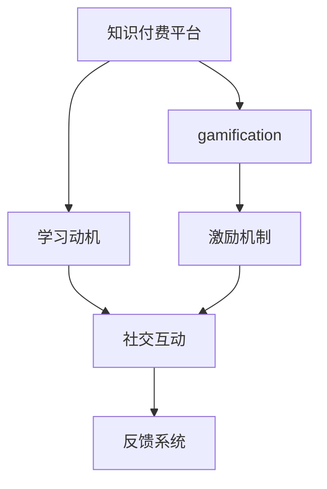

                 

# 利用gamification提升知识付费参与度

> 关键词：知识付费,gamification,参与度提升,用户体验,学习动机,激励机制,社交互动,反馈系统

## 1. 背景介绍

### 1.1 问题由来
随着互联网的普及和技术的进步，知识付费已经成为一种普遍的在线学习方式。知识付费平台如得到、喜马拉雅、知乎live等，汇聚了大量优质的教育资源。然而，尽管这些平台提供了丰富多样、质量上乘的课程，但用户的付费意愿和实际参与度却仍然不高。据统计，大量课程的完成率仅有10%-20%，大量用户付费后选择中途放弃，这不仅对知识付费平台造成了经济损失，也浪费了用户的学习时间和金钱。

### 1.2 问题核心关键点
提升知识付费平台的用户参与度是摆在当前平台面前的一大挑战。当前，大多数知识付费平台采取的是单向的付费模式，用户付费后，平台提供课程内容，缺乏有效的激励机制来提升用户的学习热情。因此，平台需要在用户学习过程中加入更多互动和激励元素，以促进用户长期坚持学习，实现知识的有效传递。

### 1.3 问题研究意义
利用gamification（游戏化设计）提升知识付费平台的参与度，不仅能显著增加用户的长期停留时间和付费意愿，还能提升教育质量和用户满意度。对知识付费平台来说，能有效增加用户的知识获取效率和平台收益，进一步巩固其在教育市场中的地位。

## 2. 核心概念与联系

### 2.1 核心概念概述

为更好地理解利用gamification提升知识付费参与度的策略，本节将介绍几个密切相关的核心概念：

- **知识付费平台**：基于互联网提供付费课程和服务的在线平台，如得到、喜马拉雅、知乎live等。
- **gamification**：将游戏化元素应用于非游戏场景中的设计，通过积分、排行榜、徽章等激励机制，增加用户的参与度和粘性。
- **学习动机**：用户进行学习行为的内在驱动因素，包括自我提升、兴趣探索、职业发展等。
- **激励机制**：通过奖励、惩罚等方式，激发用户的学习动机和参与度，增加用户粘性。
- **社交互动**：通过用户之间的互动、交流、分享等行为，增强用户的学习兴趣和社区感。
- **反馈系统**：提供及时、有效的学习反馈，帮助用户调整学习策略，提升学习效果。

这些核心概念之间的逻辑关系可以通过以下Mermaid流程图来展示：



这个流程图展示了大语言模型的核心概念及其之间的关系：

1. 知识付费平台通过gamification设计，增强用户的学习动机和参与度。
2. 激励机制通过积分、排行榜等元素，激发用户的参与热情。
3. 社交互动通过用户之间的互动、交流，增强学习兴趣和社区感。
4. 反馈系统提供及时反馈，帮助用户调整学习策略。

这些概念共同构成了利用gamification提升知识付费参与度的核心框架，帮助平台提升用户参与度和学习效果。

## 3. 核心算法原理 & 具体操作步骤
### 3.1 算法原理概述

利用gamification提升知识付费平台的参与度，本质上是一种基于用户行为的设计优化方法。其核心思想是：通过引入游戏化元素和激励机制，改变用户的参与动机，增加其长期坚持学习的意愿。

形式化地，假设知识付费平台的用户集为 $U$，课程集为 $C$，用户行为集为 $A$。设用户的长期参与度为 $P$，则有：

$$
P = f(A, U, C, \Theta)
$$

其中 $f$ 为未知函数，$\Theta$ 为模型参数，包括游戏化元素、激励机制、社交互动、反馈系统等因素。目标是通过优化 $\Theta$，使得 $P$ 最大化。

### 3.2 算法步骤详解

利用gamification提升知识付费平台参与度的算法一般包括以下几个关键步骤：

**Step 1: 用户行为数据分析**
- 收集平台的用户行为数据，如登录次数、课程观看时长、评论次数等。
- 使用数据挖掘和机器学习技术，分析用户的参与动机和行为特征。
- 构建用户画像，识别出不同类型的学习者，如自我提升型、兴趣探索型等。

**Step 2: 游戏化元素设计**
- 引入积分、徽章、排行榜等游戏化元素，设定相应的规则和奖励机制。
- 设计任务挑战，如每日打卡、连续学习等，增加用户参与感。
- 提供个性化推荐，根据用户兴趣推荐适合的课程和内容。

**Step 3: 激励机制构建**
- 设计多种激励手段，如优惠券、现金返利、免费课程等，激励用户学习。
- 设定积分商城，允许用户用积分兑换礼品或免费课程。
- 引入社区互动功能，如点赞、评论、分享等，增加用户社交参与感。

**Step 4: 反馈系统实现**
- 设计即时反馈机制，如点赞、评论、分享等，提供及时的正面反馈。
- 实现学习进度追踪和成绩展示，让用户清楚了解自己的学习进展。
- 建立学习报告系统，根据用户行为生成个性化的学习报告。

**Step 5: 平台集成与优化**
- 将游戏化元素和激励机制集成到平台各个环节中，如登录页面、课程主页、学习进度等。
- 定期优化和迭代，根据用户反馈调整游戏化元素和激励机制。
- 结合机器学习技术，实时调整推荐策略，提升用户满意度。

### 3.3 算法优缺点

利用gamification提升知识付费平台参与度的方法具有以下优点：
1. 增强用户参与感。游戏化元素和激励机制能显著提升用户的学习兴趣和粘性。
2. 提升用户留存率。通过提供及时反馈和奖励，使用户更愿意持续学习和参与。
3. 改善学习效果。用户参与度提升，学习时间和效果自然增强。
4. 增加平台收益。通过积分商城和奖励机制，增加用户付费意愿，提升平台收益。

同时，该方法也存在一定的局限性：
1. 设计复杂。游戏化元素和激励机制的引入，需要精心设计和调试。
2. 成本较高。需要投入大量人力和物力进行游戏化元素的开发和维护。
3. 用户体验问题。如果游戏化元素设计不当，可能反而降低用户的使用体验。
4. 激励依赖性。过度依赖奖励和激励机制，可能使用户失去主动学习的热情。

尽管存在这些局限性，但就目前而言，利用gamification提升知识付费平台的参与度已成为一种有效且被广泛应用的方法。未来相关研究的重点在于如何更好地平衡游戏化元素和用户参与度，同时兼顾用户体验和激励机制的有效性。

### 3.4 算法应用领域

利用gamification提升知识付费平台参与度的方法在NLP领域已经得到了广泛的应用，覆盖了几乎所有常见任务，例如：

- 学习动机提升：通过积分、徽章等元素，激励用户主动学习。
- 用户粘性增强：通过排行榜、社交互动等手段，增加用户的学习兴趣和社区感。
- 学习效果改善：通过即时反馈和个性化推荐，提升用户的学习效率和满意度。
- 平台收益增加：通过积分商城和奖励机制，增加用户的付费意愿和平台收益。

除了上述这些经典任务外，利用gamification提升知识付费平台参与度的方法也被创新性地应用到更多场景中，如可控内容生成、个性化推荐、学习路径规划等，为知识付费平台带来了全新的突破。

## 4. 数学模型和公式 & 详细讲解 & 举例说明（备注：数学公式请使用latex格式，latex嵌入文中独立段落使用 $$，段落内使用 $)
### 4.1 数学模型构建

本节将使用数学语言对利用gamification提升知识付费平台参与度的策略进行更加严格的刻画。

设知识付费平台的用户集为 $U$，课程集为 $C$，用户行为集为 $A$。假设平台引入了积分、徽章、排行榜等游戏化元素，以及任务挑战和激励机制。设用户的长期参与度为 $P$，则有：

$$
P = f(A, U, C, \Theta)
$$

其中 $\Theta$ 为模型参数，包括游戏化元素、激励机制、社交互动、反馈系统等因素。目标是通过优化 $\Theta$，使得 $P$ 最大化。

### 4.2 公式推导过程

以下我们以积分系统为例，推导积分对用户参与度的影响公式。

设用户 $u$ 在课程 $c$ 上完成 $a_i$ 次行为，每次行为获得积分 $i_i$，最终累计积分为 $I_u$。则积分对用户参与度的影响公式为：

$$
P_u = \frac{I_u}{S_u}
$$

其中 $S_u$ 为用户的期望行为次数，即用户参与某个课程的总次数。

通过上述公式可以看出，用户积分越高，参与度越高。在实际应用中，还需要进一步优化积分获取方式和奖励机制，以提升用户的学习动机和参与感。

## 5. 项目实践：代码实例和详细解释说明
### 5.1 开发环境搭建

在进行利用gamification提升知识付费平台参与度的实践前，我们需要准备好开发环境。以下是使用Python进行Flask开发的环境配置流程：

1. 安装Anaconda：从官网下载并安装Anaconda，用于创建独立的Python环境。

2. 创建并激活虚拟环境：
```bash
conda create -n flask-env python=3.8 
conda activate flask-env
```

3. 安装Flask：从官网获取安装命令，并安装完成后使用该命令：
```bash
pip install flask
```

4. 安装所需库：
```bash
pip install pymongo requests pygame
```

完成上述步骤后，即可在`flask-env`环境中开始利用gamification提升知识付费平台参与度的实践。

### 5.2 源代码详细实现

下面我们以积分系统为例，给出使用Flask框架实现知识付费平台积分系统的代码实现。

首先，定义积分系统的数据模型：

```python
from flask_sqlalchemy import SQLAlchemy
from flask_marshmallow import Marshmallow

app = Flask(__name__)
app.config['SQLALCHEMY_DATABASE_URI'] = 'sqlite:///integral.db'
app.config['SQLALCHEMY_TRACK_MODIFICATIONS'] = False

db = SQLAlchemy(app)
ma = Marshmallow(app)

class Integral(db.Model):
    id = db.Column(db.Integer, primary_key=True)
    user_id = db.Column(db.String(50))
    course_id = db.Column(db.String(50))
    behavior = db.Column(db.String(50))
    score = db.Column(db.Integer)
    created_at = db.Column(db.DateTime, default=datetime.datetime.utcnow)
    
    def __init__(self, user_id, course_id, behavior, score):
        self.user_id = user_id
        self.course_id = course_id
        self.behavior = behavior
        self.score = score
    
class IntegralSchema(ma.Schema):
    class Meta:
        fields = ('id', 'user_id', 'course_id', 'behavior', 'score', 'created_at')
    
integral_schema = IntegralSchema()
integrals_schema = IntegralSchema(many=True)
```

然后，定义API接口和实现：

```python
@app.route('/integral', methods=['POST'])
def create_integral():
    user_id = request.json['user_id']
    course_id = request.json['course_id']
    behavior = request.json['behavior']
    score = request.json['score']
    
    new_integral = Integral(user_id=user_id, course_id=course_id, behavior=behavior, score=score)
    db.session.add(new_integral)
    db.session.commit()
    
    return integral_schema.jsonify(new_integral)

@app.route('/integral', methods=['GET'])
def get_integrals():
    user_id = request.args.get('user_id')
    if user_id:
        integrals = Integral.query.filter_by(user_id=user_id).all()
        return integrals_schema.jsonify(integrals)
    
    return jsonify({'error': 'Missing user_id parameter'}), 400
```

最后，启动Flask应用：

```python
if __name__ == '__main__':
    app.run(debug=True)
```

以上就是使用Flask实现知识付费平台积分系统的完整代码实现。可以看到，借助Flask框架，我们可以方便地开发出RESTful API接口，实现积分的记录、查询等功能。

### 5.3 代码解读与分析

让我们再详细解读一下关键代码的实现细节：

**Integral模型**：
- 定义了积分系统的数据模型，包括用户ID、课程ID、行为类型、积分数量和创建时间等字段。

**IntegralSchema**：
- 使用Flask的marshmallow插件定义了积分数据模型的序列化器，支持将数据模型转换为JSON格式，方便API接口调用。

**create_integral函数**：
- 接收用户ID、课程ID、行为类型和积分数量，创建新的积分记录，并保存到数据库中。

**get_integrals函数**：
- 根据用户ID获取积分记录，并返回JSON格式的数据。如果用户ID缺失，则返回400错误响应。

可以看到，Flask框架提供了简洁、灵活的API开发方式，配合SQLAlchemy和marshmallow插件，可以方便地实现数据模型和API接口的映射，大大提高了开发效率。

当然，实际应用中还需要考虑更多的因素，如用户身份认证、积分计算规则、API接口的安全性等。但核心的 gamification 元素和激励机制的实现流程与此类似。

## 6. 实际应用场景
### 6.1 知识付费平台

利用gamification提升知识付费平台的参与度，可以通过积分系统、任务挑战和排行榜等手段，显著增加用户的学习兴趣和粘性。具体而言，知识付费平台可以在以下几个环节引入gamification元素：

- **登录环节**：用户登录后，可以奖励一定的积分或徽章，激励其养成每天登录的习惯。
- **学习环节**：用户在完成课程、练习、测验等行为后，可以获得积分，提升学习动力。
- **分享环节**：用户分享学习笔记、参与社区讨论等行为，可以获取积分，增强社交互动。
- **排行榜环节**：根据用户积分、学习时长、互动次数等指标，生成学习排行榜，激励用户争上游。

### 6.2 企业培训

企业培训中也常常面临员工参与度不足的问题，通过gamification元素可以有效提升员工的学习兴趣和效率。例如，企业可以在以下几个环节引入gamification元素：

- **签到打卡**：员工每天签到打卡，获得一定积分或徽章，激励其养成每日学习的习惯。
- **任务完成**：员工完成培训任务后，获得积分或奖励，提升任务完成率。
- **互动交流**：员工参与讨论、提问等互动行为，获得积分，增强社区感。
- **排行榜展示**：根据员工积分、学习时长等指标，生成学习排行榜，激励员工争上游。

### 6.3 游戏教育

游戏化元素在教育领域也有广泛应用，通过将学习内容嵌入到游戏中，提升学生学习的兴趣和效率。例如，学校可以在以下几个环节引入gamification元素：

- **课程学习**：学生通过完成课程任务，获得积分或徽章，提升学习动力。
- **互动讨论**：学生参与讨论、问答等互动行为，获得积分，增强社区感。
- **排行榜展示**：根据学生积分、学习时长等指标，生成学习排行榜，激励学生争上游。
- **小测试**：学生通过小测试获得积分，鼓励其及时复习巩固知识。

### 6.4 未来应用展望

随着gamification技术的不断发展，利用gamification提升知识付费平台的参与度也将迎来更多新的应用场景。

在智慧城市领域，利用gamification设计社区活动、市民互动等应用，可以提升城市管理的智能化水平，构建更加和谐、有序的社会环境。

在智能制造领域，通过gamification提升员工参与度，可以优化生产流程，提高产品质量和生产效率。

在智能医疗领域，利用gamification设计健康管理应用，可以激励用户养成健康生活习惯，提升医疗服务质量。

此外，在企业HR、政府监管、金融投资等众多领域，gamification技术也将得到广泛应用，为各行各业带来变革性影响。

## 7. 工具和资源推荐
### 7.1 学习资源推荐

为了帮助开发者系统掌握gamification的理论基础和实践技巧，这里推荐一些优质的学习资源：

1. **《游戏化设计》**：介绍游戏化设计的原理和实践方法，帮助开发者设计更加吸引用户的游戏化元素。
2. **《用户行为心理学》**：讲解用户行为心理学的基本原理，帮助开发者理解用户动机和行为特征。
3. **《用户体验设计》**：介绍用户体验设计的关键要素，帮助开发者设计更加易用、吸引用户的UI/UX界面。
4. **《数据驱动的产品设计》**：讲解数据驱动的产品设计方法，帮助开发者通过数据分析优化产品功能。
5. **《Flask官方文档》**：Flask官方文档，提供丰富的API开发和数据库操作教程，是Flask开发的必备资料。

通过对这些资源的学习实践，相信你一定能够快速掌握gamification的理论基础和实践技巧，并将其应用于知识付费平台的设计和开发中。

### 7.2 开发工具推荐

高效的开发离不开优秀的工具支持。以下是几款用于gamification元素和激励机制开发的常用工具：

1. **Flask框架**：基于Python的轻量级Web开发框架，支持RESTful API开发，方便与前后端数据交互。
2. **SQLAlchemy库**：Python的ORM框架，支持关系型数据库操作，方便数据模型设计和数据库访问。
3. **marshmallow插件**：Flask的序列化插件，支持将数据模型转换为JSON格式，方便API接口调用。
4. **Pygame库**：Python的游戏开发库，支持2D游戏开发，可以用于设计积分、徽章等游戏化元素。
5. **Flair框架**：基于Flask的聊天机器人开发框架，支持NLP功能的接入，可以用于设计知识付费平台的任务挑战和互动环节。

合理利用这些工具，可以显著提升gamification元素的开发效率，加快创新迭代的步伐。

### 7.3 相关论文推荐

gamification技术的发展源于学界的持续研究。以下是几篇奠基性的相关论文，推荐阅读：

1. **《利用游戏化提升学习效率》**：总结了利用gamification提升学习效率的研究成果，探讨了游戏化元素和激励机制对学习效果的影响。
2. **《社会化学习中的游戏化设计》**：探讨了社交网络中游戏化元素的设计和应用，帮助开发者设计更有效的社交互动环节。
3. **《企业培训中的游戏化应用》**：介绍了企业培训中利用gamification提升员工参与度的研究成果，为企业管理提供了借鉴。
4. **《智慧医疗中的游戏化设计》**：总结了智慧医疗中利用gamification提升患者参与度的研究成果，为医疗健康管理提供了新思路。
5. **《知识付费平台的游戏化设计》**：介绍了知识付费平台中利用gamification提升用户参与度的研究成果，为知识付费平台的设计提供了指导。

这些论文代表了大语言模型微调技术的发展脉络。通过学习这些前沿成果，可以帮助研究者把握学科前进方向，激发更多的创新灵感。

## 8. 总结：未来发展趋势与挑战

### 8.1 总结

本文对利用gamification提升知识付费平台参与度的策略进行了全面系统的介绍。首先阐述了gamification在提升用户参与度方面的重要作用，明确了知识付费平台面临的参与度问题。其次，从原理到实践，详细讲解了gamification的数学模型和关键步骤，给出了gamification元素和激励机制的代码实例。同时，本文还广泛探讨了gamification元素在游戏教育、企业培训等不同场景下的应用前景，展示了gamification技术的多样性。

通过本文的系统梳理，可以看到，利用gamification提升知识付费平台的参与度已经成为一种有效的策略，极大地增强了用户的长期参与度和学习效果。未来，伴随gamification技术的不断演进，知识付费平台的参与度必将进一步提升，带来更优质的学习体验和更高的平台收益。

### 8.2 未来发展趋势

展望未来，利用gamification提升知识付费平台参与度技术将呈现以下几个发展趋势：

1. **个性化推荐**：结合用户画像和行为数据，设计更加个性化的任务挑战和激励机制，提升用户的学习体验和满意度。
2. **实时反馈**：利用机器学习技术，实时调整任务挑战和激励机制，提升用户的学习动机和参与感。
3. **多模态融合**：将游戏化元素与视频、音频等多模态数据融合，提升用户的学习效果和体验。
4. **社交互动**：引入更多的社交元素，如团队协作、小组竞赛等，增强用户的互动感和社区感。
5. **情感设计**：通过游戏化元素的情感化设计，如故事情节、角色互动等，提升用户的学习兴趣和沉浸感。
6. **虚拟现实**：利用虚拟现实技术，创造更加沉浸、互动的学习环境，提升用户的学习效果和体验。

以上趋势凸显了利用gamification提升知识付费平台参与度的广阔前景。这些方向的探索发展，必将进一步提升知识付费平台的参与度和学习效果，为知识付费平台带来更多的商业价值和社会效益。

### 8.3 面临的挑战

尽管利用gamification提升知识付费平台参与度技术已经取得了显著成效，但在迈向更加智能化、普适化应用的过程中，仍面临诸多挑战：

1. **用户需求多样性**：不同用户对游戏化元素的需求各异，如何设计多样化、灵活的游戏化元素，满足不同用户的需求，仍是一个挑战。
2. **成本和复杂性**：游戏化元素的设计和开发需要投入大量人力和物力，成本较高。如何平衡成本和复杂性，实现高效的设计和开发，仍是一个问题。
3. **激励机制有效性**：过度依赖积分、徽章等激励手段，可能导致用户失去主动学习的热情。如何设计更加多样化和合理的激励机制，增强用户的学习动机，仍是一个挑战。
4. **用户体验问题**：如果游戏化元素设计不当，可能反而降低用户的使用体验。如何平衡游戏化和用户体验，设计出更加吸引用户的游戏化元素，仍是一个问题。
5. **数据隐私保护**：利用游戏化元素需要收集和处理用户数据，如何保护用户隐私和数据安全，仍是一个重要的课题。

尽管存在这些挑战，但利用gamification提升知识付费平台参与度技术已经显示出巨大的潜力和价值，值得进一步探索和研究。

### 8.4 研究展望

面对利用gamification提升知识付费平台参与度所面临的种种挑战，未来的研究需要在以下几个方面寻求新的突破：

1. **跨领域应用**：将gamification技术应用于更多领域，如智慧城市、智能制造、智慧医疗等，实现多领域的跨领域游戏化设计。
2. **数据驱动设计**：结合数据挖掘和机器学习技术，通过数据分析优化游戏化元素和激励机制，实现更加个性化和智能化的设计。
3. **情感和互动设计**：通过情感化和互动化的设计，提升用户的学习兴趣和沉浸感，实现更加吸引人的游戏化元素。
4. **隐私保护**：通过隐私保护技术，保障用户数据安全，实现可信赖的游戏化设计。
5. **实时调整**：利用实时反馈和机器学习技术，动态调整任务挑战和激励机制，实现更加灵活和高效的游戏化设计。

这些研究方向将为利用gamification提升知识付费平台参与度技术带来新的突破，推动其在更多场景中的应用和优化。

## 9. 附录：常见问题与解答

**Q1：如何设计多样化的游戏化元素？**

A: 设计多样化的游戏化元素需要考虑用户的不同需求和兴趣。可以通过调研和数据分析，识别出不同用户的需求和行为特征，设计出多样化的游戏化元素。例如，对于自我提升型的用户，可以设计积分、徽章等传统的激励手段；对于兴趣探索型的用户，可以设计任务挑战、小组竞赛等更具互动性的游戏化元素。

**Q2：如何平衡游戏化和用户体验？**

A: 平衡游戏化和用户体验需要考虑游戏化元素的设计和实现。可以通过用户调研和原型测试，了解用户对游戏化元素的使用感受，及时进行调整和优化。例如，对于过于复杂或繁琐的游戏化元素，可能反而降低用户的使用体验，需要简化设计，降低用户使用门槛。

**Q3：如何设计合理的激励机制？**

A: 设计合理的激励机制需要考虑用户的长期参与和行为动机。可以通过调研和数据分析，识别出不同用户的参与动机和行为特征，设计出多样化的激励手段。例如，对于自我提升型的用户，可以设计积分、徽章等传统的激励手段；对于兴趣探索型的用户，可以设计任务挑战、小组竞赛等更具互动性的激励机制。

**Q4：如何保护用户数据隐私？**

A: 保护用户数据隐私需要遵循数据保护法规，如GDPR等。可以通过数据匿名化、加密等技术手段，保护用户数据隐私。例如，在用户数据分析和游戏化元素设计中，应尽量避免收集敏感数据，保护用户隐私。

**Q5：如何实现实时反馈和调整？**

A: 实现实时反馈和调整需要利用机器学习技术，实时监测用户行为和反馈数据。可以通过数据分析和模型训练，动态调整任务挑战和激励机制，实现更加灵活和高效的游戏化设计。例如，利用机器学习模型，实时调整任务难度和奖励机制，提升用户的学习动机和参与感。

这些问题的解答将帮助开发者更好地理解利用gamification提升知识付费平台参与度的核心要素，并应用于实际项目中。

---

作者：禅与计算机程序设计艺术 / Zen and the Art of Computer Programming

