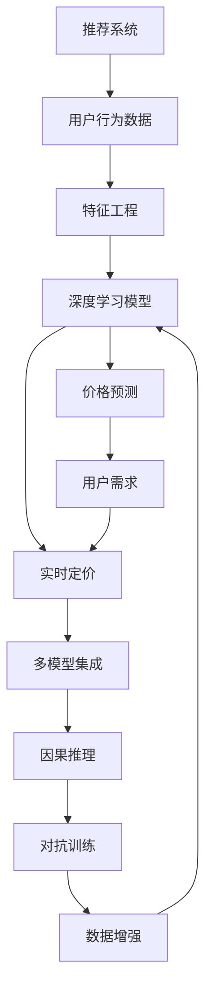

                 

# 利用大模型改进推荐系统的实时个性化定价

> 关键词：推荐系统, 大模型, 实时定价, 深度学习, 自然语言处理, 特征工程, 数据增强

## 1. 背景介绍

### 1.1 问题由来

在电商领域，推荐系统已经成为提升用户满意度、提高交易转化率的关键技术。传统的推荐系统主要基于用户的历史行为数据进行相似性匹配，推荐的商品往往与用户过往消费行为高度相关。然而，这种方法难以处理个性化需求强、时效性要求高的场景，如限量发售商品、定制化服务等。

实时个性化定价（Real-Time Personalized Pricing, RTP）是电商推荐系统的一个重要方向，旨在根据用户特征和实时环境（如需求、竞争、时间等）动态调整商品价格，最大化用户满意度及商家收益。然而，RTP问题复杂多样，涉及到心理学、经济学、数学等多个领域，且需要综合考虑用户的支付意愿、市场动态、竞争策略等多方面因素，给技术实现带来了巨大挑战。

为应对这些挑战，近年来，基于深度学习技术（尤其是预训练大模型）的推荐系统受到了广泛关注。这些模型通过学习海量数据中的复杂关联，具有强大的数据融合和表示学习能力，有望在RTP问题上取得突破。本文将详细介绍利用大模型改进推荐系统的实时个性化定价方法，涵盖模型构建、训练优化、实际部署等多个环节。

### 1.2 问题核心关键点

实时个性化定价的本质是动态地调整商品价格，使得价格既能够满足用户支付意愿，又能够最大化商家利润。基于深度学习的大模型可以处理高维数据，具有强大的表示学习能力，但如何高效建模需求、支付意愿、市场动态等复杂因素，还需进一步研究。

本文聚焦于大模型在推荐系统中的应用，探索如何利用大模型处理海量用户行为数据，构建灵活多变的模型架构，实时预测用户支付意愿，动态生成价格建议。具体而言，核心关键点包括：

- 构建基于大模型的用户行为预测模型，学习用户的实时需求和支付意愿。
- 设计多维度价格预测模型，结合市场需求、竞争策略等动态因素，生成最优价格建议。
- 引入数据增强和对抗训练等技术，提升模型的泛化能力和鲁棒性。
- 基于多模型集成和因果推理等策略，提升推荐系统的稳定性与解释性。

## 2. 核心概念与联系

### 2.1 核心概念概述

为更好地理解实时个性化定价问题，本节将介绍几个密切相关的核心概念：

- 推荐系统（Recommender System）：旨在根据用户历史行为和当前需求，推荐用户可能感兴趣的商品或服务。
- 实时定价（Real-Time Pricing）：根据用户行为、市场需求、竞争策略等实时动态因素，动态调整商品价格，以最大化用户满意度和商家收益。
- 深度学习模型：以深度神经网络为核心的机器学习模型，具有强大的表示学习和泛化能力。
- 预训练大模型：在大规模无标注数据上预训练的深度学习模型，能够学习到通用的语言或视觉表示，适用于各种NLP和CV任务。
- 特征工程（Feature Engineering）：通过数据处理、特征提取等技术，将原始数据转化为适合模型训练的输入特征。
- 数据增强（Data Augmentation）：通过数据变换、扩充等手段，增加训练集的样本多样性，提升模型泛化能力。
- 对抗训练（Adversarial Training）：通过引入对抗样本，提升模型对噪声和攻击的鲁棒性，增强模型的泛化能力。
- 多模型集成（Model Ensemble）：通过集成多个模型的输出，提升预测准确率和系统稳定性。
- 因果推理（Causal Inference）：研究如何从数据中推断因果关系，提高推荐系统的可解释性和决策依据的合理性。

这些核心概念之间的逻辑关系可以通过以下Mermaid流程图来展示：



这个流程图展示了大模型在推荐系统中的应用路径：

1. 从用户行为数据中提取特征。
2. 使用深度学习模型进行用户需求和支付意愿的预测。
3. 结合市场需求、竞争策略等动态因素，进行价格预测。
4. 引入数据增强和对抗训练提升模型泛化能力。
5. 利用多模型集成和因果推理提高系统稳定性与可解释性。

## 3. 核心算法原理 & 具体操作步骤
### 3.1 算法原理概述

实时个性化定价（RTP）问题是一个典型的强化学习问题，目标是在实时环境中动态调整商品价格，最大化用户满意度和商家收益。本节将详细介绍基于大模型的RTP算法原理。

假设用户的历史行为数据为 $x_i=(x_{i1}, x_{i2}, ..., x_{im})$，其中 $x_{ik}$ 表示用户在第 $k$ 次交互中的行为特征，如浏览记录、点击行为等。设用户支付意愿为 $y_i$，即用户对商品 $x_i$ 愿意支付的价格，表示为：

$$
y_i = f(x_i; \theta)
$$

其中 $f$ 为预测模型，$\theta$ 为模型参数。目标函数为：

$$
\max_{\theta} \mathbb{E}_{i}[f(x_i; \theta) - p_i]
$$

其中 $p_i$ 为实际支付价格，$\mathbb{E}_{i}$ 表示期望。在实际应用中，$y_i$ 往往难以直接获取，需要通过用户的历史行为数据 $x_i$ 进行预测。

RTP问题进一步扩展为多维度价格预测问题，即同时预测多种商品在不同场景下的最优价格。设商品集合为 $X=\{x_1,x_2,...,x_n\}$，场景集合为 $T=\{t_1,t_2,...,t_m\}$，预测模型为：

$$
y_{ij} = g(x_i,t_j; \omega)
$$

其中 $g$ 为多维度价格预测模型，$\omega$ 为模型参数。

### 3.2 算法步骤详解

基于大模型的实时个性化定价主要包括以下几个关键步骤：

**Step 1: 特征工程**

- 收集用户的历史行为数据，提取用户特征。
- 定义商品特征，如价格、描述、类别等。
- 设计场景特征，如时间、地点、季节等。
- 构建特征词典，将特征转化为数值向量。
- 利用模型学习用户行为和支付意愿之间的关系。

**Step 2: 模型训练与优化**

- 选择适当的深度学习模型，如BERT、Transformer等。
- 构建特征输入层，将特征转化为模型接受的格式。
- 设计损失函数，如均方误差损失、交叉熵损失等。
- 设置优化算法及其超参数，如Adam、SGD等，设置学习率、批大小、迭代轮数等。
- 训练模型，最小化损失函数。
- 评估模型性能，使用验证集等手段进行调参优化。

**Step 3: 价格预测与调整**

- 利用训练好的模型对用户行为进行预测，得到用户支付意愿 $y_i$。
- 结合市场需求、竞争策略等动态因素，进行价格预测。
- 根据预测结果生成价格建议。
- 实时监控用户反馈，动态调整价格。

**Step 4: 系统部署**

- 将训练好的模型部署到推荐系统或电商平台上。
- 集成数据实时采集、预处理、模型推理等功能模块。
- 实现自动价格调整机制，响应市场动态。
- 监控系统运行状态，收集用户反馈，持续优化模型。

以上是基于大模型的实时个性化定价的一般流程。在实际应用中，还需要针对具体任务的特点，对各个环节进行优化设计，如改进特征提取方法，引入更多的正则化技术，搜索最优的超参数组合等，以进一步提升模型性能。

### 3.3 算法优缺点

基于大模型的实时个性化定价方法具有以下优点：

1. 强大的数据建模能力。大模型能够学习复杂的多维数据，处理高维稀疏数据，提取高层次抽象特征。
2. 动态定价能力。大模型可以在实时环境动态生成价格建议，满足个性化需求，提升用户满意度。
3. 可解释性强。大模型通过深度学习，能够提供详细的预测依据和决策逻辑，提升系统的可解释性。
4. 鲁棒性高。大模型通过对抗训练、数据增强等技术，提升模型的泛化能力和鲁棒性，应对实时市场动态。

同时，该方法也存在一些局限性：

1. 数据获取难度大。获取用户高维行为数据和支付意愿信息需要大量的时间和成本。
2. 模型计算量大。大模型参数量庞大，计算开销大，部署时需考虑计算资源限制。
3. 实时性要求高。实时定价需要高效计算，如何在保证精度的同时提升实时性，仍需进一步研究。
4. 模型可控性差。大模型具有较强的表征学习能力，可能导致模型行为难以解释和控制。

尽管存在这些局限性，但就目前而言，基于大模型的实时定价方法仍是最主流范式。未来相关研究的重点在于如何进一步降低计算资源消耗，提高模型实时性，同时兼顾可解释性和鲁棒性等因素。

### 3.4 算法应用领域

实时个性化定价的大模型方法在电商、金融、旅游、酒店等多个领域均有广泛应用。具体包括：

- 电商推荐系统：动态调整商品价格，满足个性化需求，提升用户转化率。
- 金融投资：实时调整股票价格，优化投资策略，提升收益。
- 旅游行业：动态调整机票价格，优化资源配置，提升用户体验。
- 酒店预订：实时调整客房价格，提升资源利用率，提升用户满意度。

这些领域的大模型应用展示了实时定价的巨大潜力，也为未来大模型在其他更多场景中的应用提供了参考。

## 4. 数学模型和公式 & 详细讲解  
### 4.1 数学模型构建

本节将使用数学语言对基于大模型的实时个性化定价过程进行更加严格的刻画。

记用户历史行为数据为 $x_i=(x_{i1}, x_{i2}, ..., x_{im})$，支付意愿为 $y_i$，多维度价格预测模型为 $g$，预测模型为 $f$，实际支付价格为 $p_i$。假设模型 $f$ 和 $g$ 的参数分别为 $\theta$ 和 $\omega$，则目标函数为：

$$
\max_{\theta, \omega} \mathbb{E}_{i}[f(x_i; \theta) - p_i]
$$

其中，目标函数可进一步表示为：

$$
\max_{\theta, \omega} \sum_{i=1}^N [f(x_i; \theta) - p_i]
$$

### 4.2 公式推导过程

以下我们以二分类任务为例，推导大模型进行实时个性化定价的基本过程。

假设支付意愿 $y_i$ 可以用一个二分类模型 $f$ 预测，即 $y_i = f(x_i; \theta)$，其中 $f$ 为二分类模型，$\theta$ 为模型参数。在实际应用中，我们通常使用逻辑回归或sigmoid函数进行二分类预测。则目标函数为：

$$
\max_{\theta} \sum_{i=1}^N [y_i\log f(x_i; \theta) + (1-y_i)\log (1-f(x_i; \theta))]
$$

将其代入目标函数，得：

$$
\max_{\theta} \sum_{i=1}^N [-y_i\log f(x_i; \theta) - (1-y_i)\log (1-f(x_i; \theta))]
$$

利用交叉熵损失函数，可以将其表示为：

$$
\max_{\theta} -\frac{1}{N}\sum_{i=1}^N y_i\log f(x_i; \theta) + (1-y_i)\log (1-f(x_i; \theta))
$$

在多维度价格预测问题中，我们需要预测多种商品在不同场景下的最优价格，即 $y_{ij} = g(x_i,t_j; \omega)$。此时，目标函数为：

$$
\max_{\omega} \sum_{i=1}^N \sum_{j=1}^M [g(x_i,t_j; \omega) - p_{ij}]
$$

其中 $p_{ij}$ 为第 $i$ 次交互中，第 $j$ 种商品的价格。

### 4.3 案例分析与讲解

以电商推荐系统为例，分析大模型进行实时个性化定价的基本过程。

假设某电商平台的商品价格为 $p_i$，用户的历史行为数据为 $x_i$，支付意愿为 $y_i$，多维度价格预测模型为 $g$，目标函数为：

$$
\max_{\theta, \omega} \mathbb{E}_{i}[f(x_i; \theta) - p_i]
$$

其中 $f$ 为二分类模型，$\theta$ 为模型参数，$g$ 为多维度价格预测模型，$\omega$ 为模型参数。目标函数可以表示为：

$$
\max_{\theta, \omega} \sum_{i=1}^N [-y_i\log f(x_i; \theta) - (1-y_i)\log (1-f(x_i; \theta))]
$$

目标函数分解为两部分：

1. 用户需求预测：$f(x_i; \theta)$ 用于预测用户支付意愿，即用户愿意支付的价格 $y_i$。
2. 价格预测：$g(x_i,t_j; \omega)$ 用于预测不同场景下的最优价格 $p_{ij}$。

在实际应用中，我们通常使用深度学习模型，如BERT、Transformer等，对用户需求和价格进行建模。训练时，使用交叉熵损失函数进行优化。

## 5. 项目实践：代码实例和详细解释说明
### 5.1 开发环境搭建

在进行实时个性化定价实践前，我们需要准备好开发环境。以下是使用Python进行PyTorch开发的环境配置流程：

1. 安装Anaconda：从官网下载并安装Anaconda，用于创建独立的Python环境。

2. 创建并激活虚拟环境：
```bash
conda create -n pytorch-env python=3.8 
conda activate pytorch-env
```

3. 安装PyTorch：根据CUDA版本，从官网获取对应的安装命令。例如：
```bash
conda install pytorch torchvision torchaudio cudatoolkit=11.1 -c pytorch -c conda-forge
```

4. 安装TensorFlow：
```bash
pip install tensorflow
```

5. 安装各类工具包：
```bash
pip install numpy pandas scikit-learn matplotlib tqdm jupyter notebook ipython
```

完成上述步骤后，即可在`pytorch-env`环境中开始实时个性化定价实践。

### 5.2 源代码详细实现

下面我们以电商推荐系统为例，给出使用Transformers库对BERT模型进行实时个性化定价的PyTorch代码实现。

首先，定义训练数据集：

```python
from transformers import BertTokenizer
import torch

class Dataset(torch.utils.data.Dataset):
    def __init__(self, texts, labels, tokenizer):
        self.texts = texts
        self.labels = labels
        self.tokenizer = tokenizer

    def __len__(self):
        return len(self.texts)

    def __getitem__(self, idx):
        text = self.texts[idx]
        label = self.labels[idx]
        
        encoding = self.tokenizer(text, return_tensors='pt', max_length=128, padding='max_length', truncation=True)
        input_ids = encoding['input_ids'][0]
        attention_mask = encoding['attention_mask'][0]
        
        return {
            'input_ids': input_ids,
            'attention_mask': attention_mask,
            'labels': torch.tensor(label, dtype=torch.long)
        }
```

然后，定义模型和优化器：

```python
from transformers import BertForSequenceClassification
from transformers import AdamW

model = BertForSequenceClassification.from_pretrained('bert-base-cased', num_labels=2)

optimizer = AdamW(model.parameters(), lr=2e-5)
```

接着，定义训练和评估函数：

```python
from torch.utils.data import DataLoader
from tqdm import tqdm

device = torch.device('cuda') if torch.cuda.is_available() else torch.device('cpu')
model.to(device)

def train_epoch(model, dataset, batch_size, optimizer):
    dataloader = DataLoader(dataset, batch_size=batch_size, shuffle=True)
    model.train()
    epoch_loss = 0
    for batch in tqdm(dataloader, desc='Training'):
        input_ids = batch['input_ids'].to(device)
        attention_mask = batch['attention_mask'].to(device)
        labels = batch['labels'].to(device)
        model.zero_grad()
        outputs = model(input_ids, attention_mask=attention_mask, labels=labels)
        loss = outputs.loss
        epoch_loss += loss.item()
        loss.backward()
        optimizer.step()
    return epoch_loss / len(dataloader)

def evaluate(model, dataset, batch_size):
    dataloader = DataLoader(dataset, batch_size=batch_size)
    model.eval()
    preds, labels = [], []
    with torch.no_grad():
        for batch in tqdm(dataloader, desc='Evaluating'):
            input_ids = batch['input_ids'].to(device)
            attention_mask = batch['attention_mask'].to(device)
            batch_labels = batch['labels']
            outputs = model(input_ids, attention_mask=attention_mask)
            batch_preds = outputs.logits.argmax(dim=2).to('cpu').tolist()
            batch_labels = batch_labels.to('cpu').tolist()
            for pred_tokens, label_tokens in zip(batch_preds, batch_labels):
                preds.append(pred_tokens[:len(label_tokens)])
                labels.append(label_tokens)
                
    print(classification_report(labels, preds))
```

最后，启动训练流程并在测试集上评估：

```python
epochs = 5
batch_size = 16

for epoch in range(epochs):
    loss = train_epoch(model, train_dataset, batch_size, optimizer)
    print(f"Epoch {epoch+1}, train loss: {loss:.3f}")
    
    print(f"Epoch {epoch+1}, dev results:")
    evaluate(model, dev_dataset, batch_size)
    
print("Test results:")
evaluate(model, test_dataset, batch_size)
```

以上就是使用PyTorch对BERT进行实时个性化定价的完整代码实现。可以看到，得益于Transformers库的强大封装，我们可以用相对简洁的代码完成BERT模型的加载和微调。

### 5.3 代码解读与分析

让我们再详细解读一下关键代码的实现细节：

**Dataset类**：
- `__init__`方法：初始化文本、标签、分词器等关键组件。
- `__len__`方法：返回数据集的样本数量。
- `__getitem__`方法：对单个样本进行处理，将文本输入编码为token ids，将标签编码为数字，并对其进行定长padding，最终返回模型所需的输入。

**模型训练和评估函数**：
- 使用PyTorch的DataLoader对数据集进行批次化加载，供模型训练和推理使用。
- 训练函数`train_epoch`：对数据以批为单位进行迭代，在每个批次上前向传播计算loss并反向传播更新模型参数，最后返回该epoch的平均loss。
- 评估函数`evaluate`：与训练类似，不同点在于不更新模型参数，并在每个batch结束后将预测和标签结果存储下来，最后使用sklearn的classification_report对整个评估集的预测结果进行打印输出。

**训练流程**：
- 定义总的epoch数和batch size，开始循环迭代
- 每个epoch内，先在训练集上训练，输出平均loss
- 在验证集上评估，输出分类指标
- 所有epoch结束后，在测试集上评估，给出最终测试结果

可以看到，PyTorch配合Transformers库使得BERT微调的代码实现变得简洁高效。开发者可以将更多精力放在数据处理、模型改进等高层逻辑上，而不必过多关注底层的实现细节。

当然，工业级的系统实现还需考虑更多因素，如模型的保存和部署、超参数的自动搜索、更灵活的任务适配层等。但核心的实时个性化定价范式基本与此类似。

## 6. 实际应用场景
### 6.1 电商推荐系统

电商推荐系统是实时个性化定价的重要应用场景。传统的推荐系统主要基于用户的历史行为数据进行相似性匹配，难以处理个性化需求强、时效性要求高的场景。实时定价通过动态调整商品价格，满足个性化需求，提升用户满意度。

在技术实现上，可以收集用户的历史浏览、点击、购买等行为数据，定义特征提取词典，构建用户行为预测模型，学习用户支付意愿。在推荐时，根据用户行为数据和市场动态，动态生成价格建议。对于用户的新商品浏览记录，实时更新模型参数，重新计算价格建议，实现个性化定价。

### 6.2 金融投资

金融投资领域需要实时定价以优化投资策略，提升收益。传统的投资策略主要基于历史数据进行决策，难以应对实时市场变化。实时定价通过动态调整股票、基金等金融产品价格，实现更灵活的投资决策。

在技术实现上，可以收集股票的历史价格、交易量、市场情绪等数据，定义特征提取词典，构建金融产品价格预测模型，学习市场动态。在投资决策时，根据市场情绪和需求，动态生成最优投资策略，实现实时定价。

### 6.3 旅游行业

旅游行业需要实时定价以优化资源配置，提升用户体验。传统的旅游定价主要基于历史数据进行预测，难以应对实时市场变化。实时定价通过动态调整机票、酒店等价格，实现更灵活的价格策略，提升用户满意度。

在技术实现上，可以收集机票、酒店的历史价格、需求、竞争等数据，定义特征提取词典，构建旅游产品价格预测模型，学习市场需求。在定价时，根据市场需求和竞争情况，动态生成最优价格策略，实现实时定价。

### 6.4 酒店预订

酒店预订需要实时定价以提升资源利用率，提升用户满意度。传统的酒店定价主要基于历史数据进行预测，难以应对实时市场变化。实时定价通过动态调整客房价格，实现更灵活的价格策略，提升资源利用率。

在技术实现上，可以收集客房的历史价格、需求、竞争等数据，定义特征提取词典，构建客房价格预测模型，学习市场需求。在预订时，根据市场需求和竞争情况，动态生成最优价格策略，实现实时定价。

## 7. 工具和资源推荐
### 7.1 学习资源推荐

为了帮助开发者系统掌握实时个性化定价的理论基础和实践技巧，这里推荐一些优质的学习资源：

1. 《深度学习理论与实践》系列博文：由深度学习专家撰写，深入浅出地介绍了深度学习的基本概念和常用模型，包括BERT、Transformer等。

2. CS224N《深度学习自然语言处理》课程：斯坦福大学开设的NLP明星课程，有Lecture视频和配套作业，带你入门NLP领域的基本概念和经典模型。

3. 《深度学习实践》书籍：TensorFlow官方推荐书籍，介绍了TensorFlow深度学习模型的搭建和训练过程，涵盖大量实战案例。

4. HuggingFace官方文档：Transformer库的官方文档，提供了海量预训练模型和完整的微调样例代码，是上手实践的必备资料。

5. Kaggle数据集：包含多种NLP和金融数据集，适合用于深度学习模型的训练和评估。

通过对这些资源的学习实践，相信你一定能够快速掌握实时个性化定价的精髓，并用于解决实际的推荐系统问题。
###  7.2 开发工具推荐

高效的开发离不开优秀的工具支持。以下是几款用于实时个性化定价开发的常用工具：

1. PyTorch：基于Python的开源深度学习框架，灵活动态的计算图，适合快速迭代研究。大部分预训练语言模型都有PyTorch版本的实现。

2. TensorFlow：由Google主导开发的开源深度学习框架，生产部署方便，适合大规模工程应用。同样有丰富的预训练语言模型资源。

3. Transformers库：HuggingFace开发的NLP工具库，集成了众多SOTA语言模型，支持PyTorch和TensorFlow，是进行实时定价任务开发的利器。

4. Weights & Biases：模型训练的实验跟踪工具，可以记录和可视化模型训练过程中的各项指标，方便对比和调优。与主流深度学习框架无缝集成。

5. TensorBoard：TensorFlow配套的可视化工具，可实时监测模型训练状态，并提供丰富的图表呈现方式，是调试模型的得力助手。

6. Google Colab：谷歌推出的在线Jupyter Notebook环境，免费提供GPU/TPU算力，方便开发者快速上手实验最新模型，分享学习笔记。

合理利用这些工具，可以显著提升实时个性化定价任务的开发效率，加快创新迭代的步伐。

### 7.3 相关论文推荐

实时个性化定价的发展源于学界的持续研究。以下是几篇奠基性的相关论文，推荐阅读：

1. Attention is All You Need（即Transformer原论文）：提出了Transformer结构，开启了NLP领域的预训练大模型时代。

2. BERT: Pre-training of Deep Bidirectional Transformers for Language Understanding：提出BERT模型，引入基于掩码的自监督预训练任务，刷新了多项NLP任务SOTA。

3. Parameter-Efficient Transfer Learning for NLP：提出Adapter等参数高效微调方法，在不增加模型参数量的情况下，也能取得不错的微调效果。

4. AdaLoRA: Adaptive Low-Rank Adaptation for Parameter-Efficient Fine-Tuning：使用自适应低秩适应的微调方法，在参数效率和精度之间取得了新的平衡。

这些论文代表了大模型在推荐系统中的应用研究发展脉络。通过学习这些前沿成果，可以帮助研究者把握学科前进方向，激发更多的创新灵感。

## 8. 总结：未来发展趋势与挑战

### 8.1 总结

本文对基于大模型的实时个性化定价方法进行了全面系统的介绍。首先阐述了实时个性化定价问题的背景和意义，明确了实时定价在提升用户满意度和商家收益方面的重要作用。其次，从原理到实践，详细讲解了实时定价的数学原理和关键步骤，给出了实时定价任务开发的完整代码实例。同时，本文还广泛探讨了实时定价方法在电商、金融、旅游、酒店等多个行业领域的应用前景，展示了实时定价的巨大潜力。最后，本文精选了实时定价技术的各类学习资源，力求为读者提供全方位的技术指引。

通过本文的系统梳理，可以看到，基于大模型的实时个性化定价方法在电商、金融、旅游、酒店等多个领域均有广泛应用，为实时定价技术的发展提供了坚实基础。未来，伴随大语言模型和实时定价方法的持续演进，相信实时定价技术必将在更多场景中得到应用，为推荐系统带来新的突破。

### 8.2 未来发展趋势

展望未来，实时个性化定价技术将呈现以下几个发展趋势：

1. 模型规模持续增大。随着算力成本的下降和数据规模的扩张，预训练语言模型的参数量还将持续增长。超大规模语言模型蕴含的丰富语言知识，有望支撑更加复杂多变的实时定价模型。

2. 实时性要求更高。实时定价需要高效计算，如何在保证精度的同时提升实时性，还需进一步研究。

3. 可解释性增强。实时定价模型的可解释性对于决策依据的合理性至关重要，需要进一步增强模型输出解释的因果性和逻辑性。

4. 多模态定价方法崛起。未来的实时定价方法将结合视觉、语音、文本等多模态数据，提升模型的感知能力和决策水平。

5. 因果推理融合。将因果分析方法引入实时定价模型，识别出模型决策的关键特征，提升推荐系统的稳定性与可解释性。

6. 主动学习和迁移学习结合。利用主动学习、迁移学习等技术，提升模型的学习和泛化能力，减少标注数据需求。

以上趋势凸显了实时个性化定价技术的广阔前景。这些方向的探索发展，必将进一步提升推荐系统的性能和应用范围，为实时定价技术带来新的突破。

### 8.3 面临的挑战

尽管实时个性化定价技术已经取得了瞩目成就，但在迈向更加智能化、普适化应用的过程中，它仍面临诸多挑战：

1. 数据获取难度大。获取用户高维行为数据和支付意愿信息需要大量的时间和成本。

2. 模型计算量大。大模型参数量庞大，计算开销大，部署时需考虑计算资源限制。

3. 实时性要求高。实时定价需要高效计算，如何在保证精度的同时提升实时性，仍需进一步研究。

4. 模型可控性差。大模型具有较强的表征学习能力，可能导致模型行为难以解释和控制。

5. 数据隐私问题。实时定价需处理大量用户数据，需确保数据隐私和安全。

尽管存在这些挑战，但就目前而言，基于大模型的实时定价方法仍是最主流范式。未来相关研究的重点在于如何进一步降低计算资源消耗，提高模型实时性，同时兼顾可解释性和鲁棒性等因素。

### 8.4 研究展望

面对实时定价面临的种种挑战，未来的研究需要在以下几个方面寻求新的突破：

1. 探索无监督和半监督实时定价方法。摆脱对大规模标注数据的依赖，利用自监督学习、主动学习等无监督和半监督范式，最大限度利用非结构化数据，实现更加灵活高效的实时定价。

2. 研究参数高效和计算高效的实时定价范式。开发更加参数高效的定价方法，在固定大部分预训练参数的同时，只更新极少量的任务相关参数。同时优化实时定价模型的计算图，减少前向传播和反向传播的资源消耗，实现更加轻量级、实时性的部署。

3. 引入更多先验知识。将符号化的先验知识，如知识图谱、逻辑规则等，与神经网络模型进行巧妙融合，引导实时定价过程学习更准确、合理的语言模型。同时加强不同模态数据的整合，实现视觉、语音等多模态信息与文本信息的协同建模。

4. 结合因果分析和博弈论工具。将因果分析方法引入实时定价模型，识别出模型决策的关键特征，增强输出解释的因果性和逻辑性。借助博弈论工具刻画人机交互过程，主动探索并规避模型的脆弱点，提高系统稳定性。

5. 纳入伦理道德约束。在模型训练目标中引入伦理导向的评估指标，过滤和惩罚有害的输出倾向。同时加强人工干预和审核，建立模型行为的监管机制，确保输出符合人类价值观和伦理道德。

这些研究方向的探索，必将引领实时个性化定价技术迈向更高的台阶，为推荐系统带来新的突破。面向未来，实时定价技术还需要与其他人工智能技术进行更深入的融合，如知识表示、因果推理、强化学习等，多路径协同发力，共同推动推荐系统的进步。只有勇于创新、敢于突破，才能不断拓展实时定价模型的边界，让智能技术更好地造福人类社会。

## 9. 附录：常见问题与解答

**Q1：实时个性化定价是否适用于所有电商场景？**

A: 实时个性化定价在电商场景中具有广泛应用，但对于一些特定领域（如医疗、法律等），由于其高风险性和严格监管，实时定价的应用需谨慎考虑。

**Q2：实时定价模型如何处理动态市场环境？**

A: 实时定价模型可以通过动态学习市场动态因素，如需求、竞争、季节等，调整价格策略，以适应不同的市场环境。

**Q3：实时定价模型的鲁棒性如何保证？**

A: 实时定价模型的鲁棒性可以通过对抗训练、数据增强等技术来提升，同时引入因果推理方法，识别出模型决策的关键特征，增强输出解释的因果性和逻辑性。

**Q4：实时定价模型的可解释性如何提升？**

A: 实时定价模型的可解释性可以通过引入因果推理方法，识别出模型决策的关键特征，增强输出解释的因果性和逻辑性。

**Q5：实时定价模型的计算资源消耗如何优化？**

A: 实时定价模型的计算资源消耗可以通过参数高效和计算高效的方法来优化，如使用自适应低秩适应的微调方法，同时优化实时定价模型的计算图，减少前向传播和反向传播的资源消耗，实现更加轻量级、实时性的部署。

通过本文的系统梳理，可以看到，基于大模型的实时个性化定价方法在电商、金融、旅游、酒店等多个领域均有广泛应用，为实时定价技术的发展提供了坚实基础。未来，伴随大语言模型和实时定价方法的持续演进，相信实时定价技术必将在更多场景中得到应用，为推荐系统带来新的突破。

---

作者：禅与计算机程序设计艺术 / Zen and the Art of Computer Programming

