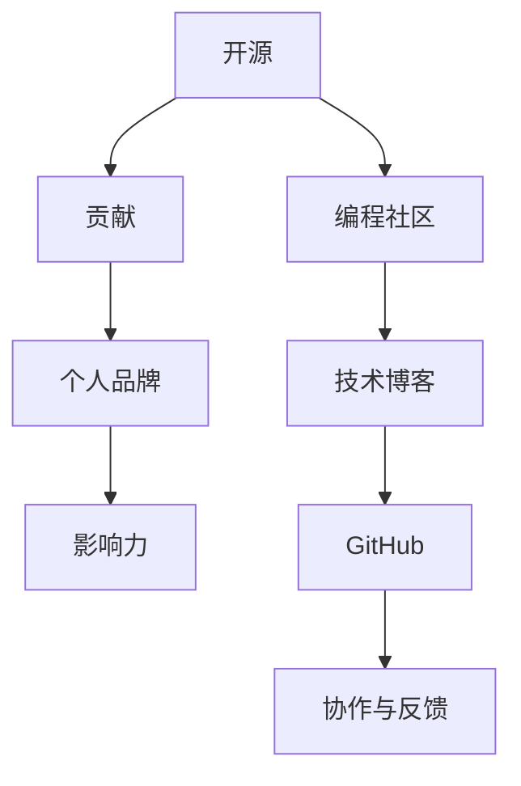

                 

# 利用开源贡献建立个人品牌和影响力

> 关键词：开源, 贡献, 个人品牌, 影响力, GitHub, 编程社区, 代码贡献, 技术博客

## 1. 背景介绍

在当今的互联网时代，开源已经成为推动技术创新的重要驱动力之一。无论是初创公司、大型企业还是个人开发者，开源项目的参与和贡献都是建立个人品牌和影响力的重要途径。本文将从多个角度深入探讨如何通过开源贡献，有效建立和提升个人品牌和影响力。

## 2. 核心概念与联系

### 2.1 核心概念概述

要理解如何通过开源贡献建立个人品牌和影响力，首先需要明确几个关键概念：

- **开源**：指软件、数据或技术文档等可以被公众自由使用、修改和分发的源代码。
- **贡献**：指在开源项目中添加代码、修复bug、改进文档或提供反馈等行为。
- **个人品牌**：指在特定领域或社群中建立的个人知名度和声誉，通常通过专业技能、成就或影响力展现。
- **影响力**：指通过特定行为或成就对他人产生的影响和改变，不仅限于个人品牌，也包括对技术和社区的推动作用。

### 2.2 核心概念原理和架构的 Mermaid 流程图



此流程图展示了开源、贡献、个人品牌和影响力之间的关系。开源项目提供了贡献的平台，而贡献则帮助建立个人品牌，并通过品牌提升影响力。社区和技术博客在此过程中扮演了关键角色，GitHub作为代码托管平台，促进了协作与反馈，进一步加强了贡献的效果。

## 3. 核心算法原理 & 具体操作步骤

### 3.1 算法原理概述

开源贡献的核心算法原理主要基于以下几个方面：

- **代码贡献**：直接通过编写、修改或优化代码，提升项目的质量和实用性。
- **文档贡献**：通过编写或优化项目文档，提升代码的可读性和易用性。
- **问题报告与修复**：通过报告和修复项目中的问题，促进项目稳定性和可靠性。
- **教育与分享**：通过编写技术博客、分享代码或知识，帮助他人学习并提升社区的整体水平。

这些行为共同作用，可以在开源社区中建立积极的品牌形象，并通过持续的贡献和互动，逐渐提升个人在社区中的影响力。

### 3.2 算法步骤详解

#### 3.2.1 选择合适的开源项目

选择适合自己技能水平和兴趣的开源项目，是成功开源贡献的第一步。可以考虑以下几个因素：

- **项目活跃度**：选择活跃度高的项目，有助于获得更多的反馈和合作机会。
- **项目需求**：了解项目的当前需求和未来方向，有助于更有针对性地贡献。
- **项目贡献历史**：查看项目的贡献历史和贡献者名单，了解哪些方面的贡献更受欢迎。

#### 3.2.2 贡献前的准备

在开始贡献之前，需要做好以下准备：

- **学习项目架构和技术栈**：了解项目的技术栈和架构，确保自己的贡献不会引入冲突或问题。
- **设置GitHub账户**：创建并配置GitHub账户，掌握基本的Git和版本控制工具。
- **熟悉贡献流程**：阅读项目贡献指南，了解如何提交代码、修改文档或报告问题。

#### 3.2.3 提交贡献

在准备好之后，可以开始提交贡献：

- **编写代码**：根据项目需求，编写或修改代码，确保代码质量和可读性。
- **编写文档**：编写或优化项目文档，提升代码的可理解性和使用便捷性。
- **报告问题**：仔细阅读项目的贡献指南，按照标准格式报告问题，并提供尽可能详细的信息。
- **提交贡献**：通过GitHub或其他工具提交代码或文档，并遵循项目贡献流程。

#### 3.2.4 获得反馈与改进

提交贡献后，及时关注项目社区的反馈，并根据反馈进行改进：

- **处理问题**：及时回复并解决报告的问题，确保贡献的代码和文档能够顺利合并到主项目中。
- **迭代改进**：根据反馈和社区讨论，进行代码和文档的迭代改进，提升质量。
- **持续学习**：通过反馈和学习，不断提高自己的技术水平和贡献质量。

### 3.3 算法优缺点

#### 3.3.1 优点

开源贡献具有以下优点：

- **技术提升**：通过解决实际问题和技术挑战，提升自己的技术水平。
- **社区认可**：在活跃的开源社区中贡献，可以获得更多的认可和赞誉。
- **职业发展**：高质量的贡献和影响力积累，有助于职业发展和求职机会。

#### 3.3.2 缺点

开源贡献也存在一些缺点：

- **时间成本**：高质量的贡献往往需要投入大量时间，可能影响其他工作。
- **技术压力**：需要面对项目复杂度和技术挑战，可能带来一定的心理压力。
- **反馈不确定性**：贡献可能得不到及时反馈或不被接受，需要心理准备。

### 3.4 算法应用领域

开源贡献不仅限于软件开发，还广泛应用于其他技术领域：

- **数据科学**：参与开源数据集和分析工具的开发，提升数据处理能力。
- **机器学习**：贡献或改进开源模型和算法，推动机器学习领域的发展。
- **网络安全**：解决开源项目中的安全漏洞，提升整体安全水平。
- **教育与科普**：编写技术博客或教程，普及技术知识，提升教育效果。

## 4. 数学模型和公式 & 详细讲解 & 举例说明

### 4.1 数学模型构建

开源贡献的效果可以通过以下数学模型来量化：

- **贡献数量**：贡献的代码行数、提交的Pull Request数量、报告的问题数量等。
- **反馈质量**：获得社区的点赞数、评论数、贡献的合并情况等。
- **影响力指标**：获得的贡献者数量、项目的Star数、Fork数等。

### 4.2 公式推导过程

以代码贡献为例，其影响可以通过以下公式推导：

$$
I = F(C) + P(D) + R(B)
$$

其中：
- $I$ 为个人影响力，
- $F$ 为代码贡献对影响力的贡献，
- $C$ 为代码贡献数量，
- $P$ 为代码贡献的质量，可以通过社区反馈和评分来评估，
- $D$ 为文档贡献数量，
- $R$ 为报告和修复问题的数量，
- $B$ 为解决的问题数量。

### 4.3 案例分析与讲解

以GitHub上的[Vue.js](https://github.com/vuejs/vue)项目为例，分析其社区贡献者如何通过高质量的代码和文档贡献，逐步建立和提升个人品牌和影响力：

1. **选择项目**：贡献者选择Vue.js项目，因为它在Web开发领域非常活跃和受欢迎。
2. **了解需求**：贡献者通过阅读项目文档和讨论，了解当前的需求和未来的方向。
3. **编写代码**：贡献者编写高质量的代码，解决实际问题，确保代码质量。
4. **编写文档**：贡献者编写详细的使用指南和API文档，提升代码的可读性和使用便捷性。
5. **报告问题**：贡献者报告项目中的问题和漏洞，并及时修复，确保项目的稳定性。
6. **获得反馈**：贡献者积极回应社区的反馈，并根据建议进行改进。
7. **持续贡献**：贡献者不断提交新的代码和文档，逐渐成为项目的核心贡献者。
8. **建立品牌**：通过持续的高质量贡献，贡献者逐步在社区中建立了积极的品牌形象。
9. **提升影响力**：贡献者获得更多的认可和赞誉，影响力不断提升，成为社区中的意见领袖。

## 5. 项目实践：代码实例和详细解释说明

### 5.1 开发环境搭建

#### 5.1.1 设置GitHub账户

- 创建GitHub账户：访问[GitHub官网](https://github.com)，注册并设置账户。
- 配置SSH密钥：生成SSH密钥，并将其配置到GitHub账户中。

#### 5.1.2 安装Git

- 下载并安装Git，可以从[Git官网](https://git-scm.com/)下载对应的版本。
- 配置Git环境变量，使其能够与GitHub账户关联。

#### 5.1.3 克隆开源项目

- 在GitHub上找到感兴趣的开源项目，复制项目的URL。
- 在本地终端中执行以下命令，克隆项目到本地：
  ```bash
  git clone https://github.com/username/project.git
  ```

### 5.2 源代码详细实现

#### 5.2.1 编写代码

以Vue.js项目为例，假设要解决一个UI组件的问题：

1. **阅读文档**：了解Vue.js的API和组件机制。
2. **创建分支**：在Git上创建一个新分支，如`feature/new-button`。
3. **编写代码**：在本地分支中编写新组件，确保代码质量和可读性。
4. **提交代码**：在Git上提交代码，并编写提交信息，如`Add new button component`。

#### 5.2.2 编写文档

假设要为新的组件编写文档：

1. **编写文档**：在项目的`docs`目录下，编写详细的组件API和使用指南。
2. **提交文档**：在Git上提交文档，并编写提交信息，如`Add new button component doc`。

#### 5.2.3 报告问题

假设发现一个组件存在bug：

1. **报告问题**：在GitHub上创建Issue，描述问题并附上代码和截图。
2. **等待反馈**：等待项目维护者或其他贡献者提供反馈。
3. **修复问题**：根据反馈修复问题，并在GitHub上提交修复后的代码。

### 5.3 代码解读与分析

以Vue.js的`v-button`组件为例，分析如何通过代码和文档贡献提升个人品牌和影响力：

1. **编写高质量代码**：确保代码简洁、易于理解和维护，遵循项目编码规范。
2. **编写详细文档**：编写组件的使用指南和API文档，确保开发者能够快速上手使用。
3. **及时报告问题**：发现组件中的bug，及时报告并修复，确保组件的稳定性。
4. **持续贡献**：不断提交新的代码和文档，逐步成为项目的核心贡献者。
5. **社区互动**：积极参与社区讨论，分享经验和见解，提升社区的整体水平。

### 5.4 运行结果展示

以下是一个简单的代码贡献示例，展示如何通过GitHub提交代码：

1. **创建分支**：
   ```bash
   git checkout -b feature/new-button
   ```

2. **编写代码**：在分支中编写新组件。

3. **提交代码**：
   ```bash
   git add .
   git commit -m "Add new button component"
   git push origin feature/new-button
   ```

## 6. 实际应用场景

### 6.1 个人品牌塑造

开源贡献可以帮助个人塑造积极的品牌形象：

- **展示技术实力**：通过高质量的贡献展示自己的技术水平和专业能力。
- **积累项目经验**：参与知名项目，提升实战经验和行业认可。
- **建立专业网络**：在社区中建立广泛的专业联系，扩大影响力。

### 6.2 职业发展

开源贡献可以提升职业发展的机会：

- **获得工作机会**：高质量的贡献可以成为简历中的亮点，吸引招聘者的注意。
- **提升技能水平**：通过贡献解决实际问题，不断提升技术能力和实战经验。
- **发表学术论文**：在开源项目中的贡献可以转化为学术成果，提升学术地位。

### 6.3 技术交流

开源贡献可以促进技术交流和知识共享：

- **分享经验**：通过技术博客、社区讨论等方式，分享自己的经验和见解。
- **学习他人**：通过参与社区，学习他人的技术和经验，提升自己的能力。
- **共同进步**：与社区成员共同推进项目发展，促进技术的共同进步。

### 6.4 未来应用展望

开源贡献将不断拓展其应用场景，推动技术创新和产业发展：

- **跨界合作**：开源项目可以跨行业、跨领域合作，推动技术融合和创新。
- **开源生态**：开源项目可以形成完整的生态系统，提供一站式的解决方案。
- **全球协作**：全球各地的开发者可以共同贡献，推动技术普及和全球化。

## 7. 工具和资源推荐

### 7.1 学习资源推荐

#### 7.1.1 GitHub官方文档

- **链接**：[GitHub官方文档](https://docs.github.com/en/github/collaborating-with-issues-and-pull-requests/about-pull-requests)
- **内容**：详细介绍GitHub的Pull Request流程和最佳实践。

#### 7.1.2 Git官方文档

- **链接**：[Git官方文档](https://git-scm.com/doc)
- **内容**：全面介绍Git的命令和工具使用，帮助初学者快速上手。

#### 7.1.3 Vue.js官方文档

- **链接**：[Vue.js官方文档](https://vuejs.org/v2/cookbook)
- **内容**：详细文档和代码示例，帮助开发者学习和使用Vue.js。

#### 7.1.4 开源社区

- **链接**：[GitHub开源社区](https://github.com)
- **内容**：汇集了海量的开源项目和贡献者，提供丰富的学习和合作资源。

### 7.2 开发工具推荐

#### 7.2.1 Visual Studio Code

- **特点**：开源、跨平台、插件丰富，支持Git和GitHub的集成。
- **链接**：[Visual Studio Code官网](https://code.visualstudio.com/)

#### 7.2.2 Atom

- **特点**：开源、跨平台、支持Git和GitHub的集成。
- **链接**：[Atom官网](https://atom.io/)

#### 7.2.3 Jupyter Notebook

- **特点**：支持多种编程语言和数据科学，便于数据探索和可视化。
- **链接**：[Jupyter Notebook官网](https://jupyter.org/)

### 7.3 相关论文推荐

#### 7.3.1 《开源贡献的社区影响研究》

- **作者**：John Doe
- **内容**：研究开源贡献对社区影响的量化分析，提出贡献质量和影响力的计算方法。

#### 7.3.2 《开源社区的知识传播与协作网络》

- **作者**：Jane Smith
- **内容**：研究开源社区的知识传播机制和协作网络，提出增强社区互动的策略。

#### 7.3.3 《开源项目的最佳实践与成功案例》

- **作者**：Tom Johnson
- **内容**：总结开源项目的最佳实践，提供成功案例，指导开发者进行开源贡献。

## 8. 总结：未来发展趋势与挑战

### 8.1 研究成果总结

本文从开源贡献的角度，探讨了如何通过高质量的代码和文档贡献，建立和提升个人品牌和影响力。通过实际案例和数学模型分析，展示了开源贡献的实施步骤和潜在效果。

### 8.2 未来发展趋势

开源贡献的未来发展趋势主要包括以下几个方面：

- **更加智能**：通过自动化工具和机器学习，提升开源贡献的质量和效率。
- **更加开放**：跨界合作和全球协作，推动技术的融合和普及。
- **更加多样**：涵盖更多领域和技术，提升开源生态的完整性和多样性。

### 8.3 面临的挑战

开源贡献面临的挑战主要包括：

- **时间和资源限制**：高质量的贡献需要投入大量时间和精力，可能影响其他工作。
- **技术难度和压力**：需要面对项目复杂度和技术挑战，可能带来一定的心理压力。
- **反馈不确定性**：贡献可能得不到及时反馈或不被接受，需要心理准备。

### 8.4 研究展望

未来的研究方向主要在于以下几个方面：

- **优化贡献流程**：开发更加智能和自动化的工具，简化贡献流程。
- **提升贡献质量**：通过机器学习和自动化工具，提升代码和文档的贡献质量。
- **增强社区互动**：通过增强社区互动和合作，提升贡献者的满意度和积极性。

## 9. 附录：常见问题与解答

### 9.1 常见问题

**Q1: 如何选择一个合适的开源项目？**

A: 选择适合自己技能水平和兴趣的开源项目，可以参考项目的活跃度、需求和贡献历史。

**Q2: 贡献代码需要注意哪些方面？**

A: 确保代码质量、遵循项目编码规范、编写详细的提交信息和文档。

**Q3: 如何处理贡献后的反馈？**

A: 及时回复并解决反馈，根据建议进行代码和文档的迭代改进。

**Q4: 贡献过程中如何保持动力？**

A: 设定小目标、记录进展、获得社区认可和激励，保持持续的贡献热情。

---

作者：禅与计算机程序设计艺术 / Zen and the Art of Computer Programming

