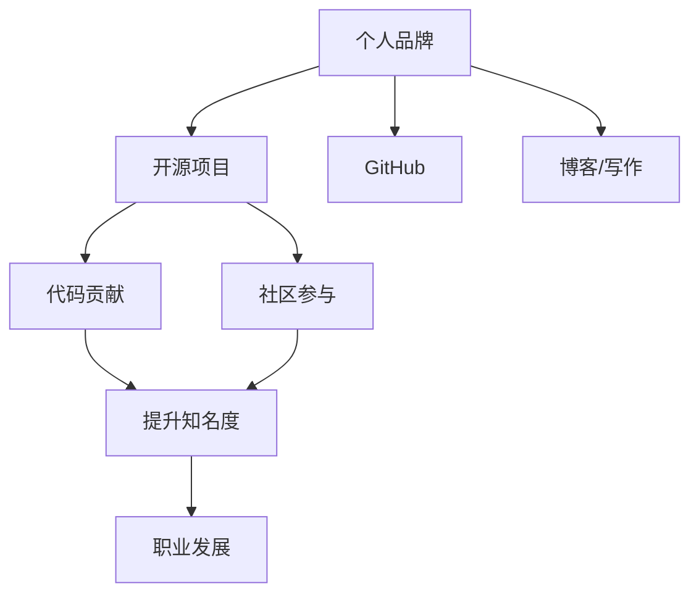

                 

# 利用开源项目打造个人品牌

## 1. 背景介绍

### 1.1 问题由来

在今天这个信息爆炸的时代，技术人才如何脱颖而出，如何在千千万万程序员中赢得更多关注和认可，已经成为了一个值得探讨的问题。相比于传统的发表论文、申请专利等方式，开源项目提供了一种更为直接、互动的展示平台。

过去，开源项目往往被视为企业级软件开发者的专利。但随着开源文化的普及和技术社区的发展，越来越多的个人开发者也通过开源项目展示自己的技术能力，甚至成功建立起个人品牌。

### 1.2 问题核心关键点

本文旨在探讨如何通过开源项目打造个人品牌。我们将重点分析以下几个关键点：

- 开源项目对个人品牌的提升作用。
- 选择合适的开源项目类型。
- 如何通过开源项目展示技术能力。
- 维护和更新开源项目的技巧。
- 利用开源项目进行职业发展的策略。

通过深入探讨这些关键点，我们可以更好地理解如何利用开源项目来塑造和提升个人品牌。

### 1.3 问题研究意义

个人品牌建设不仅对技术开发者自身发展有着深远影响，还对整个科技社区的生态繁荣有着积极意义。成功的开源项目和个人品牌可以激励更多开发者贡献代码，促进社区知识的积累和传播。

对于个人开发者而言，通过开源项目展示技术成果，不仅能提升知名度和影响力，还能带来实际的职业发展机会，如演讲邀请、工作机会等。

## 2. 核心概念与联系

### 2.1 核心概念概述

要利用开源项目打造个人品牌，首先需要理解以下核心概念：

- **开源项目(Open Source Project)**：由开发者自由发布、公开源码的软件项目。开源项目鼓励社区成员共同开发、改进，促进知识的共享和创新。
- **个人品牌(Personal Brand)**：指个人在专业领域中的形象和声誉。在技术领域，个人品牌通常通过技术贡献、创新能力、社区影响力等方式体现。
- **GitHub**：全球最大的开源平台之一，支持代码托管、版本控制、问题跟踪、协作开发等。GitHub是展示和参与开源项目的主要平台。
- **代码贡献(Code Contribution)**：指开发者在开源项目中提交代码、修复Bug、改进功能等行为，是展示技术能力的重要途径。
- **社区参与(Community Engagement)**：指在开源项目中参与讨论、解决问题、发布博文等，可以提升个人在项目中的影响力和知名度。
- **博客/写作(Blogging/ Writing)**：通过撰写技术文章、分享项目经验等方式，展示技术思考和深度理解，也是建立个人品牌的重要手段。

### 2.2 核心概念原理和架构的 Mermaid 流程图



这个流程图展示了个人品牌与开源项目之间的逻辑关系：

1. 个人品牌通过开源项目得以提升。
2. GitHub是开源项目的主要平台，是展示和参与开源项目的主要渠道。
3. 代码贡献和社区参与是提升个人品牌的关键行为。
4. 代码贡献和社区参与会提升个人在开源项目中的知名度。
5. 知名度和专业能力又会带来职业发展的机会。

## 3. 核心算法原理 & 具体操作步骤

### 3.1 算法原理概述

利用开源项目打造个人品牌，本质上是一个动态反馈和迭代的提升过程。核心算法原理包括以下几个方面：

- **选择合适项目**：根据自身兴趣、技术专长选择适合的开源项目。
- **贡献优质代码**：在项目中提交高质量、高价值的代码，吸引社区关注。
- **积极参与讨论**：在项目中积极回答问题、解决Bug，提升社区影响力和个人知名度。
- **持续更新项目**：通过不断更新项目内容，保持代码质量，提升项目的影响力。
- **撰写技术文章**：在博客、社交媒体上分享项目经验和技术见解，建立专业权威形象。

### 3.2 算法步骤详解

以下是利用开源项目打造个人品牌的具体操作步骤：

**Step 1: 选择合适的开源项目**

- 确定技术领域和兴趣方向，选择与自己职业规划相符的开源项目。
- 参考项目的活跃度、贡献者数量、项目贡献指南等，选择质量较高、活跃度高的项目。
- 关注项目的GitHub页面，了解项目的背景、目标、贡献要求等。

**Step 2: 加入项目并开始贡献**

- 创建GitHub账户，关注感兴趣的项目，并在项目中提交Pull Request(PR)。
- 遵循项目的贡献指南，提交高质量代码，确保代码规范、无Bug。
- 定期查看项目的Issue追踪，寻找可以解决的问题，并主动修复。

**Step 3: 积极参与社区讨论**

- 在项目的Discussion板中积极回答问题，提供技术支持。
- 参与项目的会议、Workshop等活动，面对面交流，建立良好的人际关系。
- 关注项目的社交媒体账号，及时了解项目动态，并参与相关讨论。

**Step 4: 撰写技术文章**

- 在博客或技术社区（如Medium、Stack Overflow等）撰写技术文章，分享项目经验、技术思考。
- 引用开源项目的案例，讨论技术方案、性能优化等，展示技术深度。
- 在文章中嵌入GitHub链接，引导读者访问项目页面，提升项目的曝光度。

**Step 5: 持续更新项目**

- 定期更新项目的文档、代码、测试用例等内容，保持项目活跃。
- 收集用户反馈，改进项目功能，提升用户体验。
- 推动项目的创新发展，探索新的技术方案，吸引更多贡献者。

### 3.3 算法优缺点

利用开源项目打造个人品牌具有以下优点：

- **展示技术能力**：通过代码贡献和问题解决，展示技术实力和创新能力。
- **提升知名度**：活跃于开源社区，参与讨论和贡献，提升个人在技术界的知名度。
- **建立网络**：与项目贡献者、社区成员建立良好的人脉关系，开拓职业发展机会。
- **积累经验**：通过参与实际项目，积累丰富的开发经验和技术视角。

然而，利用开源项目打造个人品牌也存在一些缺点：

- **时间成本高**：开源项目往往需要投入大量时间，可能会影响工作和学习进度。
- **项目选择难**：选择合适的项目需要深入研究和判断，可能会遇到方向错误的困境。
- **社区文化差异**：不同社区的规范和文化可能有所不同，需要时间适应和磨合。
- **个人投入需平衡**：需要在开源项目和个人职业发展之间找到平衡，避免过度倾斜。

### 3.4 算法应用领域

利用开源项目打造个人品牌的应用领域非常广泛，适用于技术开发者、项目管理者、技术博主等各类人群。无论是在传统软件、大数据、人工智能等领域，还是在Web开发、移动应用、游戏开发等特定领域，开源项目都能为个人品牌的提升提供有力支持。

## 4. 数学模型和公式 & 详细讲解 & 举例说明

### 4.1 数学模型构建

本节我们将利用数学模型来分析个人品牌提升的数学表达和计算。

设 $B$ 为个人品牌指数，$C$ 为贡献指数，$P$ 为参与指数，$A$ 为文章指数，则个人品牌指数 $B$ 可以表示为：

$$
B = \alpha C + \beta P + \gamma A
$$

其中 $\alpha$、$\beta$、$\gamma$ 为权重系数，表示不同行为的贡献度。

### 4.2 公式推导过程

1. **代码贡献贡献度**：假设每条代码贡献的平均价值为 $V_C$，总贡献次数为 $N_C$，则：

$$
C = V_C \times N_C
$$

2. **社区参与贡献度**：假设每次参与的平均价值为 $V_P$，总参与次数为 $N_P$，则：

$$
P = V_P \times N_P
$$

3. **博客文章贡献度**：假设每篇文章的平均价值为 $V_A$，总文章数为 $N_A$，则：

$$
A = V_A \times N_A
$$

### 4.3 案例分析与讲解

以下是一个具体的案例分析：

假设某开发者小王选择加入一个活跃的Web应用项目。小王每月提交5次代码，每次贡献的平均价值为10，共计贡献50次。小王每月在项目Issue板中回答15个问题，每次回答的平均价值为5。小王每月撰写两篇技术文章，每篇文章的平均价值为20，共计撰写4篇。

代入上述公式计算个人品牌指数 $B$：

$$
B = 10 \times 5 + 5 \times 15 + 20 \times 4 = 200
$$

其中，$\alpha = 10, \beta = 5, \gamma = 20$。

## 5. 项目实践：代码实例和详细解释说明

### 5.1 开发环境搭建

要参与开源项目，首先需要搭建开发环境。以下是具体步骤：

1. 安装Git：在Linux和macOS系统，可以通过命令 `brew install git` 安装；在Windows系统，可以从[Git官网](https://git-scm.com/download/)下载安装。

2. 配置GitHub账户：访问[GitHub官网](https://github.com/)，注册并登录GitHub账户。

3. 安装GitHub Desktop：可以从[GitHub官网](https://desktop.github.com/)下载安装GitHub Desktop，方便在本地进行操作。

### 5.2 源代码详细实现

以一个简单的开源项目为例，展示如何参与贡献。该项目基于Python的Flask框架，实现一个简单的博客应用。

首先，克隆项目代码：

```bash
git clone https://github.com/example-project/blog.git
cd blog
```

其次，安装依赖包：

```bash
pip install -r requirements.txt
```

然后，贡献代码：

假设要添加新的评论功能，可以编写如下代码：

```python
# blog/models.py

class Comment(models.Model):
    user = models.ForeignKey(User, on_delete=models.CASCADE)
    content = models.TextField()
    blog = models.ForeignKey(Blog, related_name='comments', on_delete=models.CASCADE)
    created_at = models.DateTimeField(auto_now_add=True)

    def __str__(self):
        return self.content[:20] + '...'
```

在本地进行测试，确保代码无误后，提交PR：

```bash
git add .
git commit -m "Add Comment model"
git push origin main
```

最后，创建PR并等待审核：

```bash
git push origin pull/xxx/main
```

### 5.3 代码解读与分析

**代码贡献流程解读**：

1. 克隆项目代码，进入项目目录。
2. 安装项目依赖包，确保项目运行环境正常。
3. 编写代码，实现新功能，并进行本地测试。
4. 提交代码到本地仓库，并进行本地提交。
5. 推送代码到远程仓库，创建PR。
6. 等待项目维护者审核PR，合并代码。

## 6. 实际应用场景

### 6.1 企业技术博客

企业技术博客是展示公司技术能力和项目成果的重要平台。通过利用开源项目，企业可以鼓励内部技术团队积极参与，提升整体技术水平。

企业可以通过GitHub Page或GitHub Wiki等形式，展示项目文档和技术文章。员工可以将参与开源项目的经验和代码贡献写入博客，提升个人和企业品牌。

### 6.2 开源社区贡献

开源社区是技术开发者交流和合作的主要场所。通过积极参与开源项目，开发者可以在社区中建立良好的人际关系，提升自身影响力。

例如，Google开源了TensorFlow、Kubernetes等项目，吸引了全球众多开发者参与贡献，形成了一个庞大、活跃的开源社区。开发者可以通过参与这些项目，展示技术能力和行业贡献。

### 6.3 个人技术博客

个人技术博客是展示技术深度和思考的重要途径。通过撰写技术文章，开发者可以建立专业权威的形象，吸引更多读者关注。

例如，乌云安全团队的首席工程师乌云叔（Yubo Liu），通过开源项目和博客文章，建立了在国内安全领域极高的知名度和影响力。

### 6.4 未来应用展望

未来，开源项目和个人品牌的融合将更加紧密。随着开源文化的进一步普及，利用开源项目提升个人品牌的技术路径也将更加丰富和多样化。

- **跨平台协作**：开源项目将更加注重跨平台协作，利用GitHub Actions、CircleCI等工具，实现自动化部署和持续集成，提升项目效率。
- **生态系统建设**：开源项目将更加注重生态系统的建设，通过开放API、构建插件等方式，吸引更多开发者参与，提升项目价值。
- **社区治理**：开源项目的社区治理将更加规范和透明，通过社区投票、项目管理委员会等机制，提升项目决策效率。

## 7. 工具和资源推荐

### 7.1 学习资源推荐

要利用开源项目提升个人品牌，需要掌握以下几个方面的知识：

1. **开源项目参与指南**：学习GitHub使用，掌握PR流程、Code Review、Issue跟踪等基本操作。
2. **代码贡献技巧**：学习代码质量评估、版本控制、代码重构等技术。
3. **社区管理技巧**：学习社区沟通、项目管理、版本管理等技能。
4. **技术写作指南**：学习博客写作、文档编写、技术文章排版等技能。

以下是一些学习资源的推荐：

- **GitHub官方文档**：[GitHub官方文档](https://docs.github.com/en/)提供了全面的GitHub使用指南和API文档。
- **Github Camp**：[Github Camp](https://github.com/blog/7841)提供了大量社区活动和学习资源。
- **Codecademy**：[Codecademy](https://www.codecademy.com/)提供了丰富的编程和Git学习课程。
- **Markdown指南**：[Markdown指南](https://www.mdnice.com)提供了Markdown语法和排版技巧。
- **开源社区博客**：如[博客园](https://cnblogs.com)、[CSDN](https://blog.csdn.net)等平台上有大量开源项目和社区分享的博客文章。

### 7.2 开发工具推荐

以下是一些常用的开源项目开发工具：

1. **GitHub Desktop**：GitHub官方提供的桌面工具，方便进行本地仓库管理和代码提交。
2. **GitHub Actions**：GitHub提供的CI/CD服务，可以自动化构建、测试、部署开源项目。
3. **Visual Studio Code**：一款流行的代码编辑器，支持多种编程语言和Git集成。
4. **Atom**：另一个流行的代码编辑器，支持丰富的插件和主题。
5. **Code Review工具**：如GitHub的Pull Request Review、Gerrit等，方便进行代码评审和讨论。

### 7.3 相关论文推荐

以下是一些与开源项目和社区合作相关的经典论文：

1. **The GitHub Repository：A Platform for Serving, Building, Sharing, and Storing Software**：[论文链接](https://arxiv.org/abs/1809.02133)，介绍了GitHub平台的实现和功能。
2. **Social Influence in Software Development**：[论文链接](https://dl.acm.org/doi/10.1145/2677384.2677389)，研究了社区互动对软件开发的影响。
3. **A Study of the Dynamics of Software Projects on GitHub**：[论文链接](https://www.mdpi.com/1969-7439/6/9/166)，研究了开源项目的生命周期和贡献者行为。

## 8. 总结：未来发展趋势与挑战

### 8.1 研究成果总结

本文详细探讨了利用开源项目打造个人品牌的方法和步骤。主要成果包括：

- **理论模型**：构建了个人品牌提升的数学模型，并通过案例分析展示了其计算过程。
- **操作步骤**：详细说明了开源项目参与的各个环节，包括项目选择、代码贡献、社区参与、撰写博客等。
- **工具和资源**：推荐了开源项目开发和社区管理的各类工具和资源。

### 8.2 未来发展趋势

开源项目和个人品牌的发展趋势如下：

1. **社区生态完善**：开源社区将更加注重生态系统的建设，通过开放的API和插件生态，吸引更多开发者参与。
2. **跨平台协作**：开源项目将利用GitHub Actions等工具，实现跨平台协作和持续集成，提升项目效率。
3. **开放合作**：开源项目将更加开放，鼓励跨公司和跨国的合作，推动全球技术社区的协同发展。
4. **知识共享**：开源项目将更加注重知识的共享和传播，通过社区博客、技术文章等方式，提升技术传播效率。
5. **技术融合**：开源项目将与其他AI、大数据、区块链等技术深度融合，推动技术创新和应用落地。

### 8.3 面临的挑战

利用开源项目打造个人品牌的过程中，还面临一些挑战：

1. **时间管理**：开源项目需要投入大量时间，可能会影响工作和学习进度。
2. **项目选择**：选择合适的项目需要深入研究和判断，可能会遇到方向错误的困境。
3. **社区文化**：不同社区的规范和文化可能有所不同，需要时间适应和磨合。
4. **个人投入需平衡**：需要在开源项目和个人职业发展之间找到平衡，避免过度倾斜。

### 8.4 研究展望

未来的研究应关注以下几个方向：

1. **跨领域融合**：如何将开源项目与AI、大数据、区块链等技术深度融合，推动技术创新和应用落地。
2. **持续学习**：如何通过开源项目不断学习和提升技术能力，保持持续的创新和进步。
3. **知识传播**：如何通过开源项目和社区活动，高效传播技术知识和经验，提升整体技术水平。
4. **社区治理**：如何建立规范透明的开源社区治理机制，提升项目决策效率和社区参与度。

## 9. 附录：常见问题与解答

### Q1: 开源项目和个人品牌之间有什么关系？

A: 开源项目为个人品牌提供了一个展示技术能力、积累影响力的平台。通过参与开源项目，开发者可以展示自己的代码贡献、社区参与和技术文章，提升知名度和影响力。

### Q2: 如何选择合适的开源项目？

A: 选择适合自己的开源项目需要考虑以下因素：
1. 技术领域：选择与自己技术专长和职业规划相符的项目。
2. 项目活跃度：选择活跃度高、贡献者数量多的项目。
3. 贡献指南：查看项目的贡献指南，确保自己可以顺利参与贡献。

### Q3: 如何高效利用开源项目提升个人品牌？

A: 高效的利用开源项目提升个人品牌需要以下几点：
1. 选择合适的项目并积极参与。
2. 提交高质量的代码和问题解决方案。
3. 积极参与社区讨论和活动。
4. 撰写技术文章分享经验和见解。
5. 持续更新项目内容，保持项目活跃。

### Q4: 开源项目和博客文章如何结合？

A: 开源项目和博客文章的结合可以通过以下方式：
1. 在博客文章中引用开源项目案例，讨论技术方案和性能优化。
2. 将开源项目的贡献和经验写入博客文章，展示技术深度和影响力。
3. 在文章中嵌入开源项目的GitHub链接，引导读者访问项目页面。

### Q5: 开源项目和社区参与有哪些技巧？

A: 开源项目和社区参与的技巧包括：
1. 遵循项目贡献指南，确保代码质量。
2. 积极参与讨论，回答问题和解决问题。
3. 利用GitHub Actions等工具，提升项目效率。
4. 关注项目社交媒体账号，及时了解项目动态。
5. 利用社区投票等机制，提升项目决策效率。

通过以上分析和建议，相信你能够更好地理解如何利用开源项目打造个人品牌，提升自身在技术界的知名度和影响力。

---

作者：禅与计算机程序设计艺术 / Zen and the Art of Computer Programming

