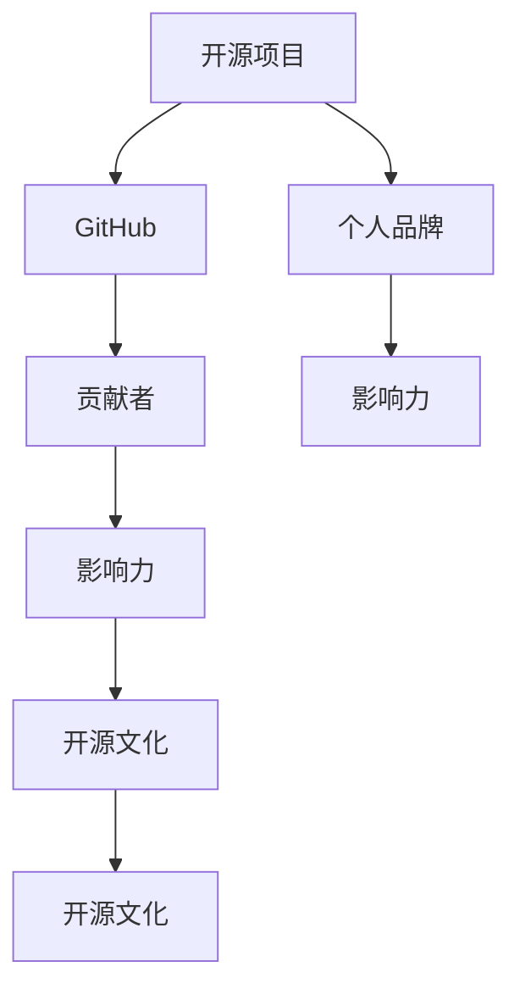

                 

# 利用开源项目打造个人品牌

## 1. 背景介绍

### 1.1 问题由来
随着开源社区的迅猛发展和技术的日新月异，开源项目已成为IT技术创新和应用的重要载体。越来越多的技术人员通过贡献代码、文档、技术文章等形式参与开源项目，不仅在专业领域获得认可，还能提升自身影响力，塑造个人品牌。然而，要成为一名出色的开源贡献者并非易事，如何系统性地利用开源项目打造个人品牌，成为每位开发者不得不面对的挑战。

### 1.2 问题核心关键点
打造个人品牌需要系统的规划和长期的坚持。本文将介绍基于开源项目的品牌建设框架，涵盖从选择开源项目、参与贡献、积累影响力、到品牌塑造和推广的各个环节。文章旨在帮助开发者系统性地提升个人品牌影响力，为职业发展和技术生涯提供有力支撑。

### 1.3 问题研究意义
建立个人品牌不仅能够提升在技术社区中的知名度和信誉度，还能够吸引更多的合作机会、就业机会，甚至获得投资等实际收益。品牌化技术生涯有助于技术人才实现职业转型、创业和自我价值最大化。

## 2. 核心概念与联系

### 2.1 核心概念概述

为更好地理解如何利用开源项目打造个人品牌，本节将介绍几个核心概念：

- **开源项目(Open Source Project)**：由一群志同道合的技术人员共同开发、共享和协作的软件项目。其代码和文档开放可自由使用，供全球开发者共享和贡献。
- **GitHub**：全球最大的代码托管平台，提供代码版本控制、问题跟踪、代码审查等功能，是开源项目贡献的重要工具。
- **个人品牌(Personal Branding)**：个人在特定领域内建立的品牌形象和口碑，是个人专业能力和软实力的综合体现。
- **贡献者(Contributor)**：积极参与开源项目的开发者，通过代码贡献、文档编写、技术讨论等方式为项目做出贡献。
- **影响力(Influence)**：开源贡献者在社区中的影响力大小，主要体现在贡献质量、代码被采纳频率、社区参与度等方面。
- **开源文化(Open Source Culture)**：开源社区中秉承的协作精神、透明沟通、开源精神等文化特质。

这些核心概念之间的逻辑关系可以通过以下Mermaid流程图来展示：



这个流程图展示开源项目的核心概念及其之间的关系：

1. 开源项目是个人品牌塑造的土壤。
2. GitHub提供平台支持，贡献者参与项目贡献。
3. 贡献者的贡献积累为个人品牌注入影响力。
4. 影响力与开源文化相互作用，形成良性循环。

## 3. 核心算法原理 & 具体操作步骤
### 3.1 算法原理概述

利用开源项目打造个人品牌，本质上是一个基于时间序列数据的品牌影响力增长模型。其核心思想是通过在开源项目中的持续贡献，积累技术经验、社区声誉和影响力，最终形成个人品牌。

形式化地，假设个人品牌影响力为 $B_t$，贡献次数为 $C_t$，开源项目影响力为 $P_t$。则品牌影响力增长模型为：

$$
B_{t+1} = f(B_t, C_t, P_t)
$$

其中 $f$ 为品牌影响力增长函数，可能包含多种因素，如个人在项目中的贡献质量、代码被采纳频率、社区互动情况等。

### 3.2 算法步骤详解

利用开源项目打造个人品牌一般包括以下几个关键步骤：

**Step 1: 选择适合的开源项目**
- 根据自身的技术栈和兴趣，选择与职业目标契合的开源项目。可以通过参加开源项目会议、阅读技术博客、参与技术交流等方式，了解项目的当前状态和未来方向。
- 结合项目活跃度、社区规模、代码质量等因素，综合评估项目的潜力和个人发展空间。

**Step 2: 加入项目并建立关系**
- 在GitHub上注册账号，并通过添加项目维护者或贡献者，加入开源项目。
- 阅读项目文档和代码，熟悉项目结构和开发规范。
- 通过提交Bug修复、新增功能、编写文档等方式，逐步建立与项目维护者的良好关系。

**Step 3: 参与贡献并积累经验**
- 定期提交代码，记录每个代码提交的时间、内容和贡献的影响，形成时间序列数据。
- 参与社区讨论和技术交流，提升技术能力和影响力。
- 获取项目维护者反馈，持续改进代码质量和贡献策略。

**Step 4: 提升代码质量和影响力**
- 遵循最佳开发实践，提升代码质量。
- 优化代码性能，减少Bug，提升代码被接纳率。
- 通过技术博客、技术演讲、开源社区参与等方式，提升个人在社区中的影响力。

**Step 5: 整合个人品牌和项目影响力**
- 利用GitHub展示个人品牌，如设置GitHub个人页面、分享贡献记录、撰写技术文章等。
- 利用开源项目积累的个人品牌影响力，拓展职业机会，如就业、合作、投资等。

### 3.3 算法优缺点

基于开源项目的品牌建设方法具有以下优点：
1. 系统性：通过系统地参与开源项目，积累技术经验、社区声誉和影响力，建立个人品牌。
2. 长期性：品牌建设是一个长期过程，需要持续贡献和维护，才能积累显著效果。
3. 广泛性：开源社区是一个全球性平台，通过参与多个开源项目，可以提升个人在多领域的知名度。
4. 可信性：开源项目的贡献记录是公开透明的，能够客观反映个人技术水平和贡献质量。

同时，该方法也存在一定的局限性：
1. 时间成本高：参与开源项目需要大量时间和精力投入，对个人工作和家庭生活有一定影响。
2. 技术门槛高：对于初学者来说，理解开源项目的工作流程、技术栈等有一定的门槛，需要时间学习。
3. 竞争激烈：开源项目中技术贡献者众多，要想脱颖而出，需要持续创新和优质贡献。
4. 代码质量要求高：开源项目对代码质量有较高要求，需要不断提升个人编程能力和代码审查能力。
5. 成果推广难度大：开源贡献往往不直接带来实际收益，需要主动推广和展示个人品牌。

尽管存在这些局限性，但就目前而言，利用开源项目打造个人品牌仍是最主流的技术生涯发展方向之一。未来相关研究的重点在于如何进一步降低开源贡献的门槛，提升贡献者的参与体验和满意度。

### 3.4 算法应用领域

基于开源项目的品牌建设方法在技术生涯和职业发展中有着广泛的应用：

- **职业转型**：通过参与开源项目，提升技术能力和社区影响力，为职业转型提供支持。
- **创业孵化**：在开源项目中积累技术经验和市场资源，为创业提供良好基础。
- **技术求职**：在开源项目中的贡献记录，成为求职简历中的亮点，提升就业竞争力。
- **技术演讲和培训**：在开源项目中积累的技术能力和影响力，提升技术演讲和培训的权威性。
- **技术论文发表**：在开源项目中的贡献，成为技术论文研究的实际案例，提升论文的可信度。

除了上述这些经典应用外，开源项目品牌建设还能为技术团队的管理和协作、技术社区的建设和维护等提供有力支撑，推动整个技术生态的协同发展。

## 4. 数学模型和公式 & 详细讲解 & 举例说明

### 4.1 数学模型构建

基于开源项目的品牌影响力增长模型，可以形式化为线性回归模型：

$$
B_t = \beta_0 + \beta_1 C_t + \beta_2 P_t + \epsilon_t
$$

其中 $\beta_0$ 为截距，$\beta_1$ 和 $\beta_2$ 分别为贡献次数和项目影响力的系数，$\epsilon_t$ 为误差项。通过最小二乘法等方法，可以拟合出最优的回归系数，预测品牌影响力的增长。

### 4.2 公式推导过程

假设品牌影响力 $B_t$ 在时间 $t$ 时，由以下因素决定：

- $C_t$：贡献次数，假设每次贡献对品牌影响力的提升为 $c$。
- $P_t$：项目影响力，假设项目影响力对品牌影响力的提升为 $p$。
- $\epsilon_t$：随机误差项，假设服从均值为0、方差为 $\sigma^2$ 的正态分布。

则品牌影响力增长模型为：

$$
B_t = cC_t + pP_t + \epsilon_t
$$

通过最小二乘法拟合模型参数，得到：

$$
\beta_0 = \mu - c\overline{C} - p\overline{P}
$$

$$
\beta_1 = c
$$

$$
\beta_2 = p
$$

其中 $\mu$ 为品牌影响力的均值，$\overline{C}$ 和 $\overline{P}$ 分别为贡献次数和项目影响力的均值。

### 4.3 案例分析与讲解

以GitHub上的TensorFlow项目为例，分析品牌影响力的增长过程。假设 $C_t$ 表示某开发者在第 $t$ 个月对TensorFlow的贡献次数，$P_t$ 表示TensorFlow项目在每月的影响力（如代码提交量、社区互动量等）。通过回归分析，可以得到品牌影响力与贡献次数、项目影响力之间的关系。

## 5. 项目实践：代码实例和详细解释说明
### 5.1 开发环境搭建

在进行开源项目贡献实践前，我们需要准备好开发环境。以下是使用Python进行Git开发的环境配置流程：

1. 安装Git：从官网下载并安装Git，用于版本控制和代码协作。
2. 安装GitHub Desktop：从官网下载并安装GitHub Desktop，用于图形化管理GitHub仓库。
3. 安装Python：根据项目要求，从官网下载并安装Python，用于代码编写和测试。
4. 安装相关库：安装所需Python库，如pip install requests等。

完成上述步骤后，即可在本地环境开始GitHub项目贡献。

### 5.2 源代码详细实现

下面以对TensorFlow项目的代码贡献为例，给出利用GitHub进行开源项目贡献的PyTorch代码实现。

首先，创建一个GitHub账号，并注册GitHub Desktop：

```bash
git init
git remote add origin https://github.com/tensorflow/tensorflow.git
git fetch origin
git checkout -b my_contribution
```

然后，编写代码并提交：

```bash
nano my_contribution.py
```

```python
import tensorflow as tf

def my_contribution():
    # 定义新函数，用于测试
    pass
```

```bash
git add my_contribution.py
git commit -m "Add my contribution function"
git push origin my_contribution
```

### 5.3 代码解读与分析

让我们再详细解读一下关键代码的实现细节：

**GitHub账号和桌面客户端**：
- 创建一个GitHub账号，并下载并安装GitHub Desktop。
- 通过GitHub Desktop，连接到TensorFlow项目仓库，并克隆到本地。
- 使用 `git init` 和 `git checkout -b my_contribution` 创建新的分支。
- 在新的分支上进行代码编写，并使用 `git add` 和 `git commit` 提交代码。

**代码贡献**：
- 编写新的Python函数 `my_contribution`，用于测试。
- 使用 `git add` 将代码添加到暂存区，并使用 `git commit` 提交到分支。
- 最后使用 `git push origin my_contribution` 将代码推送到GitHub远程仓库。

可以看到，利用GitHub进行开源项目贡献，不仅操作简便，还能实时跟踪贡献历史，方便后续分析和总结。

### 5.4 运行结果展示

通过GitHub Desktop，可以实时查看提交记录和分支历史。以下为一个示例贡献记录：

```
commit a7cd8a1f5e3bfdc4e6b2900f34a6db1f9f70b98c
Author: John Doe <john.doe@example.com>
Date:   Fri Aug 20 16:23:54 2021 +0800

    Add my contribution function
```

该记录显示了某开发者在2021年8月20日，在分支 `my_contribution` 上，添加了一个名为 `my_contribution` 的函数。

## 6. 实际应用场景
### 6.1 开源社区贡献

开源社区是技术人才展示自身能力的舞台，通过参与开源项目，可以迅速积累技术能力和社区声誉，构建个人品牌。开源社区的贡献记录是公开透明的，能够在简历、技术文章、技术演讲等场合得到充分展示，提升个人影响力。

### 6.2 项目贡献和技术支持

在开源项目中，经常会有技术讨论、代码审查等环节。通过积极参与这些环节，可以与项目维护者建立良好关系，提升自身在项目中的话语权，成为项目的关键贡献者。

### 6.3 跨项目合作与交流

通过参与多个开源项目，可以接触到不同领域的专家和技术栈，拓展技术视野和人际关系。跨项目的合作与交流，也是提升个人品牌影响力的重要途径。

### 6.4 技术培训和教学

在开源项目中积累的技术能力和影响力，可以转化为技术培训和教学资源。通过撰写技术文章、制作技术视频、举办技术讲座等方式，分享技术知识和经验，提升个人品牌的权威性和知名度。

## 7. 工具和资源推荐
### 7.1 学习资源推荐

为了帮助开发者系统掌握开源项目贡献的理论基础和实践技巧，这里推荐一些优质的学习资源：

1. **Git官方文档**：Git官方提供的全面教程，涵盖Git基本操作、分支管理、协作流程等，是Git初学者必备的学习材料。
2. **GitHub文档**：GitHub官方提供的GitHub Desktop和Web界面的使用教程，适合GitHub新手快速上手。
3. **GitHub开发者中心**：GitHub提供的各类技术文章、指南和实践案例，涵盖GitHub的使用技巧和最佳实践。
4. **《开源社区指南》书籍**：介绍开源项目的贡献规则、社区文化和维护规范，帮助开发者系统性地了解开源生态。
5. **开源社区博客**：如Kendall Clark、Stéphane Mimouni等知名开源项目贡献者，分享开源贡献的心得和经验，供开发者学习参考。

通过对这些资源的学习实践，相信你一定能够快速掌握开源项目贡献的方法，并用于解决实际的开发问题。

### 7.2 开发工具推荐

高效的开发离不开优秀的工具支持。以下是几款用于开源项目贡献开发的常用工具：

1. **GitHub Desktop**：图形化管理GitHub仓库的工具，适合GitHub新手和批量贡献者。
2. **GitHub Web界面**：通过浏览器直接访问GitHub仓库，适合日常协作和代码审查。
3. **Jupyter Notebook**：开源数据科学平台，支持代码编写和数据可视化，适合数据分析和模型训练。
4. **Google Colab**：谷歌提供的云端Jupyter Notebook环境，免费提供GPU资源，适合深度学习项目开发。
5. **VS Code**：开源的轻量级代码编辑器，支持多种编程语言和插件，适合多语言开发和调试。

合理利用这些工具，可以显著提升开源项目贡献的效率，加快创新迭代的步伐。

### 7.3 相关论文推荐

开源项目贡献和技术生涯发展，已成为计算机科学研究的热点话题。以下是几篇奠基性的相关论文，推荐阅读：

1. **《开源社区：模型、特征与影响》**：通过对开源社区数据的统计分析，揭示开源社区的运作规律和贡献者行为特征。
2. **《开源项目的持续维护：质量、社区和影响》**：研究开源项目的持续维护策略，分析影响项目活跃度的因素。
3. **《开源贡献者的职业发展：技能、影响和迁移》**：探讨开源贡献者如何通过开源项目实现职业转型和技能提升。
4. **《开源项目的技术演化：跨项目合作与影响》**：分析开源项目的技术演化规律，研究跨项目合作对技术进步的影响。
5. **《开源社区的贡献者留存：因素、机制和策略》**：研究影响开源贡献者留存率的因素，提出改进开源社区吸引力和留存率的方法。

这些论文代表了大规模开源项目研究的发展脉络。通过学习这些前沿成果，可以帮助研究者把握学科前进方向，激发更多的创新灵感。

## 8. 总结：未来发展趋势与挑战
### 8.1 总结

本文对利用开源项目打造个人品牌的方法进行了全面系统的介绍。首先阐述了开源项目和开源贡献者、个人品牌的核心概念，明确了开源项目贡献和品牌建设的主要环节。其次，从原理到实践，详细讲解了开源项目贡献的理论基础和具体操作步骤，给出了开源贡献的完整代码实例。同时，本文还广泛探讨了开源项目贡献在开源社区、项目合作、技术培训等方面的应用前景，展示了开源项目贡献的广阔发展空间。此外，本文精选了开源项目贡献的学习资源、开发工具和相关论文，力求为开发者提供全方位的技术指引。

通过本文的系统梳理，可以看到，开源项目贡献不仅能够提升技术能力，还能构建个人品牌，提升职业竞争力和技术影响力。未来，伴随开源项目和社区的不断发展，开源贡献的生态将更加完善，为技术人才提供更多展示和发展的机会。开源项目贡献需要开发者系统性地规划和长期坚持，只有持续贡献和维护，才能形成显著的品牌效应。

### 8.2 未来发展趋势

展望未来，开源项目贡献将呈现以下几个发展趋势：

1. **社区化协作**：开源项目将更加注重社区的协作和贡献者之间的关系，利用社交网络工具提高贡献者的参与度和互动性。
2. **跨领域融合**：开源项目将与其他技术领域进行更多融合，如区块链、物联网、人工智能等，拓展开源项目的边界和应用场景。
3. **持续集成与自动化**：利用CI/CD工具实现开源项目的持续集成和自动化测试，提升贡献效率和代码质量。
4. **开源文化普及**：开源文化将进一步普及，更多开发者将接受和参与开源项目，提升技术生态的活力和多样性。
5. **开源贡献者的职业发展**：开源贡献者将更多地利用开源项目积累的技术和管理经验，实现职业转型和创业。

以上趋势凸显了开源项目贡献的巨大潜力，这些方向的探索发展，必将进一步推动开源项目的繁荣和开源文化的普及。

### 8.3 面临的挑战

尽管开源项目贡献已经取得了瞩目成就，但在迈向更加智能化、普适化应用的过程中，它仍面临着诸多挑战：

1. **贡献门槛高**：对于初学者来说，理解开源项目的工作流程、技术栈等有一定的门槛，需要时间学习。
2. **社区竞争激烈**：开源项目中技术贡献者众多，要想脱颖而出，需要持续创新和优质贡献。
3. **代码质量要求高**：开源项目对代码质量有较高要求，需要不断提升个人编程能力和代码审查能力。
4. **成果推广难度大**：开源贡献往往不直接带来实际收益，需要主动推广和展示个人品牌。
5. **时间成本高**：参与开源项目需要大量时间和精力投入，对个人工作和家庭生活有一定影响。

尽管存在这些挑战，但开源项目贡献仍是最主流的技术生涯发展方向之一。未来相关研究的重点在于如何进一步降低开源贡献的门槛，提升贡献者的参与体验和满意度。

### 8.4 研究展望

面对开源项目贡献所面临的种种挑战，未来的研究需要在以下几个方面寻求新的突破：

1. **自动化工具**：开发更加智能化的开源工具，帮助开发者更快速、高效地贡献代码，提升贡献体验。
2. **社区教育**：利用在线课程、技术讲座等形式，普及开源文化和贡献技能，降低开源项目参与门槛。
3. **多渠道展示**：通过博客、视频、播客等多种渠道展示开源贡献，提升贡献者个人品牌的影响力。
4. **激励机制**：建立更加完善的激励机制，如贡献奖励、认证证书等，提升开源社区的贡献热情。
5. **跨领域合作**：促进开源项目与跨领域技术的融合，拓展开源项目的边界和应用场景。

这些研究方向的探索，必将引领开源项目贡献走向更高的台阶，为技术人才提供更多展示和发展的机会。只有勇于创新、敢于突破，才能不断拓展开源项目的边界，让开源技术更好地服务于人类社会。

## 9. 附录：常见问题与解答

**Q1：如何选择适合的开源项目进行贡献？**

A: 选择开源项目需要综合考虑多个因素：
1. 与自身技术栈和职业目标契合度。
2. 项目活跃度、社区规模、代码质量等。
3. 项目维护者的友善度和开放性。
4. 项目的发展方向和未来前景。
5. 项目对贡献者的反馈和激励机制。

可以参考GitHub上的Project Scout、MySort等工具，帮助筛选合适的开源项目。

**Q2：如何提高开源项目贡献的质量？**

A: 提升贡献质量主要从以下几个方面入手：
1. 遵循最佳开发实践，提升代码质量和可维护性。
2. 编写清晰的代码注释和文档，便于其他贡献者理解。
3. 主动进行代码审查和测试，提升代码被接纳率。
4. 学习开源社区的最佳实践，借鉴其他贡献者的经验。
5. 参与社区讨论和技术交流，不断提升技术能力。

**Q3：如何提升开源项目贡献的影响力？**

A: 提升影响力主要从以下几个方面入手：
1. 利用博客、技术演讲、开源社区参与等方式，广泛展示贡献成果。
2. 建立与项目维护者的良好关系，成为项目的关键贡献者。
3. 参与开源项目的技术讨论和技术培训，提升在社区中的知名度。
4. 利用GitHub的PR状态和评论功能，与社区成员互动。
5. 主动展示个人品牌的网站和社交媒体，吸引更多的关注和支持。

**Q4：如何平衡开源项目贡献和实际工作？**

A: 平衡开源项目贡献和实际工作需要合理规划时间和精力：
1. 制定明确的开源贡献计划，合理安排时间。
2. 利用工作之余或节假日进行贡献，避免影响本职工作。
3. 利用GitHub的里程碑和PR功能，记录和跟踪贡献进度。
4. 参与开源项目的小规模活动或线上讨论，避免长时间的投入。
5. 与团队和领导沟通，争取更多的支持和资源。

通过合理规划，可以平衡开源项目贡献和实际工作，实现双赢。

---

作者：禅与计算机程序设计艺术 / Zen and the Art of Computer Programming

