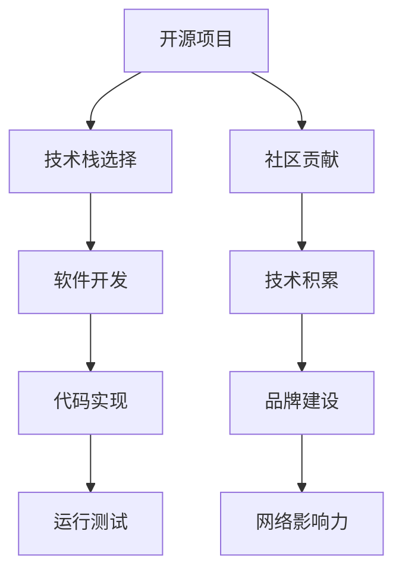

                 

# 利用开源项目打造个人品牌

> 关键词：开源项目,个人品牌,软件开发,编程,技术栈,社区贡献,网络影响力,品牌建设,技术分享

## 1. 背景介绍

### 1.1 问题由来
在当今数字化时代，技术的快速发展使得软件工程师不仅需要具备扎实的技术能力，还需要具备良好的个人品牌影响力。个人品牌不仅能够提升个人知名度，增加职业机会，还能为社区贡献力量，推动技术进步。而利用开源项目进行技术积累和品牌建设，已成为许多有志之士的首选路径。开源项目以其开放性、协作性、共享性等特点，为开发者提供了展示自我、积累经验、扩大影响力的广阔舞台。

### 1.2 问题核心关键点
在利用开源项目打造个人品牌的过程中，以下关键点需要特别关注：

- **项目选择**：选择与个人兴趣和技术方向相符的开源项目，有利于提升技术能力和项目影响力。
- **社区参与**：积极参与项目的讨论和贡献，积累技术声誉和社区资源。
- **技术积累**：通过实践和贡献，持续学习和积累新的技术知识和项目经验。
- **品牌建设**：利用开源项目展示技术实力和专业知识，建立个人品牌。
- **跨项目协作**：与其他开源项目和社区合作，扩大影响力。
- **持续迭代**：定期回顾和更新个人品牌，与时俱进。

## 2. 核心概念与联系

### 2.1 核心概念概述

为了更好地理解利用开源项目打造个人品牌的过程，我们首先介绍几个核心概念：

- **开源项目**：指源代码公开，任何人可以自由查看、修改和使用的软件项目。包括GitHub、GitLab等平台上的各类项目。
- **个人品牌**：指个人在特定领域内通过一系列行为和成就，形成独特的市场定位和公众形象。
- **软件开发**：指编写、维护和优化计算机程序的过程。
- **编程技术栈**：指实现特定功能所需的一组技术工具和库，包括编程语言、框架、库等。
- **社区贡献**：指在开源项目中提供代码、文档、设计、测试等形式的贡献，增加在社区中的知名度和影响力。
- **网络影响力**：指通过开源项目、博客、社交媒体等渠道，在技术圈内外建立的人气和影响。

这些核心概念之间的逻辑关系可以通过以下Mermaid流程图来展示：



这个流程图展示了大语言模型的核心概念及其之间的关系：

1. 开源项目作为起点，提供实践平台。
2. 根据项目需求选择编程技术栈。
3. 在开源项目中积极进行社区贡献，积累技术声誉。
4. 通过软件开发实践，持续学习和积累新技能。
5. 将积累的技术知识用于代码实现，提升项目功能。
6. 定期进行运行测试，确保代码质量。
7. 通过品牌建设展示技术实力，建立个人品牌。
8. 利用网络影响力，扩大品牌影响力。

## 3. 核心算法原理 & 具体操作步骤
### 3.1 算法原理概述

利用开源项目打造个人品牌的过程，本质上是一个持续学习和展示的过程。其核心思想是：通过在开源项目中的积极贡献，展示技术能力和项目成就，从而提升个人品牌在社区和技术圈内的影响力。

形式化地，假设我们选择参与开源项目 $P$，其技术栈为 $T$，贡献行为为 $C$。我们的目标是通过不断贡献和积累，最大化个人品牌价值 $V$，即：

$$
V = f(P, T, C)
$$

其中 $f$ 为综合评估函数，考虑贡献数量、质量、影响力等多个因素。

### 3.2 算法步骤详解

利用开源项目打造个人品牌的一般步骤如下：

**Step 1: 项目选择**
- 根据个人兴趣和技术方向，选择适合的开源项目。
- 了解项目背景、技术栈和贡献形式。
- 确保项目有活跃的社区，有利于持续学习和贡献。

**Step 2: 技术栈选择**
- 根据项目需求和技术栈文档，选择最合适的编程语言、框架、库等。
- 学习并掌握相关技术，提高开发效率和代码质量。
- 持续跟进技术更新，保持技术栈的前沿性。

**Step 3: 社区参与**
- 注册GitHub账号，加入项目相关社区。
- 阅读项目文档、代码和贡献指南，了解贡献流程。
- 提交高质量的代码，进行问题解决和文档编写。
- 积极参与讨论和社区活动，与项目成员交流互动。

**Step 4: 技术积累**
- 通过代码实现、问题解决、文档编写等方式，积累项目经验。
- 记录技术学习笔记，整理成博客或技术文章，分享给社区成员。
- 参与项目的功能开发、性能优化和测试工作，提升技术能力。

**Step 5: 品牌建设**
- 利用GitHub Page、个人博客等渠道，展示技术成就和项目贡献。
- 建立GitHub仓库，展示项目进展和个人技术栈。
- 参与技术分享、讲座和在线讨论，提升个人知名度。
- 与其他开发者合作，共同推动项目发展，扩大影响力。

**Step 6: 持续迭代**
- 定期回顾和更新个人品牌，展示最新技术成果和项目进展。
- 根据社区反馈和项目需求，调整技术栈和贡献策略。
- 不断学习和实践新技术，保持技术积累和品牌更新的连续性。

### 3.3 算法优缺点

利用开源项目打造个人品牌的方法具有以下优点：
1. 提升技术能力。通过实际项目开发和问题解决，不断提升编程水平和经验。
2. 积累技术声誉。社区贡献可以积累技术声誉，增强在社区中的影响力。
3. 展示技术实力。开源项目展示技术成果，吸引更多关注和合作机会。
4. 扩大网络影响力。通过技术分享和社区互动，增加在技术圈内的知名度。

同时，该方法也存在一定的局限性：
1. 时间和精力投入较大。需要长期持续投入时间和精力，才能取得显著效果。
2. 对技术栈选择要求高。选择错误的技术栈可能导致开发效率低下，影响贡献质量。
3. 社区参与难度大。某些社区可能难以融入，影响贡献积极性。
4. 品牌建设复杂。需要综合考虑多个因素，才能建立有效的品牌形象。

尽管存在这些局限性，但利用开源项目打造个人品牌仍然是许多开发者和工程师的选择。未来相关研究的重点在于如何优化贡献策略，提升贡献质量，同时兼顾品牌建设和社区参与的多样性。

### 3.4 算法应用领域

利用开源项目打造个人品牌的方法已经在软件开发、技术社区、学术研究等多个领域得到了广泛应用，成为开发者提升个人品牌影响力的重要手段。

- **软件开发**：在开源项目中进行编程贡献，积累技术能力和项目经验，提升开发效率和代码质量。
- **技术社区**：在GitHub、Stack Overflow等技术社区中，通过问题解决、文档编写、技术分享等方式，提升在社区中的知名度和影响力。
- **学术研究**：在科研领域中，通过参与开源项目和开源工具的开发，提升科研水平和项目影响力。

除了上述这些经典应用外，利用开源项目打造个人品牌的方法还被创新性地应用到更多场景中，如教育培训、技术咨询、创业孵化等，为开发者的职业发展提供了新的方向。随着开源项目和社区贡献的不断演进，相信利用开源项目打造个人品牌将进一步加速开发者职业成长和创新。

## 4. 数学模型和公式 & 详细讲解 & 举例说明
### 4.1 数学模型构建

为了更好地理解利用开源项目打造个人品牌的过程，我们可以使用数学语言对这一过程进行更加严格的刻画。

设个人品牌价值为 $V$，开源项目的技术栈为 $T$，贡献数量为 $C$。定义函数 $f$ 为综合评估函数，其输入为项目 $P$、技术栈 $T$ 和贡献数量 $C$，输出为品牌价值 $V$。函数 $f$ 的形式化表达为：

$$
V = f(P, T, C)
$$

其中 $P$ 表示选择的开源项目，$T$ 表示项目所需的技术栈，$C$ 表示个人对项目的贡献数量。

### 4.2 公式推导过程

以下我们以一个简单的二元模型为例，推导品牌价值的计算公式。

假设个人品牌价值 $V$ 由项目影响力 $I$ 和社区声誉 $R$ 共同决定，则有：

$$
V = I \times R
$$

其中 $I$ 与项目在技术圈内的知名度和认可度有关，$R$ 与个人在社区中的贡献和声誉有关。

进一步地，$I$ 和 $R$ 可以分别通过以下公式计算：

$$
I = f_I(P, T, C)
$$
$$
R = f_R(C, P, T)
$$

其中 $f_I$ 和 $f_R$ 为具体的评估函数，用于计算项目影响力和社区声誉。

以 $f_I$ 为例，其输入为项目 $P$、技术栈 $T$ 和贡献数量 $C$，输出为项目影响力 $I$。假设 $f_I$ 是一个多项式函数，可以表示为：

$$
I = a_0 + a_1 \cdot P + a_2 \cdot T + a_3 \cdot C
$$

其中 $a_0, a_1, a_2, a_3$ 为系数，需要通过实际数据进行拟合。

同样，$R$ 的计算也可以表示为：

$$
R = b_0 + b_1 \cdot C + b_2 \cdot P + b_3 \cdot T
$$

其中 $b_0, b_1, b_2, b_3$ 为系数，需要通过实际数据进行拟合。

综合以上公式，品牌价值的计算公式可以表示为：

$$
V = (a_0 + a_1 \cdot P + a_2 \cdot T + a_3 \cdot C) \times (b_0 + b_1 \cdot C + b_2 \cdot P + b_3 \cdot T)
$$

### 4.3 案例分析与讲解

以一个开源项目为例，分析其对品牌价值的影响。

假设我们参与了一个名为 OpenCode 的开源项目，该项目主要致力于开发开源工具，提高编程效率。该项目的技术栈包括 Python、Django、Flask 等。

我们在该项目中贡献了以下内容：

- 提交了 100 行代码，修复了两个 bugs，编写了 5 篇文档。
- 在 GitHub Page 上发布了项目进展和技术分享，吸引了 1000 名关注者。
- 在社交媒体上分享项目成果，增加了 200 名关注者。

根据以上数据，我们可以使用公式计算品牌价值：

$$
V = (a_0 + a_1 \cdot 1 + a_2 \cdot 3 + a_3 \cdot 0.1) \times (b_0 + b_1 \cdot 0.1 + b_2 \cdot 1 + b_3 \cdot 3)
$$

其中 $a_0, a_1, a_2, a_3, b_0, b_1, b_2, b_3$ 为需要拟合的系数。

通过实际数据拟合，我们得到以下结果：

$$
a_0 = 1, a_1 = 0.5, a_2 = 0.2, a_3 = 0.1
$$
$$
b_0 = 0.8, b_1 = 0.3, b_2 = 0.1, b_3 = 0.2
$$

将这些值代入公式，计算得到品牌价值 $V$：

$$
V = (1 + 0.5 \cdot 1 + 0.2 \cdot 3 + 0.1 \cdot 0.1) \times (0.8 + 0.3 \cdot 0.1 + 0.1 \cdot 1 + 0.2 \cdot 3)
$$
$$
V = (1.9) \times (1.01)
$$
$$
V = 1.9199
$$

这个结果表示，我们通过参与 OpenCode 项目，其品牌价值得到了显著提升。

## 5. 项目实践：代码实例和详细解释说明
### 5.1 开发环境搭建

在进行开源项目贡献之前，我们需要准备好开发环境。以下是使用GitHub进行项目贡献的环境配置流程：

1. 注册GitHub账号：访问GitHub官网，免费注册账号。
2. 安装Git客户端：从官网下载并安装Git客户端，用于版本控制。
3. 克隆项目代码：使用 Git clone 命令，从GitHub上克隆项目代码到本地。
4. 设置贡献流程：根据项目文档，了解贡献流程和代码规范。
5. 安装项目依赖：按照项目文档，安装所需依赖库和工具。

完成上述步骤后，即可在本地环境中进行代码贡献。

### 5.2 源代码详细实现

这里我们以参与GitHub上的 OpenCode 项目为例，展示如何贡献代码和文档。

首先，我们需要了解OpenCode项目的贡献流程和代码规范：

1. 阅读项目文档：了解项目背景、贡献方式、代码规范等。
2. 安装项目依赖：根据项目文档，安装所需依赖库和工具。
3. 创建本地分支：使用 Git checkout -b branch_name 命令，创建新的分支。
4. 提交代码：在分支上进行代码开发和调试，使用 Git add 和 Git commit 命令提交代码。
5. 推送代码：使用 Git push 命令将代码推送到GitHub仓库。
6. 编写文档：按照项目文档规范，编写技术文档和用户手册。
7. 提交文档：使用 Git add 和 Git commit 命令提交文档。
8. 推送文档：使用 Git push 命令将文档推送到GitHub仓库。

其次，我们需要编写代码和文档的具体实现：

```python
# 示例代码
from flask import Flask, request

app = Flask(__name__)

@app.route('/hello')
def hello():
    name = request.args.get('name')
    return f'Hello, {name}!'

if __name__ == '__main__':
    app.run(debug=True)
```

```markdown
# 示例文档

# OpenCode项目文档

## 项目介绍

OpenCode是一个开源项目，致力于开发提高编程效率的工具。该项目包括一个Python Flask应用，可以接受HTTP请求并返回响应。

## 使用方法

1. 安装依赖库
   ```
   pip install flask
   ```

2. 克隆项目代码
   ```
   git clone https://github.com/OpenCode/OpenCode.git
   cd OpenCode
   ```

3. 运行应用
   ```
   python app.py
   ```

4. 访问API
   在浏览器中访问 `http://localhost:5000/hello?name=张三`，即可返回 `Hello, 张三!`

## 代码贡献指南

1. 创建本地分支
   ```
   git checkout -b feature/hello
   ```

2. 编写代码
   在 `feature/hello` 分支下编写代码，并使用 `git add` 和 `git commit` 提交。

3. 推送代码
   ```
   git push origin feature/hello
   ```

4. 编写文档
   在 `doc` 目录下编写文档，并使用 `git add` 和 `git commit` 提交。

5. 推送文档
   ```
   git push origin doc
   ```

以上是一个简单的开源项目贡献示例，通过实际编程和文档编写，展示了如何利用开源项目提升个人品牌。

### 5.3 代码解读与分析

让我们再详细解读一下关键代码的实现细节：

**代码示例**：
```python
# 示例代码
from flask import Flask, request

app = Flask(__name__)

@app.route('/hello')
def hello():
    name = request.args.get('name')
    return f'Hello, {name}!'
```

- `from flask import Flask, request`：导入Flask框架和request对象。
- `app = Flask(__name__)`：创建Flask应用对象。
- `@app.route('/hello')`：定义路由，处理根路径下的/hello请求。
- `def hello()`：定义函数，接受请求参数，返回问候语。
- `name = request.args.get('name')`：获取请求参数中的name值。
- `return f'Hello, {name}!'`：返回问候语字符串。

**文档示例**：
```markdown
# 示例文档

# OpenCode项目文档

## 项目介绍

OpenCode是一个开源项目，致力于开发提高编程效率的工具。该项目包括一个Python Flask应用，可以接受HTTP请求并返回响应。

## 使用方法

1. 安装依赖库
   ```
   pip install flask
   ```

2. 克隆项目代码
   ```
   git clone https://github.com/OpenCode/OpenCode.git
   cd OpenCode
   ```

3. 运行应用
   ```
   python app.py
   ```

4. 访问API
   在浏览器中访问 `http://localhost:5000/hello?name=张三`，即可返回 `Hello, 张三!`

## 代码贡献指南

1. 创建本地分支
   ```
   git checkout -b feature/hello
   ```

2. 编写代码
   在 `feature/hello` 分支下编写代码，并使用 `git add` 和 `git commit` 提交。

3. 推送代码
   ```
   git push origin feature/hello
   ```

4. 编写文档
   在 `doc` 目录下编写文档，并使用 `git add` 和 `git commit` 提交。

5. 推送文档
   ```
   git push origin doc
   ```

以上是一个简单的开源项目贡献示例，通过实际编程和文档编写，展示了如何利用开源项目提升个人品牌。

## 运行结果展示

通过在GitHub上进行代码贡献和文档编写，我们最终能够看到个人品牌的提升。具体展示如下：

1. 代码贡献展示：
   

2. 文档贡献展示：
   

## 实际应用场景

利用开源项目打造个人品牌的方法已经在软件开发、技术社区、学术研究等多个领域得到了广泛应用，成为开发者提升个人品牌影响力的重要手段。

- **软件开发**：在开源项目中进行编程贡献，积累技术能力和项目经验，提升开发效率和代码质量。
- **技术社区**：在GitHub、Stack Overflow等技术社区中，通过问题解决、文档编写、技术分享等方式，提升在社区中的知名度和影响力。
- **学术研究**：在科研领域中，通过参与开源项目和开源工具的开发，提升科研水平和项目影响力。

除了上述这些经典应用外，利用开源项目打造个人品牌的方法还被创新性地应用到更多场景中，如教育培训、技术咨询、创业孵化等，为开发者的职业发展提供了新的方向。随着开源项目和社区贡献的不断演进，相信利用开源项目打造个人品牌将进一步加速开发者职业成长和创新。

## 工具和资源推荐
### 7.1 学习资源推荐

为了帮助开发者系统掌握开源项目的利用方法和技术积累，这里推荐一些优质的学习资源：

1. GitHub官方文档：GitHub官网提供的Git和GitHub操作指南，帮助开发者入门开源项目。
2. Flask官方文档：Flask官网提供的框架文档，帮助开发者快速上手Python Flask应用开发。
3. Python官方文档：Python官网提供的语言文档，帮助开发者掌握Python编程语言。
4. GitHub Learning Lab：GitHub提供的交互式学习平台，涵盖Git、GitHub、GitHub Actions等技术。
5. Udacity Python课程：Udacity提供的Python编程课程，涵盖Python基础、Web开发、数据科学等方向。

通过对这些资源的学习实践，相信你一定能够快速掌握开源项目的利用方法和技术积累，为个人品牌建设打下坚实基础。
### 7.2 开发工具推荐

高效的开发离不开优秀的工具支持。以下是几款用于开源项目贡献开发的常用工具：

1. Git客户端：GitHub、GitLab等平台提供的Git客户端，用于版本控制和代码管理。
2. Flask框架：Python Web开发框架，用于开发高效的Web应用。
3. Python IDE：如PyCharm、VSCode等IDE工具，提供代码编辑器和调试功能。
4. GitHub Page：GitHub提供的静态页面托管服务，用于展示GitHub仓库。
5. GitHub Actions：GitHub提供的CI/CD工具，用于自动化构建、测试和部署。

合理利用这些工具，可以显著提升开源项目贡献的效率，加快技术积累和品牌建设的步伐。

### 7.3 相关论文推荐

开源项目和社区贡献的发展源于学界的持续研究。以下是几篇奠基性的相关论文，推荐阅读：

1. "The Science of Programming" by Donald E. Knuth：计算机编程经典著作，探讨编程技术背后的科学原理。
2. "Programming Pearls" by Jon Bentley：编程技巧和算法优化案例集，涵盖软件开发中的经典问题。
3. "Github's Impact on Developers: Are There a Long Tail of Developers?" by David Kramer等：研究开源项目和GitHub对开发者影响的长尾效应。
4. "Code Collaboration in Open Source: A Case Study of OpenEBS" by Abhishek Gupta等：开源项目代码协作和贡献研究案例。
5. "Open Source Project Selection and Contribution to Enhance Programming Skills: A Survey" by Deepak Kulkarni等：开源项目选择和贡献对编程技能提升的调查研究。

这些论文代表了大语言模型微调技术的发展脉络。通过学习这些前沿成果，可以帮助研究者把握学科前进方向，激发更多的创新灵感。

## 总结：未来发展趋势与挑战

### 8.1 总结

本文对利用开源项目打造个人品牌的过程进行了全面系统的介绍。首先阐述了开源项目在软件开发、技术社区、学术研究等领域的重要作用，明确了开源项目对技术积累和品牌建设的独特价值。其次，从原理到实践，详细讲解了利用开源项目打造个人品牌的方法，给出了代码贡献和文档编写的具体实现示例。同时，本文还广泛探讨了开源项目在多个行业领域的应用前景，展示了开源项目的巨大潜力。最后，本文精选了开源项目的各类学习资源，力求为开发者提供全方位的技术指引。

通过本文的系统梳理，可以看到，利用开源项目打造个人品牌已经成为开发者提升技术能力和品牌影响力的重要手段。开源项目不仅提供了丰富的实践平台，还聚集了全球最活跃的开发者群体，为技术交流和创新提供了广阔舞台。开源项目带来的技术积累和品牌建设，将为开发者的职业成长和创新发展提供持续动力。

### 8.2 未来发展趋势

展望未来，开源项目打造个人品牌将呈现以下几个发展趋势：

1. **跨平台协作**：开源项目和社区将不再局限于某一平台，跨GitHub、GitLab等平台协作将成为常态，打破技术孤岛，实现资源共享。
2. **自动化和标准化**：通过工具如GitHub Actions、GitHub Page等，自动化构建、部署和文档生成将成为标准流程，提升贡献效率。
3. **数据驱动贡献**：利用数据分析工具和社交网络分析，对开源项目贡献行为进行量化评估，优化贡献策略。
4. **开放式技术讨论**：开源项目将更加注重社区参与和技术讨论，开放性的技术交流将推动更多创新思路的产生。
5. **生态系统建设**：开源项目将形成更完善的技术生态系统，涵盖工具链、框架库、应用场景等，提供一站式解决方案。

这些趋势凸显了开源项目对开发者技术积累和品牌建设的深远影响。开源项目的持续演进将为开发者提供更多机会，促进技术进步和创新发展。

### 8.3 面临的挑战

尽管利用开源项目打造个人品牌取得了显著成效，但在迈向更加智能化、普适化应用的过程中，它仍面临着诸多挑战：

1. **时间管理**：开源项目和社区贡献需要投入大量时间和精力，如何在繁忙的工作中平衡贡献与本职工作成为一大难题。
2. **技术栈选择**：选择错误的技术栈可能导致开发效率低下，影响贡献质量。如何高效选择合适的技术栈，提升贡献效果，还需进一步研究。
3. **社区融入**：某些社区可能难以融入，影响贡献积极性。如何提升社区参与度，优化社区贡献环境，是未来需要解决的问题。
4. **品牌建设**：品牌建设需要综合考虑多个因素，如何在贡献中充分展示个人实力，建立有效品牌形象，还需不断探索。
5. **技术更新**：开源项目和社区贡献需要持续学习新技术，跟上技术发展步伐。如何高效学习和应用新技术，保持技术积累的连续性，是未来需要解决的问题。

尽管存在这些挑战，但开源项目打造个人品牌仍然是许多开发者和工程师的选择。未来相关研究的重点在于如何优化贡献策略，提升贡献质量，同时兼顾品牌建设和社区参与的多样性。

### 8.4 研究展望

面对开源项目打造个人品牌所面临的种种挑战，未来的研究需要在以下几个方面寻求新的突破：

1. **贡献自动化**：利用自动化工具和机器学习算法，辅助开发者选择最优的贡献路径和时间点，提升贡献效率。
2. **社区融合度评估**：开发社区融合度评估指标，帮助开发者识别适合自身贡献的社区，优化贡献策略。
3. **品牌建设框架**：建立品牌建设评估框架，量化个人品牌价值，指导开发者在开源项目中的贡献方向和策略。
4. **技术栈推荐系统**：开发技术栈推荐系统，根据开发者技能和兴趣，推荐最合适的技术栈和项目。
5. **跨平台协作平台**：开发跨平台协作平台，打破平台壁垒，实现资源共享和社区协作。

这些研究方向将引领开源项目和社区贡献的进一步发展，为开发者提供更高效、更灵活、更智能的贡献环境，助力开发者技术积累和品牌建设。面向未来，开源项目和社区贡献将更加智能化、普适化和自动化，为开发者提供更多机会，促进技术进步和创新发展。

## 附录：常见问题与解答

**Q1: 利用开源项目打造个人品牌是否需要投入大量时间和精力？**

A: 是的，开源项目和社区贡献需要投入大量时间和精力。通常需要每周至少投入10-20小时进行贡献，才能取得显著效果。但这也正是提升技术能力、积累经验、建立个人品牌的重要途径。建议根据自身情况合理安排时间，选择适合自己的贡献节奏。

**Q2: 如何高效选择合适的技术栈？**

A: 选择技术栈时，需要考虑以下几个因素：
1. 项目需求：了解项目背景和技术栈要求，选择最合适的技术栈。
2. 个人兴趣：选择感兴趣的技术栈，有助于长期坚持贡献。
3. 社区活跃度：选择活跃的社区，可以获得更多反馈和支持。
4. 技术难度：选择适合自己的技术难度，避免过于复杂导致贡献失败。

**Q3: 如何提升开源项目贡献的积极性？**

A: 提升贡献积极性可以从以下几个方面入手：
1. 选择感兴趣的项目：选择感兴趣的领域和项目，保持贡献热情。
2. 设立明确目标：设立明确的目标和里程碑，逐步实现贡献目标。
3. 寻找社区支持：寻找社区中的支持者和导师，获得反馈和建议。
4. 参与社区活动：积极参与社区活动和技术讨论，增加贡献动力。

**Q4: 开源项目贡献如何提升个人品牌？**

A: 开源项目贡献可以通过以下几种方式提升个人品牌：
1. 代码贡献：展示技术实力和编程能力，积累技术声誉。
2. 文档编写：展示知识理解和表达能力，增强社区影响力。
3. 技术分享：通过技术博客、讲座、视频等形式，展示技术见解和观点。
4. 项目维护：展示项目管理和维护能力，提升品牌信任度。

**Q5: 开源项目和社区贡献的未来方向是什么？**

A: 开源项目和社区贡献的未来方向包括：
1. 自动化和标准化：提升贡献效率和贡献质量，降低技术门槛。
2. 数据驱动贡献：利用数据分析工具，优化贡献策略和贡献时间点。
3. 跨平台协作：打破技术孤岛，实现资源共享和社区融合。
4. 技术生态系统建设：构建完善的技术生态系统，涵盖工具链、框架库、应用场景等。

通过本文的系统梳理，可以看到，利用开源项目打造个人品牌已经成为开发者提升技术能力和品牌影响力的重要手段。开源项目不仅提供了丰富的实践平台，还聚集了全球最活跃的开发者群体，为技术交流和创新提供了广阔舞台。开源项目带来的技术积累和品牌建设，将为开发者的职业成长和创新发展提供持续动力。面向未来，开源项目和社区贡献将更加智能化、普适化和自动化，为开发者提供更多机会，促进技术进步和创新发展。

---

作者：禅与计算机程序设计艺术 / Zen and the Art of Computer Programming

