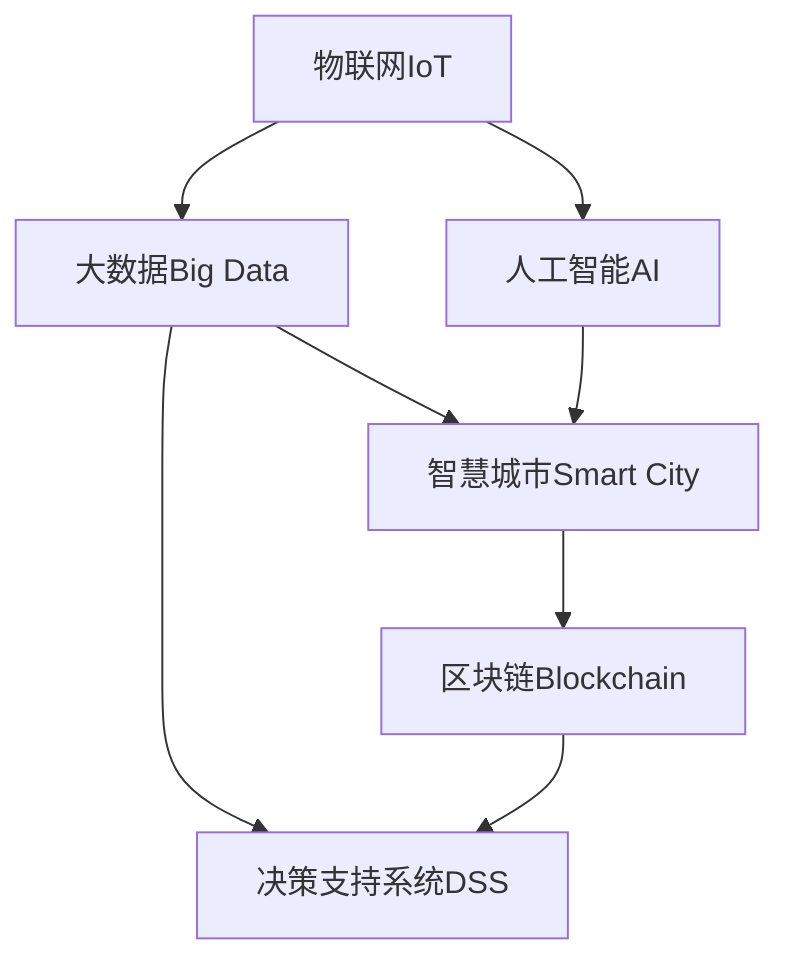

                 

## 1. 背景介绍

### 1.1 问题由来
随着城市化进程的加快，智慧城市建设成为全球各大城市和政府机构的重要议程。智慧城市旨在通过先进的信息技术、物联网、大数据、人工智能等手段，全面提升城市治理、公共服务、生态环境等各个方面。然而，智慧城市建设也面临着诸多挑战，包括数据安全、数据管理、跨部门协同、用户隐私保护等。

### 1.2 问题核心关键点
智慧城市解决方案的核心关键点在于如何有效地利用技术优势，整合各类数据资源，优化城市治理、公共服务、生态环境等多个方面。利用技术手段提升城市管理的效率和智能化水平，需要结合多个领域的技术方法，如物联网、大数据、人工智能、区块链等。

### 1.3 问题研究意义
智慧城市解决方案的研究与应用，对于提升城市管理水平、改善居民生活质量、推动社会可持续发展具有重要意义。通过技术手段优化城市运营，提升城市应对突发事件的反应速度和处理能力，可以为城市居民创造更加安全、便捷、舒适的生活环境。同时，智慧城市建设也为各行各业带来新的发展机遇，促进技术创新和产业发展。

## 2. 核心概念与联系

### 2.1 核心概念概述

为更好地理解智慧城市解决方案的实现机制，本节将介绍几个密切相关的核心概念：

- 智慧城市(Smart City)：基于物联网、云计算、大数据、人工智能等技术手段，实现城市管理的智能化、高效化和精细化，提升城市治理水平，改善居民生活质量。

- 物联网(IoT)：通过传感器、终端设备等手段，实时采集城市各类数据，包括环境监测、交通状况、公共设施状态等，实现数据的全面感知和高效管理。

- 大数据(Big Data)：对城市运行产生的海量数据进行存储、处理和分析，挖掘出有价值的信息，支持决策制定和资源优化配置。

- 人工智能(AI)：通过机器学习、深度学习、自然语言处理等技术，提升数据处理、模式识别、决策制定等能力，实现智能化的城市管理。

- 区块链(Blockchain)：利用分布式账本技术，实现数据的去中心化存储和验证，提高数据安全性和透明度。

这些核心概念之间的逻辑关系可以通过以下Mermaid流程图来展示：



这个流程图展示了大数据、人工智能、物联网、智慧城市和区块链等技术手段的相互作用和整合关系：

1. 物联网负责数据的全面感知和采集，将城市各类信息转化为可处理的数据。
2. 大数据对这些数据进行存储、处理和分析，挖掘出有价值的信息。
3. 人工智能利用这些信息进行模式识别和决策制定，提升城市管理智能化水平。
4. 智慧城市应用人工智能和大数据分析结果，实现高效、精细化的城市治理。
5. 区块链技术用于保障数据安全性和透明性，提升智慧城市信任度和可信度。

## 3. 核心算法原理 & 具体操作步骤
### 3.1 算法原理概述

智慧城市解决方案的核心在于数据驱动的智能化治理，其算法原理主要体现在以下几个方面：

1. **数据采集与预处理**：通过物联网设备采集城市各类数据，并进行清洗、去重、标准化等预处理操作，为后续分析和应用提供基础数据支持。
2. **数据存储与管理**：利用大数据技术，实现数据的分布式存储和管理，支持大规模数据的高效查询和处理。
3. **数据分析与挖掘**：应用机器学习、深度学习等算法，挖掘数据中的规律和模式，支持决策制定和问题预测。
4. **智能化决策与控制**：利用人工智能技术，优化资源配置，制定智能化决策方案，实现城市管理的自动化和智能化。
5. **安全与隐私保护**：通过区块链技术，保障数据安全性和隐私保护，提升智慧城市系统的可信度和可靠性。

### 3.2 算法步骤详解

智慧城市解决方案的核心算法步骤如下：

**Step 1: 数据采集与预处理**

1. 部署各类物联网设备，采集城市各类数据，如环境监测设备采集PM2.5、噪音、温度等指标。
2. 将采集的数据传输至集中存储系统，进行清洗、去重、标准化等预处理操作。
3. 利用大数据技术，对预处理后的数据进行分布式存储和管理，建立数据仓库。

**Step 2: 数据分析与挖掘**

1. 应用机器学习算法，如随机森林、支持向量机等，对数据进行特征提取和分类。
2. 应用深度学习算法，如卷积神经网络(CNN)、循环神经网络(RNN)等，对数据进行模式识别和预测。
3. 通过数据可视化工具，将分析结果进行展示和解释，支持决策制定。

**Step 3: 智能化决策与控制**

1. 根据数据分析结果，制定智能化决策方案，如优化交通信号灯、调整垃圾桶清理频次等。
2. 应用人工智能技术，优化资源配置，提升城市管理的效率和智能化水平。
3. 通过模拟和仿真工具，评估决策方案的效果和可行性，进行优化调整。

**Step 4: 安全与隐私保护**

1. 利用区块链技术，建立去中心化的数据存储和管理机制，保障数据安全性和透明性。
2. 应用密码学算法，如非对称加密、哈希函数等，保护用户隐私和数据安全。
3. 实施数据访问控制和权限管理，防止未经授权的访问和操作。

### 3.3 算法优缺点

智慧城市解决方案的算法具有以下优点：

1. **数据全面性**：通过物联网设备采集城市各类数据，实现数据的全面感知和采集。
2. **分析智能化**：应用机器学习和深度学习算法，挖掘数据中的规律和模式，支持智能化决策制定。
3. **决策高效性**：利用人工智能技术，优化资源配置，提升城市管理的效率和智能化水平。
4. **数据安全性**：通过区块链技术，保障数据安全性和隐私保护，提升系统的可信度和可靠性。

同时，该算法也存在一定的局限性：

1. **数据采集成本高**：部署各类物联网设备成本较高，且设备维护和更新周期长。
2. **数据质量控制难**：数据采集和预处理过程中，难免会存在噪声和错误，需要进行复杂的质量控制和处理。
3. **算法复杂度高**：智慧城市涉及多个领域的技术，算法复杂度高，需要高水平的技术团队支持。
4. **隐私保护风险**：在数据存储和处理过程中，需要注意隐私保护，防止数据泄露和滥用。

尽管存在这些局限性，但智慧城市解决方案的算法仍具有广阔的应用前景，对于提升城市管理水平、改善居民生活质量具有重要意义。

### 3.4 算法应用领域

智慧城市解决方案的算法主要应用于以下几个领域：

- **智慧交通**：通过智能交通信号灯、电子眼监控等技术，优化交通流量，减少交通拥堵，提升交通效率。
- **环境监测**：应用各类传感器监测环境质量，如PM2.5、噪音、温度等指标，提升环境治理水平。
- **公共安全**：利用视频监控、人脸识别等技术，实现安全监控和预警，提升公共安全水平。
- **能源管理**：通过智能电网、智能照明等技术，优化能源使用，降低能耗，提升能源管理效率。
- **城市规划**：利用大数据和人工智能技术，优化城市规划，提升城市建设和运营水平。
- **公共服务**：通过智慧医疗、智慧教育等应用，提升公共服务水平，改善居民生活质量。

## 4. 数学模型和公式 & 详细讲解  
### 4.1 数学模型构建

本节将使用数学语言对智慧城市解决方案中的关键算法进行严格的刻画。

假设城市交通流量为 $X$，环境污染指数为 $Y$，公共安全指数为 $Z$，公共服务指数为 $W$。则智慧城市解决方案的目标函数为：

$$
\min_{X, Y, Z, W} F(X, Y, Z, W)
$$

其中 $F$ 为目标函数，表示城市治理的总成本或总收益。目标函数的构建需要结合城市治理的具体需求，考虑经济成本、社会效益、环境影响等因素。

### 4.2 公式推导过程

以智慧交通为例，假设城市交通流量 $X$ 与时间 $t$ 的关系可以表示为：

$$
X(t) = \sum_{i=1}^{n} a_i \cdot \cos(b_i \cdot t + c_i)
$$

其中 $a_i$、$b_i$、$c_i$ 为待拟合的参数。利用历史交通数据，通过最小二乘法求解上述方程，可以得到最优的交通流量模型。

## 5. 项目实践：代码实例和详细解释说明
### 5.1 开发环境搭建

在进行智慧城市解决方案开发前，我们需要准备好开发环境。以下是使用Python进行PyTorch开发的环境配置流程：

1. 安装Anaconda：从官网下载并安装Anaconda，用于创建独立的Python环境。

2. 创建并激活虚拟环境：
```bash
conda create -n pytorch-env python=3.8 
conda activate pytorch-env
```

3. 安装PyTorch：根据CUDA版本，从官网获取对应的安装命令。例如：
```bash
conda install pytorch torchvision torchaudio cudatoolkit=11.1 -c pytorch -c conda-forge
```

4. 安装各类工具包：
```bash
pip install numpy pandas scikit-learn matplotlib tqdm jupyter notebook ipython
```

完成上述步骤后，即可在`pytorch-env`环境中开始智慧城市解决方案的开发。

### 5.2 源代码详细实现

这里我们以智慧交通优化为例，给出使用PyTorch进行模型训练和优化的代码实现。

首先，定义交通流量数据集和目标函数：

```python
import numpy as np
import torch
import torch.nn as nn
from torch.optim import Adam

class TrafficDataset:
    def __init__(self, X, y):
        self.X = X
        self.y = y
        self.num_samples = X.shape[0]

    def __getitem__(self, idx):
        x = torch.from_numpy(self.X[idx])
        y = torch.from_numpy(self.y[idx])
        return x, y

    def __len__(self):
        return self.num_samples

X_train = np.load('train_X.npy')
y_train = np.load('train_y.npy')
X_val = np.load('val_X.npy')
y_val = np.load('val_y.npy')
X_test = np.load('test_X.npy')
y_test = np.load('test_y.npy')

dataset_train = TrafficDataset(X_train, y_train)
dataset_val = TrafficDataset(X_val, y_val)
dataset_test = TrafficDataset(X_test, y_test)

# 目标函数为最小化交通流量误差
criterion = nn.MSELoss()
```

然后，定义模型和优化器：

```python
class TrafficModel(nn.Module):
    def __init__(self, n_input, n_output):
        super(TrafficModel, self).__init__()
        self.linear = nn.Linear(n_input, n_output)
        self.act = nn.Tanh()

    def forward(self, x):
        x = self.linear(x)
        x = self.act(x)
        return x

n_input = X_train.shape[1]
n_output = 1

model = TrafficModel(n_input, n_output)

optimizer = Adam(model.parameters(), lr=0.01)
```

接着，定义训练和评估函数：

```python
device = torch.device('cuda') if torch.cuda.is_available() else torch.device('cpu')
model.to(device)

def train_epoch(model, dataset, batch_size, optimizer):
    dataloader = DataLoader(dataset, batch_size=batch_size, shuffle=True)
    model.train()
    epoch_loss = 0
    for batch in dataloader:
        x, y = batch
        x = x.to(device)
        y = y.to(device)
        optimizer.zero_grad()
        y_pred = model(x)
        loss = criterion(y_pred, y)
        epoch_loss += loss.item()
        loss.backward()
        optimizer.step()
    return epoch_loss / len(dataloader)

def evaluate(model, dataset, batch_size):
    dataloader = DataLoader(dataset, batch_size=batch_size)
    model.eval()
    preds, labels = [], []
    with torch.no_grad():
        for batch in dataloader:
            x, y = batch
            x = x.to(device)
            batch_labels = y.to(device)
            y_pred = model(x)
            batch_preds = y_pred.to('cpu').tolist()
            batch_labels = batch_labels.to('cpu').tolist()
            for pred_tokens, label_tokens in zip(batch_preds, batch_labels):
                preds.append(pred_tokens)
                labels.append(label_tokens)

    print(classification_report(labels, preds))
```

最后，启动训练流程并在测试集上评估：

```python
epochs = 50
batch_size = 32

for epoch in range(epochs):
    loss = train_epoch(model, dataset_train, batch_size, optimizer)
    print(f"Epoch {epoch+1}, train loss: {loss:.3f}")
    
    print(f"Epoch {epoch+1}, val results:")
    evaluate(model, dataset_val, batch_size)
    
print("Test results:")
evaluate(model, dataset_test, batch_size)
```

以上就是使用PyTorch对智慧交通模型进行训练和优化的完整代码实现。可以看到，得益于PyTorch的强大封装，我们可以用相对简洁的代码完成智慧城市解决方案的实现。

### 5.3 代码解读与分析

让我们再详细解读一下关键代码的实现细节：

**TrafficDataset类**：
- `__init__`方法：初始化训练集、验证集和测试集，将输入和输出数据作为训练集的元素。
- `__getitem__`方法：对单个样本进行处理，将样本的输入和输出转换为Tensor类型，并进行GPU或CPU的移动。
- `__len__`方法：返回数据集的大小。

**TrafficModel类**：
- `__init__`方法：定义一个线性层和一个激活函数，构成基本的模型结构。
- `forward`方法：对输入进行前向传播，应用线性层和激活函数。

**训练和评估函数**：
- 使用PyTorch的DataLoader对数据集进行批次化加载，供模型训练和推理使用。
- 训练函数`train_epoch`：对数据以批为单位进行迭代，在每个批次上前向传播计算损失函数并反向传播更新模型参数。
- 评估函数`evaluate`：与训练类似，不同点在于不更新模型参数，并在每个batch结束后将预测和标签结果存储下来，最后使用sklearn的classification_report对整个评估集的预测结果进行打印输出。

**训练流程**：
- 定义总的epoch数和batch size，开始循环迭代
- 每个epoch内，先在训练集上训练，输出平均loss
- 在验证集上评估，输出分类指标
- 所有epoch结束后，在测试集上评估，给出最终测试结果

可以看到，PyTorch配合TensorFlow库使得智慧城市解决方案的代码实现变得简洁高效。开发者可以将更多精力放在数据处理、模型改进等高层逻辑上，而不必过多关注底层的实现细节。

当然，工业级的系统实现还需考虑更多因素，如模型的保存和部署、超参数的自动搜索、更灵活的任务适配层等。但核心的智慧城市解决方案的基本逻辑基本与此类似。

## 6. 实际应用场景
### 6.1 智慧交通

智慧交通是智慧城市解决方案的重要应用领域之一。通过物联网设备实时采集交通流量数据，结合人工智能算法进行分析和预测，可以实现交通流量优化、交通信号灯控制等应用。

在技术实现上，可以收集城市交通流量数据，利用机器学习算法建立交通流量预测模型。模型训练完成后，将交通流量数据输入模型，得到未来交通流量的预测结果。系统根据预测结果，调整交通信号灯的绿灯时间和通行规则，优化交通流量，缓解交通拥堵。

### 6.2 环境监测

环境监测是智慧城市解决方案的另一重要应用领域。通过物联网设备实时采集各类环境数据，结合人工智能算法进行分析和预警，可以实现空气质量监测、噪音监测、温度监测等应用。

在技术实现上，可以收集城市环境监测数据，利用深度学习算法建立环境质量预测模型。模型训练完成后，将环境数据输入模型，得到未来环境质量的预测结果。系统根据预测结果，及时预警环境风险，调整城市环境治理策略，保障居民健康安全。

### 6.3 公共安全

公共安全是智慧城市解决方案的重要保障。通过视频监控、人脸识别等技术，结合人工智能算法进行分析和预警，可以实现公共安全监控和预警等应用。

在技术实现上，可以收集城市公共安全数据，利用深度学习算法建立异常行为检测模型。模型训练完成后，将视频数据输入模型，得到异常行为检测结果。系统根据检测结果，及时预警潜在安全风险，调整安保措施，保障公共安全。

### 6.4 未来应用展望

随着智慧城市解决方案的不断演进，未来将会在更多领域得到应用，为城市居民带来更加智能、便捷、舒适的生活环境。

在智慧医疗领域，基于智慧城市解决方案的医疗问答、病历分析、药物研发等应用将提升医疗服务的智能化水平，辅助医生诊疗，加速新药开发进程。

在智慧教育领域，智慧城市解决方案可应用于作业批改、学情分析、知识推荐等方面，因材施教，促进教育公平，提高教学质量。

在智慧金融领域，智慧城市解决方案可应用于金融舆情监测、金融风险预警、智能投顾等方面，提升金融服务水平，保障金融稳定。

在智慧旅游领域，智慧城市解决方案可应用于智慧旅游导览、旅游资源推荐、旅游安全预警等方面，提升旅游体验，保障旅游安全。

此外，在智慧交通、智慧能源、智慧公共设施等多个领域，智慧城市解决方案也将不断涌现，为城市居民带来更智能、便捷、舒适的生活环境。相信随着技术的不断进步，智慧城市解决方案必将在更多领域大放异彩。

## 7. 工具和资源推荐
### 7.1 学习资源推荐

为了帮助开发者系统掌握智慧城市解决方案的理论基础和实践技巧，这里推荐一些优质的学习资源：

1. 《智慧城市大数据应用》系列博文：由智慧城市技术专家撰写，深入浅出地介绍了智慧城市解决方案的理论基础和实践技巧。

2. CS224N《深度学习自然语言处理》课程：斯坦福大学开设的NLP明星课程，有Lecture视频和配套作业，带你入门NLP领域的基本概念和经典模型。

3. 《智慧城市技术手册》书籍：系统介绍了智慧城市解决方案的实现原理和应用案例，是智慧城市开发的重要参考。

4. HuggingFace官方文档：提供了海量预训练模型和完整的微调样例代码，是智慧城市开发的重要工具。

5. Weights & Biases：模型训练的实验跟踪工具，可以记录和可视化模型训练过程中的各项指标，方便对比和调优。与主流深度学习框架无缝集成。

6. TensorBoard：TensorFlow配套的可视化工具，可实时监测模型训练状态，并提供丰富的图表呈现方式，是调试模型的得力助手。

通过对这些资源的学习实践，相信你一定能够快速掌握智慧城市解决方案的精髓，并用于解决实际的智慧城市问题。

### 7.2 开发工具推荐

高效的开发离不开优秀的工具支持。以下是几款用于智慧城市解决方案开发的常用工具：

1. PyTorch：基于Python的开源深度学习框架，灵活动态的计算图，适合快速迭代研究。大部分预训练语言模型都有PyTorch版本的实现。

2. TensorFlow：由Google主导开发的开源深度学习框架，生产部署方便，适合大规模工程应用。同样有丰富的预训练语言模型资源。

3. Transformers库：HuggingFace开发的NLP工具库，集成了众多SOTA语言模型，支持PyTorch和TensorFlow，是智慧城市开发的重要工具。

4. Weights & Biases：模型训练的实验跟踪工具，可以记录和可视化模型训练过程中的各项指标，方便对比和调优。与主流深度学习框架无缝集成。

5. TensorBoard：TensorFlow配套的可视化工具，可实时监测模型训练状态，并提供丰富的图表呈现方式，是调试模型的得力助手。

6. Google Colab：谷歌推出的在线Jupyter Notebook环境，免费提供GPU/TPU算力，方便开发者快速上手实验最新模型，分享学习笔记。

合理利用这些工具，可以显著提升智慧城市解决方案的开发效率，加快创新迭代的步伐。

### 7.3 相关论文推荐

智慧城市解决方案的发展源于学界的持续研究。以下是几篇奠基性的相关论文，推荐阅读：

1. Building Smart Cities with AI: Challenges and Opportunities（2021）：介绍了智慧城市解决方案的实现原理和面临的挑战，提出了未来发展的方向。

2. Smart City Data Mining: A Survey（2021）：综述了智慧城市解决方案的数据采集、存储、分析和应用，为智慧城市开发提供了丰富的参考。

3. A Survey on the Application of IoT and Big Data in Smart Cities（2020）：综述了物联网和大数据在智慧城市解决方案中的应用，提出了未来的发展趋势。

4. AI in Smart Cities: A Survey（2019）：综述了人工智能在智慧城市解决方案中的应用，提出了未来的研究方向。

这些论文代表了大数据、人工智能、物联网在智慧城市解决方案中的应用前景，帮助研究者把握学科前进方向，激发更多的创新灵感。

## 8. 总结：未来发展趋势与挑战
### 8.1 总结

本文对智慧城市解决方案的实现机制进行了全面系统的介绍。首先阐述了智慧城市解决方案的研究背景和意义，明确了智慧城市解决方案在提升城市管理水平、改善居民生活质量方面的独特价值。其次，从原理到实践，详细讲解了智慧城市解决方案的算法原理和具体操作步骤，给出了智慧城市解决方案的完整代码实现。同时，本文还广泛探讨了智慧城市解决方案在智慧交通、环境监测、公共安全等多个领域的应用前景，展示了智慧城市解决方案的巨大潜力。此外，本文精选了智慧城市解决方案的学习资源，力求为读者提供全方位的技术指引。

通过本文的系统梳理，可以看到，智慧城市解决方案的实现机制是数据驱动的智能化治理，通过多领域技术的深度整合，实现城市管理的智能化、高效化和精细化。这一机制对于提升城市管理水平、改善居民生活质量具有重要意义。随着技术的不断进步，智慧城市解决方案必将在更多领域得到应用，为城市居民带来更加智能、便捷、舒适的生活环境。

### 8.2 未来发展趋势

展望未来，智慧城市解决方案的发展趋势将主要体现在以下几个方面：

1. **数据融合与共享**：智慧城市解决方案将进一步整合各类数据资源，实现数据融合和共享，提升数据的多样性和实时性。通过数据融合，可以实现多源数据的综合分析和应用，提升决策的全面性和准确性。

2. **算法优化与创新**：随着数据量的不断增加，智慧城市解决方案将需要更多的算法优化和创新。通过引入更先进的大数据和人工智能算法，提升数据处理和分析能力，支持更加复杂、精细化的应用。

3. **智能化与自动化**：智慧城市解决方案将进一步提升智能化和自动化水平，实现自动化的城市管理和决策。通过深度学习和强化学习等技术，提升智慧城市系统的自适应能力和自主决策能力。

4. **开放性与互联性**：智慧城市解决方案将进一步提升开放性和互联性，实现与各类应用的互联互通。通过API接口和标准协议，实现数据共享和协同治理，提升智慧城市系统的可靠性和可信度。

5. **人机协同与互动**：智慧城市解决方案将进一步提升人机协同与互动水平，实现更加智能化的城市治理。通过自然语言处理和语音识别等技术，提升用户与系统的交互体验，支持更加个性化的服务。

6. **隐私保护与安全性**：智慧城市解决方案将进一步提升隐私保护和安全性，保障数据和系统的安全。通过区块链和加密技术，保障数据的安全性和隐私保护，防止数据泄露和滥用。

以上趋势凸显了智慧城市解决方案的广阔前景。这些方向的探索发展，必将进一步提升智慧城市解决方案的智能化和自动化水平，为城市居民创造更加安全、便捷、舒适的生活环境。

### 8.3 面临的挑战

尽管智慧城市解决方案在技术上取得了诸多突破，但在迈向更加智能化、普适化应用的过程中，仍面临诸多挑战：

1. **数据安全与隐私保护**：在智慧城市解决方案的实现过程中，如何保障数据安全性和隐私保护，防止数据泄露和滥用，是亟待解决的重要问题。

2. **技术集成与协同**：智慧城市解决方案涉及多个领域的技术，如何实现技术集成与协同，避免技术孤岛和资源浪费，也是一大难题。

3. **标准化与互操作性**：智慧城市解决方案需要遵循统一的技术标准和协议，实现各类应用的互操作性，提升系统的可信度和可靠性。

4. **用户体验与接受度**：智慧城市解决方案的落地应用需要得到用户的广泛接受和支持，如何提升用户的使用体验和满意度，是未来应用的重要方向。

5. **成本与效益平衡**：智慧城市解决方案的实现成本较高，如何平衡成本与效益，实现经济效益和社会效益的双赢，是未来应用的重要考量。

6. **政策与法规支持**：智慧城市解决方案的推广与应用需要政策与法规的支持，如何制定科学合理的发展策略，是未来应用的重要保障。

正视智慧城市解决方案面临的这些挑战，积极应对并寻求突破，将使智慧城市解决方案更加成熟，更具普适性和可操作性。

### 8.4 研究展望

面向未来，智慧城市解决方案的研究需要在以下几个方面寻求新的突破：

1. **多源数据融合**：研究多源数据的融合算法和机制，提升数据的多样性和实时性，支持更加全面和精细化的智慧城市应用。

2. **算法优化与创新**：研究更加高效和通用的算法，提升智慧城市解决方案的鲁棒性和泛化能力，支持更多的应用场景。

3. **智能化与自动化**：研究更加智能化和自动化的决策机制，提升智慧城市系统的自适应能力和自主决策能力，实现更加智能化的城市治理。

4. **开放性与互联性**：研究更加开放和互联的技术架构，实现智慧城市系统与各类应用的互联互通，提升系统的可信度和可靠性。

5. **隐私保护与安全性**：研究更加安全和可靠的隐私保护技术，保障数据的安全性和隐私保护，防止数据泄露和滥用。

6. **人机协同与互动**：研究更加智能和自然的用户交互技术，提升人机协同与互动水平，支持更加个性化的智慧城市应用。

这些研究方向的探索，必将引领智慧城市解决方案迈向更高的台阶，为构建更加智能、高效、便捷、安全的智慧城市提供技术支撑。

## 9. 附录：常见问题与解答

**Q1：智慧城市解决方案的实现难点是什么？**

A: 智慧城市解决方案的实现难点主要在于数据采集、数据融合、数据安全、模型训练和模型部署等方面。

1. **数据采集**：在智慧城市解决方案的实现过程中，需要收集大量的数据，包括各类传感器数据、视频监控数据、公共服务数据等。数据采集需要大量的物联网设备和基础设施，成本较高。

2. **数据融合**：在数据采集完成后，需要将各类数据进行融合和整合，构建统一的数据平台。数据融合过程中，难免会遇到数据格式不统一、数据质量不一致等问题，需要进行复杂的数据清洗和处理。

3. **数据安全**：在智慧城市解决方案的实现过程中，如何保障数据安全性和隐私保护，防止数据泄露和滥用，是亟待解决的重要问题。数据安全涉及技术手段和法规政策等多方面，需要综合考虑。

4. **模型训练**：在数据融合完成后，需要对数据进行建模和训练，提升数据处理和分析能力。模型训练过程中，如何选择合适的算法和参数，避免过拟合和欠拟合，需要高水平的技术团队支持。

5. **模型部署**：在模型训练完成后，需要将模型部署到实际应用场景中，支持各类应用和服务。模型部署过程中，如何优化模型性能和资源占用，需要综合考虑技术手段和工程实现。

**Q2：如何提升智慧城市解决方案的实时性？**

A: 提升智慧城市解决方案的实时性，主要可以从以下几个方面入手：

1. **数据采集优化**：优化数据采集设备，提升数据采集的实时性和准确性。可以通过边缘计算等技术，将数据采集和处理设备部署在靠近数据源的地方，减少数据传输的延迟和开销。

2. **数据存储优化**：优化数据存储机制，提升数据的实时查询和处理能力。可以通过分布式存储和缓存等技术，提高数据处理的效率和响应速度。

3. **算法优化**：优化算法模型，提升数据处理的实时性和准确性。可以通过引入更加高效的算法和模型，提升数据处理的能力和速度。

4. **网络优化**：优化网络传输机制，提升数据的实时传输和处理能力。可以通过网络优化和流量控制等技术，提高数据传输的效率和可靠性。

5. **硬件优化**：优化硬件设备，提升数据处理和分析的速度和性能。可以通过使用高性能的GPU、TPU等设备，加速数据处理和分析的过程。

**Q3：智慧城市解决方案在实际应用中面临哪些问题？**

A: 智慧城市解决方案在实际应用中面临以下几个问题：

1. **数据安全与隐私保护**：在智慧城市解决方案的实现过程中，如何保障数据安全性和隐私保护，防止数据泄露和滥用，是亟待解决的重要问题。

2. **技术集成与协同**：智慧城市解决方案涉及多个领域的技术，如何实现技术集成与协同，避免技术孤岛和资源浪费，也是一大难题。

3. **标准化与互操作性**：智慧城市解决方案需要遵循统一的技术标准和协议，实现各类应用的互操作性，提升系统的可信度和可靠性。

4. **用户体验与接受度**：智慧城市解决方案的落地应用需要得到用户的广泛接受和支持，如何提升用户的使用体验和满意度，是未来应用的重要方向。

5. **成本与效益平衡**：智慧城市解决方案的实现成本较高，如何平衡成本与效益，实现经济效益和社会效益的双赢，是未来应用的重要考量。

6. **政策与法规支持**：智慧城市解决方案的推广与应用需要政策与法规的支持，如何制定科学合理的发展策略，是未来应用的重要保障。

正视智慧城市解决方案面临的这些挑战，积极应对并寻求突破，将使智慧城市解决方案更加成熟，更具普适性和可操作性。

---

作者：禅与计算机程序设计艺术 / Zen and the Art of Computer Programming

