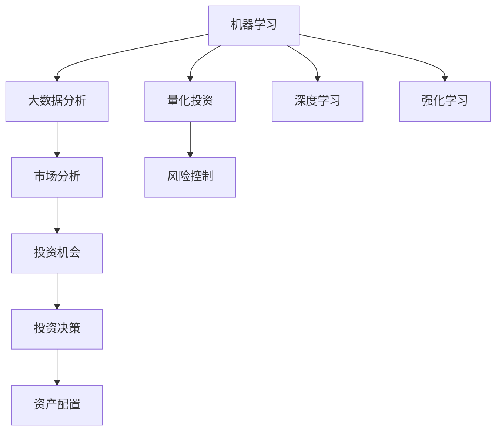

                 

# 利用技术技能进行房地产投资

## 1. 背景介绍

### 1.1 问题由来

在数字经济迅猛发展的背景下，房地产投资方式也发生了深刻的变化。传统基于地理位置、市场趋势等线下因素的投资方式逐渐被智能算法所取代，技术手段的运用正在重新定义房地产投资领域。利用机器学习、大数据分析等技术，投资者可以更加精准地预测市场趋势，把握投资机会，规避风险。

### 1.2 问题核心关键点

房地产投资的核心在于资产评估、市场分析、风险控制。利用技术技能，可以优化这些关键环节，提升投资效率和收益。具体包括：

1. **资产评估：** 利用机器学习算法对房地产市场进行全面评估，预测资产价格走势，辅助决策。
2. **市场分析：** 利用大数据技术分析市场数据，识别市场趋势，寻找投资机会。
3. **风险控制：** 通过量化模型分析市场风险，动态调整投资组合，实现风险最小化。

## 2. 核心概念与联系

### 2.1 核心概念概述

为更好地理解利用技术技能进行房地产投资，本节将介绍几个关键概念及其联系：

- **机器学习(ML)：** 通过算法让机器从数据中学习，从而自动提升决策能力，广泛应用于金融、医疗、房地产等多个领域。
- **大数据分析：** 对大规模数据进行收集、存储、处理和分析，揭示数据背后的规律，辅助决策。
- **量化投资(QI)：** 利用数学模型和统计分析技术，对市场进行科学化、系统化投资。
- **深度学习(Deep Learning)：** 一种基于人工神经网络的机器学习方法，能够处理复杂非线性问题，广泛应用于图像识别、语音识别、自然语言处理等领域。
- **强化学习(RL)：** 通过智能体与环境的交互，不断优化策略，实现最优化决策，常用于机器人控制、游戏策略优化等。

这些概念通过以下Mermaid流程图展示了它们之间的联系：



这个流程图展示了机器学习与大数据分析、量化投资、深度学习、强化学习之间的相互关系，以及这些技术在市场分析和风险控制中的应用，最终用于投资决策和资产配置。

## 3. 核心算法原理 & 具体操作步骤

### 3.1 算法原理概述

利用技术技能进行房地产投资，本质上是将传统投资方法与现代技术手段相结合的过程。核心算法原理包括以下几个方面：

- **资产评估模型：** 基于历史数据，利用回归分析、时间序列分析等方法，预测资产未来价格。
- **市场趋势预测：** 通过自然语言处理(NLP)技术，分析新闻、社交媒体等非结构化数据，预测市场走势。
- **风险量化模型：** 利用统计学、概率论方法，构建量化模型，评估投资组合风险。
- **投资组合优化：** 通过线性规划、动态规划等算法，优化投资组合，实现收益最大化。

### 3.2 算法步骤详解

以下是基于技术技能进行房地产投资的主要步骤：

**Step 1: 数据收集与预处理**

1. **收集数据：** 包括历史价格数据、市场新闻、社交媒体信息等。
2. **数据清洗：** 处理缺失值、异常值，标准化数据格式。

**Step 2: 特征工程与模型训练**

1. **特征提取：** 从数据中提取有意义的特征，如市场趋势、价格变化等。
2. **模型训练：** 利用训练数据训练预测模型，如回归模型、卷积神经网络(CNN)、循环神经网络(RNN)等。

**Step 3: 模型评估与优化**

1. **模型评估：** 使用验证集评估模型性能，如均方误差(MSE)、均方根误差(RMSE)等。
2. **模型优化：** 根据评估结果调整模型参数，优化模型性能。

**Step 4: 风险评估与投资决策**

1. **风险评估：** 利用量化模型评估投资组合风险，如VaR、ES等。
2. **投资决策：** 结合市场预测和风险评估，做出投资决策，如买入、卖出、持有等。

### 3.3 算法优缺点

基于技术技能进行房地产投资具有以下优点：

- **精确性：** 技术手段可以处理大量数据，减少人为主观判断误差。
- **效率：** 自动化流程显著提升投资效率，减少人工干预成本。
- **动态调整：** 可以实时监测市场变化，动态调整投资策略。

同时，也存在一些缺点：

- **复杂度：** 技术模型复杂，需要专业知识和技能。
- **数据依赖：** 依赖于高质量、完备的数据，数据质量问题会影响模型效果。
- **过拟合风险：** 过度依赖模型，可能陷入局部最优解，忽视市场变化。

### 3.4 算法应用领域

基于技术技能进行房地产投资的方法，已经广泛应用于以下几个领域：

- **资产管理：** 利用技术手段分析和管理投资组合，优化资产配置。
- **风险管理：** 构建量化模型评估市场风险，动态调整投资策略，实现风险最小化。
- **投资策略制定：** 利用大数据和机器学习技术，制定科学的投资策略。
- **市场预测：** 通过自然语言处理和机器学习，预测市场走势，把握投资机会。

## 4. 数学模型和公式 & 详细讲解 & 举例说明

### 4.1 数学模型构建

在进行房地产投资时，常见的数学模型包括回归分析、时间序列分析、VaR模型、ES模型等。以回归分析为例，其数学模型可以表示为：

$$
Y = \beta_0 + \beta_1X_1 + \beta_2X_2 + \cdots + \beta_nX_n + \epsilon
$$

其中 $Y$ 为资产价格，$\beta$ 为系数，$X$ 为特征变量，$\epsilon$ 为误差项。

### 4.2 公式推导过程

回归分析的参数估计通常采用最小二乘法，其推导过程如下：

1. **构建目标函数：** 最小化残差平方和 $SSR$：
   $$
   SSR = \sum_{i=1}^n (y_i - \hat{y}_i)^2
   $$
   
2. **求解目标函数最小值：** 对 $SSR$ 求导，得到：
   $$
   \frac{\partial SSR}{\partial \beta_j} = -2\sum_{i=1}^n (y_i - \hat{y}_i)x_{ij} = -2X^T(XX^T)^{-1}(XY - Y)
   $$
   
3. **求解参数 $\beta$：** 根据上述导数，求解方程组得到参数 $\beta$ 的值。

### 4.3 案例分析与讲解

假设我们有一组历史数据，如上表所示：

| 年份 | 价格 |
|------|------|
| 2000 | 100  |
| 2001 | 120  |
| 2002 | 150  |
| 2003 | 200  |
| 2004 | 250  |

我们想建立价格预测模型，使用线性回归分析。首先，我们需要构建特征变量 $X$，如年份、前一年价格等，假设我们选择了年份作为唯一特征变量。

1. **数据准备：**

   ```python
   import pandas as pd
   import numpy as np

   data = pd.DataFrame({
       'Year': [2000, 2001, 2002, 2003, 2004],
       'Price': [100, 120, 150, 200, 250]
   })
   ```

2. **特征工程：**

   ```python
   X = data[['Year']]
   y = data['Price']
   ```

3. **模型训练：**

   ```python
   from sklearn.linear_model import LinearRegression

   model = LinearRegression()
   model.fit(X, y)
   ```

4. **模型评估：**

   ```python
   from sklearn.metrics import mean_squared_error

   y_pred = model.predict(X)
   mse = mean_squared_error(y, y_pred)
   print(f'Mean Squared Error: {mse}')
   ```

通过以上步骤，我们可以得到价格预测模型，并使用均方误差等指标评估模型性能。

## 5. 项目实践：代码实例和详细解释说明

### 5.1 开发环境搭建

在进行房地产投资的技术实践前，我们需要准备好开发环境。以下是使用Python进行开发的常见环境配置：

1. **安装Python：** 从官网下载并安装Python，选择最新版本。
2. **安装虚拟环境：** 使用虚拟环境管理工具，如Anaconda，创建独立的环境，如 `conda create -n my_env python=3.8`。
3. **安装必要的库：** 安装常用的Python库，如Numpy、Pandas、Scikit-learn等，使用 `pip install` 命令进行安装。
4. **安装可视化工具：** 安装TensorBoard、Weights & Biases等可视化工具，帮助监测模型训练过程。

### 5.2 源代码详细实现

以下是利用机器学习进行房地产投资预测的代码实现：

```python
import pandas as pd
import numpy as np
from sklearn.linear_model import LinearRegression
from sklearn.metrics import mean_squared_error
import matplotlib.pyplot as plt

# 数据准备
data = pd.DataFrame({
    'Year': [2000, 2001, 2002, 2003, 2004],
    'Price': [100, 120, 150, 200, 250]
})

# 特征工程
X = data[['Year']]
y = data['Price']

# 模型训练
model = LinearRegression()
model.fit(X, y)

# 模型评估
y_pred = model.predict(X)
mse = mean_squared_error(y, y_pred)

# 输出评估结果
print(f'Mean Squared Error: {mse}')

# 可视化结果
plt.scatter(X, y)
plt.plot(X, y_pred, color='red')
plt.show()
```

### 5.3 代码解读与分析

**数据准备：**

```python
data = pd.DataFrame({
    'Year': [2000, 2001, 2002, 2003, 2004],
    'Price': [100, 120, 150, 200, 250]
})
```

**特征工程：**

```python
X = data[['Year']]
y = data['Price']
```

**模型训练：**

```python
model = LinearRegression()
model.fit(X, y)
```

**模型评估：**

```python
y_pred = model.predict(X)
mse = mean_squared_error(y, y_pred)
```

**可视化结果：**

```python
plt.scatter(X, y)
plt.plot(X, y_pred, color='red')
plt.show()
```

通过上述代码，我们可以构建线性回归模型，并使用均方误差评估模型性能。最终，利用Matplotlib可视化模型预测结果。

## 6. 实际应用场景

### 6.1 智能资产管理

利用技术技能进行房地产投资，可以显著提升资产管理效率和效果。智能资产管理平台通过收集市场数据和用户行为数据，利用机器学习算法进行分析，自动生成投资建议。例如，根据市场趋势预测模型，推荐买入或卖出某处资产，优化资产配置。

### 6.2 风险管理与规避

房地产市场存在一定的波动性和不确定性，利用量化模型进行风险评估和规避是关键。通过构建VaR模型和ES模型，可以量化资产组合的风险，动态调整投资组合，实现风险最小化。例如，根据VaR模型，可以设定最大损失阈值，当市场波动超过阈值时，自动卖出高风险资产。

### 6.3 投资策略制定

房地产投资需要科学的投资策略来指导决策。利用大数据分析和机器学习技术，可以制定科学的投资策略。例如，通过文本分析技术，挖掘市场新闻和社交媒体中的投资信号，结合市场趋势预测模型，制定投资决策。

## 7. 工具和资源推荐

### 7.1 学习资源推荐

为了帮助读者系统掌握利用技术技能进行房地产投资的理论和实践方法，以下是一些推荐的学习资源：

1. **《机器学习实战》：** 一本经典书籍，介绍了机器学习的基本概念和实战案例。
2. **Coursera《机器学习》课程：** 斯坦福大学的公开课程，系统讲解机器学习理论及应用。
3. **Kaggle数据科学竞赛：** 参与真实项目，提升数据处理和模型构建能力。
4. **TensorFlow官方文档：** 详细介绍TensorFlow框架的使用方法，涵盖深度学习模型构建与训练。
5. **Scikit-learn官方文档：** 详细介绍Scikit-learn库的使用方法，涵盖机器学习模型构建与评估。

### 7.2 开发工具推荐

以下是几款常用的开发工具，用于房地产投资技术实践：

1. **Anaconda：** 一个Python发行版，支持虚拟环境管理，方便快速搭建开发环境。
2. **TensorFlow：** 一个开源的深度学习框架，支持构建复杂的神经网络模型。
3. **Scikit-learn：** 一个基于NumPy和SciPy的机器学习库，涵盖各种经典机器学习算法。
4. **Jupyter Notebook：** 一个交互式的笔记本环境，方便快速迭代开发和实验。
5. **Visual Studio Code：** 一个流行的IDE，支持Python等语言开发。

### 7.3 相关论文推荐

以下是一些利用技术技能进行房地产投资的相关论文，推荐阅读：

1. **《房地产投资组合优化：基于线性规划的方法》：** 探讨如何利用线性规划优化房地产投资组合。
2. **《利用深度学习进行房地产价格预测》：** 介绍如何利用深度学习算法预测房地产价格。
3. **《基于机器学习的房地产市场趋势预测》：** 讨论如何利用机器学习技术分析市场数据，预测市场走势。
4. **《量化投资：理论与实践》：** 详细探讨量化投资的原理和应用。

## 8. 总结：未来发展趋势与挑战

### 8.1 总结

本文对利用技术技能进行房地产投资的方法进行了全面系统的介绍。首先，阐述了技术技能在房地产投资中的重要性，明确了资产评估、市场分析、风险控制等核心环节的技术应用。其次，从原理到实践，详细讲解了回归分析、时间序列分析、VaR模型等模型的构建和应用，给出了具体的代码实现。同时，本文还探讨了智能资产管理、风险管理与规避、投资策略制定等实际应用场景，展示了技术技能在房地产投资中的广泛应用前景。此外，本文还推荐了相关的学习资源和开发工具，力求为读者提供全方位的技术指引。

通过本文的系统梳理，可以看到，利用技术技能进行房地产投资正在成为一种趋势，将深度改变房地产投资的方式和效率。未来，随着机器学习、大数据分析等技术的不断进步，房地产投资领域将迎来更加智能化、数据驱动的发展。

### 8.2 未来发展趋势

展望未来，房地产投资技术将呈现以下几个发展趋势：

1. **智能化提升：** 随着AI技术的不断进步，智能投资决策系统将更加精准、高效。
2. **数据驱动：** 大数据技术将深入挖掘市场数据，辅助投资决策。
3. **跨界融合：** 技术与金融、房地产等领域的深度融合，将催生新的商业模式和投资策略。
4. **风险管理：** 量化模型和风险评估技术将更加完善，帮助投资者规避风险。
5. **实时分析：** 实时数据分析和决策系统将极大提升投资效率和灵活性。

以上趋势凸显了房地产投资技术的广阔前景。这些方向的探索发展，将进一步提升投资决策的科学性和合理性，为投资者带来更高的收益。

### 8.3 面临的挑战

尽管利用技术技能进行房地产投资已经取得显著进展，但在迈向更加智能化、普适化应用的过程中，它仍面临诸多挑战：

1. **数据质量问题：** 数据的不完备性和噪声会影响模型的准确性。
2. **模型复杂性：** 复杂的模型和算法需要专业知识，增加了技术实现的难度。
3. **市场波动性：** 市场的不确定性对模型预测准确性构成挑战。
4. **成本投入：** 技术开发和应用需要一定的资金投入，可能影响中小投资者的应用。
5. **伦理和隐私问题：** 数据隐私和安全问题需要得到妥善处理。

这些挑战需要技术开发者和投资者共同面对和解决，才能实现技术的广泛应用。

### 8.4 研究展望

面对利用技术技能进行房地产投资所面临的挑战，未来的研究需要在以下几个方面寻求新的突破：

1. **数据治理：** 构建高质量、可信赖的数据治理体系，提升数据质量。
2. **模型简化：** 开发更加轻量级、易用的模型，降低技术门槛。
3. **实时系统：** 构建实时数据分析和决策系统，提高市场响应速度。
4. **隐私保护：** 加强数据隐私保护，确保用户数据安全。
5. **伦理约束：** 在模型开发和应用中引入伦理导向，确保行为合法合规。

这些研究方向的探索，必将引领房地产投资技术迈向更高的台阶，为投资者带来更加高效、智能、可靠的投资体验。总之，利用技术技能进行房地产投资是一个不断探索和优化的过程，需要开发者和投资者共同努力，不断创新和优化，方能实现技术的最佳应用效果。

---

作者：禅与计算机程序设计艺术 / Zen and the Art of Computer Programming

