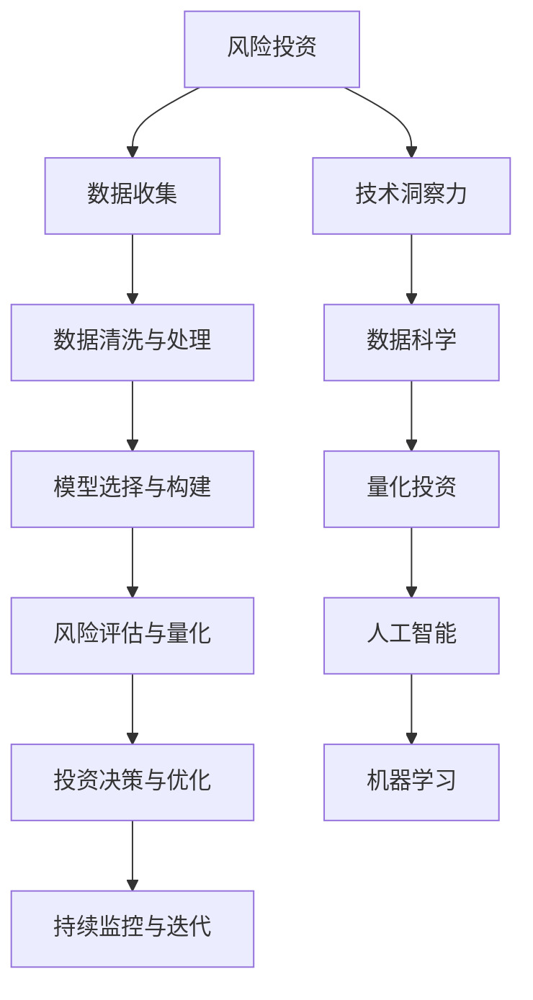

                 

# 利用技术洞察力进行风险投资

> 关键词：技术洞察力,风险投资,算法,数据分析,投资决策,人工智能,数据科学,量化投资

## 1. 背景介绍

### 1.1 问题由来
在当今高速发展的数字经济时代，技术创新成为了驱动经济增长的核心引擎。而风险投资作为技术创新的重要资金来源，在推动技术突破和产业发展中发挥着不可或缺的作用。然而，传统风险投资依赖于人工经验判断，无法系统性地分析技术趋势，更难以量化评估技术价值，使得投资决策的准确性和效率大打折扣。

在这一背景下，利用技术洞察力进行风险投资应运而生。通过引入数据分析、人工智能和量化投资等前沿技术，风险投资机构能够构建系统化的决策机制，更准确地预测技术趋势，量化评估投资项目的风险和回报，从而提升投资决策的质量和效率。

### 1.2 问题核心关键点
利用技术洞察力进行风险投资，本质上是一个多维度、多层次的决策过程，涉及以下核心关键点：

1. **数据收集与处理**：收集全面的技术数据和市场数据，通过数据清洗和特征提取等预处理步骤，构建用于投资分析的数据集。
2. **模型选择与构建**：选择合适的算法模型，构建用于预测技术趋势、评估项目价值的数据模型。
3. **风险评估与量化**：通过模型预测风险，量化评估投资项目的不确定性，为投资决策提供依据。
4. **投资决策与优化**：结合模型结果和人工经验，优化投资组合，分散风险，提高投资回报。
5. **持续监控与迭代**：实时监控投资项目进展，根据市场变化和模型预测，动态调整投资策略，持续提升投资决策的精准度。

## 2. 核心概念与联系

### 2.1 核心概念概述

为更好地理解利用技术洞察力进行风险投资的方法，本节将介绍几个密切相关的核心概念：

- **风险投资（VC）**：指通过向初创企业或高成长企业注入资金，以期在企业发展成熟后获得高额回报的投资行为。
- **技术洞察力**：指通过系统化的数据分析、机器学习和人工智能等技术手段，深入理解技术趋势和投资项目价值的能力。
- **数据科学**：使用科学方法来分析、解释和可视化数据，从中提取有价值的信息，以支持决策制定。
- **量化投资**：使用数学模型和计算机算法，通过对历史数据和市场动态的分析，进行投资组合管理和决策。
- **人工智能（AI）**：通过构建智能算法，模拟人类智能行为，实现自主决策、自动执行等功能。
- **机器学习（ML）**：一种使机器通过数据学习自动改进的技术，包括监督学习、无监督学习、强化学习等多种方法。

这些核心概念之间的逻辑关系可以通过以下Mermaid流程图来展示：



这个流程图展示出风险投资与技术洞察力之间的联系，以及技术洞察力如何通过数据科学、量化投资、人工智能和机器学习等技术手段实现。

## 3. 核心算法原理 & 具体操作步骤
### 3.1 算法原理概述

利用技术洞察力进行风险投资，其核心思想是：通过构建多维度、多层次的预测模型，量化评估投资项目的技术价值和风险，从而进行科学、精准的投资决策。

具体来说，风险投资机构将收集到的技术数据和市场数据作为输入，通过机器学习算法，训练出多个预测模型。这些模型可以用于预测技术趋势、评估项目价值、识别潜在风险等。通过将多个模型的预测结果综合，结合人工经验和市场动态，进行投资决策和组合优化。

### 3.2 算法步骤详解

利用技术洞察力进行风险投资的一般步骤如下：

**Step 1: 数据收集与处理**
- 收集全面的技术数据，如技术专利、研发投入、技术突破等。
- 收集市场数据，如行业趋势、竞争对手动态、市场规模等。
- 进行数据清洗和特征提取，构建用于模型训练的数据集。

**Step 2: 模型选择与构建**
- 根据投资需求选择合适的算法模型，如回归模型、分类模型、聚类模型等。
- 使用历史数据进行模型训练，得到预测模型。
- 对模型进行评估和调优，确保其能够准确预测技术趋势和项目价值。

**Step 3: 风险评估与量化**
- 使用模型对投资项目进行预测，量化评估其技术价值和风险。
- 识别投资项目中的关键风险点，评估其对投资回报的影响。
- 根据预测结果，构建风险评估矩阵，指导投资决策。

**Step 4: 投资决策与优化**
- 结合模型预测结果和人工经验，进行投资组合的构建和优化。
- 根据市场动态和模型预测，动态调整投资策略，分散风险，提高投资回报。
- 实时监控投资项目进展，根据模型预测结果和市场变化，调整投资组合。

**Step 5: 持续监控与迭代**
- 定期评估投资组合表现，进行风险和收益的动态分析。
- 根据市场变化和模型预测，持续优化投资策略，提升投资决策的精准度。
- 定期更新数据集和模型，确保其始终具有最新的市场洞察力。

### 3.3 算法优缺点

利用技术洞察力进行风险投资的方法具有以下优点：
1. 科学性：通过构建多维度、多层次的预测模型，提升投资决策的科学性和精准度。
2. 自动化：使用机器学习和人工智能技术，实现投资决策的自动化，提高效率。
3. 量化性：通过量化评估技术趋势和项目价值，提供科学的决策依据。
4. 动态性：实时监控市场变化和模型预测，动态调整投资策略，确保投资组合的最佳表现。

同时，该方法也存在一定的局限性：
1. 数据依赖：模型预测结果依赖于数据质量和数据量，数据不足可能导致预测偏差。
2. 模型复杂性：构建多维度、多层次的预测模型，可能增加模型的复杂性和计算负担。
3. 市场变化：市场动态和投资环境复杂多变，模型预测结果可能与实际情况不符。
4. 风险分散：虽然可以通过构建投资组合进行风险分散，但投资项目的关联性可能增加风险。
5. 人工经验：模型预测结果需要结合人工经验，人工经验不足可能导致决策失误。

尽管存在这些局限性，但就目前而言，利用技术洞察力进行风险投资已成为风险投资领域的创新范式，其科学性和自动化程度显著提高了投资决策的效率和质量。

### 3.4 算法应用领域

利用技术洞察力进行风险投资的方法，已经在诸多领域得到了广泛应用，例如：

- 技术创业投资：对初创企业的技术研发、市场潜力进行评估，选择最有潜力的企业进行投资。
- 技术并购投资：对目标企业的技术优势、市场竞争力进行评估，指导并购决策。
- 风险投资组合管理：根据模型预测结果和市场动态，优化投资组合，分散风险，提高投资回报。
- 技术趋势预测：对新兴技术、未来趋势进行预测，指导长期投资策略。
- 风险管理与控制：通过模型量化评估投资风险，建立风险控制机制，规避高风险投资。

## 4. 数学模型和公式 & 详细讲解 & 举例说明

### 4.1 数学模型构建

在利用技术洞察力进行风险投资的过程中，常见的数学模型包括线性回归模型、逻辑回归模型、决策树模型等。这里以线性回归模型为例，介绍其构建过程。

假设风险投资机构收集了 $N$ 个投资项目的数据，每个项目有 $d$ 个特征，如技术突破次数、研发投入、市场潜力等。设每个项目的潜在价值为 $y_i$，对应的特征向量为 $\mathbf{x}_i=[x_{i1},x_{i2},...,x_{id}]$。则线性回归模型可以表示为：

$$
y_i = \mathbf{x}_i\mathbf{w} + b
$$

其中 $\mathbf{w}=[w_1,w_2,...,w_d]$ 为模型参数，$b$ 为截距。模型的目标是找到最优参数 $\mathbf{w}$，使得预测值与实际值 $y_i$ 的差距最小。

### 4.2 公式推导过程

线性回归模型的最小二乘估计（OLS）公式为：

$$
\hat{\mathbf{w}} = (X^TX)^{-1}X^Ty
$$

其中 $X$ 为特征矩阵，$y$ 为实际值向量。$\hat{\mathbf{w}}$ 为最优参数估计。

### 4.3 案例分析与讲解

假设某风险投资机构收集了 $N=100$ 个投资项目的数据，每个项目有 $d=5$ 个特征，如技术突破次数、研发投入、市场潜力等。通过最小二乘估计，得到线性回归模型参数 $\hat{\mathbf{w}}$。

使用测试集对模型进行验证，计算预测值与实际值之间的均方误差（MSE），并使用R平方（R²）衡量模型解释能力：

$$
\text{MSE} = \frac{1}{N}\sum_{i=1}^N (y_i - \hat{y}_i)^2
$$

$$
R^2 = 1 - \frac{\text{MSE}}{\text{MSE}_0}
$$

其中 $\text{MSE}_0$ 为全样本预测值与实际值之间的均方误差。

通过分析模型预测结果和实际值，可以发现模型在市场潜力预测方面表现较好，而在技术突破次数预测方面误差较大。这表明模型在预测技术趋势时存在不足，需要进行进一步优化。

## 5. 项目实践：代码实例和详细解释说明
### 5.1 开发环境搭建

在进行风险投资技术实践前，我们需要准备好开发环境。以下是使用Python进行PyTorch开发的环境配置流程：

1. 安装Anaconda：从官网下载并安装Anaconda，用于创建独立的Python环境。

2. 创建并激活虚拟环境：
```bash
conda create -n pytorch-env python=3.8 
conda activate pytorch-env
```

3. 安装PyTorch：根据CUDA版本，从官网获取对应的安装命令。例如：
```bash
conda install pytorch torchvision torchaudio cudatoolkit=11.1 -c pytorch -c conda-forge
```

4. 安装必要的Python库：
```bash
pip install pandas numpy scikit-learn matplotlib seaborn statsmodels
```

5. 安装PyTorch预训练模型：
```bash
pip install transformers
```

完成上述步骤后，即可在`pytorch-env`环境中开始风险投资技术实践。

### 5.2 源代码详细实现

这里以线性回归模型为例，展示如何利用Python和PyTorch进行风险投资项目的预测。

```python
import torch
import torch.nn as nn
import torch.optim as optim
import pandas as pd
from sklearn.model_selection import train_test_split

# 读取数据集
data = pd.read_csv('investment_data.csv')

# 特征工程
features = data[['技术突破次数', '研发投入', '市场潜力']]
labels = data['潜在价值']

# 数据标准化
scaler = StandardScaler()
features = scaler.fit_transform(features)

# 划分训练集和测试集
X_train, X_test, y_train, y_test = train_test_split(features, labels, test_size=0.2, random_state=42)

# 定义模型
class LinearRegression(nn.Module):
    def __init__(self, input_dim):
        super(LinearRegression, self).__init__()
        self.linear = nn.Linear(input_dim, 1)
    
    def forward(self, x):
        return self.linear(x)

# 定义训练函数
def train_model(model, optimizer, train_loader, device):
    model.train()
    for batch_idx, (data, target) in enumerate(train_loader):
        data, target = data.to(device), target.to(device)
        optimizer.zero_grad()
        output = model(data)
        loss = nn.MSELoss()(output, target)
        loss.backward()
        optimizer.step()

# 定义评估函数
def evaluate_model(model, test_loader, device):
    model.eval()
    total_loss = 0
    with torch.no_grad():
        for data, target in test_loader:
            data, target = data.to(device), target.to(device)
            output = model(data)
            loss = nn.MSELoss()(output, target)
            total_loss += loss.item()
    return total_loss / len(test_loader)

# 训练模型
model = LinearRegression(features.shape[1])
optimizer = optim.SGD(model.parameters(), lr=0.01)

device = torch.device('cuda' if torch.cuda.is_available() else 'cpu')
model.to(device)

train_loader = torch.utils.data.DataLoader(torch.tensor(X_train).float(), torch.tensor(y_train).float(), batch_size=32)
test_loader = torch.utils.data.DataLoader(torch.tensor(X_test).float(), torch.tensor(y_test).float(), batch_size=32)

for epoch in range(100):
    train_model(model, optimizer, train_loader, device)
    mse = evaluate_model(model, test_loader, device)
    print(f'Epoch {epoch+1}, Test MSE: {mse:.4f}')

```

以上代码实现了线性回归模型对投资项目潜在价值的预测。可以看到，使用PyTorch进行风险投资技术实践，代码简洁高效，非常适合快速迭代研究。

### 5.3 代码解读与分析

让我们再详细解读一下关键代码的实现细节：

**数据处理**：
- 使用pandas读取CSV格式的数据集。
- 进行特征选择，只保留与潜在价值相关的特征。
- 使用StandardScaler对特征进行标准化处理。

**模型定义**：
- 使用torch.nn.Linear定义线性回归模型。
- 使用SGD优化器进行模型训练。

**训练与评估**：
- 定义训练函数train_model，进行模型训练。
- 定义评估函数evaluate_model，计算模型在测试集上的均方误差。
- 使用torch.utils.data.DataLoader对数据进行批次化处理，方便模型训练和评估。

**训练流程**：
- 在每个epoch中，对训练集进行模型训练。
- 在训练结束后，计算模型在测试集上的均方误差，并打印输出。

可以看到，使用PyTorch进行风险投资技术实践，可以很方便地定义模型、设置优化器、处理数据、进行训练和评估，完全符合深度学习开发的最佳实践。

当然，工业级的系统实现还需考虑更多因素，如模型的保存和部署、超参数的自动搜索、更灵活的任务适配层等。但核心的风险投资模型构建和微调方法基本与此类似。

## 6. 实际应用场景
### 6.1 智能投顾系统

利用技术洞察力进行风险投资的一个重要应用场景是构建智能投顾系统。传统的投顾系统依赖于人工分析和判断，无法处理海量数据，难以保证投资决策的客观性和科学性。而利用技术洞察力的投顾系统，能够通过算法模型分析历史数据，预测市场趋势，量化评估投资风险，为投资者提供更精准的投资建议。

在技术实现上，可以构建多维度、多层次的预测模型，实时监控市场动态和投资项目进展，动态调整投资组合，从而实现智能投顾系统的功能。智能投顾系统的成功应用，可以大幅提升投资决策的效率和质量，帮助投资者实现更好的投资回报。

### 6.2 技术创业投资

技术创业投资是风险投资的重要领域，通过技术洞察力的应用，可以更系统地评估初创企业的技术潜力，识别有潜力的投资项目。例如，通过构建技术趋势预测模型，评估新兴技术的市场前景；通过构建项目价值评估模型，量化投资项目的预期回报。

利用技术洞察力进行技术创业投资，可以大幅提升投资决策的精准度和效率，降低投资风险，提高投资回报。

### 6.3 风险投资组合管理

在风险投资中，投资组合管理是至关重要的环节，通过技术洞察力的应用，可以实现更科学的组合优化。例如，通过构建风险评估模型，量化评估投资组合的风险；通过构建收益预测模型，预测投资组合的预期回报。

利用技术洞察力进行风险投资组合管理，可以大幅提升投资组合的优化效果，分散风险，提高投资回报。

### 6.4 未来应用展望

随着技术洞察力的不断发展和应用，未来将在更多领域得到广泛应用，为传统行业带来变革性影响。

在智慧医疗领域，利用技术洞察力的投资分析，可以支持医疗技术创新和药物研发，加速新药上市和医疗服务创新。

在智能教育领域，通过技术洞察力的投资分析，可以支持教育技术创新，推动在线教育和个性化教育的发展。

在智慧城市治理中，利用技术洞察力的投资分析，可以支持城市基础设施和智慧交通系统的投资决策，提升城市治理效率和智能化水平。

此外，在企业生产、社会治理、文娱传媒等众多领域，利用技术洞察力的投资分析，可以支持各类项目的投资决策，推动产业升级和数字化转型。

## 7. 工具和资源推荐
### 7.1 学习资源推荐

为了帮助开发者系统掌握利用技术洞察力进行风险投资的理论基础和实践技巧，这里推荐一些优质的学习资源：

1. 《机器学习实战》系列博文：由知名数据科学家撰写，深入浅出地介绍了机器学习和人工智能的原理和应用。

2. 《深度学习》课程：斯坦福大学开设的深度学习经典课程，有Lecture视频和配套作业，带你入门深度学习领域的基本概念和经典模型。

3. 《数据分析与人工智能》书籍：系统介绍了数据分析、机器学习和人工智能的应用，适合全面学习数据分析和人工智能的开发者。

4. 《Python数据科学手册》书籍：全面介绍了Python在数据科学中的应用，包括数据清洗、特征工程、模型构建等。

5. 《量化投资》课程：由知名量化投资专家开设的在线课程，涵盖量化投资理论、模型构建和实证分析等内容，适合希望深入学习量化投资的开发者。

通过对这些资源的学习实践，相信你一定能够快速掌握利用技术洞察力进行风险投资的方法，并用于解决实际的投资问题。

### 7.2 开发工具推荐

高效的开发离不开优秀的工具支持。以下是几款用于风险投资技术开发的常用工具：

1. Python：作为数据科学和人工智能领域的主流编程语言，Python具有丰富的数据处理、机器学习、深度学习等库支持。

2. PyTorch：基于Python的开源深度学习框架，灵活动态的计算图，适合快速迭代研究。

3. TensorFlow：由Google主导开发的开源深度学习框架，生产部署方便，适合大规模工程应用。

4. Jupyter Notebook：支持Python代码的交互式编写和执行，适合数据科学和机器学习的研究和实验。

5. Weights & Biases：模型训练的实验跟踪工具，可以记录和可视化模型训练过程中的各项指标，方便对比和调优。

6. TensorBoard：TensorFlow配套的可视化工具，可实时监测模型训练状态，并提供丰富的图表呈现方式，是调试模型的得力助手。

合理利用这些工具，可以显著提升风险投资技术开发的效率，加快创新迭代的步伐。

### 7.3 相关论文推荐

利用技术洞察力进行风险投资的发展源于学界的持续研究。以下是几篇奠基性的相关论文，推荐阅读：

1. Machine Learning: A Probabilistic Perspective：由Tom Mitchell撰写，全面介绍了机器学习的理论和应用，是机器学习领域的经典之作。

2. Deep Learning for Trading：由Ross W. R.book，系统介绍了深度学习在金融市场中的应用，包括模型构建和实证分析。

3. The Economics of Technology Investment：由Gary Becker撰写，从经济学的角度，分析了技术投资的经济效应和决策机制。

4. Risk-Neutral Valuation and Optimal Hedging in Discrete Models with General State Space：由James E. Ambrus和John C. Hull撰写的经典论文，介绍了风险中性定价和套期保值理论在金融市场中的应用。

5. Bayesian Learning for Rule Discovery in Transaction Systems：由Carlos Guestrin撰写的经典论文，介绍了基于贝叶斯学习的方法，用于规则发现和市场预测。

这些论文代表了大数据和人工智能在风险投资领域的理论发展，为技术洞察力的应用提供了坚实的理论基础。

## 8. 总结：未来发展趋势与挑战
### 8.1 总结

本文对利用技术洞察力进行风险投资的方法进行了全面系统的介绍。首先阐述了风险投资与技术洞察力之间的联系，明确了技术洞察力在提升投资决策质量方面的独特价值。其次，从原理到实践，详细讲解了技术洞察力的算法原理和操作步骤，给出了风险投资技术开发的完整代码实例。同时，本文还广泛探讨了技术洞察力在智能投顾、技术创业投资、风险投资组合管理等多个领域的应用前景，展示了技术洞察力的巨大潜力。此外，本文精选了风险投资技术的各类学习资源，力求为读者提供全方位的技术指引。

通过本文的系统梳理，可以看到，利用技术洞察力进行风险投资的方法正在成为风险投资领域的创新范式，极大地提升了投资决策的效率和质量。未来，伴随技术洞察力的不断发展和应用，风险投资将变得更加科学和精准，为技术创新和产业升级注入新的动力。

### 8.2 未来发展趋势

展望未来，利用技术洞察力进行风险投资技术将呈现以下几个发展趋势：

1. 数据依赖度降低。未来将探索更多无监督和半监督的学习方法，降低对标注数据的依赖，提高模型的泛化能力。

2. 模型复杂性降低。未来的技术洞察力方法将趋向简单化、轻量级，降低模型的计算复杂度和资源消耗。

3. 实时性提升。通过模型优化和算法改进，实现更高效的实时预测和决策，提升投资决策的时效性。

4. 预测准确度提高。随着模型和算法的不断优化，预测结果将更加准确，帮助投资者做出更科学的投资决策。

5. 跨领域应用拓展。技术洞察力的应用将从金融领域拓展到更多领域，如医疗、教育、智慧城市等，推动各行业的数字化转型。

以上趋势凸显了利用技术洞察力进行风险投资技术的广阔前景。这些方向的探索发展，必将进一步提升投资决策的科学性和精准度，为技术创新和产业发展提供有力支持。

### 8.3 面临的挑战

尽管利用技术洞察力进行风险投资技术已经取得了显著进展，但在迈向更加智能化、普适化应用的过程中，仍面临诸多挑战：

1. 数据获取与处理。获取高质量、大规模的数据是构建技术洞察力模型的前提，但数据获取和处理过程复杂且成本高昂。

2. 模型选择与调优。选择合适的模型和优化算法，调整模型参数，是构建高效技术洞察力模型的关键，但存在一定的技术难度。

3. 预测结果解释。模型预测结果需要与人工经验相结合，但模型的预测过程缺乏可解释性，难以理解和调试。

4. 动态环境适应。市场环境和投资环境复杂多变，模型的预测结果可能与实际情况不符，需要动态调整模型策略。

5. 投资风险控制。尽管技术洞察力可以帮助量化评估投资风险，但无法完全消除投资风险，需要结合人工经验和市场动态，进行多维度风险控制。

6. 伦理与安全问题。模型预测结果可能受到数据偏见和算法偏见的影响，存在伦理和安全风险，需要采取有效措施进行规避。

正视这些挑战，积极应对并寻求突破，将是大数据和人工智能技术在风险投资领域迈向成熟的必由之路。相信随着学界和产业界的共同努力，这些挑战终将一一被克服，技术洞察力将为风险投资带来更广阔的应用前景。

### 8.4 研究展望

面对利用技术洞察力进行风险投资技术所面临的挑战，未来的研究需要在以下几个方面寻求新的突破：

1. 探索更高效的数据获取与处理技术，降低数据依赖度，提高模型的泛化能力。

2. 研究更简单、轻量级的技术洞察力方法，降低模型的计算复杂度和资源消耗，提高实时性。

3. 引入更多的先验知识，如专家经验、知识图谱等，增强模型的预测能力和可解释性。

4. 结合因果分析和博弈论工具，增强模型对动态市场环境的适应能力，提高预测准确度。

5. 纳入伦理道德约束，建立模型行为的监管机制，确保模型的预测结果符合人类价值观和伦理道德。

这些研究方向将引领利用技术洞察力进行风险投资技术迈向更高的台阶，为构建科学、可靠、可解释、可控的风险投资系统铺平道路。面向未来，技术洞察力将在更多领域得到应用，为技术创新和产业升级注入新的动力。

## 9. 附录：常见问题与解答
**Q1: 利用技术洞察力进行风险投资是否适用于所有投资领域？**

A: 利用技术洞察力进行风险投资主要适用于技术密集型行业，如金融科技、生物医药、新材料等。对于资源密集型或市场稳定的行业，传统的投资决策方法可能更为适合。

**Q2: 在风险投资中，如何平衡模型预测结果和人工经验？**

A: 模型预测结果需要结合人工经验和市场动态，进行多维度风险控制和决策优化。对于风险高、数据不足的项目，应优先考虑人工经验；对于数据充足的项目，应优先考虑模型预测结果。

**Q3: 如何评估利用技术洞察力进行风险投资的效果？**

A: 利用技术洞察力进行风险投资的效果评估，可以从以下几个方面入手：
1. 预测准确度：模型的预测结果与实际结果的差距。
2. 投资回报率：投资组合的预期回报与实际回报的差距。
3. 风险控制：模型对投资风险的评估能力，风险控制的效果。
4. 市场适应性：模型对市场动态的适应能力，预测结果的实时性。

通过以上几个方面的评估，可以全面了解技术洞察力在风险投资中的应用效果。

**Q4: 利用技术洞察力进行风险投资是否会加剧市场波动？**

A: 技术洞察力可以帮助量化评估投资风险，提供科学的决策依据，从而降低市场波动对投资决策的影响。但过度依赖模型预测结果，也可能导致市场恐慌和过度反应，需要结合人工经验和市场动态进行综合判断。

**Q5: 如何提高利用技术洞察力进行风险投资的可解释性？**

A: 提高技术洞察力模型的可解释性，可以从以下几个方面入手：
1. 简化模型结构：降低模型的计算复杂度，提高模型的可解释性。
2. 引入可解释性算法：如LIME、SHAP等，对模型预测结果进行解释和可视化。
3. 结合专家经验：利用专家的知识进行模型解释和判断。
4. 定期更新模型：根据市场变化和数据更新，不断优化模型，提高其可解释性。

通过以上几个方面的努力，可以提升技术洞察力模型的可解释性，增强模型的可靠性和透明度。

