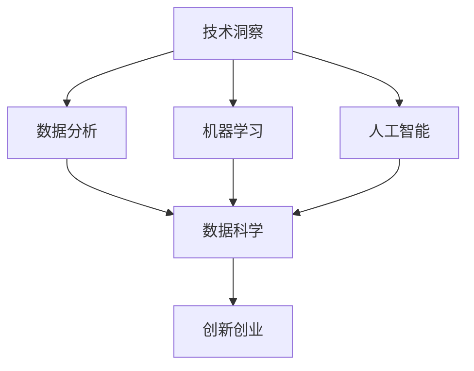

                 

# 利用技术洞察进行创新创业

> 关键词：技术洞察, 创新创业, 人工智能, 机器学习, 数据科学, 企业转型

## 1. 背景介绍

### 1.1 问题由来
在数字化和智能化的大潮下，技术的飞速发展正深刻改变着各行各业的业务模式和经营方式。技术洞察不仅可以帮助企业快速发现市场机会，还能推动企业的创新创业，加速数字化转型，从而在竞争激烈的市场中保持领先优势。

### 1.2 问题核心关键点
技术洞察是企业决策者和领导者基于数据分析、算法模型、机器学习等先进技术手段，对市场环境、行业趋势、用户需求等关键因素进行全面而深入的观察和理解。这种洞察不仅可以帮助企业识别潜在的商业机会，还能指导企业制定切实可行的战略决策，实现创新创业和转型升级。

### 1.3 问题研究意义
理解并掌握技术洞察的方法，对企业来说具有重要意义：
- 提升决策质量：技术洞察提供了数据驱动的决策支持，使决策更加科学、精准。
- 驱动创新创业：通过对市场和行业的深入洞察，企业可以发现新的业务模式和产品形态，激发创新动力。
- 优化业务流程：利用技术洞察识别业务瓶颈，优化运营效率，降低成本。
- 强化竞争力：技术洞察帮助企业构建差异化的竞争优势，提升市场份额和用户满意度。

## 2. 核心概念与联系

### 2.1 核心概念概述

为了更好地理解技术洞察，本节将介绍几个关键概念及其相互之间的联系：

- **技术洞察（Technical Insights）**：基于数据和算法，对市场环境、行业趋势、用户需求等关键因素进行深入观察和理解，形成洞察。
- **数据分析（Data Analysis）**：收集、处理、分析和解读数据，发现数据背后的规律和趋势。
- **机器学习（Machine Learning）**：通过构建模型，从数据中学习规律，进行预测和决策。
- **人工智能（Artificial Intelligence）**：利用算法和数据，模拟人的智能行为和思维过程。
- **数据科学（Data Science）**：综合数据处理、统计学、机器学习、算法优化等技术，解决实际问题。
- **创新创业（Innovation & Entrepreneurship）**：通过技术洞察驱动企业发现新商机，创新产品和服务，实现创业成功。

这些概念之间的关系可以通过以下Mermaid流程图来展示：



这个流程图展示了技术洞察如何通过数据分析、机器学习和人工智能等技术手段，支持企业的创新创业过程。

## 3. 核心算法原理 & 具体操作步骤
### 3.1 算法原理概述

技术洞察的核心在于利用数据和技术手段，深入挖掘和理解市场和行业中的规律和趋势。具体算法原理包括以下几个方面：

- **数据预处理**：清洗、归一化、标准化数据，以便后续分析和建模。
- **特征工程**：提取和构造有意义的特征，为模型训练提供高质量输入。
- **模型构建**：选择合适的算法模型，进行参数优化和模型训练。
- **结果解读**：分析模型输出结果，结合业务经验形成可行的商业洞察。

### 3.2 算法步骤详解

基于技术洞察的算法步骤主要包括以下几个环节：

**Step 1: 数据准备与预处理**
- 收集和整理所需的数据，确保数据的完整性和准确性。
- 清洗数据，去除噪声和缺失值，保证数据质量。
- 进行特征工程，提取和构造有意义的特征。

**Step 2: 模型选择与训练**
- 选择合适的算法模型，如回归模型、分类模型、聚类模型等。
- 设计模型参数，选择适当的损失函数和优化器。
- 使用历史数据对模型进行训练，并进行交叉验证，确保模型泛化能力。

**Step 3: 结果分析与解读**
- 分析模型输出结果，识别关键趋势和模式。
- 结合业务经验和市场知识，形成可行的商业洞察。
- 将洞察转化为具体的商业决策，指导创新创业和业务优化。

**Step 4: 模型部署与监控**
- 将训练好的模型部署到实际应用场景中，进行实时预测和决策。
- 监控模型性能，定期更新模型参数，确保模型持续有效。
- 结合用户反馈和市场变化，不断迭代优化模型，提升洞察准确性。

### 3.3 算法优缺点

技术洞察的算法具有以下优点：
1. 数据驱动：基于大量数据和复杂算法，提供更全面、客观的洞察。
2. 精准预测：利用机器学习模型，进行高精度的预测和决策支持。
3. 灵活应用：算法和模型可以根据具体场景进行灵活调整，适应不同业务需求。
4. 持续优化：模型可以不断更新和迭代，保持洞察的实时性和准确性。

同时，该算法也存在以下局限性：
1. 数据质量依赖：技术洞察依赖高质量的数据，数据偏差可能导致洞察错误。
2. 模型复杂性：复杂算法模型可能存在过拟合问题，需要精心调参和验证。
3. 业务背景需求：技术洞察需结合业务经验和市场知识，缺乏商业洞察可能导致决策失误。
4. 资源投入大：数据预处理、模型训练和部署都需要较大的计算和人力投入。

尽管存在这些局限性，但技术洞察的算法仍然是目前企业获取深入市场洞察的重要手段。未来研究的方向包括：如何降低数据预处理成本、提高模型预测精度、增强算法的可解释性等。

### 3.4 算法应用领域

技术洞察算法已在多个领域得到广泛应用，例如：

- **金融科技**：通过分析交易数据，发现市场趋势，进行风险评估和投资决策。
- **零售电商**：利用用户行为数据，发现消费趋势，优化商品推荐和库存管理。
- **智能制造**：分析生产数据，识别生产瓶颈，优化生产流程，提升生产效率。
- **医疗健康**：分析患者数据，识别疾病模式，辅助医生诊断和治疗决策。
- **物流运输**：利用地理位置数据，优化运输路线，提高配送效率，降低成本。
- **人力资源**：通过员工绩效数据，发现人才需求，优化招聘和培训策略。

## 4. 数学模型和公式 & 详细讲解 & 举例说明

### 4.1 数学模型构建

技术洞察的数学模型构建通常包括以下几个步骤：

1. **数据准备**：收集历史数据，并进行清洗和特征工程。
2. **模型选择**：选择适合的机器学习模型，如线性回归、决策树、随机森林等。
3. **模型训练**：使用历史数据对模型进行训练，并进行交叉验证。
4. **结果评估**：使用测试集对模型进行评估，计算精度、召回率等指标。
5. **模型优化**：根据评估结果，调整模型参数，进行超参数调优。

### 4.2 公式推导过程

以线性回归模型为例，其基本原理是利用最小二乘法，拟合一条直线，使得数据点与直线的误差最小。假设模型为 $y = \theta_0 + \theta_1 x_1 + \theta_2 x_2 + ... + \theta_n x_n$，其中 $y$ 为因变量，$x_1, x_2, ..., x_n$ 为自变量，$\theta_0, \theta_1, ..., \theta_n$ 为模型参数。

线性回归模型的损失函数为：

$$
L(\theta) = \frac{1}{2m} \sum_{i=1}^m (y_i - \hat{y}_i)^2
$$

其中 $m$ 为样本数量，$\hat{y}_i = \theta_0 + \theta_1 x_{1,i} + \theta_2 x_{2,i} + ... + \theta_n x_{n,i}$ 为模型对样本 $i$ 的预测值。

最小二乘法目标是最小化损失函数，求解模型参数 $\theta_0, \theta_1, ..., \theta_n$。

### 4.3 案例分析与讲解

假设某电商公司想要分析用户购买行为，预测下一季度销售额。收集了过去一年用户的购买记录、年龄、性别、消费金额等数据，构建了如下线性回归模型：

$$
\hat{y} = \theta_0 + \theta_1 \text{Age} + \theta_2 \text{Gender} + \theta_3 \text{Amount}
$$

其中 $y$ 为销售额，$\text{Age}$、$\text{Gender}$、$\text{Amount}$ 分别为用户的年龄、性别、消费金额，$\theta_0, \theta_1, \theta_2, \theta_3$ 为模型参数。

使用历史数据对模型进行训练，计算出 $\theta_0, \theta_1, \theta_2, \theta_3$ 的值。然后将模型应用于新季度数据，预测销售额，并进行结果评估，确保模型准确性。

## 5. 项目实践：代码实例和详细解释说明

### 5.1 开发环境搭建

在进行技术洞察项目实践前，我们需要准备好开发环境。以下是使用Python进行Scikit-learn开发的环境配置流程：

1. 安装Anaconda：从官网下载并安装Anaconda，用于创建独立的Python环境。

2. 创建并激活虚拟环境：
```bash
conda create -n insights-env python=3.8 
conda activate insights-env
```

3. 安装Scikit-learn：
```bash
conda install scikit-learn
```

4. 安装各类工具包：
```bash
pip install numpy pandas matplotlib seaborn scikit-learn
```

5. 安装Jupyter Notebook：
```bash
pip install jupyter notebook
```

完成上述步骤后，即可在`insights-env`环境中开始技术洞察项目的开发。

### 5.2 源代码详细实现

以下是一个简单的技术洞察项目示例，利用Scikit-learn进行线性回归分析：

```python
from sklearn.linear_model import LinearRegression
from sklearn.metrics import mean_squared_error
import pandas as pd
import numpy as np
import matplotlib.pyplot as plt

# 准备数据
data = pd.read_csv('sales_data.csv')

# 数据清洗和特征工程
data = data.dropna()
X = data[['Age', 'Gender', 'Amount']]
y = data['Sales']

# 模型训练和评估
model = LinearRegression()
model.fit(X, y)
y_pred = model.predict(X)
mse = mean_squared_error(y, y_pred)
rmse = np.sqrt(mse)

# 结果可视化
plt.scatter(X['Age'], y)
plt.plot(X['Age'], y_pred, color='red')
plt.title('Sales Forecasting')
plt.xlabel('Age')
plt.ylabel('Sales')
plt.show()

print(f'RMSE: {rmse:.2f}')
```

### 5.3 代码解读与分析

让我们再详细解读一下关键代码的实现细节：

**数据准备**：
- `pd.read_csv('sales_data.csv')`：读取历史销售数据，构建数据框架。
- `data.dropna()`：删除缺失数据，保证数据完整性。

**特征工程**：
- `X = data[['Age', 'Gender', 'Amount']]`：选择关键特征，构建模型输入。
- `y = data['Sales']`：定义因变量，即销售额。

**模型训练和评估**：
- `model = LinearRegression()`：创建线性回归模型。
- `model.fit(X, y)`：使用历史数据对模型进行训练。
- `y_pred = model.predict(X)`：预测新数据。
- `mean_squared_error(y, y_pred)`：计算预测误差。
- `np.sqrt(mse)`：计算均方根误差（RMSE）。

**结果可视化**：
- `plt.scatter(X['Age'], y)`：绘制实际销售数据。
- `plt.plot(X['Age'], y_pred, color='red')`：绘制预测销售数据。
- `plt.title()`、`plt.xlabel()`、`plt.ylabel()`：设置图表标题和坐标轴标签。
- `plt.show()`：显示图表。

**结果输出**：
- `print(f'RMSE: {rmse:.2f}')`：输出预测误差（RMSE）。

可以看到，Scikit-learn提供了丰富的机器学习算法和工具，方便开发者进行技术洞察项目的开发。

### 5.4 运行结果展示

在实际应用中，技术洞察的输出结果通常包括：

- **预测值**：模型对未来数据的预测结果。
- **误差指标**：如均方误差、均方根误差、R平方值等，用于评估模型性能。
- **趋势图**：预测结果与实际数据的对比图表，直观展示预测趋势。

## 6. 实际应用场景

### 6.1 金融风险管理

技术洞察在金融领域的应用非常广泛。通过对历史交易数据的分析，可以发现市场趋势和异常行为，进行风险评估和预警。

在实践中，银行和金融机构可以利用技术洞察算法，分析客户交易数据，发现高风险账户和异常交易，及时采取风险控制措施。同时，利用预测模型对市场趋势进行预测，进行投资组合优化，提高投资收益。

### 6.2 电商个性化推荐

技术洞察在电商行业的应用也非常成功。通过对用户购买行为和偏好的深入分析，可以发现用户需求，进行个性化推荐，提升用户体验和销售额。

在实践中，电商平台可以利用技术洞察算法，分析用户行为数据，构建用户画像，推荐个性化商品。同时，利用预测模型对用户行为进行预测，进行库存管理，优化供应链。

### 6.3 智能制造优化

技术洞察在制造业的应用前景广阔。通过对生产数据的深入分析，可以发现生产瓶颈，进行生产流程优化，提升生产效率。

在实践中，制造企业可以利用技术洞察算法，分析生产数据，识别生产瓶颈，优化生产流程，提升生产效率。同时，利用预测模型对生产数据进行预测，进行资源分配，优化生产计划。

### 6.4 未来应用展望

随着技术洞察算法的不断发展，未来的应用场景将更加广泛：

- **智能医疗**：利用技术洞察算法，分析患者数据，进行疾病预测和诊断，提升医疗服务质量。
- **智慧城市**：利用技术洞察算法，分析城市运行数据，进行交通管理、公共安全等决策，提升城市管理水平。
- **智能物流**：利用技术洞察算法，分析物流数据，优化配送路线，降低成本，提升配送效率。
- **智能制造**：利用技术洞察算法，分析生产数据，进行资源优化和预测，提升生产效率。
- **金融科技**：利用技术洞察算法，分析市场数据，进行投资决策和风险控制，提升投资收益。
- **电商零售**：利用技术洞察算法，分析用户行为数据，进行个性化推荐，提升用户体验和销售额。

## 7. 工具和资源推荐

### 7.1 学习资源推荐

为了帮助开发者系统掌握技术洞察的理论基础和实践技巧，这里推荐一些优质的学习资源：

1. **《Python数据分析与统计学习》**：介绍数据分析和机器学习的核心概念和算法，适合初学者入门。
2. **《统计学习方法》**：介绍统计学习的基本方法和算法，适合对机器学习有深入需求的读者。
3. **《数据科学实战》**：介绍数据科学的核心技术和工具，适合实战型读者。
4. **Kaggle**：数据科学竞赛平台，提供大量数据集和案例，方便开发者实践和交流。
5. **Coursera**：在线课程平台，提供各种数据科学和机器学习课程，适合系统学习。
6. **Scikit-learn官方文档**：提供丰富的算法介绍和代码示例，适合深入学习。

通过对这些资源的学习实践，相信你一定能够快速掌握技术洞察的精髓，并用于解决实际的业务问题。

### 7.2 开发工具推荐

高效的开发离不开优秀的工具支持。以下是几款用于技术洞察开发的常用工具：

1. **Scikit-learn**：基于Python的机器学习库，提供了丰富的算法和工具，适合进行数据分析和模型训练。
2. **TensorFlow**：由Google主导的深度学习框架，适合进行复杂模型的训练和部署。
3. **PyTorch**：灵活的深度学习框架，适合进行快速迭代和实验。
4. **Jupyter Notebook**：交互式开发环境，方便进行代码编写和可视化。
5. **DataStudio**：数据可视化工具，方便进行图表展示和数据探索。
6. **AWS SageMaker**：云平台上的机器学习服务，方便进行模型部署和监控。

合理利用这些工具，可以显著提升技术洞察项目的开发效率，加快创新迭代的步伐。

### 7.3 相关论文推荐

技术洞察的研究源于学界的持续研究。以下是几篇奠基性的相关论文，推荐阅读：

1. **《数据驱动的商业洞察》**：介绍如何利用大数据技术进行商业洞察，提高决策质量。
2. **《基于机器学习的市场预测》**：介绍如何利用机器学习算法进行市场预测和决策支持。
3. **《深度学习在金融风险管理中的应用》**：介绍深度学习在金融风险管理中的应用和算法。
4. **《智能制造中的数据分析与优化》**：介绍智能制造中的数据分析和优化方法。
5. **《电商个性化推荐算法》**：介绍电商个性化推荐算法的实现和优化。

这些论文代表了大规模数据分析和机器学习的应用趋势，为技术洞察提供了理论和实践的指导。

## 8. 总结：未来发展趋势与挑战

### 8.1 总结

本文对利用技术洞察进行创新创业的方法进行了全面系统的介绍。首先阐述了技术洞察在企业决策和创新创业中的重要性，明确了技术洞察在驱动企业转型和优化业务流程中的独特价值。其次，从原理到实践，详细讲解了技术洞察的数学模型和算法步骤，给出了技术洞察项目开发的完整代码实例。同时，本文还广泛探讨了技术洞察算法在金融、电商、制造等各个行业领域的应用前景，展示了技术洞察算法的广泛适用性和巨大潜力。最后，本文精选了技术洞察的相关学习资源和工具推荐，力求为读者提供全方位的技术指引。

通过本文的系统梳理，可以看到，技术洞察算法在企业和行业中的广泛应用，显著提高了决策质量、优化了业务流程、驱动了创新创业。未来，随着数据技术的不断进步，技术洞察将迎来更多的新应用场景和创新方向，推动企业实现数字化、智能化转型，构建更加智慧的业务生态。

### 8.2 未来发展趋势

展望未来，技术洞察算法的发展趋势将呈现以下几个方向：

1. **智能化决策支持**：随着人工智能技术的进步，技术洞察将进一步向智能化、自动化的方向发展，提供更加精准的决策支持。
2. **实时数据处理**：随着物联网和大数据技术的发展，实时数据采集和处理能力将进一步提升，技术洞察将能够实时响应市场和业务变化。
3. **跨领域融合**：技术洞察将更多地与其他先进技术进行融合，如区块链、云计算、物联网等，构建更加全面、智能的业务生态。
4. **个性化定制**：技术洞察将更加注重用户个性化需求，提供定制化的解决方案，提升用户体验和满意度。
5. **全球化布局**：技术洞察将更多地服务于全球市场，提供国际化的业务支持和决策指导。

这些趋势将使得技术洞察算法在未来的企业决策和创新创业中发挥更大的作用，推动企业的数字化、智能化转型。

### 8.3 面临的挑战

尽管技术洞察算法已经取得了显著成就，但在迈向更加智能化、普适化应用的过程中，仍面临诸多挑战：

1. **数据质量和完整性**：技术洞察依赖高质量的数据，数据不完整或存在偏差可能导致洞察结果不准确。
2. **算法复杂性和成本**：复杂算法模型需要较多的计算资源和人力投入，成本较高。
3. **业务理解和应用**：技术洞察需结合业务经验和市场知识，缺乏商业洞察可能导致决策失误。
4. **模型可解释性**：技术洞察算法通常是"黑盒"系统，缺乏可解释性，难以进行调试和优化。
5. **隐私和安全**：在处理敏感数据时，需要确保数据隐私和安全，防止数据泄露和滥用。

这些挑战需要企业从数据治理、技术创新、业务协同等多个方面进行综合应对，才能更好地发挥技术洞察的潜力。

### 8.4 研究展望

未来的技术洞察研究将在以下几个方向进行突破：

1. **提高数据质量**：通过数据清洗、数据增强、数据融合等手段，提高数据质量和完整性，确保洞察结果的准确性。
2. **简化算法模型**：开发更高效、更轻量级的算法模型，降低计算和人力成本，提升实时处理能力。
3. **增强可解释性**：通过可解释性算法和可视化工具，增强模型的可解释性，方便用户理解和使用。
4. **促进跨领域融合**：加强与其他先进技术的融合，如人工智能、物联网、区块链等，构建更加智能、全面的业务生态。
5. **实现全球化布局**：通过技术洞察算法，支持全球化市场，提供国际化的业务支持和决策指导。

这些研究方向的探索将使得技术洞察算法在未来的企业决策和创新创业中发挥更大的作用，推动企业的数字化、智能化转型。

## 9. 附录：常见问题与解答

**Q1: 技术洞察在企业中具体如何应用？**

A: 技术洞察在企业中的应用主要体现在以下几个方面：
1. **决策支持**：通过数据分析和模型训练，提供数据驱动的决策支持，提升决策质量。
2. **业务优化**：利用数据分析和优化算法，优化业务流程，降低成本，提升效率。
3. **市场分析**：通过市场数据分析，发现市场趋势和机会，进行市场预测和决策。
4. **客户洞察**：通过客户数据分析，发现客户需求和行为，进行个性化营销和推荐。
5. **风险控制**：通过风险数据分析，进行风险评估和预警，控制业务风险。

**Q2: 如何选择合适的技术洞察算法？**

A: 选择合适的技术洞察算法需要考虑多个因素，包括数据类型、业务需求、算法复杂性等。
1. **数据类型**：根据数据类型选择相应的算法，如回归、分类、聚类等。
2. **业务需求**：根据业务需求选择相应的算法，如预测、分类、聚类等。
3. **算法复杂性**：根据计算资源和人力成本选择相应的算法，如线性回归、随机森林等。
4. **业务理解**：结合业务经验和市场知识，选择适合企业的算法，如时间序列预测、客户细分等。

**Q3: 技术洞察算法的计算资源和人力成本如何控制？**

A: 控制技术洞察算法的计算资源和人力成本需要从以下几个方面进行优化：
1. **数据预处理**：优化数据清洗和特征工程，减少数据处理成本。
2. **算法优化**：选择高效的算法模型，如线性回归、随机森林等，降低计算成本。
3. **模型部署**：使用高效的部署工具和平台，如TensorFlow、PyTorch等，提高模型部署效率。
4. **团队协作**：建立跨部门的数据团队，加强协作，提升数据处理和算法开发效率。
5. **自动化工具**：使用自动化工具，如Jupyter Notebook、Scikit-learn等，提升开发效率。

**Q4: 技术洞察算法在企业中如何落地应用？**

A: 技术洞察算法在企业中的落地应用主要包括以下几个步骤：
1. **数据收集和清洗**：收集和处理数据，保证数据质量和完整性。
2. **特征工程和模型选择**：选择适合的算法模型，进行特征工程和模型训练。
3. **模型评估和优化**：评估模型性能，进行模型调优和优化。
4. **结果解读和应用**：结合业务经验和市场知识，解读模型结果，指导业务决策和应用。
5. **持续监控和迭代**：监控模型性能，定期更新模型，确保洞察结果的持续有效性。

**Q5: 技术洞察算法的成功应用需要哪些关键因素？**

A: 技术洞察算法的成功应用需要以下几个关键因素：
1. **数据质量**：高质量的数据是技术洞察的基础，需要保证数据的完整性、准确性和一致性。
2. **算法选择**：选择适合企业的算法模型，进行模型训练和优化。
3. **业务理解**：结合业务经验和市场知识，解读模型结果，指导业务决策。
4. **团队协作**：建立跨部门的数据团队，加强协作，提升数据处理和算法开发效率。
5. **持续优化**：定期更新模型，确保洞察结果的持续有效性。

总之，技术洞察算法的成功应用需要企业从数据、算法、团队、业务等多个方面进行全面优化，才能发挥其最大潜力，推动企业创新创业和数字化转型。

---

作者：禅与计算机程序设计艺术 / Zen and the Art of Computer Programming

